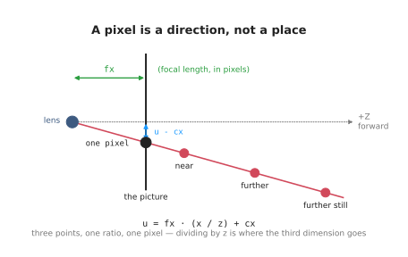

# robotics-basics

Small, runnable examples for learning robotics with ROS 2 on a Mac.

ROS is the Robot Operating System, a set of libraries and tools for writing
robot software. RViz, short for ROS Visualization, is the 3D viewer that comes
with it. This project uses ROS 2, the current version.

```
make setup    # the first run downloads ROS 2, a few gigabytes
make          # list everything you can run
```

## Areas

The repo is split into areas. Each one is a topic you can work through on its
own, with its own code, its own doc, and two or three commands.

| Area | What it covers | Start with |
| --- | --- | --- |
| [ros](docs/01_ros/01_ros-intro.md) | the basics of ROS, one program per idea, then a camera, an arm, and the two together | `make ros.basics` |
| [rviz](docs/02_rviz/01_overview.md) | markers, frames and the 3D viewer | `make rviz.demo` |
| [arm](docs/03_arm/01_overview.md) | position, frames and transforms | `make arm.learn` |
| [camera](docs/05_camera/01_basics.md) | how a camera works, then a depth camera in Gazebo that finds a box | `make camera.one_box` |
| [numpy](docs/04_numpy/01_numpy-intro.md) | the parts of NumPy robotics code uses most: arrays, masks, transforms, grids | `make numpy.learn` |
| [finding objects](docs/05_camera/02_finding-objects.md) | finding a thing in a picture: by colour, with depth, and with a trained model | `make camera.colour` |
| [object perception](docs/06_object-perception/01_overview.md) | finding an object and measuring it: every technique, model and licence, compared | — |
| [gripping](docs/07_gripping/01_overview.md) | how to hold a thing once you have found it: grippers, grasp choice, force and slip | — |
| [arm movement](docs/08_arm-movement/01_overview.md) | getting there and back: reach, planning, control, and what makes a move fail | — |

<p align="center">
  
  
  
</p>

New to this? Start with **ros**, which explains what ROS is: first one small
program for each thing ROS does — a node, a topic, a parameter, a service, an
action, a frame, a launch file — and then three worked examples, one that works
with a camera, one that moves an arm, and one that uses both. Then **rviz**, which shows you what
you are looking at before the arm area explains the maths behind it. Then
**arm**, then **camera**, which uses that maths to turn a picture into points.
The camera code is mostly NumPy, so if NumPy is new to you, read **numpy** before
**camera**; it needs no ROS, and each of its five files runs on its own.

## Beyond the areas

**[Gripping](docs/07_gripping/01_overview.md)** and
**[arm movement](docs/08_arm-movement/01_overview.md)** carry on from there, in
six documents each and the same shape. Gripping covers the gripper families and
their real numbers, choosing a grasp by geometry, the models that choose one for
you, holding on once you have it, and a document that works the whole area
through on the two-finger gripper most arms actually carry. Arm movement covers reach and
reachability, planning a path, controlling the move, learned motion, and the
failures that are invisible until they happen — a straight line between two
reachable poses that is itself unreachable, a controller shipping with its
tolerances set to zero, a grasp choice that quietly makes the place impossible.

**[Object perception](docs/06_object-perception/01_overview.md)** is the question
every arm project runs into: what is this thing and which pixels is it on, and
then how big is it and which way is it turned. Seven documents — the map, the
sensors, the methods you write yourself, the models that find, the models that
measure, the licences and platforms, and how to tell whether any of it works. Every technique carries five jobs it
suits and five it does not, every licence was read from the project's own licence
file, and everything says whether it runs on a Mac. Read it after the camera
area.

**[Tools and libraries](docs/09_tools-and-libraries.md)** is a map of the main
tools used with arms mounted on a table: ROS 2, URDF, MoveIt, ros2_control,
simulators, perception, calibration and more. For each it explains the job it
does, then shows pseudo code and a few lines of real code. Read it after the
areas, when you want to know what to reach for next.

**[Two-arm manipulation](docs/13_two-arm-manipulation.md)** is a route into
bimanual work, in five steps from "make two arms move" to "a long task, measured
properly", using only projects whose code, simulator and data are all open. It
says which ones run on this Mac, which need a Linux box with an NVIDIA card, and
which well-known ones are not as open as they look.

**[Stone stacking](docs/12_stone-stacking.md)** takes one hard two-arm task —
balancing rough stones on top of each other — and walks through how such a
system is built: what makes a stack stand up, what the second arm is for, the
loop the robot runs once per stone, and which open frameworks do each stage. A
map of the process, not code.

**[One-arm training](docs/10_one-arm-training/01_overview.md)** is the map above all of
these: every way to programme or train a single arm, as a family tree, with a grid
comparing eight families point by point, the mixes real systems actually use, and a
table of which to reach for when. It ends with an evidenced look at what is
realistic to build — and to be paid for — in the next year. Start here.

Two companions to it: **[a learning path](docs/10_one-arm-training/04_learning-path.md)**
is five complete simulation projects on MuJoCo and Gazebo — from tidying a desk to
learning a task from video of your own hand — each built four times, from
hand-written code up to the current frontier, with the reason for every framework;
and
**[what is changing, and why](docs/10_one-arm-training/05_what-is-changing.md)** explains
the direction of travel and the reasons behind it, which outlast any particular
model name. There is also a
**[glossary](docs/10_one-arm-training/06_glossary.md)** covering every term in that
folder, from what a degree of freedom is to what ACT and diffusion policy are.

**[A case study](docs/10_one-arm-training/07_case-study/01_place-glass.md)** in the same
folder builds one household job four times over: pick up the *empty* glasses on a
table, turn each one over, and stand it mouth-down on a drying rack. It says what
makes that hard — a transparent object, a 180-degree turn, a fragile rim, and water
that has to be spotted before the turn — and then names the tool for each part, from
the segmentation model to the planner to the force loop.

**[Two-arm training](docs/11_two-arm-training/01_overview.md)** is the companion folder
for what changes when two arms must **cooperate** on one job: whether your task
needs a second arm at all, the two ways the arms can be coupled, and what that does
to every method. Two arms doing unrelated things in one cell are deliberately out of
scope — that is the one-arm problem, twice.

## How the docs are ordered

Everything in `docs/` is numbered in the order it is meant to be read, both the
folders and the files inside them. So `docs/01_ros/` comes before `docs/03_arm/`,
and inside a folder `01_overview.md` comes before `02_programmed-methods.md`. You do
not have to guess where to start.

## Layout

```
Makefile              every command
pixi.toml             what to install
docs/NN_<area>/       the docs for each area, numbered in reading order
docs/images/<area>/   its pictures (not numbered: nobody reads these in order)
docs/diagrams/        the scripts that draw them
src/                  the code for each area:
  ros/ros_basics/       one small program for each thing ROS is used for
  ros/ros_applied/      the three worked ROS examples, one package each
  camera/camera_basics/    finding an object by colour, by depth, and with a model
  camera/camera_applied/   the Gazebo depth camera that finds and measures a box
  numpy/                five plain Python files, not a ROS package
  rviz_basics/          a marker in a moving frame
  arm_transforms/       position, frames and transforms, in five steps
```

## Repo-wide commands

```
make build     rebuild everything
make test      run every test
make lint      check code style
make shell     a shell with ROS ready, for typing ros2 commands
make doctor    print versions of everything that matters
```
