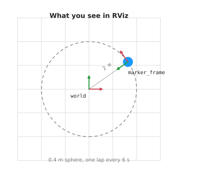

# robotics-basics

Small, runnable examples for learning robotics with ROS 2 on a Mac.

ROS is the Robot Operating System, a set of libraries and tools for writing
robot software. RViz, short for ROS Visualization, is the 3D viewer that comes
with it. This project uses ROS 2, the current version.

```
make setup    # the first run downloads ROS 2, a few gigabytes
make          # list everything you can run
```

## Areas

The repo is split into areas. Each one is a topic you can work through on its
own, with its own code, its own doc, and two or three commands.

| Area | What it covers | Start with |
| --- | --- | --- |
| [rviz](docs/rviz/overview.md) | markers, frames and the 3D viewer | `make rviz.demo` |
| [arm](docs/arm/overview.md) | position, frames and transforms | `make arm.learn` |

<p align="center">
  
  
</p>

New to this? Start with **rviz**. It is the easier of the two, and it shows you
what you are looking at before the arm area explains the maths behind it.

## Layout

```
Makefile              every command
pixi.toml             what to install
docs/<area>/          the doc for each area
docs/images/<area>/   its pictures
docs/diagrams/        the scripts that draw them
src/<package>/        the code for each area
```

## Repo-wide commands

```
make build     rebuild everything
make test      run every test
make lint      check code style
make shell     a shell with ROS ready, for typing ros2 commands
make doctor    print versions of everything that matters
```
