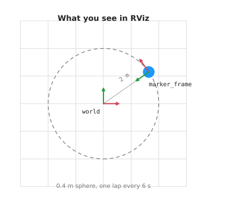
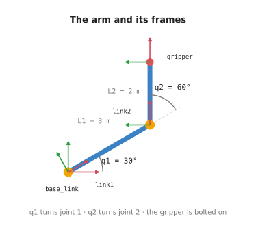
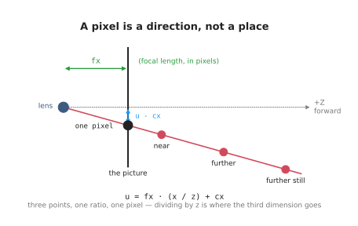

# robotics-basics

Small, runnable examples for learning robotics with ROS 2 on a Mac.

ROS is the Robot Operating System, a set of libraries and tools for writing
robot software. RViz, short for ROS Visualization, is the 3D viewer that comes
with it. This project uses ROS 2, the current version.

The repo has three folders:

- `docs/` holds the docs, numbered in reading order.
- `code/` holds the runnable examples and the pixi environment. Every `make` and
  `pixi` command, here and in the docs, is run from inside `code/`.
- `website/` holds a Next.js site that presents the docs as six mini books. It
  reads `docs/` directly, so it never needs its own copy.

```
cd code
make setup    # the first run downloads ROS 2, a few gigabytes
make          # list everything you can run
```

To read the docs in the browser:

```
cd website
npm install
npm run dev   # http://localhost:3000
```

## Areas

The repo is split into areas. Each one is a topic you can work through on its
own, with its own code, its own doc, and two or three commands.

| Area | What it covers | Start with |
| --- | --- | --- |
| [python](docs/01_robotics-intro/01_python-and-numpy/01_python-basics.md) | the Python a beginner needs for robot arm code | `make python.learn` |
| [numpy](docs/01_robotics-intro/01_python-and-numpy/02_numpy-intro.md) | the parts of NumPy robotics code uses most: arrays, masks, transforms, grids | `make numpy.learn` |
| [maths](docs/01_robotics-intro/02_maths/01_angles-and-trigonometry.md) | angles, trigonometry, vectors and matrices, explained on a robot arm | `make maths.learn` |
| [arm](docs/01_robotics-intro/03_arm/01_overview.md) | position, frames and transforms, in 2D and then 3D | `make arm.learn` |
| [kinematics](docs/01_robotics-intro/04_kinematics/01_forward-kinematics.md) | forward and inverse kinematics: joint angles to gripper position, and back, then moving between poses | `make kinematics.learn` |
| [arm types](docs/01_robotics-intro/05_arm-types/01_joints-and-degrees-of-freedom.md) | joints, degrees of freedom, five common arms, and the six-joint arm in detail | `make arms.learn` |
| [ros](docs/04_ros-and-rviz/01_ros/01_ros-intro.md) | the basics of ROS, one program per idea, then a camera, an arm, the two together, and the arm's frames in TF | `make ros.basics` |
| [rviz](docs/04_ros-and-rviz/02_rviz/01_overview.md) | markers, frames and the 3D viewer | `make rviz.demo` |
| [camera](docs/02_perception/01_camera/01_basics.md) | how a camera works, then a depth camera in Gazebo that finds a box | `make camera.one_box` |
| [finding objects](docs/02_perception/01_camera/02_finding-objects.md) | finding a thing in a picture: by colour, with depth, and with a trained model | `make camera.colour` |
| [object perception](docs/02_perception/02_object-perception/01_overview.md) | finding an object and measuring it: every technique, model and licence, compared | — |
| [gripping](docs/03_frameworks/02_gripping/01_overview.md) | how to hold a thing once you have found it: grippers, grasp choice, force and slip | — |
| [arm movement](docs/03_frameworks/03_arm-movement/01_overview.md) | getting there and back: reach, planning, control, and what makes a move fail | — |
| [the frontier](docs/03_frameworks/08_frontier/01_overview.md) | what actually changed in robot arms in 2026, and what is coming | — |

<p align="center">
  
  
  
</p>

New to this? Start with Book 1, which assumes you know nothing about robots. It
starts with **python** and **numpy**, the language robot code is written in. Then
**maths** covers the angles, vectors and matrices an arm needs, explained on an
arm rather than in the abstract. Then **arm** builds frames and transforms, and
**kinematics** uses them to turn joint angles into a gripper position and back.
Book 1 ends with **arm types**: how joints work together, five common kinds of
arm, and the six-joint arm in detail. None of Book 1 needs ROS (Robot Operating
System).

**ros** and **rviz** are in Book 4. They explain what ROS is, one small program
for each thing ROS does, then three worked examples, and the 3D viewer. Read
them before the **camera** area, which runs on ROS.

## Beyond the areas

**[Gripping](docs/03_frameworks/02_gripping/01_overview.md)** and
**[arm movement](docs/03_frameworks/03_arm-movement/01_overview.md)** carry on from there, in
six documents each and the same shape. Gripping covers the gripper families and
their real numbers, choosing a grasp by geometry, the models that choose one for
you, holding on once you have it, and a document that works the whole area
through on the two-finger gripper most arms actually carry. Arm movement covers reach and
reachability, planning a path, controlling the move, learned motion, and the
failures that are invisible until they happen — a straight line between two
reachable poses that is itself unreachable, a controller shipping with its
tolerances set to zero, a grasp choice that quietly makes the place impossible.

**[Object perception](docs/02_perception/02_object-perception/01_overview.md)** is the question
every arm project runs into: what is this thing and which pixels is it on, and
then how big is it and which way is it turned. Seven documents — the map, the
sensors, the methods you write yourself, the models that find, the models that
measure, the licences and platforms, and how to tell whether any of it works. Every technique carries five jobs it
suits and five it does not, every licence was read from the project's own licence
file, and everything says whether it runs on a Mac. Read it after the camera
area.

**[Tools and libraries](docs/03_frameworks/01_tools-and-libraries.md)** is a map of the main
tools used with arms mounted on a table: ROS 2, URDF, MoveIt, ros2_control,
simulators, perception, calibration and more. For each it explains the job it
does, then shows pseudo code and a few lines of real code. Read it after the
areas, when you want to know what to reach for next.

**[Two-arm manipulation](docs/03_frameworks/06_two-arm-manipulation.md)** is a route into
bimanual work, in five steps from "make two arms move" to "a long task, measured
properly", using only projects whose code, simulator and data are all open. It
says which ones run on this Mac, which need a Linux box with an NVIDIA card, and
which well-known ones are not as open as they look.

**[Stone stacking](docs/03_frameworks/07_stone-stacking.md)** takes one hard two-arm task —
balancing rough stones on top of each other — and walks through how such a
system is built: what makes a stack stand up, what the second arm is for, the
loop the robot runs once per stone, and which open frameworks do each stage. A
map of the process, not code.

**[The frontier](docs/03_frameworks/08_frontier/01_overview.md)** is the record of what
actually changed in 2026, in six documents: foundation models, where data comes
from, simulation and evaluation, hardware, and what is coming in 2027. Every item
says whether you can obtain it, every licence was read from the licence file, and
every development says what it still cannot do. It is dated on purpose.

**[One-arm training](docs/03_frameworks/04_one-arm-training/01_overview.md)** is the map above all of
these: every way to programme or train a single arm, as a family tree, with a grid
comparing eight families point by point, the mixes real systems actually use, and a
table of which to reach for when. It ends with an evidenced look at what is
realistic to build — and to be paid for — in the next year. Start here.

Two companions to it: **[a learning path](docs/03_frameworks/04_one-arm-training/04_learning-path.md)**
is five complete simulation projects on MuJoCo and Gazebo — from tidying a desk to
learning a task from video of your own hand — each built four times, from
hand-written code up to the current frontier, with the reason for every framework;
and
**[what is changing, and why](docs/03_frameworks/04_one-arm-training/05_what-is-changing.md)** explains
the direction of travel and the reasons behind it, which outlast any particular
model name. There is also a
**[glossary](docs/03_frameworks/04_one-arm-training/06_glossary.md)** covering every term in that
folder, from what a degree of freedom is to what ACT and diffusion policy are.

**[A case study](docs/03_frameworks/04_one-arm-training/07_case-study/01_place-glass.md)** in the same
folder builds one household job four times over: pick up the *empty* glasses on a
table, turn each one over, and stand it mouth-down on a drying rack. It says what
makes that hard — a transparent object, a 180-degree turn, a fragile rim, and water
that has to be spotted before the turn — and then names the tool for each part, from
the segmentation model to the planner to the force loop.

**[Two-arm training](docs/03_frameworks/05_two-arm-training/01_overview.md)** is the companion folder
for what changes when two arms must **cooperate** on one job: whether your task
needs a second arm at all, the two ways the arms can be coupled, and what that does
to every method. Two arms doing unrelated things in one cell are deliberately out of
scope — that is the one-arm problem, twice.

**[Programming techniques](docs/05_programming-techniques/01_what-techniques-are/01_programmed-not-learned.md)**
is Book 5: the written, language-independent techniques that arm software is
built from. After a short introduction and
[a map of all of them](docs/05_programming-techniques/01_what-techniques-are/04_the-map-of-techniques.md),
it covers 34 techniques in seven groups — geometry and cameras, searching and
matching, fitting and estimation, image and point cloud processing, planning
and search, control and motion, and decisions and task logic. Each group puts
the most used techniques first and the ones used less often second. Each page
works a real example, says where the technique is used on an arm and where it
fails, and lists the libraries that already provide it.

**[Neural network models](docs/06_neural-network-models/01_what-models-are/01_what-a-model-is.md)**
is Book 6, and it assumes you have never met a model. Its first chapter explains
what a model is, how one learns from examples, what is inside a neural network,
where the training data comes from, and what changes when a model runs on a
robot. [The map of models](docs/06_neural-network-models/01_what-models-are/09_the-map-of-models.md)
then splits the field into seven families — models that see, that work in 3D,
that choose a grasp, that move the arm, that understand words, that predict
what happens next, and that make sense of touch and force — and each family has
an overview page and one page per kind of model, with diagrams on every page The
most used kinds come first in each family, then the ones used less often.

## How the docs are ordered

The docs are grouped into six mini books, the same ones the website shows:

```
docs/01_robotics-intro/   robot arm basics: Python, NumPy, maths, frames, kinematics, arm types
docs/02_perception/       cameras, and finding and measuring objects
docs/03_frameworks/       tools and simulators, gripping, arm movement, training arms
docs/04_ros-and-rviz/     ROS and the RViz 3D viewer
docs/05_programming-techniques/ the algorithms arm software is built from
docs/06_neural-network-models/  every kind of neural network model a robot arm uses
```

Everything is numbered in the order it is meant to be read: the books, the chapter
folders inside them, and the files inside those. So `01_robotics-intro/01_python-and-numpy/`
comes before `01_robotics-intro/03_arm/`, and inside a folder `01_overview.md`
comes before `02_programmed-methods.md`. You do not have to guess where to start.

## Layout

```
docs/NN_<book>/NN_<area>/  the docs, as book / chapter / section, in reading order
docs/images/<area>/   its pictures (not numbered: nobody reads these in order)
docs/diagrams/        the scripts that draw them
code/Makefile         every command
code/pixi.toml        what to install
code/src/             the code for each area:
  ros/ros_basics/       one small program for each thing ROS is used for
  ros/ros_applied/      the three worked ROS examples, one package each
  camera/camera_basics/    finding an object by colour, by depth, and with a model
  camera/camera_applied/   the Gazebo depth camera that finds and measures a box
  python_basics/        the Python a beginner needs, plain Python files
  numpy/                five plain Python files, not a ROS package
  maths/                angles, vectors and matrices, plain Python files
  kinematics/           forward and inverse kinematics, plain Python files
  arm_types/            joints, and the six-joint arm, plain Python files
  rviz_basics/          a marker in a moving frame
  arm_transforms/       position, frames and transforms, in five steps
website/              the Next.js site that shows docs/ as six mini books
```

## Repo-wide commands

Run these from `code/`.

```
make build     rebuild everything
make test      run every test
make lint      check code style
make shell     a shell with ROS ready, for typing ros2 commands
make doctor    print versions of everything that matters
```
