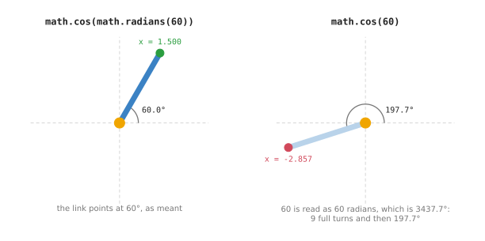
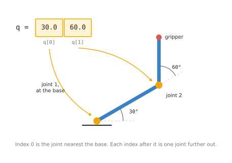
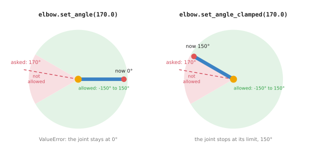

# The Python you need for a robot arm

This doc teaches the small part of Python that the rest of this book uses. It is
for a reader who knows nothing about robots and has written little or no Python.
By the end you can hold an arm's joint angles in a list, write a function that
turns an angle into a position, loop over every joint of an arm, and keep a
joint's limits next to its angle in a class.

Every example is about a robot arm. Most of them use the same arm as the
[frames and transforms doc](../03_arm/01_overview.md): two joints, a first link
3 m long and a second link 2 m long. The numbers you meet here will come back
there.

The doc does not try to teach all of Python. It leaves out everything the next
chapters do not use. When you finish it, the next doc is
[NumPy for robotics](02_numpy-intro.md), which covers the library that does
robot maths quickly.

## Contents

1. [What Python is, and why robot code uses it](#1-what-python-is-and-why-robot-code-uses-it)
2. [The three files, and how to run them](#2-the-three-files-and-how-to-run-them)
3. [Numbers and names](#3-numbers-and-names)
4. [Degrees and radians](#4-degrees-and-radians)
5. [Lists: every joint angle in one value](#5-lists-every-joint-angle-in-one-value)
6. [Dicts: link lengths looked up by name](#6-dicts-link-lengths-looked-up-by-name)
7. [f-strings: printing a position](#7-f-strings-printing-a-position)
8. [Functions: one link's end](#8-functions-one-links-end)
9. [Loops: walking out along the arm](#9-loops-walking-out-along-the-arm)
10. [if: can the arm reach it?](#10-if-can-the-arm-reach-it)
11. [Classes: a joint that knows its limits](#11-classes-a-joint-that-knows-its-limits)
12. [Type hints](#12-type-hints)
13. [What comes next](#13-what-comes-next)

---

## 1. What Python is, and why robot code uses it

Python is a programming language. You write instructions in a text file, and a
program called the Python interpreter reads the file and carries out the
instructions one line at a time. There is no separate step that turns the file
into a program first. You save the file and run it.

The obvious alternative for robot code is C++. C++ is the language that most
motor drivers, most control loops and the core of ROS 2 (Robot Operating
System 2) are written in. So why learn robotics in Python?

The first reason is speed of writing. A Python program that computes an arm's
position is a few lines long. The same program in C++ needs types declared for
every value, a build step, and more lines. When you are learning, you want to
change a number and see the result in a second.

The second reason is the libraries. NumPy does the maths on arrays of numbers.
SciPy adds rotations and fitting. Matplotlib draws pictures. PyTorch trains the
networks that learned robot methods use. MuJoCo, the simulator used later in this
repo, is driven from Python. Almost every robotics research project publishes
its code in Python.

Python has two costs. The first is that a Python loop is slow. Each number in a
Python list is a separate object, and a loop visits them one at a time. The
[NumPy doc](02_numpy-intro.md#57-how-much-faster-it-is) measures the same sum
done with NumPy at roughly 160 to 200 times faster. The fix is to hand large
batches of numbers to NumPy, and the next doc shows how.

The second cost is timing. A motor controller must send a new command at a fixed
rate, often a thousand times a second, and it must never be late. Python cannot
promise that. It sometimes pauses to tidy its memory. That is why the lowest
layer of a real robot is written in C++, and Python sits above it and decides
what the arm should do.

For everything in this book, the arm lives inside your program, so neither cost
matters yet.

---

## 2. The three files, and how to run them

The examples are in `code/src/python_basics/`. Each file is a plain Python
program. Each section of a file is one function, and running the file runs the
sections in order and prints what each one does.

The table below lists the three files, in the order this doc uses them.

| File | What it covers |
| --- | --- |
| `values_and_lists.py` | numbers, degrees and radians, lists, dicts, f-strings |
| `functions_and_loops.py` | functions, tuples, `for` loops, `if`, a table of arm poses |
| `classes.py` | a `Joint` class with limits, and an arm built as a list of joints |

Run them from inside the `code/` folder. If you have not set the environment up
yet, run `make setup` first. It installs Python and every library this repo uses.

```
make python.learn                                  # all three, in order
pixi run python src/python_basics/classes.py       # one file on its own
```

Every output shown in this doc was copied from running these files.

---

## 3. Numbers and names

A **variable** is a name for a value. You create one by writing the name, an
equals sign, and the value. After that, the name stands for the value.

Python has two kinds of number that you will use. An `int` is a whole number,
such as the number of joints. A `float` is a number with a decimal point, such
as the length of a link in metres.

```python
joint_count: int = 2      # a whole number: an int
link1_m: float = 3.0      # a number with a decimal point: a float
```

The part after the colon, `: int` or `: float`, says what type the value is.
Python does not need it, but it helps a reader. [Section 12](#12-type-hints)
explains it.

Division has one detail worth knowing. `/` always gives a float, and `//`
drops everything after the decimal point:

```
7 / 2  = 3.5
7 // 2 = 3
```

The names in this repo end with their unit, such as `link1_m` for metres and
`q1_deg` for degrees. A robot program mixes metres, millimetres, degrees and
radians. The unit in the name stops you adding two numbers that are measured
differently.

---

## 4. Degrees and radians

An angle can be measured in two units. People use **degrees**, where a full
turn is 360. Maths libraries use **radians**, where a full turn is `2 · π`,
about 6.283. One radian is the angle at which the arc around a circle is as long
as the circle's radius.

Python's `math` module has a function for each direction:

```python
q1_rad: float = math.radians(30.0)
```

```
30 degrees is 0.5235987755982988 radians
back again:   29.999999999999996 degrees
```

The second line is not exactly 30. A computer stores a float in a fixed number of
bits, so most decimal numbers are stored as the nearest value it can hold. The
error here is in the fifteenth digit. It does not matter for a robot, but it
means you should never test two floats with `==`. The NumPy doc shows the right
way, `np.isclose`.

`math.cos` and `math.sin` expect radians. Passing degrees by mistake is the most
common bug in beginner arm code. Python gives no error, because 60 is a valid
number of radians. It gives a wrong answer instead:

```
math.cos(math.radians(60)) = 0.5000000000000001
math.cos(60)               = -0.9524129804151563
```



The picture shows what each call means for a link 3 m long. On the left, the
link points at 60°, and its end is 1.5 m across. On the right, Python reads 60
as 60 radians. That is 3437.7°, which is 9 full turns and then 197.7°. The link
now points down and to the left, and its end is 2.857 m to the left of the joint.

The rule this repo follows is simple. Write angles in degrees where a person
reads them, and convert to radians just before calling `cos` or `sin`.

---

## 5. Lists: every joint angle in one value

An arm has several joints. You could give each angle its own name, `q1`, `q2`,
`q3`, but then code that handles a 6-joint arm could not handle a 2-joint one.
A **list** holds any number of values, in order, under one name.

Robot code calls the list of joint angles `q`. The list is written in square
brackets:

```python
q: list[float] = [30.0, 60.0]            # degrees, joint 1 first
```

You read one value out with its **index**, its position in the list. The index
starts at 0, not 1. So `q[0]` is joint 1, the joint at the base, and `q[1]` is
joint 2.



The picture shows the list and the arm side by side. `q[0]` turns the joint that
sits on the table. `q[1]` turns the joint at the far end of link 1. A longer
list would go on outwards in the same order. Every robot library orders the
list this way, from the base outwards.

Here is what the file prints for the list and its indexes:

```
q          = [30.0, 60.0]
len(q)     = 2
q[0]       = 30.0  <- joint 1, the one at the base
q[1]       = 60.0  <- joint 2
q[-1]      = 60.0  <- the last joint, however many there are
```

`len(q)` gives the number of values, which is the number of joints. A negative
index counts from the end, so `q[-1]` is always the last joint, the one nearest
the gripper.

A list can be changed after it is made. Giving an index a new value turns that
joint. `append` adds a value to the end, which here means adding a joint:

```
after q[1] = 45.0: [30.0, 45.0]
after q.append(-60.0): [30.0, 45.0, -60.0]  len 3
```

You will often want to do the same thing to every value in a list. A **list
comprehension** does it in one line. It reads as "`math.radians(a)` for each
`a` in `q`":

```python
q_rad: list[float] = [math.radians(a) for a in q]
```

```
in radians: [0.524, 0.785, -1.047]
```

---

## 6. Dicts: link lengths looked up by name

A list finds a value by its position. A **dict**, short for dictionary, finds a
value by a name, called its **key**. It is written in curly brackets, with a
colon between each key and its value:

```python
links_m: dict[str, float] = {'link1': 3.0, 'link2': 2.0}
```

```
links_m['link2'] = 2.0
total reach      = 5.0 m
```

`sum(links_m.values())` adds up every length. The result, 5.0 m, is the
furthest the arm can reach, with both links laid out in a straight line.

Use a list when the order is the point, as it is for joint angles. Use a dict
when a name is the point, as it is for the settings of a robot, which are
usually stored as named values.

---

## 7. f-strings: printing a position

A plain `print` shows every digit Python has:

```
plain print: 2.598076211353316 1.4999999999999998
```

That is hard to read, and the last digits are only rounding error. An
**f-string** is a piece of text with an `f` before the opening quote. Anything
inside curly brackets is worked out and put into the text. After a colon, you
can say how to format the number:

```python
print(f'f-string:    gripper at ({x:.3f}, {y:.3f}) m')
print(f'with signs:  gripper at ({x:+.2f}, {y:+.2f}) m')
```

```
f-string:    gripper at (2.598, 1.500) m
with signs:  gripper at (+2.60, +1.50) m
```

`.3f` means "a float with 3 digits after the decimal point". `+.2f` adds a sign
in front, so positive and negative positions line up in a column. The rest of
this book prints every position with f-strings.

---

## 8. Functions: one link's end

A **function** is a named piece of code that takes some values in and gives a
value back. You write it once and call it wherever you need it. It starts with
`def`, then its name, then the values it takes in, called its **arguments**:

```python
def link_end(length_m: float, angle_deg: float) -> tuple[float, float]:
    """Return how far across and how far up the end of one link is from its start."""
    angle_rad: float = math.radians(angle_deg)
    return length_m * math.cos(angle_rad), length_m * math.sin(angle_rad)
```

This function answers one question. A link of a given length points at a given
angle. How far across, and how far up, is its far end from its start? The
[angles and trigonometry doc](../02_maths/01_angles-and-trigonometry.md) explains
why `cos` gives the distance across and `sin` gives the distance up. Here, the
point is only the Python.

The line in triple quotes is a **docstring**. It says what the function does.
The `-> tuple[float, float]` says what the function gives back.

```
link_end(3.0, 30.0) -> (2.598, 1.500)
link_end(3.0, 60.0) -> (1.500, 2.598)
```

The function gives back two numbers at once. Python packs them into a
**tuple**, a fixed group of values written in round brackets. You can take a
tuple apart into separate names in one line, which is called unpacking:

```python
x, y = link_end(3.0, 30.0)
```

```
unpacked:        x = 2.598, y = 1.500
```

---

## 9. Loops: walking out along the arm

A **`for` loop** runs the same lines once for each value in a list. It is how
code handles an arm with any number of joints.

To find the gripper of a two-joint arm, you walk out along the arm one link at
a time. There is one detail. Each joint angle is measured from the link before
it, not from the table. So the direction of link 2 is `q1 + q2`, and the loop
keeps a running total of the angles:

```python
def gripper_position(q_deg: list[float]) -> tuple[float, float]:
    x: float = 0.0
    y: float = 0.0
    direction_deg: float = 0.0
    for length_m, angle_deg in zip(LINK_LENGTHS_M, q_deg):
        direction_deg += angle_deg
        dx, dy = link_end(length_m, direction_deg)
        x += dx
        y += dy
    return x, y
```

`zip` walks through two lists side by side. On each pass it gives one link
length and the angle of the joint at the start of that link. `+=` adds a value
to a name that already has one. The file prints the running total at each joint:

```
joint 1: turns  30.0 deg, link 1 points at  30.0 deg from the table
joint 2: turns  60.0 deg, link 2 points at  90.0 deg from the table
gripper_position([30.0, 60.0]) -> (2.598, 3.500)
```

That loop printed its lines with `enumerate`, which gives each value's index
along with the value. Because the index starts at 0, the code prints `i + 1` to
number the joints from 1.

Nothing in `gripper_position` says the arm has two joints. Give it three link
lengths and three angles and it works unchanged. This idea, adding one link at a
time, is the whole of [forward kinematics](../04_kinematics/01_forward-kinematics.md),
which comes later in this book.

A loop can sit inside another loop. The file uses two to print the gripper
position for every pair of angles:

```
   q1    q2  ->  gripper x   gripper y
    0     0  ->      5.000       0.000
    0    60  ->      4.000       1.732
   30     0  ->      4.330       2.500
   30    60  ->      2.598       3.500
   60     0  ->      2.500       4.330
   60    60  ->      0.500       4.330
```

The first row is the arm stretched straight out along the table, 5 m long. The
fourth row is the pose in the list picture above.

---

## 10. if: can the arm reach it?

An **`if` statement** runs some lines only when a test is true. `else` gives
the lines to run when it is false.

A two-link arm cannot reach a point further away than its two links laid end to
end. `math.hypot(x, y)` gives the straight-line distance from the base to the
point `(x, y)`, so the test is one line:

```python
def can_reach(x: float, y: float) -> bool:
    distance: float = math.hypot(x, y)
    return distance <= sum(LINK_LENGTHS_M)
```

A `bool` is a value that is either `True` or `False`. The file tries two
targets:

```
(4.0, 2.0): 4.472 m away, reachable
(4.0, 4.0): 5.657 m away, too far (the arm is 5.0 m long)
```

This test is not complete. An arm can also fail to reach a point that is too
close to its base. The [inverse kinematics doc](../04_kinematics/02_inverse-kinematics.md)
works out the full rule.

---

## 11. Classes: a joint that knows its limits

A real joint cannot turn all the way round. The motor, the cables and the parts
next to it stop it at a smallest and a largest angle, called its **limits**.
Code that moves a joint must check them every time.

You could keep the angle and the two limits as three separate variables. But
then every piece of code that changes the angle has to remember the check. A
**class** keeps the values together with the code that uses them. You define
the class once, and then make as many **objects** from it as you need, one per
joint.

```python
class Joint:
    def __init__(self, name: str, lower_deg: float, upper_deg: float) -> None:
        self.name: str = name
        self.lower_deg: float = lower_deg
        self.upper_deg: float = upper_deg
        self.angle_deg: float = 0.0

    def set_angle(self, angle_deg: float) -> None:
        if not self.lower_deg <= angle_deg <= self.upper_deg:
            raise ValueError(f'{self.name}: {angle_deg} deg is outside '
                             f'[{self.lower_deg}, {self.upper_deg}]')
        self.angle_deg = angle_deg
```

`__init__` runs when an object is made. It stores the values on the object.
`self` means "this particular joint". A function that belongs to a class is
called a **method**, and `set_angle` is one.

`set_angle` refuses an angle outside the limits. `raise ValueError` stops the
program with an error message, unless the calling code catches it with `try`
and `except`. The file has a second method, `set_angle_clamped`, which moves the
joint as far as it can towards the asked-for angle and stops at the limit.



The picture shows an elbow that can turn from -150° to 150°, asked to turn to
170°. On the left, `set_angle` raises an error and the joint stays where it
was. On the right, `set_angle_clamped` stops the joint at 150°. The file prints
both:

```
ValueError: elbow: 170.0 deg is outside [-150.0, 150.0]
the joint did not move: Joint(elbow, 0.0 deg, limits -150.0..150.0)
after set_angle_clamped(170.0): Joint(elbow, 150.0 deg, limits -150.0..150.0)
```

Which one is right depends on the job. Refusing is safer when the angle came
from a calculation, because a wrong answer should be noticed. Clamping is common
when a person is steering the arm with a joystick and pushes it against a limit.

A whole arm is then a list of `Joint` objects, one per joint, from the base out:

```
Joint(shoulder, 30.0 deg, limits -90.0..90.0)
Joint(elbow, 60.0 deg, limits -150.0..150.0)
angles as a list: [30.0, 60.0]
```

The last line builds the list `q` of section 5 from the joint objects.

---

## 12. Type hints

The `: float` after a name, and the `-> tuple[float, float]` after a function,
are called **type hints**. They say what kind of value a name holds. Python
ignores them when it runs the program.

They are there for two readers. The first is a person, who can see at a glance
that `q` is a list of floats. The second is a type checker called mypy, which
reads the whole program and reports any place where a value does not match its
hint, before you run anything. Every file in this repo has type hints, and the
[NumPy doc](02_numpy-intro.md#8-writing-numpy-types) shows how to write them for
NumPy arrays.

---

## 13. What comes next

You now have the Python this book uses. The table below lists each idea and the
section of this doc that explains it, for looking back.

| Python idea | What it holds in arm code | Section |
| --- | --- | --- |
| `float` | a length or an angle | [3](#3-numbers-and-names) |
| `math.radians` | the conversion before every `cos` and `sin` | [4](#4-degrees-and-radians) |
| `list` | the joint angles `q`, base first | [5](#5-lists-every-joint-angle-in-one-value) |
| `dict` | named settings, such as link lengths | [6](#6-dicts-link-lengths-looked-up-by-name) |
| f-string | a position printed for a person | [7](#7-f-strings-printing-a-position) |
| function and tuple | a calculation that returns `(x, y)` | [8](#8-functions-one-links-end) |
| `for` loop | one step per joint | [9](#9-loops-walking-out-along-the-arm) |
| class | a joint with its limits | [11](#11-classes-a-joint-that-knows-its-limits) |

Everything here worked on one number at a time. A robot often has thousands of
numbers to handle at once, such as every point a camera sees. Python loops are
too slow for that.

Next: [NumPy for robotics](02_numpy-intro.md), the library that stores many
numbers in one array and does the maths on all of them at once.
