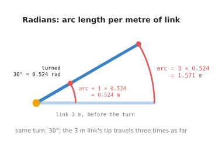
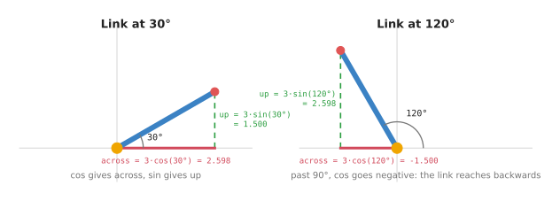
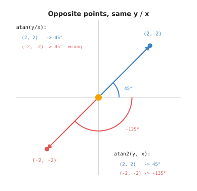
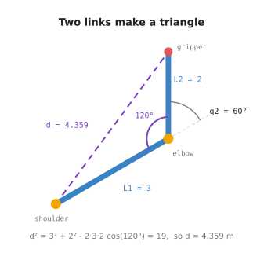
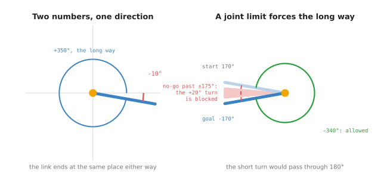

# Angles and trigonometry for a robot arm

A robot arm is a chain of joints that turn. Each joint reports one number: how
far it has turned. Everything the arm does is worked out from those angles. This
doc answers one question: **what do you need to know about angles to follow the
rest of this book?**

It is for someone who has never studied robotics and has forgotten most of the
trigonometry they learned at school. You do not need anything beyond it. Every
idea is shown on a robot arm, not on a textbook triangle. Every number is
printed by `code/src/01_robotics-intro/maths/angles.py`, so you can run it and check.

The doc covers five tools. Each one answers a question an arm asks all the time:

- **Degrees and radians.** Which unit is the angle in?
- **cos and sin.** A link points at some angle. How far across and how far up
  does it reach?
- **atan2.** The gripper is at some point. At what angle is it from the base?
- **The law of cosines.** How far apart are the shoulder and the gripper, for a
  given elbow angle? And backwards: what elbow angle gives a certain distance?
- **Wrapping.** 350° and -10° point the same way. Which one should a joint use?

## Contents

1. [The arm used in this doc](#1-the-arm-used-in-this-doc)
2. [Degrees and radians](#2-degrees-and-radians)
3. [cos and sin: how far across, how far up](#3-cos-and-sin-how-far-across-how-far-up)
4. [atan2: from a point back to an angle](#4-atan2-from-a-point-back-to-an-angle)
5. [The law of cosines: the triangle two links make](#5-the-law-of-cosines-the-triangle-two-links-make)
6. [Wrapping angles, and joint limits](#6-wrapping-angles-and-joint-limits)
7. [All of it on one page](#7-all-of-it-on-one-page)
8. [Running it](#8-running-it)
9. [Where this is used next](#9-where-this-is-used-next)

---

## 1. The arm used in this doc

This doc uses the same arm as the rest of the book, so the numbers carry across.
The arm lies flat on a table, so every angle is measured in one plane.

- **Link 1** is 3 m long. It is fixed to the base at joint 1, which we will
  also call the **shoulder**.
- **Link 2** is 2 m long. It is fixed to the end of link 1 at joint 2, which we
  will also call the **elbow**.
- The **gripper** sits at the far end of link 2.

The angle of joint 1 is called `q1`. It is measured from the table's x axis. The
angle of joint 2 is called `q2`. It is measured from the direction of link 1, not
from the table. The usual pose is `q1 = 30°` and `q2 = 60°`. In that pose the
gripper is at `(2.598, 3.5)`.

The [frames and transforms doc](../03_arm/01_overview.md) draws this arm and
explains where `(2.598, 3.5)` comes from. This doc explains the tools that
calculation uses.

---

## 2. Degrees and radians

You already know degrees. A full turn is 360°. A quarter turn is 90°.

Robot software almost never uses degrees inside its calculations. It uses
**radians**. Python's `math.cos` and `math.sin` expect radians. NumPy's
`np.cos` and `np.sin` expect radians too. So does nearly every robotics library.

A radian is defined by the arm itself. Take a link 1 m long and turn it. Its tip
moves along a curve, called an **arc**. When the tip has travelled 1 m along
that arc, the link has turned **1 radian**.

That gives a useful rule. For any link:

```
distance the tip travels = link length × angle in radians
```



The picture turns two links by the same 30°. 30° is 0.524 radians. The 1 m
link's tip travels 0.524 m. The 3 m link's tip travels three times as far,
1.571 m. The angle is the same. The longer link's tip moves further because it
is further from the joint.

This rule matters for safety and speed. A joint that turns slowly can still
swing the far end of a long arm quickly.

To convert, use `math.radians()` and `math.degrees()`. The file prints these:

| Degrees | Radians |
| --- | --- |
| 30 | 0.5236 |
| 90 | 1.5708 |
| 180 | 3.1416 |
| 360 | 6.2832 |

Read each row as the same turn in two units. 180° is π radians, which is 3.1416.
A full turn is 2π.

The docs in this book write angles in degrees, because degrees are easier to
picture. The code always converts to radians before it calls `cos` or `sin`.

The most common bug in beginner arm code is passing degrees to `math.cos`. It gives no error. It gives
a wrong number. `math.cos(90)` treats 90 as 90 radians, which is about 14 full
turns plus a bit, and returns `-0.448` instead of `0`. The file prints both, so
you can see the difference. If an arm points in a strange direction, check the
units first.

---

## 3. cos and sin: how far across, how far up

A link has a length, and it points at an angle. Most of the time you need
something else: how far across the table the far end is, and how far up. `cos`
and `sin` convert one into the other.

```
across = length × cos(angle)
up     = length × sin(angle)
```

That is the only job `cos` and `sin` do in this book.



In the left picture link 1 points at 30°. It reaches `3 × cos(30°) = 2.598`
across, and `3 × sin(30°) = 1.5` up. The link, the across line and the up line
form a right-angled triangle.

In the right picture the same link points at 120°. Now it leans backwards, past
the vertical. `cos(120°)` is negative, so "across" is `-1.5`. The minus sign
means "backwards, to the left of the joint". `sin(120°)` is still positive, so
the tip is still above the joint.

The file prints this table for the 3 m link at several angles. Each row is one
angle. The last two columns are where the tip of the link ends up.

| Angle | cos | sin | Across | Up |
| --- | --- | --- | --- | --- |
| 0° | 1.000 | 0.000 | 3.000 | 0.000 |
| 30° | 0.866 | 0.500 | 2.598 | 1.500 |
| 60° | 0.500 | 0.866 | 1.500 | 2.598 |
| 90° | 0.000 | 1.000 | 0.000 | 3.000 |
| 120° | -0.500 | 0.866 | -1.500 | 2.598 |
| 180° | -1.000 | 0.000 | -3.000 | 0.000 |
| 270° | 0.000 | -1.000 | 0.000 | -3.000 |

Three things are worth noticing in the table.

- At 0° the link lies flat along x. All 3 m are "across".
- At 90° it points straight up. All 3 m are "up".
- `cos` and `sin` are always between -1 and 1. So a link never reaches further
  across, or further up, than its own length.

### Two links

With two links you do this twice and add. Link 1 points at `q1`. Link 2 points
at `q1 + q2` from the table, because `q2` is measured from link 1, which is
already turned by `q1`. So:

```
gripper_x = 3 × cos(q1) + 2 × cos(q1 + q2)
gripper_y = 3 × sin(q1) + 2 × sin(q1 + q2)
```

At `q1 = 30°`, `q2 = 60°`, link 2 points at 90°. That gives `2.598 + 0 = 2.598`
across and `1.5 + 2 = 3.5` up. The gripper is at `(2.598, 3.5)`.

This calculation, from joint angles to gripper position, is called **forward
kinematics**. It has its own chapter:
[forward kinematics](../04_kinematics/01_forward-kinematics.md).

---

## 4. atan2: from a point back to an angle

`cos` and `sin` go from an angle to a point. Robots often need the reverse. A
camera sees a cup at some spot on the table. Joint 1 has to turn to face it. At
what angle is the cup?

The function for this is called **atan2**. You give it the up distance and the
across distance, in that order, and it gives back the angle:

```
angle = atan2(up, across)
```

Take the gripper at `(2.598, 3.5)`. `atan2(3.5, 2.598)` is **53.4°**. So the
gripper is 53.4° round from the table's x axis, seen from the base.

Notice that 53.4° is neither `q1` (30°) nor `q1 + q2` (90°). It is the direction
of the straight line from the shoulder to the gripper. The inverse kinematics
doc uses exactly this angle.

### Why not plain atan

School trigonometry teaches a function called **atan**, short for arc tangent.
It takes one number, `up / across`, and gives back an angle. It looks like it
should do the same job. It does not.



The picture shows two points in opposite directions: `(2, 2)` and `(-2, -2)`.
Divide up by across for each one. Both give `1`. The minus signs cancel. So
`atan` receives the same number twice, and it returns 45° twice. For `(-2, -2)`
that is wrong. It points the other way.

`atan2` receives up and across separately. It can see both signs, so it knows
which quarter of the circle the point is in. The file prints this comparison.
Each row is one point:

| Point | atan(y / x) | atan2(y, x) |
| --- | --- | --- |
| (2, 2) | 45.0° | 45.0° |
| (-2, -2) | 45.0° | -135.0° |
| (-2, 2) | -45.0° | 135.0° |
| (0, 1) | fails: division by zero | 90.0° |

`atan` is wrong for every point with a negative across, which is half of all
directions. It also fails outright when across is 0, because `1 / 0` has no
value. `atan2` handles every case.

So in robot code, always use `atan2(y, x)`. Note the order: `y` comes first.

---

## 5. The law of cosines: the triangle two links make

Draw a straight line from the shoulder to the gripper. That line, together with
the two links, makes a triangle.



We know two sides of this triangle: the links, 3 m and 2 m. We know the angle
between them, at the elbow. The **law of cosines** gives the third side, `d`,
which is the distance from shoulder to gripper.

There is one trap. The angle inside the triangle is not `q2`. `q2` is measured
from the line where link 1 would carry on, shown dashed in the picture. The
inside angle is what is left of a half turn:

```
inside angle = 180° - q2
```

With `q2 = 60°` the inside angle is 120°. Now the law of cosines:

```
d² = L1² + L2² - 2 × L1 × L2 × cos(inside angle)
d² = 9 + 4 - 12 × cos(120°)
d² = 13 - 12 × (-0.5) = 19
d  = 4.359 m
```

We can check this another way. The gripper is at `(2.598, 3.5)`. Its distance
from the base is `sqrt(2.598² + 3.5²)`, which is also **4.359 m**. The two
methods agree.

### Why this matters: going backwards

The law of cosines is useful because it runs backwards. Suppose you want the
gripper at some point. You can measure `d`, the distance from the shoulder to
that point. Then you can solve for the elbow angle.

Because `cos(180° - q2) = -cos(q2)`, the formula tidies up to:

```
cos(q2) = (d² - L1² - L2²) / (2 × L1 × L2)
q2      = acos(that number)
```

`acos` is the reverse of `cos`. You give it a cosine, and it gives you the angle.

The file tries several distances. Each row below is one distance, the cosine the
formula gives, and the elbow angle that results:

| d (m) | cos(q2) | q2 |
| --- | --- | --- |
| 4.359 | +0.500 | 60.0° |
| 5.000 | +1.000 | 0.0° |
| 1.000 | -1.000 | 180.0° |
| 4.000 | +0.250 | 75.5° |
| 6.000 | +1.917 | none: out of reach |

The first row gives back the 60° we started with. At 5 m, which is `3 + 2`, the
elbow is straight: the arm is at full stretch. At 1 m, which is `3 - 2`, the
elbow is folded right back on itself.

The last row is the important one. 6 m is further than the arm can reach. The
formula gives a cosine of 1.917. No angle has a cosine above 1, so `acos` has no
answer. Python raises an error if you try. That error is how the maths tells you
the target is out of reach. Real code checks the number is between -1 and 1
before calling `acos`.

This is the first step of **inverse kinematics**: finding joint angles from a
gripper position. The [inverse kinematics doc](../04_kinematics/02_inverse-kinematics.md)
finishes the job, using `atan2` for joint 1.

---

## 6. Wrapping angles, and joint limits

### Many numbers, one direction

Turn a link 350° anticlockwise. Now turn another link 10° clockwise, which is
-10°. They end up pointing the same way.



The left picture shows this. So do 710° and -370°. Every direction has
endless names, each 360° apart.

Code usually picks one standard name for each direction. The common choice is an
angle above -180° and up to 180°. Bringing an angle into that range is called
**wrapping** it. In Python:

```python
wrapped = (angle + 180) % 360 - 180
```

The `%` sign gives the remainder after dividing. The file wraps several angles.
Each row shows an angle and its wrapped form:

| Angle | Wrapped |
| --- | --- |
| 350° | -10° |
| -10° | -10° |
| 370° | 10° |
| 200° | -160° |
| -190° | 170° |
| 180° | 180° |

The last row needs a small fix in the code. The formula gives -180 for 180.
Both point the same way, so the file keeps +180.

### The shortest turn

Wrapping answers a practical question: which way should a joint turn?

Say a joint is at 170° and must reach -170°. Plain subtraction says turn
`-170 - 170 = -340°`, almost a full turn clockwise. Wrap that difference and you
get **+20°**. The two angles are only 20° apart, across the 180° mark.

For a wheel, or for a joint that can spin forever, +20° is clearly better.

### A joint limit changes the answer

Most arm joints cannot spin forever. Cables run through them, and parts would
collide. So each joint has **limits**: a smallest and a largest angle it is
allowed to reach. Say this joint's limits are -175° and +175°.

The right picture shows what happens. The +20° turn would carry the joint
through 180°, which is past +175°. That region is shaded as no-go. The joint must
take the long way round instead: -340°.

The file prints the same conclusion:

```
turning +20 would carry the joint to 190 degrees, past its limit of +175, so it must turn -340 instead
```

This is why robot software treats joint angles and directions differently. A
direction can be wrapped freely. A joint angle cannot, because the joint has to
travel through every angle in between. When you plan a move, you check the path
against the limits, not only the end point.

---

## 7. All of it on one page

These are the five tools, in the order this doc met them. Each line says what
goes in and what comes out.

```
degrees to radians:   radians = degrees × π / 180        math.radians(d)
arc the tip travels:  distance = link length × radians

angle to point:       across = length × cos(angle)
                      up     = length × sin(angle)

point to angle:       angle = atan2(up, across)         never atan(up / across)

two links, distance:  d² = L1² + L2² - 2·L1·L2·cos(180° - q2)
distance, elbow:      cos(q2) = (d² - L1² - L2²) / (2·L1·L2)
                      out of reach if that is above 1 or below -1

wrapping:             wrapped = (angle + 180) % 360 - 180
joint limits:         check the whole path, not only the end angle
```

---

## 8. Running it

From the `code/` folder:

```
pixi run python src/01_robotics-intro/maths/angles.py
```

The file prints five sections, one per section of this doc, in the same order.
Change `LINK1` and `LINK2` at the top of the file, run it again, and watch the
reach limits in section 4 move.

The diagrams are drawn by `docs/diagrams/maths.py`. Run it from `code/` with
`pixi run python ../docs/diagrams/maths.py`.

---

## 9. Where this is used next

The next doc, [vectors and matrices](02_vectors-and-matrices.md), treats each
link as an arrow and shows how a matrix turns a point. It uses the `cos` and
`sin` from section 3 inside a small table of numbers.

After that come [frames and transforms](../03_arm/01_overview.md),
[forward kinematics](../04_kinematics/01_forward-kinematics.md), which is
section 3's two-link formula made general, and
[inverse kinematics](../04_kinematics/02_inverse-kinematics.md), which is built
from sections 4 and 5.
