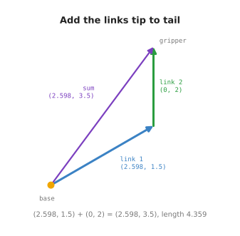
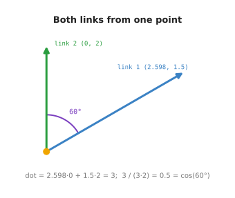
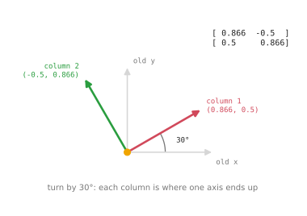
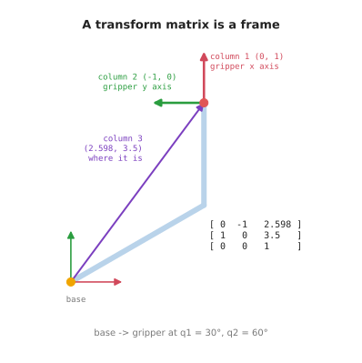
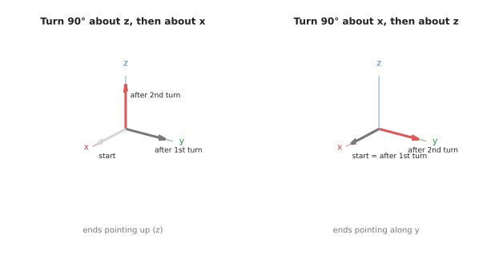

# Vectors and matrices for a robot arm

Robot code stores positions as **vectors** and movements as **matrices**. You
see both on almost every page of robotics code, often written with NumPy's `@`
sign. This doc answers one question: **what are vectors and matrices, and what
does each one do for a robot arm?**

It is for a beginner who has read the
[angles and trigonometry doc](01_angles-and-trigonometry.md) and knows a little
Python. It does not teach linear algebra as a subject. It teaches only the parts
an arm uses, and it shows each one on the same two-link arm as the rest of this
book. Every number is printed by `code/src/maths/vectors_and_matrices.py`.

By the end you will be able to read a 3 × 3 or 4 × 4 transform matrix and say
where it puts a frame and which way the frame points. The
[frames and transforms doc](../03_arm/01_overview.md), which comes next, builds on
that.

## Contents

1. [Vectors: each link is an arrow](#1-vectors-each-link-is-an-arrow)
2. [Length and direction](#2-length-and-direction)
3. [The dot product: the angle between two links](#3-the-dot-product-the-angle-between-two-links)
4. [A matrix turns a point](#4-a-matrix-turns-a-point)
5. [Multiplying matrices: one move, then another](#5-multiplying-matrices-one-move-then-another)
6. [The 3 × 3 transform matrix: a turn and a shift together](#6-the-3--3-transform-matrix-a-turn-and-a-shift-together)
7. [Turning in 3D, and the 4 × 4 transform](#7-turning-in-3d-and-the-4--4-transform)
8. [All of it on one page](#8-all-of-it-on-one-page)
9. [Running it](#9-running-it)
10. [Where this is used next](#10-where-this-is-used-next)

---

## 1. Vectors: each link is an arrow

A **vector** is a list of numbers that describes an arrow: how far across, and
how far up. In 3D it has a third number, for how far out of the table.

In code, a vector is a NumPy array: `np.array([2.598, 1.5])`. The
[NumPy doc](../01_python-and-numpy/02_numpy-intro.md#61-vectors) covers the code
side. This doc covers what the numbers mean.

Take the arm at its usual pose, `q1 = 30°` and `q2 = 60°`. Each link is an arrow
from one joint to the next. The [previous doc](01_angles-and-trigonometry.md#3-cos-and-sin-how-far-across-how-far-up)
showed how `cos` and `sin` give its across and up parts:

- Link 1 is 3 m at 30°. Its arrow is `(2.598, 1.5)`.
- Link 2 is 2 m at `30° + 60° = 90°`. Its arrow is `(0, 2)`.

### Adding vectors: walk along the links

To add two vectors, add their parts: across plus across, up plus up.

```
(2.598, 1.5) + (0, 2) = (2.598, 3.5)
```

That sum is the gripper's position, seen from the base.



The picture shows why this works. Start at the base. Walk along link 1's arrow.
Then, from where you stopped, walk along link 2's arrow. You end at the gripper.
Putting arrows end to end like this is called adding them **tip to tail**.

The purple arrow goes straight from the base to the gripper. It is the sum. An
arm with more links adds more arrows. The gripper is always the sum of all the
link arrows.

There is one catch, and it is the reason the rest of this doc exists. We could
only write link 2's arrow as `(0, 2)` because we already knew it points at 90°
on the table. For a long arm that bookkeeping gets hard. Matrices, in section 4,
do it for us.

---

## 2. Length and direction

Every vector has a **length** and a **direction**. It is often useful to split
them apart.

The length of `(x, y)` comes from Pythagoras' rule:

```
length = sqrt(x² + y²)
```

In NumPy this is `np.linalg.norm(v)`. The file prints these lengths:

| Arrow | Length |
| --- | --- |
| link 1, `(2.598, 1.5)` | 3.000 |
| link 2, `(0, 2)` | 2.000 |
| base to gripper, `(2.598, 3.5)` | 4.359 |

Read the table as a check. The two links come back at their real lengths, 3 and
2. The gripper is 4.359 m from the base. That is the same `d` the law of cosines
gave in the [previous doc](01_angles-and-trigonometry.md#5-the-law-of-cosines-the-triangle-two-links-make).
It is less than `3 + 2 = 5`, because the links are not in a straight line.

The direction is the vector divided by its length. The result is called a
**unit vector**. It has length 1 and points the same way:

```
(2.598, 3.5) / 4.359 = (0.596, 0.803)
```

Robots use unit vectors for anything that is only a direction: the way a camera
is looking, the way a gripper is pointing, the way to push.

---

## 3. The dot product: the angle between two links

The **dot product** multiplies two vectors part by part and adds the results.
It gives one number, not a vector:

```
a · b = a_x × b_x + a_y × b_y
```

That number is useful because of this rule:

```
a · b = length(a) × length(b) × cos(angle between a and b)
```

So the dot product tells you the angle between two arrows.



Take the two link arrows and place them tail to tail, as in the picture. Their
dot product is:

```
(2.598, 1.5) · (0, 2) = 2.598 × 0 + 1.5 × 2 = 3
cos(angle) = 3 / (3 × 2) = 0.5
angle = 60°
```

60° is `q2`. The dot product has read the elbow angle straight off the two
arrows. It did not need to know `q1`.

Two special values are worth remembering:

- A dot product of **0** means the arrows are at right angles. The file checks
  `(3, 0) · (0, 2)`, which is 0.
- A negative dot product means the angle is more than 90°: the arrows point
  partly against each other.

Robot code uses this to check that a gripper is pointing roughly at an object, or
that a surface faces the camera.

---

## 4. A matrix turns a point

A **matrix** is a grid of numbers. For this book, one kind of matrix matters
most: a **rotation matrix**. It turns any point about the origin by a fixed
angle.

To turn by an angle `t` in the flat plane, the rotation matrix is:

```
R(t) = [ cos(t)  -sin(t) ]
       [ sin(t)   cos(t) ]
```

You use it by multiplying: `R @ point`. In NumPy, `@` means matrix
multiplication. The [NumPy doc](../01_python-and-numpy/02_numpy-intro.md#62-rotation-matrices-and-)
explains the `@` sign.

For 30°, the file prints:

```
R(30°) = [ 0.866  -0.5   ]
         [ 0.5     0.866 ]
```

Multiply it by `(3, 0)`, a 3 m link lying flat along x. The answer is
`(2.598, 1.5)`. That is link 1's arrow from section 1. The matrix turned the flat
link up to 30°.

### The columns are the turned axes

There is an easy way to read any rotation matrix. Look at its columns.



- The **first column**, `(0.866, 0.5)`, is where the x axis ends up after the
  turn.
- The **second column**, `(-0.5, 0.866)`, is where the y axis ends up.

The picture shows the old axes in grey and the turned axes in colour. Each
coloured arrow is one column of the matrix.

This is the most useful fact in this doc. When you print a rotation matrix from
a robot, you do not have to work anything out. Read the first column, and you
know which way that part's x axis is pointing.

---

## 5. Multiplying matrices: one move, then another

Two matrices can be multiplied together. The result is one matrix that does both
moves.

```
R(30°) @ R(60°) = R(90°)
```

The file prints both sides, and they match:

```
[ 0  -1 ]
[ 1   0 ]
```

Turning by 30° and then by 60° is the same as turning by 90°. For turns in a flat
plane, the angles simply add. This is where `q1 + q2` in the arm comes from.

### Order matters

For flat turns alone, the order does not matter. `R(60°) @ R(30°)` gives the same
answer, and the file confirms it.

But arms do more than turn. Each link also **shifts** the next joint along. Once
shifts are mixed in, the order matters a lot. Take the point `(2, 0)`, a turn of
60°, and a shift of `(3, 0)`. The file does it both ways:

| Order | Result |
| --- | --- |
| turn first, then shift | (4, 1.732) |
| shift first, then turn | (2.5, 4.33) |

Read the rows as the same two moves in a different order. The answers are far
apart. The [frames doc draws this case](../03_arm/01_overview.md#applying-a-transform-turn-then-shift)
and explains why "turn first, then shift" is the right one for an arm.

In 3D, even two turns on their own give different answers in different orders.
Section 7 shows this.

A chain of matrices is read from right to left. In `A @ B @ point`, the matrix
nearest the point acts first. So `B` happens first, then `A`.

---

## 6. The 3 × 3 transform matrix: a turn and a shift together

A rotation matrix can turn, but it cannot shift. The origin always stays where it
is. An arm needs both, so robot code uses a slightly bigger matrix that holds a
turn and a shift together. It is called a **transform matrix**, or a
**homogeneous transform**. In the flat plane it is 3 × 3:

```
[ cos(t)  -sin(t)  shift_x ]
[ sin(t)   cos(t)  shift_y ]
[ 0        0       1       ]
```

The top-left 2 × 2 block is the rotation matrix from section 4. The right-hand
column is the shift. The bottom row is always `0 0 1`. It is there only so the
shapes fit for multiplication.

To use it on a point, write the point with an extra 1 on the end: `(x, y, 1)`.
Multiply. Then drop the 1. The matrix turns the point first and then adds the
shift, which is the right order for an arm.

### The arm as three matrices

Each joint of the arm gets one transform matrix. Each one describes a single part
of the arm on its own:

| From | To | Turn | Shift |
| --- | --- | --- | --- |
| base | link 1 | `q1` = 30° | none |
| link 1 | link 2 | `q2` = 60° | 3 m along link 1 |
| link 2 | gripper | none | 2 m along link 2 |

Read each row as: "the second part sits here, relative to the first part".

For example, the file prints the middle row as a matrix:

```
link1 -> link2 = [ 0.5    -0.866  3 ]
                 [ 0.866   0.5    0 ]
                 [ 0       0      1 ]
```

Multiply the three together, in order from the base outwards:

```
base -> gripper = base_to_link1 @ link1_to_link2 @ link2_to_gripper

                = [ 0  -1  2.598 ]
                  [ 1   0  3.5   ]
                  [ 0   0  1     ]
```

### Reading the answer

The result is itself a transform matrix. Read it by its columns, as in section 4.



- **Column 1**, `(0, 1)`, is the gripper's x axis, measured on the table. The
  gripper points straight up the table.
- **Column 2**, `(-1, 0)`, is the gripper's y axis. It points to the left.
- **Column 3**, `(2.598, 3.5)`, is where the gripper is.

So one matrix tells you both where the gripper is and which way it faces. The
picture draws those three columns as arrows.

The matrix can also carry a point. A tool tip 1 m in front of the gripper is
`(1, 0)` in the gripper's own frame. Write it as `(1, 0, 1)` and multiply by
`base -> gripper`. The file prints `(2.598, 4.5)`: the tool tip on the table.

This is exactly what the [frames and transforms doc](../03_arm/01_overview.md)
does in steps 2 and 3. It writes the turn and the shift out by hand, so you can
see each step. The matrix does the same arithmetic in one multiplication. You
will meet both forms in real code.

---

## 7. Turning in 3D, and the 4 × 4 transform

Real arms work in 3D. Positions get a third number, `z`, for height. Turns get
more interesting, because there are three axes to turn about.

It helps to picture each axis as a real joint on an arm:

- **About z**, the vertical axis. The part swings sideways, left or right, like
  the base of an arm turning to face a different part of the table.
- **About y**, a horizontal axis. The part tilts up or down, like a shoulder
  lifting the arm.
- **About x**, the axis the part is pointing along. The part spins about itself,
  like a wrist twisting a screwdriver.

The file takes a tool pointing along x, `(1, 0, 0)`, and turns it by 90° about
each axis. Each row shows where the tool points afterwards:

| Turn | Tool points along | Like |
| --- | --- | --- |
| 90° about z | (0, 1, 0) | a base swinging sideways |
| -90° about y | (0, 0, 1) | a shoulder lifting to point up |
| 90° about x | (1, 0, 0) | a wrist spinning: the direction is unchanged |

Each of these turns has its own 3 × 3 rotation matrix. The columns still tell you
where the x, y and z axes end up. The
[NumPy doc](../01_python-and-numpy/02_numpy-intro.md#62-rotation-matrices-and-)
writes `rotation_z` out in full.

### In 3D, the order of turns matters

In the flat plane, two turns could go in either order. In 3D they cannot.



The file turns the tool 90° about z and 90° about x, in both orders:

| Order | Tool ends up pointing along |
| --- | --- |
| about z, then about x | (0, 0, 1): straight up |
| about x, then about z | (0, 1, 0): sideways |

Read the rows as the same two turns in a different order. The results point in
different directions.

In the left picture, the turn about z swings the tool sideways onto y. The turn
about x then tips it up onto z. In the right picture, the turn about x happens
first, while the tool still points along x. A spin about its own direction does
nothing visible. Then the turn about z swings it onto y.

This is why an arm's joints must be applied in order, from the base outwards. The
[six-joint arm doc](../05_arm-types/03_the-six-joint-arm.md) relies on it.

### The 4 × 4 transform

The 3D transform matrix is 4 × 4. It has the same layout as the 3 × 3 one:

```
[ rotation (3 × 3)   shift (3) ]
[ 0   0   0          1         ]
```

The file builds one for a base column 1 m tall, turned 30° about z:

```
[ 0.866  -0.5    0   0 ]
[ 0.5     0.866  0   0 ]
[ 0       0      1   1 ]
[ 0       0      0   1 ]
```

Read it by its columns. The first three columns are the frame's x, y and z axes.
The last column, `(0, 0, 1)`, says the frame sits 1 m up. A point 3 m along this
frame's x axis, written as `(3, 0, 0, 1)`, lands at `(2.598, 1.5, 1)`. That is
link 1's arrow from section 1, lifted 1 m off the table.

Everything from section 6 still works. Multiply 4 × 4 matrices in order along the
arm, and the last column of the result is where the gripper is. The
[NumPy doc's section on 4 × 4 transforms](../01_python-and-numpy/02_numpy-intro.md#63-4--4-transforms)
does this in code, and also shows how to undo a transform.

---

## 8. All of it on one page

These are the tools, in the order this doc met them.

```
vector:            an arrow, (x, y) or (x, y, z)
add vectors:       add the parts; tip to tail; all link arrows sum to the gripper
length:            sqrt(x² + y²)                        np.linalg.norm(v)
direction:         v / length(v), a unit vector
dot product:       a · b = a_x·b_x + a_y·b_y = |a|·|b|·cos(angle)
                   0 means at right angles

rotation matrix:   R(t) = [cos -sin; sin cos]; R @ point turns the point
                   its columns are the turned axes

multiply:          A @ B does B first, then A
                   2D turns: order does not matter
                   turns with shifts, or 3D turns: order matters

3 × 3 transform:   [ R  shift ; 0 0 1 ]; point written as (x, y, 1)
4 × 4 transform:   [ R  shift ; 0 0 0 1 ]; point written as (x, y, z, 1)
                   columns = the frame's axes, last column = where it is
chain an arm:      base_to_gripper = T1 @ T2 @ ... @ Tn
```

---

## 9. Running it

From the `code/` folder:

```
pixi run python src/maths/vectors_and_matrices.py
```

The file prints seven sections, one per section of this doc, in the same order.
Change `Q1` and `Q2` near the top and run it again. The gripper position in
section 6 moves, and the dot product in section 3 still gives back `Q2`.

The diagrams are drawn by `docs/diagrams/maths.py`. Run it from `code/` with
`pixi run python ../docs/diagrams/maths.py`.

---

## 10. Where this is used next

The [frames and transforms doc](../03_arm/01_overview.md) comes next. It takes the
three transforms from section 6, gives each one a name, and shows why describing
each part of an arm on its own is the right way to build robot software.

After that, [forward kinematics](../04_kinematics/01_forward-kinematics.md) chains
the transforms for any number of joints, and the
[six-joint arm doc](../05_arm-types/03_the-six-joint-arm.md) does it in 3D with
4 × 4 matrices.
