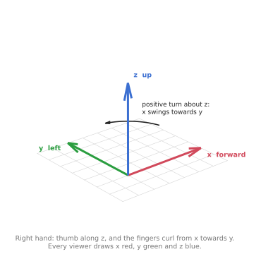
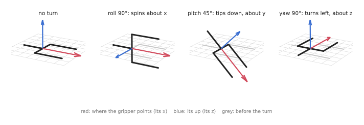
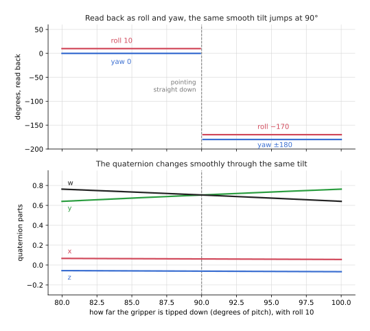
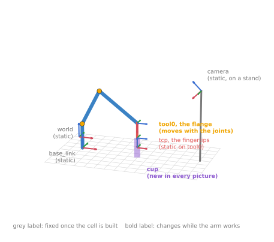
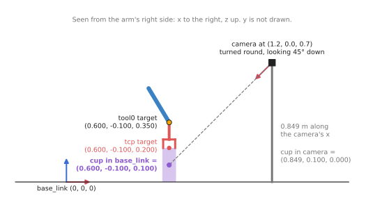

# Frames in 3D, and the frames on a real arm

The [previous doc](01_overview.md) built frames and transforms on a flat arm. On a
flat arm a position is two numbers and a turn is one angle. A real arm works in 3D,
and this doc answers two questions about that. What changes when frames go into
3D? And which frames will you meet on a real arm, and how do they connect?

It is for a beginner who has read the previous doc. It also uses two things from
the maths chapter: the 3D turns about x, y and z, and the 4 × 4 transform matrix,
both from
[section 7 of vectors and matrices](../02_maths/02_vectors-and-matrices.md#7-turning-in-3d-and-the-4--4-transform).
This doc does not repeat that maths. It puts it to work on a gripper, a camera and
a cup.

Every number below is printed by two programs in `src/frames_3d/`.
[Section 7](#7-running-it) says how to run them.

## Contents

1. [A pose: six numbers](#1-a-pose-six-numbers)
2. [The axes: x forward, y left, z up](#2-the-axes-x-forward-y-left-z-up)
3. [Roll, pitch and yaw on a gripper](#3-roll-pitch-and-yaw-on-a-gripper)
4. [Four ways to write a turn](#4-four-ways-to-write-a-turn)
   · [One turn, written four ways](#one-turn-written-four-ways)
   · [Why ROS stores quaternions](#why-ros-stores-quaternions)
   · [The awkward case: gimbal lock](#the-awkward-case-gimbal-lock)
5. [The frames on a real arm](#5-the-frames-on-a-real-arm)
6. [A worked chain: from the camera to the gripper](#6-a-worked-chain-from-the-camera-to-the-gripper)
   · [The cup, from the camera to the base](#the-cup-from-the-camera-to-the-base)
   · [Where the gripper should go](#where-the-gripper-should-go)
   · [Flipped: the cup, seen from the gripper](#flipped-the-cup-seen-from-the-gripper)
7. [Running it](#7-running-it)
8. [What comes next](#8-what-comes-next)

---

## 1. A pose: six numbers

On the flat arm, the gripper's place was two numbers, x and y. Which way it faced
was one angle.

In 3D, the place needs three numbers: x, y and z. The third one, z, is height.

Which way the gripper faces needs three numbers too. A gripper can turn left or
right. It can tip up or down. And it can twist about the direction it points in.
Those are three separate turns, so they need three separate numbers.

The place is called the **position**. The way it faces is called the
**orientation**. The two together are called a **pose**. A pose in 3D is six
numbers. The first program prints one:

```
position    (x, y, z) in metres     [0.6 0.1 0.2]
orientation (roll, pitch, yaw)       (20, 45, 30) degrees
six numbers in all
```

This is also why a general-purpose arm has six joints. Each joint gives the arm
control of one more number. The
[joints and degrees of freedom doc](../05_arm-types/01_joints-and-degrees-of-freedom.md)
covers that side of it.

---

## 2. The axes: x forward, y left, z up

A frame in 3D has three axes. Before any number means anything, everybody has to
agree which way each axis points.

ROS (Robot Operating System) writes its conventions down in documents called REPs
(ROS Enhancement Proposals).
[REP 103](https://www.ros.org/reps/rep-0103.html) sets the axes for a robot's own
body:

- **x points forward**, the way the robot faces
- **y points left**
- **z points up**



Every tool that draws frames uses the same three colours: x is red, y is green,
and z is blue. You can remember it as RGB for xyz.

The three directions are tied together by the **right-hand rule**. Point the
thumb of your right hand along z. Your fingers then curl from x towards y. This
also tells you which way a turn counts as positive. A positive turn about z swings
x towards y, which is counter-clockwise when you look down from above.

The first program checks the rule with the cross product. The cross product of
two arrows is a third arrow at right angles to both of them. The cross product of
x and y comes out as z:

```
x cross y = [0. 0. 1.]  <- z, pointing up
y cross z = [1. 0. 0.]  <- x
z cross x = [0. 1. 0.]  <- y
x cross (y on the right) = [ 0.  0. -1.]  <- z would point down
```

The last line shows why the rule matters. If someone puts y on the right instead
of the left, their z points down. A height of 0.3 m in their frame is 0.3 m below
the table in yours. Every frame in ROS is right-handed, so this never happens
inside ROS. It can happen when you take numbers from another program.

---

## 3. Roll, pitch and yaw on a gripper

The three turns have names. Each one is a turn about one axis.

- **Roll** is a turn about x. The gripper spins about the direction it points in,
  the way a wrist turns a screwdriver.
- **Pitch** is a turn about y. The gripper tips its nose up or down.
- **Yaw** is a turn about z. The gripper swings left or right, the way the base
  of an arm turns.



In the picture, the gripper points along its own x axis, drawn in red. Its "up"
is its own z axis, drawn in blue. The grey outline is where it was before the
turn.

The first program applies each turn on its own. Each row shows where the
gripper's x axis and z axis end up:

```
                      points along (its x)       its up (its z)
no turn               ( 1.000,  0.000,  0.000)    ( 0.000,  0.000,  1.000)
roll 90 (about x)     ( 1.000,  0.000,  0.000)    ( 0.000, -1.000,  0.000)
pitch 45 (about y)    ( 0.707,  0.000, -0.707)    ( 0.707,  0.000,  0.707)
yaw 90 (about z)      ( 0.000,  1.000,  0.000)    ( 0.000,  0.000,  1.000)
```

Read each row as one turn.

- **Roll 90°** leaves the pointing direction alone. Only the gripper's "up"
  moves, from straight up to the right.
- **Pitch 45°** tips the gripper down. Its pointing direction gains a negative z,
  which means it now points at the table.
- **Yaw 90°** swings the gripper to point left, along y. Its "up" does not move.

A positive pitch tips the nose down. That follows from the right-hand rule. Point
your thumb along y, to the left. Your fingers curl from z towards x, so the top of
the gripper moves forward and the nose moves down.

With all three turns at once, the order matters. The
[maths chapter](../02_maths/02_vectors-and-matrices.md#in-3d-the-order-of-turns-matters)
shows two turns giving different answers in different orders. ROS fixes the
order: roll first, then pitch, then yaw, each about the fixed x, y and z axes.

---

## 4. Four ways to write a turn

There is more than one way to write down an orientation. You will meet four of
them. Each one is the same turn, written in a different form.

### One turn, written four ways

The first program takes one orientation and prints it all four ways. The gripper
is turned 30° to the left, tipped 45° down, and twisted 20° about its own
pointing direction:

```
made from roll 20, pitch 45, yaw 30 degrees

rotation matrix (9 numbers):
 [[ 0.612 -0.26   0.746]
 [ 0.354  0.935  0.036]
 [-0.707  0.242  0.664]]
first column, where the gripper points: [ 0.612  0.354 -0.707]

roll, pitch, yaw read back (3 numbers): [20. 45. 30.]

axis-angle (4 numbers): axis [0.129 0.913 0.386], angle 52.7 degrees

quaternion (x, y, z, w), 4 numbers: [0.057 0.406 0.171 0.896]
its length: 1.000
w = cos(angle / 2) = cos(26.4) = 0.896
(x, y, z) = axis * sin(angle / 2) = [0.057 0.406 0.171]
```

Here is what each form is.

The **rotation matrix** is the 3 × 3 matrix from the maths chapter. Its columns
are where the gripper's x, y and z axes end up. The first column,
`(0.612, 0.354, -0.707)`, is the direction the gripper points.

**Roll, pitch and yaw** are the three turns from section 3. They are the easiest
form for a person to read and type.

**Axis-angle** says the whole orientation is one single turn about one line. The
axis is the line, and the angle says how far to turn about it. Any orientation,
however it was built, can be reached by one turn about the right line. Here it is
52.7° about the line `(0.129, 0.913, 0.386)`.

The **quaternion** is the axis-angle packed into four numbers. The last number,
w, is the cosine of half the angle. The first three are the axis, scaled by the
sine of half the angle. The program works this out from the axis-angle and gets
the same four numbers. A quaternion that describes a turn always has a length of
exactly 1.

The program then checks that the forms agree. It points the gripper using the
axis-angle, and again using the quaternion:

```
pointing, from the axis-angle: [ 0.612  0.354 -0.707]
pointing, from the quaternion: [ 0.612  0.354 -0.707]
```

Both match the first column of the matrix. It is one turn, four ways.

The table below compares the four forms. Read each row as one form: how many
numbers it takes, what it is good at, and what it costs you.

| Form | Numbers | Good for | What it costs |
| --- | --- | --- | --- |
| rotation matrix | 9 | turning points, and joining turns by multiplying | 9 numbers for 3 facts; rounding errors slowly stop it being a pure turn |
| roll, pitch, yaw | 3 | people: easy to read, easy to type into a config file | breaks at pitch 90°, and the order of the turns must be agreed |
| axis-angle | 4 (or 3) | seeing how big a turn is, and about which line | joining two turns is awkward |
| quaternion | 4 | storing and sending turns, and blending smoothly between two | hard to read by eye |

### Why ROS stores quaternions

The obvious choice would be roll, pitch and yaw. They are only three numbers, and
people can read them. ROS does not store turns that way. Every orientation in a
ROS message is a quaternion.

REP 103 gives the reason. It lists quaternions first because they are compact
and have no singularities. A **singularity** is a pose where the form breaks down,
and roll, pitch and yaw have one. The next section shows it with numbers.

A rotation matrix has no singularity either. But it needs nine numbers to say
three things, which makes it large to send many times a second.

The cost of the quaternion is that you cannot read it by eye. Nobody looks at
`(0.057, 0.406, 0.171, 0.896)` and sees "tipped 45° down". So in practice you
convert at the edges. People write roll, pitch and yaw in config files, and the
code turns them into quaternions straight away. `scipy.spatial.transform.Rotation`
does every conversion in this section.

One more cost is the order of the four numbers. ROS and SciPy both write
`(x, y, z, w)`, with w last. Some other libraries put w first. The
[frames and conventions doc](../../03_frameworks/03_arm-movement/08_frames-and-conventions.md#21-quaternion-ordering)
in Book 3 shows what goes wrong when the two are mixed up.

### The awkward case: gimbal lock

Roll, pitch and yaw break down at one pitch: 90°, where the gripper points
straight down. The first program shows it with three different sets of angles:

```
three different sets of numbers, at pitch 90 (the gripper points straight down):
  roll  10, pitch 90, yaw    0  ->  quaternion ( 0.062,  0.704, -0.062,  0.704)  same turn as the first: True
  roll   0, pitch 90, yaw  -10  ->  quaternion ( 0.062,  0.704, -0.062,  0.704)  same turn as the first: True
  roll  30, pitch 90, yaw   20  ->  quaternion ( 0.062,  0.704, -0.062,  0.704)  same turn as the first: True
the same test at pitch 80, where nothing is locked:
  roll 10, yaw 0  and  roll 0, yaw -10  same turn: False
```

Three different sets of numbers give exactly the same turn. Here is why. Once
the gripper points straight down, its own pointing direction lines up with the
vertical z axis. Roll spins the gripper about its pointing direction. Yaw spins it
about z. Those are now the same line, so roll and yaw do the same thing. One of
the three numbers has become useless. This is called **gimbal lock**.

At pitch 80° the gripper does not point straight down. There, roll and yaw are
still different turns, and the last line says `False`.

Reading angles back at the lock shows the problem from the other side. SciPy
cannot tell how much of the turn was roll and how much was yaw. It picks one
answer and warns you:

```
roll 10, pitch 90, yaw 0 read back as [10. 90.  0.]
  SciPy warns: Gimbal lock detected
```

Near the lock, the angles also jump. The program tips the gripper down one degree
at a time, past straight down:

```
tilting down past straight down, 1 degree at a time:
  tilted 88 degrees  ->  roll    10.0  pitch  88.0  yaw     0.0   quaternion ( 0.063,  0.692, -0.061,  0.717)
  tilted 89 degrees  ->  roll    10.0  pitch  89.0  yaw     0.0   quaternion ( 0.062,  0.698, -0.061,  0.711)
  tilted 91 degrees  ->  roll  -170.0  pitch  89.0  yaw  -180.0   quaternion ( 0.061,  0.711, -0.062,  0.698)
  tilted 92 degrees  ->  roll  -170.0  pitch  88.0  yaw   180.0   quaternion ( 0.061,  0.717, -0.063,  0.692)
```



The gripper moved two degrees, from 89° to 91°. Read as roll, pitch and yaw,
roll jumped by 180° and so did yaw. The pitch went back down to 89°, because
pitch never reads above 90°. The pose is fine. Only the way of writing it jumped.
The quaternion changes by less than 0.02 in each number over the same step.

This matters on a real arm, because a gripper pointing straight down is the most
common way to pick something off a table. Code that moves the gripper by nudging
roll, pitch and yaw can make the wrist spin half a turn for a two-degree change.
Code that works in quaternions or matrices does not have this problem.

---

## 5. The frames on a real arm

The flat arm had four frames. A real arm cell has a handful of frames that
every robot program talks about, and they have standard names.



The table below lists them, as the second program prints them. Read each row as
one frame: its name, the frame it hangs off (its parent), and whether it moves.

| Frame | Parent | What it is | Moves? |
| --- | --- | --- | --- |
| `world` | none | the room; everything else hangs off it | no |
| `base_link` | `world` | the base of the arm, where it is bolted down | no |
| `tool0` | `base_link`, through the joints | the flange, the plate at the end of the arm where tools are bolted on | yes, whenever a joint turns |
| `tcp` | `tool0` | the tool centre point (TCP), such as the middle of the fingertips | no, relative to `tool0` |
| `camera` | `world` | the camera, fixed on a stand | no |
| `cup` | `camera` | the object the camera has found | new in every picture |

A **static** transform is one that never changes. Where the arm is bolted in the
room is static. Where the camera sits on its stand is static. So is where the
fingertips are relative to the flange. You measure each of these once, when the
cell is built. Measuring where the camera is, relative to the arm, is called
**calibration**.

A **moving** transform changes while the robot works. The transform from
`base_link` to `tool0` changes every time a joint turns. It is the chain of joint
transforms from the previous doc, one per joint. Working it out is called forward
kinematics, and it is the subject of the next chapter.

The `tcp` frame matters because the arm's own maths ends at the flange. The arm
knows where `tool0` is. You care where the fingertips are. The fixed transform
from `tool0` to `tcp` connects the two. Change the gripper and you change that one
transform, and nothing else.

Real arms name the flange frame differently. The Universal Robots description for
ROS 2 has two frames at the end of the arm,
[`flange` and `tool0`](https://github.com/UniversalRobots/Universal_Robots_ROS2_Description/blob/rolling/urdf/ur_macro.xacro).
They sit at the same point but are turned differently: `tool0` has its z axis
pointing out of the plate. This doc keeps it simple. Its gripper points along its
own x axis, as the tool tip did in the previous doc. When you use a real arm,
check which axis its tool frame points along.

---

## 6. A worked chain: from the camera to the gripper

This is the job most arm programs do. A camera sees a cup. The arm has to go and
pick it up. The camera measures the cup in its own frame, and the arm needs it in
`base_link`. The chain of frames does the conversion.

The second program uses 4 × 4 transform matrices, built with NumPy. To keep the
numbers short, the arm is bolted at the origin of the room, so `world` and
`base_link` are the same frame here.



### The cup, from the camera to the base

The camera sits on a stand 1.2 m in front of the arm and 0.7 m up. It is turned
round to look back at the arm, which is a yaw of 180°. It is tipped 45° down,
which is a pitch of 45°. That pose was measured once, by calibration. As a 4 × 4
transform it is:

```
base_link -> camera (measured once):
 [[-0.707  0.    -0.707  1.2  ]
 [ 0.    -1.     0.     0.   ]
 [-0.707  0.     0.707  0.7  ]
 [ 0.     0.     0.     1.   ]]
the camera looks along its x axis, which in base_link is (-0.707, 0.000, -0.707)
```

Read it by its columns, as in the maths chapter. The last column is where the
camera is. The first column is where the camera looks: back towards the arm, and
down at 45°.

The camera finds the middle of the cup. It reports it in its own frame: 0.849 m
straight out of the lens, and 0.1 m to the camera's left. Multiply by the
transform, and the cup is in `base_link`:

```
cup in the camera frame    (0.849, 0.100, 0.000)
cup in the base_link frame (0.600, -0.100, 0.100)
```

The cup is 0.6 m in front of the arm and 0.1 m up. That is the middle of a cup
0.2 m tall.

Look at y. The cup is 0.1 m to the camera's left, but 0.1 m to the arm's right,
with y = -0.100. The camera faces the arm, so its left is the arm's right. The
transform handles this without anyone having to think about it.

### Where the gripper should go

The plan is to put the fingertips 0.1 m above the middle of the cup, pointing
straight down. That is pitch 90°, the gimbal lock pose from section 4. As a
transform, the program builds it from a matrix, so the lock does no harm:

```
fingertip target, base_link -> tcp:
 [[ 0.   0.   1.   0.6]
 [ 0.   1.   0.  -0.1]
 [-1.   0.   0.   0.2]
 [ 0.   0.   0.   1. ]]
the fingertips point along (0.000, 0.000, -1.000)  <- straight down
```

The arm cannot be told where the fingertips go. Its maths ends at the flange,
`tool0`. So the program works out where the flange must be. The fingertips are
0.15 m beyond the flange, along the gripper. So the flange must be 0.15 m back
along the gripper from the fingertip target. In matrices, that is the fingertip
target joined with the flipped `tool0` → `tcp` transform:

```
flange target, base_link -> tool0: at (0.600, -0.100, 0.350)  <- 0.15 m above the fingertips
```

The gripper points down, so "back along the gripper" is up. The flange goes to
0.35 m, which is 0.15 m above the fingertips at 0.2 m. This flange pose is what
you would hand to inverse kinematics, to find the joint angles.

### Flipped: the cup, seen from the gripper

The last question goes the other way. Where is the cup, from the fingertips'
point of view? Flipping a transform works as it did in the previous doc: undo the
turn, then undo the shift. With a matrix, undoing the turn means transposing it,
which swaps its rows and columns.

```
tcp -> base_link:
 [[ 0.   0.  -1.   0.2]
 [ 0.   1.   0.   0.1]
 [ 1.   0.   0.  -0.6]
 [ 0.   0.   0.   1. ]]
cup in the tcp frame (0.100, 0.000, 0.000)  <- 0.1 m straight ahead of the fingertips
flipped twice, the biggest difference from the start: 0.0e+00
```

From the fingertips, the cup is 0.1 m straight ahead along their own x axis. That
is exactly the plan: fingertips pointing down, 0.1 m above the cup. The answer
comes out as one clean number because the frame fits the question.

Flipping twice gives back the original transform, with no difference at all.

---

## 7. Running it

Run these from `code/`:

```
pixi run python src/frames_3d/orientation.py     sections 1 to 4
pixi run python src/frames_3d/cell_chain.py      sections 5 and 6
```

`make arm.learn` runs both of them too, after the three steps of the previous doc.

Neither program needs ROS. Both use NumPy and SciPy, which the pixi environment
already has. Change the camera's pose or the cup's reading at the top of
`cell_chain.py`, and run it again to see the chain follow.

---

## 8. What comes next

You now have frames in 2D and in 3D, and the names of the frames on a real arm.
The one transform this doc took as given is `base_link` → `tool0`, the moving
one. The [forward kinematics doc](../04_kinematics/01_forward-kinematics.md), the
next chapter, works it out from the joint angles. The inverse kinematics doc after
it goes the other way, from a flange target such as the one in section 6 back to
the joint angles.

Later, in Book 3, the
[frames and conventions doc](../../03_frameworks/03_arm-movement/08_frames-and-conventions.md)
covers what goes wrong when frames are mixed up on a real robot. It covers the
camera's optical frame, which points z forward instead of x, the order of
quaternion numbers, and several bugs that come from these differences.
