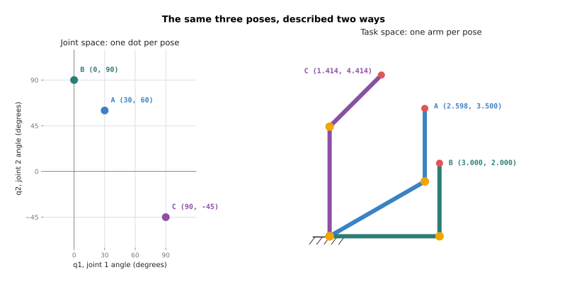
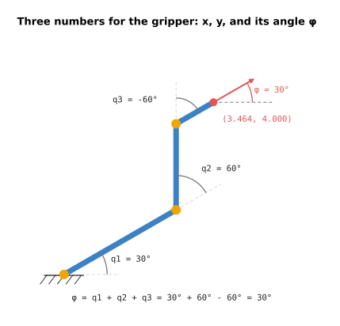

# Forward kinematics

This doc answers one question. If you know the angle of every joint on an arm,
where is the gripper, and which way does it point? The answer is called
**forward kinematics**, and it is the first thing every arm program works out.

It is for a beginner who has read the
[frames and transforms doc](../03_arm/01_overview.md). That doc built the tools:
a transform for each part of the arm, and a way to join them. This doc gives the
result a name, writes it as a short loop that works for any number of joints,
and then asks where the gripper can go at all.

The example arm is the same one as before. Link 1 is 3 m long and link 2 is 2 m
long. The main pose is `q1 = 30°` and `q2 = 60°`, which puts the gripper at
`(2.598, 3.5)`. Every number in this doc is printed by `src/01_robotics-intro/kinematics/forward.py`.

## Contents

1. [What kinematics means](#1-what-kinematics-means)
2. [Two ways to describe the same pose](#2-two-ways-to-describe-the-same-pose)
3. [Forward kinematics is joining transforms](#3-forward-kinematics-is-joining-transforms)
4. [Writing it as a loop with matrices](#4-writing-it-as-a-loop-with-matrices)
5. [A third joint, and the gripper's angle](#5-a-third-joint-and-the-grippers-angle)
6. [Why there is always exactly one answer](#6-why-there-is-always-exactly-one-answer)
7. [The workspace: everywhere the gripper can reach](#7-the-workspace-everywhere-the-gripper-can-reach)
8. [What joint limits do to the workspace](#8-what-joint-limits-do-to-the-workspace)
9. [Running it](#9-running-it)
10. [What comes next](#10-what-comes-next)

---

## 1. What kinematics means

**Kinematics** is the study of how things move, without asking what makes them
move. It deals with positions, angles and speeds. It ignores forces, weights and
motor currents.

For an arm, that means one kind of question. Given the joint angles, where are
the links? Given a place, which joint angles reach it? Neither question needs to
know how heavy the arm is or how strong its motors are. The answers depend only
on the lengths of the links and the angles of the joints.

The part that does care about forces is called **dynamics**. It answers questions
such as "how much must this motor push to hold the arm still?" Dynamics comes
later, in [controlling the move](../../03_frameworks/03_arm-movement/04_controlling-the-move.md).
Kinematics comes first, because you cannot work out the forces on an arm until
you know where its parts are.

Kinematics has two directions:

- **Forward kinematics** takes joint angles and gives the gripper's position.
  This doc covers it.
- **Inverse kinematics** takes a position and gives the joint angles. The
  [next doc](02_inverse-kinematics.md) covers it.

---

## 2. Two ways to describe the same pose

A **pose** is where the arm is and how it is arranged. There are two ordinary
ways to write a pose down.

The first way lists the joint angles, such as `(30°, 60°)`. The set of all
possible joint-angle lists is called **joint space**. The arm's motors live in
joint space, because each motor only knows its own angle.

The second way gives the gripper's position and the angle it points at, such as
`(2.598, 3.5)` pointing at `90°`. The set of all such descriptions is called
**task space**. Tasks live in task space, because "pick up the cup at
`(2.6, 3.5)`" is a statement about the table, not about motors.

The picture shows three poses both ways. Each dot on the left is one pose in
joint space. Each arm on the right is the same pose in task space.



The table below lists the same three poses. Read each row as one pose: the first
two numbers are its joint angles, and the last three are where its gripper ends
up.

| Pose | q1 | q2 | Gripper x | Gripper y | Gripper angle |
| --- | --- | --- | --- | --- | --- |
| A | 30° | 60° | 2.598 | 3.500 | 90° |
| B | 0° | 90° | 3.000 | 2.000 | 90° |
| C | 90° | -45° | 1.414 | 4.414 | 45° |

Look at poses A and B. In joint space they are close together: each angle
differs by 30°. In task space the grippers are about 1.55 m apart. The two spaces do
not have the same shape. A small step in one can be a large step in the other.

Forward kinematics is the rule that turns a joint-space description into a
task-space one. It goes from left to right in the picture.

---

## 3. Forward kinematics is joining transforms

You have already done forward kinematics. The
[frames and transforms doc](../03_arm/01_overview.md#joining-two-transforms)
joined three transforms to find the gripper, and that is the whole method.

Here it is again as a recipe. It has four steps.

1. Write one transform for each joint: a turn by that joint's angle.
2. Write one transform for each link: a shift along the link by its length.
3. Join them in order, from the base outwards: joint 1, link 1, joint 2, link 2.
4. Read the gripper's position and angle out of the joined result.

The order in step 3 matters. Joint 1 turns everything after it, including
joint 2. Joint 2 turns only what comes after joint 2. Joining from the base
outwards gets this right on its own, because each new piece is added in the
frame of the piece before it.

The frames doc did the joining by hand, with the "turn, then shift" rule. The
next section does the same thing with matrices, which is how real code does it.

---

## 4. Writing it as a loop with matrices

A flat transform can be stored as a 3 × 3 **matrix**, a grid of numbers. The
[vectors and matrices doc](../02_maths/02_vectors-and-matrices.md) explains where
the grid comes from. Here you only need its layout:

```
[[cos(t), -sin(t), x],
 [sin(t),  cos(t), y],
 [0,       0,      1]]
```

The top-left 2 × 2 block holds the turn by angle `t`. The right-hand column holds
the shift `(x, y)`. The bottom row is always `0, 0, 1`. It is there so that
joining two transforms is a single matrix multiply.

In Python, a matrix multiply is written with the `@` operator. So forward
kinematics becomes a loop that multiplies one joint and one link at a time:

```python
answer = np.eye(3)                     # start at the base: no turn, no shift
for angle, length in zip(joints, links):
    answer = answer @ turn(angle) @ shift(length)
```

`np.eye(3)` is the matrix that does nothing, which is where the base starts.
`turn(angle)` is the matrix for a joint. `shift(length)` is the matrix for a
link. Both are in `src/01_robotics-intro/kinematics/planar_arm.py`, and each is four lines long.

The program prints the running answer after each link. At `q1 = 30°` and
`q2 = 60°` it prints this:

```
joint 2 (the elbow):
[[ 0.866 -0.5    2.598]
 [ 0.5    0.866  1.5  ]
 [ 0.     0.     1.   ]]
gripper:
[[ 0.    -1.     2.598]
 [ 1.     0.     3.5  ]
 [ 0.     0.     1.   ]]
gripper at (2.598, 3.500), pointing at 90.0 degrees
```

Read the gripper's matrix in two parts. The right-hand column is `(2.598, 3.5)`,
which is where the gripper is. The top-left block is `cos(90°)` and `sin(90°)`,
which says the gripper points straight up. Both answers match the frames doc.

The elbow's matrix is the running answer halfway through. Its right-hand column,
`(2.598, 1.5)`, is where joint 2 sits.

To get the gripper's angle back out as a number, the code takes the two entries
in the first column, `cos` and `sin` of the angle, and hands them to `atan2`.
The [angles and trigonometry doc](../02_maths/01_angles-and-trigonometry.md)
explains `atan2`.

The loop does not know how many joints the arm has. Give it three angles and
three lengths, and it joins three pairs. That is the next section.

---

## 5. A third joint, and the gripper's angle

A two-joint arm can put its gripper on a point. It cannot also choose which way
the gripper points. Once the point is chosen, the gripper's angle is decided for
you.

A third joint fixes that. The arm from
[section 8 of the frames doc](../03_arm/01_overview.md#8-making-the-arm-bigger)
adds a third link, 1 m long, turned by `q3`. Its pose now has three numbers:
`x`, `y`, and the gripper's angle, written `φ` (the Greek letter phi).



The gripper's angle is the sum of the joint angles. Each joint turns relative to
the link before it, so the turns add up as you walk out along the arm:

```
φ = q1 + q2 + q3
```

The program runs the same loop with three joints, and keeps `q1` and `q2` fixed
while it changes `q3`:

```
q = (30.0, 60.0, -60.0): gripper at (3.464, 4.000), pointing at 30.0 degrees
q = (30.0, 60.0, 0.0): gripper at (2.598, 4.500), pointing at 90.0 degrees
q = (30.0, 60.0, 60.0): gripper at (1.732, 4.000), pointing at 150.0 degrees
```

Each line has a different `q3`, and each gripper points a different way. The
position moves too, because the last link swings round with the gripper.

No new code was needed for the third joint. The same loop ran with one more
angle and one more length.

---

## 6. Why there is always exactly one answer

Forward kinematics has one property that makes it easy. For every list of joint
angles there is exactly one gripper pose. There is never zero, and never two.

The reason is that each step of the loop has one result. A turn by a known angle
gives one matrix. A shift by a known length gives one matrix. Multiplying two
matrices gives one matrix. A chain of steps that each have one result also has
one result.

This is why forward kinematics never fails. Any list of angles describes a real
pose. The arm might hit the table in that pose, or a joint might not turn that
far, but the maths still has one answer.

The backwards question is different. The table in section 2 has one gripper for
each pair of angles. But one gripper position can be reached by more than one
pair of angles, or by none. The
[inverse kinematics doc](02_inverse-kinematics.md) is about exactly that.

---

## 7. The workspace: everywhere the gripper can reach

The **workspace** is the set of every place the gripper can reach. It is found
with forward kinematics alone. Try every pose, and mark where the gripper lands.

The program turns each joint all the way round, one degree at a time. That is
360 angles for each joint, and `360 × 360 = 129,600` poses. For each one it
measures how far the gripper is from the base:

```
129600 poses tried
closest to the base:  1.000 m
furthest from base:   5.000 m
```

Every gripper position lies between 1 m and 5 m from the base. Plotted, they
fill a ring:


Both edges of the ring have a simple cause.

The outer edge is the arm held straight. The two links point the same way, so
their lengths add: `3 + 2 = 5` m. Nothing can be further away than that.

The inner edge is the arm folded back on itself. Link 2 points straight back
along link 1, so its length is taken away: `3 - 2 = 1` m. Nothing can be closer
than that. The circle inside is a **hole** in the workspace, a region round the
base that the gripper can never reach.

The rule for any two-link arm is short. The gripper can be anywhere from
`|L1 - L2|` to `L1 + L2` from the base. The bars `| |` mean "ignore the sign", so
the rule works whichever link is longer. If the two links are the same length,
the hole shrinks to a single point and the gripper can reach the base itself.

---

## 8. What joint limits do to the workspace

A real joint cannot turn all the way round. Cables, motor housings and the next
link get in the way. The range a joint can move through is called its
**joint limit**.

The program runs the sweep again with two limits:

- joint 1 can turn from -90° to +90°, so link 1 always points to the right half
- joint 2 can turn from -150° to +150°, so the arm cannot fold completely flat

```
joint 1 from -90 to +90 degrees, joint 2 from -150 to +150 degrees
closest to the base:  1.615 m
furthest from base:   5.000 m
most negative x:      -2.000 m
```


The blue part of the picture is what the limited arm can still reach. The grey
part is lost.

The hole grew from 1 m to 1.615 m. Joint 2 can no longer fold to 180°, so link 2
can never lie right back along link 1. The closest it gets is 150°, and at that
angle the gripper is still 1.615 m from the base.

Most of the left half is lost as well. Link 1 never points left, so the gripper
only gets there when link 2 reaches back over. The furthest left it gets is
`x = -2`, which is link 2's length, with link 1 pointing straight up or down.

The outer edge did not change. The arm can still hold itself straight, pointing
anywhere in the right half, so it still reaches 5 m there.

This is why a robot's makers publish its workspace as a picture. The link lengths
alone give you the ring. The joint limits decide how much of the ring is left.
[Reaching and reachability](../../03_frameworks/03_arm-movement/02_reaching-and-reachability.md)
goes further, into the parts of the workspace where an arm can reach a point but
moves badly there.

---

## 9. Running it

Run this from the `code/` folder:

```
pixi run python src/01_robotics-intro/kinematics/forward.py
```

It prints five sections, in the same order as this doc:

1. the two-joint arm, joined with matrices, as in section 4
2. the table of poses A, B and C, from section 2
3. the three-joint arm with three values of `q3`, from section 5
4. the workspace with no limits, from section 7
5. the workspace with joint limits, from section 8

The shared code is in `src/01_robotics-intro/kinematics/planar_arm.py`. `forward()` is the loop
from section 4. `chain()` is the same loop, but it keeps the answer after every
link, which is what the diagrams use to draw the arm.

To try your own arm, change `TWO_LINKS` or `THREE_LINKS` at the top of
`planar_arm.py` and run it again. A longer tuple is a longer arm. The loop does
not change.

---

## 10. What comes next

Forward kinematics answers "where is the gripper?" It always has one answer and
it is fast to work out.

The question a robot usually needs answered is the other one: "I want the
gripper here, so what should each joint do?" That is
[inverse kinematics](02_inverse-kinematics.md). It uses the forward kinematics
from this doc to check every answer it finds.
