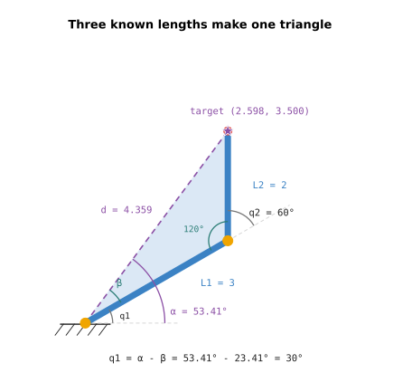
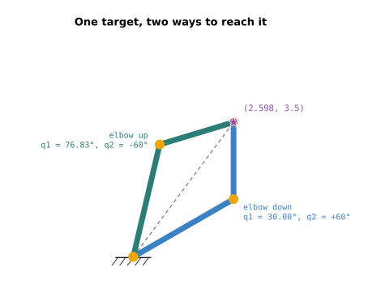
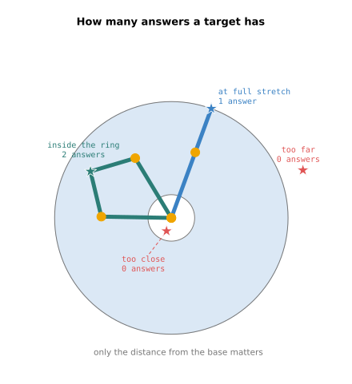
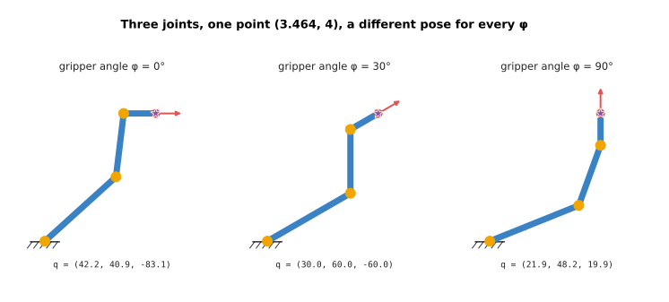
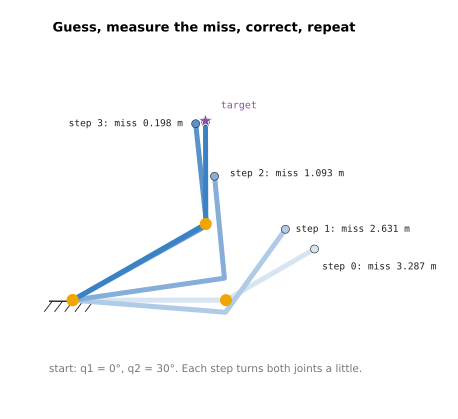

# Inverse kinematics

This doc answers the question a robot asks most often. You want the gripper at a
certain place. What angle should each joint turn to? Working that out is called
**inverse kinematics**, often shortened to IK.

It is for a beginner who has read [forward kinematics](01_forward-kinematics.md).
Forward kinematics goes from joint angles to the gripper. Inverse kinematics goes
the other way, and it is harder. A target might have two answers, one answer, no
answer, or endless answers. This doc shows each case on the same small arm, and
then shows the two ways programs solve it: with a formula, and by repeated
guessing.

The arm is the same one as before. Link 1 is 3 m and link 2 is 2 m. The main
target is `(2.598, 3.5)`, which is where the gripper sits at `q1 = 30°` and
`q2 = 60°`. So we already know one answer, and can check that the method finds it.
Every number in this doc is printed by `src/01_robotics-intro/kinematics/inverse.py`.

## Contents

1. [Why the backwards question is harder](#1-why-the-backwards-question-is-harder)
2. [Solving two joints with a triangle](#2-solving-two-joints-with-a-triangle)
3. [Two answers: elbow up and elbow down](#3-two-answers-elbow-up-and-elbow-down)
4. [Targets with no answer, or only one](#4-targets-with-no-answer-or-only-one)
5. [Three joints: endless answers, and how to pick one](#5-three-joints-endless-answers-and-how-to-pick-one)
6. [Numerical inverse kinematics: guess and correct](#6-numerical-inverse-kinematics-guess-and-correct)
7. [Formula or guessing: which to use](#7-formula-or-guessing-which-to-use)
8. [Running it](#8-running-it)
9. [What comes next](#9-what-comes-next)

---

## 1. Why the backwards question is harder

Forward kinematics is a chain of steps that each have one result, so it always
has one answer. Inverse kinematics has no such chain. You know where the gripper
must end up, but not how the links got there.

Think of reaching for a cup with your own arm. You can touch the cup with your
elbow held low, or with your elbow held high. Your hand is in the same place both
times. Your shoulder and elbow angles are different. That is two answers to one
inverse kinematics question.

Now think of a cup across the room. No arrangement of your shoulder and elbow
reaches it. That is a question with no answer.

A robot arm has the same problems, and its program has to handle all of them. It
must find every answer, pick one, and notice when there is none.

---

## 2. Solving two joints with a triangle

For a two-joint arm there is a formula. It comes from one observation: the base,
the elbow and the target always form a triangle.



We know all three sides of that triangle:

- the side from the base to the elbow is link 1, 3 m
- the side from the elbow to the target is link 2, 2 m
- the side from the base to the target is the distance `d`, which we can measure

A triangle with three known sides has fixed angles. The **law of cosines** turns
the three sides into an angle. The
[angles and trigonometry doc](../02_maths/01_angles-and-trigonometry.md) explains
it. Here we only use it.

The steps below go in the order the program runs them.

**Step 1: measure the distance to the target.** Use Pythagoras:

```
distance squared: 2.598^2 + 3.500^2 = 19.000
distance: 4.359 m
```

**Step 2: find joint 2.** The law of cosines, rearranged for this arm, gives the
cosine of `q2`:

```
cos(q2) = (d² - L1² - L2²) / (2 · L1 · L2)
```

With our numbers:

```
cos(q2) = (19.000 - 9 - 4) / 12 = 0.500
q2 = +60.00 or -60.00 degrees
```

Two angles have a cosine of 0.5: +60° and -60°. Both are real answers. Section 3
shows what each one looks like.

The picture shows how `q2` relates to the triangle. The triangle's own angle at
the elbow is 120°. `q2` is measured from the line link 1 would follow if it went
straight on, so `q2 = 180° - 120° = 60°`.

**Step 3: find joint 1.** Joint 1 has to point link 1 at the elbow, not at the
target. So it is found in two parts.

The first part is `α` (alpha), the angle from the table to the target. The
function `atan2` gives the angle of any point:

```
angle from the base to the target: atan2(3.500, 2.598) = 53.41 degrees
```

The second part is `β` (beta), the angle between the line to the target and
link 1. It depends on which `q2` was chosen:

```
for q2 = +60.00: the correction is atan2(1.732, 4.000) = +23.41, so q1 = 30.00
for q2 = -60.00: the correction is atan2(-1.732, 4.000) = -23.41, so q1 = 76.83
```

Then `q1 = α - β`. For `q2 = +60°` that is `53.41° - 23.41° = 30°`, which is the
pose we started from. The method found the answer we already knew.

It also found a second one, `q1 = 76.83°` with `q2 = -60°`.

The whole solution is about ten lines of Python. It is `two_joint_ik()` in
`src/01_robotics-intro/kinematics/planar_arm.py`.

---

## 3. Two answers: elbow up and elbow down

A good habit with inverse kinematics is to check every answer with forward
kinematics. Put the angles back in, and see whether the gripper lands on the
target. The program does that for both answers:

```
q1 =  30.00, q2 = +60.00: elbow at (2.598, 1.500), gripper at (2.598, 3.500), elbow down
q1 =  76.83, q2 = -60.00: elbow at (0.684, 2.921), gripper at (2.598, 3.500), elbow up
```

Both grippers land on `(2.598, 3.5)`. The elbows are in different places.



The dashed line runs from the base to the target. One answer has its elbow below
that line, and is called **elbow down**. The other has its elbow above it, and is
called **elbow up**. The two poses are mirror images of each other across the
dashed line.

The formula does not choose between them. The program has to, and it uses facts
the formula does not know:

- One pose might hit the table, or an object near the arm.
- One pose might need a joint to turn past its joint limit.
- One pose might be closer to where the arm is now, so it needs less movement.

Most programs use the last rule when nothing else decides. They pick the answer
nearest the current joint angles. That keeps the arm from swinging its elbow from
one side to the other for no reason.

---

## 4. Targets with no answer, or only one

The number of answers depends only on how far the target is from the base. Its
direction does not matter, because joint 1 can turn the whole arm to face it.

The program tries five targets along the x axis. The table below lists them. Read
each row as one target: its distance from the base, the value the law of cosines
gives for `cos(q2)`, and the answers it found as `(q1, q2)` in degrees.

| Target | Distance | cos(q2) | Answers |
| --- | --- | --- | --- |
| too far, `(6, 0)` | 6.00 | +1.917 | none |
| too close, `(0.5, 0)` | 0.50 | -1.062 | none |
| full stretch, `(5, 0)` | 5.00 | +1.000 | one: `(0, 0)` |
| folded back, `(1, 0)` | 1.00 | -1.000 | one: `(0, 180)` |
| inside the ring, `(4, 0)` | 4.00 | +0.250 | two: `(-28.96, 75.52)` and `(28.96, -75.52)` |



The picture draws the targets at different angles so they do not sit on top of
each other. Only the distance decides the count.

The cosine of any angle is between -1 and +1. That fact explains every row.

**Too far.** The formula asks for a cosine of 1.917. No angle has that cosine. The
target is 6 m away and the arm is only 5 m long, so no answer exists. A program
must check for this before it calls `acos`. Otherwise `acos` raises an error.

**Too close.** The formula asks for a cosine of -1.062. That is also impossible.
The target is inside the hole in the workspace, which the
[forward kinematics doc](01_forward-kinematics.md#7-the-workspace-everywhere-the-gripper-can-reach)
showed has a radius of 1 m.

**Full stretch.** The cosine is exactly 1, so `q2 = 0`. The arm is straight. There
is no elbow to put up or down, so the two answers become one.

**Folded back.** The cosine is exactly -1, so `q2 = 180°`. The arm is folded flat.
Again the two answers become one.

**Inside the ring.** The cosine is between -1 and +1, so there are two answers.
This is the normal case.

Targets right on the edge of the workspace, such as the full-stretch one, are a
bad place to work. The arm can reach them, but a small move of the target in the
wrong direction puts it out of reach. Real programs keep targets some distance in
from the edges. [Reaching and reachability](../../03_frameworks/03_arm-movement/02_reaching-and-reachability.md)
explains why, using the name these poses have in robotics: **singularities**.

---

## 5. Three joints: endless answers, and how to pick one

Add the third link from the
[forward kinematics doc](01_forward-kinematics.md#5-a-third-joint-and-the-grippers-angle),
1 m long. Ask it to put the gripper on the point `(3.464, 4)`.

Three joints are now trying to meet two numbers, `x` and `y`. There is one joint
more than the task needs. An arm with more joints than its task needs is called
**redundant**. A redundant arm has endless answers. You can tilt the last link a
little, move the other two to make up for it, and the gripper stays on the point.

To get a single answer, add a third number to the task: the gripper's angle `φ`.
Then the problem splits into two parts that we can already solve.

1. Link 3 must point along `φ`. So joint 3, the wrist, must sit exactly one
   link-3 length back from the target, in the direction opposite to `φ`.
2. That puts a known target on the wrist. Links 1 and 2 reach it with the
   two-joint formula from section 2.
3. Joint 3 makes up whatever angle is left: `q3 = φ - q1 - q2`.

The program does this for five gripper angles. For each one it prints both
answers as `(q1, q2, q3)` in degrees:

```
target: (3.464, 4.000)
gripper angle   0.0: (  42.19,   40.89,  -83.07)   or   (  74.55,  -40.89,  -33.66)
gripper angle  30.0: (  30.00,   60.00,  -60.00)   or   (  76.83,  -60.00,   13.17)
gripper angle  60.0: (  22.40,   62.14,  -24.54)   or   (  70.79,  -62.14,   51.35)
gripper angle  90.0: (  21.91,   48.19,   19.90)   or   (  59.88,  -48.19,   78.31)
gripper angle 180.0: no answer, the wrist is out of reach
```



Every row reaches the same point. Each gripper angle gives its own pair of poses,
elbow down and elbow up. The picture shows the elbow-down pose for three of them.

The row for 30° gives back `(30, 60, -60)`, the pose the target came from.

The last row has no answer. With the gripper pointing left, at 180°, the wrist
would have to sit at `(4.464, 4)`. That is about 5.99 m from the base, and links 1
and 2 only reach 5 m.

This split is the standard way to handle real arms. A six-joint arm is usually
built so that its last three joints meet at one point, the wrist. The first three
joints place the wrist, and the last three turn the gripper. The
[six-joint arm doc](../05_arm-types/03_the-six-joint-arm.md) shows that layout.

---

## 6. Numerical inverse kinematics: guess and correct

The triangle formula only works because this arm is simple. Many arms have no
neat formula. For those, programs use **numerical inverse kinematics**. It finds
an answer by repeated correction instead of by a formula.

The method has four steps, and then it repeats.

1. Start with a guess for the joint angles.
2. Run forward kinematics on the guess, and measure the **miss**: how far the
   gripper is from the target.
3. Work out how to turn each joint to shrink the miss.
4. Turn the joints by that much, and go back to step 2.

Step 3 needs to know how the gripper moves when each joint moves. That
information is called the **Jacobian**. For our arm it is a small table with one
column per joint. Each column says how far the gripper moves in `x` and in `y`
when that joint turns a tiny amount.

The code finds the Jacobian in the plain way. It turns one joint by a millionth
of a radian, runs forward kinematics, and sees how far the gripper went. It does
that once per joint. Then `np.linalg.pinv` turns the table round, from "gripper
movement per joint turn" to "joint turn per gripper movement". The
[NumPy doc](../01_python-and-numpy/02_numpy-intro.md#66-moving-an-arm-a-little-the-jacobian-and-pinv)
explains `pinv`.

The Jacobian is only exact for tiny moves. A big correction can overshoot, so the
code limits each step to about 30° per joint. That is why it takes several steps.

Here is the program starting from the guess `q1 = 0°`, `q2 = 30°`:

```
starting guess (0.0, 30.0):
  step 0: q1 =    0.00, q2 =   30.00, miss = 3.286921 m
  step 1: q1 =   -4.51, q2 =   58.65, miss = 2.630675 m
  step 2: q1 =    8.25, q2 =   87.30, miss = 1.093455 m
  step 3: q1 =   29.11, q2 =   67.04, miss = 0.198126 m
  step 4: q1 =   29.76, q2 =   60.40, miss = 0.010989 m
  step 5: q1 =   30.00, q2 =   60.00, miss = 0.000031 m
  step 6: q1 =   30.00, q2 =   60.00, miss = 0.000000 m
```



The miss shrinks slowly at first, then very fast. Once the arm is close, each
step cuts the miss by a large amount: from 0.198 m to 0.011 m, then to 0.00003 m.
The loop stops once the miss is below one micrometre.

It found `(30°, 60°)`, the elbow-down answer. It did not find the elbow-up
answer, and it gave no sign that one exists. Numerical IK finds the answer
nearest to its guess. The program shows this by starting again from a guess on
the other side, `q1 = 90°`, `q2 = -30°`:

```
starting guess (90.0, -30.0):
  step 0: q1 =   90.00, q2 =  -30.00, miss = 2.017869 m
  step 1: q1 =   93.63, q2 =  -58.65, miss = 1.315653 m
  step 2: q1 =   80.78, q2 =  -69.69, miss = 0.218336 m
  step 3: q1 =   77.08, q2 =  -60.59, miss = 0.012717 m
  step 4: q1 =   76.83, q2 =  -60.00, miss = 0.000055 m
  step 5: q1 =   76.83, q2 =  -60.00, miss = 0.000000 m
```

This time it found the elbow-up answer, `(76.83°, -60°)`.

That behaviour is useful in practice. A robot usually passes its current joint
angles as the guess. The solver then returns the answer nearest to where the arm
already is, which is normally the one you want.

---

## 7. Formula or guessing: which to use

Both methods gave the same angles. They differ in what they cost.

The program times each one on this computer. The exact numbers change a little
from run to run, and one run printed this:

```
by hand (law of cosines): 0.5 microseconds
numerical:                175.3 microseconds
numerical is about 332 times slower
```

The table below compares the two. Read each row as one property, with the answer
for each method beside it.

| | Formula (analytic) | Guess and correct (numerical) |
| --- | --- | --- |
| Speed | under a microsecond here | a few hundred times slower here |
| Answers found | all of them, every time | one, the nearest to the guess |
| No answer | detected for certain | only noticed when it gives up |
| Works for | arms with a known formula | any arm |
| Effort to write | a new formula for each arm design | the same code for every arm |

The formula is better when it exists. It is faster, it lists every answer, and it
says for certain when there is none. Its cost is that someone has to work the
formula out for each arm design, and many arm designs have no formula at all.

The numerical method is better when there is no formula, or when the arm has
extra joints. It works on any arm that has forward kinematics, because forward
kinematics is the only thing it calls. Its costs are speed, the need for a
starting guess, and the chance that it stops at a pose that is close but not
exact. That last case happens near singularities and near the edge of the
workspace.

Real systems often use both. The motion planning software MoveIt, for example,
uses a numerical solver by default, and lets you swap in a formula-based solver
for arms that have one. The
[arm movement chapter](../../03_frameworks/03_arm-movement/02_reaching-and-reachability.md)
covers those solvers and the singularities that trouble them.

---

## 8. Running it

Run this from the `code/` folder:

```
pixi run python src/01_robotics-intro/kinematics/inverse.py
```

It prints six sections, in the same order as this doc:

1. the two-joint solution, step by step, from section 2
2. both answers checked with forward kinematics, from section 3
3. the five targets and their answer counts, from section 4
4. the three-joint arm at five gripper angles, from section 5
5. numerical IK from two different guesses, from section 6
6. the timing comparison, from section 7

The solvers are in `src/01_robotics-intro/kinematics/planar_arm.py`. `two_joint_ik()` is the
triangle formula. `three_joint_ik()` is the wrist split. `numerical_ik()` is the
guess-and-correct loop, and `jacobian()` is the small table it uses.

Try moving the target in `inverse.py` and running it again. Move it past 5 m and
watch both methods fail. The formula says so at once. The numerical method uses
all 100 of its steps. For the target `(6, 0)` it ends with a miss of about 1 m,
because 1 m short is as close as a 5 m arm can get.

---

## 9. What comes next

This chapter used a flat arm, so every joint turned about the same axis. Real
arms turn in 3D, and they use different kinds of joint in different layouts.

The next chapter starts with
[joints and degrees of freedom](../05_arm-types/01_joints-and-degrees-of-freedom.md):
what kinds of joint exist, and why a real arm usually has six of them. It ends
with [the six-joint arm](../05_arm-types/03_the-six-joint-arm.md), where the
wrist split from section 5 appears again.
