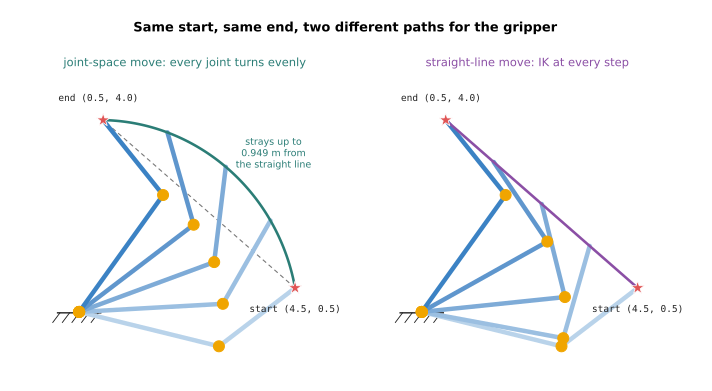
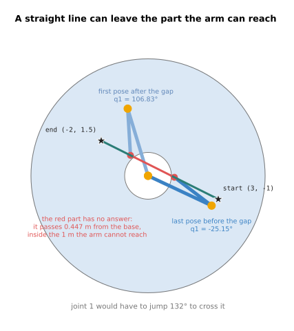
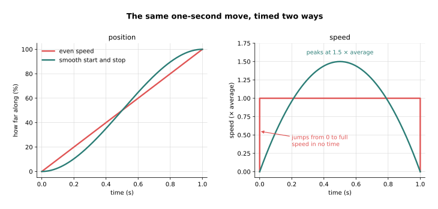

# Moving between poses

Inverse kinematics tells you the joint angles for the place you want the gripper
to be. It does not tell you how the arm gets there. This doc answers that second
question: how does an arm move from the pose it is in now to the pose it needs?

It is for a beginner who has read [forward kinematics](01_forward-kinematics.md)
and [inverse kinematics](02_inverse-kinematics.md). It is short on purpose. It
gives you the two basic ways to move, what each one costs, and the idea of a
smooth start and stop. The full treatment comes later, in Book 3.

The arm is the same one as before. Link 1 is 3 m and link 2 is 2 m. Every number
in this doc is printed by `src/kinematics/motion.py`.

## Contents

1. [An end point is not a movement](#1-an-end-point-is-not-a-movement)
2. [Joint-space moves: turn every joint evenly](#2-joint-space-moves-turn-every-joint-evenly)
3. [Straight-line moves: inverse kinematics at every step](#3-straight-line-moves-inverse-kinematics-at-every-step)
4. [When a straight line fails](#4-when-a-straight-line-fails)
5. [Which one to use](#5-which-one-to-use)
6. [A smooth start and stop](#6-a-smooth-start-and-stop)
7. [Running it](#7-running-it)
8. [What comes next](#8-what-comes-next)

---

## 1. An end point is not a movement

Inverse kinematics gives you one set of joint angles: the pose at the end. The arm
is somewhere else right now. Its motors cannot jump to the new angles. They have
to turn through every angle in between.

So a movement is a list of poses in order, each one a little further along, with a
time for each. The arm's controller steps through that list, many times a second.

There are two basic ways to make that list. You can plan in joint space, where you
choose how the joint angles change. Or you can plan in task space, where you choose
how the gripper moves and work out the joints from that. The
[forward kinematics doc](01_forward-kinematics.md#2-two-ways-to-describe-the-same-pose)
explains the two spaces. A move planned in task space is usually called a
**Cartesian move**, after the x and y coordinates the gripper's path is written in.

---

## 2. Joint-space moves: turn every joint evenly

The simplest move turns every joint evenly from its start angle to its end angle.
All the joints start together and finish together.

The example moves the gripper from `(4.5, 0.5)` to `(0.5, 4.0)`. Inverse
kinematics gives the angles at each end. Then the program cuts the change in each
angle into 8 equal steps, and runs forward kinematics at each step to see where the
gripper is:

```
start gripper (4.5, 0.5): q1 =  -13.83, q2 =   51.32
end gripper   (0.5, 4.0): q1 =   54.35, q2 =   74.29
step   joints                         gripper            off the straight line
   0   q1 =  -13.83, q2 =   51.32   ( 4.500,  0.500)   0.000 m
   1   q1 =   -5.31, q2 =   54.19   ( 4.302,  1.229)   0.419 m
   2   q1 =    3.21, q2 =   57.06   ( 3.987,  1.905)   0.720 m
   3   q1 =   11.74, q2 =   59.93   ( 3.566,  2.509)   0.897 m
   4   q1 =   20.26, q2 =   62.80   ( 3.056,  3.024)   0.949 m
   5   q1 =   28.78, q2 =   65.67   ( 2.474,  3.438)   0.877 m
   6   q1 =   37.30, q2 =   68.54   ( 1.840,  3.742)   0.688 m
   7   q1 =   45.82, q2 =   71.42   ( 1.175,  3.930)   0.392 m
   8   q1 =   54.35, q2 =   74.29   ( 0.500,  4.000)   0.000 m
the gripper strays up to 0.949 m from the straight line
```

Look at the joint columns. `q1` grows by 8.52° at every step, and `q2` by 2.87°.
That is what "evenly" means.

Now look at the last column. The gripper does not travel in a straight line. It
swings out on a curve, and in the middle it is 0.949 m away from the straight line
between the two ends. The left half of the picture below shows that curve.



A joint-space move has two strong points. It needs inverse kinematics only twice,
once for each end. And every pose along the way is valid, because each one is just
a set of joint angles between two sets that worked. The cost is that you do not
control the gripper's path. It goes where the joints take it.

---

## 3. Straight-line moves: inverse kinematics at every step

Sometimes the gripper has to travel in a straight line. To get that, you put the
points on the line first, and then run inverse kinematics at each one.

This is the same move, from `(4.5, 0.5)` to `(0.5, 4.0)`, done that way:

```
step   gripper on the line   joints
   0   ( 4.500,  0.500)      q1 =  -13.83, q2 =   51.32
   1   ( 4.000,  0.938)      q1 =  -14.24, q2 =   71.14
   2   ( 3.500,  1.375)      q1 =  -10.52, q2 =   84.55
   3   ( 3.000,  1.812)      q1 =   -3.58, q2 =   93.42
   4   ( 2.500,  2.250)      q1 =    5.92, q2 =   98.08
   5   ( 2.000,  2.688)      q1 =   17.16, q2 =   98.52
   6   ( 1.500,  3.125)      q1 =   29.26, q2 =   94.71
   7   ( 1.000,  3.562)      q1 =   41.66, q2 =   86.70
   8   ( 0.500,  4.000)      q1 =   54.35, q2 =   74.29
```

The gripper column now moves by the same amount at every step. The joints do not.
`q1` first goes backwards, from -13.83° to -14.24°, and then forwards. `q2` rises
to 98.52° and then falls again. The right half of the picture above shows the arm
bending more in the middle to keep the gripper on the line.

At every step the program keeps the answer closest to the joints the arm already
has. Without that rule, inverse kinematics could hand back the elbow-up answer at
one step and the elbow-down answer at the next. The arm would then flip its elbow
halfway along the line.

---

## 4. When a straight line fails

A straight-line move needs an answer at every point on the line. A joint-space move
needs one only at each end. That difference is what makes straight lines fail.

The first way to fail is a line that leaves the ring the arm can reach. This line
runs from `(3, -1)` to `(-2, 1.5)`. Both ends are reachable. The middle is not:

```
from (3.0, -1.0) to (-2.0, 1.5)
the line passes 0.447 m from the base; the arm cannot reach closer than 1 m
step   gripper on the line   distance from base   joints
   0   ( 3.000, -1.000)      3.162 m              q1 =  -56.20, q2 =  104.48
   1   ( 2.375, -0.688)      2.473 m              q1 =  -57.63, q2 =  125.02
   2   ( 1.750, -0.375)      1.790 m              q1 =  -52.28, q2 =  144.73
   3   ( 1.125, -0.062)      1.127 m              q1 =  -25.15, q2 =  167.83
   4   ( 0.500,  0.250)      0.559 m              no answer
   5   (-0.125,  0.562)      0.576 m              no answer
   6   (-0.750,  0.875)      1.152 m              q1 =  106.83, q2 =  166.57
   7   (-1.375,  1.188)      1.817 m              q1 =   98.78, q2 =  143.93
   8   (-2.000,  1.500)      2.500 m              q1 =  101.72, q2 =  124.23
joint-space move between the same two ends: closest to the base 2.500 m, every step has an answer
```

Steps 4 and 5 fall inside the 1 m hole around the base, so they have no answer.
Even if you skipped them, joint 1 would have to jump from -25.15° to 106.83° between
step 3 and step 6. The picture shows the gap and the two poses on either side of it.



The last line of the output is the joint-space move between the same two ends. It
never goes closer than 2.5 m to the base, and every step has an answer. It does not
travel in a straight line, but it gets there.

The second way to fail is a line that heads for full stretch. The
[inverse kinematics doc](02_inverse-kinematics.md#4-targets-with-no-answer-or-only-one)
showed that full stretch is the edge of the ring. Here the gripper moves out along
the x axis in equal 0.1 m steps:

```
gripper x   q2         how far q2 turned in this 0.1 m step
      4.4    57.99     
      4.5    52.83       5.16 degrees
      4.6    47.16       5.67 degrees
      4.7    40.76       6.40 degrees
      4.8    33.21       7.55 degrees
      4.9    23.44       9.77 degrees
      5.0     0.00      23.44 degrees
```

The gripper moves the same distance at every step. Joint 2 turns further each time,
and in the last step it turns 23.44°. If the gripper keeps a steady speed, joint 2
has to turn faster and faster. A real motor has a top speed, so the move has to slow
down or stop. A pose like full stretch, where a joint must turn very fast for a small
gripper movement, is called a **singularity**.

---

## 5. Which one to use

Real robots use both kinds of move, for different parts of a task. The table below
compares them. Read each row as one question you might ask about a move.

| Question | Joint-space move | Straight-line move |
| --- | --- | --- |
| Where does the gripper go on the way? | along a curve you do not choose | along the straight line you chose |
| How often is inverse kinematics run? | twice, once for each end | at every step |
| Can it fail partway? | no, if both ends are reachable | yes, at the hole, the edge, or a singularity |
| What is it used for? | travelling through open space | the last few centimetres of an approach, pushing a peg into a hole, drawing a line |

A typical pick works like this. The arm uses a joint-space move to travel to a point
just above the object, because that is quick and cannot fail partway. Then it uses a
short straight-line move to go down onto the object. Near the object, the gripper's
exact path matters, because a curve could knock the object over.

---

## 6. A smooth start and stop

The lists above say where the arm is at each step. They do not yet say when it gets
there. The simplest timing moves at the same speed from start to finish. That means
the speed jumps from zero to full at the start, and from full to zero at the end.

A real arm cannot do that. Its motors and links have mass, and changing speed takes
force. A sudden jump in speed shakes the arm, can overload a motor, and can throw the
object out of the gripper.

So real moves ramp the speed up from zero and back down to zero. The table below
shows a one-second move timed both ways. Read each row as one moment in the move.
Position is how far along the move the arm is. Speed is a multiple of the average
speed.

```
time      even speed              smooth start and stop
          position   speed        position   speed
0.000 s     0.0 %    0 -> 1.00      0.0 %    0.00
0.125 s    12.5 %    1.00           4.3 %    0.66
0.250 s    25.0 %    1.00          15.6 %    1.12
0.375 s    37.5 %    1.00          31.6 %    1.41
0.500 s    50.0 %    1.00          50.0 %    1.50
0.625 s    62.5 %    1.00          68.4 %    1.41
0.750 s    75.0 %    1.00          84.4 %    1.12
0.875 s    87.5 %    1.00          95.7 %    0.66
1.000 s   100.0 %    1.00 -> 0    100.0 %    0.00
```



The smooth move starts and ends at zero speed. It is slower at the ends and faster
in the middle, where it peaks at 1.5 times the average. Both moves arrive at the same
time. The curve used here is a simple one called a cubic, because it uses time
cubed. Real controllers use similar curves, with limits on speed and on how fast the
speed may change.

The timing works the same way for both kinds of move. You apply it to the fraction
of the way along. In a joint-space move that fraction scales the joint angles. In a
straight-line move it scales the distance along the line.

---

## 7. Running it

Run this from `code/`:

```
pixi run python src/kinematics/motion.py
```

`make kinematics.learn` runs it too, after the forward and inverse kinematics
programs. It prints five sections, in the same order as this doc: the joint-space
move, the straight-line move, the line through the hole, the line towards full
stretch, and the timing table.

Try changing `FAIL_START` and `FAIL_END` at the top of `motion.py`. Any line that
passes closer than 1 m to the base will fail partway, and the output shows where.

---

## 8. What comes next

This finishes the kinematics chapter. The next chapter,
[joints and degrees of freedom](../05_arm-types/01_joints-and-degrees-of-freedom.md),
turns from the maths to the hardware. It covers the kinds of joint, the common
kinds of arm, and the six-joint arm in detail. That finishes Book 1.

Moving an arm properly is covered in Book 3.
[Planning a path](../../03_frameworks/03_arm-movement/03_planning-a-path.md) covers
how a planner finds a way around obstacles. Its section on
[Cartesian paths](../../03_frameworks/03_arm-movement/03_planning-a-path.md#5-cartesian-paths-and-what-they-are-not)
covers the ways straight lines fail on a real arm. Its section on
[turning a path into a trajectory](../../03_frameworks/03_arm-movement/03_planning-a-path.md#8-turning-a-path-into-a-trajectory)
covers the timing. [Controlling the move](../../03_frameworks/03_arm-movement/04_controlling-the-move.md#2-joint-space-and-cartesian-space)
covers how the controller follows the list of poses.
