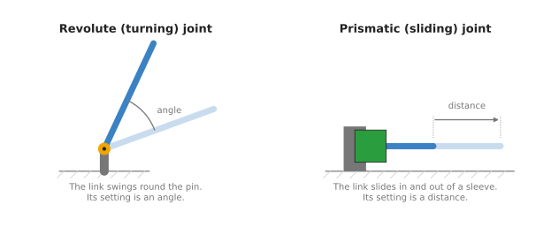
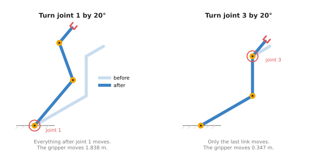
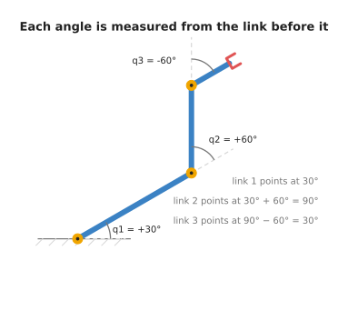
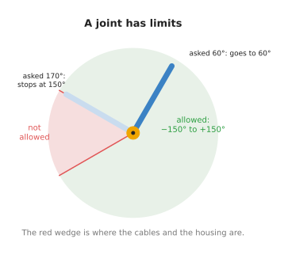
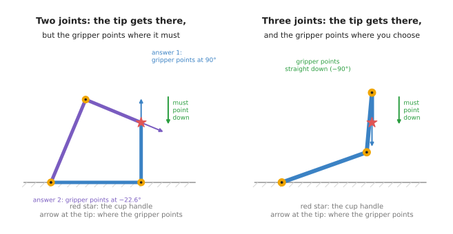
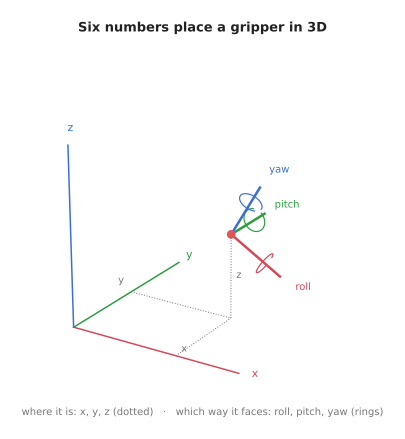

# Joints and degrees of freedom

This document answers three questions about any robot arm. What kinds of joint can an
arm have? When one joint moves, what happens to the rest of the arm? And how many
joints does an arm need to do a job?

It is for a beginner who has read the chapters before it. You should know what an
angle is and how `sin` and `cos` turn an angle into a position. The
[frames and transforms chapter](../03_arm/01_overview.md) did that on a two-joint arm.
This document uses the same arm with the 1 m third link that the frames chapter
added in its section 8, [making the arm bigger](../03_arm/01_overview.md#8-making-the-arm-bigger). It uses that arm to explain words that every later chapter
uses: joint, link, chain, joint limit and degree of freedom.

All the numbers below come from one small program, `src/01_robotics-intro/arm_types/joints.py`. The
[last section](#8-running-it) says how to run it.

## Contents

1. [The parts of an arm](#1-the-parts-of-an-arm)
2. [Two kinds of joint](#2-two-kinds-of-joint)
3. [One joint carries the next](#3-one-joint-carries-the-next)
4. [Why the angles add up](#4-why-the-angles-add-up)
5. [Joint limits](#5-joint-limits)
6. [Degrees of freedom](#6-degrees-of-freedom)
7. [How many joints a job needs](#7-how-many-joints-a-job-needs)
   · [On a flat table: three numbers](#on-a-flat-table-three-numbers)
   · [In the real world: six numbers](#in-the-real-world-six-numbers)
   · [Fewer than six, and more than six](#fewer-than-six-and-more-than-six)
8. [Running it](#8-running-it)
9. [What comes next](#9-what-comes-next)

---

## 1. The parts of an arm

A robot arm is built from a few kinds of part.

- The **base** is the part bolted to the table or the floor. It does not move.
- A **link** is a rigid piece, such as the upper arm or the forearm. A link does not
  bend.
- A **joint** connects two links and lets one move relative to the other.
- The **gripper** is the part at the far end that holds things. Its general name is
  the **end effector**, because it is the part that has an effect on the world. It
  can also be a suction cup, a welding torch or a screwdriver.

Each joint has a motor that moves it. Each joint also has a sensor, called an
**encoder**, that measures how far the joint has moved. The number the encoder reads
is the joint's **setting**. The robot's software reads every setting many times a
second, and it sends new settings to the motors.

The parts are joined in a line: base, joint, link, joint, link, and so on, out to the
gripper. This line is called a **chain**, and an arm built this way is called a
**serial arm**. Nearly every arm in this book is serial. The
[next document](02_five-common-arms.md) shows one kind that is not.

---

## 2. Two kinds of joint

Almost every joint on a robot arm is one of two kinds.



A **revolute joint** turns. It works like the hinge of a door, or your elbow. The next
link swings around a pin. The setting of a revolute joint is an angle, in degrees or
in radians.

A **prismatic joint** slides. It works like a drawer. The next link slides in and out
of a sleeve along a straight line. The setting of a prismatic joint is a distance, in
metres or millimetres.

Most arms use only revolute joints. A turning joint is compact, and one motor can
drive it directly through a gearbox. A sliding joint needs a rail or a screw as long
as the distance it moves, so it takes up more room. Sliding joints appear where a
straight movement is what the job needs, such as lowering a tool onto a part. The
next document shows two arms that use them.

The table below lists the two kinds side by side. Read each row across to compare
them.

| | Revolute | Prismatic |
| --- | --- | --- |
| What it does | turns | slides |
| Its setting | an angle | a distance |
| An everyday example | a door hinge | a drawer |
| Where you find it | nearly every joint of most arms | 3D printers, the up-and-down joint of a SCARA arm |

---

## 3. One joint carries the next

This section uses the arm from the frames chapter with a third link added. The links
are 3 m, 2 m and 1 m long. The joint angles are `q1 = 30°`, `q2 = 60°` and
`q3 = -60°`. The program prints where every joint is:

```
--- 1. the chain: q = (30, 60, -60) degrees ---
  base     ( 0.000,  0.000)
  joint 2  ( 2.598,  1.500)
  joint 3  ( 2.598,  3.500)
  gripper  ( 3.464,  4.000)
```

Joint 2 is bolted to the far end of link 1. Joint 3 is bolted to the far end of
link 2. So when a joint turns, it carries along everything that is bolted after it.

The picture below shows this. On the left, joint 1 turns by 20°. On the right, joint 3
turns by 20° instead.



When joint 1 turns, the whole arm swings around the base. Joint 2, joint 3 and the
gripper all move, even though their own motors did nothing:

```
--- 1a. turn joint 1 by +20 degrees: q = (50, 60, -60) ---
  base     moved 0.000 m
  joint 2  moved 1.042 m
  joint 3  moved 1.514 m
  gripper  moved 1.838 m
```

When joint 3 turns, only the last link moves. Everything before joint 3 stays where it
was:

```
--- 1b. turn joint 3 by +20 degrees instead: q = (30, 60, -40) ---
  base     moved 0.000 m
  joint 2  moved 0.000 m
  joint 3  moved 0.000 m
  gripper  moved 0.347 m
```

The same 20° turn moved the gripper 1.838 m in the first case and 0.347 m in the
second. The difference is the distance from the joint to the gripper. Joint 1 is
far from the gripper, so a small turn there sweeps the gripper a long way. Joint 3 is
close to the gripper, so the same turn moves it only a little.

This is how the joints of an arm affect each other. A joint never sends a message to
the next joint. It moves the link that the next joint is bolted to, and that carries
the next joint along. Two things follow from this:

- The joints near the base do the large movements. They are also the ones that carry
  the most weight, so they have the biggest motors.
- The joints near the gripper do the small, fine movements. Their motors are small,
  because they only carry the gripper and what it holds.

---

## 4. Why the angles add up

Each joint's angle is measured from the link before it, not from the table. The
frames chapter showed this for two joints. With three joints it works the same way.



Link 1 points at 30° from the table, because that is `q1`. Link 2 starts from the
direction of link 1, and then turns another 60°. So it points at `30° + 60° = 90°`
from the table. Link 3 starts from the direction of link 2, and then turns -60°. So
it points back to `90° - 60° = 30°`. The program prints the running total:

```
--- 2. the angles add up along the chain ---
  link 1: its joint says   +30, it points at   +30 from the table
  link 2: its joint says   +60, it points at   +90 from the table
  link 3: its joint says   -60, it points at   +30 from the table
```

This is why joint 1 moved everything in the previous section. Adding 20° to `q1`
adds 20° to every running total after it. Adding 20° to `q3` changes only the last
one.

The direction the gripper points is the last running total: `q1 + q2 + q3`. You will
need this in section 7.

---

## 5. Joint limits

A real joint cannot turn forever. It stops at a **joint limit**, which is the
smallest or largest setting it is allowed to reach.



There are three common reasons for a limit.

- Cables run through the joint to the motors further out. If the joint turned round
  and round, the cables would wind up and tear.
- The two links would hit each other, or hit the housing of the motor.
- A sliding joint can only slide as far as its rail is long.

When software asks a joint for a setting beyond its limit, the joint stops at the
limit. Real robot controllers usually refuse the command instead, and report an
error. Either way, the arm does not end up where the software expected. The program
shows the first behaviour, for a joint limited to -150° to +150°:

```
--- 3. joint limits: joint 2 can only reach -150 to +150 degrees ---
  asked for    +60, the joint goes to    +60
  asked for   +170, the joint goes to   +150
  asked for   -200, the joint goes to   -150
```

Limits differ a lot between arms. Every joint of the Universal Robots UR5e can turn
from -360° to +360°, which is two full turns
([UR5e datasheet](https://www.universal-robots.com/media/1807465/ur5e_e-series_datasheets_web.pdf)).
The first joint of the Epson T3-B SCARA arm can turn only from -132° to +132°
([Epson T3-B specification](https://epson.com/For-Work/Robots/SCARA/Epson-T3-B-All-in-One-SCARA-Robot/p/RT3B-401SS)).
Any program that plans a movement has to know these numbers. Otherwise it may plan a
movement that the arm cannot make.

---

## 6. Degrees of freedom

A **degree of freedom** is one number that you can change on its own. The short form
is **DOF**. For a serial arm, the count is simple: each joint has one setting, so each
joint adds one degree of freedom. A three-joint arm has 3 DOF. A six-joint arm has
6 DOF.

The gripper's own open-and-close motor is usually not counted. It changes what the
gripper holds, not where the gripper is. For example, the low-cost SO-101 learning arm
has six motors. Five of them move the arm and one opens and closes the gripper
([LeRobot SO-101 guide](https://huggingface.co/docs/lerobot/so101)). So it is usually
called a five-joint arm with a gripper.

The word "degrees of freedom" is also used for an object, not only for an arm. There
it means how many numbers you need to say exactly where the object is and which way
it faces. The next section compares the two. The arm needs at least as many degrees
of freedom as the job asks of the object it holds.

---

## 7. How many joints a job needs

### On a flat table: three numbers

Start on a flat table, where everything is 2D. Say a cup has its handle at
`(3, 2)`, and the gripper has to come at the handle from above, pointing straight
down.

That job has three numbers in it: the handle's `x`, the handle's `y`, and the
direction the gripper points, `-90°`. The picture compares a two-joint arm and a
three-joint arm doing it.



The two-joint arm has links of 3 m and 2 m. It can put its tip on the handle in two
ways. But in each way, the direction the gripper points is fixed by the two angles.
It is `q1 + q2`, from section 4, and the arm has no joint left to change it:

```
--- 4. reach the cup handle at (3, 2), gripper pointing straight down (-90) ---
  2 joints: q = (   0.00,   90.00)  tip (3.000, 2.000)  gripper points at   90.00
  2 joints: q = (  67.38,  -90.00)  tip (3.000, 2.000)  gripper points at  -22.62
```

The first answer points the gripper straight up. The second points it at -22.62°.
Neither points it straight down. Two joints give two numbers, and the job has three.

The three-joint arm solves it in two steps. First, the program works out where the
last joint must be: 1 m straight above the handle, at `(3, 3)`, because the last link
is 1 m long and has to hang straight down. The first two joints put that joint there,
in the same way as before. Then the third joint turns the last link until
`q1 + q2 + q3 = -90°`:

```
  3 joints: q = (  19.63,   65.38, -175.00)  tip (3.000, 2.000)  gripper points at  -90.00
  3 joints: q = (  70.37,  -65.38,  -95.00)  tip (3.000, 2.000)  gripper points at  -90.00
```

Both answers put the tip on the handle and point the gripper straight down. Three
joints give three numbers, which is what the job needs.

This split will come back in the six-joint arm. Some joints place a point near the
end of the arm. The joints after that point turn the gripper.

### In the real world: six numbers

In 3D, a job needs six numbers.



Three of the numbers say **where** the gripper is: `x`, `y` and `z`. These are the
three dotted lines in the picture.

The other three say **which way it faces**. The name for this is **orientation**. The
three numbers are turns about three axes that are fixed to the gripper:

- **roll** is a turn about the axis the gripper points along, like turning a key
- **pitch** is a turn that tips the gripper's nose up or down
- **yaw** is a turn that swings the nose left or right

Together, position and orientation are called the gripper's **pose**. A pose is six
numbers, so an arm needs six joints to reach any pose in the space around it. This is
why the six-joint arm is the most common kind. The
[six-joint arm document](03_the-six-joint-arm.md) looks at one in detail.

### Fewer than six, and more than six

An arm with fewer than six joints cannot reach every pose. That is not always a
problem. Many jobs do not need all six numbers.

- A SCARA arm has four joints. It only ever works from above, with the tool pointing
  straight down. It needs `x`, `y`, `z` and one turn about the vertical, so four
  joints are enough.
- The SO-101 has five joints. It can reach most positions in front of it, but it
  cannot choose all three turns at every position.

An arm with more than six joints has more joints than any pose needs. It can reach
the same pose in endlessly many ways. That sounds like a waste, but it is useful. The
extra joint lets the arm move its elbow out of the way while the gripper stays still.
The [next document](02_five-common-arms.md) shows this on a seven-joint arm.

---

## 8. Running it

From inside `code/`, run:

```
make arms.learn
```

That runs both programs of this chapter. To run only the one used in this document:

```
pixi run python src/01_robotics-intro/arm_types/joints.py
```

It prints the four numbered sections quoted above, in the same order, and then exits.
It needs no robot and no simulator. The pictures are drawn from the same functions by
`docs/diagrams/arm_types.py`.

---

## 9. What comes next

You now have the words to describe any arm: what kinds of joint it has, how many, and
in what order. The [next document](02_five-common-arms.md) uses those words to
describe five kinds of arm that are in wide use, and what each one is good for.
