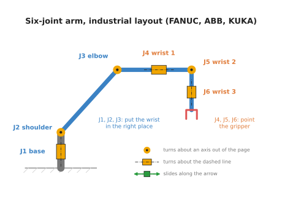
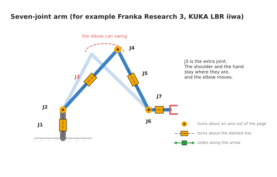
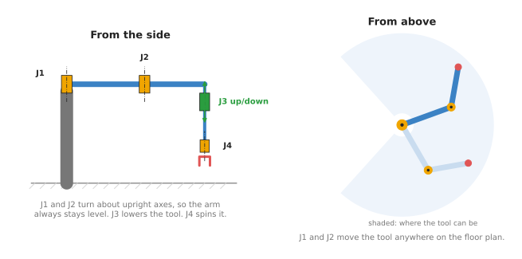
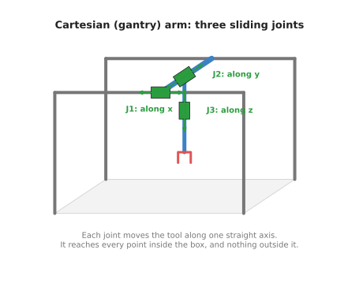
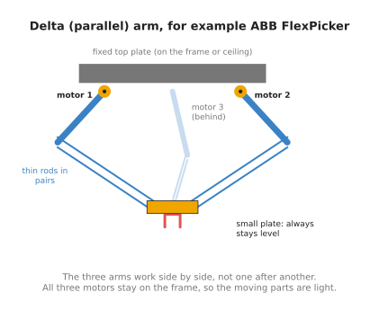

# Five common kinds of robot arm

This document describes the five kinds of robot arm you are most likely to meet: the
six-joint arm, the seven-joint arm, the SCARA arm, the Cartesian arm and the delta
arm. For each one it answers four questions. How are its joints arranged? What is it
good at? Where is it used? And what does it cost you to choose it rather than one of
the others?

It is for a beginner who has read the
[joints and degrees of freedom](01_joints-and-degrees-of-freedom.md) document. That
document explains revolute (turning) and prismatic (sliding) joints, the chain, and
degrees of freedom (DOF). This one uses those words throughout. At the end there is a
table that compares all five, and a short note on the cheap arms people learn on.

Every number below comes from the maker's own datasheet or product page, and each
one has a link.

## Contents

1. [How to read the drawings](#1-how-to-read-the-drawings)
2. [The six-joint arm](#2-the-six-joint-arm)
3. [The seven-joint arm](#3-the-seven-joint-arm)
4. [The SCARA arm](#4-the-scara-arm)
5. [The Cartesian arm](#5-the-cartesian-arm)
6. [The delta arm](#6-the-delta-arm)
7. [Serial and parallel arms](#7-serial-and-parallel-arms)
8. [The five side by side](#8-the-five-side-by-side)
9. [Arms for learning](#9-arms-for-learning)
10. [Why this book uses the six-joint arm](#10-why-this-book-uses-the-six-joint-arm)

---

## 1. How to read the drawings

Each arm below has a drawing that shows only its joints and links. The drawings use
three symbols:

- An orange circle with a dot is a revolute joint whose axis points out of the page.
  The link swings in the plane of the page, like a hinge seen from the side.
- An orange box with a dashed line through it is a revolute joint whose axis is the
  dashed line. The link twists around that line.
- A green box with a double arrow is a prismatic joint. It slides along the arrow.

The joints are numbered J1, J2 and so on, from the base outwards. That is the order
of the chain.

---

## 2. The six-joint arm

The six-joint arm is the arm most people picture when they hear "robot arm". Its
other name is the **articulated arm**, which means an arm made of jointed sections,
like a human arm.

**How its joints are arranged.** All six joints are revolute.

- J1, the base, turns the whole arm about an upright axis.
- J2, the shoulder, lifts the upper arm up and down.
- J3, the elbow, bends the forearm.
- J4, J5 and J6 form the wrist, close to the gripper.

The first three joints move the wrist to the right place. The last three turn the
gripper to face the right way. That split is the same one as in section 7 of the
previous document, with three numbers for position and three for orientation.

The drawing shows the layout of large industrial arms, such as those made by FANUC,
ABB and KUKA. In that layout, J4 twists the forearm along its length. Universal
Robots arms are arranged a little differently. On a UR arm, the shoulder, the elbow
and wrist 1 all turn about parallel axes. The
[six-joint arm document](03_the-six-joint-arm.md) looks at a UR arm in detail.

**What it is good at.** Six joints give six numbers, so it can put its gripper at any
position within reach, facing any direction. It can reach over things, around things,
and into boxes from the side.

**Where it is used.** It welds car bodies, paints, loads and unloads machine tools,
and stacks boxes onto pallets. Smaller six-joint arms that are safe to work next to
people are called **collaborative robots**, or **cobots**.

**A real example.** The Universal Robots UR5e has six revolute joints. It can reach
850 mm from its base and carry 5 kg. Every joint turns from -360° to +360°
([UR5e datasheet](https://www.universal-robots.com/media/1807465/ur5e_e-series_datasheets_web.pdf)).

**What it costs you.** The maths is harder than for any other arm here. Working out
the joint angles for a given pose has up to eight answers, and the software has to
pick one. There are also poses where the arm loses the ability to move in some
direction, called **singularities**. The
[six-joint arm document](03_the-six-joint-arm.md) shows both. For a job that only
ever works from above, a six-joint arm is also slower and more expensive than a
SCARA arm that could do the same job.

---

## 3. The seven-joint arm

A seven-joint arm is a six-joint arm with one extra revolute joint.

**How its joints are arranged.** The joints alternate between twisting and bending,
much like a human arm. Your shoulder can twist and lift, your elbow bends, and your
wrist can twist and bend. In the drawing, J3 is the extra joint. It twists the upper
arm along its own length.

**What the extra joint does for you.** A pose needs six numbers. With seven joints,
the arm has one more than it needs. So the arm can reach the same pose in endlessly
many ways. The drawing shows what that means in practice. The shoulder stays where it
is, and the hand stays where it is, and the elbow can still swing round in a circle
between them. You can do the same with your own arm. Put your hand flat on a table and
keep it still, and you can still raise and lower your elbow.

That freedom is used to:

- move the elbow out of the way of an obstacle, such as the side of a shelf
- keep every joint away from its limits
- keep the arm away from singular poses, where it would lose a direction of movement

**Where it is used.** Research labs use seven-joint arms heavily, especially for work
next to people and for learning from demonstration. They are also used for delicate
assembly in factories.

**Real examples.** The Franka Research 3 has seven joints, a reach of 855 mm and a
payload of 3 kg. It has a torque sensor in every joint, which measures how hard the
joint is being pushed
([Franka Research 3](https://franka.de/franka-research-3)). The KUKA LBR iiwa also has
seven joints with a torque sensor in each. It comes in a 7 kg version and a 14 kg
version
([KUKA LBR iiwa](https://www.kuka.com/en-de/products/robot-systems/industrial-robots/lbr-iiwa)).

**What it costs you.** Endless answers are a problem as well as a gift. The software
cannot just "solve for the joint angles". It has to choose one answer out of
infinitely many, using a rule such as "keep the elbow high" or "stay away from the
limits". The extra joint also adds weight, cost and one more motor that can fail. The
alternative is a six-joint arm, which is simpler and cheaper, but cannot move its
elbow without moving its hand.

---

## 4. The SCARA arm

SCARA stands for **Selective Compliance Assembly Robot Arm**. "Compliance" means
give, or how much the arm yields when pushed. A SCARA arm yields a little sideways and
is stiff up and down. That is exactly what you want when pushing a peg into a hole
from above. The peg can shift sideways into the hole, and the arm does not sag when it
presses down.

**How its joints are arranged.** A SCARA arm has four joints.

- J1 and J2 are revolute, and both turn about upright axes. So the two links always
  stay level, like the two sections of a folding desk lamp swung flat. Seen from
  above, they work exactly like the flat two-joint arm of the frames chapter.
- J3 is prismatic. It slides a shaft straight up and down.
- J4 is revolute. It spins the tool about the vertical.

That is four numbers: `x` and `y` on the floor plan, the height `z`, and one turn.

**What it is good at.** It is fast and precise for jobs done from above. It picks
parts up and puts them down, drives screws, and inserts parts into boards. Its links
are level and short, so it can move them very quickly.

**Where it is used.** Electronics assembly, small-part assembly, and laboratory
automation.

**A real example.** The Epson T3-B has four joints and a 400 mm reach. It carries up
to 3 kg. J1 turns from -132° to +132°, J2 from -141° to +141°, J3 slides 150 mm, and
J4 turns from -360° to +360°. It repeats a position to within 0.02 mm
([Epson T3-B](https://epson.com/For-Work/Robots/SCARA/Epson-T3-B-All-in-One-SCARA-Robot/p/RT3B-401SS)).

**What it costs you.** It cannot tilt its tool. It always works straight down, so it
cannot reach into the side of a box or pour from a cup. It only reaches a flat ring
around its base, a limited height below it. The alternative is a six-joint arm, which
can tilt, but is slower and more expensive for the same top-down job.

---

## 5. The Cartesian arm

A Cartesian arm has three prismatic joints, one along each of the three axes `x`, `y`
and `z`. The name comes from Cartesian coordinates, which is the usual name for
`(x, y, z)` coordinates. It is also called a **gantry**, because the moving parts hang
from a frame that stands over the work, like the gantry cranes in a shipping port.

**How its joints are arranged.** J1 slides a bridge along the frame, in `x`. J2 slides
a carriage along the bridge, in `y`. J3 slides a shaft up and down, in `z`. Some
Cartesian arms add a fourth, revolute joint that spins the tool.

**What it is good at.** Its maths is the simplest there is. Each joint's setting *is*
one coordinate of the tool. There are no angles to convert and no `sin` or `cos`. To
move the tool to `(x, y, z)`, you set the three joints to `x`, `y` and `z`. It is also
stiff and accurate, and it can be made as large as you like by making the rails
longer.

**Where it is used.** A 3D printer is a Cartesian arm that carries a nozzle. So is a
CNC (computer numerical control) router or milling machine, which carries a cutting
tool. Larger gantries move parts between machines in factories.

**What it costs you.** The frame has to be larger than the space it works in. It takes
floor space and headroom. It reaches every point inside its box and nothing outside
it. It cannot reach around an object, or into an opening from the side. The
alternative is a six-joint arm, which reaches a larger space for the room it takes up,
but needs much harder maths.

---

## 6. The delta arm

A delta arm hangs from a frame above the work. Three arms come down from three motors
and meet at one small plate that carries the tool. The name comes from the Greek
letter delta, Δ, which is a triangle. The three motors sit at the corners of a
triangle.

**How its joints are arranged.** Each of the three motors turns one short upper arm.
From the end of each upper arm, a pair of thin parallel rods runs down to the small
plate. The rods in each pair stay parallel. That keeps the small plate level, facing
straight down, wherever it moves. Many delta arms add a fourth joint that spins the
tool.

**What it is good at.** Speed. All three motors stay on the fixed frame. The parts
that move are only the light upper arms, the thin rods and the small plate. Light
parts can start and stop very quickly.

**Where it is used.** Picking food and small products off a moving conveyor belt and
putting them into packs. Chocolates into a box is the classic example.

**A real example.** The ABB IRB 360 FlexPicker comes in versions that carry from 1 kg
to 8 kg, with a working area from 800 mm to 1600 mm across. It hangs upside down from
a frame. Its 8 kg version handles up to 100 picks a minute
([ABB IRB 360 datasheet](https://library.e.abb.com/public/1c971fb90d8c34f8c1257c2100468677/ROB0082EN_F_HR.pdf)).

**What it costs you.** It carries little weight. It reaches only a small, shallow
space under the frame, shaped like a dome. The tool always points straight down. It
also needs a frame above the work. The alternative is a SCARA arm, which does similar
top-down picking with a larger reach and more payload, but is slower.

---

## 7. Serial and parallel arms

The delta arm is built differently from the other four, and the difference matters.

The six-joint, seven-joint, SCARA and Cartesian arms are **serial arms**. Their joints
are in one chain: each joint rides on the link before it, as in section 3 of the
previous document. Serial arms reach a large space, but the whole chain has to carry
the motors that are further out. Every small error in a joint near the base is
carried out to the gripper, and made larger by the length of the arm.

The delta arm is a **parallel arm**. Its three arms work side by side, and each one
connects the frame directly to the tool plate. The motors do not carry each other.
The small plate is held by three arms at once, so it is stiff and precise. The cost is
a small working space, because all three arms have to reach the plate at the same
time.

---

## 8. The five side by side

The table below compares the five kinds. Each row is one kind of arm. Read across to
see its joints, what it can do, and its main limit.

| Arm | Joints | Can tilt the tool? | Best at | Main limit | Example |
| --- | --- | --- | --- | --- | --- |
| Six-joint | 6 revolute | yes | reaching any pose | harder maths, up to 8 answers | UR5e |
| Seven-joint | 7 revolute | yes | reaching round obstacles | endless answers, cost | Franka Research 3, KUKA LBR iiwa |
| SCARA | 3 revolute, 1 prismatic | no, always down | fast work from above | cannot tilt | Epson T3-B |
| Cartesian | 3 prismatic (sometimes 1 revolute) | no | simple, accurate, large | frame larger than the work | 3D printers, CNC machines |
| Delta | 3 revolute motors in parallel (sometimes 1 more) | no, always down | very fast picking | small payload, small space | ABB IRB 360 |

---

## 9. Arms for learning

Industrial arms cost many thousands of dollars. People who are learning, and many
research labs, now start on low-cost arms instead.

The best known is the SO-101, an open design by The Robot Studio. It is 3D-printed,
and it moves with six Feetech STS3215 servo motors. A **servo motor** is a small motor
with its own gearbox, sensor and controller in one box. Five of the motors move the
joints: shoulder pan, shoulder lift, elbow flex, wrist flex and wrist roll. The sixth
opens and closes the gripper
([LeRobot SO-101 guide](https://huggingface.co/docs/lerobot/so101)). The parts for one
arm cost about $122, and the parts for a pair of arms cost about $230, not counting the
3D printing ([SO-ARM100 repository](https://github.com/TheRobotStudio/SO-ARM100)).

The SO-101 is normally built as a pair. You move one arm, called the leader, by hand.
The other arm, called the follower, copies it. Recording those movements gives
training data for a learned policy. Hugging Face's LeRobot library supports the SO-101
directly. The [learning path](../../03_frameworks/04_one-arm-training/04_learning-path.md)
in Book 3 covers this way of working.

What it is, then, is a five-joint serial arm with a gripper. What it does for you is
let you try real hardware and learned control for the cost of a textbook. The
alternative is an industrial arm, which is stronger and far more repeatable, but
costs many times more. What it costs you is precision and
strength. With five joints it cannot reach every orientation, its servos carry little
weight, and its plastic parts bend a little under load.

---

## 10. Why this book uses the six-joint arm

The rest of this book, and most of Book 3, uses six-joint arms. The reason is that
the six-joint arm is the general case. It needs every idea the other arms need, and
some they do not: frames, forward kinematics, up to eight inverse kinematics answers,
and singularities. If you understand the six-joint arm, the others are simpler cases.

The obvious alternative would be to start with a SCARA or a Cartesian arm, whose maths
is easier. The cost of starting there is that the easy maths does not carry over. A
Cartesian arm has no angles to convert at all, so it teaches nothing about the chain.

The cost of choosing the six-joint arm is that its maths is the hardest here. The
[next document](03_the-six-joint-arm.md) takes that maths one joint at a time, on a
real arm.
