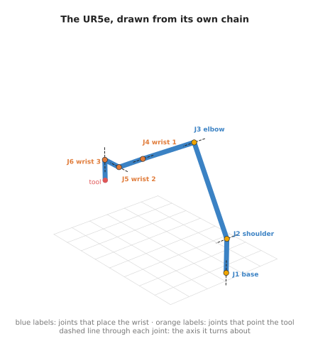
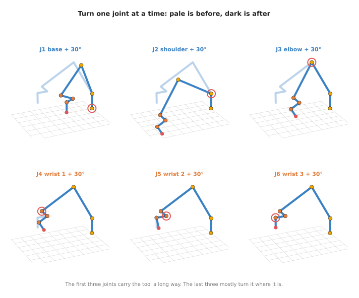
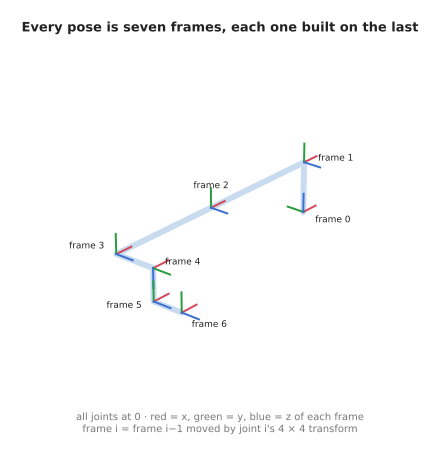
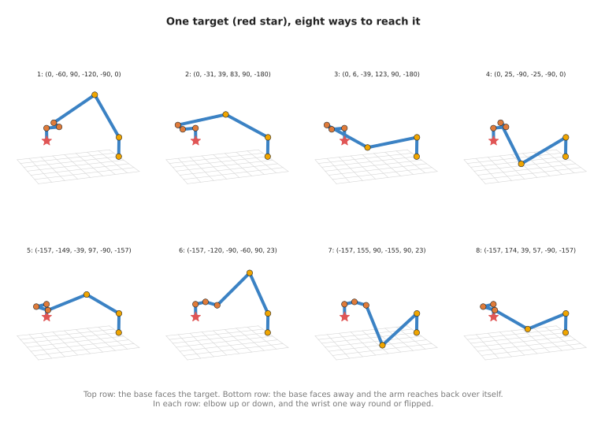

# The six-joint arm, joint by joint

This document takes one real six-joint arm, the Universal Robots UR5e, and goes
through it one joint at a time. It answers four questions. What does each of the six
joints do? How does each joint pass its movement on to the next one, in 3D? How does
the maker describe the arm so that software can work out where the tool is? And why
are there up to eight different sets of joint angles that put the tool in the same
place?

It is for a beginner who has read the rest of Book 1. You need the idea of a chain of
joints from [joints and degrees of freedom](01_joints-and-degrees-of-freedom.md), the
4 × 4 transform from [vectors and matrices](../02_maths/02_vectors-and-matrices.md),
and the words forward kinematics and inverse kinematics from the
[kinematics chapter](../04_kinematics/01_forward-kinematics.md). This document puts
all of them to work on a real arm.

All the numbers below are printed by one program, `src/01_robotics-intro/arm_types/ur5e.py`. The
[running it](#8-running-it) section says how to run it.

## Contents

1. [The six joints](#1-the-six-joints)
2. [What each joint does on its own](#2-what-each-joint-does-on-its-own)
3. [How the chain passes each turn on](#3-how-the-chain-passes-each-turn-on)
4. [The UR5e's published chain](#4-the-ur5es-published-chain)
5. [Forward kinematics, with real numbers](#5-forward-kinematics-with-real-numbers)
6. [Inverse kinematics: eight answers](#6-inverse-kinematics-eight-answers)
   · [Finding them](#finding-them)
   · [The three choices](#the-three-choices)
   · [Which answer the robot uses](#which-answer-the-robot-uses)
7. [The wrist singularity](#7-the-wrist-singularity)
8. [Running it](#8-running-it)
9. [Book 1 is complete](#9-book-1-is-complete)

---

## 1. The six joints

The UR5e has six revolute joints, reaches 850 mm and carries 5 kg
([UR5e datasheet](https://www.universal-robots.com/media/1807465/ur5e_e-series_datasheets_web.pdf)).
Universal Robots names its joints base, shoulder, elbow, wrist 1, wrist 2 and wrist 3.

The picture below is not a photograph. It is drawn from the program's own forward
kinematics, at a pose where the arm reaches forward and down over a table. Each dot
is a joint, and the dashed line through each joint is the axis it turns about.



The six joints fall into two groups.

- **Base, shoulder and elbow** (blue labels) are the big joints. They carry the wrist
  to the right place. Base swings the whole arm round. Shoulder lifts the upper arm.
  Elbow bends the forearm.
- **Wrist 1, wrist 2 and wrist 3** (orange labels) are the small joints near the tool.
  They turn the tool to face the right way.

This is the same split you saw on the flat arm in the
[previous chapter's section 7](01_joints-and-degrees-of-freedom.md#7-how-many-joints-a-job-needs):
some joints place a point, and the joints after it point the tool.

On many industrial arms, the three wrist axes meet at one point, called a
**spherical wrist**. Then the wrist joints only turn the tool and never move it. The
UR5e's wrist joints are offset from each other by 10 to 13 cm, so its wrist is not
spherical. The next section shows what that changes.

---

## 2. What each joint does on its own

The program starts from the working pose in the picture above. Then, for each joint in
turn, it adds 30° to that one joint and leaves the others alone. It measures how far
the tool moves, and how far the direction the tool points turns.



The program prints this:

```
--- 3. one joint at a time: add 30 degrees to each joint of the working pose ---
  base      tool moves  344.4 mm, tool direction turns   0.0 deg
  shoulder  tool moves  339.5 mm, tool direction turns  30.0 deg
  elbow     tool moves  274.1 mm, tool direction turns  30.0 deg
  wrist 1   tool moves   72.9 mm, tool direction turns  30.0 deg
  wrist 2   tool moves   51.6 mm, tool direction turns  30.0 deg
  wrist 3   tool moves    0.0 mm, tool direction turns   0.0 deg
```

Here is what each line means, joint by joint.

- **Base** swings the whole arm round an upright axis. The tool moves 344.4 mm
  sideways. The tool points straight down in this pose, and a turn about an upright
  axis leaves a straight-down direction straight down. So its direction does not
  change. It is still turned about its own pointing line, the way a drill bit turns.
- **Shoulder** tips the whole arm forward. The tool moves 339.5 mm and tilts by the
  full 30°, because everything after the shoulder tilts with it.
- **Elbow** bends the forearm. The tool moves 274.1 mm, a little less than for the
  shoulder, because the elbow is closer to the tool.
- **Wrist 1** tilts the wrist. The tool tilts 30° but moves only 72.9 mm.
- **Wrist 2** swings the wrist sideways. The tool tilts 30° and moves 51.6 mm.
- **Wrist 3** spins the tool about its own pointing line. The tool neither moves nor
  changes direction. It only turns about that line.

The pattern is the chain from the previous document. The joints near the base move
the tool a long way, because they carry the whole arm. The joints near the tool move
it only a little. The wrist joints still move the tool by 5 to 7 cm here. That is the
cost of the wrist not being spherical: wrist 1 and wrist 2 are offset from the tool,
so turning them swings the tool round a short arc.

---

## 3. How the chain passes each turn on

In the flat arm, each joint's turn was one angle, and the angles added up. In 3D a
turn can be about any axis, so a single number is not enough. Instead, each joint
gets its own **frame**, which is a starting point with its own `x`, `y` and `z` axes,
fixed to the link that joint moves.



The picture shows the arm with every joint at 0°, and the frame at each joint. Frame 0
is fixed to the base plate. Frame 6 is fixed to the tool. Each joint turns about the
blue `z` axis of the frame before it.

How to get from one frame to the next is written as one 4 × 4 transform. The
[vectors and matrices document](../02_maths/02_vectors-and-matrices.md) introduced
these: the top-left 3 × 3 block is a turn, and the right-hand column is a shift. One
joint's transform depends on its own angle and on the fixed shape of its link, and on
nothing else.

To find where frame 6 is, you start at frame 0 and multiply by each joint's transform
in order:

```
frame 6 = T1(q1) @ T2(q2) @ T3(q3) @ T4(q4) @ T5(q5) @ T6(q6)
```

Here `@` is matrix multiplication, as in NumPy. The order matters. Each transform is
written in the frame of the one before it, so it has to come after it in the product.
This is the 3D version of what you saw on the flat arm: there, the angles added up;
here, the transforms multiply.

This multiplication is how one joint affects all the joints after it. Turning `q1`
changes `T1`. Every frame after it is built on top of `T1`, so every one of them
moves. Turning `q6` changes only `T6`, so only frame 6 moves.

The program does exactly this, keeping every frame along the way. Here it is with the
type hints left out:

```python
def forward(q):
    frames = [np.eye(4)]
    for theta, (d, a, alpha) in zip(q, UR5E_CHAIN):
        frames.append(frames[-1] @ joint_transform(theta, d, a, alpha))
    return frames
```

`np.eye(4)` is the transform that does nothing, which is where frame 0 starts. The
next section explains the three numbers `d`, `a` and `alpha` that describe each link.

---

## 4. The UR5e's published chain

A maker has to tell your software the shape of the arm: how long each link is, and
how each joint's axis sits relative to the one before. The usual way to do that is a
short table with one row per joint. The layout of the table was proposed in 1955 by
two engineers, Jacques Denavit and Richard Hartenberg, so the numbers are called
**DH parameters**, short for Denavit–Hartenberg parameters.

Universal Robots publishes the UR5e's table on its website
([DH parameters for calculations of kinematics and dynamics](https://www.universal-robots.com/articles/ur/application-installation/dh-parameters-for-calculations-of-kinematics-and-dynamics/)).
The program prints it. Each row is one joint. Read across to see the three fixed
numbers that describe the link after that joint:

```
--- 1. the UR5e chain (from Universal Robots) ---
  joint      d (m)     a (m)    alpha (deg)
  base       0.1625    0.0000       90
  shoulder   0.0000   -0.4250        0
  elbow      0.0000   -0.3922        0
  wrist 1    0.1333    0.0000       90
  wrist 2    0.0997    0.0000      -90
  wrist 3    0.0996    0.0000        0
```

Each row describes four moves, done in this order, to get from one joint's frame to
the next:

1. **Turn by the joint's angle** about the `z` axis. This is the only move that
   changes. It is the joint itself.
2. **Slide `d`** along that same `z` axis.
3. **Slide `a`** along the new `x` axis, out to where the next joint's axis is.
4. **Tip by `alpha`** about that `x` axis, so the next joint's axis points the right
   way.

Read that way, the table describes the arm in plain words.

- **Base:** go up 0.1625 m from the base plate to the shoulder, then tip by 90°. The
  base turns about an upright axis, and the tip makes the shoulder's axis lie flat.
- **Shoulder:** the upper arm is 0.425 m long. The next axis is not tipped, so the
  elbow turns about an axis parallel to the shoulder's.
- **Elbow:** the forearm is 0.3922 m long. Again no tip, so wrist 1 also turns
  parallel to the shoulder and the elbow. Those three parallel axes are why the
  shoulder, the elbow and wrist 1 all bend the arm in one plane.
- **Wrist 1:** step 0.1333 m sideways along its axis, then tip by 90°.
- **Wrist 2:** step 0.0997 m, then tip by -90°.
- **Wrist 3:** step 0.0996 m out to the tool flange.

The `a` values are negative only because of which way Universal Robots chose to point
the `x` axes. The link lengths are 425 mm and 392.2 mm. The dimension drawing in the
UR5e datasheet shows the same lengths: 162.5, 425, 392.2, 133 and 99.7 mm.

This table is all the program knows about the arm. Everything in the rest of this
document is worked out from these eighteen numbers and the six joint angles.

---

## 5. Forward kinematics, with real numbers

Forward kinematics means going from joint angles to the tool's pose. The program does
it for two poses.

First, every joint at 0°:

```
--- 2. forward kinematics: zero pose, every joint at 0 ---
  base            at (+0.0000, +0.0000, +0.0000)
  after base      at (+0.0000, +0.0000, +0.1625)
  after shoulder  at (-0.4250, +0.0000, +0.1625)
  after elbow     at (-0.8172, +0.0000, +0.1625)
  after wrist 1   at (-0.8172, -0.1333, +0.1625)
  after wrist 2   at (-0.8172, -0.1333, +0.0628)
  after wrist 3   at (-0.8172, -0.2329, +0.0628)
  tool points along (+0.0000, -1.0000, +0.0000)
```

Each line is the origin of one frame, in metres, measured from the base plate. You
can check them against the table by hand.

- The shoulder is 0.1625 m up, which is the base row's `d`.
- The upper arm and the forearm lie flat along `-x`. The elbow's frame ends at
  `-0.425 - 0.3922 = -0.8172`.
- The wrist then steps 0.1333 m in `-y`, 0.0997 m down, and 0.0996 m in `-y` again.
- The tool points along `-y`, sideways.

So at the zero pose the UR5e lies stretched out flat, level with its shoulder. That is
the pose drawn in the frames picture in section 3.

Now the working pose, which is the one in the pictures in sections 1 and 2. The joint
angles are 0°, -60°, 90°, -120°, -90° and 0°:

```
--- 2. forward kinematics: working pose [0.0, -60.0, 90.0, -120.0, -90.0, 0.0] ---
  base            at (+0.0000, +0.0000, +0.0000)
  after base      at (+0.0000, +0.0000, +0.1625)
  after shoulder  at (-0.2125, +0.0000, +0.5306)
  after elbow     at (-0.5522, +0.0000, +0.3345)
  after wrist 1   at (-0.5522, -0.1333, +0.3345)
  after wrist 2   at (-0.6519, -0.1333, +0.3345)
  after wrist 3   at (-0.6519, -0.1333, +0.2349)
  tool points along (+0.0000, +0.0000, -1.0000)
```

The shoulder lifts the upper arm by 60°, so the elbow rises to 0.5306 m. The elbow
bends the forearm back down. The wrist joints bring the tool to 0.2349 m above the base
plate, pointing straight down. Straight down is `(0, 0, -1)`. That is the pose you
want for picking something up off a table.

Look at the sum of the shoulder, elbow and wrist 1 angles: `-60 + 90 - 120 = -90`.
Those three joints turn about parallel axes, so their angles add up exactly as on the
flat arm. The sum of -90° is what tips the tool to point straight down.

---

## 6. Inverse kinematics: eight answers

Inverse kinematics goes the other way. You know the pose you want for the tool, and
you need the joint angles. For a six-joint arm like this one, there can be up to eight
different sets of angles for the same pose.

### Finding them

The program takes the tool pose from the working pose above as its target. Then it
forgets the angles, and searches for them.

It uses a numerical search, which works like this. Start from a guess for all six
angles. Work out where that guess puts the tool, using forward kinematics. Measure how
far that is from the target. Change the angles a little in the direction that shrinks
the miss. Repeat until the miss is zero. The
[inverse kinematics document](../04_kinematics/02_inverse-kinematics.md) explains this
search step by step. This program uses SciPy's `least_squares` function to do it.

A search like this finds the answer nearest to where it started. So the program starts
it 200 times, from 200 random guesses, and keeps every different answer it finds:

```
--- 4. inverse kinematics: one target, 200 random starting guesses ---
  target position (-0.6519, -0.1333, +0.2349), pointing (+0.0000, +0.0000, -1.0000)
  different answers found: 8
  q = (    0.0,   -60.0,    90.0,  -120.0,   -90.0,     0.0)  miss 7.8e-07 mm  base faces the target  elbow up    wrist normal
  q = (    0.0,   -31.5,    38.8,    82.7,    90.0,  -180.0)  miss 9.3e-06 mm  base faces the target  elbow up    wrist flipped
  q = (    0.0,     5.7,   -38.8,   123.1,    90.0,  -180.0)  miss 1.8e-06 mm  base faces the target  elbow down  wrist flipped
  q = (    0.0,    25.4,   -90.0,   -25.4,   -90.0,     0.0)  miss 9.9e-07 mm  base faces the target  elbow down  wrist normal
  q = ( -156.9,  -148.5,   -38.8,    97.3,   -90.0,  -156.9)  miss 9.7e-09 mm  base faces away        elbow up    wrist normal
  q = ( -156.9,  -120.0,   -90.0,   -60.0,    90.0,    23.1)  miss 1.1e-05 mm  base faces away        elbow up    wrist flipped
  q = ( -156.9,   154.6,    90.0,  -154.6,    90.0,    23.1)  miss 1.2e-10 mm  base faces away        elbow down  wrist flipped
  q = ( -156.9,   174.3,    38.8,    56.9,   -90.0,  -156.9)  miss 1.3e-05 mm  base faces away        elbow down  wrist normal
```

Each line is one answer, with its six joint angles in degrees. The "miss" is how far
the tool ends up from the target, and every miss is far smaller than a thousandth of a
millimetre. So all eight answers put the tool in the same place, pointing the same way.
The first one is the pose the program started from, found again.



The picture draws all eight. The red star is the target, and every arm ends on it.

### The three choices

The eight answers come from three separate choices, each with two options. Two times
two times two is eight.

1. **Which way the base faces.** The base can face the target, or turn round to
   -156.9° and face away. When it faces away, the shoulder leans back over the top of
   the base to reach the target.
2. **Elbow up or elbow down.** The shoulder, the elbow and the wrist make a triangle.
   The elbow corner can be above or below the line from the shoulder to the wrist. This
   is the same choice as the two answers of the flat two-joint arm in the previous
   document.
3. **Which way round the wrist is.** Wrist 2 can be at -90° or at +90°. The other two
   wrist joints then turn the other way to point the tool the same way. This is called
   flipping the wrist.

The words at the end of each line say which option each answer took. The program works
them out from where the parts of the arm are, not from the angles.

Not every target has all eight. A target near the edge of the reach may have only some
of them. A target outside the reach has none.

### Which answer the robot uses

All eight are correct, but a real robot can only use one. Some are ruled out at once.
The program also prints how high each answer puts the elbow, in millimetres above the
base plate:

```
  elbow height above the base plate, per answer (mm): 530.6, 384.3, 120.4, -19.8, 384.3, 530.6, -19.8, 120.4
```

Answers 4 and 7 put the elbow 19.8 mm below the base plate, in the same order as the
list above. If the arm is bolted to a table, those two would drive the elbow into the
table. The software throws them away.

Of the answers left, a controller usually picks the one closest to the arm's current
joint angles. That answer needs the smallest movement to reach. It also avoids a
sudden jump from one choice to another in the middle of a movement, which would swing
the whole arm round.

---

## 7. The wrist singularity

There is one pose of the wrist where the arm loses the ability to turn the tool in
some direction. It happens when wrist 2 is at 0°. The program checks the axes of
wrist 1 and wrist 3 at that angle, and at 30°:

```
--- 5. the wrist singularity: the axes of wrist 1 and wrist 3 ---
  wrist 2 at    0 deg: wrist 1 turns about (+0.0000, -1.0000, +0.0000), wrist 3 about (+0.0000, -1.0000, +0.0000)
  wrist 2 at   30 deg: wrist 1 turns about (+0.0000, -1.0000, +0.0000), wrist 3 about (+0.0000, -0.8660, +0.5000)
```

At 0°, both joints turn about the same direction, `(0, -1, 0)`. So turning wrist 1 and
turning wrist 3 do nearly the same thing to the tool's direction. The arm has six
joints but, for turning the tool, only five of them now do different things. One
direction of turning is lost. A pose like this is called a **singularity**.

Near a singularity, a small turn of the tool can need a very large, fast turn of
wrist 1 and wrist 3. Controllers slow down or stop before that happens. The
[reaching and reachability](../../03_frameworks/03_arm-movement/02_reaching-and-reachability.md)
document in Book 3 explains singularities in detail, and what they cost.

---

## 8. Running it

From inside `code/`, run:

```
make arms.learn
```

That runs both programs of this chapter. To run only the one used in this document:

```
pixi run python src/01_robotics-intro/arm_types/ur5e.py
```

It prints the five numbered sections quoted above, in the same order. The search in
section 4 starts from random guesses, but with a fixed seed, so it prints the same
eight answers every time. It takes a few seconds. The pictures are drawn from the same
functions by `docs/diagrams/arm_types.py`.

---

## 9. Book 1 is complete

This is the end of Book 1. You have gone from Python and NumPy, through angles,
vectors and matrices, frames and transforms, and forward and inverse kinematics, to a
real six-joint arm described by its maker's own numbers.

Two books build directly on this one.

- [Book 2, Perception](../../02_perception/01_camera/01_basics.md), starts with the
  camera. It uses the same transforms to move a point the camera sees into the frame
  the arm works in.
- [Book 3's arm movement chapter](../../03_frameworks/03_arm-movement/01_overview.md)
  takes the arm from one pose to another: planning a path, avoiding singularities, and
  controlling the motors. The
  [gripping chapter](../../03_frameworks/02_gripping/01_overview.md) covers what happens
  at the end of the arm.
