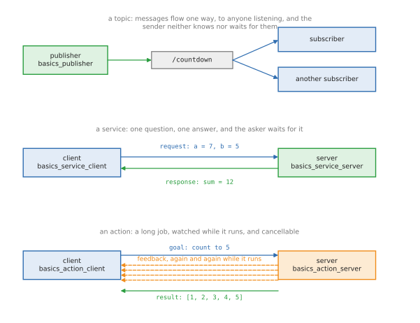
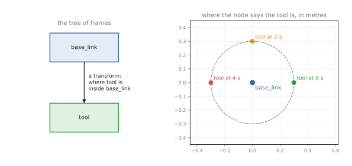

# ROS basics: one program per thing ROS does

The [ROS intro](01_ros-intro.md) explains the ideas; this doc shows each of them on
its own, as the smallest program that uses it. There is one file per thing ROS
is used for — a node, a topic, a parameter, a service, an action, a frame, and a
launch file that starts several together — so that each idea can be read, run
and changed without anything else getting in the way.

The code is in [`src/ros/ros_basics/`](../../src/ros/ros_basics). The three
worked examples that put these together into something a robot does — a camera,
an arm, and the two at once — are in `src/ros/ros_applied/`, and their docs are
[ROS camera](03_ros-camera.md), [ROS arm](04_ros-arm.md) and
[ROS camera and arm](05_ros-camera-arm.md).

Every command below needs the workspace built and loaded. `make shell` does both
and leaves you in a shell where `ros2` works; the make commands in
[section 9](#9-running-them) do it for you.

## Contents

1. [The files, and what each one is for](#1-the-files-and-what-each-one-is-for)
2. [A node](#2-a-node)
3. [Topics: publishing and subscribing](#3-topics-publishing-and-subscribing)
4. [Parameters: a node's settings](#4-parameters-a-nodes-settings)
5. [Services: one question, one answer](#5-services-one-question-one-answer)
6. [Actions: long jobs with progress](#6-actions-long-jobs-with-progress)
7. [Frames: where the parts are](#7-frames-where-the-parts-are)
8. [Launching: starting everything together](#8-launching-starting-everything-together)
9. [Running them](#9-running-them)

---

## 1. The files, and what each one is for

| File | The thing it shows | Run it with |
| --- | --- | --- |
| `nodes.py` | a node: a program that joins the robot and stays alive | `ros2 run ros_basics basics_node` |
| `publisher.py` | putting messages on a topic | `ros2 run ros_basics basics_publisher` |
| `subscriber.py` | receiving them | `ros2 run ros_basics basics_subscriber` |
| `parameters.py` | settings, read and changed while the node runs | `ros2 run ros_basics basics_parameters` |
| `service_server.py` | answering a question | `ros2 run ros_basics basics_service_server` |
| `service_client.py` | asking it, and waiting | `ros2 run ros_basics basics_service_client 7 5` |
| `action_server.py` | a long job, with progress and a result | `ros2 run ros_basics basics_action_server` |
| `action_client.py` | sending the goal and watching it | `ros2 run ros_basics basics_action_client 5` |
| `frames.py` | publishing a frame, and asking where it is | `ros2 run ros_basics basics_frames` |
| `launch/basics.launch.py` | starting several nodes at once | `ros2 launch ros_basics basics.launch.py` |

Nodes talk to each other in exactly three ways, and picking the right one is
most of designing a robot's software:



- a **topic** carries a stream of messages one way, to anyone who is listening.
  Use it for anything that keeps coming: pictures, joint angles, speeds.
- a **service** is one question and one answer, and the asker waits. Use it for
  short jobs that finish at once: turn something on, work something out.
- an **action** is a long job: a goal, progress reports while it runs, and a
  result at the end, and it can be cancelled. Use it for anything that takes
  seconds and might fail: move the arm, drive somewhere, close the gripper.

---

## 2. A node

A **node** is one running program that has joined the robot's network. It has a
name, which is how everything else refers to it, and from then on it can publish,
subscribe, offer services and be asked about itself.

Every node in every ROS project has the same four parts:

```python
rclpy.init(args=args)
node: Heartbeat = Heartbeat()
try:
    rclpy.spin(node)
except (KeyboardInterrupt, ExternalShutdownException):
    pass        # Ctrl-C, or the launch file stopping everything: not an error
```

`rclpy.init()` connects the program to ROS. The class, which extends rclpy's
`Node`, gives the node its name and sets up whatever it does. `rclpy.spin()`
then hands the program over to ROS, which keeps it alive and calls its timers
and callbacks as they come due. It returns when the program is asked to stop.

This one does nothing but count, once a second, using a **timer**, which is how
a node does anything regularly:

```python
self.timer: Timer = self.create_timer(1.0, self.beat)
```

```
[INFO] [1789554299.336229000] [heartbeat]: started: this node does nothing but count
[INFO] [1789554300.339815000] [heartbeat]: alive, beat 1
[INFO] [1789554301.339357000] [heartbeat]: alive, beat 2
[INFO] [1789554302.338166000] [heartbeat]: alive, beat 3
```

Those lines come from `self.get_logger().info(...)` rather than `print()`. Every
line is then marked with the node's name and its level — debug, info, warn,
error, fatal — which is what makes a robot's output readable when twenty nodes
are writing at once.

While it runs, another terminal can look at it:

```
ros2 node list             /heartbeat is in the list
ros2 node info /heartbeat  what it publishes, subscribes to and offers
```

---

## 3. Topics: publishing and subscribing

A **topic** is a named stream of messages. The node that publishes does not know
who is listening, and does not wait for anyone: it puts a message on the topic
and carries on. That is how nearly all of a robot's data moves, because it lets
any number of programs read the same stream, and lets you replace the sender
without touching the receivers.

Publishing takes two lines of setup and two to send:

```python
self.publisher: Publisher = self.create_publisher(String, '/countdown', 10)
self.timer: Timer = self.create_timer(PERIOD, self.send)
```

```python
message: String = String()
message.data = f'message number {self.sent}'
self.publisher.publish(message)
```

`create_publisher` says which **type** of message will go on which **topic**.
The 10 is the queue: how many messages ROS keeps waiting if a receiver is slow,
before it drops the oldest.

Receiving is one call, and a function for ROS to call:

```python
self.subscription: Subscription = self.create_subscription(
    String, '/countdown', self.on_message, 10)
```

```python
def on_message(self, message: String) -> None:
    """Print one message: ROS calls this for each one, with the message itself."""
```

That function is the **callback**. Between messages the node does nothing at
all: it is not a loop that checks, it is a program that is woken up. Keeping the
callback short matters, because while it runs the node receives nothing else.

Run the two together and they line up:

```
[INFO] [1789554332.284097000] [countdown_publisher]: sent: message number 2
[INFO] [1789554332.284903000] [countdown_subscriber]: received: message number 2
```

The type and the topic name have to match on both sides exactly. If they do not,
nothing arrives and nothing complains, which is the most common first-day
problem in ROS. These commands find it:

```
ros2 topic list                 which topics exist
ros2 topic echo /countdown      print the messages as they arrive
ros2 topic hz /countdown        how many a second
ros2 topic info -v /countdown   the type, and who is sending and receiving
```

---

## 4. Parameters: a node's settings

Robot code is full of numbers that should not be typed into the code: which
serial port, how fast to move, how long to wait, which frame to measure in. In
ROS those are **parameters**. A node declares the ones it has, with a default
and a description:

```python
self.declare_parameter('speed_mps', 0.2,
                       ParameterDescriptor(description='How fast to move, m/s.'))
```

The type comes from the default, and a parameter that is not declared cannot be
set, which is what stops a typo on the command line from silently doing nothing.
Reading one gives its value **now**, which may have been changed a moment ago:

```python
speed: float = self.get_parameter('speed_mps').value
```

A node can also refuse a change. The callback below runs before any parameter is
set, and saying no refuses the whole set:

```python
self.add_on_set_parameters_callback(self.check)
```

With the node running in one terminal and `ros2 param set` in another, both
halves show:

```
[INFO] [1789554310.742482000] [settings]: robot_name = demo, speed_mps = 0.2, joints = 2
[INFO] [1789554311.742130000] [settings]: robot_name = demo, speed_mps = 0.5, joints = 2
[WARN] [1789554311.760234000] [settings]: refused speed_mps = 9.9: the limit is 1.0
```

```
Set parameter successful
Setting parameter failed: speed_mps must be at most 1.0
```

The commands worth knowing:

```
ros2 param list /settings                  what it has
ros2 param get /settings speed_mps         read one
ros2 param set /settings speed_mps 0.5     change one while it runs
ros2 param dump /settings                  save them all as YAML
ros2 run ros_basics basics_parameters --ros-args -p robot_name:=picker
```

A real robot sets them from a launch file or a YAML file, which
[section 8](#8-launching-starting-everything-together) shows.

---

## 5. Services: one question, one answer

A topic is a stream nobody has to be listening to. A **service** is the other
shape: one node asks, one node answers, and the asker waits for that answer.
Robots use services for short jobs with an answer at the end: turn the gripper's
power on, clear the map, take a snapshot, work something out.

Offering one is a line and a function:

```python
self.service: Service = self.create_service(AddTwoInts, '/add_two_ints', self.add)
```

```python
response.sum = request.a + request.b
```

A service type has two halves, `Request` and `Response`, and ROS hands the
callback both: the request filled in, the response empty to fill. Whatever is
returned goes back to the asker.

Asking has one wrinkle worth learning properly:

```python
future: Future = self.client.call_async(request)
rclpy.spin_until_future_complete(self, future)
response: AddTwoInts.Response = future.result()
```

`call_async` sends the request and hands back a **future**: a promise of an
answer that has not arrived yet. `spin_until_future_complete` keeps the node
running until it does. There is a blocking `call()` as well, but calling it from
inside a callback deadlocks the node, so the async form is the habit to build.

Before any of that, a client waits for the service to exist, because nothing is
guaranteed to have started yet:

```python
if not self.client.wait_for_service(timeout_sec=WAIT):
```

```
[INFO] [1789554313.604020000] [adder]: offering /add_two_ints
[INFO] [1789554315.866760000] [adder]: asked 7 + 5, answering 12
[INFO] [1789554315.905178000] [add_two_ints_client]: 7 + 5 = 12
```

The type here, `example_interfaces/srv/AddTwoInts`, is one ROS ships for exactly
this example, so no new message package is needed. From the command line:

```
ros2 service list
ros2 service type /add_two_ints
ros2 service call /add_two_ints example_interfaces/srv/AddTwoInts "{a: 7, b: 5}"
```

---

## 6. Actions: long jobs with progress

"Move the arm to this pose", "drive to the kitchen" and "close the gripper until
it grips" all take seconds, may need watching, and may need cancelling. A
service cannot do that, because the asker only finds out at the end. An
**action** can, and it is how every arm and every mobile base is commanded in
ROS.

An action has three parts: the **goal**, sent once; **feedback**, sent again and
again while the job runs; and the **result**, sent at the end. The server's work
function gets all three:

```python
feedback.sequence.append(number)
# Feedback goes back to the caller while the job runs. This is what
# lets a screen show a progress bar, or another node react early.
goal.publish_feedback(feedback)
```

```python
goal.succeed()
result: Fibonacci.Result = Fibonacci.Result()
result.sequence = feedback.sequence
```

A goal can be cancelled by whoever sent it, and a server that never checks
cannot be stopped, so that check comes first in the loop:

```python
if goal.is_cancel_requested:
    goal.canceled()
```

Because the work runs while the node must still answer, an action server almost
always needs more than one thread:

```python
rclpy.spin(node, executor=MultiThreadedExecutor())
```

The client sends the goal in two steps: the server first accepts or refuses it,
and only then does the result come, with feedback arriving in between.

```python
accepted: Future = self.client.send_goal_async(
    goal, feedback_callback=self.on_feedback)
```

```python
finished: Future = handle.get_result_async()
```

```
[INFO] [1789554321.040742000] [counter]: goal accepted: count to 4
[INFO] [1789554321.041930000] [counter]:   at 1 of 4
[INFO] [1789554321.076562000] [count_up_client]: goal accepted, waiting for it to finish
[INFO] [1789554321.077281000] [count_up_client]:   progress: [1]
[INFO] [1789554322.052835000] [counter]:   at 2 of 4
[INFO] [1789554322.054959000] [count_up_client]:   progress: [1, 2]
[INFO] [1789554324.071811000] [counter]:   at 4 of 4
[INFO] [1789554324.076827000] [count_up_client]:   progress: [1, 2, 3, 4]
[INFO] [1789554325.083845000] [counter]: done: [1, 2, 3, 4]
[INFO] [1789554325.089610000] [count_up_client]: result: [1, 2, 3, 4]
```

(The two programs print in two terminals; the lines above are their real output,
put in the order the timestamps give. The middle steps are left out.)

From the command line, which is how you test an arm's action server before
writing any client:

```
ros2 action list
ros2 action info /count_up -t
ros2 action send_goal /count_up example_interfaces/action/Fibonacci "{order: 5}" --feedback
```

---

## 7. Frames: where the parts are

Every position a robot works with is measured from somewhere: the room, the
base, the camera, the gripper. Each of those is a **frame**, a set of axes, and
the same point has different numbers in each. **TF** is the part of ROS that
keeps track of how the frames sit relative to each other, so that no node has to
work the chain out for itself.



`frames.py` does both halves. Publishing where a frame is takes a broadcaster
and a message that says when, which parent, which child, and the shift and turn:

```python
transform.header.stamp = self.get_clock().now().to_msg()
transform.header.frame_id = 'base_link'
transform.child_frame_id = 'tool'
```

```python
self.broadcaster.sendTransform(transform)
```

Asking takes a buffer, which collects everything anyone publishes, and a
listener, which fills it:

```python
self.buffer: Buffer = Buffer()
self.listener: TransformListener = TransformListener(self.buffer, self)
```

```python
found: TransformStamped = self.buffer.lookup_transform('base_link', 'tool', Time())
```

`Time()` means "the latest you have". A lookup can always fail — at start-up
nothing has been published yet, and TF forgets old transforms — so every node
that uses TF catches that:

```python
except TransformException as error:
    self.get_logger().warn(f'no answer yet: {error}')
```

```
[INFO] [1789554328.313628000] [frames]: tool is at (+0.276, +0.117, +0.100) in base_link
[INFO] [1789554329.275748000] [frames]: tool is at (+0.113, +0.278, +0.100) in base_link
[INFO] [1789554330.273830000] [frames]: tool is at (-0.116, +0.276, +0.100) in base_link
```

In a real robot the two halves are in different programs: `robot_state_publisher`
reads the URDF and publishes every joint, and any node that needs a position
looks it up. The [arm area](../03_arm/01_overview.md) explains what a transform
actually is and how they join together; here it is enough to see the two calls.

```
ros2 run tf2_ros tf2_echo base_link tool     the same lookup, from the command line
ros2 topic echo /tf                          the raw messages
ros2 run tf2_tools view_frames               draw the tree of frames as a PDF
```

---

## 8. Launching: starting everything together

A robot is never one program. Starting six of them by hand, in six terminals,
each with the right settings, would be slow and easy to get wrong, so ROS has
**launch files**: one command starts everything, and Ctrl-C stops everything.

A launch file is a Python file with a function that returns a list of things to
start. It does not start anything itself, and most of the values in it are
**substitutions**: placeholders that get their real value when the launch runs.

```python
def generate_launch_description() -> LaunchDescription:
    """Build the list of things to start."""
```

The four things launch files are used for are all in this one. **Arguments**,
which are given on the command line as `name:=value`:

```python
DeclareLaunchArgument('robot_name', default_value='demo',
                      description='The name the settings node should hold.'),
```

**Nodes**, saying which program to start and what to call it:

```python
publisher: Node = Node(
    package='ros_basics',
    executable='basics_publisher',
    name='countdown_publisher',
    output='screen',        # send its log lines to this terminal
)
```

**Parameters**, which is where a real robot's settings come from, and
**conditions**, which start a node only if asked for:

```python
parameters=[{'robot_name': LaunchConfiguration('robot_name'), 'joints': 6}],
condition=IfCondition(LaunchConfiguration('with_settings')),
```

There is also **remapping**, which renames a node's topics as it starts. It is
how the same node is pointed at a different camera or a different arm without
editing it:

```python
remappings=[('/countdown', '/countdown')],
```

Running it with an argument, every line marked with the program it came from:

```
[basics_publisher-1] [INFO] [1789554332.284097000] [countdown_publisher]: sent: message number 2
[basics_subscriber-2] [INFO] [1789554332.284903000] [countdown_subscriber]: received: message number 2
[basics_parameters-3] [INFO] [1789554332.303755000] [settings]: robot_name = picker, speed_mps = 0.2, joints = 6
```

`robot_name` came from `robot_name:=picker` on the command line, and `joints = 6`
from the launch file, over the node's own default of 2.

```
ros2 launch ros_basics basics.launch.py
ros2 launch ros_basics basics.launch.py robot_name:=picker with_settings:=false
ros2 launch ros_basics basics.launch.py --show-args
```

Stopping a launch with Ctrl-C can print `process has died, exit code -2`. That
is not a crash: Ctrl-C reaches every program in the group as well as the launch
file, and the node is already on its way out when the launch file asks it to
stop.

---

## 9. Running them

Three make commands cover the ones worth watching:

```
make ros.basics      the launch file: publisher, subscriber and settings together
make ros.service     the service server, and a client that asks it 7 + 5
make ros.action      the action server, and a client that sends it a goal
```

Anything else is `ros2 run ros_basics <program>` from a `make shell`, with the
programs named in [section 1](#1-the-files-and-what-each-one-is-for). Two
terminals are worth having: one for the node, one for the `ros2` commands that
look at it.

Next: the three worked examples, which use all of this together —
[ROS camera](03_ros-camera.md), then [ROS arm](04_ros-arm.md), then
[ROS camera and arm](05_ros-camera-arm.md).
