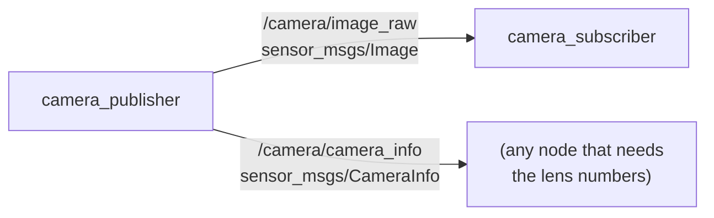
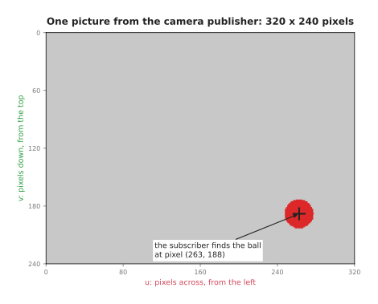
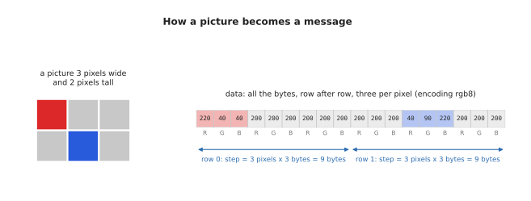

# ROS camera: publishing and receiving pictures

A robot's camera is only useful if other programs can use its pictures. In ROS,
that works in the same way for every camera: one node, called the camera
**driver**, publishes each picture on a topic, and any node that needs pictures
subscribes to that topic. This doc builds the smallest version of both, as two
programs in the `ros_camera` package: `camera_publisher`, which plays the part of
the driver, and `camera_subscriber`, which receives each picture and finds a red
ball in it.

It builds on the [ROS intro](01_ros-intro.md), which explains nodes, topics and
messages.

## Contents

1. [The two programs](#1-the-two-programs)
2. [The camera's two message classes](#2-the-cameras-two-message-classes)
   - [2.1 Image: one picture](#21-image-one-picture)
   - [2.2 CameraInfo: the camera's lens](#22-camerainfo-the-cameras-lens)
   - [2.3 k in detail: what it is, why the camera sends it, and who reads it](#23-k-in-detail-what-it-is-why-the-camera-sends-it-and-who-reads-it)
3. [The publisher](#3-the-publisher)
4. [The subscriber](#4-the-subscriber)
5. [Running it](#5-running-it)
6. [A real camera](#6-a-real-camera)

---

## 1. The two programs

The two programs are two nodes, joined by two topics. The publisher sends a
picture on `/camera/image_raw` ten times a second, and the camera's lens numbers
on `/camera/camera_info` with each one. The subscriber receives the pictures. It
does not need the lens numbers, but the [camera and arm
example](05_ros-camera-arm.md) does.



A real driver would read its pictures from a camera, but this computer, like
many, has no camera, so the publisher draws its own: a red ball moving in a slow
loop over a grey background. It is a stand-in for the camera, not a simulation of
one. The message it publishes is exactly the kind a real driver publishes, so the
subscriber cannot tell the difference, and section 6 shows how to swap in a real
camera.



## 2. The camera's two message classes

The two topics carry two message types from the `sensor_msgs` package: `Image`,
for the picture, and `CameraInfo`, for the camera's lens. In Python, each type
is a class, which the code gets with `from sensor_msgs.msg import CameraInfo,
Image`. For every picture, the publisher makes one object of each class, fills
in its fields, and publishes it. [Section 3 of the ROS
intro](01_ros-intro.md#3-message-types-and-the-sensor_msgs-package) explains where
these classes come from, and this section explains what is in each one.

### 2.1 Image: one picture

A `sensor_msgs/Image` holds one picture. The message cannot hold a picture as a
grid, so it holds the picture's size, and then every pixel's numbers in one long
list of bytes, row after row. The diagram shows that for a picture only 3 pixels
wide and 2 pixels tall.



These are the class's fields, with the values the publisher sends:

| Field | What it holds | This example sends |
| --- | --- | --- |
| `header.stamp` | when the picture was taken | the time it was drawn |
| `header.frame_id` | the frame the picture was taken in | `camera` |
| `height`, `width` | the picture's size, in pixels | 240, 320 |
| `encoding` | what each pixel's numbers mean | `rgb8`: red, green and blue, one byte each |
| `is_bigendian` | the order of the bytes, for numbers that take more than one | 0: one byte per number, so it does not matter |
| `step` | how many bytes one row takes | 320 pixels × 3 bytes = 960 |
| `data` | every pixel's numbers, row after row | 240 rows × 960 bytes = 230,400 bytes |

`header` is a message of its own, a `std_msgs/Header`, and nearly every message
about the world has one. Its `stamp` says when the message was true, as whole
seconds and nanoseconds, and its `frame_id` names the set of axes the message's
numbers are measured in. A new `Image()` has every field empty, with a size of 0
by 0 and no bytes, so a picture only exists once the publisher has filled in its
fields.

### 2.2 CameraInfo: the camera's lens

A picture only says what colour each pixel is. It does not say which direction
each pixel looks in, and a program needs that to turn a pixel into a direction,
as the [camera and arm example](05_ros-camera-arm.md) does, or to work out where a
point in the room will appear in the picture. Which direction a pixel looks in
depends on the camera's lens and sensor, and a program that only receives the
pictures has no way to know those. So a camera driver publishes a
`sensor_msgs/CameraInfo` alongside every picture, with the same header, and
that message describes the camera. These are its fields:

| Field | What it holds | This example sends |
| --- | --- | --- |
| `header` | when and where, the same as the picture's | the picture's header |
| `height`, `width` | the picture's size, in pixels | 240, 320 |
| `k` | the four lens numbers, `fx`, `fy`, `cx` and `cy`, as a 3 × 3 grid: section 2.3 | `[277.1, 0, 160, 0, 277.1, 120, 0, 0, 1]` |
| `p` | the same lens numbers, as a 3 × 4 grid, for the picture after its lens's bending has been taken out | `k`, with a column of zeros added |
| `distortion_model` | the name of the formula for how the lens bends straight lines | `plumb_bob`, the usual one |
| `d` | the numbers for that formula, five for `plumb_bob` | five zeros: no bending |
| `r` | a turn, used only by stereo cameras, which have two lenses side by side | "no turn": ones down the diagonal |
| `binning_x`, `binning_y` | how many of the sensor's pixels were joined into each picture pixel | 0, meaning none |
| `roi` | the region of interest: the part of the sensor the picture came from | all zeros, meaning all of it |

This is one camera info message, as
`ros2 topic echo --once --flow-style /camera/camera_info` printed it, with
`--flow-style` putting each list on one line:

```
header:
  stamp:
    sec: 1789475630
    nanosec: 805670000
  frame_id: camera
height: 240
width: 320
distortion_model: plumb_bob
d: [0.0, 0.0, 0.0, 0.0, 0.0]
k: [277.1, 0.0, 160.0, 0.0, 277.1, 120.0, 0.0, 0.0, 1.0]
r: [1.0, 0.0, 0.0, 0.0, 1.0, 0.0, 0.0, 0.0, 1.0]
p: [277.1, 0.0, 160.0, 0.0, 0.0, 277.1, 120.0, 0.0, 0.0, 0.0, 1.0, 0.0]
binning_x: 0
binning_y: 0
roi:
  x_offset: 0
  y_offset: 0
  height: 0
  width: 0
  do_rectify: false
```

The publisher's lens bends nothing, so every field that describes bending says
so: five zeros in `d`, no turn in `r`, and `p` the same as `k`. A real lens does
bend straight lines a little, so a real camera's driver gets these numbers from
a **calibration**, which measures the camera by photographing a printed
checkerboard from many angles. Its `d` then holds five numbers that describe the
bending, and its `k` and `p` differ slightly.

### 2.3 k in detail: what it is, why the camera sends it, and who reads it

`k` is the most important field in the message. It holds the four lens numbers
from [section 6 of the camera
basics](../05_camera/01_basics.md#6-the-lens-as-four-numbers): the focal length, `fx`
and `fy`, which says how zoomed in the camera is, in pixels, and the middle of
the picture, `cx` and `cy`. For the publisher's lens, which sees 60° across,
`fx` and `fy` are 277.1, and the middle of its 320 × 240 picture is at pixel
(160, 120).

**What it is.** The four numbers are laid out in a 3 × 3 grid, called the
**camera matrix**, or the **intrinsic matrix**, because the numbers are part of
the camera itself and do not change when it moves:

```
| fx   0  cx |       | 277.1    0    160 |
|  0  fy  cy |   =   |    0   277.1  120 |
|  0   0   1 |       |    0     0      1 |
```

A message cannot hold a grid, so `k` holds its nine numbers written out row after
row: `[fx, 0, cx, 0, fy, cy, 0, 0, 1]`. That puts `fx` at `k[0]`, `cx` at
`k[2]`, `fy` at `k[4]` and `cy` at `k[5]`, which is where a program reading the
message finds them.

**Why a grid, with those zeros and that 1.** The grid is the camera formula
from the camera basics, written so that it becomes one multiplication. The
formula says where a point `(x, y, z)`, measured from the camera, lands in the
picture:

```
u = fx · x / z + cx
v = fy · y / z + cy
```

Multiplying the grid by the point gives three numbers, `(fx·x + cx·z, fy·y +
cy·z, z)`, and dividing the first two by the third, `z`, gives exactly `u` and
`v`. The zeros say that how far a point is to the side does not change how far
down the picture it lands, and the other way round. The 1 keeps `z` as it is,
ready for the division. For the point the camera docs work through, `(0.0644,
-0.0411, 0.340)`, the multiplication gives `(72.245, 29.411, 0.340)`, and
dividing by 0.340 gives pixel (212.5, 86.5). Writing it as a grid is the
standard form, which OpenCV and the rest of computer vision use, so every tool
can read it.

**Why the camera sends it.** Without `k`, a program receiving the pictures knows
where the ball is in the picture, at pixel (263, 188) for example, but not which
direction that is from the camera, because the same pixel points in a different
direction through a wide lens than through a narrow one. The numbers depend on
the lens and the sensor, so only the camera, or its calibration, can supply them,
and sending them with every picture means they always match the picture they
came with.

**Who reads it.** In this repo, the camera and arm example's follower reads
`k[0]`, `k[4]`, `k[2]` and `k[5]` to turn the ball's pixel into the angles that
point the arm at it, as its [section
2](05_ros-camera-arm.md#2-from-a-pixel-to-an-angle) shows. In real projects, most
programs read the lens through **image_geometry**, ROS's standard camera
library. Its `PinholeCameraModel` turns pixels into directions and points into
pixels, and **depth_image_proc** uses it to turn a depth picture into a point
cloud, as in the [camera
area](../05_camera/04_one-box-code.md#28-depth_image_proc-the-point-cloud).
image_geometry reads its lens numbers from `p`, not from `k`, which is why the
publisher fills in both: a camera info with an empty `p` would give those tools
a focal length of zero. This package's tests check that image_geometry reads the
publisher's lens as 277.1, and puts the point above on pixel (212.5, 86.5).

## 3. The publisher

The publisher has to do the same thing ten times a second: draw the next picture,
and publish it. In pseudo code:

```
when the program starts:
    create a publisher for pictures, on /camera/image_raw
    create a publisher for lens numbers, on /camera/camera_info
    ask ROS to call publish_picture every 0.1 seconds

publish_picture:
    work out where the ball is now
    draw the grey picture with the ball on it
    put the picture into an Image message: its size, its encoding, its bytes
    put the lens numbers into a CameraInfo message
    stamp both with the same time, and publish them
```

In ROS, a node does something regularly with a **timer**, rather than with a loop
of its own: `create_timer(0.1, self.publish_picture)` asks ROS to call
`publish_picture` every 0.1 seconds, and `rclpy.spin()` keeps the program running
so that it can. This is the core of `ros_camera/camera_publisher.py`:

```python
class CameraPublisher(Node):
    def __init__(self) -> None:
        super().__init__('camera_publisher')
        self.image_publisher: Publisher = self.create_publisher(Image, '/camera/image_raw', 10)
        self.info_publisher: Publisher = self.create_publisher(
            CameraInfo, '/camera/camera_info', 10)
        self.start: Time = self.get_clock().now()
        self.timer: Timer = self.create_timer(0.1, self.publish_picture)

    def publish_picture(self) -> None:
        now: Time = self.get_clock().now()
        seconds: float = (now - self.start).nanoseconds / 1e9
        picture: NDArray[np.uint8] = draw_picture(*ball_position(seconds))
        stamp: TimeMsg = now.to_msg()

        image: Image = Image()
        image.header.stamp = stamp
        image.header.frame_id = 'camera'
        image.height, image.width = HEIGHT, WIDTH
        image.encoding = 'rgb8'
        image.step = WIDTH * 3
        image.data = picture.tobytes()
        self.image_publisher.publish(image)
```

`draw_picture()` draws the picture as a NumPy array, and `picture.tobytes()`
turns that array into the long list of bytes the message holds. `now` is an
rclpy `Time`, a point in time that can be subtracted from another, and
`now.to_msg()` turns it into a `TimeMsg`, the timestamp message a header holds,
which the code imports under that name to tell the two apart. The 10 in
`create_publisher()` is how many messages ROS keeps waiting if a subscriber is
slow to take them. The camera info message comes from `camera_info()`, a function
that fills in the fields from section 2.2, and it is published straight after
the picture, with the same header, so that a node receiving both knows they
belong together.

## 4. The subscriber

The subscriber does nothing until a picture arrives, and then it looks for the
ball in it. In pseudo code:

```
when the program starts:
    subscribe to /camera/image_raw, and call on_picture with every picture

on_picture:
    turn the message back into a grid of pixels
    find the red pixels: a high red number, and low green and blue numbers
    the ball's middle is the average position of its red pixels
    print where it is, at most once a second
```

The function ROS calls with each message is the **callback**, here
`on_picture`. Turning the message back into a grid of pixels would mean undoing
section 2.1 by hand, so the subscriber uses **cv_bridge**, a standard ROS library
that turns an image message into a NumPy array, one entry per pixel. This is the
core of `ros_camera/camera_subscriber.py`:

```python
def find_ball(picture: NDArray[np.uint8]) -> tuple[float, float] | None:
    red: NDArray[np.uint8] = picture[:, :, 0]
    green: NDArray[np.uint8] = picture[:, :, 1]
    blue: NDArray[np.uint8] = picture[:, :, 2]
    is_red: NDArray[np.bool_] = (red > 150) & (green < 100) & (blue < 100)
    if not is_red.any():
        return None
    rows: NDArray[np.intp]
    cols: NDArray[np.intp]
    rows, cols = np.nonzero(is_red)
    return float(cols.mean()) + 0.5, float(rows.mean()) + 0.5


class CameraSubscriber(Node):
    def __init__(self) -> None:
        super().__init__('camera_subscriber')
        self.bridge: CvBridge = CvBridge()
        self.pictures: int = 0
        self.create_subscription(Image, '/camera/image_raw', self.on_picture, 10)

    def on_picture(self, msg: Image) -> None:
        self.pictures += 1
        picture: NDArray[np.uint8] = self.bridge.imgmsg_to_cv2(msg, desired_encoding='rgb8')
        ball: tuple[float, float] | None = find_ball(picture)
        ...
```

`find_ball()` works on the picture as a NumPy array with three sizes, or axes:
240 rows, then 320 columns, then the 3 colour numbers of each pixel, red, green
and blue. So `picture[80, 100]` is the pixel in row 80 and column 100, such as
`[220, 40, 40]` on the ball, and `picture[80, 100, 0]` is its red number alone,
220. In `picture[:, :, 0]`, each `:` means "all of them", so it reads "every
row, every column, colour number 0": a 240 × 320 grid of every pixel's red
number. Colour numbers 1 and 2 give the green and blue grids. Comparing those
grids with `>` and `<` checks every pixel at once, and `&` joins the checks
pixel by pixel, which gives `is_red`, a grid of True and False. `np.nonzero()`
then lists the row and column of every True pixel, and their averages are the
middle of the ball.

`find_ball()` adds 0.5 because a pixel's middle is half a pixel from its corner,
as the [camera basics](../05_camera/01_basics.md#a-grid-of-pixels) explain. The
subscriber knows nothing about the publisher: it only knows the topic's name and
the message type, which is what lets a real camera take the publisher's place.

## 5. Running it

```
make ros.camera
```

This builds the workspace and starts `launch/camera.launch.py`, which starts both
programs and RViz. The subscriber prints one line a second, and the ball's
position changes as it moves:

```
[camera_subscriber-2] [INFO] [...] [camera_subscriber]: picture 1: 320 x 240, rgb8, ball at pixel (174, 133)
[camera_subscriber-2] [INFO] [...] [camera_subscriber]: picture 12: 320 x 240, rgb8, ball at pixel (238, 185)
[camera_subscriber-2] [INFO] [...] [camera_subscriber]: picture 23: 320 x 240, rgb8, ball at pixel (269, 178)
```

The picture number goes up by about 10 each second, because the publisher sends
ten pictures a second. RViz shows the pictures themselves, as they arrive. Press
Ctrl-C to stop everything.

While it runs, a second terminal, opened with `make shell`, can look at it with
the commands from [section 5 of the
intro](01_ros-intro.md#6-looking-inside-a-running-robot): `ros2 topic hz
/camera/image_raw` shows about 10 pictures a second, and `ros2 topic echo --once
--no-arr /camera/image_raw` prints one picture's message, with the fields from
section 2.1.

Each program can also be started on its own, in its own terminal, which shows
that they only meet through the topic:

```
ros2 run ros_camera camera_publisher
ros2 run ros_camera camera_subscriber
```

If only the subscriber is running, it prints nothing, because nothing is being
published. As soon as the publisher starts, the lines appear.

## 6. A real camera

A real camera needs a real driver, and every common camera has one that publishes
the same `sensor_msgs/Image` message. ROS 2 comes with one for ordinary webcams,
in the `image_tools` package:

```
ros2 run image_tools cam2image --ros-args -r image:=/camera/image_raw
```

`--ros-args -r image:=/camera/image_raw` **remaps** its topic, which means it
publishes on `/camera/image_raw` instead of its usual `/image`, so that
`camera_subscriber` receives its pictures unchanged. It needs a webcam to be
plugged in, and on macOS the terminal needs permission to use it. Other cameras
have their own drivers, such as `camera_ros` for the Raspberry Pi camera in the
[camera basics](../05_camera/01_basics.md#5-the-cameras-used-in-these-docs), or
`realsense2_camera` for Intel's depth cameras. All of them publish pictures and
camera info in this same shape, which is why code written against the topics
keeps working when the camera changes.

Next: [ROS arm](04_ros-arm.md), which moves an arm.
