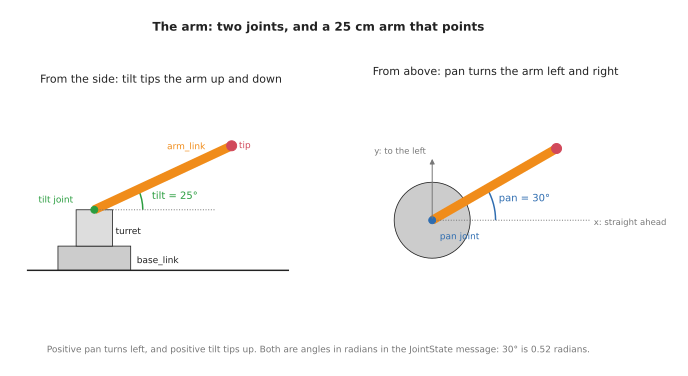
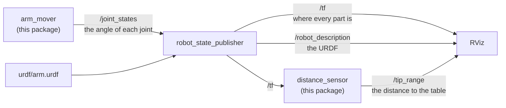
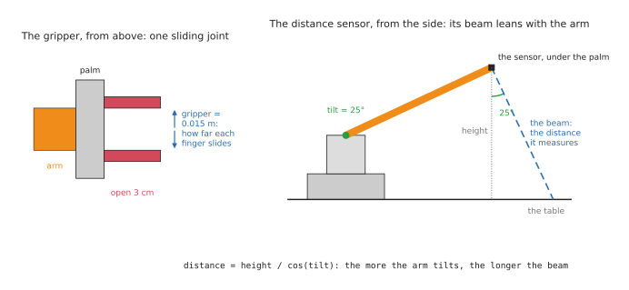

# ROS arm: moving an arm

Moving an arm in ROS comes down to one topic, `/joint_states`, where the angle
of every joint is published. A standard node reads those angles, together with a
description of the arm, and works out where every part of the arm is, and RViz
draws the arm there. So a program that publishes new angles makes the arm move.
This doc builds the smallest version of that, in the `ros_arm` package: a
two-joint arm described in URDF, and `arm_mover`, a program that swings it back
and forth. Then it adds the two things almost every arm carries at its end: a
gripper, which opens and closes, and a sensor, here the simplest one, which
measures one distance.

It builds on the [ROS intro](01_ros-intro.md), which explains nodes, topics,
messages, and what TF and URDF are for.

## Contents

1. [The arm](#1-the-arm)
2. [How an arm moves in ROS](#2-how-an-arm-moves-in-ros)
3. [The joint state message](#3-the-joint-state-message)
4. [The program](#4-the-program)
5. [Running it](#5-running-it)
6. [The gripper](#6-the-gripper)
7. [The distance sensor](#7-the-distance-sensor)
   - [7.1 The Range class](#71-the-range-class)
   - [7.2 The sensor node](#72-the-sensor-node)
   - [7.3 What it prints](#73-what-it-prints)
8. [A real arm](#8-a-real-arm)

---

## 1. The arm

The arm is the simplest one that can point anywhere in front of it. It has a base
that sits on the table, a turret on top of the base that turns left and right,
and a bar, 25 cm long, that tilts up and down. The two joints are called `pan`,
for turning left and right, and `tilt`, for tipping up and down, which are the
usual names for those two movements. At the end of the bar, the arm carries a
small gripper and a distance sensor, which sections 6 and 7 add.



The arm is described in `urdf/arm.urdf`, in URDF, the XML format ROS uses to
describe robots. A URDF file lists the arm's **links**, which are its rigid
parts, and its **joints**, which say how each link is attached to the one before
it. This is the `pan` joint:

```xml
<joint name="pan" type="revolute">
  <parent link="base_link"/>
  <child link="turret"/>
  <origin xyz="0 0 0.04"/>
  <axis xyz="0 0 1"/>
  <limit lower="-1.57" upper="1.57" effort="1" velocity="1"/>
</joint>
```

`revolute` means the joint turns. It joins the `turret` to the `base_link`, 4 cm
above the base's bottom, which is where the base's top is. `axis` is the line it
turns around, here the upright z axis, and `limit` says how far it can turn:
1.57 radians, which is 90°, either way. The `tilt` joint is written the same way,
turning around a sideways axis, and a third joint, of type `fixed`, bolts the
`tip` to the end of the bar. The tip is the gripper's palm. Each link also has
a `visual`, the shape RViz draws for it: a cylinder for the base and the turret,
and a box for the bar.

Angles in ROS are always in **radians**, not degrees. A full turn is 2π radians,
so 1 radian is about 57°, and 30° is about 0.52 radians.

## 2. How an arm moves in ROS

Three nodes take part, and each has one job:



**arm_mover**, this package's program, decides where the joints should be, and
publishes their angles on `/joint_states`, twenty times a second.

**robot_state_publisher** is a standard ROS node. It reads the URDF when it
starts, and every time new joint angles arrive, it works out where every link of
the arm is and publishes that on TF. The URDF says where each joint is and which
way it turns, and the angles say how far it has turned, which together are
everything needed. It also publishes the URDF itself on `/robot_description`, so
that other nodes, such as RViz, can read it.

**RViz** reads the URDF to know what each link looks like, and TF to know where
each link is, and draws the arm. When the angles change, the arm moves on screen.

A fourth node, **distance_sensor**, is the gripper's sensor. It asks TF where the
sensor is, and publishes how far away the table is. Section 7 explains it, and
the first five sections can be read without it.

## 3. The joint state message

The angles travel as `sensor_msgs/JointState` messages, which hold two matching
lists: the names of the joints, as they are in the URDF, and the position of each
one, in the same order. For a joint that turns, the position is an angle in
radians. The message can also carry each joint's speed and effort, the force it
is pushing with, but those lists can be left empty, and here they are. This is
one message, as `ros2 topic echo --once /joint_states` printed it:

```
header:
  stamp:
    sec: 1789473012
    nanosec: 328861000
  frame_id: ''
name:
- pan
- tilt
- gripper
position:
- -0.010968126487733008
- 0.021805081362168077
- 0.019588606494249775
velocity: []
```

At that moment, `pan` was at −0.011 radians and `tilt` at 0.022 radians, so the
arm was pointing almost straight ahead and level. The third joint is the
gripper's, which section 6 explains: its position is a distance, not an angle,
and at 0.0196 metres the gripper was nearly fully open.

## 4. The program

`arm_mover` has one job: twenty times a second, work out where the joints should
be, and publish it. In pseudo code:

```
when the program starts:
    create a publisher for joint positions, on /joint_states
    ask ROS to call publish_pose every 0.05 seconds

publish_pose:
    seconds = how long the program has been running
    pan     = 1.0 × sin(0.5 × seconds)            swings between -1 and 1 radian
    tilt    = 0.4 + 0.4 × sin(0.8 × seconds)      nods between 0 and 0.8 radians
    gripper = 0.01 + 0.01 × sin(1.2 × seconds)    opens and closes, 0 to 0.02 metres
    publish a JointState with the names pan, tilt and gripper, and these positions
```

The two joints swing at different speeds, so the tip of the arm traces a slow
loop instead of moving back and forth along one line. The angles always stay
inside the joints' limits in the URDF, which the package's tests check. This is
the core of `ros_arm/arm_mover.py`:

```python
def arm_pose(seconds: float) -> tuple[float, float, float]:
    pan: float = 1.0 * math.sin(0.5 * seconds)
    tilt: float = 0.4 + 0.4 * math.sin(0.8 * seconds)
    gripper: float = 0.01 + 0.01 * math.sin(1.2 * seconds)
    return pan, tilt, gripper


class ArmMover(Node):
    def __init__(self) -> None:
        super().__init__('arm_mover')
        self.publisher: Publisher = self.create_publisher(JointState, '/joint_states', 10)
        self.start: Time = self.get_clock().now()
        self.timer: Timer = self.create_timer(0.05, self.publish_pose)

    def publish_pose(self) -> None:
        now: Time = self.get_clock().now()
        pan: float
        tilt: float
        gripper: float
        pan, tilt, gripper = arm_pose((now - self.start).nanoseconds / 1e9)
        msg: JointState = JointState()
        msg.header.stamp = now.to_msg()
        msg.name = ['pan', 'tilt', 'gripper']
        msg.position = [pan, tilt, gripper]
        self.publisher.publish(msg)
```

The launch file, `launch/arm.launch.py`, starts the nodes from section 2.
It reads the URDF file and hands its text to robot_state_publisher as a
**parameter**, a setting given to a node when it starts:

```python
with open(os.path.join(share, 'urdf', 'arm.urdf')) as urdf:
    description: str = urdf.read()
...
Node(package='robot_state_publisher', executable='robot_state_publisher',
     parameters=[{'robot_description': description}]),
Node(package='ros_arm', executable='arm_mover'),
Node(package='ros_arm', executable='distance_sensor', output='screen'),
```

## 5. Running it

```
make ros.arm
```

This builds the workspace and starts the launch file. RViz opens and shows the
arm swinging left and right and nodding up and down, with its gripper opening
and closing, and a small set of axes at each link, which are the frames TF knows
about. A see-through cone under the gripper is the distance sensor's beam. Press
Ctrl-C to stop it.

While it runs, a second terminal, opened with `make shell`, can watch it.
`ros2 topic hz /joint_states` shows the twenty messages a second:

```
average rate: 19.950
	min: 0.040s max: 0.057s std dev: 0.00453s window: 20
```

`tf2_echo` asks TF where one frame is compared with another. This asks where the
tip of the arm is, measured from the base:

```
ros2 run tf2_ros tf2_echo base_link tip
```

```
At time 1789421231.70862000
- Translation: [0.133, -0.137, 0.262]
- Rotation: in Quaternion (xyzw) [-0.134, -0.317, -0.366, 0.864]
- Rotation: in RPY (radian) [-0.000, -0.703, -0.802]
- Rotation: in RPY (degree) [-0.000, -40.297, -45.950]
```

The translation says that, at that moment, the tip was 13.3 cm in front of the
base, 13.7 cm to its right, which is negative y, and 26.2 cm up. The rotation is
the same two joint angles again: a yaw of −0.802 radians is the pan, turned to the
right, and a pitch of −0.703 radians is the tilt, 0.703 radians up, since pitch
is measured the other way round. The numbers keep changing, because the arm keeps
moving, and nothing in `arm_mover` worked any of them out: robot_state_publisher
did, from the URDF and the two angles.

## 6. The gripper

A gripper is two or more fingers that close on an object to hold it. The
simplest has two fingers that slide towards each other, and that is the one this
arm has. In the URDF, it is one more joint, called `gripper`, between the palm
and the left finger:

```xml
<joint name="gripper" type="prismatic">
  <parent link="tip"/>
  <child link="left_finger"/>
  <origin xyz="0.02 0 0"/>
  <axis xyz="0 1 0"/>
  <limit lower="0" upper="0.02" effort="1" velocity="0.1"/>
</joint>
```

`prismatic` means the joint slides along its axis instead of turning around it,
so its position is a distance in metres rather than an angle. Its axis is the
palm's y axis, sideways, and its limits say it can slide from 0, where the two
fingers touch, to 0.02 metres, where the left finger has slid 2 cm out.



The right finger has a joint of its own, `gripper_mirror`, which slides the other
way. It never needs its own position, because of one line in the URDF:

```xml
<mimic joint="gripper"/>
```

A **mimic** joint copies another joint. robot_state_publisher gives
`gripper_mirror` the same position as `gripper`, so both fingers move together
from one number: at 0.015 the gripper is open 3 cm, and at 0.02 it is open 4 cm.
That is why the joint state message in section 3 lists `gripper` but not
`gripper_mirror`.

Opening and closing the gripper is therefore no different from moving the arm:
`arm_mover` publishes a third position on `/joint_states`, and everything else
follows. On a real robot, the gripper usually has its own controller, and a
program asks it to open or close, but the gripper's position still comes back on
`/joint_states`, as it does here.

## 7. The distance sensor

A **distance sensor** measures how far away the nearest thing in front of it is,
by sending out a pulse of sound or light and timing how long it takes to bounce
back. It is the simplest sensor there is, because each reading is one number, and
a small one in a gripper tells the arm how far it is from what is under it. This
arm's sensor sits under the palm, looking down, so it measures the distance to
the table.

### 7.1 The Range class

Its driver publishes each reading as a `sensor_msgs/Range` message, which holds
the one distance, and a few numbers that describe the sensor that measured it.
These are its fields, with what this sensor sends:

| Field | What it holds | This sensor sends |
| --- | --- | --- |
| `header.stamp` | when the reading was taken | the time it was worked out |
| `header.frame_id` | the sensor's frame: where it is, and which way it points | `range_sensor` |
| `radiation_type` | what the sensor sends out: `Range.ULTRASOUND` (0), sound, or `Range.INFRARED` (1), light | `Range.INFRARED` |
| `field_of_view` | how wide the beam is, in radians | 0.1, about 6° |
| `min_range`, `max_range` | the nearest and furthest it can measure, in metres | 0.02 and 1.0 |
| `range` | the distance it measured, in metres | from 0.085 to about 0.39 |
| `variance` | how uncertain the reading is, with 0 meaning "not known" | 0 |

A sensor measures along the x axis of its frame, so the URDF adds a frame called
`range_sensor` under the palm, turned a quarter turn so that its x axis points
down when the arm is level. RViz reads the message's frame, beam width and
distance, and draws the beam as a cone of that length. A distance the sensor
cannot measure, because it is too near or too far, is sent as infinity, which is
how the message's own definition says to report it. This is one reading, as
`ros2 topic echo --once /tip_range` printed it:

```
header:
  stamp:
    sec: 1789473012
    nanosec: 328861000
  frame_id: range_sensor
radiation_type: 1
field_of_view: 0.10000000149011612
min_range: 0.019999999552965164
max_range: 1.0
range: 0.09446373581886292
variance: 0.0
```

The long decimals appear because the fields are 32-bit numbers, which cannot
hold 0.1 or 0.02 exactly.

### 7.2 The sensor node

A real sensor's driver would read each distance from the sensor. This arm has
no sensor to read, so `distance_sensor` works the distance out instead, in the
same way that the camera publisher draws its own picture. It asks TF where the
sensor is, and works out how far its beam travels to reach the table. When the
arm is level, the beam points straight down, and the distance is the sensor's
height, 8.5 cm. When the arm tilts up, the beam tilts with it and leans back, as
the diagram in section 6 shows, so it travels further: the sensor's height
divided by the cosine of the tilt. In pseudo code:

```
when the program starts:
    create a publisher for readings, on /tip_range
    start listening to TF
    ask ROS to call measure every 0.1 seconds

measure:
    ask TF where range_sensor is, measured from base_link
    height    = how high the sensor is above the table
    downwards = how much the sensor's x axis points down: 1 is straight down
    distance  = height / downwards, or infinity if the beam never reaches the table
    publish a Range message with this distance
```

This is the core of `ros_arm/distance_sensor.py`. It uses TF in the same way the
`tf2_echo` command in section 5 does, but from Python: a `Buffer` stores what TF
publishes, a `TransformListener` fills it in the background, and
`lookup_transform()` asks it where one frame is, measured from another.

```python
def distance_to_table(height: float, downwards: float) -> float:
    if downwards <= 0:
        return math.inf
    return height / downwards


class DistanceSensor(Node):
    def __init__(self) -> None:
        super().__init__('distance_sensor')
        self.publisher: Publisher = self.create_publisher(Range, '/tip_range', 10)
        self.tf_buffer: Buffer = Buffer()
        self.tf_listener: TransformListener = TransformListener(self.tf_buffer, self)
        self.timer: Timer = self.create_timer(0.1, self.measure)

    def measure(self) -> None:
        try:
            tf: TransformStamped = self.tf_buffer.lookup_transform(
                'base_link', 'range_sensor', Time())
        except TransformException:
            return
        height: float = tf.transform.translation.z
        q: Quaternion = tf.transform.rotation
        beam: NDArray[np.float64] = Rotation.from_quat([q.x, q.y, q.z, q.w]).apply([1.0, 0.0, 0.0])
        distance: float = distance_to_table(height, -beam[2])

        msg: Range = Range()
        msg.header.stamp = self.get_clock().now().to_msg()
        msg.header.frame_id = 'range_sensor'
        msg.radiation_type = Range.INFRARED
        msg.field_of_view = FIELD_OF_VIEW
        msg.min_range = MIN_RANGE
        msg.max_range = MAX_RANGE
        msg.range = distance if MIN_RANGE <= distance <= MAX_RANGE else math.inf
        self.publisher.publish(msg)
```

TF gives the sensor's direction as a quaternion, four numbers that describe a
turn. `Rotation`, from the SciPy library, uses it to turn the sensor's x axis,
`[1, 0, 0]`, into the base's axes, and the third number of the result says how
much of it points up, so minus that is how much it points down. The base sits on
the table, so the sensor's height above the base is its height above the table.

### 7.3 What it prints

The node prints its reading once a second. As the arm nods up and down, the
distance grows and shrinks, from 8.5 cm when the arm is level to about 39 cm
when it is tilted furthest up:

```
[distance_sensor-3] [INFO] [...] [distance_sensor]: 0.265 m to the table
[distance_sensor-3] [INFO] [...] [distance_sensor]: 0.385 m to the table
[distance_sensor-3] [INFO] [...] [distance_sensor]: 0.223 m to the table
[distance_sensor-3] [INFO] [...] [distance_sensor]: 0.085 m to the table
```

Any other node that needs the distance, for example one that slows the arm down
as the gripper nears the table, would simply subscribe to `/tip_range`, and it
would work in the same way with a real sensor's driver in this node's place.

## 8. A real arm

On a real arm, a program like `arm_mover` does not publish `/joint_states`
itself. It sends the angles it wants to the arm's **controller**, the software
that drives the motors, usually through **ros2_control**, ROS's standard way of
connecting to motors. The controller moves the motors, reads where they actually
are from their sensors, and publishes that on `/joint_states`. Everything after
that, robot_state_publisher, TF and RViz, is exactly as it is here. Planning a
safe path for a real arm, instead of swinging it, is the job of **MoveIt**, which
the [tools and libraries](../07_tools-and-libraries.md) doc describes.

Next: [ROS camera and arm](05_ros-camera-arm.md), which points the arm at what the
camera sees.
