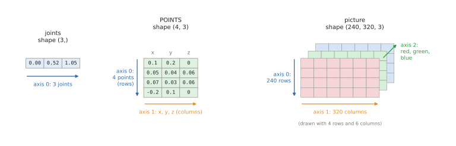
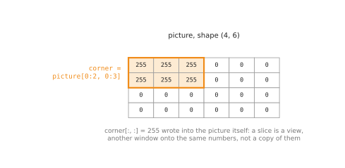
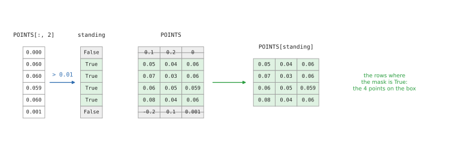
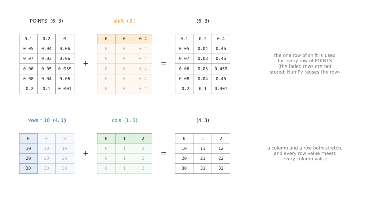
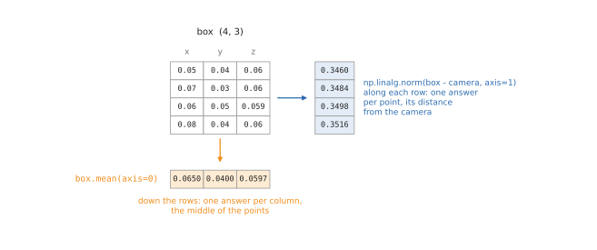
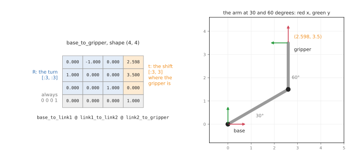
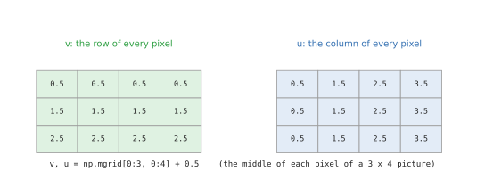
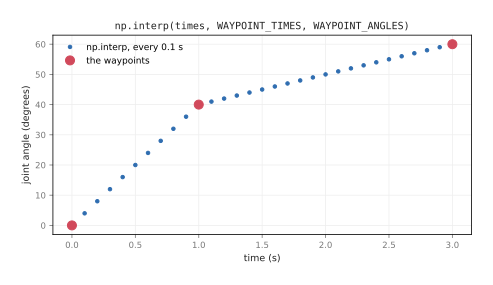
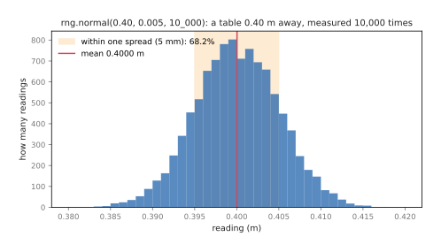

# NumPy for robotics

NumPy is the Python library for arrays of numbers, and nearly every piece of
robotics code written in Python uses it. A picture from a camera, a depth
picture, a cloud of 3D points, the angles of an arm's joints and the 4 × 4
transform that says where the gripper is are all arrays, and cv_bridge, OpenCV,
SciPy and the rest of the libraries a robot uses hand them to you as NumPy
arrays. This doc explains the parts of NumPy that robotics code uses most, with
five small Python files in `src/numpy/` that run every example and print the
results quoted here.

## Contents

1. [What NumPy is, and why robots need it](#1-what-numpy-is-and-why-robots-need-it)
2. [The five files](#2-the-five-files)
3. [Arrays: the ndarray class](#3-arrays-the-ndarray-class)
   1. [Shape, axes and size](#31-shape-axes-and-size)
   2. [dtype: the type of every number](#32-dtype-the-type-of-every-number)
   3. [Making arrays](#33-making-arrays)
   4. [Changing the shape, and joining arrays](#34-changing-the-shape-and-joining-arrays)
   5. [Views and copies](#35-views-and-copies)
   6. [Bytes and files: an array in a ROS message](#36-bytes-and-files-an-array-in-a-ros-message)
4. [Picking values out](#4-picking-values-out)
   1. [Indexes and slices](#41-indexes-and-slices)
   2. [Boolean masks](#42-boolean-masks)
   3. [Missing readings: NaN](#43-missing-readings-nan)
   4. [Finding things](#44-finding-things)
   5. [Picking by a list of indexes](#45-picking-by-a-list-of-indexes)
5. [Maths on whole arrays](#5-maths-on-whole-arrays)
   1. [Element-wise maths](#51-element-wise-maths)
   2. [Broadcasting](#52-broadcasting)
   3. [Reductions along an axis](#53-reductions-along-an-axis)
   4. [Values over time](#54-values-over-time)
   5. [Angles: wrap and unwrap](#55-angles-wrap-and-unwrap)
   6. [Comparing decimal numbers](#56-comparing-decimal-numbers)
   7. [How much faster it is](#57-how-much-faster-it-is)
6. [Vectors, rotations and transforms](#6-vectors-rotations-and-transforms)
   1. [Vectors](#61-vectors)
   2. [Rotation matrices and @](#62-rotation-matrices-and-)
   3. [4 × 4 transforms](#63-4--4-transforms)
   4. [The camera matrix k](#64-the-camera-matrix-k)
   5. [Solving and fitting](#65-solving-and-fitting)
   6. [Moving an arm a little: the Jacobian and pinv](#66-moving-an-arm-a-little-the-jacobian-and-pinv)
   7. [Which way an object lies: cov and eigh](#67-which-way-an-object-lies-cov-and-eigh)
7. [Grids, in-between values and random numbers](#7-grids-in-between-values-and-random-numbers)
   1. [Grids](#71-grids)
   2. [In-between values: interp](#72-in-between-values-interp)
   3. [Random numbers: the Generator class](#73-random-numbers-the-generator-class)
   4. [Describing many readings](#74-describing-many-readings)
8. [Writing NumPy types](#8-writing-numpy-types)
9. [Where this repo uses NumPy](#9-where-this-repo-uses-numpy)
10. [Quick reference](#10-quick-reference)

---

## 1. What NumPy is, and why robots need it

A Python list can hold numbers, but it holds each one as a separate Python
object, somewhere in memory, and doing arithmetic on a list means a Python loop
that visits them one at a time. That is fine for ten numbers. It is far too slow
for a depth picture, which has 76,800 readings and can arrive thirty times a
second.

A NumPy **array** stores its numbers differently: one block of memory, all the
numbers of the same type, packed side by side, with a **shape** that says how
they are arranged into rows, columns and so on. Because NumPy knows every number
is, say, a 4-byte decimal, its functions can run through the whole block in
compiled code, with no Python loop. You write `depth / 277.1` and every one of
the 76,800 readings is divided. On this Mac mini that is between about 160 and
200 times faster than the same loop in Python
([section 5.7](#57-how-much-faster-it-is)).

That is the first reason robotics uses NumPy. The second is that almost
everything a robot handles already is a grid of numbers:

| What | Shape | Number type |
| --- | --- | --- |
| the angles of a 6-joint arm | `(6,)` | `float64` |
| a colour picture, 320 × 240 | `(240, 320, 3)` | `uint8` |
| a depth picture, 320 × 240 | `(240, 320)` | `float32` |
| a point cloud of N points | `(N, 3)` | `float32` or `float64` |
| a transform: where the gripper is | `(4, 4)` | `float64` |
| the camera matrix k | `(3, 3)` | `float64` |
| one scan of a turning distance sensor | `(n,)` | `float32` |

The third reason is that the libraries agree on it. `cv_bridge` turns a ROS
picture into a NumPy array, OpenCV works on NumPy arrays, `image_geometry` and
`depth_image_proc` give lens numbers and points, SciPy's `Rotation` turns
quaternions into NumPy matrices, and Open3D, MuJoCo and Pinocchio all take and
give NumPy arrays (the [tools and libraries](../08_tools-and-libraries.md) doc has
a few lines of each). Once your data is a NumPy array, it can go to any of them.

NumPy has one main class, `ndarray`, short for n-dimensional array, which is
what `np.array(...)` makes. Around it are a few smaller pieces this doc covers
too: `dtype`, which describes the type of the numbers; `np.linalg`, the module
for matrices; `np.random.Generator`, the class that makes random numbers; and
`NDArray`, from `numpy.typing`, which is how code states that a value is an
array of a given type.

---

## 2. The five files

The examples live in `src/numpy/`, one file per group of related tools. Each file
is a plain Python program: every section is one function, and running the file
runs the sections in order and prints what each one does. The files are not a
ROS package, so they need no build.

| File | What it covers | Robot jobs in it |
| --- | --- | --- |
| `arrays.py` | the ndarray class: shape, dtype, making, reshaping, joining, views, bytes, files | a picture's shape and size, the uint8 overflow trap, an Image message's bytes |
| `indexing.py` | picking values out: slices, boolean masks, NaN, argmin, where, nonzero, argsort | the points above the table, the nearest obstacle, missing depth readings |
| `maths.py` | maths on whole arrays: element-wise, broadcasting, reductions, diff, angles | the middle of a box, speed from positions, wrapping angles |
| `linear_algebra.py` | vectors, rotations, 4 × 4 transforms, the camera matrix, fitting, pinv, eigh | where the gripper is, a point into a pixel, a table plane, an arm step |
| `sampling.py` | grids, np.interp, random numbers, histograms | depth to points, a trajectory, sensor noise |

Run them all, one after another, or one at a time:

```
make numpy.learn                        # all five, in order
make numpy.run FILE=linear_algebra      # just one
pixi run python src/numpy/maths.py      # the same, without make
```

Two of the files have names chosen to stay out of trouble. A file called
`math.py` or `random.py` in a folder hides Python's own `math` or `random`
module from every program run in that folder, so the maths file is `maths.py`
and the random numbers are in `sampling.py`. The folder itself is called
`numpy`, but it has no `__init__.py`, the file that makes a folder a Python
package, so Python never takes it for NumPy: even run from `src/`,
`import numpy` still finds the real one.

`make numpy.check` runs mypy, the type checker, over the five files. Every value
in them states its type ([section 8](#8-writing-numpy-types)), and mypy checks
that each one really is what it says.

---

## 3. Arrays: the ndarray class

Everything in this section is in `arrays.py`.

### 3.1 Shape, axes and size

An array's **shape** is a tuple with one number per **axis**: how many values it
has along that direction. The number of axes is `ndim`, and the number of
values in total is `size`.



The joint angles of a three-joint arm are one row of numbers, so they have one
axis. A list of points has one row per point and one column each for x, y and z,
so it has two, and a colour picture has three: rows, columns, and the red,
green and blue numbers in each pixel.

```python
joints: NDArray[np.float64] = np.array([0.0, math.radians(30), math.radians(60)])
picture: NDArray[np.uint8] = np.zeros((240, 320, 3), dtype=np.uint8)
```

```
joints: [0.     0.5236 1.0472]
  shape (3,)  ndim 1  size 3  dtype float64
POINTS:
 [[ 0.1   0.2   0.  ]
 [ 0.05  0.04  0.06]
 [ 0.07  0.03  0.06]
 [-0.2   0.1   0.  ]]
  shape (4, 3)  ndim 2  size 12
picture: shape (240, 320, 3)  ndim 3  size 230400  dtype uint8  nbytes 230400
```

Axis 0 is always the first number in the shape. For a list of points it runs
down the rows, from one point to the next, and for a picture it runs down the
picture, from one row of pixels to the next. That matters in
[section 5.3](#53-reductions-along-an-axis), where a sum or an average is taken
along one axis.

The shape `(3,)`, with a comma, is how Python writes a tuple with one number.
`nbytes` is the memory the numbers take: the picture's 230,400 numbers are one
byte each.

### 3.2 dtype: the type of every number

Every array has a **dtype** (data type), and all its numbers have it. The dtype
decides how much memory each number takes, and what values it can hold.
Robotics uses five of them all the time:

```
float64   decimal numbers: positions, angles, transforms
float32   depth pictures, point clouds from sensors
uint8     colour pictures
bool      masks: which points to keep
int64     pixel positions, indexes
```

`float64` is what NumPy uses for decimal numbers unless told otherwise, 8 bytes
each. Sensors send `float32`, 4 bytes each, because it halves the size of a big
picture and is still accurate to well under a millimetre at these distances: a
ROS depth picture's encoding, `32FC1`, means one 32-bit float per pixel.
`uint8`, an unsigned 8-bit integer, holds the whole numbers 0 to 255 in one byte,
which is exactly one colour of one pixel. `bool` holds True or False, and the
next section uses it to pick points out.

`astype()` makes a copy in another dtype. Going to a whole-number type cuts the
decimals off without rounding, so 1.6 becomes 1:

```
astype(np.uint8) of [  0.4   1.6 254.7] -> [  0   1 254]
```

The uint8 type has one trap that catches most people writing their first image
code. It has no room above 255, so arithmetic that goes past 255 wraps round and
starts again from 0. Brightening a picture by adding 10 turns a nearly white
pixel almost black:

```python
pixel: NDArray[np.uint8] = np.array([250, 100], dtype=np.uint8)
brighter: NDArray[np.uint8] = np.clip(pixel.astype(np.int16) + 10, 0, 255).astype(np.uint8)
```

```
uint8 [250 100] + 10       -> [  4 110]   (250 wrapped round to 4)
in int16, clipped to 0..255 -> [255 110]
```

The fix, in the second line, is to do the arithmetic in a bigger type, `int16`,
keep the result between 0 and 255 with `np.clip`, and only then go back to
`uint8`.

### 3.3 Making arrays

Most arrays come from a sensor or a message, but code often needs to make one
from nothing: a starting pose, an empty mask, a set of times.

```
np.zeros(3)           [0. 0. 0.]
np.ones(3)            [1. 1. 1.]
np.full(3, 0.4)       [0.4 0.4 0.4]
np.eye(3):
 [[1. 0. 0.]
 [0. 1. 0.]
 [0. 0. 1.]]
np.arange(0, 1, 0.25) [0.   0.25 0.5  0.75]
np.linspace(0, 1, 5)  [0.   0.25 0.5  0.75 1.  ]
np.zeros_like(depth): shape (2, 3) dtype float32
```

`np.zeros`, `np.ones` and `np.full` fill a new array with one value; give them a
shape such as `(240, 320)` for a whole picture. `np.eye(n)` is the identity
matrix, ones down the diagonal, and as a transform it means "no turn and no
shift", which is where a transform starts before its parts are filled in.
`np.arange` counts in steps, like Python's `range`, and leaves out the end.
`np.linspace` gives a set number of evenly spaced values and includes both ends,
which is usually what a trajectory wants: five positions from here to there.
`np.zeros_like(depth)` makes an array with the same shape and dtype as `depth`,
such as an empty mask the size of a picture.

### 3.4 Changing the shape, and joining arrays

The same numbers can be arranged in different shapes, and a lot of robotics
code is moving data between them. A point cloud often arrives as one long row,
`x, y, z, x, y, z, ...`, and `reshape(-1, 3)` turns it into one row per point.
The `-1` means "work this one out", so 12 numbers become 4 rows of 3:

```python
flat: NDArray[np.float64] = np.arange(12, dtype=np.float64)
points: NDArray[np.float64] = flat.reshape(-1, 3)
```

```
np.arange(12).reshape(-1, 3):
 [[ 0.  1.  2.]
 [ 3.  4.  5.]
 [ 6.  7.  8.]
 [ 9. 10. 11.]]
picture (240, 320, 3) -> reshape(-1, 3) (76800, 3)
points.ravel() [ 0.  1.  2.  3.  4.  5.  6.  7.  8.  9. 10. 11.]
points.T: shape (3, 4)  first row (every x) [0. 3. 6. 9.]
point (3,)  point[np.newaxis, :] (1, 3)  point[:, np.newaxis] (3, 1)
```

The second line does the same to a picture: 76,800 rows, one per pixel, each
with its three colours, which is handy when only the colours matter. `ravel()`
goes back to one row. `.T`, the transpose, swaps the axes, so the first row of
`points.T` holds every x. `np.newaxis` adds an axis of size 1, turning one point
into a one-row table or a column; [section 5.2](#52-broadcasting) shows why that
is useful.

Joining goes the other way. `np.column_stack` puts separate x, y and z arrays
side by side as columns, one row per point, and `np.hstack` adds a column. A
column of ones turns each point into `(x, y, z, 1)`, the form a 4 × 4 transform
can multiply ([section 6.3](#63-4--4-transforms)):

```python
points: NDArray[np.float64] = np.column_stack([x, y, z])
homogeneous: NDArray[np.float64] = np.hstack([points, np.ones((len(points), 1))])
```

```
np.hstack([points, ones]):
 [[0.1 1.  0.  1. ]
 [0.2 1.1 0.  1. ]
 [0.3 1.2 0.  1. ]
 [0.4 1.3 0.  1. ]]
```

`np.stack` puts arrays on a new axis, and `np.concatenate` joins them along an
existing one, such as two scans of points into one longer list; `np.vstack` and
`np.hstack` are `concatenate` along axis 0 and axis 1.

```
np.stack([x, y, z]).shape (3, 4)  np.stack([x, y, z], axis=1).shape (4, 3)
np.concatenate([points, more]).shape (5, 3)
```

### 3.5 Views and copies

Taking part of an array with a slice (the next section explains slices) does not
copy the numbers. It makes a **view**: a new array object that looks at the same
block of memory. That is why slicing a big picture costs almost nothing. It also
means that writing into the view writes into the original:



```python
corner: NDArray[np.uint8] = picture[0:2, 0:3]      # the top-left corner
corner[:, :] = 255                                 # paint the corner white
```

```
after painting the slice, the original picture is:
 [[255 255 255   0   0   0]
 [255 255 255   0   0   0]
 [  0   0   0   0   0   0]
 [  0   0   0   0   0   0]]
np.shares_memory(picture, corner): True
after painting a copy, the corner is still 255  shares_memory: False
```

This catches out code that crops a camera picture and draws a box on the crop:
the box ends up on the original picture too. When the original must stay as it
was, take `.copy()`, which makes an independent array, as the last line shows.

### 3.6 Bytes and files: an array in a ROS message

A ROS `sensor_msgs/Image` carries its pixels as one long row of bytes, row after
row ([ROS camera, section 2.1](../01_ros/03_ros-camera.md#21-image-one-picture)).
`tobytes()` gives exactly that, and it is how a camera driver fills in
`image.data`. `np.frombuffer` goes back: it reads the bytes as numbers of the
dtype you give, and `reshape` puts them back into rows, columns and colours,
which is what `cv_bridge` does for you:

```python
data: bytes = picture.tobytes()
received: NDArray[np.uint8] = np.frombuffer(data, dtype=np.uint8).reshape(240, 320, 3)
```

```
picture.tobytes(): 230400 bytes
np.frombuffer(...).reshape(240, 320, 3)[120, 160]: [220  40  40]
  writeable: False  (use .copy() to draw on it)
depth: 307200 bytes, read back as float32 with 0.4 m in the first pixel
```

The array from `frombuffer` looks at the message's own bytes rather than a copy,
so NumPy marks it read-only; `.copy()` gives one you can draw on. A depth picture
is 320 × 240 `float32` readings, 4 bytes each, so 307,200 bytes, and it must be
read back as `float32`: read as `uint8`, the same bytes would be four meaningless
numbers per pixel.

To keep arrays on disk, such as a calibration or a recorded cloud, `np.save`
writes one array to a `.npy` file with its shape and dtype, `np.savez` writes
several into one `.npz` file under names, and `np.load` reads them back:

```
np.savez then np.load: names ['d', 'k']  k[0, 0] = 277.1
```

---

## 4. Picking values out

A robot rarely wants all of an array. It wants the heights of the points, the
part of the picture where the object is, the readings that are not missing, or
the nearest obstacle. Everything in this section is in `indexing.py`, which uses
six points from a depth camera: two on the table and four on top of a box 6 cm
tall.

### 4.1 Indexes and slices

An index picks one value along an axis, counting from 0, and `-1` means the
last. With more than one axis, the indexes are separated by commas, one per
axis. A colon on its own means "all of them" along that axis, so `POINTS[:, 2]`
reads "every row, column 2": the height of every point.

```
POINTS[1, 2]  (point 1, its z) 0.06
POINTS[-1]    (the last point)  [-0.2    0.1    0.001]
POINTS[:, 2]  (every height)    [0.    0.06  0.06  0.059 0.06  0.001]
POINTS[1:4, :2] (x and y of points 1 to 3):
 [[0.05 0.04]
 [0.07 0.03]
 [0.06 0.05]]
```

`start:stop` picks a range, and the stop is not included, so `1:4` is rows 1, 2
and 3, and `:2` is columns 0 and 1. A picture is indexed `[row, column, colour]`,
with rows counting down from the top. Cropping is slicing, one colour is
`[:, :, 0]`, and a step after a second colon skips values, which halves a
picture's size in each direction:

```python
patch: NDArray[np.uint8] = picture[100:140, 150:170]
red: NDArray[np.uint8] = picture[:, :, 0]
```

```
picture[100:140, 150:170].shape (40, 20, 3)
picture[:, :, 0].shape (240, 320)  red at (120, 160): 220
picture[::2, ::2].shape (120, 160, 3)
```

### 4.2 Boolean masks

Finding the points on the box means keeping the points whose height is more
than a centimetre above the table. Written as a plain loop, it looks like this:

```text
kept = empty list
for each point:
    if point's z > 0.01:
        add the point to kept
```

NumPy does it in two steps with no loop. A comparison on an array compares every
value and gives an array of True and False the same shape, called a **mask**.
Indexing with the mask keeps the rows where it is True:



```python
standing: NDArray[np.bool_] = POINTS[:, 2] > 0.01
print('POINTS[standing]  (the points on the box):\n', POINTS[standing])
```

```
POINTS[:, 2] > 0.01 -> [False  True  True  True  True False]
POINTS[standing]  (the points on the box):
 [[0.05  0.04  0.06 ]
 [0.07  0.03  0.06 ]
 [0.06  0.05  0.059]
 [0.08  0.04  0.06 ]]
standing.sum() -> 4 points
```

True counts as 1 and False as 0, so `sum()` counts the points that passed. Masks
combine with `&` (and), `|` (or) and `~` (not). Each test needs brackets round
it, because Python works out `&` before `>` and `<`:

```python
near_middle: NDArray[np.bool_] = (np.abs(POINTS[:, 0]) < 0.07) & (POINTS[:, 2] > 0.01)
```

```
(|x| < 0.07) & (z > 0.01) -> [False  True False  True False False]
~standing                  -> [ True False False False False  True]
grey[grey < 30] = 0 -> [[0, 200], [0, 90]]
```

The last line shows a mask on the left of `=`: every pixel darker than 30 is set
to 0 in one line. The camera area's box locator finds the box this way, and the
ROS camera subscriber finds the red ball with
`(red > 150) & (green < 100) & (blue < 100)`.

### 4.3 Missing readings: NaN

A depth camera cannot measure everywhere: a shiny surface, the edge of an
object, or something too close gives no reading. ROS depth pictures mark those
pixels **NaN**, "not a number", a special float value. It behaves in two ways
that need care:

```
depth                [0.4   nan 0.34]
depth.mean()         nan
depth == np.nan      [False False False]
np.isnan(depth)      [False  True False]
depth[np.isfinite(depth)] [0.4  0.34]
np.nanmean(depth)    0.37  np.nanmin(depth) 0.34
```

NaN spreads: any sum or mean that includes it is NaN. And NaN is not equal to
anything, not even itself, so `== np.nan` never finds it. `np.isnan` finds it,
`np.isfinite` finds the real readings, and the `nan` functions (`np.nanmean`,
`np.nanmin`, `np.nanmax`, `np.nanmedian`) skip it.

### 4.4 Finding things

Often the question is not "what is the smallest value" but "where is it". A
distance sensor that turns, like a lidar, gives one reading per angle, and
`np.argmin` gives the index of the smallest reading, which then looks up the
matching angle:

```python
nearest: int = int(np.argmin(ranges))
```

```
ranges [2.1 1.4 0.8 0.6 1.9 3.  2.5]  np.argmin -> 3  so the nearest obstacle is 0.6 m at 0 degrees
np.argmax(brightness) -> 27732  np.unravel_index -> (86, 212)
np.where(np.isnan(depth), 0.0, depth) -> [0.4  0.   0.34]
np.nonzero(blob) -> rows [1 1 2 2] cols [2 3 2 3]  middle of the blob: (1.5, 2.5)
np.clip([-2.0, 0.3, 1.9], -1.57, 1.57) -> [-1.57  0.3   1.57]
```

On a picture, `np.argmax` counts through the pixels as if they were one long
row, so the brightest pixel is number 27,732. `np.unravel_index` turns that
count back into a row and a column: 86 × 320 + 212 = 27,732.

`np.where(test, a, b)` takes values from `a` where the test is True and from `b`
where it is False, here replacing missing readings with 0. `np.nonzero` gives
the rows and columns of every True in a mask, and their average is the middle of
the blob; the ROS camera subscriber finds the ball's pixel exactly this way.
`np.clip` keeps values inside limits, the way a joint's controller keeps a
command inside the joint's limits.

### 4.5 Picking by a list of indexes

A list of indexes picks those rows, in that order. `np.argsort` gives the indexes
that would sort an array, so sorting the points by their distance from the
gripper and taking the first two gives the two nearest:

```python
distances: NDArray[np.float64] = np.linalg.norm(POINTS - gripper, axis=1)
order: NDArray[np.intp] = np.argsort(distances)
```

```
distances [0.195 0.04  0.046 0.043 0.05  0.276]
np.argsort(distances) -> [1 3 2 4 0 5]  the two nearest: [1 3]
np.unique(labels, return_counts=True) -> labels [0 1 2] pixels [4 2 3]
```

`np.unique` lists the different values in an array. On a segmentation picture,
which gives every pixel the number of the object it belongs to, it says which
objects are in view and how many pixels each one covers.

---

## 5. Maths on whole arrays

Everything in this section is in `maths.py`.

### 5.1 Element-wise maths

Arithmetic between two arrays of the same shape pairs them up value by value,
and the maths functions (`np.sin`, `np.cos`, `np.sqrt`, `np.abs` and the rest)
work on every value. This is called **element-wise** maths:

```
goal - start       [ 0.3  0.  -0.6]   how far each joint has to turn
(goal - start) / 2 [ 0.15  0.   -0.3 ]   half way
np.deg2rad [ 0. 30. 45. 90.] -> [0.     0.5236 0.7854 1.5708]
np.sin of those      [0.     0.5    0.7071 1.    ]
np.cos of those      [1.     0.866  0.7071 0.    ]
```

ROS measures angles in radians, and people think in degrees, so `np.deg2rad` and
`np.rad2deg` convert whole arrays (`np.radians` and `np.degrees` are the same
functions).

One function deserves its own mention. The angle of a direction `(x, y)` is
often written `arctan(y / x)`, but `y / x` is 1 for both `(1, 1)` and `(-1, -1)`,
so `arctan` cannot tell them apart. `np.arctan2(y, x)` takes the two numbers
separately and gets every direction right, which is why robot code always uses
it. `np.hypot(x, y)` is the matching length, `sqrt(x² + y²)`:

```python
print('np.rad2deg(np.arctan2(y, x)) ', np.rad2deg(np.arctan2(y, x)))
```

```
np.rad2deg(np.arctan(y / x))  [45. 45.]  (wrong for (-1, -1))
np.rad2deg(np.arctan2(y, x))  [  45. -135.   90.]
np.hypot(x, y)                [1.4142 1.4142 2.    ]
```

### 5.2 Broadcasting

Arithmetic also works between arrays of different shapes, as long as they fit
together, and NumPy calls this **broadcasting**. The rule: line the shapes up
from the right, and each pair of numbers must be equal, or one of them must be 1.
An axis of size 1, or a missing one, is stretched to match the other array, by
using the same values again rather than copying them.



Adding a shift of shape `(3,)` to points of shape `(6, 3)` lines up the 3s, and
the one row of the shift is used for every point, which moves them all at once.
A column `(4, 1)` and a row `(1, 3)` both stretch, into a `(4, 3)` table in which
every row value meets every column value; a camera program uses this to give
every pixel its row and column number without a loop.

```python
shift: NDArray[np.float64] = np.array([0.0, 0.0, 0.40])
rows: NDArray[np.float64] = np.arange(4.0)[:, np.newaxis]     # shape (4, 1)
cols: NDArray[np.float64] = np.arange(3.0)[np.newaxis, :]     # shape (1, 3)
```

```
POINTS.shape (6, 3) + shift.shape (3,) -> (6, 3)
(POINTS + shift)[:2]:
 [[0.1  0.2  0.4 ]
 [0.05 0.04 0.46]]
rows (4, 1) * 10 + cols (1, 3) ->
 [[ 0.  1.  2.]
 [10. 11. 12.]
 [20. 21. 22.]
 [30. 31. 32.]]
depth / 277.1 -> (240, 320) values, each 0.00144 m
POINTS + a (2,) array -> ValueError: operands could not be broadcast together with shapes (6,3) (2,)
```

Dividing an array by a single number is broadcasting too: the number counts as
an array that stretches to any shape. When the shapes do not fit, as with 3 and
2 in the last line, NumPy stops with an error rather than guess.

### 5.3 Reductions along an axis

A **reduction** boils an array down to fewer numbers: `sum`, `mean`, `min`,
`max`, `std`, `np.median`, `np.ptp` and `np.linalg.norm`. With no axis given, it
uses every value. With `axis=0` it runs down the rows and gives one answer per
column; with `axis=1` it runs along each row and gives one answer per row.



For the points on the box, `mean(axis=0)` averages the x values, the y values and
the z values separately, which gives the middle of the points. The camera area
measures its box exactly this way. `np.linalg.norm(..., axis=1)` gives each
point's length, here its distance from a camera 40 cm above the table:

```python
box: NDArray[np.float64] = POINTS[POINTS[:, 2] > 0.01]
print('box.mean(axis=0)    ', box.mean(axis=0), '  the middle of the box top')
```

```
POINTS.max()         0.2
box.mean(axis=0)     [0.065  0.04   0.0597]   the middle of the box top
box.min(axis=0)      [0.05  0.03  0.059]
box.max(axis=0)      [0.08 0.05 0.06]
np.ptp(box, axis=0)  [0.03  0.02  0.001]   size along x, y, z
np.linalg.norm(POINTS - camera, axis=1) [0.4583 0.346  0.3484 0.3498 0.3516 0.4574]
box[:, 2].std()      0.00043
readings [0.4  0.41 0.39 0.4  3.  ]  mean 0.92  median 0.4
```

`np.ptp`, "peak to peak", is the largest value minus the smallest, which gives
the size of the smallest box round the points along each axis. `std`, the
standard deviation, is how far the values are from their mean on average.

The last line is a lesson about sensors. One wild reading of 3 metres among
readings of 40 cm pulls the mean up to 0.92, while the **median**, the middle
value when they are sorted, stays at 0.4. For sensor readings, which have the
occasional wild one, the median is often the safer average.

### 5.4 Values over time

Readings taken one after another are an array too. `np.diff` gives the change
from each reading to the next, so positions read ten times a second, divided by
the tenth of a second between them, become speeds. `np.cumsum` adds up as it
goes, and takes the speeds back to positions:

```python
speed: NDArray[np.float64] = np.diff(x) / dt
```

```
np.diff(x) / dt   [0.1 0.2 0.3 0.4 0.5]  m/s
np.cumsum(speed) * dt [0.01 0.03 0.06 0.1  0.15]
moving average    [0.4033 0.4067 0.3933 0.4067]
```

`np.diff` gives one number fewer than there are readings, because it compares
neighbours. `np.convolve` slides a small window along the readings and adds up
what it covers; a window of three thirds is a **moving average**, which smooths a
noisy sensor, and `mode='valid'` keeps only the places where the window fits
completely, so six readings give four averages.

### 5.5 Angles: wrap and unwrap

An angle and the same angle plus a full turn point the same way, so robot code
keeps angles between -180 and 180 degrees (-π and π radians). This line brings
any angle into that range: add half a turn, take the remainder after whole
turns with `%`, and take the half turn off again.

```python
wrapped: NDArray[np.float64] = (raw + np.pi) % (2 * np.pi) - np.pi
```

```
wrap [190, -200, 370, 90] -> [-170.  160.   10.   90.] degrees
np.unwrap([150, 170, -170, -150]) -> [150. 170. 190. 210.]
```

`np.unwrap` solves the opposite problem. A wheel that keeps turning, recorded as
wrapped angles, jumps from 170 to -170 degrees, which `np.diff` would read as a
sudden turn backwards of 340 degrees. `np.unwrap` removes the jumps, so the angle
keeps growing.

### 5.6 Comparing decimal numbers

Decimal numbers are stored in binary, which cannot hold 0.1 exactly, so small
errors creep in and two answers that should be equal are not quite:

```
0.1 + 0.2 == 0.3            False
np.isclose(0.1 + 0.2, 0.3)  True
np.allclose([3 cos 30°, 3.5], [2.598, 3.5], atol=1e-3) True
```

`np.isclose` allows a tiny difference, and `np.allclose` asks the same of every
value in two arrays. Robotics tests use them to check a position or a transform,
with `atol`, the absolute tolerance, saying how close is close enough: here, a
millimetre.

### 5.7 How much faster it is

The last section of `maths.py` times the camera area's calculation,
`x = (u - cx) * depth / fx`, for every pixel of a 320 × 240 depth picture, once
with a Python loop and once with NumPy. Each is run five times and the fastest
kept, so that a moment of the computer doing something else does not spoil it:

```python
def with_numpy() -> NDArray[np.float64]:
    u: NDArray[np.float64] = np.arange(320, dtype=np.float64) + 0.5   # every column's middle
    return (u - cx) * depth / fx
```

```
same answer: True
loop     5.97 ms
numpy    0.03 ms, about 196 times faster
```

The exact numbers change from run to run and computer to computer; on this Mac
mini, ten runs gave between 163 and 196 times faster. Six milliseconds may not
sound like much, but a depth camera can send 30 pictures a second, and this loop
is only one line of the work.

---

## 6. Vectors, rotations and transforms

Where a robot's parts are, where its camera looks, and how a point moves from one
frame to another are all worked out with small matrices. The
[arm area](../03_arm/01_overview.md) explains the ideas; this section shows the NumPy
that does them. Everything here is in `linear_algebra.py`, with the arm and
camera numbers from those docs, so the answers can be checked against them.

### 6.1 Vectors

A vector is an array of three numbers: a point, a direction or a shift.
`np.linalg.norm` is its length, and dividing by the length makes a **unit
vector**, length 1, which is how directions such as a camera's viewing ray are
kept. The **dot product**, `a @ b`, is the two lengths times the cosine of the
angle between them, so it gives that angle. The **cross product**, `np.cross`,
is a vector at right angles to both; from two edges of a table it gives the
table's upward direction, its **normal**.

```
np.linalg.norm(b)           1.4142135623730951
b / np.linalg.norm(b)       [0.7071 0.7071 0.    ]
a @ b 1.0  angle between them 45.0 degrees
np.cross(edge1, edge2)      [0.   0.   0.24]  points straight up
```

### 6.2 Rotation matrices and @

A **rotation matrix** is a 3 × 3 array that turns a point when multiplied by it.
The `@` operator is matrix multiplication, which is what that needs; `*` would
multiply value by value instead. A turn of 90 degrees around the z axis turns x
into y:

```python
def rotation_z(angle: float) -> NDArray[np.float64]:
    """Make the 3 x 3 matrix that turns points by this many radians around the z axis."""
    c: float = math.cos(angle)
    s: float = math.sin(angle)
    return np.array([[c, -s, 0.0],
                     [s, c, 0.0],
                     [0.0, 0.0, 1.0]])
```

```
R @ [1, 0, 0] -> [0. 1. 0.]   x turned into y
points @ R.T ->
 [[ 0.  1.  0.]
 [-2.  0.  0.]]
np.allclose(R.T @ R, np.eye(3)) True  np.linalg.det(R) 1.0
```

For many points, one per row, `points @ R.T` turns them all at once; the
transpose is needed because the points are rows rather than columns. Turning
back is also the transpose, `R.T`, because a rotation's columns are at right
angles to each other and of length 1: `R.T @ R` is the identity. Its
**determinant**, `np.linalg.det`, is 1, which says it neither stretches nor
mirrors anything.

### 6.3 4 × 4 transforms

A **transform** is a turn and a shift together. Robotics code keeps it as one
4 × 4 array: the rotation in the top-left 3 × 3, the shift in the right column,
and `0 0 0 1` along the bottom. The bottom row is there so that joining two
transforms is a single matrix multiplication.



```python
def transform(rotation: NDArray[np.float64],
              translation: NDArray[np.float64]) -> NDArray[np.float64]:
    """Put a 3 x 3 rotation and a shift of 3 numbers into one 4 x 4 transform."""
    matrix: NDArray[np.float64] = np.eye(4)
    matrix[:3, :3] = rotation         # top left: the turn
    matrix[:3, 3] = translation       # right column: the shift
    return matrix
```

The arm area's two-link arm, with links of 3 m and 2 m and its joints at 30 and
60 degrees, is three transforms: joint 1 turns; link 1 is travelled and joint 2
turns; link 2 is travelled to the gripper. Joining them is multiplying them in
order from the base out, and the answer's right column is where the gripper is:

```python
base_to_gripper: NDArray[np.float64] = base_to_link1 @ link1_to_link2 @ link2_to_gripper
```

```
base_to_gripper:
 [[ 0.     -1.      0.      2.5981]
 [ 1.      0.      0.      3.5   ]
 [ 0.      0.      1.      0.    ]
 [ 0.      0.      0.      1.    ]]
the gripper is at [2.5981 3.5    0.    ]  (the arm area says 2.598, 3.5)
in front of the gripper, in the base frame:
 [[2.5981 4.5    0.    ]
 [2.5981 5.5    0.    ]]
rotation then shift gives the same: True
np.linalg.inv agrees with (R.T, -R.T @ t): True
a point the camera sees, in the room: [0.0644 0.0411 0.06  ]  (6 cm up: the top of the box)
```

To apply a transform to many points, give each point a fourth number, 1, with
`np.hstack` ([section 3.4](#34-changing-the-shape-and-joining-arrays)), multiply,
and drop the 1 again. The same can be done without the 1s: turn with the
top-left 3 × 3 and add the shift, which is how the camera area's `to_world()`
does it:

```python
same: NDArray[np.float64] = in_gripper @ base_to_gripper[:3, :3].T + base_to_gripper[:3, 3]
```

`np.linalg.inv` inverts a transform, turning "where the gripper is in the base
frame" into "where the base is in the gripper frame". For a transform there is a
quicker rule, which the output checks: the inverse turns by `R.T` and shifts by
`-R.T @ t`.

The last line is the camera area's camera, 40 cm above the table and looking
straight down, moving a point it sees into the room: it lands 6 cm up, on the
top of the box, as in the
[one-box intro](../05_camera/03_one-box-intro.md#12-where-the-camera-is).

### 6.4 The camera matrix k

The camera's lens is the 3 × 3 matrix k, which ROS sends in every CameraInfo
message ([ROS camera, section 2.3](../01_ros/03_ros-camera.md#23-k-in-detail-what-it-is-why-the-camera-sends-it-and-who-reads-it)).
`k @ point` gives `(fx x + cx z, fy y + cy z, z)`, and dividing by the last
number, z, gives the pixel the point lands on:

```python
projected: NDArray[np.float64] = k @ point
pixel: NDArray[np.float64] = projected[:2] / projected[2]
```

```
k @ point -> [72.2452 29.4112  0.34  ]  / z -> pixel [212.5  86.5]
np.linalg.inv(k) @ (u, v, 1) * depth -> [ 0.0644 -0.0411  0.34  ]
the middle pixel and the top-left corner look along:
 [[ 0.      0.      1.    ]
 [-0.5774 -0.4331  1.    ]]
```

The point `(0.0644, -0.0411, 0.340)` lands on pixel `(212.5, 86.5)`, the same
answer as the check in
[section 1.1 of the one-box intro](../05_camera/03_one-box-intro.md#11-pixel-plus-depth-gives-back-the-point).
Going back needs the depth, because a pixel is only a direction:
`np.linalg.inv(k)` turns `(u, v, 1)` into that direction, one metre ahead, and
the depth reading stretches it to the point. The middle pixel looks straight
ahead, and the top-left corner looks 0.5774 to the side for every metre ahead,
which is tan(30°): the edge of a lens that sees 60 degrees across.

### 6.5 Solving and fitting

`np.linalg.solve(A, b)` finds the `x` for which `A @ x = b`, when there are as
many equations as unknowns. Where the lines `y = 2x` and `x + y = 3` cross, for
example, is `(1, 2)`.

More often a robot has more readings than unknowns, with some noise, and no line
goes exactly through them all. **Least squares** finds the line, or plane, that
comes closest. `np.polyfit` fits a line to a distance sensor's raw readings
against the true distances, which gives the scale and offset that correct it,
the simplest kind of sensor calibration. `np.linalg.lstsq` does the same for any
number of unknowns, here the table as the plane `z = a x + b y + c`:

```python
slope, offset = (float(v) for v in np.polyfit(raw_m, true_m, 1))
abc: NDArray[np.float64] = np.linalg.lstsq(columns, table[:, 2], rcond=None)[0]
```

```
np.linalg.solve -> [1. 2.]
np.polyfit: true = 0.9851 * raw -0.0241,  so a raw 0.30 means 0.2714 m
np.linalg.lstsq: plane z = a x + b y + c, with a, b, c = [ 0.      0.0033 -0.0001]
np.linalg.svd: the table normal is [ 0.     -0.0033  1.    ]
```

The table is nearly flat, so `a` and `b` are close to 0, and `c` is its height.
The last line finds the same plane with `np.linalg.svd`, the singular value
decomposition, which works whichever way the plane faces, even upright like a
wall. Take the middle away from the points, and the last row of `vt` is the
direction the points spread least in: the plane's normal. Point cloud libraries
find a table or a wall this way.

### 6.6 Moving an arm a little: the Jacobian and pinv

To move the gripper a small step in a chosen direction, the arm has to know how
much to turn each joint. The **Jacobian** is the matrix that says how far the
gripper moves for a small turn of each joint: its first column is the gripper's
movement per radian of joint 1, and its second column the same for joint 2.
Turning it round, from gripper movement to joint turns, needs its inverse:

```python
step: NDArray[np.float64] = np.linalg.pinv(j) @ np.array([0.01, 0.0])
```

```
Jacobian at (30, 60) degrees:
 [[-3.5    -2.    ]
 [ 2.5981  0.    ]]
joint turns for 1 cm in x: [ 0.     -0.2865] degrees
the gripper moves x +0.01000 m, y -0.00002 m
```

`np.linalg.pinv`, the pseudo-inverse, is used instead of `np.linalg.inv`
because it still gives a sensible answer when there is no true inverse: when the
arm is stretched out straight, or when an arm has more joints than there are
directions to move in, which is the usual case for a 6- or 7-joint arm. In this
pose link 2 points straight up, so turning joint 2 alone swings the gripper
sideways, and the answer turns only joint 2. Checking the step with the arm's
own formula shows that the Jacobian is exact only for tiny steps: a real 1 cm
step also moves the gripper 0.02 mm in y. Inverse kinematics solvers repeat such steps until the gripper
arrives.

### 6.7 Which way an object lies: cov and eigh

A gripper should close across a long object, not along it, so it needs to know
which way the object lies. The points on a 10 cm bar lying at 45 degrees answer
that. `np.cov` gives how their x and y values spread together, as a 2 × 2
matrix, and `np.linalg.eigh` finds its **eigenvectors**, the directions in which
the points spread most and least, with **eigenvalues** saying how much:

```python
spread: NDArray[np.float64] = np.cov(xy.T)
values, directions = np.linalg.eigh(spread)
```

```
np.cov(xy.T) has shape (2, 2)
np.linalg.eigh: spread 2.8 cm along the bar and 0.6 cm across, and the bar lies at 45.0 degrees
```

`eigh` is for symmetric matrices, which a covariance always is, and gives the
eigenvalues from smallest to largest, so the last eigenvector is the long
direction. This is called principal component analysis, and it is a common first
guess at how to grasp an object.

---

## 7. Grids, in-between values and random numbers

Everything in this section is in `sampling.py`.

### 7.1 Grids

Many robotics calculations are written for one pixel, or one cell of a map, and
then need doing for all of them. `np.mgrid[0:3, 0:4]` gives two arrays the shape
of a 3 × 4 picture: the row number of every pixel and the column number of every
pixel. Adding 0.5 gives the middle of each pixel. With them, the formula for one
pixel works on the whole picture:



```python
v, u = np.mgrid[0:3, 0:4] + 0.5
x: NDArray[np.float64] = (u - cx) * depth / fx
y: NDArray[np.float64] = (v - cy) * depth / fx
cloud: NDArray[np.float64] = np.stack([x, y, depth], axis=-1).reshape(-1, 3)
```

```
12 pixels -> 12 points; the first two:
 [[-0.1732 -0.1155  0.4   ]
 [-0.0577 -0.1155  0.4   ]]
```

This is the calculation from
[section 1.1 of the one-box intro](../05_camera/03_one-box-intro.md#11-pixel-plus-depth-gives-back-the-point),
done for a tiny picture 4 pixels wide, with a lens that sees 60 degrees across,
like the camera area's. The camera area's `depth_to_points()` does exactly this
for 320 × 240 pixels. `np.meshgrid` makes the same grids from two lists, but
returns them in the other order, `u` first, which is a common source of mix-ups.

A map of the table as cells, called an **occupancy grid**, uses a grid the other
way round: `np.floor(position / cell size)` gives the cell each point falls in,
and indexing with the cell numbers marks them all:

```
cells (column, row): [[0, 1], [5, 3], [5, 3]]  (the last two share a cell)
the map, # for occupied:
    ..........
    .....#....
    ..........
    #.........
    ..........
```

### 7.2 In-between values: interp

A joint is told to be at 0 degrees at the start, 40 degrees after 1 second, and
60 degrees after 3 seconds. Its controller needs an angle every few
milliseconds, so the angles in between have to be filled in. `np.interp` does
that on straight lines from waypoint to waypoint:



```python
print('angles', np.interp(every_half_second, WAYPOINT_TIMES, WAYPOINT_ANGLES))
```

```
times  [0.  0.5 1.  1.5 2.  2.5 3. ]
angles [ 0. 20. 40. 45. 50. 55. 60.]
```

The first leg goes 40 degrees in a second and the second leg 20 degrees in two,
so the speed changes suddenly at the middle waypoint. Real trajectories
usually give each waypoint a speed as well, and a controller such as
ros2_control's joint trajectory controller then joins them with smooth curves
instead of straight lines, but the idea of filling in between is the same. `np.linspace` makes evenly spaced points along a straight path in
space, such as five positions from the gripper to a cup:

```
np.linspace path, gripper to cup:
 [[0.3    0.     0.2   ]
 [0.35   0.05   0.1625]
 [0.4    0.1    0.125 ]
 [0.45   0.15   0.0875]
 [0.5    0.2    0.05  ]]
```

### 7.3 Random numbers: the Generator class

Robots need random numbers for two things: made-up sensor noise, to test code
against readings that are not perfect, and random guesses, for algorithms such
as RANSAC, which finds a table in a point cloud by trying many planes through 3
random points and keeping the one most points agree with.

NumPy's random numbers come from a **Generator**, made by
`np.random.default_rng`. Giving it a **seed**, any fixed number, makes it produce
the same numbers every run, which a test needs so that a failure can be
repeated:

```python
rng: np.random.Generator = np.random.default_rng(seed=0)
readings: NDArray[np.float64] = rng.normal(TABLE_DEPTH, NOISE, 5)
```

```
type: Generator
rng.normal(0.40, 0.005, 5)   [0.4006 0.3993 0.4032 0.4005 0.3973]
rng.uniform(...) box places:
 [[0.548 0.243]
 [0.438 0.217]
 [0.561 0.326]]
rng.integers(0, 320, 4)      [214   0 126 274]  random columns
rng.choice(1000, 3, replace=False) [553  33 764]
same seed, same readings: True
```

`normal(mean, spread, count)` gives noise like a real sensor's, most of it close
to the mean. `uniform` gives values anywhere in a range, all equally likely, here
places to put a box on a 60 × 40 cm table. `integers` gives whole numbers, and
`choice(..., replace=False)` picks without repeats, which is RANSAC's 3 random
points. Older code uses functions such as `np.random.rand()` and
`np.random.seed()`, which share one hidden state across the whole program.
NumPy now recommends a Generator instead: each one keeps its own state, so two
parts of a program cannot upset each other's numbers.

### 7.4 Describing many readings

Ten thousand noisy readings of a table 40 cm away are described by a few numbers
and a histogram. `np.histogram` counts how many readings fall in each band, or
**bin**:



```
10,000 readings: mean 0.4000 m, std 0.0050 m, min 0.3805, max 0.4174
  0.380 to 0.385 m     13  
  0.385 to 0.390 m    219  ##
  0.390 to 0.395 m   1335  #############
  0.395 to 0.400 m   3459  ##################################
  0.400 to 0.405 m   3364  #################################
  0.405 to 0.410 m   1387  #############
  0.410 to 0.415 m    213  ##
  0.415 to 0.420 m     10  
within 5 mm of 0.40 m: 68.2%
```

The mean comes back as the true 0.40 m and the standard deviation as the 5 mm of
noise that was put in, and 68.2 % of the readings are within one standard
deviation of the mean, as they should be for this kind of noise (about 68 %).
Checking a real sensor the same way, by pointing it at something still and
recording, tells you how much to trust it.

---

## 8. Writing NumPy types

The code in this repo states the type of every value, as the
[ROS intro explains in section 2](../01_ros/01_ros-intro.md#2-nodes-topics-and-messages).
For arrays, the type is `NDArray`, from `numpy.typing`, with the dtype in square
brackets:

```python
from numpy.typing import NDArray

picture: NDArray[np.uint8] = np.zeros((240, 320, 3), dtype=np.uint8)
depth: NDArray[np.float32] = np.full((240, 320), 0.4, dtype=np.float32)
standing: NDArray[np.bool_] = POINTS[:, 2] > 0.01
order: NDArray[np.intp] = np.argsort(distances)
rng: np.random.Generator = np.random.default_rng(seed=0)
```

`NDArray[np.uint8]` reads "an array of uint8", and the same pattern covers
`np.float64`, `np.float32` and `np.int64`. Two need a note: a mask is
`NDArray[np.bool_]`, with an underscore, because `bool` on its own is Python's
own type; and the indexes that `np.argsort`, `np.nonzero` and `np.argmax` give
are `np.intp`, the integer type NumPy uses for positions in memory, which is
`int64` on this Mac. The type does not say the shape: `(240, 320, 3)` and `(4, 3)`
are both just `NDArray[np.float64]`, so the shape goes in the variable's name or
a comment.

A single number taken out of an array, such as `np.argmin(ranges)`, is a NumPy
number rather than a Python one; `int(...)` or `float(...)` makes it an ordinary
Python number, which prints more simply and is what a ROS message field expects.

`make numpy.check` runs mypy over the five files and reports any value that does
not match its type.

---

## 9. Where this repo uses NumPy

The other areas use the tools from this doc, and it is worth reading them with
this doc beside you:

- **`src/ros/ros_applied/ros_camera/ros_camera/camera_publisher.py`** draws the test picture
  with `np.full` for the grey background, `np.mgrid` for every pixel's position,
  and a boolean mask for the pixels inside the ball, then sends it with
  `tobytes()`.
- **`src/ros/ros_applied/ros_camera/ros_camera/camera_subscriber.py`** finds the ball with the
  colour channels `picture[:, :, 0]`, a mask built with `&`, and `np.nonzero`,
  whose rows and columns it averages into the ball's pixel.
- **`src/camera/camera_applied/camera_one_box/camera_one_box/measure.py`** uses most of this doc in
  under 150 lines: `np.mgrid` and broadcasting in `depth_to_points()`, a 4 × 4 transform
  from `np.eye(4)` in `transform_matrix()`, `@` and `.T` in `to_world()`, and
  NaN, masks, `max`, `mean` and `np.ptp` in `measure_box()`.
- **`src/camera/camera_applied/camera_one_box/camera_one_box/show_pixels.py`** uses `np.nanmin`,
  `np.nanmax` and `np.where` to turn a depth picture with missing readings into
  grey levels.
- **`docs/diagrams/`** draws every picture in the docs with NumPy and matplotlib.

---

## 10. Quick reference

The parts of NumPy robotics code uses most, with the section that explains each.

**Classes and types**

| Name | What it is | Section |
| --- | --- | --- |
| `np.ndarray` | the array class; `np.array(...)` makes one | [3.1](#31-shape-axes-and-size) |
| `.shape`, `.ndim`, `.size`, `.dtype`, `.nbytes` | what an array knows about itself | [3.1](#31-shape-axes-and-size) |
| `np.float64`, `np.float32`, `np.uint8`, `np.bool_`, `np.int64`, `np.intp` | number types | [3.2](#32-dtype-the-type-of-every-number) |
| `np.random.Generator` | makes random numbers; `np.random.default_rng(seed)` | [7.3](#73-random-numbers-the-generator-class) |
| `NDArray[...]` | the type of an array, for type hints | [8](#8-writing-numpy-types) |

**Making and reshaping**

| Name | What it does | Section |
| --- | --- | --- |
| `np.zeros`, `np.ones`, `np.full`, `np.zeros_like` | a new array filled with one value | [3.3](#33-making-arrays) |
| `np.eye` | the identity: a transform with no turn and no shift | [3.3](#33-making-arrays) |
| `np.arange`, `np.linspace` | steps, or evenly spaced values including both ends | [3.3](#33-making-arrays) |
| `.astype` | a copy in another number type | [3.2](#32-dtype-the-type-of-every-number) |
| `.reshape`, `.ravel`, `.T`, `np.newaxis` | the same numbers in another shape | [3.4](#34-changing-the-shape-and-joining-arrays) |
| `np.column_stack`, `np.stack`, `np.hstack`, `np.concatenate` | join arrays | [3.4](#34-changing-the-shape-and-joining-arrays) |
| `.copy`, `np.shares_memory` | an independent array; check for a view | [3.5](#35-views-and-copies) |
| `.tobytes`, `np.frombuffer` | an array to a message's bytes, and back | [3.6](#36-bytes-and-files-an-array-in-a-ros-message) |
| `np.save`, `np.savez`, `np.load` | keep arrays in a file | [3.6](#36-bytes-and-files-an-array-in-a-ros-message) |

**Picking values out**

| Name | What it does | Section |
| --- | --- | --- |
| `a[i, j]`, `a[:, 2]`, `a[r0:r1, c0:c1]`, `a[::2]` | one value, a column, a crop, every second one | [4.1](#41-indexes-and-slices) |
| `a[a > x]`, `&`, `\|`, `~` | keep the values that pass a test | [4.2](#42-boolean-masks) |
| `np.isnan`, `np.isfinite`, `np.nanmean`, `np.nanmin` | find and skip missing readings | [4.3](#43-missing-readings-nan) |
| `np.argmin`, `np.argmax`, `np.unravel_index` | where the smallest or largest value is | [4.4](#44-finding-things) |
| `np.where`, `np.nonzero`, `np.clip` | choose between values; where a mask is True; keep in limits | [4.4](#44-finding-things) |
| `np.argsort`, `np.unique` | the order that sorts; the different values | [4.5](#45-picking-by-a-list-of-indexes) |

**Maths**

| Name | What it does | Section |
| --- | --- | --- |
| `+ - * /`, `np.sin`, `np.cos`, `np.sqrt`, `np.abs` | element-wise maths | [5.1](#51-element-wise-maths) |
| `np.deg2rad`, `np.rad2deg`, `np.arctan2`, `np.hypot` | angles and lengths | [5.1](#51-element-wise-maths) |
| broadcasting | arithmetic between different shapes | [5.2](#52-broadcasting) |
| `sum`, `mean`, `min`, `max`, `std`, `np.median`, `np.ptp` | reductions, with `axis=` | [5.3](#53-reductions-along-an-axis) |
| `np.diff`, `np.cumsum`, `np.convolve` | changes, running totals, smoothing | [5.4](#54-values-over-time) |
| `%`, `np.unwrap` | wrap angles into one turn; remove the jumps | [5.5](#55-angles-wrap-and-unwrap) |
| `np.isclose`, `np.allclose` | compare decimal numbers | [5.6](#56-comparing-decimal-numbers) |

**Linear algebra**

| Name | What it does | Section |
| --- | --- | --- |
| `np.linalg.norm`, `@`, `np.cross` | length, dot product, cross product | [6.1](#61-vectors) |
| `@`, `.T`, `np.linalg.det` | turn points, turn back, check a rotation | [6.2](#62-rotation-matrices-and-) |
| `np.eye(4)`, `np.linalg.inv` | build a transform; flip it | [6.3](#63-4--4-transforms) |
| `k @ point`, `np.linalg.inv(k)` | a point to a pixel, and a pixel to a direction | [6.4](#64-the-camera-matrix-k) |
| `np.linalg.solve`, `np.polyfit`, `np.linalg.lstsq`, `np.linalg.svd` | solve exactly; fit a line or a plane | [6.5](#65-solving-and-fitting) |
| `np.linalg.pinv` | the pseudo-inverse, for moving an arm | [6.6](#66-moving-an-arm-a-little-the-jacobian-and-pinv) |
| `np.cov`, `np.linalg.eigh` | how points spread, and which way | [6.7](#67-which-way-an-object-lies-cov-and-eigh) |

**Grids and random numbers**

| Name | What it does | Section |
| --- | --- | --- |
| `np.mgrid`, `np.meshgrid` | the row and column of every pixel | [7.1](#71-grids) |
| `np.floor(...).astype(int)` | the cell a position falls in | [7.1](#71-grids) |
| `np.interp` | fill in values between waypoints | [7.2](#72-in-between-values-interp) |
| `rng.normal`, `rng.uniform`, `rng.integers`, `rng.choice` | noise, places, whole numbers, picks | [7.3](#73-random-numbers-the-generator-class) |
| `np.histogram` | count how many readings fall in each band | [7.4](#74-describing-many-readings) |
