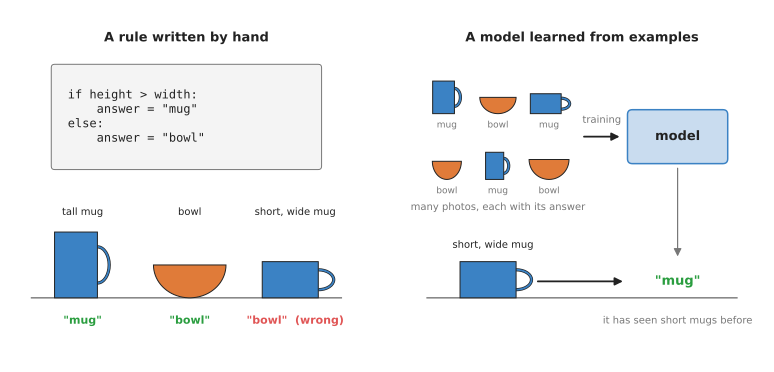
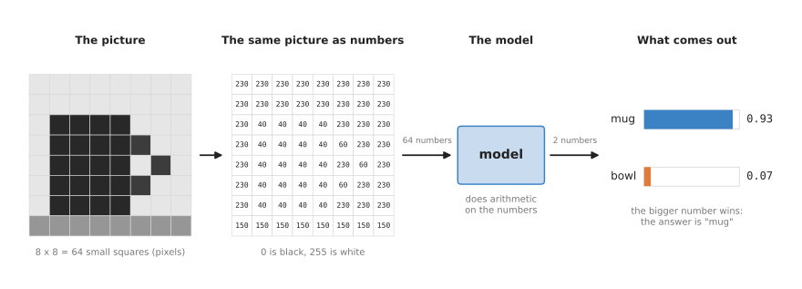
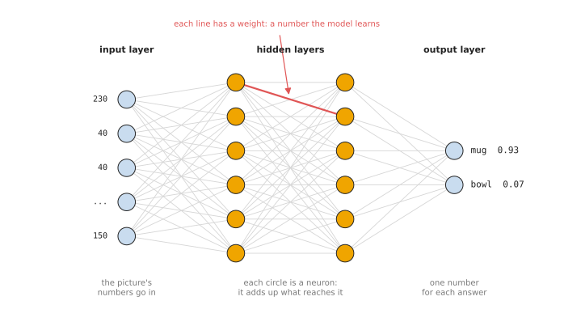

# What a model is

This is the first page of Book 5. The book explains the neural network models
that robots, and robot arms in particular, use today. This page answers the
first question a beginner has: what is a "model"?

It is for a reader who has never met the word in this sense. You should know
what a robot arm is and what a camera does, from Books 1 and 2. You do not need
to know anything about machine learning, and you do not need any maths beyond
adding and multiplying.

By the end of the page you will know four things. A model is a function that
was learned from examples, instead of written by hand. Everything that goes
into a model and comes out of it is a list of numbers. A neural network is one
particular kind of model. And the last sections say what the rest of the book
covers and how to read it.

## Contents

1. [A model turns an input into an output](#1-a-model-turns-an-input-into-an-output)
2. [Rules written by hand, or a model learned from examples](#2-rules-written-by-hand-or-a-model-learned-from-examples)
3. [Everything is numbers](#3-everything-is-numbers)
4. [What "neural network" means](#4-what-neural-network-means)
5. [Why learn a model, and what it costs](#5-why-learn-a-model-and-what-it-costs)
6. [What this book covers](#6-what-this-book-covers)
7. [How to read this book](#7-how-to-read-this-book)
8. [Where to read next](#8-where-to-read-next)

---

## 1. A model turns an input into an output

A **function** is anything that takes something in and gives something back.
The thing that goes in is the **input**. The thing that comes back is the
**output**. A function gives the same output every time you give it the same
input.

You already know many functions:

- A calculator's square root key takes the number 9 and gives back 3.
- A kitchen scale takes a bag of flour and gives back its weight.
- A robot arm's forward kinematics, from Book 1, takes the joint angles and
  gives back where the gripper is.

In each of these, a person worked out the steps. Somebody wrote down how to
find a square root. Somebody wrote down the formula for the gripper's position.
The steps were written by hand, and they are exactly right.

A **model**, in this book, is also a function. It takes an input and gives an
output. The difference is where its steps come from. Nobody writes them by
hand. A computer program finds them by looking at many **examples**. Each
example is an input together with the output that a person says is correct.

Here is the kind of job a model does on a robot arm. The input is a photo from
the arm's camera. The output is the name of the object in the photo: "mug" or
"bowl". A person collects a few thousand photos and writes the right name
next to each one. A program then looks at all of them and finds steps that
turn each photo into its name. Those steps are the model.

The process of finding the steps is called **training**. People also say the
model **learns** from the examples. The word "learn" here means only this: a
program adjusted some numbers until the outputs matched the examples. The
[next page](02_how-a-model-learns.md) shows exactly how that works.

---

## 2. Rules written by hand, or a model learned from examples

This section compares the two ways of building the mug-or-bowl function, using
the same three objects for both.

Suppose you try to write the rule yourself. You look at a mug and a bowl side
by side. A mug is usually taller than it is wide. A bowl is usually wider than
it is tall. So you write a rule that measures the object in the photo and
compares its height with its width.

The picture below shows this rule on the left, and a learned model on the
right.

On the left, the rule works on a tall mug and on a bowl but calls a short, wide
mug a "bowl"; on the right, a model trained on many named photos calls it a "mug".

The rule fails because it looks at only one thing, the height and the width.
Real mugs come in many shapes. Some are short and wide. Some have no handle
turned towards the camera. Some bowls are deep and narrow. You could add more
rules: "if it has a handle, it is a mug". Then you need a rule that finds a
handle in a photo. That rule needs more rules. Each new rule fixes a few
objects and breaks a few others.

The model on the right was never told about height, width or handles. It was
shown many photos, each with the right name written next to it. Some of those
photos were of short, wide mugs. During training, the program adjusted the
model until it gave the right name for almost all of them. So when it sees a
new short, wide mug, it gives the right answer.

The table below compares the two ways. Read each row across to see how they
differ on one point.

| | Rules written by hand | Model learned from examples |
| --- | --- | --- |
| Who writes the steps | a person | a program, from examples |
| What you need to start | an understanding of the problem | many examples with the right answers |
| Works on objects you did not plan for | often not | often yes, if they look like the examples |
| Can you read why it gave an answer | yes, line by line | mostly no |
| How you fix a mistake | change a rule | add examples and train again |

Programmers usually say that the rules approach is **programmed** and the model
approach is **learned**. Books 2 and 3 use the same two words. A real robot
usually mixes both. For example, a learned model finds the mug in the photo,
and hand-written maths then works out how to move the arm to it.

---

## 3. Everything is numbers

A computer cannot look at a mug. It can only do arithmetic on numbers. So
before a model can use a photo, the photo must become a list of numbers. The
answer must also come out as numbers.

A digital photo is already made of numbers. It is a grid of tiny squares called
**pixels**. In a grey photo, each pixel is one number that says how bright it
is. The usual scale goes from 0, which is black, to 255, which is white. A
colour photo has three numbers per pixel: one for red, one for green and one
for blue.

The picture below shows a very small grey photo of a mug, only 8 pixels wide
and 8 pixels tall, and follows it through a model.

The 64 brightness numbers go into the model, the model does arithmetic on them, and two numbers come out, one for "mug" and one for "bowl".

Read the picture from left to right:

1. The photo is a grid of 64 pixels. The mug is dark and the background is
   light.
2. The same photo, written as numbers. The dark mug pixels are 40. The light
   background is 230. The table along the bottom is 150.
3. These 64 numbers go into the model. The model multiplies and adds them in a
   fixed way that it learned during training.
4. Two numbers come out. The first is a **score** for "mug", 0.93. The second
   is a score for "bowl", 0.07. The two scores add up to 1. People often read
   them as how sure the model is. Here it is 93% sure that the photo shows a
   mug.

The output scores in this picture are an example chosen to show the idea. A
real camera photo is much bigger. A photo 640 pixels wide and 480 pixels tall
has 307,200 pixels. In colour that is 921,600 numbers. The model handles them
in the same way. There are just more of them.

The same is true of every other input and output in this book. A robot arm's
joint angles are a list of numbers, one per joint. A force sensor gives a few
numbers. A sentence typed by a person is turned into a list of numbers too.
The output can be:

- a score for each kind of object, as in the picture above;
- four numbers for a box drawn around an object in the photo;
- a position and an angle for the gripper;
- a list of joint angles for the next moment of movement.

So the question every model answers has the same shape: "given these numbers,
what are those numbers?" What changes from one kind of model to the next is
what the numbers mean.

---

## 4. What "neural network" means

A model needs some fixed way of turning its input numbers into its output
numbers. The most common way today is a **neural network**. Nearly every model
in this book is a neural network.

A neural network is built from many small, identical pieces called
**neurons**. A neuron is a tiny calculation. It takes some numbers in,
multiplies each one by a number of its own, adds the results together, and
passes the total on. The name comes from nerve cells in the brain, which gave
the first researchers the idea in the 1940s and 1950s. A neural network in a
computer is only arithmetic. It does not work like a brain in any detailed
way.

The neurons are arranged in **layers**. The picture below shows a small
network with four layers.

Numbers enter on the left, pass through two hidden layers of neurons, and two scores come out on the right; every line carries a number called a weight.

- The **input layer** on the left holds the input numbers, for example the
  brightness of each pixel.
- The **output layer** on the right gives the answer, here one score for "mug"
  and one for "bowl".
- The layers in between are called **hidden layers**, because you never see
  their numbers directly. You only see what goes in and what comes out.

Each line between two neurons has a number attached to it. This number is
called a **weight**. The weight says how much the first neuron's number counts
towards the second neuron's total. A big weight means it counts a lot. A weight
near zero means it hardly counts. A negative weight means it pulls the total
down.

The weights are the part that is learned. Before training, they are random
numbers, and the network's answers are nonsense. Training changes the weights,
a little at a time, until the answers match the examples. After training, the
weights are fixed. The network is then just a very long, fixed calculation.

Real networks are much bigger than the one in the picture. A network that
reads camera photos can have millions of weights. The largest models in this
book have billions. The
[inside-a-neural-network page](03_inside-a-neural-network.md) opens up a single
neuron and shows the special layers that pictures and sentences need.

---

## 5. Why learn a model, and what it costs

This section answers the question every choice in this book comes back to. Why
use a learned model instead of the obvious alternative, which is rules written
by hand?

A learned model does one thing that hand-written rules do badly. It handles
the huge variety of the real world. Mugs come in thousands of shapes and
colours. The light in a room changes during the day. A towel on a table can lie
in endless different folds. Writing rules for all of this is not practical. A
model can learn it from enough examples.

A model also saves you from having to describe the thing yourself. You may not
be able to say in words what makes a grasp secure, or what a ripe tomato looks
like. You can still collect examples of good grasps and ripe tomatoes. The model
finds the pattern.

A learned model costs you four things.

- It needs examples. Often it needs thousands of them, each with the right
  answer written down by a person. Collecting them takes time and money.
- It needs computing power to train. A large model can take days on many
  graphics cards. A graphics card, also called a **graphics processing unit
  (GPU)**, is a chip that can do many multiplications at the same time, which is
  what training needs.
- You cannot easily read why it gave an answer. The answer comes out of
  millions of multiplications. There is no single line to point at.
- It can be wrong in ways that are hard to predict. A model is usually reliable
  on inputs that look like its examples. On an input that looks different, such
  as a photo in much darker light, it may give a wrong answer with a high score.

So the advice in this book is the same as in Books 2 and 3. If a simple
hand-written rule does the job reliably, use the rule. It is cheaper, faster and
easier to check. Use a learned model when the world is too varied for rules.
On a robot arm that is very often the case for seeing, grasping and moving
around real objects.

---

## 6. What this book covers

This book sorts the models used on robot arms into seven families. Each
family answers a different question for the robot. Each family has its own
chapter, and each chapter starts with an overview page.

The table below lists the seven families. Read each row as one family: its
name, the question it answers for a robot arm, and the link to its overview.

| Family | What it does | Start here |
| --- | --- | --- |
| Seeing models | turn a picture into names, boxes, outlines, poses or depth | [overview](../02_seeing-models/01_overview.md) |
| 3D models | work on 3D points and whole scenes instead of flat pictures | [overview](../03_3d-models/01_overview.md) |
| Grasp models | decide where and how to hold an object | [overview](../04_grasp-models/01_overview.md) |
| Movement models | decide how the arm should move, moment by moment | [overview](../05_movement-models/01_overview.md) |
| Language models | understand words, and connect words to pictures and actions | [overview](../06_language-models/01_overview.md) |
| World models | predict what will happen next if the arm does something | [overview](../07_world-models/01_overview.md) |
| Touch and body models | make sense of touch, force and the arm's own body | [overview](../08_touch-and-body-models/01_overview.md) |

Before those seven chapters comes this first chapter. It explains the ideas
that every later page uses. It has six pages:

1. What a model is. This page.
2. [How a model learns](02_how-a-model-learns.md). Examples, guesses, measuring
   how wrong a guess is, and changing the weights a little at a time.
3. [Inside a neural network](03_inside-a-neural-network.md). Neurons, layers,
   and the special layers for pictures and sentences.
4. [Where the data comes from](04_where-the-data-comes-from.md). How people
   collect the examples a robot model learns from.
5. [Running a model on a robot](05_running-a-model-on-a-robot.md). What
   happens when a trained model is used on a real arm.
6. [The map of models](06_the-map-of-models.md). All seven families on one
   page, and how they work together on one task.

---

## 7. How to read this book

Read the first chapter in order. Each page uses words that the page before it
explained. The first three pages are the base for everything else.

After that, the seven family chapters can be read in any order. Each one starts
with an overview page that says what the family is for and lists its kinds of
model. Each later page in a chapter covers one kind of model. Those pages all
follow the same order. They say what the model is, what goes in and what comes
out, how it works inside, how it is trained, which well-known models are of
this kind, where it is used on a robot arm, and what goes wrong.

If you want a quick overview first, read the
[map of models](06_the-map-of-models.md) next, and then come back to the
[next page](02_how-a-model-learns.md).

This book explains ideas, not code. Books 2 and 3 show how to download, run and
train some of these models on a real arm. The "Where to read next" section at
the end of each page links to those deeper pages where they exist.

---

## 8. Where to read next

- [How a model learns](02_how-a-model-learns.md) is the next page. It shows how
  training finds the weights.
- [Inside a neural network](03_inside-a-neural-network.md) opens up a neuron and
  the layers built from it.
- [Models that find objects](../../02_perception/02_object-perception/04_models-that-find.md)
  in Book 2 lists real seeing models you can download and run today.
- [Camera basics](../../02_perception/01_camera/01_basics.md) in Book 2 explains
  how a camera makes the grid of pixels that a model reads.
