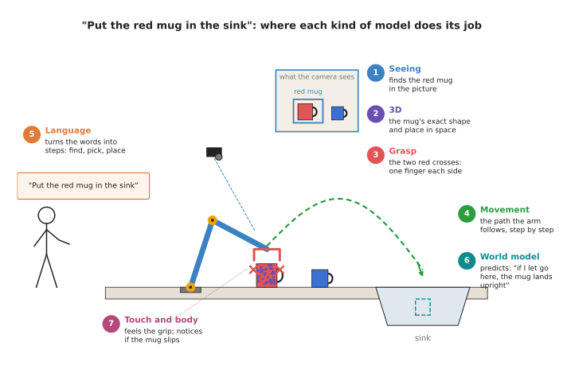
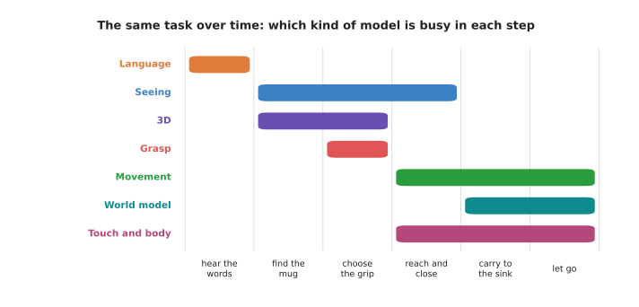

# The map of models

This book describes many neural network models. They have different names, take in
different things and give out different answers. This document is the map of all of
them. It sorts them into seven kinds, which this book calls **categories**. For each
category it says what the models do and where to read about them.

It answers three questions. What are the seven kinds of model? Where does each kind
do its job when one robot arm does one task? And in what order should you read the
chapters of this book?

It is for a complete beginner who has read the earlier documents in this chapter,
especially [what a model is](01_what-a-model-is.md). You can also come back to it at
any time, when you want to see where one chapter fits among the others.

## Contents

1. [One task, seven kinds of model](#1-one-task-seven-kinds-of-model)
2. [The seven categories](#2-the-seven-categories)
   · [Seeing models](#seeing-models)
   · [3D models](#3d-models)
   · [Grasp models](#grasp-models)
   · [Movement models](#movement-models)
   · [Language models](#language-models)
   · [World models](#world-models)
   · [Touch and body models](#touch-and-body-models)
3. [All seven in one table](#3-all-seven-in-one-table)
4. [When each kind does its job](#4-when-each-kind-does-its-job)
5. [How the categories connect](#5-how-the-categories-connect)
6. [A suggested reading order](#6-a-suggested-reading-order)
7. [Where to read next](#7-where-to-read-next)

---

## 1. One task, seven kinds of model

The easiest way to see all seven categories is to follow one task. A person says to
a robot arm: "Put the red mug in the sink." The arm has a camera on its wrist. There
is a red mug and a blue mug on the counter, and a sink at one end.

To do this, the robot must do several separate things. It must understand the words.
It must find the red mug in the camera picture, and not the blue one. It must work
out the mug's exact shape and position in space. It must choose where to put its
fingers. It must move there, pick the mug up and carry it. It must feel whether the
mug is slipping. And it helps if it can predict what will happen when it lets go.

Each of these jobs is done by a different kind of model.

The picture shows the task with the seven kinds of model numbered. Each number
sits next to the part of the scene that the model works on: the words, the camera
picture, the mug's shape, the finger positions, the path, the sink and the
fingertips.

A real robot does not always use all seven. Many robots use only two or three. Some
large models do several of these jobs at once. But every model in this book does at
least one of these jobs.

---

## 2. The seven categories

Each category below has one paragraph that says what its models do, followed by a
link to the chapter overview. The overview lists every kind of model in that
category.

### Seeing models

Seeing models turn a picture into names, boxes, outlines, poses or depth. They take
a camera picture and say what is in it and where. The simplest ones give one name for
the whole picture. Others draw a box around each object, trace its exact outline,
find special points such as a mug's handle, or guess how far away each pixel is.
Some can be told what to look for in ordinary words, such as "the red mug". In the
mug task, a seeing model finds the red mug in the picture. Read the
[seeing models overview](../02_seeing-models/01_overview.md).

### 3D models

3D models work on 3D points and whole scenes instead of flat pictures. A depth camera
gives many points, each with a position in space. Together these points are called a
**point cloud**. 3D models can say which points belong to the mug, guess the shape of
the side of the mug that the camera cannot see, or build a full 3D copy of the
room from many pictures. In the mug task, a 3D model gives the mug's exact shape and
position, so the gripper does not bump into it. Read the
[3D models overview](../03_3d-models/01_overview.md).

### Grasp models

Grasp models decide where and how to hold an object. They take a picture or a point
cloud and give one or more grasps. A **grasp** is a position and direction for the
gripper, and how wide to open its fingers. Some grasp models also say where a
suction cup should go, or which part of an object is meant to be held, such as a
mug's handle. Others score a grasp to say how likely it is to work. In the mug task,
a grasp model chooses where the fingers go on the mug. Read the
[grasp models overview](../04_grasp-models/01_overview.md).

### Movement models

Movement models decide how the arm should move, moment by moment. They take what the
robot sees and feels now, and give the next movement, or the next few movements.
Many of them learn by copying people who drove the robot. Others learn by trial and
error, in the real world or in a simulator. Some help a programmed planner by
checking paths or suggesting them. In the mug task, a movement model guides the arm
to the mug and on to the sink. Read the
[movement models overview](../05_movement-models/01_overview.md).

### Language models

Language models understand words, and connect words to pictures and actions. A
language model can turn "put the red mug in the sink" into a list of steps. A
vision-language model can answer questions about a picture, such as "is the mug in
the sink now?". A vision-language-action model takes a picture and an instruction and
gives arm movements directly. In the mug task, a language model turns the person's
words into steps: find the red mug, pick it up, put it in the sink. Read the
[language models overview](../06_language-models/01_overview.md).

### World models

World models predict what will happen next if the arm does something. They take the
state of the scene now and a planned action, and give the state that should follow.
Some predict positions, some predict whole future pictures, and some predict how
cloth or liquid will move. A robot can use this to try out actions in its
"imagination" before doing them for real. In the mug task, a world model predicts
whether the mug will land upright if the gripper lets go at a certain point. Read the
[world models overview](../07_world-models/01_overview.md).

### Touch and body models

Touch and body models make sense of touch, force and the arm's own body. They take
signals from touch sensors on the fingers, from force sensors in the wrist, or from
the arm's own motors. They say whether the fingers are touching something, how hard
they are pressing and whether the object is slipping. They can also notice when the
arm has bumped into something it should not have, and learn how the arm itself
really moves. In the mug task, a touch model notices if the mug starts to slip out of
the fingers. Read the [touch and body models overview](../08_touch-and-body-models/01_overview.md).

---

## 3. All seven in one table

The table below puts the seven categories side by side. Read each row across: what
the model is given, what it gives back, and one question it answers for a robot arm.

| Category | Input (what goes in) | Output (what comes out) | Example question |
| --- | --- | --- | --- |
| [Seeing models](../02_seeing-models/01_overview.md) | a camera picture | names, boxes, outlines, points or depth for each pixel | "Where is the red mug in this picture?" |
| [3D models](../03_3d-models/01_overview.md) | a point cloud, or several pictures of a scene | labelled points, a full 3D shape, or a 3D copy of the scene | "What is the mug's full shape, including the back I cannot see?" |
| [Grasp models](../04_grasp-models/01_overview.md) | a picture or a point cloud | gripper positions and directions, each with a score | "Where should my fingers go to lift this mug?" |
| [Movement models](../05_movement-models/01_overview.md) | pictures and joint angles now | the next movement, or the next few | "How should I move my joints in the next second?" |
| [Language models](../06_language-models/01_overview.md) | words, often with a picture | steps, answers in words, or arm movements | "What steps does 'put the red mug in the sink' need?" |
| [World models](../07_world-models/01_overview.md) | the scene now and a planned action | the scene a moment later | "If I let go here, where will the mug end up?" |
| [Touch and body models](../08_touch-and-body-models/01_overview.md) | touch, force and motor signals | contact, force, slip, or a warning | "Is the mug slipping out of my fingers?" |

The first three categories look at the world. The next one acts in it. Language
models connect people's words to the rest. World models look ahead in time. Touch and
body models check what is happening at the fingers and inside the arm.

---

## 4. When each kind does its job

The map picture shows where each kind of model works. It is also useful to see when
each one works. The same task can be split into six steps: hear the words, find the
mug, choose the grip, reach and close the gripper, carry the mug to the sink, and let
go.

Each coloured bar shows the steps during which one kind of model is busy. Language
works first and briefly. Seeing keeps working while the arm reaches, because the mug
may move. Movement, world and touch models take over once the arm is moving.

This is one possible way to build the task, not the only one. A robot built around a
single vision-language-action model would have one long bar that covers language,
seeing and movement at once.

---

## 5. How the categories connect

The seven categories are separate chapters, but the models in them depend on each
other. The output of one is very often the input of the next.

A seeing model finds the mug. A 3D model takes the points inside the mug's outline
and gives its shape. A grasp model takes that shape and chooses a grasp. A movement
model, or a programmed planner, moves the arm to the grasp. A touch model checks the
grip. This chain, from picture to movement, is the most common way to build a
picking robot.

Some models cross the borders between categories. An open-vocabulary seeing model
uses language to know what to look for, so it belongs partly to seeing models and
partly to language models. A vision-language-action model does the jobs of seeing,
language and movement in one network. A world model can be used inside a movement
model, so the movement model can try actions in its imagination first. The chapters
point out these links where they matter.

The categories also share their data sources. The
[where the data comes from](04_where-the-data-comes-from.md) document described
them. Seeing and language models learn mostly from pictures and text, often from the
internet. Movement models learn mostly from demonstrations and simulation. Touch and
body models learn from the robot's own sensors. And almost all of them run inside
the loop described in [running a model on a robot](05_running-a-model-on-a-robot.md).

---

## 6. A suggested reading order

You can read the chapters of this book in any order, because each one explains its
own terms. But some chapters are easier after others. The list below is the order
this book suggests, with the reason for each step.

1. This chapter, [what models are](01_what-a-model-is.md). Everything else uses
   its words: model, training, neural network, data and inference.
2. [Seeing models](../02_seeing-models/01_overview.md). Most robot arms start
   with a camera, and most other models use what a seeing model finds.
3. [3D models](../03_3d-models/01_overview.md). They take the step from flat
   pictures to positions in space, which an arm needs to reach anything.
4. [Grasp models](../04_grasp-models/01_overview.md). They use what seeing and
   3D models give, and decide how to pick an object up.
5. [Movement models](../05_movement-models/01_overview.md). They decide how the
   arm moves. Many of the best-known recent results in robot learning are movement
   models.
6. [Language models](../06_language-models/01_overview.md). They are easier to
   follow once you know seeing and movement models, because the largest of them
   combine both.
7. [World models](../07_world-models/01_overview.md). They predict the future,
   which makes most sense once you know what a movement model does with a
   prediction.
8. [Touch and body models](../08_touch-and-body-models/01_overview.md). They
   finish the book with the sense that works closest to the object itself.

If you have one specific job in mind, you can also jump straight to its chapter. For
example, if you only want to pick objects from a bin, read seeing models and then
grasp models.

---

## 7. Where to read next

- The [seeing models overview](../02_seeing-models/01_overview.md) is the next
  chapter in the suggested order.
- [Running a model on a robot](05_running-a-model-on-a-robot.md) explains the loop
  that every one of these models runs inside.
- [Foundation models and generalist policies](../../03_frameworks/08_frontier/02_foundation-models.md)
  in Book 3 lists the large models that try to do many of these jobs at once.
- [Learned methods for one arm](../../03_frameworks/04_one-arm-training/03_learned-methods.md)
  in Book 3 shows how these kinds of model are used to teach a single arm a task.
