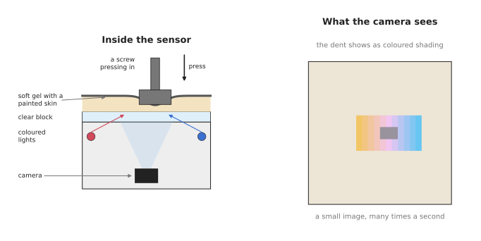
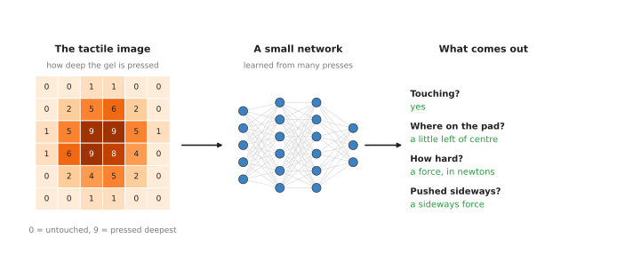
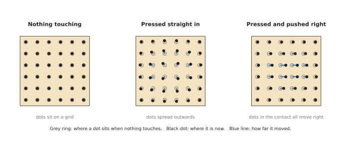

# Touch sensing models

This page answers one question. How does a robot turn a picture of its finger pad
into facts about what it is touching? It explains the sensors that make such a
picture, what a model learns to read from it, how that model is trained, and where
it helps a robot arm.

It is for a reader who has read the [overview of this
chapter](01_overview.md) and the first chapter of this book, especially [how a
model learns](../01_what-models-are/02_how-a-model-learns.md). You do not need to
know anything about touch sensors. You should know what a digital picture is: a grid
of small squares called pixels, each with a number for its brightness.

## Contents

1. [What it is](#1-what-it-is)
2. [The sensor that makes the picture](#2-the-sensor-that-makes-the-picture)
3. [What goes in and what comes out](#3-what-goes-in-and-what-comes-out)
4. [How it works inside](#4-how-it-works-inside)
5. [How it is trained](#5-how-it-is-trained)
6. [Well-known models and tools](#6-well-known-models-and-tools)
7. [A worked example: checking the grip on a mug](#7-a-worked-example-checking-the-grip-on-a-mug)
8. [What goes wrong](#8-what-goes-wrong)
9. [Why this rather than the obvious alternative, and what it costs](#9-why-this-rather-than-the-obvious-alternative-and-what-it-costs)
10. [Where to read next](#10-where-to-read-next)

---

## 1. What it is

A touch sensing model takes a small picture of a contact and says where the
contact is, what shape it has and how hard it presses.

Here is an everyday example. Close your eyes and pick up a pen. Your fingertip
skin bends around the pen. From how it bends, you know the pen is round, you know
roughly where it sits on your finger, and you know how hard you are pressing. You
did not need to see it.

A robot finger with a tactile sensor gets a similar signal. "Tactile" means to do
with touch. The sensor reports how its soft surface has bent. A touch sensing model
is the part that turns that raw signal into the facts you would have known with
your eyes closed.

## 2. The sensor that makes the picture

Most of the models on this page work with one kind of sensor, called a
**vision-based tactile sensor**. It is a small camera that films the inside of a
soft pad.

The left half of the picture shows the inside of the sensor. The right half shows
the kind of picture its camera takes when a screw presses into the pad.

The sensor has four parts, from the outside in.

1. A soft pad made of a clear rubbery material called gel. It is a few millimetres
   thick.
2. A thin painted skin on the outside of the gel. The paint stops the camera from
   seeing through to the object. The camera sees only the shape of the skin.
3. Small coloured lights around the edge. Each one shines across the gel from a
   different side.
4. A small camera underneath, looking up at the skin.

When an object presses into the pad, the skin bends. A slope that faces one light
looks bright in that light's colour. A slope that faces away looks dark. So the
camera picture shows the shape of the dent as coloured shading.

The best-known sensors of this kind are **GelSight**, first built at the
Massachusetts Institute of Technology (MIT), and **DIGIT**, a low-cost design from
Meta. Another kind, **TacTip** from the Bristol Robotics Laboratory, uses a soft
skin with small pins on the inside, and the camera watches the pins move. The
frameworks book lists what you can buy, with prices, in [tactile sensing at the
contact](../../03_frameworks/02_gripping/02_grippers-and-hardware.md#82-tactile-sensing-at-the-contact).

Some sensors are not cameras at all. A pressure array is a grid of small pressure
sensors, each giving one number. A magnetic skin, such as AnySkin, has tiny magnets
in soft rubber, and a chip underneath measures how the magnets move. Both still
produce a grid of numbers, so the same kind of model can read them.

## 3. What goes in and what comes out

The input is one tactile picture, or a short run of them. For a camera-based
sensor, this is an ordinary small colour image. For a pressure array, it is a grid
of pressure numbers.

The picture shows a simplified tactile image as a grid of numbers. Each number says
how deep the gel is pressed at that spot. The network reads the whole grid and
gives back answers.

The outputs a robot arm needs most are these:

- Contact or no contact. Is the pad touching anything at all?
- Where on the pad the contact is. Is the object in the middle of the pad, or near
  the edge?
- The shape of the contact. Is it a flat face, an edge, a corner or a round
  surface?
- The force. How hard is the pad pressed straight in? This is called the **normal
  force**. How hard is it pushed sideways? This is called the **shear force**.
- A height map. For each pixel, how deep is the dent? This gives a small 3D shape
  of the part of the object that touches the pad.

Some models give one of these. Others give several at once.

## 4. How it works inside

There are two ways to get from the picture to the answers. The first uses no
learning. The second does.

### 4.1 Without learning: the shape from the shading

The coloured shading in the picture follows a simple rule. The brighter a spot is
in the red light, the more that spot's slope faces the red light. The same holds
for each colour. With three lights you can work out the slope at every pixel. Add
up the slopes across the picture and you get the depth of the dent. This method is
called **photometric stereo**: "photometric" means measuring light, and "stereo"
here means using more than one view of the light.

It needs a calibration first. You press a small ball of known size into the pad and
record how each slope looks. After that, it works for any shape.

### 4.2 With learning: a network reads the picture

A neural network can learn the same thing, and more. The network used is usually a
**convolutional neural network (CNN)**. A CNN is the kind of network the [seeing
models](../02_seeing-models/01_overview.md) chapter uses for ordinary photos. It
slides small filters across the picture, looks for simple patterns such as edges,
and then combines them into larger patterns.

The steps are:

1. The camera takes a tactile picture.
2. The model subtracts a picture of the same pad with nothing touching it. What
   is left is only the change caused by the contact.
3. The CNN reads the change and builds up a set of numbers that describe it.
4. A small last part of the network turns those numbers into the answers: contact
   or not, where, what shape, how much force.

### 4.3 Seeing the sideways push

The shading shows how deep the pad is pressed. It does not show well how hard it
is pushed sideways. For that, many gel sensors have a grid of small black dots
printed on the gel.

The picture shows the same grid of dots three times. When nothing touches, the dots
sit on their grid. When something presses straight in, the dots near the contact
spread outwards a little. When something presses and also pushes sideways, the dots
in the contact all move the same way.

A model can track each dot from one picture to the next. How far and in which
direction the dots move tells it the sideways force. This is the signal the [force
and slip page](03_force-and-slip-models.md) uses to catch an object starting to
slide.

## 5. How it is trained

A touch sensing model learns from examples. Each example is a tactile picture
together with the right answer. The hard part is getting the right answers.

For contact shape and height maps, people use the photometric stereo method from
section 4.1 to make the answers. Or they press objects of known shape, such as
balls, cylinders and cubes, into the pad at known places.

For force, people mount the tactile sensor on top of a separate force sensor. They
press many objects into it at many angles and record both at once. The force sensor
gives the right answer for each tactile picture. Thousands of presses is a normal
size for such a set.

A newer way needs no answers at all. It is called **self-supervised learning**.
The model is given a very large number of tactile pictures with no labels. It
learns by solving a made-up puzzle: parts of each picture are hidden, and it must
guess what was hidden. To do that well, it must learn what tactile pictures are
like in general. Afterwards, a small extra part is trained on a few labelled
examples for the task you actually need. [Where the data comes
from](../01_what-models-are/04_where-the-data-comes-from.md) explains this idea in
more detail.

There is a second route to lots of data: simulation. A tactile simulator draws the
picture the sensor would take for a given object and contact. Two are free to use:
TACTO and Taxim. The pictures are not quite the same as real ones, so a model
trained only on simulated pictures usually needs some real ones too.

## 6. Well-known models and tools

This area has far fewer models than the camera side. These are real, published,
and worth knowing by name.

- **GelSight's own shape and force methods.** The MIT group that made GelSight
  published how to get a height map from the shading, and how to estimate force
  from the moving dots. Much later work starts here.
- **"The Feeling of Success"** (Calandra and colleagues, 2017). A network looks at
  GelSight pictures from both fingers, plus a camera picture, and predicts whether
  a grasp will hold once the object is lifted.
- **Sparsh** (Meta, 2024). A self-supervised model trained on a large set of
  tactile pictures from several sensor types. It is meant as a starting point that
  other tactile models build on. Its licence forbids commercial use.
- **Transferable Tactile Transformers (T3)** (2024). One model shared across many
  different tactile sensors, with a small separate part for each sensor. The idea
  is to stop training from scratch every time the sensor changes.
- **NeuralFeels** (Meta, 2024, MIT licence). It joins touch with a camera to
  rebuild the shape and position of an object while a robot hand turns it. The
  [perception book](../../02_perception/02_object-perception/02_sensors.md#25-models)
  describes it.
- **TACTO** and **Taxim**. These are not models but simulators. They make
  realistic tactile pictures, so you can build and test the rest of a pipeline
  without a sensor on the desk.

## 7. A worked example: checking the grip on a mug

A two-finger gripper with a gel sensor on each finger picks up a mug by its side.

1. The fingers close. Both tactile pictures change. The model says "contact" on
   both fingers.
2. The model finds where on each pad the contact is. Suppose both contacts are near
   the lower edge of the pads. That means the fingers closed on the mug too high,
   and only the lower edge of each pad touches it.
3. The model finds the shape of the contact. It is a long, gently curved strip. That
   matches the side of a round mug, not the thin handle.
4. The model estimates the normal force on each pad. Both are similar, which means
   the mug is centred between the fingers.
5. The program checks these facts against what it expected. The contact is near the
   edge, so the grip is less secure than planned. The program opens the fingers,
   moves down a little, and closes them again.

A camera could not do step 2. Once the fingers are closed, they hide exactly the
part of the mug that the answer depends on.

## 8. What goes wrong

Touch sensing models have problems that camera models do not.

- **The gel wears out.** The pad is soft and it rubs against every object. Its
  surface gets scratched, the paint wears, and the dots fade. A model trained on a
  new pad sees different pictures from an old one. The frameworks book notes that
  one maker rates its gel for about a thousand presses. People replace gels and
  re-check the model after each change.
- **Every sensor is a little different.** Two sensors of the same model have
  slightly different lights, cameras and gels. A model trained on one often does
  worse on the next. People calibrate each sensor with a reference press, or use
  models such as T3 that are built to share across sensors.
- **The reading drifts with temperature.** The gel's stiffness changes when it
  warms up. People take a fresh "nothing touching" picture before each grasp and
  subtract it.
- **It sees only the contact.** A tactile picture shows a patch a couple of
  centimetres across. It says nothing about where the object is in the room, or
  what the rest of it looks like. People combine it with a camera for that.
- **Simulated pictures are not real pictures.** A model trained only in a
  simulator usually does worse on a real sensor. People mix in real examples.
- **The software is thin.** There is very little maintained open-source code, and
  some of what exists has licences that forbid commercial use or require you to
  share your own code. [Holding
  on](../../03_frameworks/02_gripping/05_holding-on.md#43-the-state-of-the-open-source-software-which-is-worth-saying-plainly)
  lists the licences.

## 9. Why this rather than the obvious alternative, and what it costs

There are two obvious alternatives. Each is right in some cases.

The first alternative is **not to use a tactile sensor at all**. Use the gripper's
own finger position and a wrist force sensor instead. This is cheaper, and it is
what most working robot cells do. It tells you that the fingers stopped on
something and how much the held object weighs. It does not tell you where on the
pad the object sits, or what shape the contact has. A tactile sensor with a model
is worth it when those things decide success: a small part that must be held
exactly in the middle, a thin edge, or an object the camera cannot see once it is
held.

The second alternative is **a tactile sensor without a learned model**, using the
photometric stereo method from section 4.1. This is a good choice for a height map.
It is exact, it needs no training data and it is easy to check. A learned model is
worth it when you want answers that the height map does not give directly, such as
force, slip, or whether the grasp will hold.

What it costs you:

- Money and upkeep for the sensors and their spare gels.
- A training set, which means many presses with a reference force sensor, or the
  licence limits of a pretrained model.
- Retraining or recalibrating when the gel or the sensor changes.
- A model that gives no guarantee. It can be confidently wrong on a contact unlike
  anything in its training set, so a program that uses it should still check the
  wrist force before trusting a grip.

## 10. Where to read next

In this chapter:

- [Force and slip models](03_force-and-slip-models.md) use the moving dots from
  section 4.3 to catch an object starting to slide.
- [Collision and failure detection](04_collision-and-failure-detection.md) covers
  the failures that a tactile sensor cannot see.
- The [overview](01_overview.md) compares all four kinds.

In this book:

- [Image classification](../02_seeing-models/02_image-classification.md) explains
  how a CNN reads an ordinary picture. A tactile picture is read the same way.
- [Grasp quality models](../04_grasp-models/05_grasp-quality-models.md) score a
  grasp before the fingers close. Touch models check it after.

In the other books:

- [Measuring by
  touch](../../02_perception/02_object-perception/02_sensors.md#2-measuring-by-touch)
  in the perception book covers what touch can and cannot measure.
- [Tactile sensing at the
  contact](../../03_frameworks/02_gripping/02_grippers-and-hardware.md#82-tactile-sensing-at-the-contact)
  covers the sensors you can buy.
