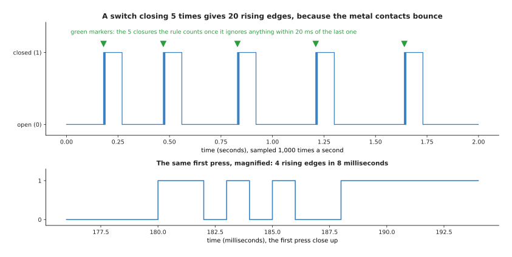

# How rules do the work

This is the first page of a book about neural networks and the models built from
them. Before any of that, it is worth being clear about what the ordinary way of
programming a robot actually is, and when it works, because for most of what a
robot arm does it works very well.

The ordinary way is a **rule**: a sentence a person writes down that says what the
right answer is. A program is a set of such rules. This page shows one job on a
robot arm done that way, from the first attempt through the mistake it makes to the
correction, and then says exactly what it was about that job that let a person
write the rule at all.

By the end you will be able to recognise a job of this kind. That matters because
the next page shows jobs that look just as simple and cannot be done this way at
all, and the difference between the two is what the whole book rests on.

**About this book.** It explains neural networks and the models built from them,
starting from nothing. It assumes you can do arithmetic and percentages, have met a
little school algebra, can read a graph with two axes, and can read a short program
with variables, loops and functions. It assumes you know **nothing** about machine
learning, so every term, from model and gradient to transformer and policy, is
explained in ordinary words on the page that first needs it. There are fourteen
chapters. The early ones take a network apart one neuron at a time and show how
training finds the numbers inside it; the middle ones explain the one design that
almost every large model uses today; the later ones go through the families of
model a robot arm runs, and how to get one working on a real machine.

Every number on this page was worked out by
[`docs/diagrams/what_learning_means.py`](../../diagrams/what_learning_means.py),
which also drew every picture. Everything that looks like sensor data is simulated,
with a fixed random seed, so the numbers come out the same every time it runs.

## Contents

1. [Counting how many times a gripper closes](#1-counting-how-many-times-a-gripper-closes)
2. [What made that rule writable](#2-what-made-that-rule-writable)
3. [Where to read next](#3-where-to-read-next)

---

## 1. Counting how many times a gripper closes

A **gripper** is the hand at the end of a robot arm, and it has two fingers that
close on an object. The gripper has a switch, and the switch closes when the two
fingers meet. The controller wants to know how many times the fingers have met. So
the rule is to watch the switch and add one each time it goes from open to closed.

That rule is wrong, and the picture below shows why. The upper part shows two
seconds of the switch. The lower part shows the first press alone, with the time
axis stretched, so you can see what happens inside a few milliseconds.

A moment where the signal goes from open to closed is called a rising edge. The
switch closed five times, but the rule counts 20 rising edges. The reason is that
the two metal contacts bounce: they touch, spring apart, and touch again during the
first few milliseconds of each press. The lower part of the picture shows four
rising edges inside eight milliseconds.

So the rule needs one more line, which is to ignore any edge that arrives within 20
milliseconds of the last edge that was counted. With that line it counts exactly 5
closures, at 0.180, 0.470, 0.830, 1.210 and 1.640 seconds.

---

## 2. What made that rule writable

The first attempt was wrong, and that is not the interesting part. The interesting
part is what happened next. A person could look at the picture, see what was wrong,
say why it was wrong, and correct it by choosing one number. Nothing else on this
page is as important as that sentence.

Three things had to be true for it to be possible.

**The person knew the right answer for every input.** Not for the inputs that
happened to be recorded that afternoon, but for any switch trace that could ever
arrive. A closure is a rising edge that is not a bounce, and a bounce is an edge
that follows another one too quickly to be a real press.

**That knowledge was short enough to type.** It came to two lines. There was no
need to list the cases one by one, because one sentence covered all of them.

**The mistake pointed at its own cure.** The count was 20 instead of 5, the picture
showed four edges inside eight milliseconds, and the fix was a number large enough
to swallow the bouncing and small enough not to swallow a real press. A person
could reason their way from the symptom to the repair.

Two more jobs on the same arm are the same kind. Converting a distance from
millimetres to metres is a division by 1000, and it is right for every number that
will ever arrive. Refusing a joint command that lies outside the range the joint
can turn is a comparison against two limits. In all three jobs, a person can say in
one sentence what the right answer is for every possible input, and that sentence
is short enough to type.

When a job is like this, write the rule. It costs an afternoon, it needs no data,
it runs in no time at all, and when it is wrong you can see why. Nothing in this
book improves on a rule for a job that a rule can do.

---

## 3. Where to read next

[Where rules stop working](02_where-rules-stop-working.md) takes two jobs in the
same robot cell, with the same camera, that sound no harder than counting switch
closures, and shows that no written rule does them. That page is the reason the
rest of this book exists.

[What a model is](03_what-a-model-is.md) then builds the alternative at its
smallest size, by fitting a formula to six measurements with a calculator.
