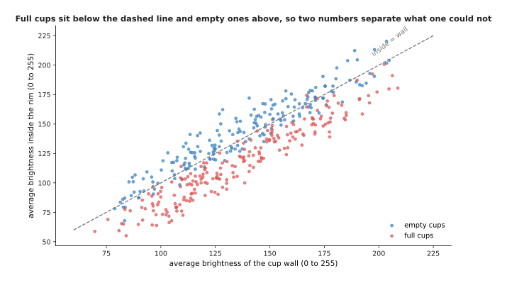
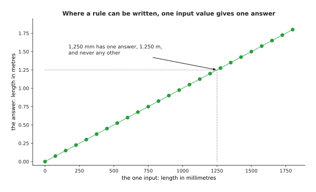
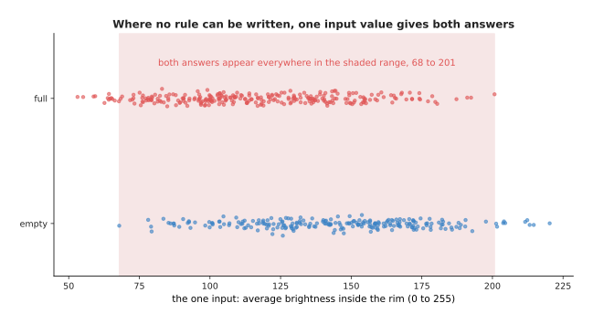
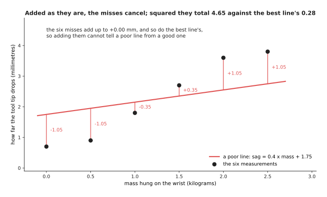
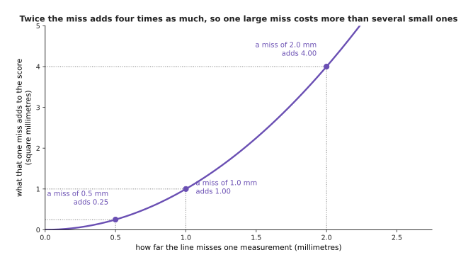

# Why not just write the rules

A program is a set of rules, and a person can write rules. So why train a model at
all? Because there are two kinds of job, and only one of them can be done by
writing the rule down.

**You can write the rule when you know the right answer for every input, and when
that knowledge is short enough to type.** Counting how many times a gripper closes
is a job like that. The rule fits in one sentence. When the first attempt gets the
count wrong, you can see why it is wrong and correct it by choosing one number.

**You cannot write the rule when the thing you measure does not decide the
answer.** Telling a full cup from an empty one by how dark it looks inside is a job
like that. Full cups and empty cups cover almost the same range of brightness, so
there is no brightness at which you can say which one you are looking at. No rule
of that shape exists, however long you spend looking for it.

For the second kind of job you still have something to work with. You have
**examples**, which are measurements with the right answer written beside them. The
method that turns examples into a program is called **fitting**: it chooses the
numbers inside a formula so that the formula's answers come as close as possible to
the answers you were given. Fitting is what the rest of this book is about.

So this page shows one job of each kind, says exactly what separates them, and then
fits a formula to six measurements using nothing more than a calculator. By the end
you will be able to look at a job and say which of the two kinds it is.

**About this book.** It explains neural networks and the models built from them,
starting from nothing. It assumes you can do arithmetic and percentages, have met a
little school algebra, can read a graph with two axes, and can read a short program
with variables, loops and functions. It assumes you know **nothing** about machine
learning, so every term, from model and gradient to transformer and policy, is
explained in ordinary words on the page that first needs it. There are fourteen
chapters. The early ones take a network apart one neuron at a time and show how
training finds the numbers inside it; the middle ones explain the one design that
almost every large model uses today; the later ones go through the families of
model a robot arm runs, and how to get one working on a real machine.

Every number on this page was worked out by
[`docs/diagrams/what_learning_means.py`](../../diagrams/what_learning_means.py),
which also drew every picture. Everything that looks like sensor data is simulated,
with a fixed random seed, so the numbers come out the same every time it runs.

## Contents

1. [A job you can write the rule for](#1-a-job-you-can-write-the-rule-for)
2. [Two jobs nobody can write the rule for](#2-two-jobs-nobody-can-write-the-rule-for)
3. [What exactly separates the two](#3-what-exactly-separates-the-two)
4. [Fitting a straight line to six measurements](#4-fitting-a-straight-line-to-six-measurements)
5. [The words for the pieces of a fitted job](#5-the-words-for-the-pieces-of-a-fitted-job)
6. [What fitting buys you and what it costs](#6-what-fitting-buys-you-and-what-it-costs)
7. [Where to read next](#7-where-to-read-next)
8. [Using it in Python](#8-using-it-in-python)

---

## 1. A job you can write the rule for

A **gripper** is the hand at the end of a robot arm, and it has two fingers that
close on an object. The gripper has a switch, and the switch closes when the two
fingers meet. The controller wants to know how many times the fingers have met. So
the rule is to watch the switch and add one each time it goes from open to closed.

That rule is wrong, and the picture below shows why. The upper part shows two
seconds of the switch. The lower part shows the first press alone, with the time
axis stretched, so you can see what happens inside a few milliseconds.


A moment where the signal goes from open to closed is called a rising edge. The
switch closed five times, but the rule counts 20 rising edges. The reason is that
the two metal contacts bounce: they touch, spring apart, and touch again during the
first few milliseconds of each press. The lower part of the picture shows four
rising edges inside eight milliseconds.

So the rule needs one more line, which is to ignore any edge that arrives within 20
milliseconds of the last edge that was counted. With that line it counts exactly 5
closures, at 0.180, 0.470, 0.830, 1.210 and 1.640 seconds.

The important part is not that the first attempt was wrong. **The important part is
that a person could see what was wrong, say why it was wrong, and correct it by
choosing one number.** That is what it means to be able to write the rule.

Two more jobs on the same arm are the same kind. Converting a distance from
millimetres to metres is a division by 1000, and it is right for every number that
will ever arrive. Refusing a joint command that lies outside the range the joint can
turn is a comparison against two limits. In all three jobs, a person can say in one
sentence what the right answer is for every possible input, and that sentence is
short enough to type.

---

## 2. Two jobs nobody can write the rule for

The next two jobs happen in the same robot cell, on the same afternoon, with the
same camera. Neither sounds harder than counting switch closures. For neither of
them does any rule that anybody has written work.

### Deciding which pixels belong to a glass

A **pixel** is one small square of a picture. In a grey picture each pixel is one
number, from 0 for black to 255 for white. So the obvious rule is to pick a
brightness value and say that every pixel brighter than that value belongs to the
glass. That value is called the **threshold**.

The picture below shows the same scene three times. The left panel is the picture
the camera gives. The middle panel marks the pixels a person says are glass. The
right panel marks the pixels the best possible threshold rule picks.


The glass is see-through. So the table behind the glass has nearly the same
brightness as the glass in front of it, and the rule cannot separate them. The only
parts of the glass clearly brighter than the table are the two edges down its sides
and its top rim, and those are the only parts the rule finds.

That picture has 18 rows of 26 pixels, which is 468 pixels, and 117 of them are
glass. The best threshold rule gets 0.816 of the pixels right, which sounds
acceptable until you notice that a program saying "there is no glass anywhere"
already gets 0.750 right, because most of the picture is table. The rule also
misses 86 of the 117 glass pixels.

Perhaps a better threshold exists somewhere. The picture below is the result of
trying every one of them. The horizontal axis is the threshold and the vertical
axis is the fraction of pixels the rule gets right, with one curve for "glass where
brighter than the threshold" and one for "glass where darker".


A grey pixel has 256 possible brightness values and the rule can run in two
directions, so there are 512 rules of this shape in total. Every one was tried. The
best reaches 0.816, barely above the 0.750 that a program scores without looking at
the picture at all. **The failure is not that nobody has found the right threshold.
It is that no threshold is right.**

### Telling a full cup from an empty one

The camera looks down into a cup. Coffee is darker than china, so the obvious rule
is that a full cup is darker inside the rim than an empty one.

The picture below counts cups. The horizontal axis is the average brightness inside
the rim, and the height of each bar is how many cups had that brightness. The two
colours are the full cups and the empty cups.


Across 1,600 simulated cups the full ones average 117.7 brightness inside the rim
and the empty ones average 139.6. That difference is in the right direction.
However, the full ones run from 53 to 201 and the empty ones from 68 to 226, so the
two ranges cover almost the same values.

They overlap because every cup has its own colour and stands in its own lighting,
and those two things change the brightness much more than the coffee does. The best
threshold on that one number gets 0.659 of the cups right when the threshold is
chosen on those same cups, and 0.611 on cups it has not seen before. Tossing a coin
gets 0.5.

The answer is present in the data after all, but not in that one number. The
picture below plots the same cups twice over: the average brightness of the cup
wall across the page, and the average brightness inside the rim up the page.



The dashed line marks the cups where the inside and the wall have the same
brightness. Most full cups sit below that line, because coffee makes the inside
darker than the wall. Most empty cups sit above it. That line is already a rule,
and it is right on 0.819 of all 1,600 cups, far better than any threshold on the
inside brightness alone. The next section follows that fact further.

---

## 3. What exactly separates the two

The introduction said the difference in one sentence: you can write the rule when
the thing you measure decides the answer. This section is exact about it, in three
parts, because the rest of this book follows from them.

The first difference is how many different inputs there are. A switch has two
states. A joint angle recorded to a tenth of a degree over a range of 340 degrees
has 3,401 states. For both of those, a person could write a table with one line per
state. A picture cannot be handled that way, as the picture below shows. Its
vertical axis counts powers of ten, so each step up the axis means ten times as
many inputs.


A patch of 5 pixels by 5 pixels has about 10^60 possible contents. The 18 by 26
picture of the glass has about 10^1127 of them. A camera running at 30 pictures a
second for a whole year sees only about 10^9 pictures, which is the dashed line
near the bottom of the chart.

So a rule for a picture can never be a table of cases, because there are far more
cases than anybody could ever collect. The rule has to be a short formula, and that
formula has to give an answer for inputs that nobody has ever seen. This brings us
to the second difference. For the counting job such a formula exists and somebody
knows it. For the glass job and the cup job it does not.

That claim is easier to believe when you watch a person try to build such a
formula. The cup job gives three numbers that a camera can measure. They are the
average brightness inside the rim, the spread of that brightness, and the average
brightness of the cup wall. The spread is how far the individual pixel values lie
from their own average, so a cup with both bright and dark places inside it has a
large spread. A person can pick a threshold on any one of those three numbers.
After some thought, a person can also work out that subtracting the wall brightness
from the inside brightness cancels the cup's own colour and its lighting, because
both of those affect the two numbers equally.

The chart below compares five ways of answering. The first four are thresholds on a
single measured number, and the fifth is a model that was given the first three
numbers and found its own combination of them. Every bar is measured on cups that
were not used to choose the rule.


The best threshold on the brightness inside the rim gets 0.611 of unseen cups
right. The best threshold on the spread gets 0.850. The best threshold on the wall
brightness gets 0.477, which is worse than tossing a coin. The best threshold on
the inside brightness minus the wall brightness gets 0.884. A model fitted to the
first three numbers reaches 0.926, and nobody told that model about the
subtraction.

Read that chart as a person who is getting steadily better at the job. The first
threshold barely beats a coin. The second is better, and it is better by luck,
because nobody expected the spread to matter. The third is useless on its own. The
fourth is good only because a person spent an afternoon working out that the cup's
own colour has to be cancelled. The fifth bar is higher than all of them, and it
comes from giving the first three numbers to a program that searches for the
combination by itself.

The third difference is the reason for the other two. Where a rule works, one input
value has exactly one right answer. Where no rule works, the same input value
happens with both answers. The two pictures below show those two situations, one
picture each. The first is the millimetre job named at the end of section 1, drawn with the
input across the page and the answer up the page.



Every input value in that picture meets the line at exactly one place. An input of
1,250 millimetres gives 1.250 metres, and it never gives anything else. The second
picture is the cup job, drawn the same way, with the measured brightness across the
page and the answer up the page. Each dot is one cup, and the dots are spread a
little up and down so that they do not hide each other.



Full cups and empty cups share the brightness range from 68 to 201. That range
holds 0.963 of all 1,600 cups. So for almost any brightness that you could measure,
both answers are possible, and the measurement does not decide the answer.

Once you see that, the situation is clear. Writing a rule means stating the answer
for every input. You can only state the answer when you know it, and for these jobs
nobody knows it, because what you measure does not fix the answer on its own. What
you have instead is examples, which means pictures that somebody has looked at and
written the answer beside. The next section turns examples into a program, at the
smallest size where that is possible.

---

## 4. Fitting a straight line to six measurements

The method is called **fitting**. To fit a formula means to choose the numbers
inside it so that its answers come as close as possible to the answers in your
examples. This section fits a formula using six measurements, a formula that holds
two numbers, and nothing that you could not do on a calculator.

The job is a real one on an arm. When you hang a mass on the wrist, the arm bends a
little under the weight, so the tool tip sits lower than the controller thinks
it does. This bending is called sag. Nobody knows the exact stiffness of this arm. So
somebody hangs six different masses on it and measures, with a height gauge, how
far the tip drops each time. These are the six pairs that they wrote down, and the
numbers were chosen so that the arithmetic later comes out in round figures: 0.0 kg
gives 0.7 mm, 0.5 kg gives 0.9 mm, 1.0 kg gives 1.8 mm, 1.5 kg gives 2.7 mm, 2.0 kg
gives 3.6 mm and 2.5 kg gives 3.8 mm.

Before fitting anything, somebody also writes an obvious rule by hand. That rule is
one millimetre of droop for each kilogram, and a rule like that is often what a real
program contains. The picture below shows the six measurements, that
hand-written rule as a dashed line, and the fitted line.


The fitted line is sag = 1.4 x mass + 0.5. It misses the six measurements by +0.2,
-0.3, -0.1, +0.1, +0.3 and -0.2 millimetres. The hand-written rule misses them by
+0.7, +0.4, +0.8, +1.2, +1.6 and +1.3 millimetres.

The fitted line holds two numbers. The first is the slope, which says how many
millimetres of droop each kilogram causes. The second is the offset, which says how
low the tip already sits when nothing is hanging on it. Nobody chose 1.4 and 0.5.
They came out of the six measurements by the arithmetic drawn below. Read that
table one row at a time, from left to right: the first two columns are the
measurement, and the next four columns are the working.


The whole fit is six subtractions, six multiplications, two totals and one
division, and you can check every line of it by hand.

Here is the same working in words. The average mass is 1.25 kg and the average sag
is 2.25 mm. Each row subtracts those two averages from its own pair of numbers. The
fifth column multiplies the two differences together. The sixth column squares the
first difference. The two totals are 6.1250 and 4.3750. The slope is the first
total divided by the second total, which is exactly 1.4. The offset is the average
sag minus the slope times the average mass, which is 2.25 - 1.4 x 1.25 = 0.5.

That recipe does not pick the slope at random. It picks the slope that makes the
total of the squared misses as small as it can be. The picture below shows that, by
trying every slope in turn and drawing the total each slope produces.


Every slope between 0.2 and 2.6 was tried, with the offset held at 0.5. The total
squared miss has one lowest point, which is 0.28 at a slope of 1.4. At the
hand-written slope of 1.0 the total is 2.48.

The recipe adds the squares of the misses rather than the misses themselves, and
there are two reasons for that. The first reason is that a miss above the line and
a miss below the line would cancel each other out. The picture below shows a line
that is clearly poor, with its six misses written beside it.



Each miss is the measured sag minus what the line says. Three of these misses are
negative and three are positive, and together they add up to 0.00 millimetres. The
best line's six misses also add up to 0.00 millimetres. So a score made by adding
the misses as they are cannot tell a poor line from the best one. Squaring removes
the minus signs, and after squaring the poor line totals 4.655 while the best line
totals 0.280.

The second reason is that squaring makes one large miss cost much more than several
small ones. The picture below shows what a single miss adds to the total, for
misses of different sizes.



A miss of 0.5 millimetres adds 0.25 to the total. A miss of 1.0 millimetre adds
1.00, and a miss of 2.0 millimetres adds 4.00. So doubling a miss multiplies what
it costs by four. Because of that, fitting prefers a line that misses every
measurement by a little over a line that passes through most of them and is far
away from one.

There is now a number that says how wrong an answer is, and there are three answers
to compare with it. The two charts below compare the same three answers twice. The
left chart uses the average squared miss, which is the score that the fit was
chosen to make small. The right chart takes the square root of that score, which
turns it back into millimetres that you can picture.


Always saying 2.25 mm has an average squared miss of 1.476. The hand-written rule
has 1.163 and the fitted line has 0.047. In millimetres those are typical misses of
1.215, 1.079 and 0.216.

So the fitted line misses five times less than the hand-written rule. It was
produced from six measurements and a page of arithmetic, and nobody had to know the
arm's stiffness or anything about its gearbox. That is the idea of this whole book,
at its smallest size.

---

## 5. The words for the pieces of a fitted job

The last section fitted a line without naming its parts. This section names them,
because the rest of the book uses these words on every page. All of the words
describe something in the same six-row table, which is drawn below. Read it as
three columns: the mass that was hung on the wrist, the drop that was measured, and
the drop that the fitted line says.


Every word in this section names one part of that table, and the ringed row at
1.5 kg is one example.

An **input** is what the program is given, and an **output** is what the program is
asked to produce. Here the input is the mass and the output is the drop in
millimetres. A **feature** is one number that makes up an input, and it is chosen
because the answer depends on it. Here there is one feature, which is the mass. The
cup job in section 2 has three features, and a camera picture has one feature per
pixel. A **label** is the right output for one input, written down by whoever
collected the data. So the labels here are the six readings from the height gauge.

An **example** is one input together with its label. The ringed row, which is 1.5 kg
with 2.7 mm, is one example. A **dataset** is a collection of examples, so the whole
six-row table is a dataset. A **prediction** is what the model says the output is,
which is the third column of the table. The difference between a prediction and a
label is the miss that fitting works to make small.

That difference matters most for inputs that were never in the dataset, because
those inputs are the reason for building the model at all. The picture below shows
five such inputs. The squares are what the line predicts at five new masses, and
the diamonds are what somebody measured later at those same masses.


At 0.25, 0.75, 1.25, 1.75 and 2.25 kilograms the line predicts 0.850, 1.550, 2.250,
2.950 and 3.650 millimetres. Measuring later gives 1.09, 1.62, 2.13, 2.67 and 3.23
millimetres. So the misses run from +0.24 millimetres at the lightest mass to -0.42
millimetres at the heaviest.

Those five measurements are simulated. The typical miss on them is 0.258 mm. On the
six measurements that the line was fitted to, the typical miss is 0.216 mm. The
first number is worse than the second, and it should be worse, because the line was
never shown those five masses. So remember the difference between the two words. A
prediction is what the model produces for any input you give it. A label is what a
person or an instrument produced for one input that actually happened. Keeping
those two apart is most of what it takes to read an honest claim about a model.

A feature is not simply any number that you happen to have. The answer has to
depend on it, and the only way to find out whether the answer depends on it is to
look. The picture below looks at two candidate features for the sag job. Both
panels show the same 60 loads and the same drop up the page, and only the number
across the page changes.


Across 60 simulated loads, drop and mass agree at +0.97, and a line through them
misses by 0.24 millimetres. Drop and paint colour agree at -0.01, and the best line
through them misses by 1.07 millimetres.

That agreement number is called the correlation, and it runs from -1 to +1. A value
of +1 means that the two numbers always rise together. A value of 0 means that
knowing one of them tells you nothing about the other. So the mass is a feature of
this job and the paint colour is not. Nothing about the two columns of numbers says
which is which until you fit a line to each of them.

The last thing to say about a label is that it is a measurement, and measurements
wobble. To wobble here means that measuring the same thing twice gives two
slightly different numbers. The picture below shows what happens when the same
mass is measured twelve times.


Twelve tries at the same mass give readings from 1.60 to 2.16 millimetres. They
average 1.83, and they are spread by 0.213 millimetres. The fitted line says
1.9 millimetres.

So the fitted line is not failing when it misses a label by two tenths of a
millimetre. That amount is inside the wobble of the instrument that produced the
label. No better method takes a model below that wobble, because the label itself does
not know the answer any better. Section 6 is about the rest of the
costs.

---

## 6. What fitting buys you and what it costs

Fitting bought a line five times better than a hand-written rule, from six
measurements and no knowledge of the arm. This section describes the three things
that it took in exchange, because a method is only worth knowing when you also know
where it fails.

The first cost is that a fitted model can only be trusted over the range of inputs
that it was fitted on. The six measurements covered 0 to 2.5 kilograms, and nothing
in the arithmetic knows that the arm behaves differently above that. The picture
below carries the line on to 6 kilograms and compares it with what the simulated
arm really does.


At 3 kilograms the line is wrong by +0.23 millimetres. At 4 kilograms it is wrong
by +1.38, at 5 kilograms by +2.53 and at 6 kilograms by +3.68. The reason is that a
belt inside the simulated arm reaches a stop at 2.8 kilograms, so the sag stops
growing as fast.

A rule written by a person who understands the arm would have that stop in it. A
fitted line will never have it, unless somebody hangs a four kilogram mass on the
wrist and measures. That is not a fault in the fitting. It is a statement that a
model knows what its examples knew, and nothing else, which is why so much of this
book is about where the data comes from.

The second cost is that you need examples, and you need more of them than feels
reasonable. The picture below shows how the miss on unseen masses falls as the
number of examples grows. The horizontal axis is drawn on a log scale, which means
that each step along it multiplies the number of examples instead of adding to it.


The script repeated the whole experiment 200 times at each size, with fresh
simulated measurements each time, and averaged the results. With 3 examples the
typical miss is 0.640 millimetres. With 20 examples it is 0.231, and with 160
examples it is 0.221, which is as low as the 0.22 spread of the measurements
allows.

So going from 3 examples to 20 cuts the miss by nearly three times, while going
from 20 to 160 is worth almost nothing. The reason is that the line holds only two
numbers, and twenty examples are already enough to decide both of them. A model
with millions of numbers does not stop improving so soon, which is why the models
later in this book are trained on far more data.

The third cost is that fitting believes its examples completely. The picture below
changes one of the six readings to a wrong value and fits the line again.


Changing one reading from 3.6 to 12.0 millimetres moves the line from 1.4 x mass +
0.5 to 2.84 x mass + 0.10. On the five readings that are still good, the typical
miss grows from 0.195 to 1.809 millimetres.

One wrong reading in six, and the line is wrong everywhere. Nothing in the
arithmetic can tell a wrong label from a right one, because the arithmetic only
sees numbers. A hand-written rule behaves in the opposite way. It ignores the data
completely, so bad data cannot hurt it and good data cannot help it either.

That is the honest trade. A written rule is exact, you can check it without taking
any measurements, and it stays correct outside the range that you tested. However,
you can only have a written rule when somebody knows the rule. A fitted model needs
no such knowledge, and it finds relationships that a person would never guess. In
exchange, it is only as good as its examples, it can only be trusted over the range
that those examples covered, and it is wrong without any warning when they are
wrong. So for a job of the first kind the written rule wins, and you should write
it. For a job of the second kind there is no written rule for a fitted model to
lose to.
Everything else in this book is the same trade at a larger size, where the formula
holds more numbers, the examples are counted in millions, and the search needs many
computers in a data centre rather than one division.

---

## 7. Where to read next

- [The words everyone uses](02_the-words-everyone-uses.md) is the next page, and
  it names the rest of the vocabulary: model, parameter, weight, training,
  inference, generalisation and the four names people give to the whole field.
- [One neuron](../02_inside-a-network/01_one-neuron.md) replaces this page's
  straight line with the smallest piece of a neural network, worked out by hand
  in the same way.
- [The score of being wrong](../03_how-training-works/01_the-score-of-being-wrong.md)
  takes the squared miss from section 4 seriously and shows the other scores used
  when the answer is a category rather than a number.
- [Overfitting and generalisation](../04_making-training-work/01_overfitting-and-generalisation.md)
  goes much further into the costs in section 6, and explains how to get a number
  for a model's accuracy that you can believe.
- [Linear and logistic regression](../../07_learned-models/02_classical-machine-learning/02_most-used/01_linear-and-logistic-regression.md)
  is the catalogue entry for the method on this page, with the real tools that
  implement it and the jobs on an arm where it is still the right choice.
- [What a model is](../../07_learned-models/01_what-models-are/01_what-a-model-is.md)
  gives the same idea from the other direction, as part of a catalogue of the
  model families a robot arm uses.

---

## 8. Using it in Python

Section 4 worked the fit out by hand, and nobody does that by hand more than once.
The code below does the same fit with NumPy, which is the array library that most
Python numerical work is built on. It prints the numbers that this page quoted.

```python
import numpy as np

mass = np.array([0.0, 0.5, 1.0, 1.5, 2.0, 2.5])   # section 5: the feature of each example
sag = np.array([0.7, 0.9, 1.8, 2.7, 3.6, 3.8])    # section 5: the label of each example

slope, offset = np.polyfit(mass, sag, 1)          # section 4: the fitting itself
print(f"sag = {slope:.2f} * mass + {offset:.2f}") # sag = 1.40 * mass + 0.50

prediction = slope * mass + offset                # section 5: the six predictions
print(np.round(prediction, 2))                    # [0.5 1.2 1.9 2.6 3.3 4. ]
print(np.round(sag - prediction, 2))              # [ 0.2 -0.3 -0.1  0.1  0.3 -0.2]

fitted = float(np.mean((prediction - sag) ** 2))
by_hand = float(np.mean((1.0 * mass - sag) ** 2)) # section 4: the hand-written rule
print(round(by_hand, 4), round(fitted, 4))        # 1.1633 0.0467
print(round(by_hand ** 0.5, 3), round(fitted ** 0.5, 3))   # 1.079 0.216

print(round(float(slope * 1.75 + offset), 3))     # 2.95, a mass nobody measured
print(round(float(slope * 6.0 + offset), 3))      # 8.9, and section 6 says do not trust it
```

The one line that does the work is `np.polyfit(mass, sag, 1)`, where the `1` asks
for a straight line rather than a curve. That call performs the six subtractions,
the six multiplications, the two totals and the division from section 4. It uses a
method that stays accurate when there are thousands of examples and dozens of
features. The library also gives you the array arithmetic underneath, so
`slope * mass + offset` works out all six predictions at once rather than in a
loop.

What the library will not do is choose the problem. You decide which numbers are
the features, which number is the label, and what shape of formula to fit. Those
three decisions carry far more of the result than the choice of library does.
Asking for a `1` fits a line. Asking for a `5` fits a bending curve that passes
much closer to the six points and is much worse at the masses in between, which is
the subject of the generalisation section on the next page.

The library will also not tell you when you have left the range that your data
covered. The last line prints 8.9 millimetres for a six kilogram load, when section
6 showed that the true answer is about 5.2 millimetres. No warning appears, no
exception is raised, and the number looks as confident as the others. Checking that
the input you are about to predict on resembles the inputs you fitted on stays your
job, for every model in this book including the very large ones.
