# The words everyone uses

The page before this one,
[why not just write the rules](01_why-not-just-write-the-rules.md), fitted a
straight line to six measurements of how far a robot arm's tool tip drops under a
load. It named the parts of that job: input, output, feature, label, example,
dataset, prediction and fitting. This page continues from there and names
everything else. A whole vocabulary comes with the idea, because once the numbers
inside a program are chosen by a search instead of by a person, there are new
things that need names.

The words on this page are model, parameter, weight, training, inference,
generalisation, supervised learning, self-supervised learning, reinforcement
learning, artificial intelligence, machine learning, deep learning and foundation
model. Every later page of this book uses those words without explaining them
again, so this is the page that they all point back to. They are grouped by what
they describe, rather than listed in alphabetical order, because the groups are the
point. Three of them describe the thing itself. Two describe what you do with it.
Three describe where the right answers come from. Four are names that people give
to the whole field.

The page is for a reader who has finished the page before it and still knows
nothing else about machine learning. The only mathematics is multiplying, adding
and reading a graph. By the end you will be able to read a sentence such as "the
model was pretrained with self-supervised learning and then fine-tuned on labelled
data" and know what each word in it refers to.

Every number and every picture comes from
[`docs/diagrams/what_learning_means.py`](../../diagrams/what_learning_means.py).
The examples use two jobs. The first is the wrist-sag job from the page before. The
second is a job of telling a full cup from an empty one, using 1,600 simulated cups
that are each described by three measured numbers.

## Contents

1. [The model and the numbers inside it](#1-the-model-and-the-numbers-inside-it)
2. [Training and inference, the two things you do with a model](#2-training-and-inference-the-two-things-you-do-with-a-model)
3. [The dataset, and what generalisation means](#3-the-dataset-and-what-generalisation-means)
4. [Three ways a model is told what is right](#4-three-ways-a-model-is-told-what-is-right)
5. [Artificial intelligence, machine learning, deep learning and foundation models](#5-artificial-intelligence-machine-learning-deep-learning-and-foundation-models)
6. [Every word on one job from start to finish](#6-every-word-on-one-job-from-start-to-finish)
7. [Where to read next](#7-where-to-read-next)
8. [Using it in Python](#8-using-it-in-python)

---

## 1. The model and the numbers inside it

The page before fitted the formula sag = 1.4 x mass + 0.5, and that formula has a
name. A **model** is a formula with adjustable numbers inside it, together with the
particular values that those numbers have been given. So the shape of the formula
is fixed by whoever built it, and the numbers in it are what fitting chose.

Each adjustable number is a **parameter**, and the sag model has two of them. The
picture below shows the same model three times. Nothing changes between the three
panels except the two parameters.

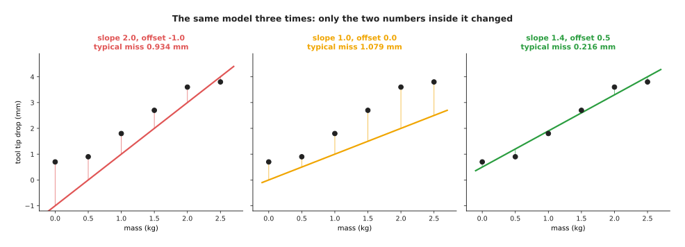

With slope 2.0 and offset -1.0 the typical miss is 0.934 mm. With slope 1.0 and
offset 0.0 it is 1.079 mm. With slope 1.4 and offset 0.5 it is 0.216 mm.

That is the whole idea of a model. The formula stays where it is, the parameters
move, and good parameters are the difference between a useless answer and a useful
one. The number of parameters is the main thing that separates the sag model from
the models later in this book. The chart below counts the parameters in four
models. Its vertical axis is a log scale, which means that each step up the axis
multiplies the count by ten rather than adding to it.

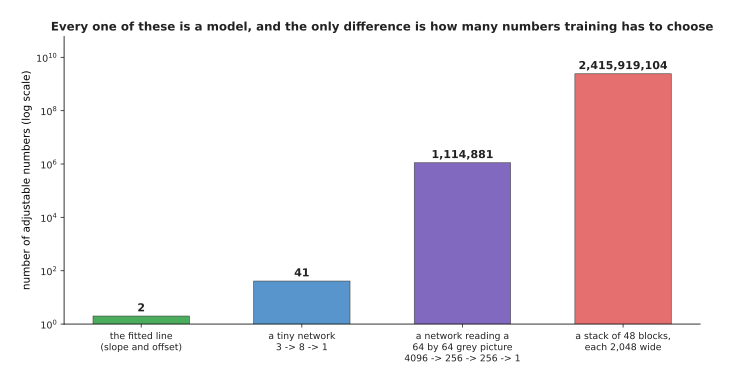

A fitted line has 2 parameters. A tiny network that takes 3 inputs through 8
neurons to 1 output has 41. A network that reads a 64 by 64 grey picture through
two layers of 256 neurons has 1,114,881. A stack of 48 blocks, each 2,048 numbers
wide, has 2,415,919,104.

Those four counts were all worked out from the shapes of the layers, which
[the shape of the numbers](../02_inside-a-network/03_the-shape-of-the-numbers.md)
explains. The point here is only that every one of those four is a model in exactly
the sense defined above, and that nothing changes about the idea between 2
parameters and two and a half billion.

A **weight** is a parameter that multiplies one of the inputs, and its size says how
much that input counts towards the answer. The sag model's slope is a weight,
because it multiplies the mass. The cup model that is used throughout this page has
three weights, one for each measured number. The chart below shows those three
weights. A bar to the right means that the number pushes the answer towards "full",
and a bar to the left means that it pushes the answer towards "empty".

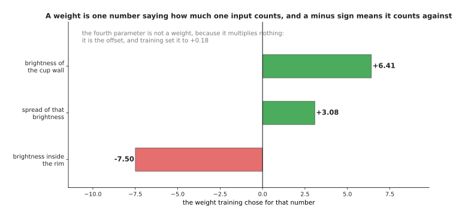

Training gave the brightness inside the rim a weight of -7.50, the spread of that
brightness a weight of +3.08, and the brightness of the cup wall a weight of +6.41.
So the first weight and the third weight work against each other.

Nobody told the model to subtract the wall brightness from the inside brightness.
The page before showed that a person had to think for an afternoon to find that
trick. Here the first and third weights came out with opposite signs and almost the
same size, which is that same subtraction, found by searching. The model's fourth
parameter is not a weight, because it multiplies nothing and is simply added at the
end. [One neuron](../02_inside-a-network/01_one-neuron.md) calls that fourth
parameter the bias, and this page calls it the offset.

A parameter count is also a file size, because every parameter has to be stored.
The chart below shows what each of the four models costs to store. There are three
bars for each model, because a number can be stored in four bytes, in two bytes or
in one byte, and fewer bytes means less exact.

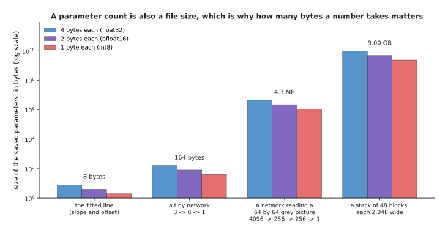

At four bytes each, the fitted line takes 8 bytes, the tiny network 164 bytes, the
picture network 4.3 MB and the 48-block stack 9.00 GB. At one byte each, those last
two fall to 1.1 MB and 2.25 GB.

Nine gigabytes will not fit in the memory of a small computer bolted to a robot
arm. That is why the number of bytes per parameter is a decision that anybody
running a large model has to make.
[Making a model smaller and faster](../07_pretraining-and-adapting/04_making-a-model-smaller-and-faster.md)
is about that decision. The model and its parameters now have names, so the next
question is how the parameters got their values.

---

## 2. Training and inference, the two things you do with a model

Section 1 said that fitting chose the values 1.4 and 0.5. When the model is bigger
than two numbers, that search has its own name. **Training** is the process of
choosing the parameters. It works by repeatedly measuring how wrong the model's
answers are on the examples, and then moving every parameter a little in the
direction that makes that measurement smaller. One such move is a **step**, and
training is thousands or millions of steps.

The picture below shows the first 300 steps of training the sag model, with the two
parameters starting at 0. The left panel is how wrong the model is, and the right
panel lists the two parameters at five moments during the run.

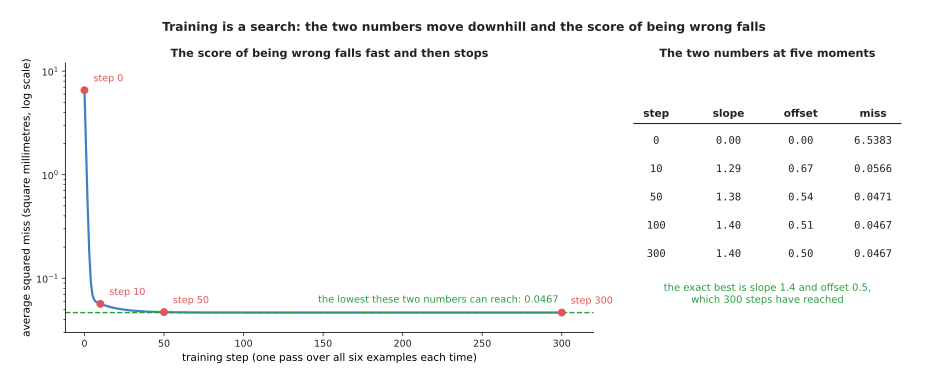

Starting both parameters at 0, the average squared miss falls from 6.5383 to 0.0566
in ten steps, and it reaches 0.0467 by step 100. Over the same five moments the
slope moves 0.0000, 1.2924, 1.3777, 1.3968, 1.4000, and the offset moves 0.0000,
0.6732, 0.5366, 0.5052, 0.5000.

The number that training makes small is the score of being wrong, which on this
page is the average squared miss from the page before. The page
[the score of being wrong](../03_how-training-works/01_the-score-of-being-wrong.md)
calls that number the loss. Notice that the training run above reached exactly the
slope and the offset that the page before worked out by hand. The arithmetic recipe
and the step-by-step search arrive at the same two numbers, and only the search
still works when there are a billion parameters instead of two.

The search is easier to picture when there are only two parameters, because then
every possible model is one point on a map. The picture below is that map. The
slope runs across the page, the offset runs up the page, and the colour at each
point is how wrong that pair of parameters is.

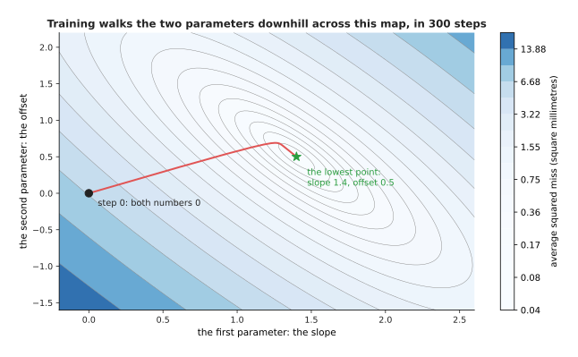

The run starts at slope 0.00 and offset 0.00, where the miss is 6.5383. It then
walks downhill to slope 1.4000 and offset 0.5000, where the miss is 0.0467.

[Gradient descent](../03_how-training-works/02_gradient-descent.md) is the page that
explains how each step knows which way is downhill. What matters here is that
training is a search over parameter values, that it happens once, and that it is
expensive.

Using a trained model is the other thing you do with it, and it has its own name
too. **Inference** means running the model forwards on one new input, with the
parameters held fixed, to get one answer. The word is confusing at first, because
nothing is being inferred in the everyday sense of that word, but it is what
everybody says. The picture below shows one inference on the sag model, for a mass
that nobody measured.

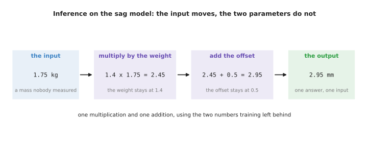

One answer from the sag model is one multiplication and one addition. The weight
stays at 1.4 and the offset stays at 0.5, because inference never changes a
parameter. Training is the opposite: it changes the parameters and leaves the
examples alone.

That difference also shows up in the amount of arithmetic. The chart below counts
multiplications and additions for both models and for both activities, again on a
log scale.

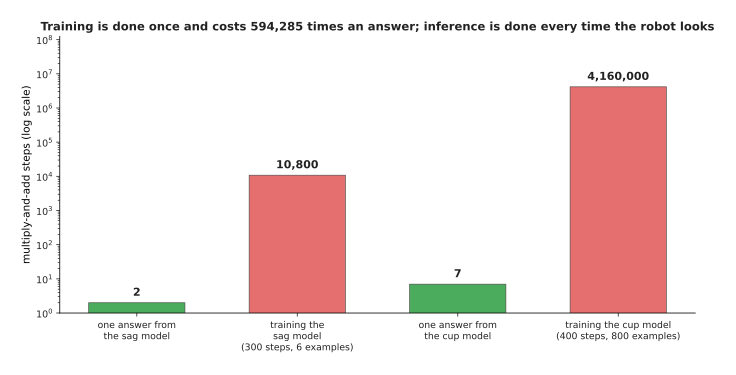

One answer from the sag model is 2 multiplications and additions, and training it
takes 10,800. One answer from the cup model is 7, and training it over 400 passes
through 800 examples takes 4,160,000, which is 594,285 times as much.

That ratio is why the two words are kept apart. Training is paid for once, in a
data centre, before anybody uses the model. Inference is paid for every single time
the robot looks at a cup, on whatever computer is bolted to the robot, and it has
to finish before the arm reaches the cup. The two have completely different
budgets, and
[running and evaluating a model](../14_using-a-model-for-real/01_running-and-evaluating-a-model.md)
is about the second of them. Both of them depend on the examples, which is the next
thing to name.

---

## 3. The dataset, and what generalisation means

The page before called a collection of examples a dataset, and the training in
section 2 used one. The thing that was not said there is that a model must never be
scored on the same examples that it trained on. The picture below shows the usual
arrangement, which is to divide the examples into two halves before training
starts.

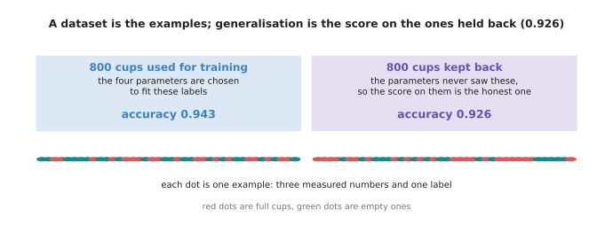

The cup dataset holds 1,600 simulated examples. Of those, 800 were used to choose
the four parameters and 800 were kept back and never shown to the training. The
model is right on 0.943 of the first half and on 0.926 of the second half.

**Generalisation** is how well a model does on inputs that it was never trained on.
It is the only score that means anything, because the robot will meet cups that
were not in the dataset. So the 0.926 is the honest number here and the 0.943 is
not, because the parameters were chosen to make the 0.943 as large as possible.

The gap between those two numbers is small for the cup model, and the reason is
that the cup model has only four parameters. Give a model more parameters and the
gap grows. That is the single most important fact about training, and the picture
below shows it. Each point on the horizontal axis is a curve with that many
parameters, fitted to the same ten examples.

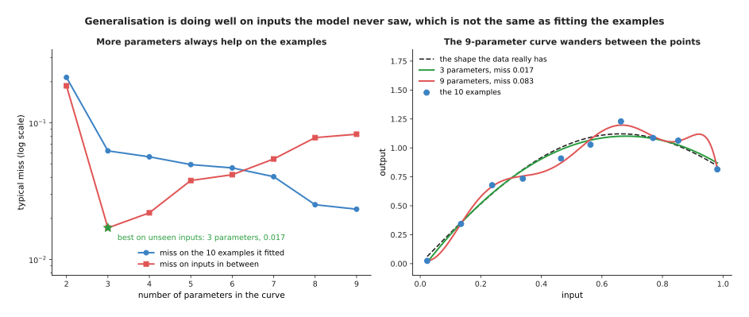

As the curves are given 2 up to 9 parameters, the miss on the ten examples falls
from 0.2153 to 0.0234 and never rises. The miss on inputs in between those examples
behaves differently. It falls to 0.0171 at 3 parameters, and then it climbs back up
to 0.0827 at 9 parameters.

The picture below shows what those numbers look like as curves. Both curves pass
through the same ten examples, and the dashed line is the shape that the data
really has.

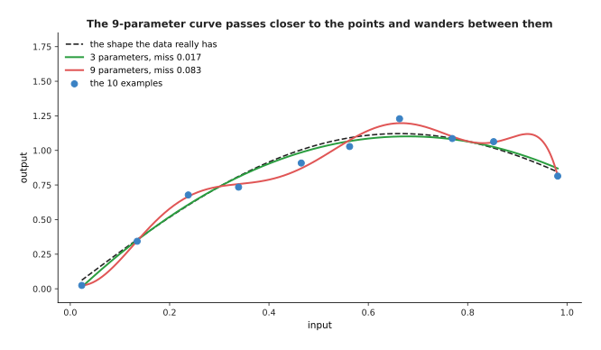

The 9-parameter curve is the better model by the only measurement it was given, and
it is the worse model by the measurement that matters. It passes very close to all
ten examples and then wanders between them, because it is chasing the wobble in the
labels instead of the shape underneath. That failure has a name,
[overfitting](../04_making-training-work/01_overfitting-and-generalisation.md), and
the whole of that page is about noticing it and preventing it.

The flexible model is not wrong to exist, because the same curve generalises
perfectly well once there are enough examples to pin its parameters down. The
picture below fits the same 8-parameter curve to datasets of different sizes. Both
axes are log scales.

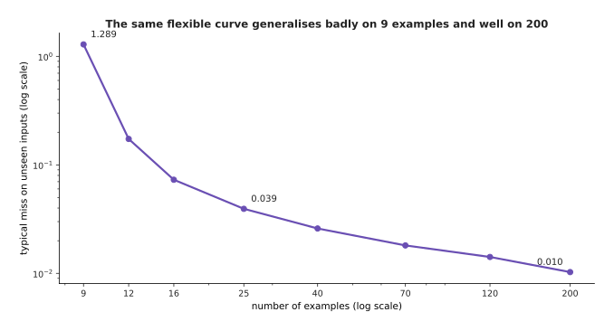

The same 8-parameter curve misses unseen inputs by 1.2893 when it is fitted to 9
examples, by 0.0393 at 25 examples and by 0.0103 at 200 examples, which is 126
times better than at the start.

That is why the number of parameters and the number of examples always have to be
talked about together. It is also why so much of this book is about where more
examples come from. Where they come from is the subject of the next section.

---

## 4. Three ways a model is told what is right

Section 3 assumed that somebody had written the right answer beside every example.
That is only one of the three arrangements in use. The three differ in who supplies
the right answer, not in the arithmetic, and all three are called learning.

**Supervised learning** is the arrangement used in the last two sections. Every
example carries a label, and a person or an instrument wrote that label down. It
gives the clearest training signal of the three, and its cost is the labelling. The
chart below turns that cost into hours of a person's time, on a log scale.

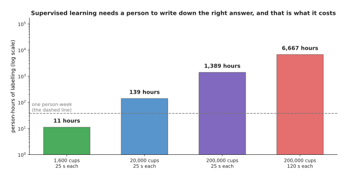

At 25 seconds a cup, labelling 1,600 cups takes 11 person-hours, 20,000 cups takes
139 and 200,000 cups takes 1,389. Some labels take much longer than 25 seconds. A
careful outline drawn round an object takes about 120 seconds, and at that rate
200,000 examples take 6,667 person-hours.

Those hours are the reason why the next arrangement exists. **Self-supervised
learning** hides part of the data and asks the model to produce the hidden part. So
the data supplies its own answers, and nobody writes a label at all. The picture
below does that with a recording of one joint angle.

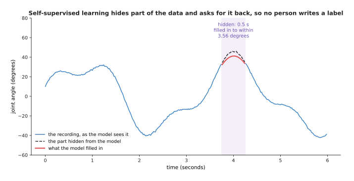

The recording holds 300 samples, and 25 of them were hidden, which is half a
second. The hidden stretch includes the moment when the joint stops and turns the
other way, so it is the hardest part to guess. Filling it in from the samples on
each side gives an answer that is out by 3.56 degrees on average and by 5.26
degrees at worst.

Nobody labelled the gap in that picture. The recording already contained the
answer, and the answer was simply covered up. This matters far more than it looks,
because it means that a model can be trained on data that nobody has annotated,
which is almost all the data there is.
[Self-supervised pretraining](../07_pretraining-and-adapting/01_self-supervised-pretraining.md)
shows that nearly every large model in use today was trained this way.

The third arrangement has no answers at all, only outcomes. **Reinforcement
learning** lets the model try something, scores whether the attempt worked, and
uses that score to change what it tries next. The picture below shows 400 simulated
attempts at a grasp, in blocks of twenty, and how often the attempts in each block
worked.

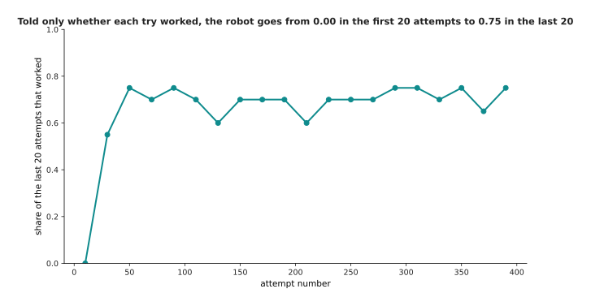

The share of attempts that worked rises from 0.00 in the first twenty attempts to
0.75 in the last twenty. Of the 400 attempts, 264 succeeded. The picture below
shows the same 400 attempts one at a time, with the height that each attempt tried
up the page, and the colour saying whether that attempt lifted the object.

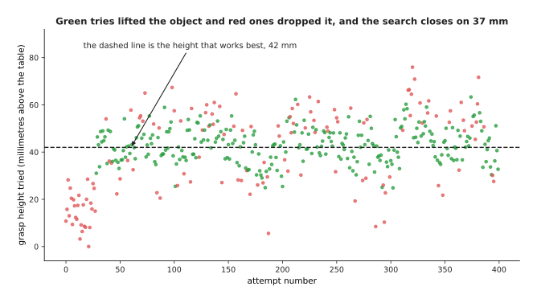

The best height for this simulated grasp is 42 millimetres above the table. The
search starts far below that, near 18 millimetres. Each time an attempt works, the
search moves its preferred height towards the height that just worked, and then it
tries again near the new preferred height. After 400 attempts it has settled on
37.4 millimetres.

Nobody ever told that search what the right height was. It found 37.4 millimetres
from nothing except 400 answers of the form "that worked" or "that did not work".
The cost is inside that sentence, because the 136 failures were real attempts on a
real arm, with a real object falling on the floor.
[Reinforcement learning](../11_learning-from-outcomes/01_reinforcement-learning.md)
goes through how the scores turn into better attempts, and why most of this happens
in simulation.

The three arrangements are easiest to compare by what a person has to supply. The
chart below counts exactly that, on a log scale, for the jobs on this page.

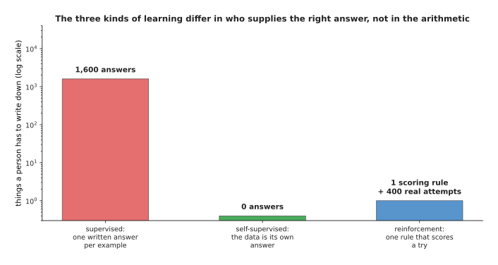

For the cup job, supervised learning needs 1,600 written answers. Self-supervised
learning needs none, because the hidden samples are the answer. Reinforcement
learning needs one written scoring rule, plus 400 attempts on the real arm.

Read that chart with care, because the shortest bar is not the cheapest method.
Writing the scoring rule for reinforcement learning is one line of work, and
getting that one line slightly wrong produces a robot that scores well while doing
something useless. The page
[rewards, preferences and verifiers](../11_learning-from-outcomes/02_rewards-preferences-and-verifiers.md)
is entirely about that problem. Self-supervised learning needs no labels, and in
exchange it needs enormous amounts of unlabelled data. The three are usually
combined rather than chosen between. The next section places all three inside the
four names that people give to this field as a whole.

---

## 5. Artificial intelligence, machine learning, deep learning and foundation models

The last four sections used four more words without defining them. They are the
four words that people outside the field use as if they meant the same thing. They
do not mean the same thing, because each one sits inside the one before it, as the
picture below shows.

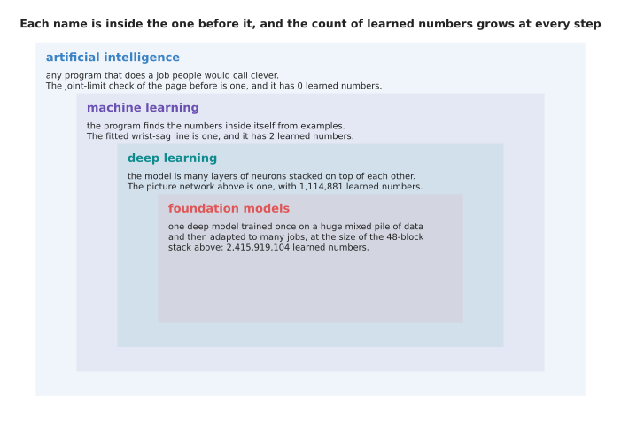

The joint-limit check from the page before sits in the outer rectangle and has 0
learned numbers. The fitted sag line sits in the second and has 2. The picture
network sits in the third and has 1,114,881. A 48-block stack sits in the innermost
and has 2,415,919,104.

**Artificial intelligence** is the outer rectangle. It is any program that does a
job which people would call clever. The joint-limit check is inside it, which shows
how wide the term is. The term is wide because it was named after the goal rather
than after any method. It appears in every headline and it carries almost no
information, so this book uses it as little as possible.

**Machine learning** is the second rectangle. It is the part of artificial
intelligence where the program finds the numbers inside itself from examples,
instead of being told them. Everything on the page before this one, from the six
measurements onwards, is machine learning, and so is the fitted line with its two
parameters. The boundary is exactly the one drawn on that page, between a rule that
somebody wrote and a formula that somebody fitted.

**Deep learning** is the third rectangle. It is the part of machine learning where
the model is made of many layers of neurons stacked on top of each other, so that
the output of one layer is the input of the next. The word deep means that there
are many such layers, and it means nothing more than that. The picture below shows
what those extra layers buy on one simulated job. Each point is a network of the
same width, with a different number of layers.

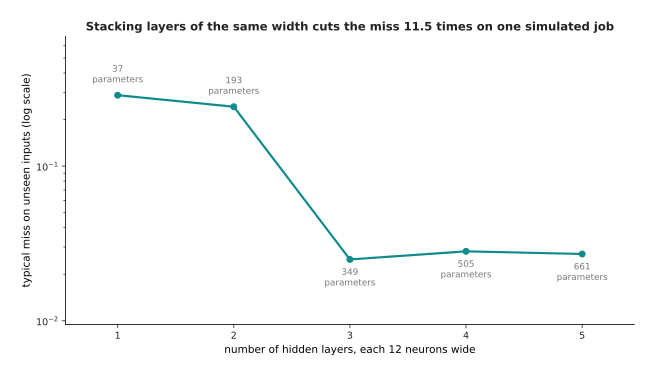

On this job, networks of 1 to 5 hidden layers of 12 neurons miss unseen inputs by
0.2873, 0.2420, 0.0249, 0.0281 and 0.0270. So three layers is 11.5 times better
than one layer, and it reaches that while holding 349 parameters against 37.

The picture below shows what those numbers mean. It draws the shape that the
networks were asked to match, and the shape that two of them actually produced.

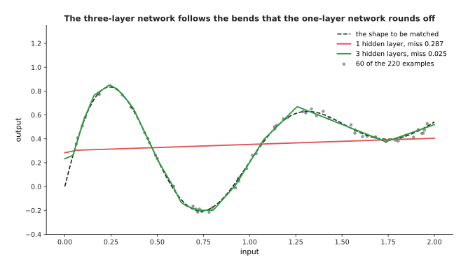

The one-layer network rounds off every bend in the target and ends up almost
straight. The three-layer network follows the bends.
[What a network can learn](../02_inside-a-network/04_what-a-network-can-learn.md)
explains why stacking layers has that effect, and
[layers and depth](../02_inside-a-network/02_layers-and-depth.md) explains what a
layer is. Almost every model that this book describes after chapter 2 is a deep
model, which is why deep learning and machine learning are so often confused with
each other.

A **foundation model** is the innermost rectangle. It is one large deep model,
trained once on a huge and mixed pile of data, and then adapted to many different
jobs instead of being built for one. The reason why anybody pays to train a model
with billions of parameters is that the cost is shared between those jobs. The
chart below shows the shared part beside the extra parameters that three different
jobs need, on a log scale.

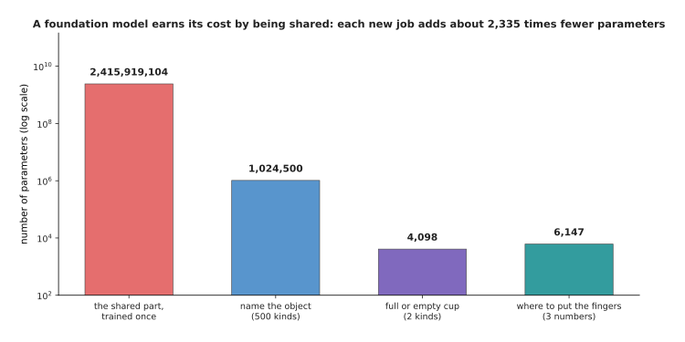

A shared 48-block stack holds 2,415,919,104 parameters. Adding a job that names one
of 500 objects costs 1,024,500 more parameters. Adding a job that tells a full cup
from an empty one costs 4,098, and adding a job that gives three finger positions
costs 6,147. All three of those together are 2,335 times smaller than the shared
part.

So the nesting is this. Every foundation model is a deep model. Every deep model is
a machine learning model. Every machine learning model is artificial intelligence.
None of those statements is true in the other direction.
[Fine-tuning and adapters](../07_pretraining-and-adapting/03_fine-tuning-and-adapters.md)
is the page about how a job is actually added to a shared model. All four names now
have a place, so the last section puts every word on this page onto one job at
once.

---

## 6. Every word on one job from start to finish

The cup job has appeared in every section above. This section runs through it once
from end to end and names each word as it arrives, so that the vocabulary forms one
connected story instead of a list. The picture below is the whole job in four
boxes, filled with that job's real numbers. Read it from left to right.

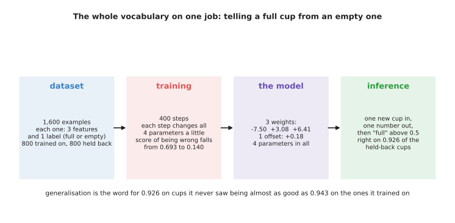

The dataset holds 1,600 examples, each with 3 features and 1 label, split into 800
for training and 800 held back. Training runs 400 steps and drops the score of
being wrong from 0.693 to 0.140. The model is 3 weights and 1 offset. Inference
turns one new cup into one number, and it is right on 0.926 of the held-back cups.

Here is the same thing in words. Somebody photographs 1,600 cups and writes beside
each photograph whether that cup is full. That makes 1,600 examples, and therefore
a dataset, and because a person wrote those answers it is supervised learning.
Three numbers are measured from each photograph, and those three numbers are the
features. Half of the examples are set aside and never shown to the training, so
that the score on them at the end is a measurement of generalisation. The model is
chosen to be three weights and one offset, which makes four parameters, and all
four start at zero. Training then runs 400 steps, and each step changes all four
parameters a little.

The picture below is that training run. The score of being wrong is on the vertical
axis, and the step number is on the horizontal axis.

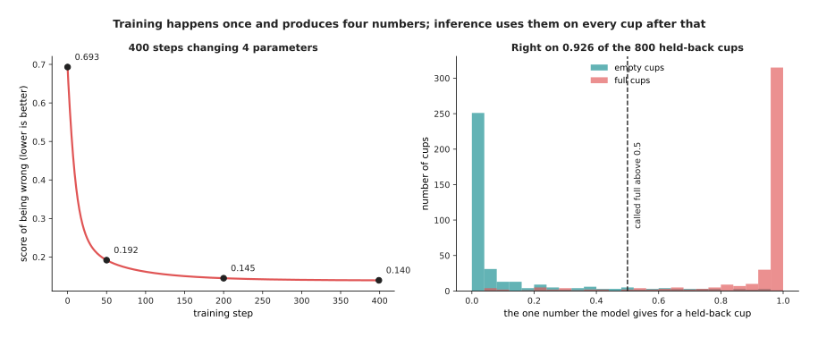

The score of being wrong is 0.693 at step 0, 0.192 at step 50, 0.145 at step 200
and 0.140 at the end. Training then stops, and the four numbers are finished.

After that, every held-back cup is put through the model once, which is inference
happening 800 times. Each cup goes in as three numbers and one number comes out.
The model calls the cup full when that number is above 0.5. The picture below
counts the 800 answers.

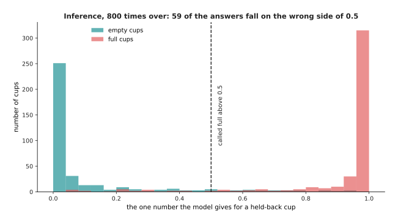

Most of the empty cups sit near 0 and most of the full cups sit near 1. The cups in
the middle are the hard ones. In total, 59 of the 800 answers fall on the wrong
side of 0.5, which leaves the model right on 0.926 of them.

The last thing to see is what separates training from inference. The difference is
simply whether the four numbers are allowed to move. The picture below plots all
four of them against the training step, and then carries them on into the shaded
region, which is the time after training.

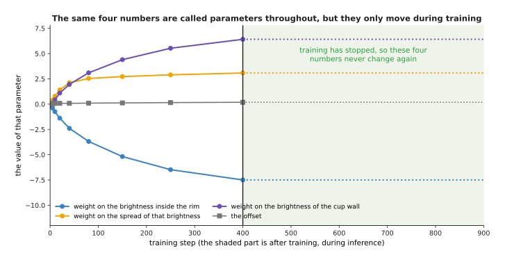

The three weights move from -0.080, +0.080 and -0.080 after one step to -7.497,
+3.081 and +6.414 after 400 steps. The offset moves from +0.080 to +0.183. After
that they never change again.

They are called parameters throughout, during training and afterwards. The only
difference is that training moves them and inference does not. Everything that
follows in this book is this same picture with more parameters in it. The next
chapter opens the model box and shows what is inside when the formula is not a
straight line but a network, starting with
[one neuron](../02_inside-a-network/01_one-neuron.md) worked out by hand.

---

## 7. Where to read next

- [One neuron](../02_inside-a-network/01_one-neuron.md) is the next page, and it
  replaces this page's four-parameter formula with the smallest piece of a neural
  network, worked out with real numbers.
- [Gradient descent](../03_how-training-works/02_gradient-descent.md) explains how
  each of section 2's steps knows which way to move every parameter.
- [Overfitting and generalisation](../04_making-training-work/01_overfitting-and-generalisation.md)
  takes section 3 much further, including how to split a dataset honestly and what
  to do when the gap between the two scores opens up.
- [Self-supervised pretraining](../07_pretraining-and-adapting/01_self-supervised-pretraining.md)
  shows how section 4's second arrangement became the way almost every large model
  is trained.
- [Reinforcement learning](../11_learning-from-outcomes/01_reinforcement-learning.md)
  is the full version of section 4's third arrangement, with the words for states,
  actions and rewards.
- [Learning signals](../../07_learned-models/01_what-models-are/04_learning-signals.md)
  is the catalogue entry for section 4, and lists which real robot models are
  trained in which of the three ways.

---

## 8. Using it in Python

The cup model used all through this page is small enough to build in one screen of
NumPy, which is the array library that most Python numerical work is built on. The
code below makes the same 1,600 simulated cups, fits four parameters to half of
them, and scores itself on the other half. The comments say which section each line
belongs to.

```python
import numpy as np

rng = np.random.default_rng(31)                                 # section 3: the dataset
n = 1600
full = rng.integers(0, 2, n).astype(float)                      # the label of each example
base = rng.uniform(90, 180, n) * rng.uniform(0.8, 1.2, n)       # cup colour times lighting
inside = base + np.where(full > 0.5, -18.0, 4.0) + rng.normal(0, 8, n)   # feature 1
spread = np.where(full > 0.5, 9.0, 4.0) + rng.normal(0, 2.2, n)          # feature 2
wall = base + rng.normal(0, 6, n)                                       # feature 3

X = np.column_stack([inside, spread, wall, np.ones(n)])   # section 1: 3 weights + 1 offset
train, test = slice(0, 800), slice(800, 1600)             # section 3: the split

w, *_ = np.linalg.lstsq(X[train], full[train], rcond=None)   # section 2: training
print(np.round(w, 4))                  # [-0.0166  0.0704  0.0159  0.0476]
print(X.shape, w.size)                 # (1600, 4) 4

seen = float(((X[train] @ w > 0.5) == (full[train] > 0.5)).mean())
unseen = float(((X[test] @ w > 0.5) == (full[test] > 0.5)).mean())
print(round(seen, 3), round(unseen, 3))   # 0.941 0.93    section 3: generalisation

one = X[test][0]                                             # section 2: inference
print(round(float(one @ w), 3), bool(one @ w > 0.5))         # 0.776 True
```

The library does two things here. First, it gives you arrays, so that
`X[train] @ w` works out all 800 answers in one expression rather than in a loop.
Second, it gives you `np.linalg.lstsq`, which finds the four parameters that make
the total squared miss as small as possible. That one call replaces the whole
training run of section 2, and it is exact rather than step by step. That is
possible only because this model is a weighted sum of its inputs. Every model later
in this book needs the step-by-step search instead, and for those the library you
reach for is PyTorch, where the same four parameters would be an `nn.Linear(3, 1)`
layer.

What the library will not decide is the shape of the problem. You choose the three
features. You choose to put a column of ones into `X`, so that the model has an
offset. You choose where to split the dataset. You choose 0.5 as the point above
which a cup is called full. Moving that last number trades one kind of mistake for
the other, because a lower threshold calls more cups full, so it catches more of
the full cups and it also calls some empty ones full by mistake.

Notice also that the printed scores are 0.941 on the half that was trained on and
0.930 on the half that was not. Those are the two numbers that section 3 said must
always be reported together. The exact fit here and the step-by-step fit used for
the diagrams reach slightly different parameters and nearly the same scores. That
is the ordinary situation rather than a problem. Two training methods that reach
the same quality of answer are both correct, and you pick between them on cost
rather than on the answer.
