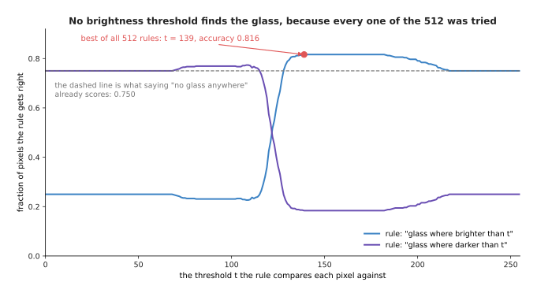
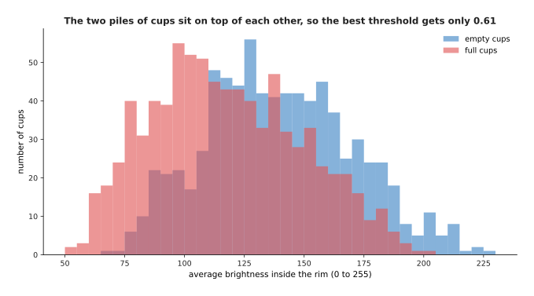
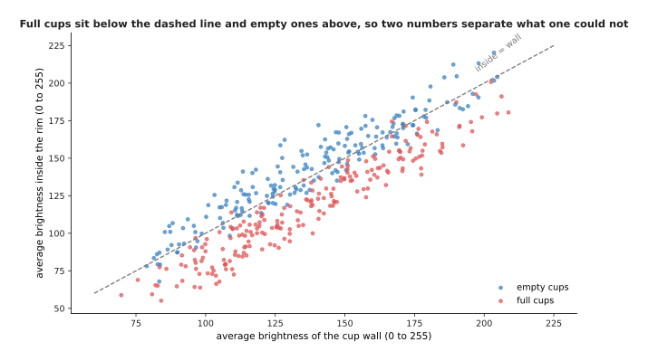
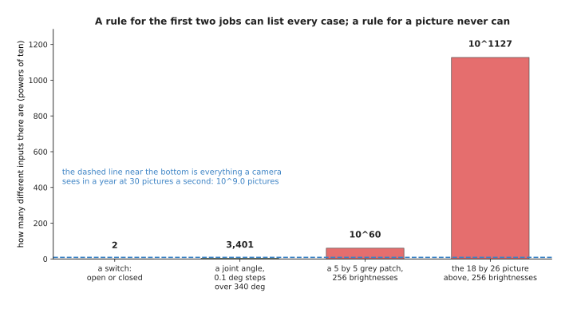
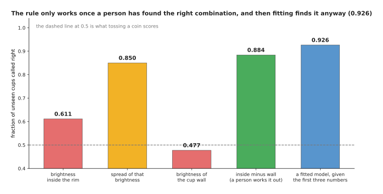
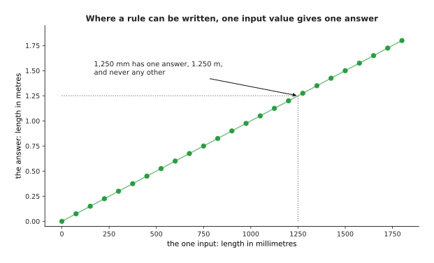
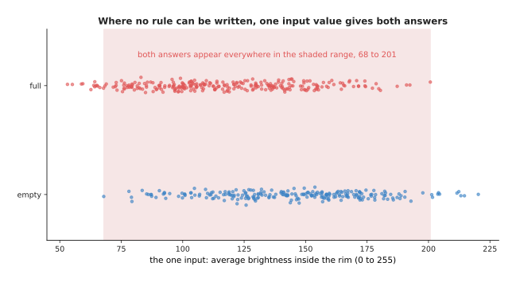

# Where rules stop working

The page before this one, [how rules do the work](01_how-rules-do-the-work.md),
counted how many times a gripper closes and said what made that rule writable: a
person knew the right answer for every possible input, and that knowledge was short
enough to type.

This page takes two more jobs in the same robot cell, on the same afternoon, with
the same camera. Neither sounds harder than counting switch closures. For neither
of them does any written rule work, and the second half of the page says exactly
why not.

The reason, stated once here so that the evidence is easier to follow: **a rule can
only work when the thing you measure decides the answer.** For these two jobs it
does not. The same measurement happens with both answers, so there is no value you
could pick that separates them, and the failure is not that nobody has found the
right rule yet. It is that no rule of that shape exists.

By the end you will be able to look at a job and tell which of the two kinds it is,
which is the question the rest of this book answers.

## Contents

1. [Two jobs nobody can write the rule for](#1-two-jobs-nobody-can-write-the-rule-for)
2. [What exactly separates the two kinds](#2-what-exactly-separates-the-two-kinds)
3. [Where to read next](#3-where-to-read-next)

---

## 1. Two jobs nobody can write the rule for

Both jobs below are real jobs in this robot cell. For neither of them does any
rule that anybody has written work.

### Deciding which pixels belong to a glass

A **pixel** is one small square of a picture. In a grey picture each pixel is one
number, from 0 for black to 255 for white. So the obvious rule is to pick a
brightness value and say that every pixel brighter than that value belongs to the
glass. That value is called the **threshold**.

The picture below shows the same scene three times. The left panel is the picture
the camera gives. The middle panel marks the pixels a person says are glass. The
right panel marks the pixels the best possible threshold rule picks.

The glass is see-through. So the table behind the glass has nearly the same
brightness as the glass in front of it, and the rule cannot separate them. The only
parts of the glass clearly brighter than the table are the two edges down its sides
and its top rim, and those are the only parts the rule finds.

That picture has 18 rows of 26 pixels, which is 468 pixels, and 117 of them are
glass. The best threshold rule gets 0.816 of the pixels right, which sounds
acceptable until you notice that a program saying "there is no glass anywhere"
already gets 0.750 right, because most of the picture is table. The rule also
misses 86 of the 117 glass pixels.

Perhaps a better threshold exists somewhere. The picture below is the result of
trying every one of them. The horizontal axis is the threshold and the vertical
axis is the fraction of pixels the rule gets right, with one curve for "glass where
brighter than the threshold" and one for "glass where darker".

A grey pixel has 256 possible brightness values and the rule can run in two
directions, so there are 512 rules of this shape in total. Every one was tried. The
best reaches 0.816, barely above the 0.750 that a program scores without looking at
the picture at all. **The failure is not that nobody has found the right threshold.
It is that no threshold is right.**

### Telling a full cup from an empty one

The camera looks down into a cup. Coffee is darker than china, so the obvious rule
is that a full cup is darker inside the rim than an empty one.

The picture below counts cups. The horizontal axis is the average brightness inside
the rim, and the height of each bar is how many cups had that brightness. The two
colours are the full cups and the empty cups.

Across 1,600 simulated cups the full ones average 117.7 brightness inside the rim
and the empty ones average 139.6. That difference is in the right direction.
However, the full ones run from 53 to 201 and the empty ones from 68 to 226, so the
two ranges cover almost the same values.

They overlap because every cup has its own colour and stands in its own lighting,
and those two things change the brightness much more than the coffee does. The best
threshold on that one number gets 0.659 of the cups right when the threshold is
chosen on those same cups, and 0.611 on cups it has not seen before. Tossing a coin
gets 0.5.

The answer is present in the data after all, but not in that one number. The
picture below plots the same cups twice over: the average brightness of the cup
wall across the page, and the average brightness inside the rim up the page.

The dashed line marks the cups where the inside and the wall have the same
brightness. Most full cups sit below that line, because coffee makes the inside
darker than the wall. Most empty cups sit above it. That line is already a rule,
and it is right on 0.819 of all 1,600 cups, far better than any threshold on the
inside brightness alone. The next section follows that fact further.

---

## 2. What exactly separates the two kinds

The introduction said the difference in one sentence: a rule works only when the
thing you measure decides the answer. This section is exact about it, in three
parts, because the rest of this book follows from them.

The first difference is how many different inputs there are. A switch has two
states. A joint angle recorded to a tenth of a degree over a range of 340 degrees
has 3,401 states. For both of those, a person could write a table with one line per
state. A picture cannot be handled that way, as the picture below shows. Its
vertical axis counts powers of ten, so each step up the axis means ten times as
many inputs.

A patch of 5 pixels by 5 pixels has about 10^60 possible contents. The 18 by 26
picture of the glass has about 10^1127 of them. A camera running at 30 pictures a
second for a whole year sees only about 10^9 pictures, which is the dashed line
near the bottom of the chart.

So a rule for a picture can never be a table of cases, because there are far more
cases than anybody could ever collect. The rule has to be a short formula, and that
formula has to give an answer for inputs that nobody has ever seen. This brings us
to the second difference. For the counting job on the page before, such a formula
exists and somebody knows it. For the glass job and the cup job it does not.

That claim is easier to believe when you watch a person try to build such a
formula. The cup job gives three numbers that a camera can measure. They are the
average brightness inside the rim, the spread of that brightness, and the average
brightness of the cup wall. The spread is how far the individual pixel values lie
from their own average, so a cup with both bright and dark places inside it has a
large spread. A person can pick a threshold on any one of those three numbers.
After some thought, a person can also work out that subtracting the wall brightness
from the inside brightness cancels the cup's own colour and its lighting, because
both of those affect the two numbers equally.

The chart below compares five ways of answering. The first four are thresholds on a
single measured number, and the fifth is a model that was given the first three
numbers and found its own combination of them. Every bar is measured on cups that
were not used to choose the rule.

The best threshold on the brightness inside the rim gets 0.611 of unseen cups
right. The best threshold on the spread gets 0.850. The best threshold on the wall
brightness gets 0.477, which is worse than tossing a coin. The best threshold on
the inside brightness minus the wall brightness gets 0.884. A model fitted to the
first three numbers reaches 0.926, and nobody told that model about the
subtraction.

Read that chart as a person who is getting steadily better at the job. The first
threshold barely beats a coin. The second is better, and it is better by luck,
because nobody expected the spread to matter. The third is useless on its own. The
fourth is good only because a person spent an afternoon working out that the cup's
own colour has to be cancelled. The fifth bar is higher than all of them, and it
comes from giving the first three numbers to a program that searches for the
combination by itself.

The third difference is the reason for the other two. Where a rule works, one input
value has exactly one right answer. Where no rule works, the same input value
happens with both answers. The two pictures below show those two situations, one
picture each. The first is the millimetre job named on the page before, drawn with the input
across the page and the answer up the page.

Every input value in that picture meets the line at exactly one place. An input of
1,250 millimetres gives 1.250 metres, and it never gives anything else. The second
picture is the cup job, drawn the same way, with the measured brightness across the
page and the answer up the page. Each dot is one cup, and the dots are spread a
little up and down so that they do not hide each other.

Full cups and empty cups share the brightness range from 68 to 201. That range
holds 0.963 of all 1,600 cups. So for almost any brightness that you could measure,
both answers are possible, and the measurement does not decide the answer.

Once you see that, the situation is clear. Writing a rule means stating the answer
for every input. You can only state the answer when you know it, and for these jobs
nobody knows it, because what you measure does not fix the answer on its own. What
you have instead is examples, which means pictures that somebody has looked at and
written the answer beside. The next section turns examples into a program, at the
smallest size where that is possible.

---

---

## 3. Where to read next

[What a model is](03_what-a-model-is.md) builds the alternative at its smallest
size: it fits a formula to six measurements using nothing more than a calculator,
and names every part of what it just did.

[Rules against models](04_rules-against-models.md) then puts the two side by side
and says which jobs on a robot arm each one wins.
