# What a model is

The page before this one, [where rules stop working](02_where-rules-stop-working.md),
showed two jobs that no written rule can do, and said why: the thing you measure
does not decide the answer.

For those jobs you still have something to work with. You have **examples**, which
are measurements with the right answer written beside them. Somebody looked at a
hundred cups and wrote "full" or "empty" next to each one. The method that turns
examples into a program is called **fitting**, and what it produces is called a
**model**.

This page explains both, starting at the smallest size where either makes sense: a
formula with two numbers in it, fitted to six measurements, with arithmetic you can
check on a calculator. After that it names the parts — model, parameter, weight,
training, inference, dataset — and ends with the one thing that decides whether a
model is any use, which is whether it works on examples it has never seen.

It is for a reader who has read the two pages before this one and nothing else.

## Contents

1. [Fitting a straight line to six measurements](#1-fitting-a-straight-line-to-six-measurements)
2. [The words for the pieces of a fitted job](#2-the-words-for-the-pieces-of-a-fitted-job)
3. [The model and the numbers inside it](#3-the-model-and-the-numbers-inside-it)
4. [Training and inference, the two things you do with a model](#4-training-and-inference-the-two-things-you-do-with-a-model)
5. [The dataset, and what generalisation means](#5-the-dataset-and-what-generalisation-means)
6. [Where to read next](#6-where-to-read-next)
7. [Using it in Python](#7-using-it-in-python)

---

## 1. Fitting a straight line to six measurements

The method is called **fitting**. To fit a formula means to choose the numbers
inside it so that its answers come as close as possible to the answers in your
examples. This section fits a formula using six measurements, a formula that holds
two numbers, and nothing that you could not do on a calculator.

The job is a real one on an arm. When you hang a mass on the wrist, the arm bends a
little under the weight, so the tool tip sits lower than the controller thinks
it does. This bending is called sag. Nobody knows the exact stiffness of this arm. So
somebody hangs six different masses on it and measures, with a height gauge, how
far the tip drops each time. These are the six pairs that they wrote down, and the
numbers were chosen so that the arithmetic later comes out in round figures: 0.0 kg
gives 0.7 mm, 0.5 kg gives 0.9 mm, 1.0 kg gives 1.8 mm, 1.5 kg gives 2.7 mm, 2.0 kg
gives 3.6 mm and 2.5 kg gives 3.8 mm.

Before fitting anything, somebody also writes an obvious rule by hand. That rule is
one millimetre of droop for each kilogram, and a rule like that is often what a real
program contains. The picture below shows the six measurements, that
hand-written rule as a dashed line, and the fitted line.


The fitted line is sag = 1.4 x mass + 0.5. It misses the six measurements by +0.2,
-0.3, -0.1, +0.1, +0.3 and -0.2 millimetres. The hand-written rule misses them by
+0.7, +0.4, +0.8, +1.2, +1.6 and +1.3 millimetres.

The fitted line holds two numbers. The first is the slope, which says how many
millimetres of droop each kilogram causes. The second is the offset, which says how
low the tip already sits when nothing is hanging on it. Nobody chose 1.4 and 0.5.
They came out of the six measurements by the arithmetic drawn below. Read that
table one row at a time, from left to right: the first two columns are the
measurement, and the next four columns are the working.

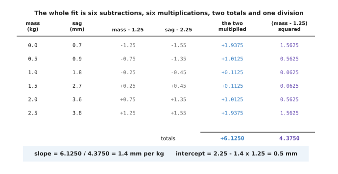

The whole fit is six subtractions, six multiplications, two totals and one
division, and you can check every line of it by hand.

Here is the same working in words. The average mass is 1.25 kg and the average sag
is 2.25 mm. Each row subtracts those two averages from its own pair of numbers. The
fifth column multiplies the two differences together. The sixth column squares the
first difference. The two totals are 6.1250 and 4.3750. The slope is the first
total divided by the second total, which is exactly 1.4. The offset is the average
sag minus the slope times the average mass, which is 2.25 - 1.4 x 1.25 = 0.5.

That recipe does not pick the slope at random. It picks the slope that makes the
total of the squared misses as small as it can be. The picture below shows that, by
trying every slope in turn and drawing the total each slope produces.

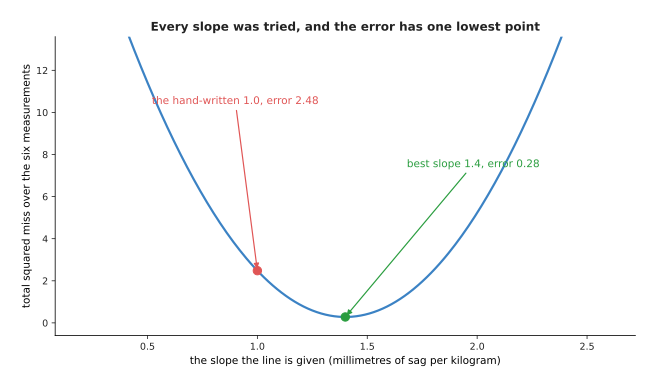

Every slope between 0.2 and 2.6 was tried, with the offset held at 0.5. The total
squared miss has one lowest point, which is 0.28 at a slope of 1.4. At the
hand-written slope of 1.0 the total is 2.48.

The recipe adds the squares of the misses rather than the misses themselves, and
there are two reasons for that. The first reason is that a miss above the line and
a miss below the line would cancel each other out. The picture below shows a line
that is clearly poor, with its six misses written beside it.

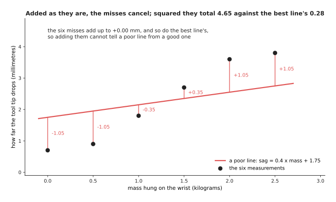

Each miss is the measured sag minus what the line says. Three of these misses are
negative and three are positive, and together they add up to 0.00 millimetres. The
best line's six misses also add up to 0.00 millimetres. So a score made by adding
the misses as they are cannot tell a poor line from the best one. Squaring removes
the minus signs, and after squaring the poor line totals 4.655 while the best line
totals 0.280.

The second reason is that squaring makes one large miss cost much more than several
small ones. The picture below shows what a single miss adds to the total, for
misses of different sizes.

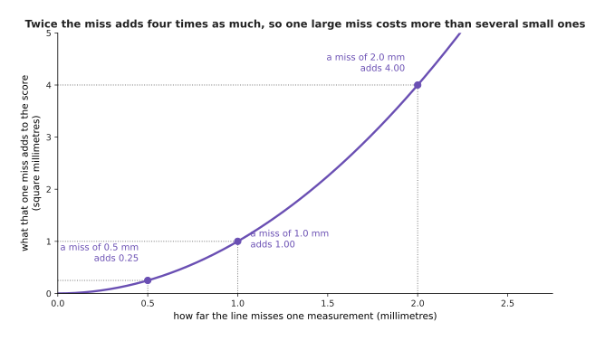

A miss of 0.5 millimetres adds 0.25 to the total. A miss of 1.0 millimetre adds
1.00, and a miss of 2.0 millimetres adds 4.00. So doubling a miss multiplies what
it costs by four. Because of that, fitting prefers a line that misses every
measurement by a little over a line that passes through most of them and is far
away from one.

There is now a number that says how wrong an answer is, and there are three answers
to compare with it. The two charts below compare the same three answers twice. The
left chart uses the average squared miss, which is the score that the fit was
chosen to make small. The right chart takes the square root of that score, which
turns it back into millimetres that you can picture.

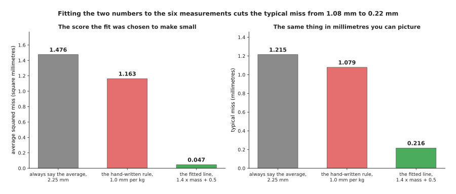

Always saying 2.25 mm has an average squared miss of 1.476. The hand-written rule
has 1.163 and the fitted line has 0.047. In millimetres those are typical misses of
1.215, 1.079 and 0.216.

So the fitted line misses five times less than the hand-written rule. It was
produced from six measurements and a page of arithmetic, and nobody had to know the
arm's stiffness or anything about its gearbox. That is the idea of this whole book,
at its smallest size.

---

## 2. The words for the pieces of a fitted job

The last section fitted a line without naming its parts. This section names them,
because the rest of the book uses these words on every page. All of the words
describe something in the same six-row table, which is drawn below. Read it as
three columns: the mass that was hung on the wrist, the drop that was measured, and
the drop that the fitted line says.

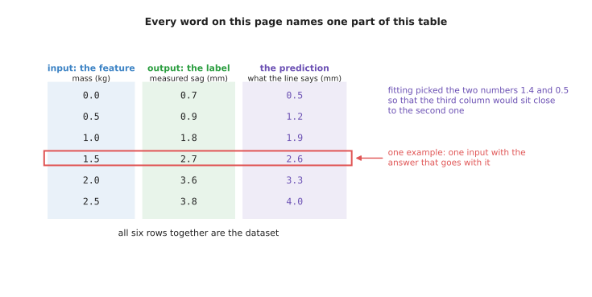

Every word in this section names one part of that table, and the ringed row at
1.5 kg is one example.

An **input** is what the program is given, and an **output** is what the program is
asked to produce. Here the input is the mass and the output is the drop in
millimetres. A **feature** is one number that makes up an input, and it is chosen
because the answer depends on it. Here there is one feature, which is the mass. The
cup job has three features, and a camera picture has one feature per
pixel. A **label** is the right output for one input, written down by whoever
collected the data. So the labels here are the six readings from the height gauge.

An **example** is one input together with its label. The ringed row, which is 1.5 kg
with 2.7 mm, is one example. A **dataset** is a collection of examples, so the whole
six-row table is a dataset. A **prediction** is what the model says the output is,
which is the third column of the table. The difference between a prediction and a
label is the miss that fitting works to make small.

That difference matters most for inputs that were never in the dataset, because
those inputs are the reason for building the model at all. The picture below shows
five such inputs. The squares are what the line predicts at five new masses, and
the diamonds are what somebody measured later at those same masses.

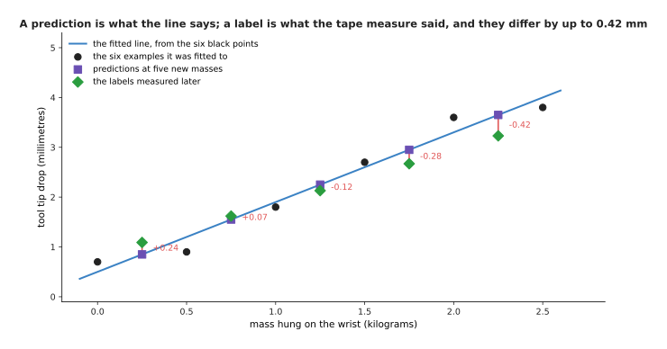

At 0.25, 0.75, 1.25, 1.75 and 2.25 kilograms the line predicts 0.850, 1.550, 2.250,
2.950 and 3.650 millimetres. Measuring later gives 1.09, 1.62, 2.13, 2.67 and 3.23
millimetres. So the misses run from +0.24 millimetres at the lightest mass to -0.42
millimetres at the heaviest.

Those five measurements are simulated. The typical miss on them is 0.258 mm. On the
six measurements that the line was fitted to, the typical miss is 0.216 mm. The
first number is worse than the second, and it should be worse, because the line was
never shown those five masses. So remember the difference between the two words. A
prediction is what the model produces for any input you give it. A label is what a
person or an instrument produced for one input that actually happened. Keeping
those two apart is most of what it takes to read an honest claim about a model.

A feature is not simply any number that you happen to have. The answer has to
depend on it, and the only way to find out whether the answer depends on it is to
look. The picture below looks at two candidate features for the sag job. Both
panels show the same 60 loads and the same drop up the page, and only the number
across the page changes.

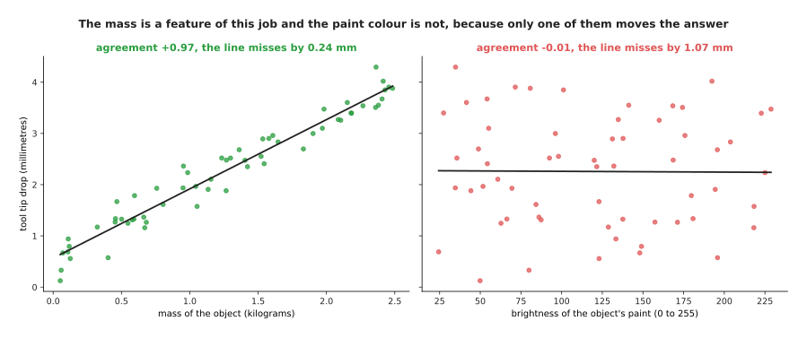

Across 60 simulated loads, drop and mass agree at +0.97, and a line through them
misses by 0.24 millimetres. Drop and paint colour agree at -0.01, and the best line
through them misses by 1.07 millimetres.

That agreement number is called the correlation, and it runs from -1 to +1. A value
of +1 means that the two numbers always rise together. A value of 0 means that
knowing one of them tells you nothing about the other. So the mass is a feature of
this job and the paint colour is not. Nothing about the two columns of numbers says
which is which until you fit a line to each of them.

The last thing to say about a label is that it is a measurement, and measurements
wobble. To wobble here means that measuring the same thing twice gives two
slightly different numbers. The picture below shows what happens when the same
mass is measured twelve times.

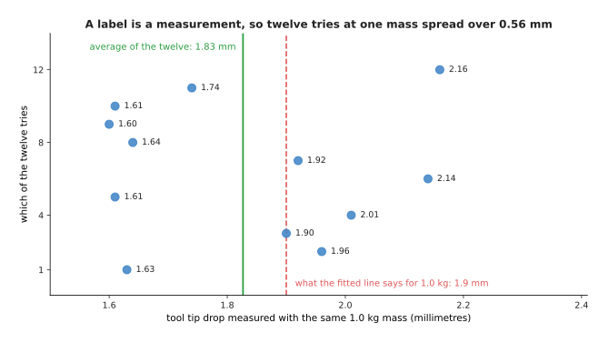

Twelve tries at the same mass give readings from 1.60 to 2.16 millimetres. They
average 1.83, and they are spread by 0.213 millimetres. The fitted line says
1.9 millimetres.

So the fitted line is not failing when it misses a label by two tenths of a
millimetre. That amount is inside the wobble of the instrument that produced the
label. No better method takes a model below that wobble, because the label itself does
not know the answer any better. Section 5 is about the rest of the
costs.

---

## 3. The model and the numbers inside it

Section 1 fitted the formula sag = 1.4 x mass + 0.5, and that formula has a name. A **model** is a formula with adjustable numbers inside it, together with the
particular values that those numbers have been given. So the shape of the formula
is fixed by whoever built it, and the numbers in it are what fitting chose.

Each adjustable number is a **parameter**, and the sag model has two of them. The
picture below shows the same model three times. Nothing changes between the three
panels except the two parameters.

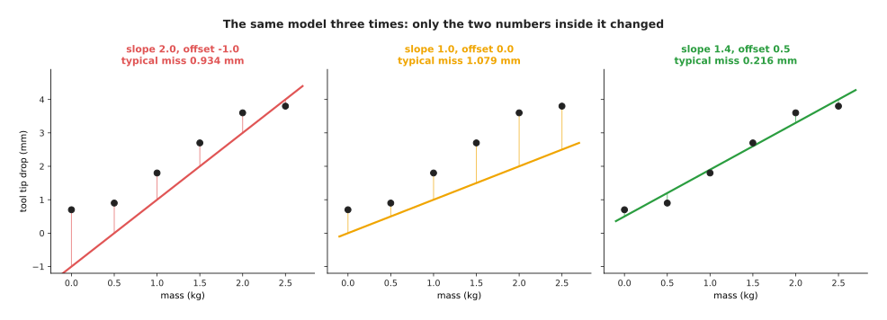

With slope 2.0 and offset -1.0 the typical miss is 0.934 mm. With slope 1.0 and
offset 0.0 it is 1.079 mm. With slope 1.4 and offset 0.5 it is 0.216 mm.

That is the whole idea of a model. The formula stays where it is, the parameters
move, and good parameters are the difference between a useless answer and a useful
one. The number of parameters is the main thing that separates the sag model from the
models later in this book. A fitted line has 2. A network that reads a 64 by 64
grey picture has over a million. A large model has billions. Nothing about the idea
changes across that range, and
[the shape of the numbers](../02_inside-a-network/03_the-shape-of-the-numbers.md)
works out where each of those counts comes from, layer by layer, and what each one
costs to store.

A **weight** is a parameter that multiplies one of the inputs, and its size says how
much that input counts towards the answer. The sag model's slope is a weight,
because it multiplies the mass. The cup model from the page before has
three weights, one for each measured number. The chart below shows those three
weights. A bar to the right means that the number pushes the answer towards "full",
and a bar to the left means that it pushes the answer towards "empty".

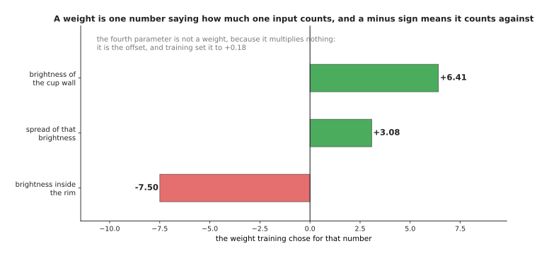

Training gave the brightness inside the rim a weight of -7.50, the spread of that
brightness a weight of +3.08, and the brightness of the cup wall a weight of +6.41.
So the first weight and the third weight work against each other.

Nobody told the model to subtract the wall brightness from the inside brightness.
The page before showed that a person had to think for an afternoon to find that
trick. Here the first and third weights came out with opposite signs and almost the
same size, which is that same subtraction, found by searching. The model's fourth
parameter is not a weight, because it multiplies nothing and is simply added at the
end. [One neuron](../02_inside-a-network/01_one-neuron.md) calls that fourth
parameter the bias, and this page calls it the offset.

The model and its parameters now have names, so the next question is how the
parameters got their values.

---

## 4. Training and inference, the two things you do with a model

Section 1 said that fitting chose the values 1.4 and 0.5. When the model is bigger
than two numbers, that search has its own name. **Training** is the process of
choosing the parameters. It works by repeatedly measuring how wrong the model's
answers are on the examples, and then moving every parameter a little in the
direction that makes that measurement smaller. One such move is a **step**, and
training is thousands or millions of steps.

The picture below shows the first 300 steps of training the sag model, with the two
parameters starting at 0. The left panel is how wrong the model is, and the right
panel lists the two parameters at five moments during the run.

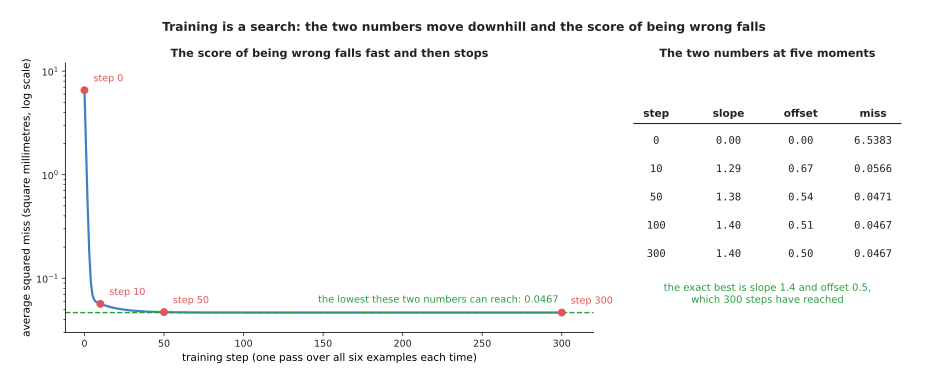

Starting both parameters at 0, the average squared miss falls from 6.5383 to 0.0566
in ten steps, and it reaches 0.0467 by step 100. Over the same five moments the
slope moves 0.0000, 1.2924, 1.3777, 1.3968, 1.4000, and the offset moves 0.0000,
0.6732, 0.5366, 0.5052, 0.5000.

The number that training makes small is the score of being wrong, which on this
page is the average squared miss from section 1. The page
[the score of being wrong](../03_how-training-works/01_the-score-of-being-wrong.md)
calls that number the loss. Notice that the training run above reached exactly the
slope and the offset that section 1 worked out by hand. The arithmetic recipe
and the step-by-step search arrive at the same two numbers, and only the search
still works when there are a billion parameters instead of two.

The search is easier to picture when there are only two parameters, because then
every possible model is one point on a map. The picture below is that map. The
slope runs across the page, the offset runs up the page, and the colour at each
point is how wrong that pair of parameters is.

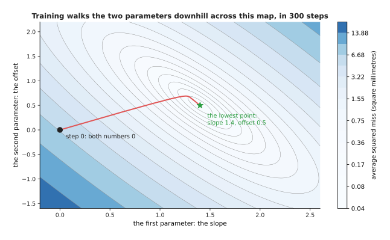

The run starts at slope 0.00 and offset 0.00, where the miss is 6.5383. It then
walks downhill to slope 1.4000 and offset 0.5000, where the miss is 0.0467.

[Gradient descent](../03_how-training-works/02_gradient-descent.md) is the page that
explains how each step knows which way is downhill. What matters here is that
training is a search over parameter values, that it happens once, and that it is
expensive.

Using a trained model is the other thing you do with it, and it has its own name
too. **Inference** means running the model forwards on one new input, with the
parameters held fixed, to get one answer. The word is confusing at first, because
nothing is being inferred in the everyday sense of that word, but it is what
everybody says. The picture below shows one inference on the sag model, for a mass
that nobody measured.

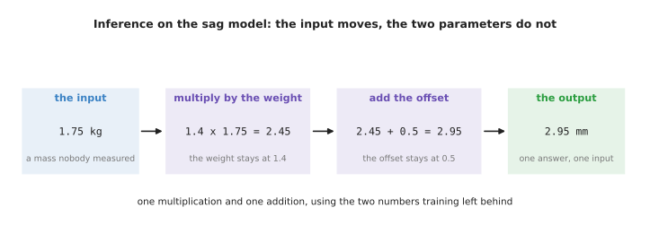

One answer from the sag model is one multiplication and one addition. The weight
stays at 1.4 and the offset stays at 0.5, because inference never changes a
parameter. Training is the opposite: it changes the parameters and leaves the
examples alone.

That difference also shows up in the amount of arithmetic. One answer is a handful
of multiplications and additions. A training run repeats that work once for every
example, and then does the whole thing again for every pass over the data, so it
costs hundreds of thousands of times more.
[Why the hardware is built for this one operation](../02_inside-a-network/03_the-shape-of-the-numbers.md)
counts both, with the arithmetic written out.

That ratio is why the two words are kept apart. Training is paid for once, in a
data centre, before anybody uses the model. Inference is paid for every single time
the robot looks at a cup, on whatever computer is bolted to the robot, and it has
to finish before the arm reaches the cup. The two have completely different
budgets, and
[running and evaluating a model](../14_using-a-model-for-real/01_running-and-evaluating-a-model.md)
is about the second of them. Both of them depend on the examples, which is the next
thing to name.

---
## 5. The dataset, and what generalisation means

Section 2 called a collection of examples a dataset, and the training in section 4
used one. The thing that was not said there is that a model must never be
scored on the same examples that it trained on. The picture below shows the usual
arrangement, which is to divide the examples into two halves before training
starts.

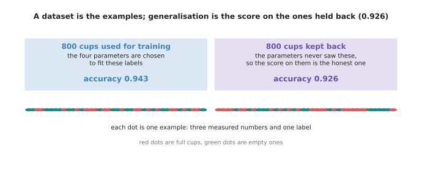

The cup dataset holds 1,600 simulated examples. Of those, 800 were used to choose
the four parameters and 800 were kept back and never shown to the training. The
model is right on 0.943 of the first half and on 0.926 of the second half.

**Generalisation** is how well a model does on inputs that it was never trained on.
It is the only score that means anything, because the robot will meet cups that
were not in the dataset. So the 0.926 is the honest number here and the 0.943 is
not, because the parameters were chosen to make the 0.943 as large as possible.

The gap between those two numbers is small for the cup model, and the reason is
that the cup model has only four parameters. Give a model more parameters and the
gap grows. That is the single most important fact about training, and the picture
below shows it. Each point on the horizontal axis is a curve with that many
parameters, fitted to the same ten examples.

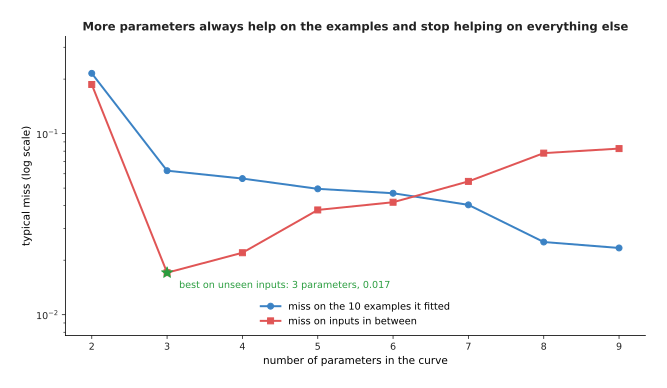

As the curves are given 2 up to 9 parameters, the miss on the ten examples falls
from 0.2153 to 0.0234 and never rises. The miss on inputs in between those examples
behaves differently. It falls to 0.0171 at 3 parameters, and then it climbs back up
to 0.0827 at 9 parameters.

The picture below shows what those numbers look like as curves. Both curves pass
through the same ten examples, and the dashed line is the shape that the data
really has.

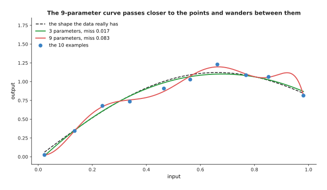

The 9-parameter curve is the better model by the only measurement it was given, and
it is the worse model by the measurement that matters. It passes very close to all
ten examples and then wanders between them, because it is chasing the wobble in the
labels instead of the shape underneath. That failure has a name,
[overfitting](../04_making-training-work/01_overfitting-and-generalisation.md), and
the whole of that page is about noticing it and preventing it.

The flexible model is not wrong to exist, because the same curve generalises
perfectly well once there are enough examples to pin its parameters down. The
picture below fits the same 8-parameter curve to datasets of different sizes. Both
axes are log scales.

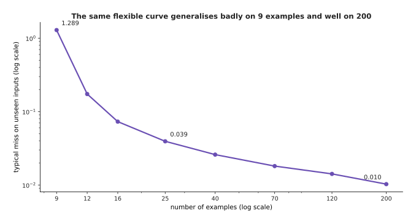

The same 8-parameter curve misses unseen inputs by 1.2893 when it is fitted to 9
examples, by 0.0393 at 25 examples and by 0.0103 at 200 examples, which is 126
times better than at the start.

That is why the number of parameters and the number of examples always have to be
talked about together. It is also why so much of this book is about where more
examples come from. [Rules against models](04_rules-against-models.md) is where
that trade is priced.

---

---

## 6. Where to read next

[Rules against models](04_rules-against-models.md) puts the two ways of building a
program side by side and says which jobs on a robot arm each one wins.

[One neuron](../02_inside-a-network/01_one-neuron.md) opens a model up and works
out, with real numbers, what the smallest piece inside it does. The straight line
fitted on this page is that piece with its decision rule removed.

[The shape of the numbers](../02_inside-a-network/03_the-shape-of-the-numbers.md)
counts the parameters of a real network layer by layer, and turns those counts into
bytes and into arithmetic.

---

## 7. Using it in Python

Section 1 worked the fit out by hand, and nobody does that by hand more than once.
The code below does the same fit with NumPy, which is the array library that most
Python numerical work is built on. It prints the numbers that this page quoted.

```python
import numpy as np

mass = np.array([0.0, 0.5, 1.0, 1.5, 2.0, 2.5])   # section 5: the feature of each example
sag = np.array([0.7, 0.9, 1.8, 2.7, 3.6, 3.8])    # section 5: the label of each example

slope, offset = np.polyfit(mass, sag, 1)          # section 4: the fitting itself
print(f"sag = {slope:.2f} * mass + {offset:.2f}") # sag = 1.40 * mass + 0.50

prediction = slope * mass + offset                # section 5: the six predictions
print(np.round(prediction, 2))                    # [0.5 1.2 1.9 2.6 3.3 4. ]
print(np.round(sag - prediction, 2))              # [ 0.2 -0.3 -0.1  0.1  0.3 -0.2]

fitted = float(np.mean((prediction - sag) ** 2))
by_hand = float(np.mean((1.0 * mass - sag) ** 2)) # section 4: the hand-written rule
print(round(by_hand, 4), round(fitted, 4))        # 1.1633 0.0467
print(round(by_hand ** 0.5, 3), round(fitted ** 0.5, 3))   # 1.079 0.216

print(round(float(slope * 1.75 + offset), 3))     # 2.95, a mass nobody measured
print(round(float(slope * 6.0 + offset), 3))      # 8.9, and section 6 says do not trust it
```

The one line that does the work is `np.polyfit(mass, sag, 1)`, where the `1` asks
for a straight line rather than a curve. That call performs the six subtractions,
the six multiplications, the two totals and the division from section 4. It uses a
method that stays accurate when there are thousands of examples and dozens of
features. The library also gives you the array arithmetic underneath, so
`slope * mass + offset` works out all six predictions at once rather than in a
loop.

What the library will not do is choose the problem. You decide which numbers are
the features, which number is the label, and what shape of formula to fit. Those
three decisions carry far more of the result than the choice of library does.
Asking for a `1` fits a line. Asking for a `5` fits a bending curve that passes
much closer to the six points and is much worse at the masses in between, which is
the subject of the generalisation section on the next page.

The library will also not tell you when you have left the range that your data
covered. The last line prints 8.9 millimetres for a six kilogram load, when section
6 showed that the true answer is about 5.2 millimetres. No warning appears, no
exception is raised, and the number looks as confident as the others. Checking that
the input you are about to predict on resembles the inputs you fitted on stays your
job, for every model in this book including the very large ones.
