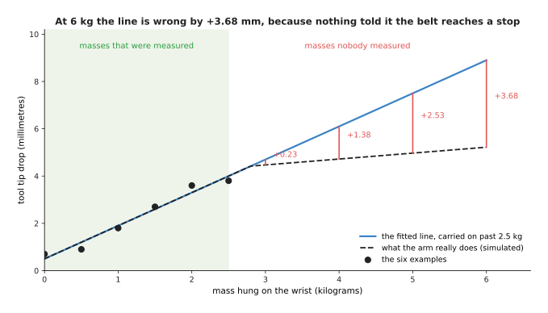
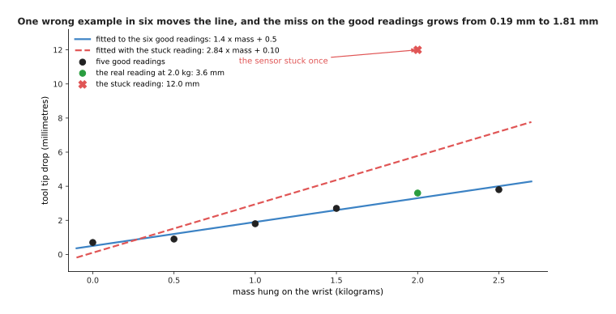

# Rules against models

The three pages before this one showed a job a rule does well, two jobs no rule can
do, and how fitting turns examples into a program. A reader could come away with
the impression that models are the modern answer and rules are what came before.
That impression is wrong, and this page is here to correct it.

**A written rule beats a fitted model whenever a rule is possible at all.** It
needs no data, it costs nothing to run, it is exact outside the range anybody
tested, and when it is wrong you can read it and see why. A model gives up every
one of those. So the question is never which is better in general. The question is
whether a rule is possible for the job in front of you, and if it is, you write it.

This page gives the three things fitting costs you, measured on the arm; then it
puts the two approaches against each other on a real job from later in this
library, where the same table of glasses was solved both ways and scored by the
same examiner; and it ends with what that measurement does and does not settle.

It is for a reader who has read [what a model is](03_what-a-model-is.md).

## Contents

1. [What fitting costs you](#1-what-fitting-costs-you)
2. [The same job done both ways](#2-the-same-job-done-both-ways)
3. [What that comparison settles](#3-what-that-comparison-settles)
4. [Where to read next](#4-where-to-read-next)

---

## 1. What fitting costs you

Fitting bought a line five times better than a hand-written rule, from six
measurements and no knowledge of the arm. This section describes the three things
that it took in exchange, because a method is only worth knowing when you also know
where it fails.

The first cost is that a fitted model can only be trusted over the range of inputs
that it was fitted on. The six measurements covered 0 to 2.5 kilograms, and nothing
in the arithmetic knows that the arm behaves differently above that. The picture
below carries the line on to 6 kilograms and compares it with what the simulated
arm really does.

At 3 kilograms the line is wrong by +0.23 millimetres. At 4 kilograms it is wrong
by +1.38, at 5 kilograms by +2.53 and at 6 kilograms by +3.68. The reason is that a
belt inside the simulated arm reaches a stop at 2.8 kilograms, so the sag stops
growing as fast.

A rule written by a person who understands the arm would have that stop in it. A
fitted line will never have it, unless somebody hangs a four kilogram mass on the
wrist and measures. That is not a fault in the fitting. It is a statement that a
model knows what its examples knew, and nothing else, which is why so much of this
book is about where the data comes from.

The second cost is that you need examples, and you need more of them than feels
reasonable. The picture below shows how the miss on unseen masses falls as the
number of examples grows. The horizontal axis is drawn on a log scale, which means
that each step along it multiplies the number of examples instead of adding to it.

The script repeated the whole experiment 200 times at each size, with fresh
simulated measurements each time, and averaged the results. With 3 examples the
typical miss is 0.640 millimetres. With 20 examples it is 0.231, and with 160
examples it is 0.221, which is as low as the 0.22 spread of the measurements
allows.

So going from 3 examples to 20 cuts the miss by nearly three times, while going
from 20 to 160 is worth almost nothing. The reason is that the line holds only two
numbers, and twenty examples are already enough to decide both of them. A model
with millions of numbers does not stop improving so soon, which is why the models
later in this book are trained on far more data.

The third cost is that fitting believes its examples completely. The picture below
changes one of the six readings to a wrong value and fits the line again.

Changing one reading from 3.6 to 12.0 millimetres moves the line from 1.4 x mass +
0.5 to 2.84 x mass + 0.10. On the five readings that are still good, the typical
miss grows from 0.195 to 1.809 millimetres.

One wrong reading in six, and the line is wrong everywhere. Nothing in the
arithmetic can tell a wrong label from a right one, because the arithmetic only
sees numbers. A hand-written rule behaves in the opposite way. It ignores the data
completely, so bad data cannot hurt it and good data cannot help it either.

That is the honest trade. A written rule is exact, you can check it without taking
any measurements, and it stays correct outside the range that you tested. However,
you can only have a written rule when somebody knows the rule. A fitted model needs
no such knowledge, and it finds relationships that a person would never guess. In
exchange, it is only as good as its examples, it can only be trusted over the range
that those examples covered, and it is wrong without any warning when they are
wrong.
---

## 2. The same job done both ways

The trade above was argued on a straight line with two numbers in it. It is fair to
ask whether it still holds at full size, and this library happens to contain the
measurement. [Seeing the glasses](../../08_seeing-the-glasses/02_the-problem/01_what-is-asked-for.md)
sets one job — find every drinking glass on a table and say which pixels belong to
each one — and solves it six ways. One of the six is a page of written arithmetic
with nothing fitted. The other five are learned models. The same examiner scores
all six on the same arrangements, so the numbers below compare like with like.

The job comes in two difficulties. In the first, a layout rule keeps the glasses
apart. In the second, they stand closer together than that rule allows, so glasses
hide parts of each other. Read each row as one method, and each column as one thing
the examiner counted, per 100 glasses put on the table.

| method | found, glasses apart | found, glasses crowded | reports that merged two glasses into one |
| --- | --- | --- | --- |
| written rules, nothing fitted | 100.0 | 73.0 | 10.7 |
| a network trained from scratch here | 64.1 | 74.6 | 0.6 |
| a borrowed detector, fine-tuned here | 99.4 | 72.0 | 0.8 |
| a borrowed segmenter, fine-tuned here | 96.4 | 81.9 | 1.4 |

**Where the glasses stand apart, the written rules win outright.** They find every
glass, 100 in every 100. The best learned method finds 99.4 and the one trained
from scratch finds 64.1. The rules also need no training data, no graphics card and
no fitting run, and when they refuse a glass they can print the number they refused
it on.

**Where the glasses crowd together, the rules fall behind.** They find 73.0 against
the best model's 81.9, and the manner of the failure matters more than the gap: the
rules merged two glasses into one report 10.7 times per 100 glasses, where every
learned method stayed below 1.5. A merge is the dangerous answer here, because the
arm is then told there is one wide glass where two narrow ones stand.

So the same job, with the same equipment, changes hands depending on how hard the
arrangement is. Nothing about the methods changed between the two columns.

---

## 3. What that comparison settles

It settles less than it looks, and being clear about that is the point of this
section.

**It does settle that a rule is not a weaker kind of answer.** On the easier
arrangement the written rules were not merely competitive, they were the best
method in the table, and they were the cheapest by a wide margin. Any claim that
learning is simply the better technique has to explain that column.

**It does settle where rules break.** They broke when the input stopped being
separable by the quantities the rule measures, which is the same failure the cup
job showed at the small size. Crowding does not make the arithmetic harder. It
makes two glasses share the evidence that the rule reads.

**It does not settle which method to use on your job**, because four of those
numbers come from one cell, one camera and one kind of object. Measured over five
separate blocks of arrangements, three of the crowded figures sit close enough
together that the test does not separate them at all.

**And it does not tell you what the model cost.** Every learned row in that table
needed a training set, a fitting run and, for three of them, weights somebody else
had paid to produce. The rules row needed an afternoon. When two methods score the
same, that difference is the whole decision.

The practical rule that follows is short. Write the rule if you can. Measure it on
the hard cases, not the easy ones, because that is where it will fail. Reach for a
model when the measurement shows the rule failing, and expect to pay for the data.

---

## 4. Where to read next

Why the industry moved asks why, given all of the above, so much robotics work has
moved towards learned models in the last few years, and what actually changed to
cause it. That page is being written.

[The words everyone uses](06_the-words-everyone-uses.md) collects the terms this
chapter has introduced and the few it has not, each one tied to the same job.

[Seeing the glasses](../../08_seeing-the-glasses/02_the-problem/01_what-is-asked-for.md)
is the job the table above comes from, with all six methods built and scored.
