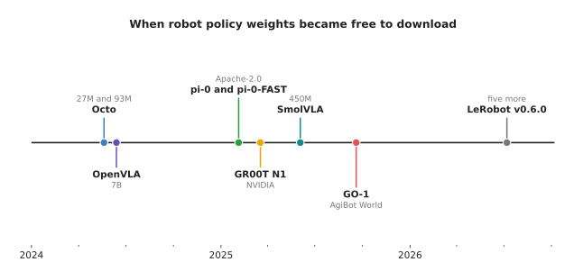
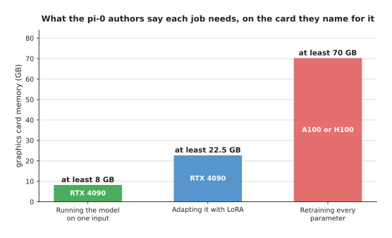
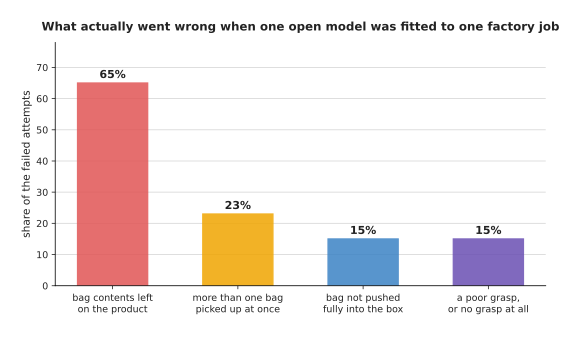

# Why the industry moved

Robot software used to be written. A person decided what the robot should do in
each situation, and then wrote that decision down as a rule in a program. Over
the last three years a large part of the field has stopped doing that for some
jobs, and has started training a model on recorded examples instead. This page
answers one question: what actually changed between 2023 and 2026 that made so
many teams switch, and how much of the switch is supported by measurements
rather than by advertising.

The page is for a developer who has met the words model, training, inference and
dataset, and who now has to decide what to build. It assumes no machine learning
background beyond those words. It is not a page of opinions. Every number in it
was copied from a document published outside this project, and the address of
that document is printed beside the number so that you can check it yourself.

The honest summary is that four things changed, and that none of them changed as
completely as the headlines say. Working models became free to download. Large
collections of recorded robot movements became free to download. The computer
needed to run one of those models got small enough to buy. And the work of
teaching a robot a new job turned from writing code into collecting recordings,
which is a change of shape and not a saving. The last two sections of the page
are about the places where writing rules is still the better choice, because a
page that argues only one side is of no use to somebody deciding what to build.

Every picture on this page is drawn by
[`docs/diagrams/why_the_industry_moved.py`](../../diagrams/why_the_industry_moved.py).
That script is unusual for this book. The other diagram scripts simulate data
and then measure it. This one measures nothing. It only redraws numbers taken
from outside sources, and each number carries the address of its source as a
comment directly above it.

## Contents

1. [The three kinds of evidence on this page](#1-the-three-kinds-of-evidence-on-this-page)
2. [The weights became free to download](#2-the-weights-became-free-to-download)
3. [The recordings became free to download](#3-the-recordings-became-free-to-download)
4. [The computer you need to run one got smaller](#4-the-computer-you-need-to-run-one-got-smaller)
5. [The written work did not disappear, it changed shape](#5-the-written-work-did-not-disappear-it-changed-shape)
6. [What somebody outside the laboratory measured](#6-what-somebody-outside-the-laboratory-measured)
7. [Where written rules still win](#7-where-written-rules-still-win)
8. [The short answer](#8-the-short-answer)
9. [Where to read next](#9-where-to-read-next)

---

## 1. The three kinds of evidence on this page

Before any number appears, it is worth separating three different things that
are easy to confuse. The rest of the page names which of the three it is using
every single time, because the three deserve very different amounts of trust.

The first kind is a **claim a group makes about its own system**. A company
writes a blog post saying that its robot folds laundry in a house it has never
seen. Nobody else ran that test, nobody else chose the houses, and nobody else
decided what counted as folded. Such a claim is not worthless, because the group
usually knows its own system best, but it is the weakest of the three.

The second kind is a **measurement made by somebody who did not build the
thing**. An academic group downloads a published model, runs it on a test suite
that the model's authors did not design, and reports what happened. This is
stronger, because the people reporting the number had no reason to want it to be
large.

The third kind is a **measurement this book made in its own test cell**. Book 8
of this library sets up one room with one arm, one camera and one table, and
scores six different ways of finding drinking glasses on it, including a
hand-written rule. Those numbers are the only ones in this library that the
library itself produced.

This particular page contains none of the third kind. It measures nothing. Every
number below is of the first or second kind, and the text says which. If you
want this book's own answer to the question of whether a trained model beats a
written rule, that answer lives in book 8 and not here, and the final section
points you at it.

---

## 2. The weights became free to download

The single biggest change is that you can now download a working robot policy
and run it. A **policy** is a model that takes what the robot can see, together
with an instruction in ordinary language, and produces the movements the robot
should make next. Before 2024 there was no such thing to download. The strong
models existed only inside the laboratories that built them.

The picture below marks each release of downloadable robot policy weights on a
time axis. Every date on it is the date printed by the publisher itself, so
every mark is a plain published fact rather than anybody's claim.

Here is what each of those marks is. Octo was published on 20 May 2024, and its
paper describes it as a transformer policy trained on 800,000 recorded robot
movements, which can be adapted to a new robot "within a few hours on standard
consumer GPUs"
([arxiv.org/abs/2405.12213](https://arxiv.org/abs/2405.12213)). OpenVLA followed
on 13 June 2024 with 7 billion parameters, trained on 970,000 real robot
demonstrations
([arxiv.org/abs/2406.09246](https://arxiv.org/abs/2406.09246)). Physical
Intelligence released the weights of its π0 and π0-FAST models on 4 February
2025, under the Apache 2.0 licence, which permits commercial use
([github.com/Physical-Intelligence/openpi](https://github.com/Physical-Intelligence/openpi)).
NVIDIA announced Isaac GR00T N1 on 18 March 2025 and put its training data and
evaluation scenarios on Hugging Face and GitHub
([investor.nvidia.com](https://investor.nvidia.com/news/press-release-details/2025/NVIDIA-Announces-Isaac-GR00T-N1--the-Worlds-First-Open-Humanoid-Robot-Foundation-Model--and-Simulation-Frameworks-to-Speed-Robot-Development/default.aspx)).
Hugging Face published SmolVLA, with 450 million parameters, on 3 June 2025
([huggingface.co/blog/smolvla](https://huggingface.co/blog/smolvla)). The AgiBot
World project released its GO-1 model on 19 September 2025
([github.com/OpenDriveLab/AgiBot-World](https://github.com/OpenDriveLab/AgiBot-World)).
The last mark is version 0.6.0 of the LeRobot toolkit, published on 7 July 2026,
which added open implementations of five more such models
([huggingface.co/blog/lerobot-release-v060](https://huggingface.co/blog/lerobot-release-v060)).

The term used for all of these is **vision-language-action model**, usually
shortened to VLA. The three words name the three things involved. Vision means
the model looks at camera pictures. Language means it reads an instruction
written as a sentence. Action means its output is a movement for the robot
rather than a description of the scene.

Now for the claims these groups make about their own models, which is the first
kind of evidence from section 1. The OpenVLA authors report that their model
beat a closed model called RT-2-X on 16.5 more tasks out of every 100, measured
over 29 tasks, while having seven times fewer parameters
([arxiv.org/abs/2406.09246](https://arxiv.org/abs/2406.09246)). The SmolVLA
authors report that their 450-million-parameter model scored 80.0 against 59.4
for an older method called action chunking with transformers, shortened to ACT,
on the LIBERO simulated benchmark, and 76.9
against 58.8 on a real robot arm
([huggingface.co/blog/smolvla](https://huggingface.co/blog/smolvla)). The AgiBot
World authors report a 30 percent average improvement over policies trained on
the older Open X-Embodiment collection
([arxiv.org/abs/2503.06669](https://arxiv.org/abs/2503.06669)). Every one of
those three numbers was produced by the group that built the model being
praised. Section 6 reports what happened when other people measured instead.

There is one important qualification to the whole of this section. The weights
that are open are not the newest ones. Physical Intelligence announced a model
called π\*0.6 on 18 November 2025, and its paper reports that on the hardest
tasks their method "more than doubles task throughput and roughly halves the
task failure rate"
([arxiv.org/abs/2511.14759](https://arxiv.org/abs/2511.14759)). That is a claim
of the first kind, and as of October 2026 those weights are not among the
checkpoints published in the openpi repository, which carries π0, π0-FAST and
π0.5
([github.com/Physical-Intelligence/openpi](https://github.com/Physical-Intelligence/openpi)).
So the pattern is that the previous generation becomes downloadable while the
current generation stays private.

---

## 3. The recordings became free to download

A policy is trained on recordings of a robot being moved through a job by a
person. One such recording, from the start of the job to the end, is called an
**episode** or a **trajectory**. The second change of the last three years is
that very large collections of episodes became public.

The picture below places four of those collections by the date they became
available and by how many episodes each one holds. The vertical axis is a log
scale, which means that each step up it multiplies the count by ten rather than
adding to it.

Open X-Embodiment, published on 13 October 2023, is the one that started this.
It did not record anything new. Instead it pooled recordings that 21 different
institutions had already collected, and it republished them in one format. The
paper reports more than 1 million trajectories, from 22 different robot designs,
covering 527 named skills
([arxiv.org/abs/2310.08864](https://arxiv.org/abs/2310.08864)). To see what that
replaced, look at the collection behind the RT-1 model from December 2022, which
holds "∼130k robot demonstrations, collected with a fleet of 13 robots over the
course of 17 months"
([arxiv.org/abs/2212.06817](https://arxiv.org/abs/2212.06817)). Seventeen months
of a thirteen-robot fleet is what one laboratory could afford. Pooling made that
effort reusable by everybody.

DROID, published on 19 March 2024, took the opposite approach and recorded
something new. Its paper reports 76,000 trajectories, which is 350 hours of
interaction, gathered across 564 different scenes and 86 tasks by 50 people over
12 months
([arxiv.org/abs/2403.12945](https://arxiv.org/abs/2403.12945)). The reason DROID
matters more than its size suggests is that the scenes are ordinary rooms rather
than one laboratory bench, and section 6 uses DROID as the robot that an
independent evaluation ran on.

AgiBot World is the largest. Its first release on 30 December 2024 held 92,214
trajectories, and the larger release on 1 March 2025 held about 1,000,000
trajectories across 217 tasks
([github.com/OpenDriveLab/AgiBot-World](https://github.com/OpenDriveLab/AgiBot-World)).
Read the licence before you plan around it. AgiBot World is published under
CC BY-NC-SA 4.0, and the NC in that name stands for non-commercial, so you may
study it but you may not ship a product trained on it. Open X-Embodiment and the
π0 weights carry no such restriction. "Open" is therefore not one condition but
several, and the difference decides whether a collection is useful to a company
or only to a university.

Two more sources of episodes are worth naming, because they are not in the
picture above and they changed the economics in a different way.

The first is ordinary people recording on cheap hardware. The SO-101 arm,
published by Hugging Face and The Robot Studio, costs $229.88 for the parts for
the two arms you need, or $121.94 for the parts for one, at the prices listed in
its own bill of materials
([github.com/TheRobotStudio/SO-ARM100](https://github.com/TheRobotStudio/SO-ARM100)).
You move one arm by hand and the other copies it, and the pair records what you
did. The SmolVLA model in section 2 was trained on 487 datasets that people had
uploaded from such arms, which came to roughly 10 million camera frames and
fewer than 30,000 episodes
([huggingface.co/blog/smolvla](https://huggingface.co/blog/smolvla)).

The second is simulation. NVIDIA states that it generated 780,000 synthetic
movements in 11 hours, and that recording the same amount by hand would have
taken about 6,500 hours, which is nine continuous months. It further states that
adding that synthetic data to real data improved its model's score by 40 percent
compared with real data alone
([investor.nvidia.com](https://investor.nvidia.com/news/press-release-details/2025/NVIDIA-Announces-Isaac-GR00T-N1--the-Worlds-First-Open-Humanoid-Robot-Foundation-Model--and-Simulation-Frameworks-to-Speed-Robot-Development/default.aspx)).
Both of those are claims NVIDIA makes about NVIDIA's own product, so treat them
as the first kind of evidence. No independent group has published a check of
them that this page could find.

---

## 4. The computer you need to run one got smaller

Downloadable weights are useless if you cannot afford the machine that runs
them. A **graphics processing unit**, usually shortened to GPU, is the chip that
does the arithmetic, and the amount of memory on that chip decides which jobs
you can do at all. The third change is that the memory needed fell to the size
of a card a person can buy.

The picture below shows the memory the π0 authors say each job needs, and names
the card they themselves suggest for it. The numbers are minimums rather than
exact requirements, which is why each bar is labelled "at least".

Those three figures come from the table in the openpi repository, read on
7 October 2026
([github.com/Physical-Intelligence/openpi](https://github.com/Physical-Intelligence/openpi)).
The middle bar is the interesting one. **LoRA** is short for low-rank
adaptation, and it is a way of adjusting a large model for a new job by training
a small set of extra numbers while leaving the original parameters untouched.
The point of the picture is the gap between the middle bar and the right-hand
bar. Adapting the model to your own robot fits on the same card as running it.
Retraining it from the beginning does not, and needs a data-centre chip.

The OpenVLA paper measured the same gap on its own model, and its numbers are
worth quoting because it also reports how well each option worked. Retraining
every parameter used 163.3 GB spread over two GPUs and succeeded on 69.7 percent
of its test. Using LoRA used 59.7 GB and succeeded on 68.2 percent. So the
cheaper option cost 1.5 success in every 100 attempts and saved more than
100 GB. The same paper reports the memory needed just to run the trained model:
16.8 GB when each parameter is stored in two bytes, and 7.0 GB when each
parameter is squeezed into four bits, with 71.3 and 71.9 percent success
respectively
([arxiv.org/abs/2406.09246](https://arxiv.org/abs/2406.09246)). Those are claims
the OpenVLA authors make about OpenVLA.

One caution about that squeezing, from the same table. The middle setting, one
byte per parameter, scored 58.1 percent, which is far worse than both the
setting above it and the setting below it. The authors used 10.2 GB for that
58.1 percent. So the relationship between how hard you squeeze a model and how
well it then works is not a smooth slope, and you have to measure each setting
rather than assume the pattern.

That is the cost of training and adapting. The cost of the computer bolted to
the robot fell too. NVIDIA reduced the price of its Jetson Orin Nano developer
kit from $499 to $249 on 17 December 2024, while raising it from 40 to 67
trillion operations per second on the measure NVIDIA quotes, and its memory
bandwidth from 68 to 102 GB per second
([developer.nvidia.com](https://developer.nvidia.com/blog/nvidia-jetson-orin-nano-developer-kit-gets-a-super-boost/)).
A price is a plain fact rather than a claim, although the performance figures
are NVIDIA's own measurement of NVIDIA's own chip.

The wider trend behind all of this is documented by Stanford University's AI
Index, which is an annual report from that university's Institute for
Human-Centered Artificial Intelligence. Its 2025 edition states that "the inference cost for a system performing at the level of
GPT-3.5 dropped over 280-fold between November 2022 and October 2024", and that
"at the hardware level, costs have declined by 30% annually, while energy
efficiency has improved by 40% each year"
([hai.stanford.edu](https://hai.stanford.edu/ai-index/2025-ai-index-report)).
Read that first figure carefully. It does not say that any one model got 280
times cheaper. It says that reaching one fixed level of ability got 280 times
cheaper, because smaller models caught up with what large models used to do. It
is also a measurement of language models and not of robots, so it is background
rather than direct evidence.

---

## 5. The written work did not disappear, it changed shape

A common argument for learned models is that one model replaces a program that
somebody had to write and keep working. The first half of that argument is well
supported. The second half, that the total work goes down, is not supported by
any measurement this page could find, and one published deployment suggests the
opposite.

The evidence worth looking at is a study published on 25 May 2026 by a team
working at a Siemens factory in Erlangen, Germany. The job was one single task.
A robot had to pick a transparent accessory bag out of a cluttered pile, put it
into the remaining space in a cardboard package, and make sure the bag stayed
below the line where the box closes. The team started from the published π0.5
model and adapted it
([arxiv.org/abs/2605.27461](https://arxiv.org/abs/2605.27461)).

Here is what the adaptation cost them, in their own figures. They first
collected about 900 episodes in a mock-up cell. They then collected 693 episodes
in a first round on the factory floor with the task made deliberately easier,
199 episodes in a second round with one of those restrictions lifted, and 1,401
episodes in a third round under full production conditions, plus 242 further
episodes aimed at specific failures. The total was 2,535 episodes, which they
describe as about 10 hours of recording. Their own rule for moving from one
round to the next was "at least 70% success during evaluation".

Nobody wrote a grasping rule in that project. Instead, people operated the robot
by hand 2,535 times, sorted the recordings, retrained the model five times and
evaluated it after each round. That is the honest shape of the change. The work
moved from a programmer writing conditions to a team recording, curating and
retraining. Whether that is cheaper depends entirely on what the task is, and
the study reports no comparison against a conventionally programmed pipeline, so
it cannot tell you.

What is genuinely cheaper is the first attempt. Octo's paper says it can be
adapted to a new robot "within a few hours on standard consumer GPUs"
([arxiv.org/abs/2405.12213](https://arxiv.org/abs/2405.12213)), and the ALOHA
paper from April 2023 reports learning six difficult tasks, including opening a
translucent condiment cup and slotting a battery, "with 80-90% success, with only
10 minutes worth of demonstrations"
([arxiv.org/abs/2304.13705](https://arxiv.org/abs/2304.13705)). Ten minutes of
demonstrating is less work than an afternoon of writing rules. The gap between
that and the Siemens figure of 10 hours is the gap between making something work
once and making it work every time on a production line.

---

## 6. What somebody outside the laboratory measured

Sections 2 to 5 reported mostly what the builders said about their own work.
This section reports what two groups measured without having built anything. It
is the strongest evidence on the page, and it is less flattering.

The first is RoboArena, published on 22 June 2025 and presented at the Conference
on Robot Learning. Seven academic institutions each ran published policies on
their own DROID robot in their own room, comparing two policies at a time. They
ran 612 such pairwise comparisons, made of 4,284 individual attempts, over seven
policies
([arxiv.org/abs/2506.18123](https://arxiv.org/abs/2506.18123)).

The result they report is about the measuring and not about the policies. Their
distributed scheme recovered the true ranking of the seven policies with a
correlation of 0.92, where the usual approach of testing everything in one
laboratory managed 0.68. Their rank-violation measure was 0.03 against 0.14. In
plain words, testing a policy in one room gives you a ranking that is partly
wrong, and you only find that out by testing in seven rooms. The paper also
notes, when discussing the risk that people start optimising for its score, that
"current limited policy performance" makes that risk small for now. That is the
authors of an evaluation telling you that the things they evaluated are not yet
very good.

The second is a suite called INT-ACT, published on 11 June 2025, which holds 50
tasks across 10 kinds of change. The authors took published models, including
π0, and scored them on the original tasks and then on variations of those tasks
([arxiv.org/abs/2506.09930](https://arxiv.org/abs/2506.09930)). The picture
below shows the row for the fine-tuned π0 model. The dashed line marks its score
on the original tasks, so that every other bar can be compared with it.

Read the whole chart rather than its worst bar. The model scores 30.4 out of 100
on the original tasks. Some changes barely hurt it, and swapping the object it
has to pick up actually raised the score to 49.3, which tells you that the
original tasks were not the easiest ones. Other changes hurt a lot. Changing
where the object must be put dropped it to 24.4. An instruction containing the
word "not" dropped it to 22.2. Combining a name the model has to reason about
with extra objects in the way dropped it to 10.6.

The authors describe the pattern in a way worth quoting, because it is the most
useful single sentence about these models that this page found. They write that
the models "achieve near-perfect Intention Correctness (80−100%) across all
categories" while "their Task Success Rates drop drastically". The model
understands what it is being asked to do. It then fails to do it.

The same paper contains one more result that disagrees with the story this page
is about. The authors compared the released π0 model, adapted to the
test robot, against the same design trained only on the test robot's own data
without the large general robot pretraining. The version without the general
pretraining scored higher on almost every category: 48.9 against 30.4 on the
original tasks, and 44.2 against 24.4 when the target changed. Note carefully
what this does and does not say. Both versions start from a pretrained
vision-language model. What the weaker version skipped was the pretraining on
the large mixed pile of robot recordings. On this suite, that pretraining made
things worse rather than better.

---

## 7. Where written rules still win

The honest position in October 2026 is that written rules have not lost, and
that a developer who writes them for the right job is not behind the times. Four
pieces of published evidence support that.

The first is the Siemens factory study from section 5. The picture below shows
what went wrong during their evaluation. Each bar is the share of the failed
attempts in which that particular fault appeared. One failed attempt can carry
more than one fault, which is why the four bars add up to more than 100.

Those four shares are the combined column of the paper's own failure table. The
authors' own verdict on the project is that the "final success rates of the
finetuned policy did not meet expectations"
([arxiv.org/abs/2605.27461](https://arxiv.org/abs/2605.27461)). Look at the
largest bar. Two thirds of the failures were the contents of the bag staying on
top of the product rather than going inside the box. That is a geometric
condition, and a geometric condition is exactly the kind of thing a written rule
states precisely and a trained model only approximates.

The second is that the people building these models say so themselves. The π0.5
paper, which reports a model that works in homes it has never seen, writes that
"π0.5 is not without its limitations. While our VLA exhibits broad
generalization, it still makes mistakes", and goes on to name unfamiliar drawer
handles and cupboards that are physically hard to open
([arxiv.org/abs/2504.16054](https://arxiv.org/abs/2504.16054)).

The third is that the independent measurements in section 6 are low in absolute
terms. A score of 30.4 successes in 100 attempts on the tasks a model was fitted
to is not a number any factory would accept. The Siemens team's own gate was
70 percent, and they treated reaching it as the condition for continuing rather
than as the finished result.

The fourth is the licensing and availability point from sections 2 and 3. The
largest single collection of recordings may not be used commercially, and the
strongest models are not released. So a company choosing between a written rule
and a downloaded model is often not comparing the written rule against the best
model that exists, but against the best model it is allowed to have.

None of that means the direction is wrong. The amount of money moving says the
opposite: Physical Intelligence raised $600 million on 25 November 2025 at a
valuation of about $5.6 billion, bringing its total to $1.1 billion
([therobotreport.com](https://www.therobotreport.com/physical-intelligence-raises-600m-advance-robot-foundation-models/)).
Funding is evidence about what people expect, not evidence about what works, and
this page keeps those two apart.

The useful rule is about the job rather than about the method. If you can write
the rule down exactly, and the situation it applies to does not vary much, then
write it. A joint limit, a cycle through fixed waypoints, a geometric condition
like the one that produced 65 percent of the Siemens failures: these are all
cheaper, faster, more reliable and far easier to debug as written rules. Choose
a trained model when you cannot write the rule down, which is usually because
the input is a camera picture of something that varies.

---

## 8. The short answer

Here is the whole page in one place. Four things changed between 2023 and 2026,
and each one is supported by a published fact rather than by a feeling.

Working robot policies became free to download, starting with Octo in May 2024
and continuing through π0 in February 2025 to GO-1 in September 2025. Large
collections of robot recordings became free to download, starting with Open
X-Embodiment in October 2023 and growing to the roughly one million episodes of
AgiBot World in March 2025. The memory needed to adapt one of those models to
your own robot fell to 22.5 GB, which fits on a card you can buy, while
retraining from scratch still needs 70 GB and a data-centre chip. And the work
of teaching a robot a job moved from writing conditions to recording
demonstrations, which the Siemens study shows took 2,535 recordings for one
packaging task.

What did not change is that these models are still unreliable in absolute terms,
that an independent suite measured one of them at 30.4 successes in 100 attempts
on its own tasks, and that the failures on a real factory floor were dominated
by a geometric condition a written rule would have stated exactly. The industry
moved because starting a project this way became cheap, and not because the
results these models reach are yet good enough for most production work.

---

## 9. Where to read next

- [The six solutions side by side](../../08_seeing-the-glasses/11_the-results.md)
  is this book's own answer to the question. It scores a hand-written rule
  against five trained models on the same room, the same arm and the same
  camera, so it is the one comparison in this library that nobody else
  published.
- [Vision-language-action models](../12_models-that-act/03_vision-language-action-models.md)
  explains how the models named in section 2 are actually built, instead of only
  reporting what they scored.
- [Fine-tuning and adapters](../07_pretraining-and-adapting/03_fine-tuning-and-adapters.md)
  explains LoRA, which section 4 used to produce its middle bar.
- [What to reuse and what to train](../13_starting-your-own-model/03_what-to-reuse-and-what-to-train.md)
  turns section 7's rule about jobs into a decision you can apply to your own
  project.
- [Running and evaluating a model](../14_using-a-model-for-real/01_running-and-evaluating-a-model.md)
  covers the measurement side, which section 6 showed is harder and more
  important than it looks.
- [Where the data comes from](../../07_learned-models/01_what-models-are/05_where-the-data-comes-from.md)
  is the catalogue entry for section 3, and lists the collections a robot
  project can actually draw on.
