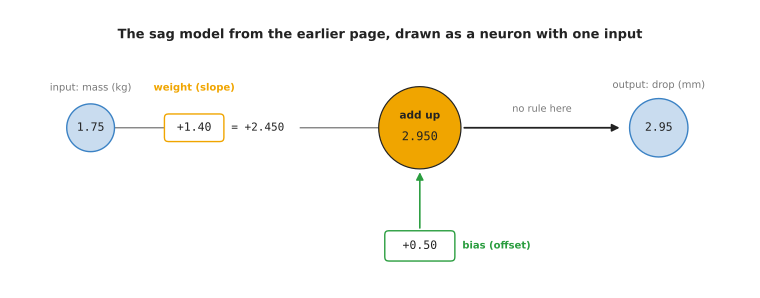
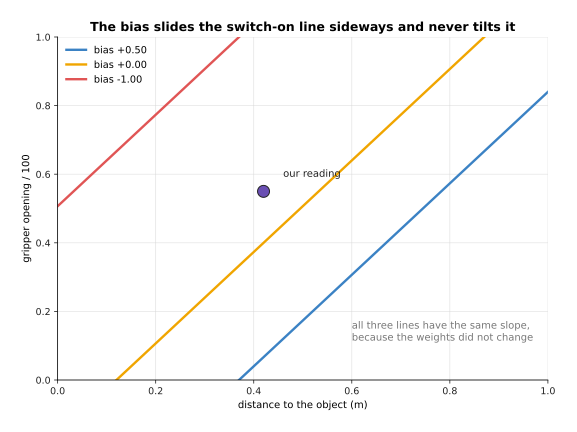
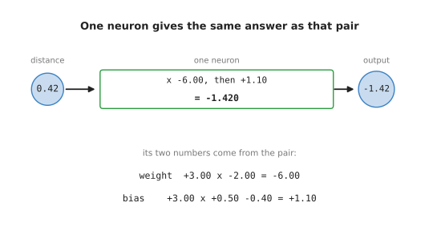
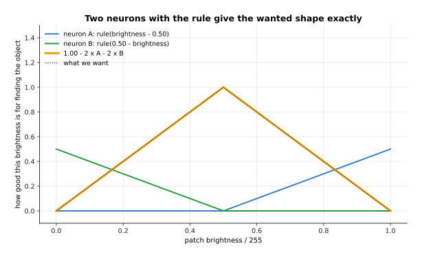
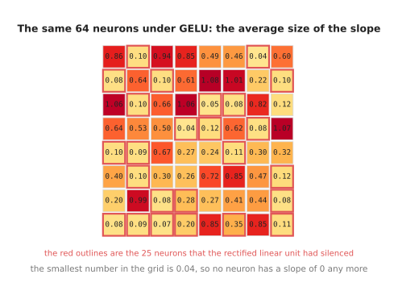
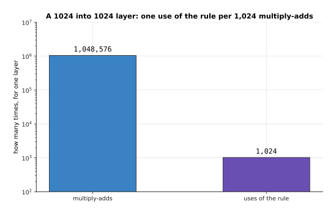
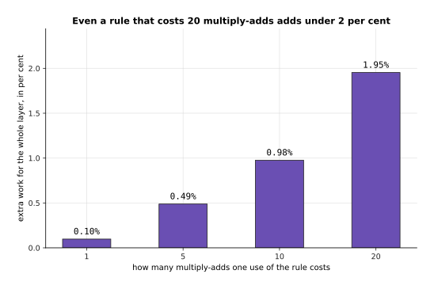

# One neuron, worked out by hand

The chapter before this one,
starting at [how rules do the work](../01_what-learning-means/01_how-rules-do-the-work.md),
explained what a model is. It said that a model is a function with numbers inside
it, and that training is the search for good values for those numbers. This page
opens one model and shows you the smallest part that the model is built from.
That part is called a **neuron**, and a neuron is one small piece of arithmetic
that owns a few numbers of its own. This page works one neuron out
in full with real numbers, so that nothing here stays a word you have to accept
without checking it.

This page is for a reader who has read the chapter before it. If you came
straight to this page, section 1 repeats the part of that chapter you need: what a
model is, how a model relates to a neuron, and where the inputs come from. You
need to be able to multiply, to add, and to read a graph that has two axes. You do not need to
know anything about training, because the numbers on this page were chosen by
hand so that you can watch what they do. Everything is worked out on one made-up
moment of one grasp, in which a robot arm is reaching for a cup. Every number in
every picture was worked out and printed by
`docs/diagrams/inside_a_network_1.py`.

When you reach the end of this page you will know which four numbers one neuron
owns, what each of those numbers changes, why multiplying and adding alone can
never be enough, and what the rule at the end of the neuron adds.

## Contents

1. [From a model to a neuron](#1-from-a-model-to-a-neuron)
2. [What one neuron is made of](#2-what-one-neuron-is-made-of)
3. [The weighted sum, line by line](#3-the-weighted-sum-line-by-line)
4. [What changes when a weight or the bias changes](#4-what-changes-when-a-weight-or-the-bias-changes)
5. [Why multiplying and adding is not enough](#5-why-multiplying-and-adding-is-not-enough)
6. [The rectified linear unit](#6-the-rectified-linear-unit)
7. [GELU and SiLU, and why networks use them now](#7-gelu-and-silu-and-why-networks-use-them-now)
8. [Where to read next](#8-where-to-read-next)
9. [Using it in Python](#9-using-it-in-python)

---

## 1. From a model to a neuron

This section connects the word model to the word neuron, and it says where the
numbers that go into a neuron come from. The earlier page
[what a model is](../01_what-learning-means/03_what-a-model-is.md) covers models
in full, with every step worked out. This section repeats only the part that this
page needs.

A **model** is a formula with adjustable numbers inside it, together with the
values that those numbers have been given. You hand the model some numbers, it
does its arithmetic, and it hands back an answer. The numbers you hand it are its
**inputs**, and the answer is its **output**. The adjustable numbers inside it are
its **parameters**, and finding good values for them is called **training**.

The earlier page built the smallest useful model. A robot arm bends a little when
a mass hangs on its wrist, so the tool tip sits lower than the controller expects.
That bending is called sag. Somebody measured the sag for six masses and fitted a
straight line to the measurements. The result was the formula
sag = 1.4 x mass + 0.5. Its input is the mass in kilograms. Its output is the drop
of the tool tip in millimetres. Its two parameters are 1.4 and 0.5.

That formula already has the shape of a neuron. The picture below redraws it in
the shape that the rest of this page uses for a neuron. Read it from left to
right.



The input of 1.75 kg is multiplied by 1.4, which gives 2.45. Then 0.5 is added,
which gives 2.95. So the model predicts a drop of 2.95 mm. A number that
multiplies an input is called a **weight**. A number that is added at the end,
whatever the input is, is called a **bias**. So the slope of the sag line is a
weight, and its offset is a bias.

A neuron does the same arithmetic with two changes. First, it can take several
inputs, and each input gets its own weight. Second, it passes its total through a
simple rule before it hands the total on. The sag model has no rule, which is why
the picture says "no rule here". Section 5 explains why a neuron needs one.

A **neural network** is a model built from many neurons. The outputs of some
neurons become the inputs of others, and the whole network is still one formula
with parameters inside it. So the relation between the two words is this. A
neuron is the smallest piece, and a network is a model made by joining many of
those pieces together. Every weight and every bias of every neuron is one
parameter of the model. The page after this one,
[layers and depth](02_layers-and-depth.md), shows how the neurons are joined.

The inputs come from outside the model, because a model never reads a sensor
itself. A program on the robot reads the sensors at one moment. It turns each
reading into one number, and it puts those numbers in a fixed order. That ordered
list of numbers is what arrives at the model, and each number in the list is one
input. The order matters, because the first weight always multiplies the first
number in the list. If the program swapped two readings, each weight would
multiply the wrong reading. The answer would be wrong, and nothing would report an
error.

For the sag model the list holds one number, which is the mass. The neuron on the
rest of this page reads three numbers. They come from three sensors on an arm at
the moment it reaches for a cup. Section 2 shows those three readings and how each
one is turned into a number before it arrives.

---

## 2. What one neuron is made of

The section before this one described a model as a function with numbers inside it.
The smallest function of that kind that is worth looking at is one neuron with
three inputs. The numbers that go into a neuron are called its **inputs**. The
single number that comes out of it is called its **output**. Between the inputs
and the output there are only four numbers, and those four numbers belong to the
neuron itself.

The picture below follows one set of three inputs through the whole neuron, from
left to right, and shows every number on the way.


In that picture the three readings 0.42, 0.55 and 0.30 are multiplied by the
three numbers -2.00, +1.50 and +0.80. The three results and one more number,
+0.50, are added together, and they make 0.725. The rule at the end passes 0.725
through without changing it, because 0.725 is above 0.

Those three readings come from a robot arm that is about to close its gripper on
a cup. The first reading is the distance from the gripper to the cup in metres,
and a depth camera has measured it as 0.42. A depth camera is a camera that
reports how far away each point in front of it is. The second reading is how far
open the gripper is, and the gripper reports it as 55 millimetres. The third
reading is how bright the small patch of the camera picture is at the place where
the cup should be.

Those three readings arrive in three different units. A neuron cannot do anything
sensible with a 0.42 standing next to a 55, because the number that makes the
second reading count would have to be a hundred times smaller than the number
that makes the first one count. So each reading is first turned into a number
between 0 and 1, and that step is called scaling.

The picture below shows the three readings on three rows, and each row shows how
one raw reading becomes a scaled number.


The distance is already between 0 and 1, so it goes in as it is. The gripper
opening of 55 millimetres is divided by 100, because the jaws open to 100
millimetres at most. The sixteen pixel values in the patch add up to 1,224, so
their average is 76.5 out of a possible 255. Dividing 76.5 by 255 gives 0.300.

So the three numbers that reach the neuron are 0.42, 0.55 and 0.30. Now the four
numbers that the neuron owns come in. Each input has one number of its own, which
is called a **weight**. A weight says how much that input counts and in which
direction. The neuron also has one further number, which is called its **bias**,
and the bias is added to the total whatever the inputs are.

The picture below draws those four numbers as four bars, so that you can see
their signs and their sizes next to each other.


The weight on the distance is -2.00. The weight on the opening is +1.50. The
weight on the brightness is +0.80. The bias is +0.50. That is four numbers for a
neuron with three inputs.

A weight below 0 means that the neuron's answer gets smaller as that reading gets
bigger. A weight above 0 means the opposite, so the answer gets bigger as that
reading gets bigger. The weights here were picked so that this neuron answers one
question, which is whether the arm is near a bright object with its gripper open.
That combination is the moment when closing the gripper is likely to work. The
distance has a minus weight because being far away counts against that moment.
The other two readings have plus weights because they count in favour of it. In a
real network nobody picks these four numbers by hand, because training picks
them, and the chapter [how training
works](../03_how-training-works/01_the-score-of-being-wrong.md) explains that
search.

---

## 3. The weighted sum, line by line

The three inputs and the four numbers of the neuron are now all known, so the
neuron can do its first job. That job is to work out the **weighted sum**, which
means multiplying each input by its own weight, adding those results together,
and then adding the bias. The whole calculation is short enough to write out
completely.

```
distance     0.42  x  -2.00  =  -0.840      running total  -0.840
opening      0.55  x  +1.50  =  +0.825      running total  -0.015
brightness   0.30  x  +0.80  =  +0.240      running total  +0.225
bias                  +0.50  =  +0.500      running total  +0.725
```

The picture below is the same calculation as a table. Read it one row at a time,
from left to right, and the last column keeps the total so far.


The three products are -0.840, +0.825 and +0.240. The bias adds +0.500 more. The
running total after the last row is +0.725, and that number is the weighted sum.

The running total in the last column is worth following. After the distance alone
the total is below 0. Only when the opening is added does the total rise back
above 0. This is what a weighted sum does, because it lets several readings pull
the answer in different directions, and the weights decide which reading pulls
hardest.

The picture below draws each row of the table as one bar, so you can see which
readings push the total up and which one pulls it down.


Only the distance pulls this sum down, because it is the only reading with a
minus weight. The opening pushes the sum up the hardest, by +0.825.

So far the arm has stood still at 0.42 metres. The next picture holds the opening
at 0.55 and the brightness at 0.30, and it moves the distance from 0 to 1 metre.
Only one input changes, and that input is multiplied by one fixed weight, so the
answer has to be a straight line. The line falls by exactly 2.00 for every extra
metre, because the weight on the distance is -2.00.


At 0 metres the sum is 1.565. At our reading of 0.42 metres it is 0.725. It
crosses 0 at 0.7825 metres, and after that point the rule holds the output at 0.

That crossing point at 0.7825 metres is the distance at which this neuron stops
answering, and the next section moves that point on purpose. Two readings can be
moved at the same time instead of one. When they are, the place where the sum
crosses 0 is no longer a single point, because it becomes a straight line across
the picture.

The picture below sweeps the distance along the bottom and the gripper opening up
the side. The colour gives the weighted sum at each pair of readings, and the
black line marks every pair where the sum is exactly 0.


Over the whole square the sum runs from -1.260 to +2.240. The line where the sum
is exactly 0 reaches an opening of 0.84 at a distance of 1 metre, and it leaves
the square through the bottom edge. Our own reading sits well inside the part
where the sum is above 0.

The straightness of that line is the most important limit of a single neuron, and
section 5 returns to it. Before that, the next section shows what the four
numbers the neuron owns actually control.

---

## 4. What changes when a weight or the bias changes

The weighted sum in the section before used one particular set of four numbers,
so the natural question is what would have happened with different ones. The
answer is easiest to see if you change one number at a time. The clearest single
change is to turn the weight on the distance from -2.00 into +2.00, which changes
its sign but not its size.

The picture below shows the same calculation twice. The two tables use the same
three readings, and the only difference between them is that one weight.


With the weight -2.00 the distance contributes -0.840, and the sum is +0.725.
With the weight +2.00 the same reading contributes +0.840, and the sum is +2.405.
The second sum is more than three times as large as the first one.

Nothing about the robot changed between those two tables. Only one of the
neuron's own numbers moved, and the neuron now answers a different question.
A neuron with a plus weight on the distance answers whether the arm is far from a
bright object with the gripper open. So a weight is not a small detail of the
arithmetic, because a weight decides what the neuron is for.

The size of a weight matters as well as its sign. The way to see that is to look
again at the line where the sum is exactly 0.

The picture below draws that line three times in the same square, once for each
of three sizes of the weight on the distance. The other numbers stay as they
were.


With the weight -1.00 the line only reaches an opening of 0.173 at the far right
of the square. With -2.00 it reaches 0.840. With -4.00 it crosses the whole
square. So a bigger weight on the distance makes the line stand closer to
upright, and a more upright line means that the neuron cares more about the
distance and less about the opening.

A weight of +2.00 is missing from that picture for a reason. With a plus weight
of that size, the smallest sum anywhere in the square is +0.740. The sum never
reaches 0, so the neuron is switched on for every reading it could ever see, and
there is no line to draw.

The bias does something different. It is added whatever the readings are, so it
slides the whole line sideways without tilting it.

The picture below draws the same line for three different biases, in the same
square of two readings.



All three lines have the same slope, which is 1.333, because the weights did not
change. With the bias +0.50 the line leaves the square at an opening of 0.840.
With the bias 0.00 it leaves at the top of the square. With the bias -1.00 it
already enters the square at an opening of 0.507, which leaves much less room
below it. Moving the bias therefore moves the point at which the neuron stops
answering.

The picture below shows the same change again, but with only the distance moving,
so that you can read the stopping point off the bottom axis in metres.


With the bias +0.50 the output reaches 0 at 0.7825 metres. With the bias 0.00 it
reaches 0 at 0.5325 metres. With the bias -1.00 it reaches 0 at only 0.0325
metres, so the neuron gives 0 for almost every distance it could meet.

So the weights decide which way the dividing line leans, and the bias decides
where that line sits. Those four numbers are the only freedom this neuron has.
The freedom is narrow, because whatever you do to the four numbers the dividing
line stays straight. The next section shows why adding more neurons of this same
kind cannot fix that.

---

## 5. Why multiplying and adding is not enough

The sections before this one kept finding straight lines, and that is not an
accident of the numbers that were chosen. Multiplying by a weight and adding a
bias can only ever make a straight line. Doing it twice does not help either,
because two of these neurons in a row are exactly equal to one neuron with
different numbers.

The picture below puts one reading through two neurons, one after the other, with
nothing applied between them.


The first neuron turns 0.42 into -0.340. The second neuron turns -0.340 into
-1.420.

The picture below puts the same reading through a single neuron instead, and that
neuron gives the same answer.



One neuron with the weight -6.00 and the bias +1.10 turns 0.42 straight into
-1.420, without the stop in the middle.

The reason is ordinary arithmetic. The second neuron multiplies what it receives
by 3.00, and what it receives is -2.00 times the distance plus 0.50. So the pair
works out 3.00 times -2.00 times the distance, which is -6.00 times the distance.
It also works out 3.00 times 0.50 and then subtracts 0.40, which gives 1.10. In
other words the two weights multiply together, and the first bias is scaled by
the second weight.

The picture below draws both of those roads across the whole sweep of distances,
and it adds a third line in which the rule is applied between the two neurons.


Across the whole sweep the two plain layers and the single neuron never differ by
more than 0.0000000000000009, which is as close as the computer can measure. The
third line, which has the rule between the two neurons, bends at 0.250 metres and
is a different shape altogether.

The same collapse happens however many neurons you chain together. This is worth
checking, because it is easy to believe that three in a row must be able to do
something that two cannot.

The picture below is a table with one row for each of three layers in a row, and
one last row for the single neuron that replaces all three. Read each row from
left to right, and compare the two numbers in the last column.


The three weights multiply to -3.00, and the three biases gather into +1.75. So
three layers in a row give exactly the same +0.490 that one layer with those two
numbers gives.

This matters because many useful jobs cannot be done by a straight line at all.
The brightness of the patch is one of those jobs. A patch that is nearly black
shows nothing, and a patch that is completely white shows nothing either, so
brightness is good in the middle and bad at both ends.

The picture below draws what we want from the brightness, which is a shape that
rises to the middle and falls again, and it draws the best straight line through
that shape.


The best straight line through this target is flat at 0.499, and it is wrong by
0.251 on average. A straight line cannot be high in the middle and low at both
ends, so no choice of weight and bias fixes this.

The picture below does the same job with two neurons that each apply the rule,
and it draws what each of those neurons gives as well as their total.



Two neurons with the rule rebuild the wanted shape exactly, and the biggest gap
anywhere between the two lines is zero.

So a network made only of multiplying and adding could have a thousand layers and
would still only be able to draw one straight line. The thing that removes this
limit is the simple rule applied at the end of each neuron, and the next section
finally looks at that rule properly.

---

## 6. The rectified linear unit

The rule that section 5 kept putting between the layers has a name. It is called
the **activation function**, which means a rule that is applied to the weighted
sum to give the neuron's output. The number that comes out of it is called the
neuron's **activation**. The simplest one, and the one networks have used the
longest, is the **rectified linear unit**, which is usually shortened to ReLU.
The whole of it is this:
if the sum is below 0 give 0, and otherwise give the sum unchanged.

The picture below draws that rule on ordinary axes. The number going in is on the
bottom axis, and the number coming out is on the side axis.


The table below gives the output of the rule for eight different sums. Read one
row at a time: the left column is the number going in, and the right column is
the number coming out.

| weighted sum going in | output of the rule |
| --- | --- |
| -2.000 | 0.000 |
| -1.000 | 0.000 |
| -0.500 | 0.000 |
| 0.000 | 0.000 |
| +0.500 | 0.500 |
| +0.725 | 0.725 |
| +1.000 | 1.000 |
| +2.000 | 2.000 |

Every number below 0 becomes 0, and every number above 0 is passed on untouched.
Our own neuron had a sum of +0.725, which is the sixth row, so its output is
0.725 as well.

This rule looks too simple to do any work. The reason it does so much work is the
corner at 0. A neuron with this rule is two different things joined at one point,
because on one side of the corner it ignores its inputs and on the other side it
follows them exactly. The place where it changes is the point that section 4
moved with the bias, and this page calls that point the elbow. Once several
neurons each have an elbow in a different place, the elbows can be added together
into any shape at all.

The picture below shows that. It draws a smooth curve, and then it draws two
lines made of straight pieces that follow the curve, one with six elbows and one
with twelve.


Six neurons with elbows at 0.08, 0.25, 0.42, 0.58, 0.75 and 0.92 follow the
smooth curve to within 0.107 everywhere. Twelve of them bring that largest gap
down to 0.030.

That is the answer to the question section 5 raised. A network can bend because
each neuron can switch itself off, and a network with more neurons can bend in
more places. What this costs is that half of every neuron's range gives nothing
at all.

The picture below shows the cost directly. It takes our own neuron, sweeps both
the distance and the gripper opening, and colours the output after the rule.


The grey part of that square is where the output is exactly 0, and it covers 26.5
per cent of the square. Inside the grey part the neuron says the same thing about
every pair of readings, so it says nothing useful about them at all.

A neuron is worse off still if its sum is below 0 for every reading it ever
meets, because then it gives 0 all of the time.

The picture below simulates 64 neurons with randomly chosen weights, gives each
of them the same 200 simulated moments to read, and draws one square for each
neuron. The number in a square is the percentage of the 200 moments on which that
neuron gave something above 0.


Of those 64 neurons, 25 never gave anything above 0, and the average neuron
answered on 36.6 per cent of the moments. The readings and the weights here are
simulated, and they are drawn from a fixed starting point so that the picture can
be made again.

A neuron in that state is called a dead unit, and it is dead in a strong sense.
The training methods in the next chapter move each weight a little in the
direction that would improve the answer. A neuron whose output is 0 for every
example gives no direction to move in. The reason shows up in the slope of the
rule, where the slope means how much the output moves when the number going in
moves a little.

The picture below draws that slope. The number going into the rule is on the
bottom axis, and the slope of the rule at that number is on the side axis.


To the left of 0 the slope is 0, which means that moving the sum a little changes
nothing at all. To the right of 0 the slope is 1, which means the output follows
the sum exactly. At the point 0 itself there is no single slope, because the rule
jumps from one value to the other.

That flat left half and that jump at 0 are the two things the newer rules in the
next section change.

---

## 7. GELU and SiLU, and why networks use them now

The rectified linear unit has those two awkward places, so two smoother rules
have taken over much of its work in the models built today. Both of them keep its
shape and round off its corner. They are the **Gaussian error linear unit**,
shortened to GELU, and the **sigmoid linear unit**, shortened to SiLU and also
called swish. The rectified linear unit switches flatly between 0 and 1: it
multiplies the sum either by 0 or by 1 and by nothing in between. GELU and SiLU
instead multiply the sum by a number between 0 and 1 that grows as the sum grows.

The picture below draws all three rules on the same axes, and the small box
inside it repeats the left half of the same picture at a larger size.


The table below gives what each rule produces for the same eight sums that
section 6 used. Read one row at a time: the first column is the sum going in, and
the other three columns are what each rule gives for that sum.

| sum going in | ReLU | GELU | SiLU |
| --- | --- | --- | --- |
| -2.000 | 0.0000 | -0.0455 | -0.2384 |
| -1.000 | 0.0000 | -0.1587 | -0.2689 |
| -0.500 | 0.0000 | -0.1543 | -0.1888 |
| 0.000 | 0.0000 | 0.0000 | 0.0000 |
| +0.500 | 0.5000 | 0.3457 | 0.3112 |
| +0.725 | 0.7250 | 0.5552 | 0.4884 |
| +1.000 | 1.0000 | 0.8413 | 0.7311 |
| +2.000 | 2.0000 | 1.9545 | 1.7616 |

All three rules give almost the same answer for a large sum. At +2.000 the
rectified linear unit gives 2.0000, GELU gives 1.9545 and SiLU gives 1.7616. On
the left they differ more. At -1.000 the rectified linear unit gives 0.0000,
while GELU gives -0.1587 and SiLU gives -0.2689. The lowest number GELU ever
gives is -0.170, and the lowest SiLU ever gives is -0.278.

That small dip below 0 is the first difference. It means that a neuron whose sum
is a little below 0 still gives a small answer rather than nothing, so such a
neuron is never completely dead. The second difference is in the slope, and the
slope is what the training methods in the next chapter actually use.

The picture below draws the slope of each of the three rules on the same axes.


The rectified linear unit's slope is 0 at an input of -2 and 1 at +2, with a jump
between them. GELU's slope runs from -0.0852 at -2 to +1.0852 at +2, and SiLU's
runs from -0.0908 to +1.0908. Both of the smooth rules dip below 0 on the left,
GELU down to -0.129 near -1.42 and SiLU down to -0.100 near -2.40.

The picture below puts the three rules back on the neuron from section 2. The
left half sweeps the distance from 0 to 1 metre, and the right half is the same
sweep again with the area around the elbow made larger.


At our reading of 0.42 metres the sum of +0.725 becomes 0.7250 under the
rectified linear unit, 0.5552 under GELU and 0.4884 under SiLU. At 0.85 metres,
where the sum is -0.1350, the rectified linear unit gives exactly 0, while GELU
gives -0.0603 and SiLU gives -0.0630.

The dead units of section 6 are the clearest case where that difference matters.
The picture below takes the same 64 simulated neurons and the same 200 simulated
moments, replaces the rule with GELU, and writes in each square the average size
of the slope that neuron gets. The 25 neurons that the rectified linear unit had
silenced are outlined in red.



Under the rectified linear unit those 25 neurons have a slope of exactly 0 on all
200 moments, so training cannot move them. Under GELU the same 25 neurons have an
average slope size between 0.0400 and 0.3466. The smallest number anywhere in the
grid is 0.0400, so no neuron is left with a slope of 0.

So why use the smooth rules rather than the rectified linear unit, which is
simpler and older? The first reason is the one the pictures above show, which is
that the slope changes smoothly and gives the training methods something to work
with everywhere, instead of nothing on one side and a jump in the middle. The
second reason is that the large models built today train a little more steadily
with them. Most transformer models, which the chapter [the
transformer](../06_the-transformer/02_a-transformer-block.md) explains, use GELU
or SiLU inside. The rectified linear unit stays common in smaller vision models
and wherever speed matters most.

What the smooth rules cost is arithmetic. The rectified linear unit is a single
comparison against 0. GELU and SiLU both need a curve that a computer works out
from a longer calculation, and that calculation takes several times as long for
each number. That extra cost looks large until you count how often each of the
two things happens inside one layer.

The picture below counts both things for one layer that takes 1,024 numbers in
and has 1,024 neurons. The left bar is the multiply-adds, where one multiply-add
means one weight multiplied by one number and added to a running total. The right
bar is the number of times the rule is used. The side axis grows by a factor of
ten at each step, because one bar is a thousand times the other.



That layer does 1,048,576 multiply-adds and uses the rule only 1,024 times, which
is one use of the rule for every 1,024 multiply-adds.

The picture below turns that ratio into the extra work for the whole layer. Each
bar assumes that one use of the rule costs as much as a given number of
multiply-adds, and it gives the extra work as a percentage.



Even a rule that costs as much as 20 multiply-adds adds only 1.95 per cent to the
work of that layer. So the dearer rule is worth its price whenever it trains
better.

Those two pictures also introduce the subject of the next page, which is that a
layer of 1,024 neurons holds over a million weights, and that those weights are
arranged in a grid which a computer multiplies in one go.

---

## 8. Where to read next

- [Layers and depth](02_layers-and-depth.md) is the next page, and it joins many
  copies of this neuron into a layer, stacks the layers, and explains what each
  extra layer adds and what it costs.
- [The shape of the numbers](03_the-shape-of-the-numbers.md) explains how those
  weights are stored and multiplied, and why the hardware is built the way it
  is.
- [What a network can learn](04_what-a-network-can-learn.md) picks up section 5
  and shows why stacking layers with a rule between them can follow any shape.
- [The score of being wrong](../03_how-training-works/01_the-score-of-being-wrong.md)
  starts the chapter that finds the weights and biases this page chose by hand.
- [Backpropagation](../03_how-training-works/03_backpropagation.md) explains why
  the slopes drawn in sections 5 and 6 matter so much.
- [Inside a neural network](../../07_learned-models/01_what-models-are/03_inside-a-neural-network.md)
  is the short version of the same ideas in the catalogue of models, and it
  carries on into the layer types used for pictures and sentences.

---

## 9. Using it in Python

Everything on this page is one line of PyTorch, which is the library most of this
book's models are built with. The code below builds the same neuron as section 2,
puts the same three readings through it, and checks the arithmetic of sections 2,
5 and 6.

```python
import torch
from torch import nn

neuron = nn.Linear(in_features=3, out_features=1)   # section 2: 3 weights + 1 bias
with torch.no_grad():                               # fix them by hand, as this page did
    neuron.weight.copy_(torch.tensor([[-2.0, 1.5, 0.8]]))
    neuron.bias.copy_(torch.tensor([0.5]))

readings = torch.tensor([[0.42, 0.55, 0.30]])       # the three scaled readings
total = neuron(readings)                            # section 3: the weighted sum
print(f"{total.item():.4f}")                        # 0.7250
print(sum(p.numel() for p in neuron.parameters()))  # 4

print(f"{torch.relu(total).item():.4f}")                      # section 6: 0.7250
print(f"{torch.nn.functional.gelu(total).item():.4f}")        # section 7: 0.5552
print(f"{torch.nn.functional.silu(total).item():.4f}")        # section 7: 0.4884

below = torch.tensor([-0.135])                      # the sum at 0.85 m, from section 7
print(f"{torch.relu(below).item():.4f}")                      # 0.0000
print(f"{torch.nn.functional.gelu(below).item():.4f}")        # -0.0603
```

The class is called `nn.Linear` and not `nn.Neuron`, because it is written to
hold a whole layer of neurons at once. Asking for one output is how you get a
single neuron out of it. The library gives you the weights, the bias, the
multiplying and the adding, so you never write the arithmetic of section 3
yourself.

Each number is printed to four decimal places on purpose. PyTorch works in a
number format called float32, which keeps only about seven digits, so the full
printout would end in digits that depend on the order in which the machine added
things up. The page [the shape of the
numbers](03_the-shape-of-the-numbers.md) explains that format and the smaller
ones that models are run in.

What you have to decide is none of the arithmetic and all of the shape. You
choose how many inputs the layer takes and how many neurons it has, which the
next page is about. You also choose which rule to apply after it, which section 7
weighed up. You do not choose the weights or the bias, because training chooses
those.
