# Layers, depth and width

The page before this one, [one neuron](01_one-neuron.md), worked a single neuron
out by hand. Three readings from a robot arm were each multiplied by a weight,
the results and a bias were added together to make 0.725, and a rule decided what
came out. One neuron is not a model, though. It gives one number, and it can only
ever draw a straight line across its readings. This page puts many neurons side
by side into a **layer**, stacks layers one after another, and answers the two
questions that follow from doing so. Those questions are what each extra layer
gives you, and what it costs you.

Three words do most of the work on this page. A layer is a group of neurons that
all read the same numbers. The **width** of a layer is how many neurons it has.
The **depth** of a network is how many layers it has, one after another. Choosing
the width and the depth is most of what a person actually decides when they build
a network, so this page shows what each of the two choices gives you.

This page is for a reader who has read [one neuron](01_one-neuron.md) and is
comfortable with a weighted sum, a bias and the rectified linear unit. Training
is still not explained here, because the chapter [how training
works](../03_how-training-works/01_the-score-of-being-wrong.md) does that. The
same made-up moment of the same grasp runs through the page, with the same three
readings of 0.42, 0.55 and 0.30. Every number in every picture was worked out and
printed by `docs/diagrams/inside_a_network_1.py`. Where many weights are needed
at once, they are drawn at random from a fixed starting point so that the picture
can be made again, and the page says so each time.

When you reach the end you will know what a layer is, why a second layer is not
the same as a wider first one, what depth and width each add, and what each of
them costs in memory and in arithmetic.

## Contents

1. [A layer is many neurons reading the same numbers](#1-a-layer-is-many-neurons-reading-the-same-numbers)
2. [Fully connected, and what joining everything costs](#2-fully-connected-and-what-joining-everything-costs)
3. [What a second layer gives you](#3-what-a-second-layer-gives-you)
4. [Depth and width, and what each one changes](#4-depth-and-width-and-what-each-one-changes)
5. [What depth and width cost](#5-what-depth-and-width-cost)
6. [Residual connections](#6-residual-connections)
7. [Where to read next](#7-where-to-read-next)
8. [Using it in Python](#8-using-it-in-python)

---

## 1. A layer is many neurons reading the same numbers

The neuron on the page before this one answered one question about the grasp, and
a robot needs more than one answer. So the first step is to put several neurons
side by side and to give all of them the same three readings. That group of
neurons is a **layer**. The only new idea in it is that each neuron keeps its own
weights and its own bias, so the same three numbers going in come out as several
different answers.

The picture below draws four neurons that all read the same three readings. Each
line carries one reading to one neuron, and each box holds that neuron's own
weights, its bias, its sum and its output.


The same readings 0.42, 0.55 and 0.30 reach all four neurons. The four sets of
weights are different, so the four sums are different as well: they are +0.725,
+0.490, +0.250 and -0.370. The rule turns those sums into the outputs 0.725,
0.490, 0.250 and 0.000.

Nothing in that picture is new arithmetic, because it is the weighted sum of the
page before done four times over. It is still worth writing out once, because
seeing all twelve products at the same time is what makes a layer one thing
rather than four.

The picture below is a table with one row for each neuron. Read each row from
left to right: the three products, then the bias, then the sum of all four, then
the output after the rule.


Neuron 2 has the products +0.840, -0.550 and +0.000 and the bias +0.20, and those
four numbers make +0.490. Neuron 4 reaches -0.370, and it is the only neuron that
the rule silences.

The twelve weights are usually drawn as a grid rather than as four separate
lists, with one row for each neuron and one column for each input. They are drawn
that way because that is how a computer stores them, and because that is how the
next page describes them.

The picture below shows that grid, with the four biases in a column beside it.


Four neurons reading three numbers need 4 times 3 weights, which is 12 weights.
Each neuron also has one bias, which is 4 more numbers. So the whole layer owns
16 numbers, and those numbers are called its parameters.

The four numbers that come out of the layer are called the layer's **features**.
A feature is a number worked out from the readings that says something useful
about them. The point of having four features is that each one describes the
moment in a different way, so together they say more than any one of them could.

The picture below draws those four outputs as four bars, with the sum that
produced each one written underneath it.


Three readings have become four features. The fourth feature is 0.000, because
its sum of -0.370 was below 0. That neuron is saying nothing at all about this
particular moment.

In this layer the weights were chosen by hand, so that each neuron has a
description you can read. In a trained network nobody chooses them, so nobody can
say in advance what each feature will mean.

---

## 2. Fully connected, and what joining everything costs

The layer in section 1 joined every reading to every neuron, and that arrangement
has a name. It is called a **fully connected** layer, and it is also called a
dense layer or a linear layer. It is the plainest layer there is, because it
assumes nothing about what the inputs mean and it lets every neuron look at every
one of them.

The picture below draws that layer again with the arithmetic left out, so that
only the lines are left to count.


Three inputs into four neurons is 3 times 4 lines, which is 12 weights, plus 4
biases, which makes 16 parameters. Six inputs into eight neurons would be 48
weights plus 8 biases, which makes 56. So the count is the number of inputs
multiplied by the number of neurons, plus one more for each neuron.

That multiplication is the whole cost of a fully connected layer. The layer in
section 1 is small enough to draw, but the layers in real models take hundreds or
thousands of numbers in, and then the count grows quickly.

The picture below holds the number of inputs at 1,024 and changes the number of
neurons. On both axes an equal step means an equal multiplication rather than an
equal addition, because the counts are too far apart for ordinary axes.


A layer that reads 1,024 numbers has 16,400 parameters when it has 16 neurons,
262,400 parameters when it has 256, and 4,198,400 parameters when it has 4,096.
Doubling the number of neurons doubles the count.

Joining everything to everything is a poor choice when the inputs have a shape of
their own. If the inputs are the pixels of a picture, then two pixels next to
each other are related, and two pixels at opposite corners usually are not. A
fully connected layer has no way of knowing that, so it has to learn it from the
examples.

The picture below draws sixteen inputs joined to sixteen neurons in the fully
connected way, with every pair joined.

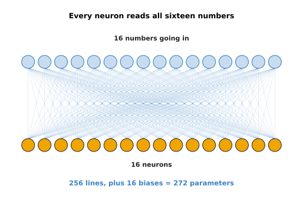

That wiring draws 256 lines, which is 256 weights, and 16 biases, so it has 272
parameters.

The picture below draws the same sixteen inputs and sixteen neurons again. This
time each neuron reads only three numbers, which are the input at its own place
and the two inputs beside it.

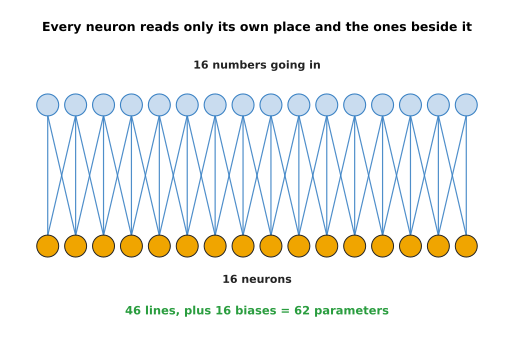

That wiring draws 46 lines rather than 48, because the neuron at each end of the
row has only one neighbour instead of two. With the 16 biases it has 62
parameters in all, which is 4.4 times fewer than the 272 above.

That second arrangement, repeated with the same weights at every position, is
called a convolution, and it is the subject of [what a network can
learn](04_what-a-network-can-learn.md). All this page says about it is that a
fully connected layer is the general case, and that the special layers are
savings made by knowing something about the input.

---

## 3. What a second layer gives you

Section 2 counted what one layer costs, which raises the question of why anybody
would use more than one layer. The answer is that the second layer does not read
the readings. It reads the features that the first layer made, and that is a
different thing to read.

The picture below shows this directly. The four circles on the left are the four
features from section 1, and three new neurons read them.

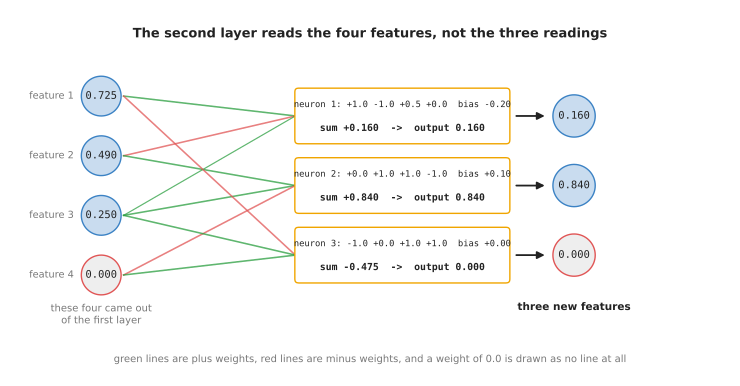

Those three second-layer neurons give the sums +0.160, +0.840 and -0.475, so
after the rule their outputs are 0.160, 0.840 and 0.000. The camera readings of
0.42, 0.55 and 0.30 appear nowhere in that arithmetic, because the second layer
never sees them.

The page before this one showed that two layers with nothing between them
collapse into one layer, so everything in this section assumes that the rule is
applied after each layer.

To see what the second layer adds, it helps to count bends. A bend is a place
where a line changes direction, and section 5 of the page before showed that each
neuron with the rule has one such place of its own.

The picture below sweeps the patch brightness from 0 to 1 and draws what one
layer of two neurons gives.


The two neurons have their bends at 0.300 and 0.700, so the line they make
together has 2 bends and 3 straight pieces. No choice of the numbers that combine
them can give it more.

Now add a second layer of two neurons that reads those two features instead of
the brightness. The neurons in the second layer have bends of their own, but a
bend in the second layer appears wherever the first layer's output crosses the
second neuron's switching point. So the new bends land in places where neither
first-layer neuron has a bend.

The picture below draws what each of the two second-layer neurons gives, against
the brightness that neither of them reads.

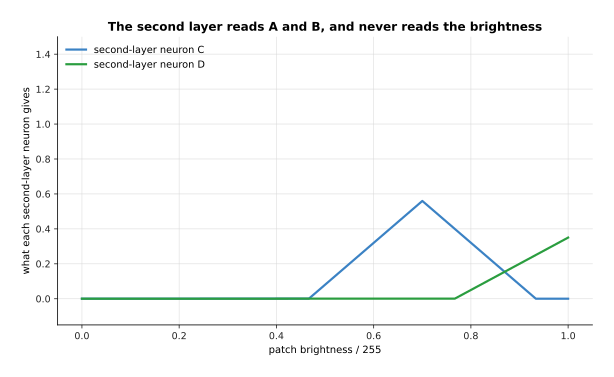

Neither of those two lines bends at 0.300, which is where the first layer bends.

The picture below adds the two second-layer neurons together and draws the answer
of the whole two-layer network, with the one-layer answer behind it for
comparison.


The same two first-layer neurons, read by two more neurons, give a line with 4
bends instead of 2. The bends sit at 0.467, 0.700, 0.767 and 0.933, and three of
those four are at brightness values where the first layer had no bend at all.

That is the mechanical answer. The useful answer is what the layers end up
meaning. When researchers look inside a trained network for pictures, they find
the same pattern again and again. The neurons in the early layers answer
questions about edges and patches of colour. The neurons in the middle layers
answer questions about shapes made of those edges, such as corners and curves.
The neurons in the late layers answer questions about whole parts of objects,
such as a handle or a rim. Nobody tells the network to do this, because it comes
out of training on its own.

The three stages below are built by hand, so that the arithmetic stays visible.
They work on a simulated picture of a cup with a handle, 14 pixels by 14 pixels,
in which 1 is bright and 0 is dark.

The picture below shows the cup on the left and the first stage's answer on the
right. The first stage slides nine weights over the picture, one place at a time,
and at each place it asks whether a dark column is followed by a bright one.

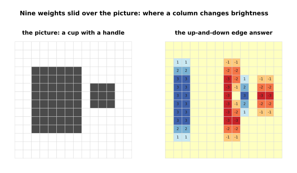

That filter gives +3 where a dark column is followed by a bright one, and -3
where a bright column is followed by a dark one. It is positive in columns 1, 2
and 9, and it is negative in columns 7, 8, 11 and 12.

The picture below shows the same cup again, with the same nine weights turned
sideways so that they ask about rows instead of columns.

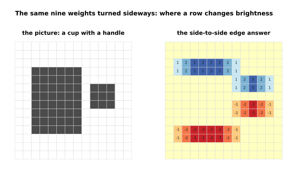

That filter answers along the top and the bottom of each shape, on rows 2, 3, 4,
5, 7, 8, 10 and 11.

Nothing in that first stage knows anything about cups, because each answer comes
from nine numbers at one place. The second stage reads the first stage's two
answers rather than the picture. It asks whether there is an up-and-down edge and
a side-to-side edge in the same place, which is what a corner is.

The picture below shows the cup beside the second stage's answer, with the places
where the answer rises above 2 outlined.

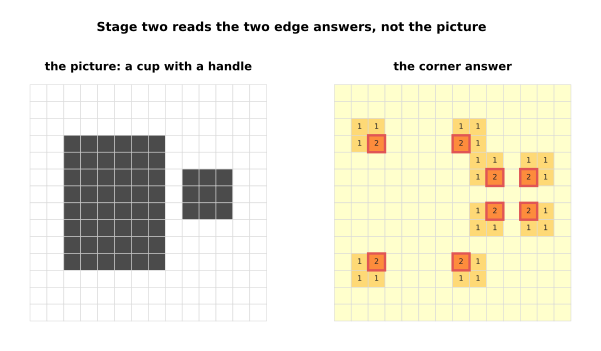

The corner answer rises above 2 at exactly 8 places, which are the four corners
of the body and the four corners of the handle.

The third stage also reads the first stage rather than the picture. It asks
whether there is a dark-to-bright edge with a bright-to-dark edge two columns
further to the right, which is what a bright bar three columns wide looks like.

The picture below shows the cup beside the third stage's answer, with the places
where it answers above 0 outlined.

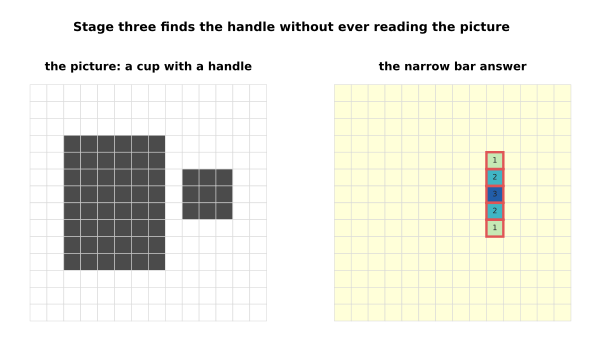

The narrow-bar answer is above 0 at 5 places, and all five are in the handle. It
is 0 everywhere on the body, because the body is six columns wide and this
question only accepts three.

So the third stage has found the handle, and it found the handle without ever
looking at the picture, because it only looked at what the first stage said. That
is what an extra layer gives you. It does not give you more lines across the
readings. It gives you questions asked about the answers to earlier questions.

---

## 4. Depth and width, and what each one changes

Section 3 showed what a second layer does, and the next question is how far that
goes. Answering it means measuring the two words in this page's title. The depth
is how many layers a network has, and the width is how many neurons each layer
has.

The picture below names both of them on one small stack, of the shape this page
has been building.

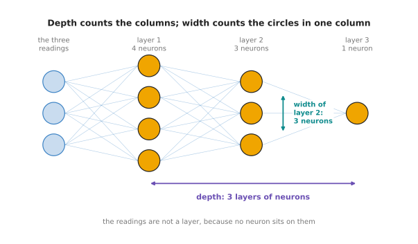

That stack has 3 layers of neurons, and their widths are 4, 3 and 1. The three
readings are not a layer, because no neuron sits on them. A network that is
called **deep** is simply one with many layers, and that is where the name deep
learning comes from. There is no exact number at which deep starts, although
vision models often have dozens of layers and the largest language models have
around a hundred.

One way to measure what a network can do is to count the straight pieces its
answer is made of, because section 3 showed that a network changes direction only
where a neuron has a bend. In the pictures below a single reading is swept from -1 to +1. The weights
are drawn at random from a fixed starting point, the pieces are counted by the
script on a sweep of 6,001 points, and each number is the average over five
networks of the same shape.

The picture below holds the width at 8 neurons and changes the depth.


One layer gives 7.0 pieces on average, two layers give 9.8, three give 14.0, four
give 16.0 and five give 19.0. So every extra layer adds more detail to the
answer.

The picture below draws the answers that two of those networks actually make, so
that you can see what a piece is.

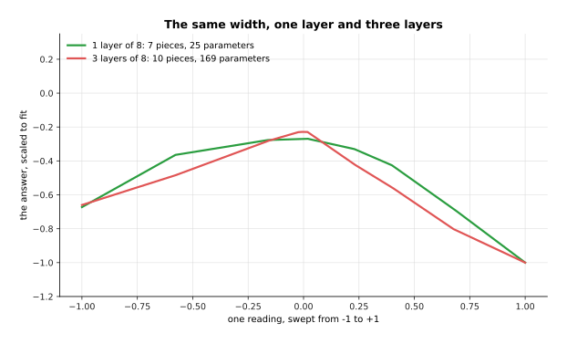

The one-layer network in that picture has 25 parameters and makes 7 pieces. The
three-layer network has 169 parameters and makes 10 pieces. Both answers are
drawn at the same height on purpose, because only their shape is being compared.

Width does the same job in a different way, because each neuron in a layer has
one bend of its own. So adding neurons to a layer adds places where the answer
can change direction.

The picture below changes the width instead of the depth, for networks of one
layer and of two.


One layer of 8 neurons gives 7.0 pieces and one layer of 64 gives 52.8. Two
layers of 8 give 9.8 and two layers of 64 give 96.8. So a greater width raises
both lines, and the second layer raises them again.

The two measurements can be put together, and the answer to which of them is
worth more is less exciting than it might be.

The picture below is a grid. Each row is one depth, each column is one width, and
the number in a cell is the pieces that shape makes on average.


The picture below takes those same sixteen numbers and plots each of them against
the total number of neurons in that network, which is the depth multiplied by the
width.

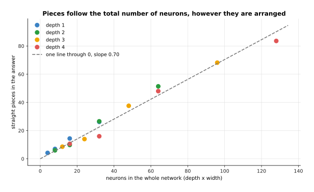

All sixteen shapes lie close to one straight line through zero with a slope of
0.70. That means that with weights picked at random it is the total number of
neurons that decides the detail, and not how those neurons are arranged into
layers.

That is worth saying plainly, because it is easy to be told that depth is
powerful and then to believe that a deep network is better at everything. Two
networks with about the same number of parameters can be arranged either way, and
with random weights the flat one is not behind.

The picture below draws the answers made by one deep narrow network and one flat
wide network.


Four layers of 8 neurons have 241 parameters and make 27 pieces. One layer of 64
neurons has 193 parameters and makes 49 pieces. So on this measure the wide flat
network is ahead, with fewer parameters.

What the deep network has instead is what section 3 showed, which is layers that
ask questions about earlier answers. That advantage only appears once training
has chosen the weights, and these weights were not trained. So the short answer
is this. Width
gives a layer more different features at the same stage. Depth gives later stages
something built to ask about. Real models use plenty of both.

---

## 5. What depth and width cost

Section 4 found that both depth and width add detail, so the way to choose
between them is to look at what each one costs. The cost is easy to count
exactly. Take a stack in which every layer has the same width, so that each layer
takes that many numbers in and gives that many out. The parameters in one layer
are then the width multiplied by itself, plus one bias for each neuron. The
parameters in the stack are that number multiplied by the depth.

The picture below is a grid of those counts. Each row is one depth and each
column is one width. Each cell holds two numbers: the parameters in millions, and
what they weigh in memory at 4 bytes for each number.


Two layers of 256 neurons come to 131,584 parameters, which is 0.5 megabytes.
Sixteen layers of 2,048 neurons come to 67,141,632 parameters, which is 269
megabytes. So the same grid covers a model that fits anywhere and a model that
has to be thought about.

The other cost is the arithmetic done every time a reading goes through, which is
counted in multiply-adds. One multiply-add is one weight multiplied by one number
and added to a running total. There is one multiply-add for every weight, so this
count follows the parameter count closely.

The picture below holds the depth at 8 layers and changes the width. On both axes
an equal step means an equal multiplication, as in the picture of section 2.

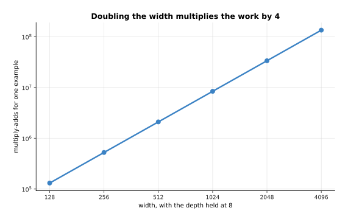

Eight layers of 1,024 neurons do 8,388,608 multiply-adds for one reading, and
eight layers of 2,048 do 33,554,432. So doubling the width multiplies the work by
4.

The picture below holds the width at 1,024 neurons and changes the depth instead.

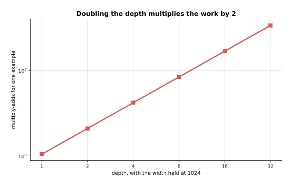

Sixteen layers of 1,024 neurons do 16,777,216 multiply-adds, which is twice what
eight layers do. So doubling the depth multiplies the work by 2.

The two results are easier to compare as numbers. Width is multiplied
in twice, once because each neuron has more inputs and once because there are
more neurons. Depth is multiplied in only once.

The picture below is a table of three stacks. Read each row from left to right:
the stack, its parameters, how that compares with the first row, its
multiply-adds, and its memory.


Doubling the width from 1,024 to 2,048 takes the stack from 8,396,800 to
33,570,816 parameters, which is 4.0 times as many. Doubling the depth from 8
layers to 16 takes it to 16,793,600, which is 2.0 times as many.

Time is the last cost, and it cannot be given in seconds here, because seconds
depend on the computer and on how many readings are handled at once. What can be
given exactly is the work, and the work grows with the number of readings as well
as with the shape of the network.

The picture below counts the multiply-adds for one reading, for 32 readings and
for 10,000 readings through the same stack of 8 layers of 1,024 neurons.


One moment of one grasp costs 8,388,608 multiply-adds through this stack. 32
moments at once cost 268,435,456. 10,000 moments cost 83,886,080,000, and
training goes over the whole set of examples many times rather than once.

So the honest summary is that a wider layer costs four times as much for each
doubling, and a deeper stack twice as much, in memory and in work alike. That
would suggest adding layers, which is the cheaper of the two. For a long time
nobody could train a very deep stack at all, though, and the next section is
about the change that fixed it.

---

## 6. Residual connections

Section 5 ended with a problem that is worth stating properly. When deep networks
were first built, making a plain stack deeper than a few dozen layers made it
worse rather than better. It was worse even on the examples it had been trained
on, which is not the usual failure of a model that has too many parameters. The
fix is one of the smallest changes in this book. Instead of passing each layer's
output on, you add that output to the layer's input and pass the total on. That
addition is a **residual connection**, and a layer wrapped in one is usually
called a block.

The picture below works one such block out on four numbers. The four numbers
enter on the left, the block works out four numbers of its own, the line along
the top carries the original four to the end, and the two sets are added
together.


The four features from section 1 were 0.725, 0.490, 0.250 and 0.000. They go into
a small block, which answers 0.073, 0.046, 0.052 and 0.212. The output is the two
sets added together, which is 0.798, 0.536, 0.302 and 0.212.

The thing to notice is that the output can never be further from the input than
the block's own answer, because the block adds to what it was given instead of
replacing it. The effect builds up over a stack. The easiest way to see it is to
push one set of 64 numbers through 30 layers twice, once through a plain stack
and once through a residual stack, using the same randomly drawn weights both
times.

The picture below does that and draws the typical size of the numbers after every
layer. The side axis grows by a factor of ten at each step, because the two lines
end up very far apart.


In that picture the block weights are 0.6 of the size that would hold the numbers
steady. Numbers with a typical size of 1.071 go in. After 30 plain layers they
are 0.0000000896, and after 30 residual layers they are 23,100.

Those numbers are worth reading carefully, and they change when the weights
change, so the picture below gives them as a table at five depths and at two
weight sizes.
Read one row at a time: the row says which layer the numbers were read after, and
the four columns give the plain stack and the residual stack at each of the two
weight sizes.


The plain stack with weights 0.6 falls from 0.562 after one layer to 0.0000000896
after thirty, so by the end the numbers are millions of times smaller than what
went in. The residual stack with the same weights rises from 1.45 to 23,100.
With the larger weights of 0.9 the plain stack ends at 0.0172 and the residual
stack ends at 2,220,000.

Neither of those two results is good on its own.
The plain stack loses everything that went in if the weights are a little too
small, and the residual stack grows instead. That is why every real network puts
a step inside each block that rescales the numbers. That step is called
normalisation, and [normalisation and
stability](../04_making-training-work/02_normalisation-and-stability.md)
explains it. With that step in place, a residual stack holds its numbers steady
for hundreds of layers.

What the addition really gives you appears in the case where the block has almost
nothing to say, which is where a plain layer does the most damage. In the two
pictures below the weights are a hundred times smaller than usual, and the first
twelve of the 64 numbers are drawn before and after.

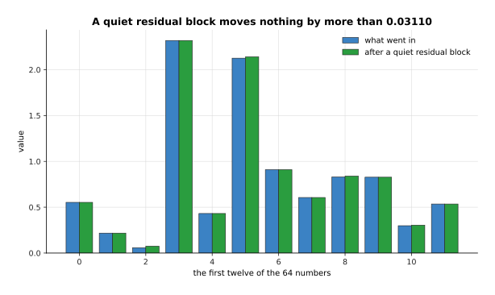

With those tiny weights the residual block moves no number by more than 0.031, so
what came in is still there at the end.

The picture below uses the same twelve numbers and the same tiny weights, but
without the addition.

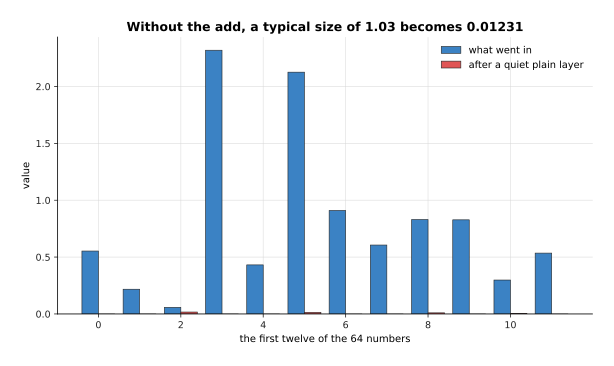

The same weights in a plain layer shrink the typical size from 1.033 to 0.012,
which leaves almost nothing.

So a residual block can do nothing, and a plain layer cannot. Adding a block to a
network that already works can leave it working, which means that a deeper
network starts out at least as good as a shallower one and can only improve from
there. That is what made stacks of fifty, a hundred and more layers trainable.
Almost every model in this book is built from blocks of this shape, including the
transformer block that the chapter [the
transformer](../06_the-transformer/02_a-transformer-block.md) explains part by
part.

---

## 7. Where to read next

- [The shape of the numbers](03_the-shape-of-the-numbers.md) is the next page,
  and it explains how the weight grid of section 1 is stored, what a matrix
  multiply is, and why the hardware that runs models is built around it.
- [What a network can learn](04_what-a-network-can-learn.md) explains why
  stacking these layers can follow any shape at all, and it introduces the
  convolution that section 2 compared a fully connected layer against.
- [A transformer block](../06_the-transformer/02_a-transformer-block.md) is the
  block of section 6 as it is actually built today, with attention inside it.
- [Normalisation and stability](../04_making-training-work/02_normalisation-and-stability.md)
  explains the rescaling step that keeps the numbers of section 6 from growing.
- [Backpropagation](../03_how-training-works/03_backpropagation.md) explains the
  training problem that residual connections were invented to solve.
- [Inside a neural network](../../07_learned-models/01_what-models-are/03_inside-a-neural-network.md)
  gives the same layer ideas in short, next to the catalogue of models that use
  them.

---

## 8. Using it in Python

A layer, a stack of layers and a residual block are each a few lines of PyTorch.
The code below builds the layer of section 1 with the same weights, counts its
parameters, counts a bigger stack from section 5, and wraps a block in the
residual addition of section 6.

```python
import torch
from torch import nn

layer = nn.Linear(3, 4)                     # section 1: four neurons, three inputs each
with torch.no_grad():                       # the same weights this page used
    layer.weight.copy_(torch.tensor([[-2.0, 1.5, 0.8], [2.0, -1.0, 0.0],
                                     [0.0, 2.0, -1.5], [-1.0, -1.0, 1.0]]))
    layer.bias.copy_(torch.tensor([0.5, 0.2, -0.4, 0.3]))

readings = torch.tensor([[0.42, 0.55, 0.30]])
sums = layer(readings)[0]                   # section 1: the four weighted sums
print([f"{v:.3f}" for v in sums])           # ['0.725', '0.490', '0.250', '-0.370']
print([f"{v:.3f}" for v in torch.relu(sums)])   # ['0.725', '0.490', '0.250', '0.000']
print(sum(p.numel() for p in layer.parameters()))   # 16

layers = []                                 # section 5: a stack of 8 layers of 1024
for _ in range(8):
    layers += [nn.Linear(1024, 1024), nn.ReLU()]
stack = nn.Sequential(*layers)
print(sum(p.numel() for p in stack.parameters()))   # 8396800

class Block(nn.Module):                     # section 6: one residual block
    def __init__(self, width):
        super().__init__()
        self.inner = nn.Sequential(nn.Linear(width, width), nn.ReLU())

    def forward(self, x):
        return x + self.inner(x)            # the addition is the whole idea
```

The library gives you the weight grid, the bias, the multiplying and the adding,
and `nn.Sequential` gives you the stacking. So a network of 8 layers is one line,
and its parameter count comes back as 8,396,800, which is the number section 5
counted. The residual block needs a class of its own only because
`nn.Sequential` passes each output straight on and has nowhere to keep the input.

What you decide is the shape. You choose the width of each layer and how many
layers there are, which sections 4 and 5 weighed up. You choose whether the
layers are fully connected or one of the special kinds that the next pages
describe. You also choose whether to wrap each layer in a residual addition, and
for anything deeper than a few layers the answer is yes.

What you do not decide is any of the numbers inside. The weights above were
copied in by hand so that the printout matches this page. In every real model
they start as small random values and are changed by training, which the chapter
[how training
works](../03_how-training-works/01_the-score-of-being-wrong.md) explains from
the beginning.
