# The shape of the numbers

The page before this one, [layers and depth](02_layers-and-depth.md), put neurons
into layers. It described a fully connected layer as a group of neurons that all
read the same inputs. That description is true, but it hides something a programmer
needs. It never says how the numbers are arranged inside the computer. It also never
says what single piece of arithmetic the layer performs.

This page answers four questions, in this order. First, what is the one word that
covers a single number, a list, a grid and a stack of grids, and how is the
arrangement written down? Second, what does a fully connected layer really do, worked
out in full on a small example, and how many parameters a whole model made of such
layers holds? Third, why are graphics cards built for exactly that one operation, and
why do examples go through a layer in groups? Fourth, how many
bits does one number get, and how many gigabytes does a model then need?

This page is for a reader who has already read [one neuron](01_one-neuron.md) and
[layers and depth](02_layers-and-depth.md). It therefore assumes you know what a
neuron, a weight, a bias, an activation function, a rectified linear unit (ReLU), a
layer, depth and width are. It assumes nothing about how computers store numbers.
The only arithmetic here is multiplying, adding and counting.

Nothing on this page is about learning. How a network is told that it is wrong
belongs to the next chapter, which opens with
[the score of being wrong](../03_how-training-works/01_the-score-of-being-wrong.md).
Every number in the pictures was worked out by the script
[`inside_a_network_2.py`](../../diagrams/inside_a_network_2.py). That script prints
every number it draws, so you can check them. The small numbers in the worked
examples are made up, because small numbers are easier to follow by hand.

## Contents

1. [One word for a number, a list, a grid and a stack](#1-one-word-for-a-number-a-list-a-grid-and-a-stack)
2. [A fully connected layer is a matrix multiply](#2-a-fully-connected-layer-is-a-matrix-multiply)
3. [Why the hardware is built for this one operation](#3-why-the-hardware-is-built-for-this-one-operation)
4. [The batch, and why examples travel in groups](#4-the-batch-and-why-examples-travel-in-groups)
5. [How many bits one number gets](#5-how-many-bits-one-number-gets)
6. [The memory bill, in gigabytes](#6-the-memory-bill-in-gigabytes)
7. [Where to read next](#7-where-to-read-next)
8. [Using it in Python](#8-using-it-in-python)

---

## 1. One word for a number, a list, a grid and a stack

A layer takes numbers in and gives numbers out. Those numbers always arrive arranged
in some way. So the first thing to settle is the word for the arrangement. The word
is **tensor**. A tensor is a block of numbers of the same kind, arranged in a regular
way. One number on its own is a tensor. A list of numbers is a tensor. A grid of
numbers is a tensor. A stack of grids is a tensor as well. One word covers all four
cases, and that is useful, because the library can then treat all four the same way.

The next picture shows those four cases, each one filled with numbers a robot really
handles.


The same word, tensor, covers one number, a list of seven joint angles, a grid of 64 brightness numbers and a stack of three such grids.

What tells those four cases apart is the **shape**. The shape is the list of how many
numbers the tensor holds along each direction. The single number has the shape `()`,
because it has no directions at all. The seven joint angles have the shape `(7,)`.
The small grey picture has the shape `(8, 8)`, so it holds 8 times 8, which is 64
numbers. The colour version has the shape `(3, 8, 8)`, because it is three such grids
stacked together, one for red, one for green and one for blue. That comes to 192
numbers. In general, the numbers in a shape multiply together to give how many
numbers the tensor holds in all.

The table below lists five shapes that a robot model really handles. Read it one row
at a time. Each row gives a shape, says what that shape holds, counts the numbers in
it, and turns that count into bytes. A byte is the unit computers measure memory in,
and here every number takes four bytes. Section 5 explains why four.


Five real shapes a robot model handles, with how many numbers each holds and how much memory that takes at four bytes a number.

One reading of a seven-joint arm is 7 numbers, which is 28 bytes. One colour photo of
224 rows by 224 columns has the shape `(3, 224, 224)` and holds 150,528 numbers,
which is 602,112 bytes. Eight of those photos together have the shape
`(8, 3, 224, 224)` and hold 1,204,224 numbers, which is 4.82 megabytes. A megabyte is
a million bytes. The order of the numbers inside a shape is a decision somebody made,
and not a law of nature. For example, a photo could equally well be stored as
`(224, 224, 3)`, with the three colours last instead of first. All that matters is
that the program and the layer agree on the order.

Changing the shape without changing the numbers is called **reshaping**. The next
picture follows the same 24 numbers through three different shapes.


The same 24 numbers seen as the shape (24,), the shape (4, 6) and the shape (2, 3, 4), kept in the same order throughout.

Reshaping costs nothing, because the numbers do not move. Follow 0 to 23 across that
drawing and you can see this. As `(4, 6)` the second row holds 6, 7, 8, 9, 10 and 11.
As `(2, 3, 4)` the number in the second grid, third row, fourth column is 23, which is
the last of the 24. In both cases the numbers are in the same order as in the plain
list. Only the way of counting them changed.

The reason reshaping is free is worth seeing directly. Memory is one long line of
places, counted from 0. A shape is only a rule for working out which place to look
in. The next picture draws that rule for a grid of shape `(4, 6)`.


The grid position at row 1 and column 2 lands at place 1 x 6 + 2 = 8 in the line, because each row is six places long.

Each row of that grid is six places long. So stepping along a row moves one place,
and stepping down a column skips six places. Row 1 and column 2 therefore sits at
place 1 x 6 + 2, which is place 8. Row 3 and column 5 sits at place 3 x 6 + 5, which
is place 23. Now that the numbers have a name and an arrangement, the next section
can say what a layer does to them.

---

## 2. A fully connected layer is a matrix multiply

Section 1 gave the arrangement. This section says what the arrangement is for,
because a fully connected layer turns out to be one single operation on two tensors,
rather than a crowd of separate neurons. That operation is called a **matrix
multiply**. Here the word matrix means nothing more than a grid of numbers, which is
a tensor of shape `(rows, columns)`.

The picture below works one small layer out in full, with every product written down.


One fully connected layer worked out in full: twelve multiplies, three row totals, three biases added and three ReLUs applied.

The weights and inputs in that picture are made up, so that they are easy to follow.
Take the first row. The weights +0.5, -0.2, +0.8 and +0.1 meet the inputs 2, 1, -1
and 3. That gives the products +1.0, -0.2, -0.8 and +0.3, which add up to 0.30. The
bias of +0.10 brings the total to 0.40. That total is above 0, so the ReLU leaves it
alone. The second neuron reaches -1.90 after its bias is added, and -1.90 is below 0,
so its ReLU gives 0.00. The third neuron reaches 3.35. Notice that each row of the
twelve products is one neuron's share of the work. Computing every row at once is
exactly what a matrix multiply does.

A matrix multiply refuses to run when the two grids do not fit together. The next
picture shows the rule that decides this.


The rule for a matrix multiply: the inner numbers of the two shapes have to agree, and the two outer numbers become the shape of the answer.

That rule is worth saying slowly, because nearly every error message a beginner meets
here is this rule being broken. A tensor of shape `(2, 4)` times one of shape `(4, 3)`
gives shape `(2, 3)`. This works because each of the 4 numbers in a row finds a
partner in a column. The same `(2, 4)` cannot be multiplied by a `(3, 3)`, because
each row offers 4 numbers while each column offers only 3. The library therefore
refuses, rather than guessing which numbers to drop.

The rule is written for two grids, and not for a grid and a list, because real layers
handle several examples at the same time. The next picture sends two examples through
one layer in one multiply.


Two examples go through the same layer in one multiply, and the marked total comes from one row of inputs paired with one column of weights.

Follow the marked cell in that picture. There the second example meets the third
neuron. The arithmetic is (0 x 0.7) + (2 x 0.4) + (1 x -0.6) + (-1 x 0.3), which
comes to -0.10. The bias of 0.05 brings it to -0.05, and the ReLU turns that into
0.00. The important point is that no total ever mixes the two examples. That is what
lets a network take a group of examples in one operation without the examples
affecting one another.

The size of the operation follows from two numbers only. Those two numbers are how
many inputs the layer has and how many neurons it has. The cost is measured in
multiply-adds. A **multiply-add** is one multiplication whose result is added into a
running total, and it is the single step that the hardware counts. The chart below
counts weights and multiply-adds for four layer sizes.


A fully connected layer costs one weight and one multiply-add for every pairing of an input with a neuron, so both counts are the two sizes multiplied together.

Read the chart with three examples in mind. A layer taking 7 joint angles into 64
neurons has 7 x 64 = 448 weights, plus 64 biases, so it has 512
[parameters](../01_what-learning-means/03_what-a-model-is.md). A layer of 768
inputs into 3,072 neurons, which is a common size inside a large model, has 2,362,368
parameters and does 2,359,296 multiply-adds for one example. A layer taking a
flattened colour photo of 150,528 numbers into 1,000 neurons has 150,528,000 weights.
That last number is the subject of the next page, and it is also why this arithmetic
has to be fast.

Those counts are for one layer. A model is a stack of layers, so its parameter count
is the same sum done once for each layer and then added up. The formula is worth
writing on its own, because every count on this page comes from it. A fully connected
layer of n inputs into m neurons holds n x m weights, because every input meets every
neuron, and m biases, because every neuron has one. So the layer holds n x m + m
parameters. The smallest model there is, a fitted straight line, is one layer of 1
input into 1 output, so it holds 1 x 1 + 1 = 2 parameters: the slope, which is the
weight, and the offset, which is the bias.

The picture below does that sum for a model small enough to count by eye: 3 inputs,
then 8 neurons, then 1 output.

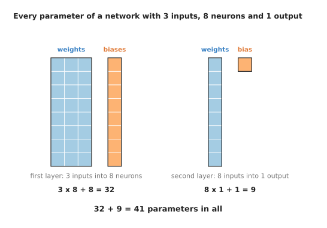

A network of 3 inputs, 8 neurons and 1 output holds 41 parameters, and every one of them is a square in this picture.

Work that through with the picture in front of you. The first layer has 3 inputs and
8 neurons, so it holds 3 x 8 = 24 weights and 8 biases, which is 32 parameters. The
second layer has 8 inputs, because the 8 neurons of the first layer are what it
reads, and it has 1 neuron, so it holds 8 x 1 = 8 weights and 1 bias, which is 9
parameters. The model holds 32 + 9 = 41 parameters in all.

The same sum on a bigger model gives a much bigger answer, and nothing else about it
changes. Take a network that reads a 64 by 64 grey picture through two layers of 256
neurons and gives one number. The picture is flattened into a list first, as section
1 described, so the first layer has 64 x 64 = 4,096 inputs. The chart below does the
sum one layer at a time.

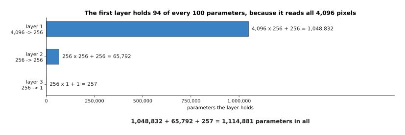

The first layer holds 94 of every 100 parameters in this network, because it is the layer that reads all 4,096 pixels.

Here is that sum written out. The first layer is 4,096 inputs into 256 neurons, so it
holds 4,096 x 256 = 1,048,576 weights and 256 biases, which is 1,048,832 parameters.
The second layer is 256 into 256, so it holds 256 x 256 = 65,536 weights and 256
biases, which is 65,792. The third layer is 256 into 1, so it holds 256 weights and 1
bias, which is 257. Those three add up to 1,048,832 + 65,792 + 257 = 1,114,881
parameters. Nearly all of them sit in the first layer, and the reason is the 4,096 in
its first factor.

The largest models are counted the same way, with one difference. They are built out
of a repeated block rather than out of one layer after another, so the count is one
block's count multiplied by the number of blocks. Take a stack of 48 blocks, each
2,048 numbers wide. The picture below counts one of those blocks.

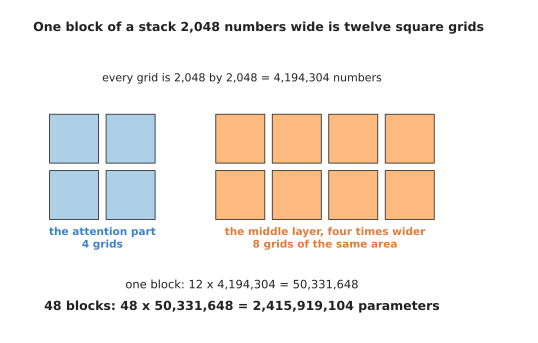

One block holds twelve grids of 2,048 by 2,048, which is 50,331,648 numbers, so 48 blocks hold 2,415,919,104.

Where the twelve comes from is the only part of that count which is not obvious. Four
of the grids belong to the attention part of the block. The other eight belong to the
block's middle layer, whose middle is four times the width: a grid of 2,048 by 8,192
and a grid of 8,192 by 2,048 cover between them the same area as eight grids of 2,048
by 2,048. [A transformer block](../06_the-transformer/02_a-transformer-block.md) is
the page that explains what those grids do. So one grid holds 2,048 x 2,048 =
4,194,304 weights, one block holds 12 x 4,194,304 = 50,331,648, and 48 blocks hold
48 x 50,331,648 = 2,415,919,104 parameters. That count is of the grids only. The two
normalisations in each block hold 48 x 2 x 2,048 = 196,608 more, which is one part in
12,288 and changes none of the figures above.

The same two numbers also say how much arithmetic one answer takes. A layer does one
multiply-add for every pairing of an input with a neuron, and a multiply-add is one
multiplication and one addition. The bias costs no extra addition, because it is the
value that the running total starts from. So a layer of n inputs into m neurons does
n x m multiply-adds for one example, which is n x m multiplications and n x m
additions.

A fitted straight line is the smallest case of that. It is a layer of 1 input into 1
output, so it does 1 x 1 = 1 multiply-add: one multiplication by the slope and one
addition of the offset, which is 2 operations. A model of 3 inputs into 1 output does
3 x 1 = 3 multiply-adds, which is 6 operations. The tiny network above does
3 x 8 + 8 x 1 = 32 multiply-adds, which is 64 operations. The picture network does
1,048,576 + 65,536 + 256 = 1,114,368 multiply-adds, which is 2,228,736 operations.
Notice that the multiply-add count is the weight count. The biases are the only
parameters that do not each bring a multiply-add with them.

Training costs very much more than one answer, and the part of it that this page can
count is the forward passes. One pass over the examples sends each example through
the model once, so the arithmetic of the forward passes is passes x examples x the
cost of one answer. Training that model of 3 inputs over 400 passes through 800
examples therefore does at least 400 x 800 x 6 = 1,920,000 multiplications and additions,
which is 400 x 800 = 320,000 times the cost of one answer. The rest of the cost is
working out which way to move each parameter, and this page has no formula for that,
so it gives no total for a whole training run.
[Gradient descent](../03_how-training-works/02_gradient-descent.md) and
[the training loop](../03_how-training-works/04_the-training-loop.md) are where that
part is counted.

---

## 3. Why the hardware is built for this one operation

Section 2 showed that a layer is one matrix multiply. This section explains why that
is good news for the machine. The reason is that a matrix multiply does a great deal
of arithmetic on very few numbers. Moving numbers about is the slow part of a
computer, rather than the arithmetic itself, so an operation that moves few numbers
and computes a lot is the kind of operation hardware designers want.

The plot below measures that idea. It counts how many multiply-adds the machine gets
for each number it has to fetch from memory.


The bigger the multiply, the more arithmetic the machine gets out of each number it fetches, while adding two grids together always gets one piece of arithmetic for every three numbers moved.

Count it for two square grids of size N. The multiply does N x N x N multiply-adds,
because each of the N x N squares of the answer needs N products added together.
Fetching the numbers needs only 3 x N x N places, which is the two grids going in and
the one grid coming out. At 16 by 16 that is 4,096 multiply-adds for 768 numbers
moved, which is 5.3 each. At 4,096 by 4,096 it is 68,719,476,736 multiply-adds for
50,331,648 numbers moved, which is 1,365.3 each. Now compare that with adding two
grids together. Adding does one addition for every three numbers moved, whatever the
size of the grids. A machine built for addition would therefore spend nearly all of
its time waiting for memory.

A second property of the matrix multiply matters as much as the first. The squares of
the answer do not depend on one another. The picture below shows what that means.

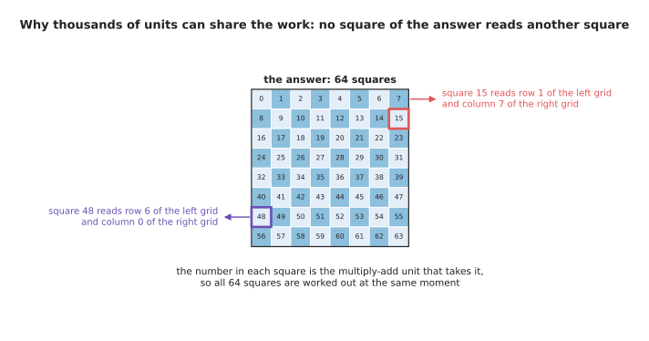

Each square of the answer needs one row of the left grid and one column of the right grid, and it needs nothing from any other square, so every square can be worked out at the same moment.

Because no square reads another square, a card with thousands of multiply-add units
can work on thousands of squares at the same moment. Nothing has to wait for anything
else. Neighbouring squares also share the numbers they need, and that is the second
saving. The next picture shows the sharing.


Working out a 4 by 4 block of the answer at once lets the machine fetch 4 rows and 4 columns and use each fetched number for four different answers.

How much that sharing saves depends on how big the block is. The table below counts
the saving. Read it one row at a time. Each row gives a block size, the numbers that
block loads, the multiply-adds it does, and the last column divides the second into
the third.

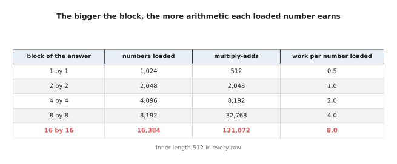

With an inner length of 512, a single square of the answer earns 0.5 multiply-adds per number loaded, while a 16 by 16 block earns 8.0.

Read that table as a trade. One square on its own loads 1,024 numbers and does 512
multiply-adds, which is 0.5 pieces of arithmetic for each number loaded. A 16 by 16
block loads 16,384 numbers and does 131,072 multiply-adds, which is 8.0 each, sixteen
times better. That is why libraries work in blocks, and it is also why cards
advertise units that handle a small block in one instruction.

The last reason the hardware is shaped this way is that there is almost nothing else
for it to do. The chart below counts every piece of arithmetic in a block of two
layers with a ReLU between them.


For one example through a block of 768 inputs into 3,072 neurons and back to 768, the two matrix multiplies are 4,718,592 multiply-adds while everything else is 6,912.

So 99.85 per cent of the arithmetic in that block is the one operation. Making the
block wider makes the share larger still, as the next plot shows.

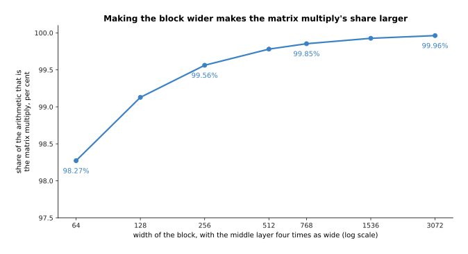

A narrow block of 64 inputs into 256 neurons and back is 98.27 per cent matrix multiply, and a wide block of 3,072 into 12,288 and back is 99.96 per cent.

The share rises because the matrix multiplies grow with the width multiplied by
itself, while the bias additions and the ReLU comparisons grow only with the width.
So making models bigger makes the one operation matter more, not less. There is one
thing that spoils this bargain, and that is a multiply too small to be worth the trip
to memory. Avoiding small multiplies is what the batch is for.

---

## 4. The batch, and why examples travel in groups

Section 3 left a problem. A matrix multiply pays for itself when it is large, but one
example through one layer is not large. The reason is that one example is a list
rather than a grid, so the multiply has only one row to work on. The answer is to
stack several examples together into a grid and send them through in one operation.
The number of examples in that stack is called the **batch**.

The picture below does this with four readings of a robot arm.


Four readings of a seven-joint arm go through the same layer in one multiply, and the answer keeps one row for each reading.

The four readings in that picture are simulated. They were drawn at random from the
range a joint can turn through, and the weights are made up as well. The readings
form a tensor of shape `(4, 7)`, the weights a tensor of shape `(7, 3)`, and the
answer comes out with the shape `(4, 3)`. So the batch is the first number of the
shape. It is the one number in a shape that says nothing about the problem being
solved and everything about how the work is packaged.

What a batch buys is that the weights are fetched once for the whole group, instead
of once for each example. The plot below measures that saving.


For a layer of 768 inputs and 3,072 neurons, sending the examples through in groups divides the memory traffic for each one by roughly the size of the group.

At a batch of 1 the machine moves 2,363,136 numbers for the one example, and nearly
all of them are weights. It gets 1.0 multiply-adds out of each number moved. At a
batch of 32 it moves 77,568 numbers for each example and gets 30.4 multiply-adds out
of each number. At a batch of 256 it moves 13,056 numbers for each example and gets
180.7. The dashed line in that plot is a floor the batch cannot push through. That
floor is the 768 + 3,072 = 3,840 numbers that carry one example in and its answer
out, and every example needs its own copy of those.

The same saving looks even plainer when the total traffic is drawn for a fixed number
of examples.

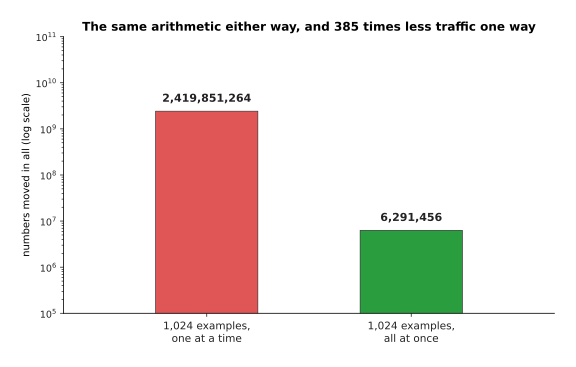

The same 1,024 examples through the same layer: sending them one at a time moves 385 times as many numbers as sending them together, for exactly the same arithmetic.

The chart below says the same thing from the other side. It splits the traffic into
the part that is weights and the part that is examples.

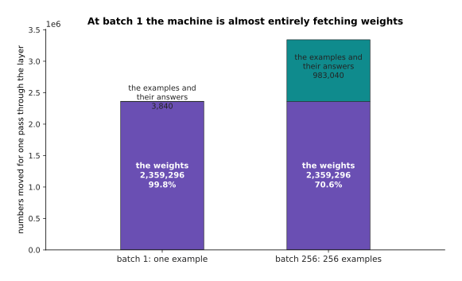

At a batch of 1, fetching the weights is 99.8 per cent of the memory traffic, and at a batch of 256 it is 70.6 per cent.

A bigger batch also costs something, and the cost is memory. The numbers that pass
through the layers have to be held somewhere, and there is one copy of them for every
example in the group. The next picture counts those numbers for one photo going
through a small picture network of four stages.

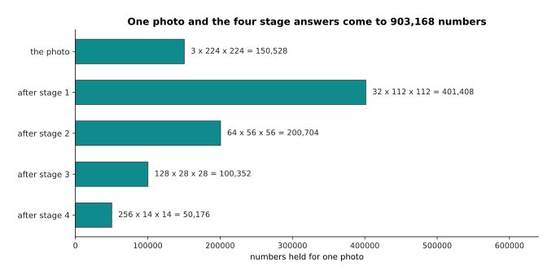

The photo itself and the answers of the four stages come to 903,168 numbers, which is 3.61 megabytes at four bytes a number.

The filters of that same network hold only 388,416 numbers, which is 1.55 megabytes,
and that figure does not change with the batch. The numbers passing through do change
with the batch, and the plot below shows how fast.


The weights of this small picture network take 1.55 megabytes whatever the batch, while the numbers passing through take 3.61 megabytes for every photo in the group.

So a batch of 32 needs 116 megabytes for the numbers passing through, and a batch of
256 needs 925 megabytes. The model itself has not grown at all between those two
figures. Only the packaging changed.

This is why a robot and a training run want different batches. A training run can
choose a large batch, because the examples sit on a disk and nothing is waiting for
an answer. An arm that must decide thirty times a second is in a different position.
It holds exactly one camera picture at the moment it must decide, so its batch is 1,
and its card therefore spends most of its time fetching weights. That is the main
reason the same model is far less efficient on a robot than in a laboratory. The
usual way to repair it is to make each weight smaller, which is the subject of the
next section.

---

## 5. How many bits one number gets

Section 4 ended with the weights dominating the traffic. So this section asks how big
one weight has to be. Every number so far has been counted as four bytes, and four is
a choice rather than a law. A **byte** is eight bits, and a bit is one position
holding either 0 or 1. So the real question is how those bits are divided up inside
one number.

The picture below draws the division for the four formats that models actually use.


The four ways of spending the bits: one group of bits decides how big the number may be and another group decides how many digits it keeps.

Read the four bars from the top. **float32** spends 4 bytes. It uses 1 bit for the
sign, which says whether the number is above or below 0, then 8 bits for how big the
number may be, then 23 bits for its digits. Because of the 8 bits for size it reaches
about 3.4 x 10^38. Because of the 23 bits for digits it can tell two numbers apart
when they differ by 1 part in 8,388,608. **bfloat16** spends 2 bytes. It keeps the
same 8 bits for size and cuts the digits down to 7 bits. So it reaches just as high,
to about 3.39 x 10^38, but it can only tell two numbers apart when they differ by 1
part in 128. **float16** also spends 2 bytes, but it splits them 5 bits for size and
10 bits for digits. So it keeps more digits than bfloat16 and stops at 65,504.
**int8** spends 1 byte and is not a floating point format at all. It holds whole
numbers from -127 to 127, and one scale shared by the whole tensor turns those whole
numbers back into real values.

The word float comes from **floating point**, which means that the point in the
number is allowed to move. One format can therefore handle 0.000001 and 1,000,000. It
does this by keeping a fixed number of digits and recording separately how big the
number is. One consequence follows directly, and the plot below draws it.


Because each format keeps the same number of digits at every size, the gap between neighbouring numbers it can hold grows in step with the numbers themselves.

That consequence is that the gap between one number a format can hold and the next
grows with the numbers. Near 1, float32 can tell apart numbers 1.19 x 10^-7 apart,
float16 numbers 9.77 x 10^-4 apart, and bfloat16 only numbers 7.81 x 10^-3 apart.
Near 1,000 those gaps have each grown a thousandfold, to 6.10 x 10^-5, to 0.5 and to
4. So bfloat16 cannot tell 1,000 from 1,002. That sounds alarming at first. However,
a weight is one small vote among thousands of weights, and the rounding errors of
different weights partly cancel one another.

How much they cancel has a measurable answer, and the chart below measures it.


Two hundred thousand simulated weights rounded to each format, and one real multiply of a 256 by 512 grid with a 512 by 256 grid done in each, measured against the exact answer.

Rounding 200,000 simulated weights to bfloat16 moves each one by 0.14 per cent on
average, and it moves the answer of the multiply by 0.24 per cent. Rounding them to
float16 moves them by 0.018 per cent and the answer by 0.029 per cent, because
float16 keeps three more bits of digits than bfloat16. Turning the same numbers into
int8 is called quantising. It moves each weight by 1.10 per cent and the answer by
1.47 per cent, which is about eight times worse than bfloat16, and still small enough
that many models survive it.

That leaves one question open. If float16 keeps more digits than bfloat16 in the same
two bytes, why does most training now use bfloat16? The plot below gives the answer
by adding up 4,096 numbers in each format.


Adding up 4,096 simulated squares, float16 passes its largest number after 31 of them, while bfloat16 never overflows but loses the additions that are small beside the total.

The answer is that digits are not what runs out first. Range is. The 4,096 simulated
numbers in that plot were drawn at random and then squared, and their exact total is
10,041,758. float16 reaches its largest number, 65,504, after only 31 of them. Every
addition after that leaves it holding infinity, which is useless. bfloat16 never
overflows, but it finishes at 4,620,288, which is 54 per cent short of the true
total. The reason for that shortfall is that once the running total is large, each
new addition is too small for seven digits to notice.

Hardware designers drew one lesson from this. The lesson is to keep the stored
numbers small and the running totals large. The picture below shows the arrangement
that follows from it.

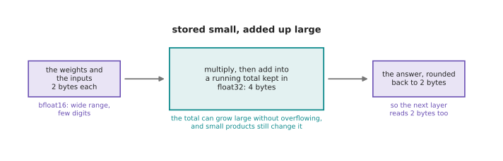

A card today stores the weights at two bytes a number, adds the products up in a four-byte total inside the multiplier, and writes the answer back at two bytes.

That arrangement has a name, which is mixed precision, and
[normalisation and stability](../04_making-training-work/02_normalisation-and-stability.md)
covers it in full. What choosing two bytes a number buys is the subject of the last
section, because it halves every figure in the bill.

---

## 6. The memory bill, in gigabytes

Section 5 gave the size of one number, and section 2 gave a way of counting the
numbers in a layer. Put those two together and you can settle how much memory a model
needs. That figure decides whether a model will run on a particular robot at all. The
sum is as simple as it looks. It is the parameter count multiplied by the bytes each
parameter takes.

The chart below does that sum for one model at the four formats of section 5.


Seven billion parameters multiplied by the bytes of each format: 28 gigabytes at float32, 14 at either two-byte format and 7 at int8.

Take a model with 7,000,000,000 parameters. That is a round number, chosen to stand
for a large model rather than copied from any real one. At float32 its parameters
take 7,000,000,000 x 4 = 28,000,000,000 bytes. That is 28 gigabytes, counting a
gigabyte as a thousand million bytes. An operating system often counts a gigabyte
slightly differently, as 1,073,741,824 bytes, and by that count the same model is
26.08 gigabytes. At either two-byte format the model takes 14 gigabytes. At int8 it
takes 7 gigabytes. At four bits each it would take 3.5 gigabytes, which is the subject
of
[making a model smaller and faster](../07_pretraining-and-adapting/04_making-a-model-smaller-and-faster.md).
Nothing about the model changed between those bars. Only the size of each number did.

The same sum works for any model size. The table below applies it to three sizes.
Read it one row at a time. Each row is one model size, and the four columns are the
four number formats.


The weights alone, for a small, a middling and a large model, at each of the four number formats.

A small robot model of 25 million parameters takes 100 megabytes at float32 and 25
megabytes at int8. It therefore fits anywhere, and for it the format hardly matters.
A middling model of 350 million parameters takes 1.4 gigabytes at float32 and 350
megabytes at int8, and that is the difference between needing a graphics card and not
needing one. A large model of 7 billion parameters takes 28 gigabytes at float32, and
there the choice of format stops being a detail.

The chart below makes that last point concrete by drawing four machines as lines
across the same bars.


The same 7 billion parameter model against four stated memory sizes: at float32 only the largest card holds it, at two bytes a number it fits a 16 gigabyte card, and at int8 it fits an 8 gigabyte robot computer.

The four dashed lines are stated sizes rather than measured ones. They were chosen
because they are the usual steps: a small computer on a robot with 8 gigabytes, a
laptop graphics card with 16, a desktop card with 24 and a large card with 48. At
float32 the model needs 28 gigabytes, so only the largest holds it. At bfloat16 it
needs 14 gigabytes and fits the laptop card. At int8 it needs 7 gigabytes and fits
the robot computer. That is one model and three different answers to the question of
where it can run, and the only thing that changed was how many bits each number was
given.

The same sum is worth doing at the small end of the scale as well, because it shows
where a file size starts to matter at all. The table below prices the four models
that section 2 counted. Read it one row at a time. Each row is one model, the second
column is its parameter count from section 2, and the last three columns are that
count multiplied by 4, by 2 and by 1.

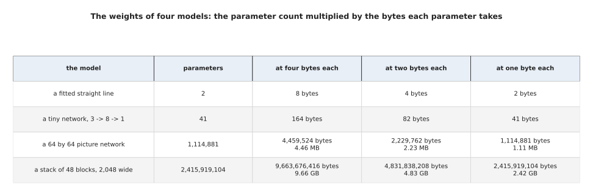

The four models of section 2, each priced at four bytes, two bytes and one byte a parameter.

Two of those rows are worth working through. The picture network holds 1,114,881
parameters, so at four bytes each it takes 1,114,881 x 4 = 4,459,524 bytes. Divide
that by a million, because a megabyte here is a million bytes, and it is 4.46
megabytes. At one byte each it takes 1,114,881 bytes, which is 1.11 megabytes. The
48-block stack holds 2,415,919,104 parameters, so at four bytes each it takes
2,415,919,104 x 4 = 9,663,676,416 bytes. Divide that by a thousand million and it is
9.66 gigabytes. At one byte each it is 2,415,919,104 bytes, which is 2.42 gigabytes.

Which unit is in use matters for those last two figures, so it is worth saying again.
This page counts a megabyte as a million bytes and a gigabyte as a thousand million
bytes, and every figure in this section follows that count. An operating system
counts a gigabyte as 1,073,741,824 bytes instead, and by that count the same two
files are 9.00 and 2.25 gigabytes rather than 9.66 and 2.42. Nothing about the model
differs between those pairs. Only the size of the unit does, so a figure in gigabytes
means nothing until the count of bytes in a gigabyte is stated beside it.

The two smallest models are in the table for contrast. The straight line's 2
parameters take 2 x 4 = 8 bytes, and the tiny network's 41 parameters take
41 x 4 = 164 bytes. Neither is a memory problem on any computer that exists. That is
the point of the table: the bill only becomes a decision somewhere between a million
parameters and a thousand million.

Two honest warnings go with this sum. The first warning is that the weights are not
the whole bill, because the numbers passing through the layers need room as well, as
section 4 showed. The picture below puts those two parts of the bill side by side for
the small picture network of section 4.

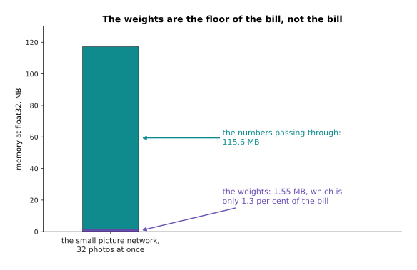

For that network at a batch of 32 photos, the weights are only 1.3 per cent of the memory actually needed.

The second warning is that training needs several times the memory of merely running
the model. Training keeps extra numbers for every parameter, and
[the training loop](../03_how-training-works/04_the-training-loop.md) explains which
ones and why. So treat the parameter count multiplied by the bytes as the floor of
the bill, rather than as the total.

---

## 7. Where to read next

- [What a network can learn](04_what-a-network-can-learn.md) is the next page, and
  it uses the shapes and the matrix multiply from here to ask what a stack of layers
  can actually fit, and why a photo needs a different kind of layer.
- [The score of being wrong](../03_how-training-works/01_the-score-of-being-wrong.md)
  opens the next chapter with the number that says how wrong an answer is, which is
  the thing this page deliberately left out.
- [Normalisation and stability](../04_making-training-work/02_normalisation-and-stability.md)
  returns to the number formats of section 5 and explains mixed precision.
- [Pictures, sound and robot states](../05_turning-the-world-into-numbers/02_pictures-sound-and-robot-states.md)
  takes the shapes of section 1 further, to depth pictures, point clouds and gripper
  states.
- [Scale, data and compute](../07_pretraining-and-adapting/02_scale-data-and-compute.md)
  takes this counting up to whole training runs and explains what a graphics card is.
- [Running a model on a robot](../../07_learned-models/10_making-models-work-on-an-arm/02_most-used/02_running-a-model-on-a-robot.md)
  is the catalogue page for the practical side of section 6.

---

## 8. Using it in Python

Everything on this page is one or two lines in PyTorch, because the library's whole
job is to hold tensors and multiply them. The code below follows the sections in
order. Every number in a comment is the number that the line really prints.

```python
import torch

# section 1: eight colour photos as one tensor, and what its shape means
photos = torch.zeros(8, 3, 224, 224)
print(photos.shape)                            # torch.Size([8, 3, 224, 224])
print(photos.numel())                          # 1204224
print(photos.element_size(), photos.dtype)     # 4 torch.float32
print(photos.numel() * photos.element_size())  # 4816896 bytes, which is 4.82 MB

# section 1 again: reshaping keeps the numbers and changes only the counting
print(photos.reshape(8, -1).shape)             # torch.Size([8, 150528])

# section 2: a fully connected layer is the matrix multiply plus the biases
layer = torch.nn.Linear(768, 3072)
print(layer.weight.shape)                      # torch.Size([3072, 768])
print(sum(p.numel() for p in layer.parameters()))   # 2362368

# section 4: the batch is the first number of the shape, and goes through at once
print(layer(torch.zeros(32, 768)).shape)       # torch.Size([32, 3072])

# section 5: the same layer with two bytes a number instead of four
small = layer.half()
print(small.weight.dtype, small.weight.element_size())  # torch.float16 2
print(sum(p.numel() for p in small.parameters()) * 2)   # 4724736 bytes

# section 6: the memory bill for a model of seven billion parameters
print(7_000_000_000 * 2 / 1e9)                 # 14.0 gigabytes at two bytes each
```

The library does the hard parts for you. It keeps the shape and the format of every
tensor and checks them at each step, so the refusal in section 2 arrives as a
readable message rather than as nonsense in the answer. It owns the blocked matrix
multiply of section 3, which was written by hand for each kind of card by the people
who made the card. It also carries the batch through every layer without you writing
a loop over examples, which is why `layer(batch)` reads the same whether the batch is
1 or 1,024.

What you still decide is the three things this page measured. You choose the batch,
trading the memory of section 4 against the traffic saving of the same section, and
on a robot that choice is often forced to 1. You choose the number format, trading
the memory of section 6 against the rounding of section 5, which in practice means
bfloat16 for almost everything and int8 only after measuring what it costs. You also
choose the shapes, because the width of a layer sets both the parameter count and the
multiply-add count.

One detail will confuse you in other people's code. PyTorch stores the weights of
`nn.Linear` with the shape `(out_features, in_features)`. That is `(3072, 768)` in
the code above, rather than `(768, 3072)`. PyTorch transposes those weights
internally when it multiplies, so the printed shape looks backwards until you know
this.
