# The shape of the numbers

The page before this one, [layers and depth](02_layers-and-depth.md), put neurons
into layers and described a fully connected layer as a group of neurons that all
read the same inputs. That is true, but it hides something a programmer needs,
because it never says how the numbers are arranged in the computer or what single
piece of arithmetic the layer performs.

This page answers four questions in order. What is the one word that covers a single
number, a list, a grid and a stack of grids, and how is the arrangement written
down? What does a fully connected layer really do, worked out in full on a small
example? Why are graphics cards built for exactly that operation, and why do
examples go through in groups? And how many bits does one number get, and how many
gigabytes does a model then need?

It is for a reader who has read [one neuron](01_one-neuron.md) and
[layers and depth](02_layers-and-depth.md), so it assumes you know what a neuron, a
weight, a bias, an activation function, a rectified linear unit (ReLU), a layer,
depth and width are. It assumes nothing about how computers store numbers, and the
only arithmetic here is multiplying, adding and counting.

Nothing here is about learning, because how a network is told it is wrong belongs to
the next chapter, which opens with
[the score of being wrong](../03_how-training-works/01_the-score-of-being-wrong.md).
Every number in the pictures was worked out by the script
[`inside_a_network_2.py`](../../diagrams/inside_a_network_2.py), which prints them
all, and the small numbers in the worked examples are made up.

## Contents

1. [One word for a number, a list, a grid and a stack](#1-one-word-for-a-number-a-list-a-grid-and-a-stack)
2. [A fully connected layer is a matrix multiply](#2-a-fully-connected-layer-is-a-matrix-multiply)
3. [Why the hardware is built for this one operation](#3-why-the-hardware-is-built-for-this-one-operation)
4. [The batch, and why examples travel in groups](#4-the-batch-and-why-examples-travel-in-groups)
5. [How many bits one number gets](#5-how-many-bits-one-number-gets)
6. [The memory bill, in gigabytes](#6-the-memory-bill-in-gigabytes)
7. [Where to read next](#7-where-to-read-next)
8. [Using it in Python](#8-using-it-in-python)

---

## 1. One word for a number, a list, a grid and a stack

A layer takes numbers in and gives numbers out, and those numbers always arrive
arranged in some way, so the first thing to settle is the word for the arrangement.
The word is **tensor**, which means a block of numbers of the same kind arranged in
a regular way. One number is a tensor, a list is a tensor, a grid is a tensor and a
stack of grids is a tensor, which is why one word is useful: the library can treat
all four the same way.

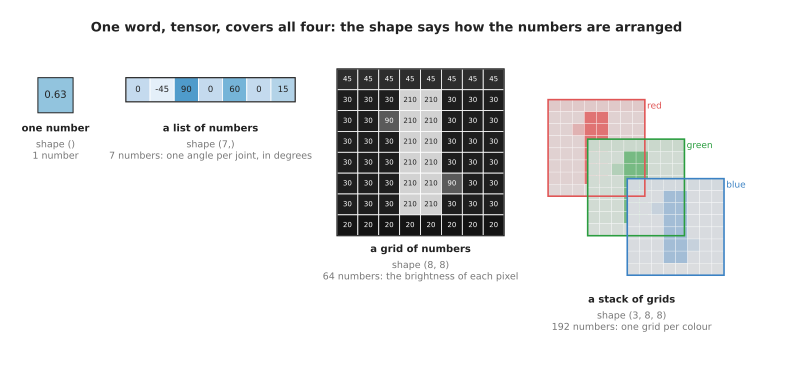

The same word, tensor, covers one number, a list of seven joint angles, a grid of 64 brightness numbers and a stack of three such grids.

What tells them apart is the **shape**, which is the list of how many numbers the
tensor holds along each direction. The single number has the shape `()`, the seven
joint angles have the shape `(7,)`, the small grey picture has the shape `(8, 8)`
and so holds 64 numbers, and the colour version has the shape `(3, 8, 8)`, three
such grids stacked for red, green and blue, which is 192 numbers. The numbers in a
shape multiply together to give how many numbers there are in all.

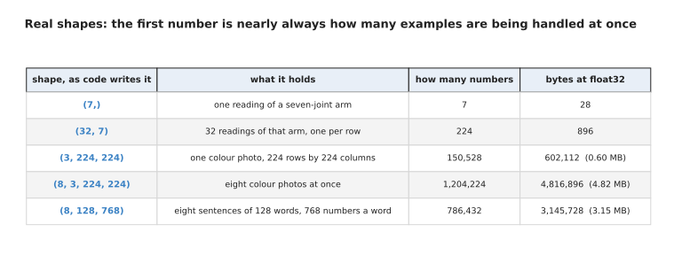

Five real shapes a robot model handles, with how many numbers each holds and how much memory that takes at four bytes a number.

Read that table a row at a time. One reading of a seven-joint arm is 7 numbers and
28 bytes. One colour photo of 224 rows by 224 columns has the shape `(3, 224, 224)`
and holds 150,528 numbers, which is 602,112 bytes, while eight of those photos
together have the shape `(8, 3, 224, 224)` and hold 1,204,224 numbers, or 4.82
megabytes. The order inside a shape is a decision somebody made rather than a law,
because a photo could equally be stored as `(224, 224, 3)`, and all that matters is
that the program and the layer agree.

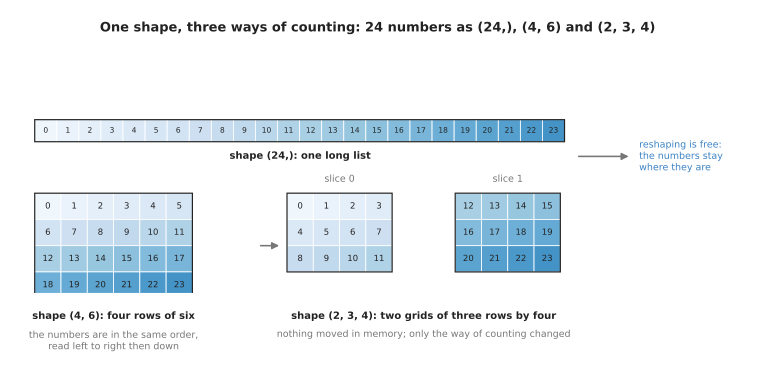

The same 24 numbers seen as the shape (24,), the shape (4, 6) and the shape (2, 3, 4), kept in the same order throughout.

Changing the shape without changing the numbers is called **reshaping**, and it
costs nothing because the numbers do not move. Follow 0 to 23 across that drawing:
as `(4, 6)` the second row holds 6, 7, 8, 9, 10 and 11, and as `(2, 3, 4)` the
number in the second grid, third row, fourth column is 23, which is the last of the
24.

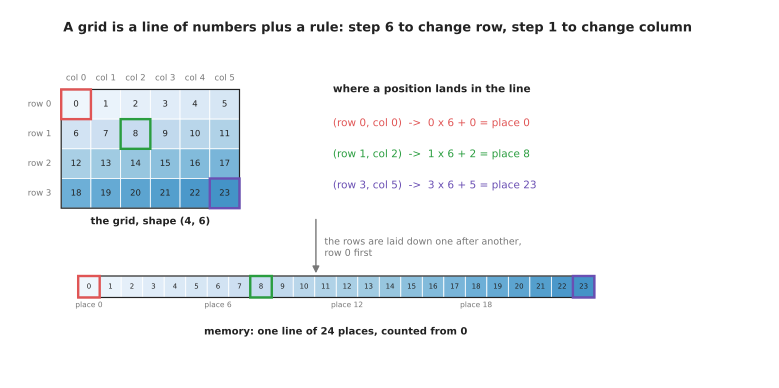

The grid position at row 1 and column 2 lands at place 1 x 6 + 2 = 8 in the line, because each row is six places long.

Reshaping is free because memory is one long line of places counted from 0, and a
shape is only a rule for working out which place to look in. For a grid of shape
`(4, 6)`, stepping along a row moves one place and stepping down a column skips six,
so row 3 column 5 sits at place 23. Now that the numbers have a name and an
arrangement, the next section can say what a layer does to them.

---

## 2. A fully connected layer is a matrix multiply

Section 1 gave the arrangement, and this section says what it is for, because a
fully connected layer turns out to be one operation on two tensors rather than a
crowd of separate neurons. That operation is called a **matrix multiply**, where
matrix means nothing more than a grid of numbers, a tensor of shape
`(rows, columns)`.

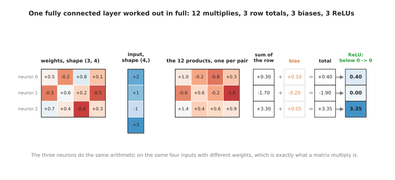

One fully connected layer worked out in full: twelve multiplies, three row totals, three biases added and three ReLUs applied.

The weights and inputs there are made up so that they are easy to follow. In the
first row the weights +0.5, -0.2, +0.8 and +0.1 meet the inputs 2, 1, -1 and 3,
giving the products +1.0, -0.2, -0.8 and +0.3, which add up to 0.30; the bias of
+0.10 makes 0.40, and because that is above 0 the ReLU leaves it. The second neuron
reaches -1.90 after its bias, so its ReLU gives 0.00, and the third reaches 3.35.
Each row of the twelve products is one neuron's share, which is exactly what a
matrix multiply computes.

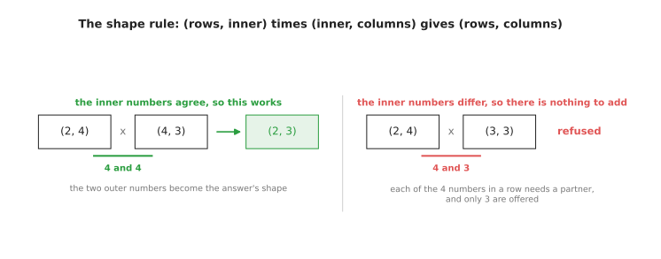

The rule for a matrix multiply: the inner numbers of the two shapes have to agree, and the two outer numbers become the shape of the answer.

That rule is worth saying slowly, because nearly every error message a beginner
meets here is this rule being broken. A tensor of shape `(2, 4)` times one of shape
`(4, 3)` gives shape `(2, 3)`, because each of the 4 numbers in a row finds a partner
in a column, while the same `(2, 4)` cannot be multiplied by a `(3, 3)`, because each
row offers 4 numbers and each column offers only 3, so the library refuses rather
than guessing.

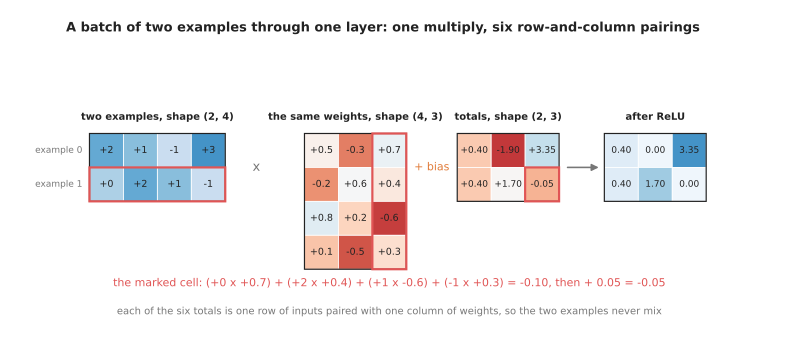

Two examples go through the same layer in one multiply, and the marked total comes from one row of inputs paired with one column of weights.

The rule is written for two grids rather than a grid and a list because real layers
handle several examples at once. In the marked cell, the second example meets the
third neuron: (0 x 0.7) + (2 x 0.4) + (1 x -0.6) + (-1 x 0.3) = -0.10, and the bias
of 0.05 makes -0.05, which the ReLU turns into 0.00. No total ever mixes the two
examples, which is what lets a network take a group of examples in one operation
without them affecting one another.

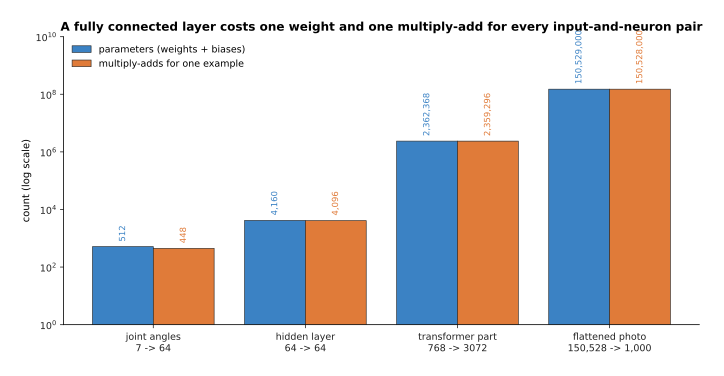

A fully connected layer costs one weight and one multiply-add for every pairing of an input with a neuron, so both counts are the two sizes multiplied together.

The size of the operation follows from two numbers only, how many inputs the layer
has and how many neurons, and a multiply-add means one multiplication whose result is
added into a running total, which is the single step the hardware counts. A layer
taking 7 joint angles into 64 neurons has 448 weights and 64 biases, so 512
[parameters](../01_what-learning-means/02_the-words-everyone-uses.md). A layer of 768 inputs into 3,072 neurons,
a common size inside a large model, has 2,362,368 parameters and does 2,359,296
multiply-adds for one example. A layer taking a flattened colour photo of 150,528
numbers into 1,000 neurons has 150,528,000 weights, which is the subject of the next
page and is also why this arithmetic has to be fast.

---

## 3. Why the hardware is built for this one operation

Section 2 showed that a layer is one matrix multiply, and this section explains why
that is good news for the machine, because a matrix multiply does a great deal of
arithmetic on very few numbers, and moving numbers about is the slow part of a
computer rather than the arithmetic itself.

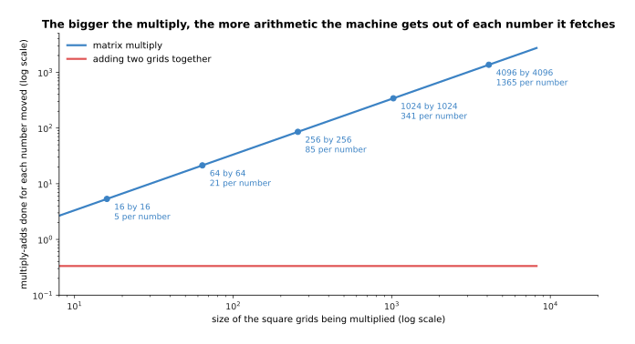

The bigger the multiply, the more arithmetic the machine gets out of each number it fetches, while adding two grids together always gets one piece of arithmetic for every three numbers moved.

Count it for two square grids of size N. The multiply does N x N x N multiply-adds,
because each of the N x N squares of the answer needs N products added, while
fetching needs only 3 x N x N, the two grids in and the one out. At 16 by 16 that is
4,096 multiply-adds for 768 numbers moved, 5.3 each, and at 4,096 by 4,096 it is
68,719,476,736 for 50,331,648, which is 1,365.3 each. Adding two grids together, by
contrast, does one addition for every three numbers moved whatever the size, and a
machine built for that work would spend nearly all its time waiting for memory.

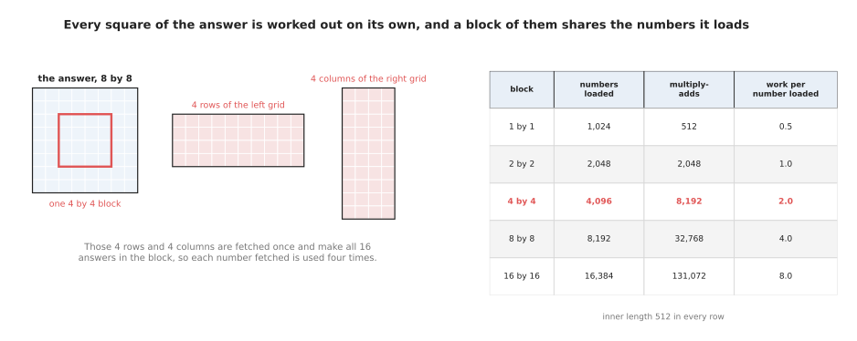

Working out a block of the answer at once lets the machine use each fetched number once for every row of the block.

A second property matters as much, which is that the squares of the answer do not
depend on one another, so a card with thousands of multiply-add units can work on
all of them at the same moment, and neighbouring squares share the numbers they
need. Read the table as a trade. With an inner length of 512, one square alone loads
1,024 numbers for 512 multiply-adds, which is 0.5 pieces of arithmetic per number
loaded, while a 16 by 16 block loads 16,384 numbers for 131,072 multiply-adds, which
is 8.0 each. That is why libraries work in blocks, and why cards advertise units
that handle a small block in one instruction.

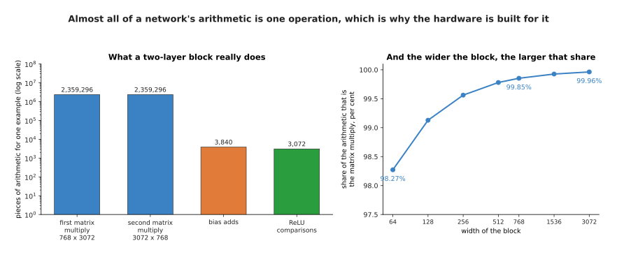

In a block of two layers with a ReLU between them, the two matrix multiplies are 99.85 per cent of all the arithmetic, and the share grows as the block gets wider.

The last reason the hardware is shaped this way is that there is almost nothing else
for it to do. For one example through a block of 768 inputs into 3,072 neurons and
back to 768, the two matrix multiplies are 4,718,592 multiply-adds while the bias
additions are 3,840 and the ReLU comparisons are 3,072, so 99.85 per cent of the
work is the one operation. A narrower block of 64 into 256 and back is 98.27 per
cent and a wider block of 3,072 into 12,288 and back is 99.96 per cent, so making
models bigger makes the share larger. The one thing that spoils the bargain is a
multiply too small to be worth the trip, and that is what the batch is for.

---

## 4. The batch, and why examples travel in groups

Section 3 left a problem, because a matrix multiply pays for itself when it is
large, and one example through one layer is not large, since one example is a list
rather than a grid. The answer is to stack several examples into a grid and send
them through together, and the number of examples in that stack is called the
**batch**.

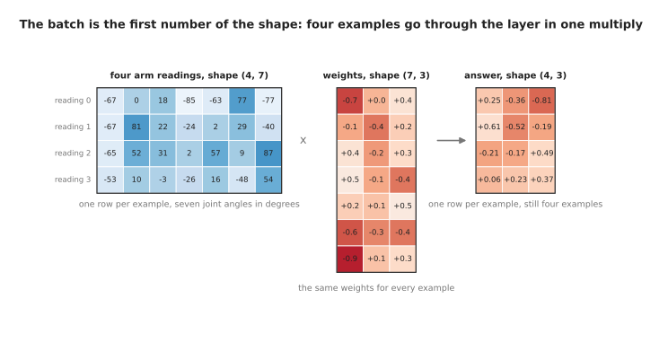

Four readings of a seven-joint arm go through the same layer in one multiply, and the answer keeps one row for each reading.

The four readings there are simulated, drawn at random from the range of a joint,
and the weights are made up too. The readings form a tensor of shape `(4, 7)`, the
weights one of shape `(7, 3)`, and the answer comes out as `(4, 3)`. The batch is the
first number of the shape, and it is the one number in a shape that says nothing
about the problem and everything about how the work is packaged.

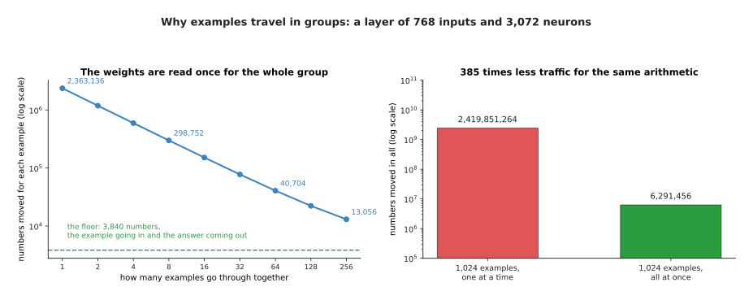

For a layer of 768 inputs and 3,072 neurons, sending the examples through in groups divides the memory traffic for each one by the size of the group.

What this buys is that the weights are fetched once for the whole group instead of
once for each example. At a batch of 1 the machine moves 2,363,136 numbers, nearly
all of them weights, and gets 1.0 multiply-adds out of each; at a batch of 32 it
moves 77,568 for each example and gets 30.4 out of each number; at a batch of 256 it
moves 13,056 for each example and gets 180.7. Put the other way round, 1,024
examples one at a time move 2,419,851,264 numbers while the same examples together
move 6,291,456, which is 385 times less traffic for the same arithmetic. The floor
in that picture is the 768 + 3,072 = 3,840 numbers that carry one example in and its
answer out, which no batch can remove.

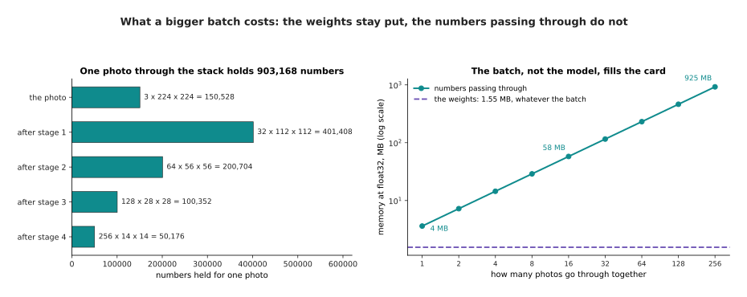

The weights of a small picture network take 1.55 megabytes whatever the batch, while the numbers passing through take 3.61 megabytes for every photo in the group.

A bigger batch also costs something, and the cost is memory. One colour photo of 224
by 224 through four stages of a small picture network produces 903,168 numbers in
all, which is 3.61 megabytes at four bytes a number, while the filters hold only
388,416 numbers, or 1.55 megabytes, whatever the batch. So a batch of 32 needs 116
megabytes for the numbers passing through and a batch of 256 needs 925 megabytes,
although the model has not grown at all.

This is why a robot and a training run want different batches. A training run can
choose a large batch, because the examples sit on a disk and nothing is waiting,
while an arm that must decide thirty times a second holds exactly one camera picture
when it must decide, so its batch is 1 and its card spends most of its time fetching
weights. That is the main reason the same model is far less efficient on a robot
than in a laboratory, and the usual fix is to make each weight smaller.

---

## 5. How many bits one number gets

Section 4 ended with the weights dominating the traffic, so this section asks how
big one weight has to be. Every number so far has been counted as four bytes, and
that is a choice rather than a law. A **byte** is eight bits, and a bit is one
position holding either 0 or 1, so the question is how the bits are split up.

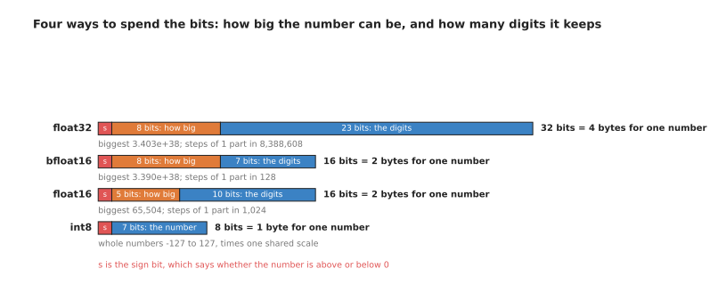

The four ways of spending the bits: one group of bits decides how big the number may be and another how many digits it keeps.

Read the four bars from the top. **float32** spends 4 bytes as 1 bit for the sign, 8
for how big the number is and 23 for its digits, so it reaches about 3.4 x 10^38 and
tells apart numbers one part in 8,388,608 different. **bfloat16** spends 2 bytes and
keeps the same 8 bits for size while cutting the digits to 7, so it reaches just as
high, to about 3.39 x 10^38, but tells apart numbers only one part in 128 different.
**float16** also spends 2 bytes but splits them 5 and 10, so it keeps more digits and
stops at 65,504. **int8** spends 1 byte and is not floating point at all, holding
whole numbers from -127 to 127 that one shared scale turns back into real values.

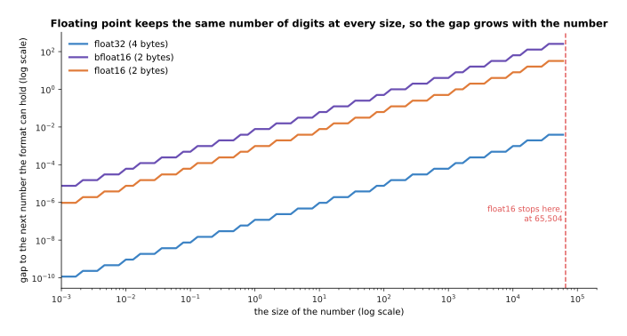

Because each format keeps the same number of digits at every size, the gap between neighbouring numbers it can hold grows in step with the numbers themselves.

The word float comes from **floating point**, which means the point in the number is
allowed to move, so one format handles 0.000001 and 1,000,000 by keeping a fixed
number of digits and recording separately how big the number is. The gap between one
number a format can hold and the next therefore grows with the numbers. Near 1,
float32 tells apart numbers 1.19 x 10^-7 apart, float16 numbers 9.77 x 10^-4 apart
and bfloat16 only 7.81 x 10^-3 apart, and near 1,000 those gaps have grown a
thousandfold, to 6.10 x 10^-5, 0.5 and 4, so bfloat16 cannot tell 1,000 from 1,002.
That sounds alarming until you remember that a weight is one small vote among
thousands and that the errors partly cancel.

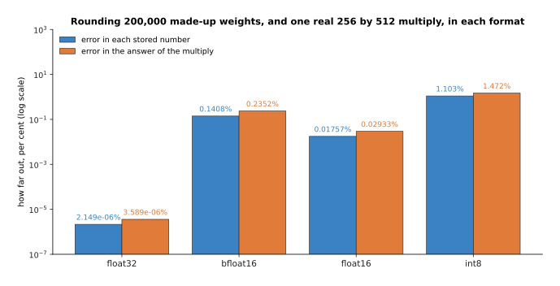

Two hundred thousand simulated weights rounded to each format, and one real multiply of a 256 by 512 grid with a 512 by 256 grid done in each, measured against the exact answer.

How much they cancel has a measurable answer. Rounding 200,000 simulated weights to
bfloat16 moves each one by 0.14 per cent on average and the answer of the multiply by
0.24 per cent, while float16 moves them by 0.018 and 0.029 per cent because it keeps
three more bits of digits. Turning the same numbers into int8, which is called
quantising, moves each weight by 1.10 per cent and the answer by 1.47 per cent, which
is ten times worse than bfloat16 and still small enough that many models survive
it.

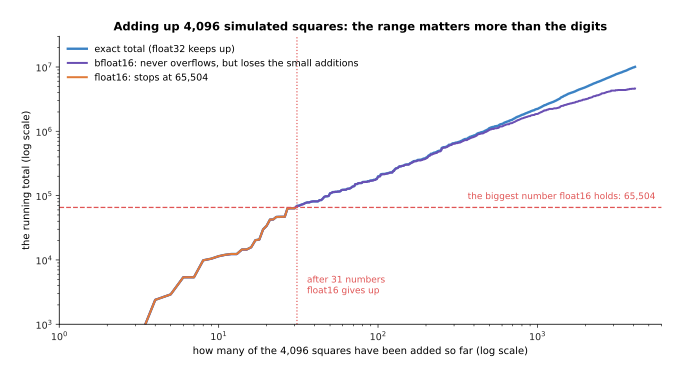

Adding up 4,096 simulated squares, float16 passes its largest number after 31 of them, while bfloat16 never overflows but loses the additions that are small beside the total.

So if float16 keeps more digits in the same two bytes, why does most training now
use bfloat16? Because digits are not what runs out first, range is. The 4,096
simulated numbers added there were drawn at random and squared, and their exact total
is 10,041,758. float16 reaches its largest number, 65,504, after only 31 of them, and
every addition after that leaves it holding infinity, while bfloat16 never overflows
but finishes at 4,620,288, which is 54 per cent short because once the total is large
each new addition is too small for seven digits to notice. The lesson hardware
designers drew is to keep the stored numbers small and the running totals large, so a
card today holds weights at two bytes and adds the products up in float32 inside the
multiplier, which
[normalisation and stability](../04_making-training-work/02_normalisation-and-stability.md)
covers under the name mixed precision. What choosing two bytes a number buys is the
subject of the last section, because it halves every figure in the bill.

---

## 6. The memory bill, in gigabytes

Section 5 gave the size of one number and section 2 a way of counting the numbers in
a layer, so the two together settle how much memory a model needs, which is the
number that decides whether it will run on a particular robot at all. The sum is as
simple as it looks, the parameter count multiplied by the bytes each parameter
takes.

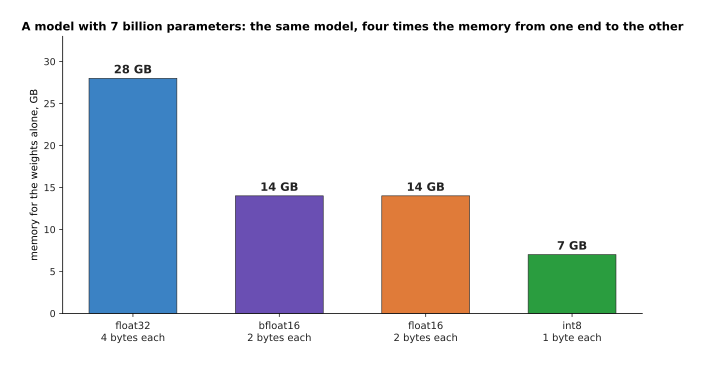

Seven billion parameters multiplied by the bytes of each format: 28 gigabytes at float32, 14 at either two-byte format and 7 at int8.

Take a model with 7,000,000,000 parameters, a round number chosen to stand for a
large model. At float32 its parameters take 7,000,000,000 x 4 = 28,000,000,000
bytes, which is 28 gigabytes counting a gigabyte as a thousand million bytes, or
26.08 of the larger gigabytes an operating system often shows. At either two-byte
format it is 14 gigabytes, at int8 it is 7, and at four bits each it would be 3.5,
which is the subject of
[making a model smaller and faster](../07_pretraining-and-adapting/04_making-a-model-smaller-and-faster.md).
Nothing about the model changed between those bars; only the size of each number
did.

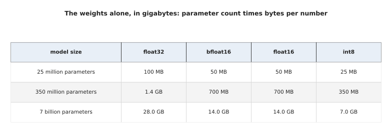

The weights alone, for a small, a middling and a large model, at each of the four number formats.

Read that table a row at a time. A small robot model of 25 million parameters takes
100 megabytes at float32 and 25 megabytes at int8, so it fits anywhere and the
format hardly matters. A middling model of 350 million parameters takes 1.4
gigabytes at float32 and 350 megabytes at int8, which is the difference between
needing a graphics card and not. A large model of 7 billion takes 28 gigabytes at
float32, and that is where the choice stops being a detail.

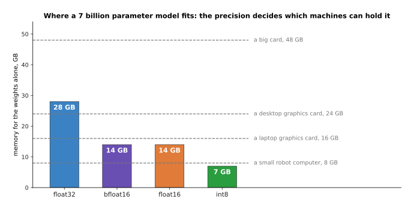

The same 7 billion parameter model against four stated memory sizes: at float32 only the largest card holds it, at two bytes a number it fits a 16 gigabyte card, and at int8 it fits an 8 gigabyte robot computer.

The four dashed lines are stated sizes rather than measured ones, chosen because
they are the usual steps: a small computer on a robot with 8 gigabytes, a laptop
graphics card with 16, a desktop card with 24 and a large card with 48. At float32
the model needs 28 gigabytes and only the largest holds it, at bfloat16 it needs 14
and fits the laptop card, and at int8 it needs 7 and fits the robot. One model,
three answers to the question of where it can run, and the only thing that changed
was how many bits each number was given.

Two honest warnings go with this sum. The weights are not the whole bill, because
the numbers passing through need room as well, as section 4 showed. Training needs
several times the memory of merely running the model, because it keeps extra numbers
for every parameter, which
[the training loop](../03_how-training-works/04_the-training-loop.md) explains. So
treat the parameter count multiplied by the bytes as the floor of the bill rather
than the total.

---

## 7. Where to read next

- [What a network can learn](04_what-a-network-can-learn.md) is the next page, and
  it uses the shapes and the matrix multiply from here to ask what a stack of layers
  can actually fit, and why a photo needs a different kind of layer.
- [The score of being wrong](../03_how-training-works/01_the-score-of-being-wrong.md)
  opens the next chapter with the number that says how wrong an answer is, which is
  the thing this page deliberately left out.
- [Normalisation and stability](../04_making-training-work/02_normalisation-and-stability.md)
  returns to the number formats of section 5 and explains mixed precision.
- [Pictures, sound and robot states](../05_turning-the-world-into-numbers/02_pictures-sound-and-robot-states.md)
  takes the shapes of section 1 further, to depth pictures, point clouds and gripper
  states.
- [Scale, data and compute](../07_pretraining-and-adapting/02_scale-data-and-compute.md)
  takes this counting up to whole training runs and explains what a graphics card is.
- [Running a model on a robot](../../07_learned-models/10_making-models-work-on-an-arm/02_most-used/02_running-a-model-on-a-robot.md)
  is the catalogue page for the practical side of section 6.

---

## 8. Using it in Python

Everything on this page is one or two lines in PyTorch, because the library's whole
job is to hold tensors and multiply them. The code below follows the sections in
order, and every number in a comment is the number the line really prints.

```python
import torch

# section 1: eight colour photos as one tensor, and what its shape means
photos = torch.zeros(8, 3, 224, 224)
print(photos.shape)                            # torch.Size([8, 3, 224, 224])
print(photos.numel())                          # 1204224
print(photos.element_size(), photos.dtype)     # 4 torch.float32
print(photos.numel() * photos.element_size())  # 4816896 bytes, which is 4.82 MB

# section 1 again: reshaping keeps the numbers and changes only the counting
print(photos.reshape(8, -1).shape)             # torch.Size([8, 150528])

# section 2: a fully connected layer is the matrix multiply plus the biases
layer = torch.nn.Linear(768, 3072)
print(layer.weight.shape)                      # torch.Size([3072, 768])
print(sum(p.numel() for p in layer.parameters()))   # 2362368

# section 4: the batch is the first number of the shape, and goes through at once
print(layer(torch.zeros(32, 768)).shape)       # torch.Size([32, 3072])

# section 5: the same layer with two bytes a number instead of four
small = layer.half()
print(small.weight.dtype, small.weight.element_size())  # torch.float16 2
print(sum(p.numel() for p in small.parameters()) * 2)   # 4724736 bytes

# section 6: the memory bill for a model of seven billion parameters
print(7_000_000_000 * 2 / 1e9)                 # 14.0 gigabytes at two bytes each
```

The library does the hard parts for you. It keeps the shape and the format of every
tensor and checks them at each step, so the refusal in section 2 arrives as a
readable message rather than as nonsense in the answer. It owns the blocked matrix
multiply of section 3, written by hand for each kind of card by the people who made
the card. It also carries the batch through every layer without you writing a loop
over examples, which is why `layer(batch)` reads the same whether the batch is 1 or
1,024.

What you still decide is the three things this page measured. You choose the batch,
trading the memory of section 4 against the traffic saving of the same section, and
on a robot that choice is often forced to 1. You choose the number format, trading
the memory of section 6 against the rounding of section 5, which in practice means
bfloat16 for almost everything and int8 only after measuring what it costs. And you
choose the shapes, because the width of a layer sets both the parameter count and
the multiply-add count.

One detail will confuse you in other people's code. PyTorch stores the weights of
`nn.Linear` with the shape `(out_features, in_features)`, which is `(3072, 768)`
above rather than `(768, 3072)`, and transposes them internally when it multiplies,
so the printed shape looks backwards until you know it.
