# What a network can learn

The page before this one, [the shape of the numbers](03_the-shape-of-the-numbers.md),
showed three things. It showed that a fully connected layer is one matrix multiply.
It showed that a batch of examples goes through that layer in a single operation. It
showed that the memory a model needs is its parameter count multiplied by the bytes
each parameter takes. All three of those facts are about cost. This page is about
what you get for the cost.

This page answers four questions. First, why does stacking layers with a simple
non-linear rule between them let a network match any shape at all, when one layer on
its own can only draw a straight line? Second, what do the words capacity and
parameter count mean, and what do too little and too much of them look like? Third,
why is a fully connected layer a bad choice for a photo, counted in weights? Fourth,
what is the convolution that replaces it, worked out number by number on a real small
grid?

This page is for a reader who has already read [one neuron](01_one-neuron.md),
[layers and depth](02_layers-and-depth.md) and
[the shape of the numbers](03_the-shape-of-the-numbers.md). It therefore assumes you
know what a neuron, a weight, a bias, a rectified linear unit (ReLU), a layer, width,
depth, a tensor and a matrix multiply are.

One thing is deliberately missing from this page. This page shows fits that are
already good, without ever saying how a network finds the weights that make them
good. Finding the weights is the whole of the next chapter, which begins with
[the score of being wrong](../03_how-training-works/01_the-score-of-being-wrong.md).
The fits below were worked out by solving a small system of equations, and not by
training. That is an honest difference, and the page says so again where it matters.

Every number in the pictures was worked out by the script
[`inside_a_network_2.py`](../../diagrams/inside_a_network_2.py), which prints them
all. The curve being matched is made up, chosen because it bends in several places,
and the readings taken from it are simulated.

## Contents

1. [A straight line cannot bend, and one neuron can](#1-a-straight-line-cannot-bend-and-one-neuron-can)
2. [Enough bends will follow any shape](#2-enough-bends-will-follow-any-shape)
3. [Capacity: too little, about right, and too much](#3-capacity-too-little-about-right-and-too-much)
4. [Why a fully connected layer is the wrong shape for a photo](#4-why-a-fully-connected-layer-is-the-wrong-shape-for-a-photo)
5. [The convolution, worked out number by number](#5-the-convolution-worked-out-number-by-number)
6. [The convolutional neural network, and where it still earns its place](#6-the-convolutional-neural-network-and-where-it-still-earns-its-place)
7. [Where to read next](#7-where-to-read-next)
8. [Using it in Python](#8-using-it-in-python)

---

## 1. A straight line cannot bend, and one neuron can

The last page treated a layer as a matrix multiply. A matrix multiply has one
property that is worth naming. Whatever you put into it, the answer changes by a
fixed amount for each unit of change in the input. A rule of that kind is called
**linear**, and a rule that is not of that kind is called **non-linear**.

One consequence follows immediately. If you put two matrix multiplies one after the
other, the pair can be replaced by a single matrix multiply. The picture below shows
this happening with real numbers.

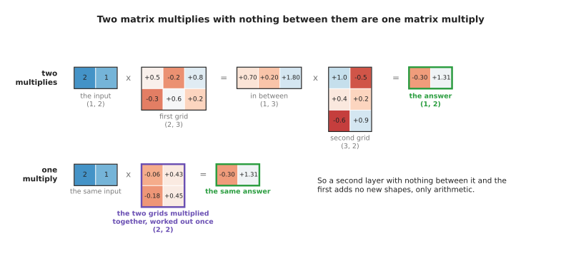

Two matrix multiplies with nothing between them give exactly the answer that one multiply by the product of the two grids gives, so depth on its own buys nothing.

Because that replacement is always possible, depth on its own buys nothing. A stack
of ten matrix multiplies can still only do what one matrix multiply does. So
everything a network can do beyond drawing a straight line comes from the rule
applied between the layers. That rule is the non-linearity, and the ReLU is the
simplest one in common use.

Before adding a ReLU, it helps to see how badly a straight line does on its own. The
picture below fits the best possible straight line to a curve that bends.

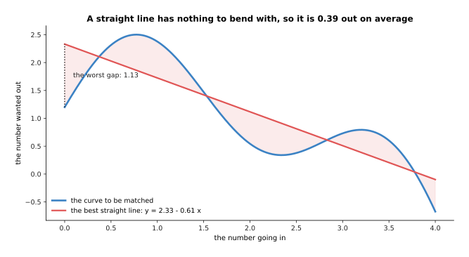

The best straight line through a curve that bends is 0.39 away from it on average and 1.13 away at its worst.

The blue curve there is made up. It stands for any relationship between one measured
number and one wanted number that is not a straight line. The best straight line
through it is y = 2.33 - 0.61 x. That line sits 0.39 away from the curve on average
and 1.13 away at its worst, which happens at the left-hand end. No choice of two
numbers does better, because two numbers is all a straight line has.

Now put one ReLU neuron beside that line. Its output is 0 until the total inside it
passes 0, and after that it rises straight. The picture below draws that shape.

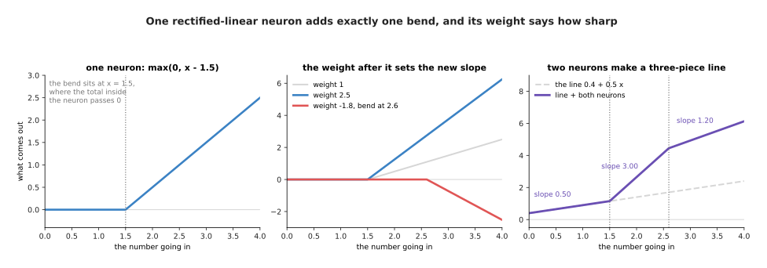

One rectified-linear neuron gives a flat part and then a straight rise, and the place where the two meet is the bend.

In that picture the turn happens at x = 1.5, because that is where the total inside
the neuron passes 0. The weight and bias of the neuron decide where the turn happens.
The weight that the next layer puts on the neuron decides something different, and
the picture below shows what.

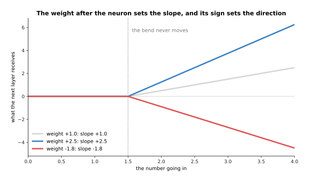

The weight in the layer after the neuron scales the whole shape, so it sets how steep the rising part is, and its sign decides whether the shape rises or falls.

A weight of 2.5 makes the rising part two and a half times as steep. A weight of -1.8
makes it fall instead of rise. The bend itself does not move, because the next
layer's weight cannot change where the total inside the neuron passes 0. Now add two
such neurons to a straight line, and the result is a line in three pieces.

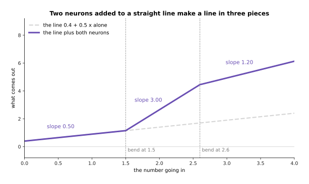

Adding two rectified-linear neurons to a straight line gives a line in three pieces, with slopes 0.50, then 3.00, then 1.20.

So one neuron buys exactly one bend. The next question is what those bends do to the
gap between the red line and the blue curve. The picture below adds them one at a
time.

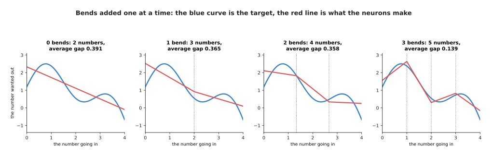

Bends added one at a time, each one costing one neuron and shrinking the gap between the red line and the blue curve.

The gap closes, but it does not close evenly. With no bends the gap is 0.391. With
one bend placed in the middle it is 0.365. With two bends it is 0.358. With three
bends it drops to 0.139. The first two bends barely help, because they are in the
wrong places. That is worth noticing rather than hiding, because where the bends go
is one of the things training has to find out. The next section shows what happens
when there are so many bends that their placement stops mattering as much.

---

## 2. Enough bends will follow any shape

Section 1 bought one bend for each neuron. So the obvious next question is what a
great many bends buy. The answer is the property that makes neural networks worth
using at all.

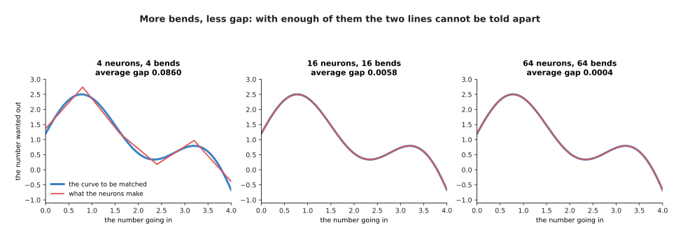

With 4 bends the red line is visibly straight between the turns, with 16 it is hard to see the difference, and with 64 the two lines cannot be told apart.

Four neurons leave the gap at 0.0860, and the red line is visibly made of straight
pieces. Sixteen neurons bring the gap to 0.0058, which is already hard to see. Sixty
four neurons bring it to 0.0004, and at that point the red line and the blue curve
cannot be told apart on the page. Nothing about the curve was used in choosing where
the bends went. Only their number changed.

The plot below puts those numbers on one scale, so the pattern in them is visible.

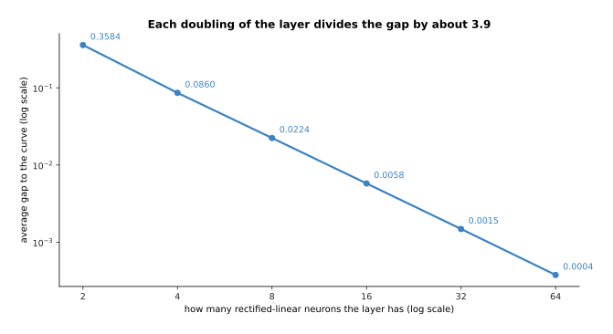

Each doubling of the layer divides the average gap by about 3.9, which is why a modest number of neurons is usually enough.

The gap runs 0.358, 0.0860, 0.0224, 0.0058, 0.0015 and 0.0004 as the layer grows from
2 neurons to 64. So each doubling of the layer divides the gap by about 3.9. A
relationship of that kind is the practical form of a result that mathematicians
proved in the late 1980s. That result says that a single layer of enough neurons,
with a non-linear rule, can come as close as you like to any smooth shape. However,
the result says nothing about how many neurons "enough" is, and nothing about how to
find their weights. That is why it is reassuring rather than useful.

Where the bends sit matters as much as how many of them there are. The two plots
below show the same three neurons with their bends in two different places.

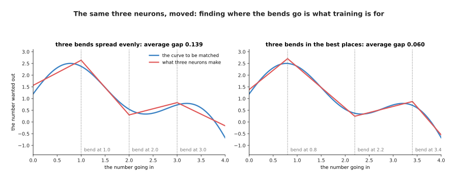

The same three neurons, with their bends moved: putting them at 0.8, 2.2 and 3.4 instead of 1.0, 2.0 and 3.0 more than halves the gap.

Three bends spread evenly at 1.0, 2.0 and 3.0 leave a gap of 0.139. The best three
places are 0.8, 2.2 and 3.4, and they leave a gap of 0.060. So the same three neurons
are 2.3 times closer to the curve for no extra cost. In the fits on this page the
places of the bends were either spread evenly or found by trying every combination.
Only the weights after the bends were worked out properly, by solving a small system
of equations. A real network does something quite different. In a real network the
bend of each neuron moves as that neuron's own weight and bias change, so training
adjusts how many bends there are and where every one of them sits at the same time.

---

## 3. Capacity: too little, about right, and too much

Section 2 said that more neurons means a smaller gap. That sounds like an argument
for always using more neurons. This section is the argument against, and it starts
with two words that the rest of the book uses constantly.

The **parameter count** of a network is simply how many weights and biases it holds.
It follows from the widths and the number of layers by plain arithmetic, so there is
nothing to estimate. The **capacity** of a network is how complicated a relationship
it can express. For the one-input networks on this page capacity has an exact
meaning, because a layer of W rectified-linear neurons gives a line of W bends and no
more.

The table below counts parameters for nine networks. Read it one row at a time. Each
row is one width of hidden layer, and the three columns are one, three and eight
hidden layers.

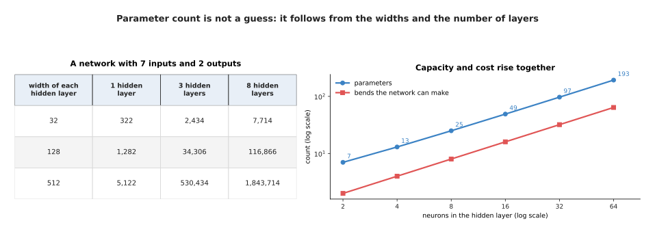

Parameter count follows from the widths and the number of layers, with nothing to guess.

A network with 7 inputs, 2 outputs and one hidden layer of 32 neurons holds 322
parameters. Three hidden layers of 32 hold 2,434, and eight hold 7,714. Now widen the
hidden layers to 512. One such layer holds 5,122, three hold 530,434 and eight hold
1,843,714. So width costs more than depth. The reason is that joining two layers of
width W takes W x W weights, so doubling the width roughly quadruples the cost of
every join.

Cost and capacity rise together, but not at the same rate. The plot below draws both
for a network with one input.

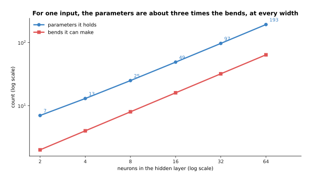

For a network with one input, the parameter count is about three times the number of bends at every width: 16 neurons hold 49 parameters and make 16 bends, and 64 neurons hold 193 and make 64.

So paying three parameters buys roughly one bend. The question this section asks is
whether buying more bends is always worth it. To answer that, give a network readings
of the curve instead of the curve itself, because readings are what a real problem
offers.

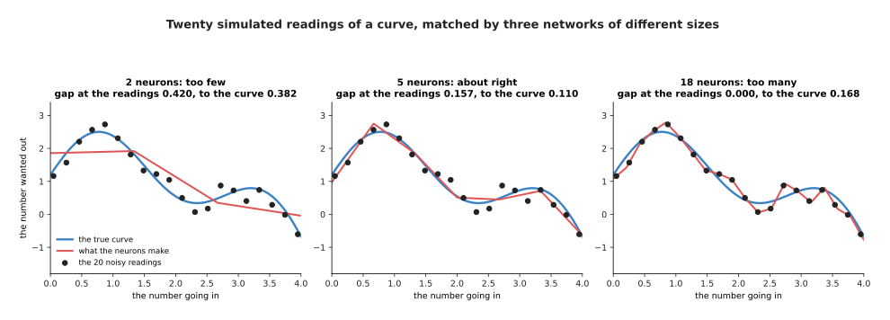

Twenty simulated readings of the curve, matched by three networks: too few neurons cannot follow the curve, enough neurons follow it well, and too many follow the measurement errors instead.

The twenty black dots in that picture are simulated. They were taken at even steps
along the made-up curve, with a random error added to each one, which is what a real
measurement looks like. With 2 neurons the red line is 0.420 away from the readings
and 0.382 away from the true curve, because it cannot bend enough to follow either.
With 5 neurons it is 0.157 away from the readings and 0.110 away from the curve,
which is the best of the three. With 18 neurons it passes exactly through all twenty
readings, so its gap at the readings is 0.000. Yet its gap to the true curve has
risen to 0.168. The reason is that between the readings it has followed the
measurement errors rather than the shape underneath them.

Those two measurements part company at a particular width, and the plot below shows
where.

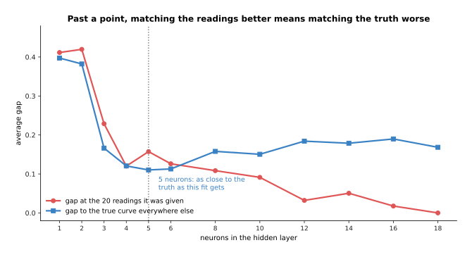

Past five neurons, every extra neuron brings the line closer to the readings it was given and no closer to the truth.

The gap at the readings falls steadily, from 0.41 at one neuron to 0.000 at eighteen,
because more bends can always be made to pass nearer the dots. The gap to the true
curve falls only to 0.110 at five neurons, and after that it climbs back, reaching
0.190 at sixteen neurons. The word for what happens on the right-hand side of that
plot is overfitting. Overfitting is the subject of
[overfitting and generalisation](../04_making-training-work/01_overfitting-and-generalisation.md),
which also explains why the honest way to measure a model is on readings it has never
seen. For this page the lesson is narrower. Capacity is something to choose, and not
something to maximise.

---

## 4. Why a fully connected layer is the wrong shape for a photo

Sections 1 to 3 used one input number, which kept the pictures simple. A camera gives
150,528 input numbers instead. At that size the fully connected layer of
[layers and depth](02_layers-and-depth.md) stops being a sensible choice, for two
separate reasons. The first reason is about counting, and the second is about
position.

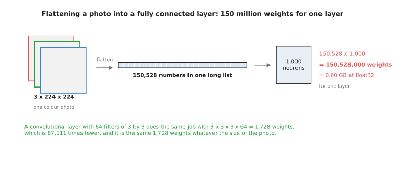

One fully connected layer of 1,000 neurons on one colour photo needs 150,528,000 weights, which is 0.60 gigabytes at four bytes each.

Count the first reason. A colour photo of 224 rows by 224 columns is
3 x 224 x 224 = 150,528 numbers. A fully connected layer joins every input to every
neuron, so 1,000 neurons need 150,528 x 1,000 = 150,528,000 weights. At four bytes a
weight that is 0.60 gigabytes, for one layer. A convolutional layer with 64 filters of
3 by 3, which the next section explains, does the same job with
3 x 3 x 3 x 64 = 1,728 weights. That is 87,111 times fewer.

The counting gets worse as the picture gets larger, and this is the part that makes
the fully connected layer hopeless rather than merely expensive.

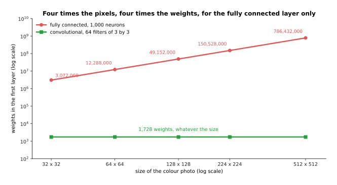

Four times the pixels means four times the weights for the fully connected layer, and no change at all for the convolutional one.

At 32 by 32 the fully connected layer needs 3,072,000 weights. At 128 by 128 it needs
49,152,000. At 224 by 224 it needs 150,528,000. At 512 by 512 it needs 786,432,000.
The 64 filters need 1,728 weights at every one of those sizes, because the same
filter is used at every position in the picture.

The second reason is position, and it is the deeper of the two. Flattening a picture
into a list throws away which numbers were next to each other. So to a fully
connected layer, one pixel and the pixel beside it are no more related than any two
numbers in the list. The picture below shows what that costs.

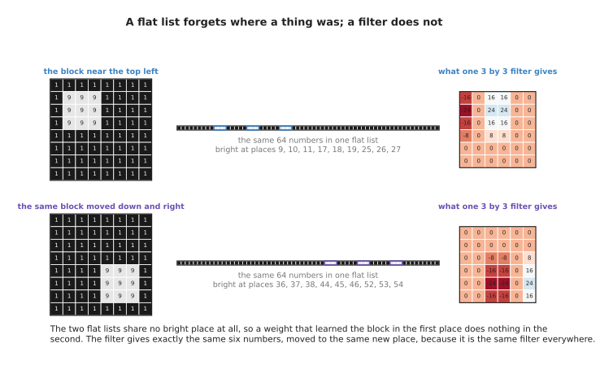

Moved three rows down and three columns right, the block lights up a completely different set of places in the flat list, while the filter gives exactly the same numbers in a new place.

In that drawing the same bright 3 by 3 block sits near the top left in one row, and
three rows down and three columns right in the other row. In the flat list the first
block lights up places 9, 10, 11, 17, 18, 19, 25, 26 and 27. The second lights up
places 36, 37, 38, 44, 45, 46, 52, 53 and 54. Those two sets share no place at all.
So a weight that learned to recognise the block in the first position does nothing
whatever in the second position. The network therefore has to learn the same thing
again for every position the block might appear in. The filter in the right-hand
column behaves differently. It gives exactly the same six numbers in both rows, simply
moved to a new place.

---

## 5. The convolution, worked out number by number

Section 4 named a layer that fixes both problems, without saying what that layer
does. So this section works it out in full. A **convolution** slides a small grid of
weights over a larger grid of numbers. At every position it multiplies each number
under the small grid by the weight on top of it, and then adds the results together.
That total is one number of the answer. The small grid of weights is called a
**filter**, and a filter is a detector for one small pattern.

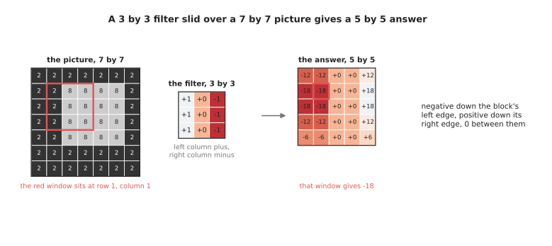

A 3 by 3 filter slid over a 7 by 7 picture gives a 5 by 5 answer, with -18 where the window sits on the left edge of the bright block and +18 where it sits on the right edge.

The picture there is made up. It is a dark table of 2s with a bright block of 8s
lying on it. The filter has +1 down its left column, 0 down its middle column and -1
down its right column, so it asks whether the left side of its window is brighter
than the right side. The answer grid is negative down the left edge of the block and
positive down its right edge. It is exactly 0 in the two middle columns, because
there the window sees the same brightness on both of its sides. The largest answers,
-18 and +18, appear where the whole window straddles an edge. Smaller answers such as
-12 and -6 appear where only part of the window covers the edge. So this filter is a
detector for the boundary between dark and bright.

The picture below works three of those positions out multiply by multiply.

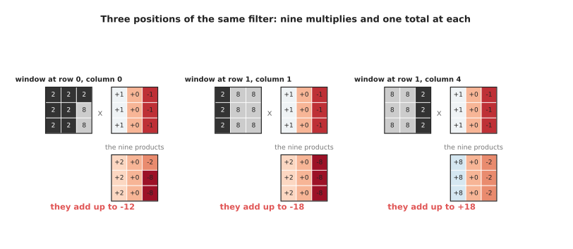

Three positions of the same filter: nine multiplies and one total at each, giving -12, -18 and +18.

Follow the three positions one at a time. At row 0 and column 0 the window covers
mostly table, with two 8s at its right. The nine products are therefore +2, 0, -2,
+2, 0, -8, +2, 0 and -8, which add to -12. At row 1 and column 1 the window straddles
the left edge of the block, giving +2, 0 and -8 three times over, which adds to -18.
At row 1 and column 4 the window straddles the right edge, giving +8, 0 and -2 three
times over, which adds to +18. So the sign of the answer tells you which way the
brightness changes, and the size of the answer tells you how sharply it changes.

A convolutional layer has many filters, not one, and each filter detects something
different. The picture below runs two filters over the same picture.

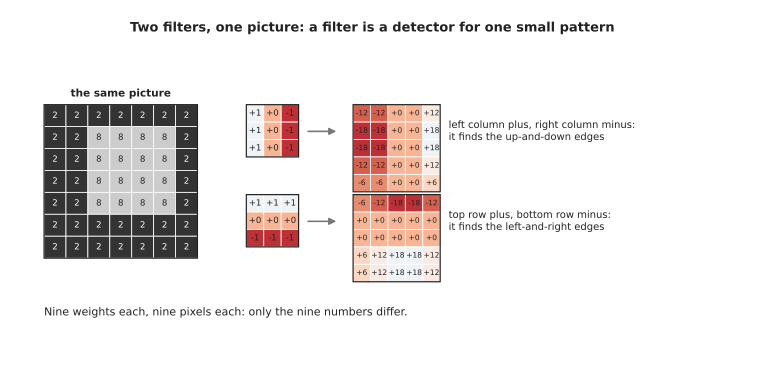

Two filters, one picture: changing only the nine numbers in the filter changes which pattern it finds.

The second filter there has +1 along its top row and -1 along its bottom row. So it
finds the edges that run left and right, instead of the edges that run up and down.
On the same picture it gives -18 along the top of the block and +18 along the bottom,
in the very places where the first filter gave 0. Both filters have nine weights, and
both look at nine pixels at a time. The only difference between them is the nine
numbers they hold. On this page those numbers were chosen by hand, to make the
arithmetic clear. In a real network every one of them is found during training, which
is how the network decides for itself which patterns are worth detecting.

Three choices decide how big the answer is, and the picture below shows all three on
the same picture and filter.

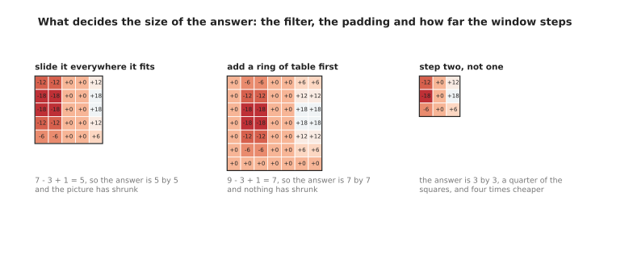

What decides the size of the answer: the size of the filter, whether a ring is added round the picture first, and how far the window steps each time.

The first choice is to slide the window everywhere it fits. That gives 7 - 3 + 1 = 5,
so the answer is 5 by 5 and the picture has shrunk by one pixel on each side. The
second choice is to add a ring of table round the picture before sliding, which is
called padding. That gives 9 - 3 + 1 = 7, so nothing shrinks. The third choice is to
move the window two places at a time instead of one, which is called the stride. That
gives a 3 by 3 answer here, so 9 squares are worked out instead of 25. On a large
picture a stride of two gives about a quarter of the squares and therefore about a
quarter of the arithmetic, because it halves the answer in both directions. Those
three choices appear in every convolutional layer anyone writes.

---

## 6. The convolutional neural network, and where it still earns its place

Section 5 described one convolutional layer. A network built mainly from such layers
is called a **convolutional neural network**, which is often shortened to CNN.
Stacking those layers is what turns a detector of edges into a detector of objects.
The reason is that each layer looks at the answers of the layer before it, rather than
at the picture itself.

How far back into the picture one number can see is worth counting, because it
decides whether the network can relate two things that are far apart. The picture
below counts it for five layers of 3 by 3 filters.

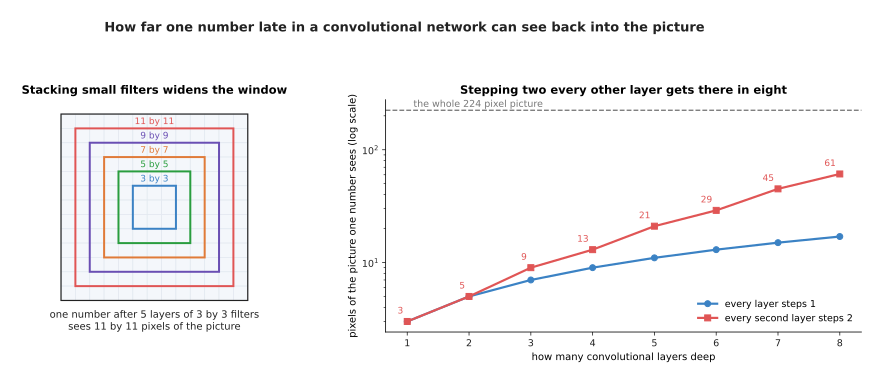

With 3 by 3 filters that step one place at a time, the window on the picture grows by 2 pixels each layer, so one number after five layers has seen 11 by 11 pixels.

Growing by 2 pixels a layer is slow. Covering a 224 pixel picture that way would take
112 layers, which no one builds. Making every second layer step two places instead of
one changes the arithmetic completely, and the plot below compares the two.

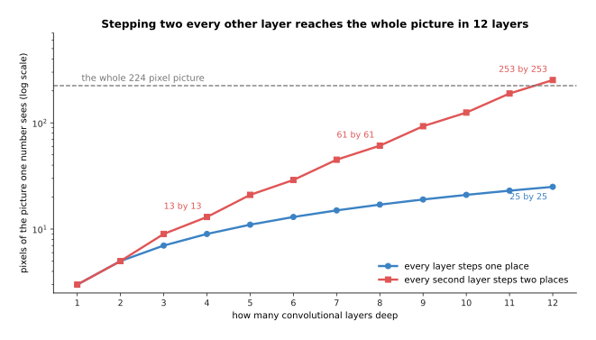

Stepping two places every second layer reaches 13 by 13 pixels after four layers, 61 by 61 after eight and 253 by 253 after twelve, while stepping one place every layer reaches only 25 by 25 after twelve.

That is why real convolutional networks shrink the grid as they go. The picture below
shows what that shrinking looks like across four stages.

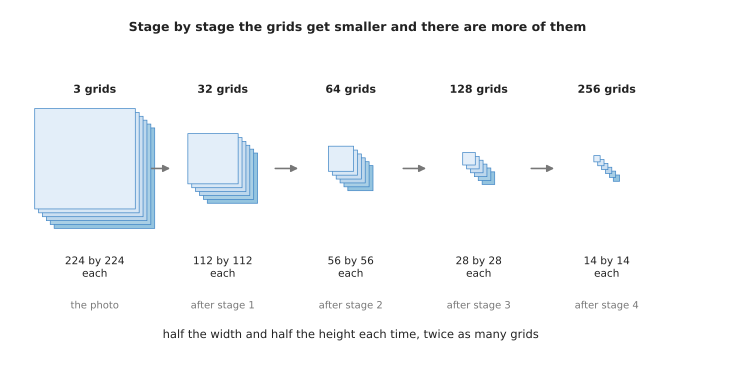

Each stage halves the width and the height of the grid and doubles the number of grids, so a photo of 3 grids of 224 by 224 becomes 256 grids of 14 by 14.

The table below gives the same four stages with their exact costs. Read it one row at
a time. Each row is one stage, and the columns give the shape that comes out, the
weights that stage holds, and the arithmetic it does for one photo.

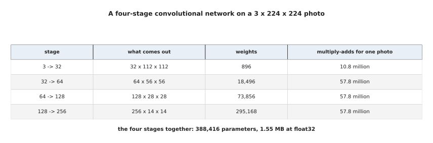

Four stages of 3 by 3 filters that halve the grid each time, with the shape, the weight count and the arithmetic of each.

The first stage turns the photo's 3 colour grids into 32 grids of 112 by 112, using
896 weights. The second gives 64 grids of 56 by 56, using 18,496 weights. The third
gives 128 grids of 28 by 28, using 73,856. The fourth gives 256 grids of 14 by 14,
using 295,168. The four stages together hold 388,416 parameters, which is 1.55
megabytes. The pattern is that the grids get smaller while the number of grids grows,
and that is the usual shape of a picture network.

Now set that whole stack against the one fully connected layer of section 4. The two
charts below compare them, first on the weights they hold and then on the arithmetic
they do.

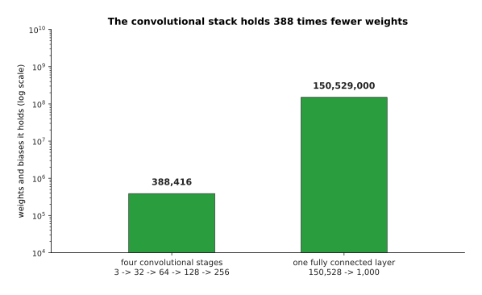

The whole convolutional stack holds 388,416 weights, which is 388 times fewer than the 150,529,000 of one fully connected layer.

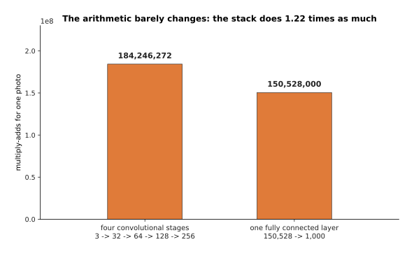

The arithmetic barely changes between the two: the convolutional stack does 1.22 times as many multiply-adds as the fully connected layer.

So the convolutional stack has 388 times fewer weights and does about a fifth more
arithmetic. That is exactly the bargain you want. Weights are what must be stored,
carried to the robot and learned from examples, so having fewer of them helps three
times over. Arithmetic is what the hardware of
[the previous page](03_the-shape-of-the-numbers.md#3-why-the-hardware-is-built-for-this-one-operation)
is good at, so having a little more of it costs almost nothing.

So where do convolutional networks stand now? They are still the right choice when a
model must run many times a second on the computer that the robot carries. The reason
is that they are small, and their arithmetic suits modest hardware. They are also
still common for depth maps and for small pictures. They survive inside models that
are called something else as well, and the picture below shows the clearest example.

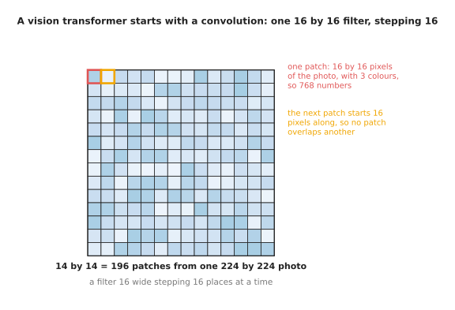

A vision transformer begins by cutting a 224 by 224 photo into 196 patches of 16 by 16 pixels, and that first step is one convolution with a 16 by 16 filter and a stride of 16.

What convolutional networks lost is the top end. A convolution can only relate things
that fall inside one window. So relating two distant parts of a picture takes many
layers, as the reach plot above showed. Attention relates every part of a picture to
every other part in one step, and it also trains better on very large collections of
pictures. That is why large vision models, and every model that joins pictures with
language, are now built from transformers. What attention actually computes is worked
out with real numbers in [attention](../06_the-transformer/01_attention.md).

The cost of that change is real. A transformer needs more examples than a
convolutional network to reach the same accuracy on pictures, because it starts with
no built-in idea that nearby pixels belong together. Its arithmetic also grows with
the square of the number of patches, so doubling the patches along each side
multiplies the work by sixteen.

---

## 7. Where to read next

- [The score of being wrong](../03_how-training-works/01_the-score-of-being-wrong.md)
  is the next page and opens the next chapter, giving the number that says how wrong
  an answer is, which this page kept calling the gap.
- [Gradient descent](../03_how-training-works/02_gradient-descent.md) then explains
  how the weights and bends of section 1 are actually found, instead of being solved
  for or tried one by one.
- [Overfitting and generalisation](../04_making-training-work/01_overfitting-and-generalisation.md)
  takes section 3 further and says how to tell honestly whether a model has too much
  capacity.
- [Attention](../06_the-transformer/01_attention.md) is the operation that replaced
  the convolution at the top end of vision, worked out with real numbers.
- [Vision backbones](../09_models-that-see/01_vision-backbones.md) compares
  convolutional and transformer backbones for pictures and says where each still wins.
- [Image classification](../../07_learned-models/03_seeing-models/03_also-used/01_image-classification.md)
  is the catalogue page for the simplest job a convolutional network does on a robot,
  with the named models that do it.

---

## 8. Using it in Python

The layers on this page are a line each in PyTorch, and the parameter counts it
printed are counts you can check yourself. Every number in a comment below is what
the line really prints.

```python
import torch
from torch import nn
from torch.nn import functional as F

# sections 1 and 2: one hidden layer of ReLU neurons, one bend for each neuron
net = nn.Sequential(nn.Linear(1, 16), nn.ReLU(), nn.Linear(16, 1))
print(sum(p.numel() for p in net.parameters()))   # 49 parameters, 16 bends

# section 4: the two choices of first layer for one colour photo
photo = torch.zeros(1, 3, 224, 224)
dense = nn.Linear(3 * 224 * 224, 1000)
print(sum(p.numel() for p in dense.parameters()))  # 150529000
conv = nn.Conv2d(in_channels=3, out_channels=64, kernel_size=3, padding=1)
print(sum(p.numel() for p in conv.parameters()))   # 1792
print(conv(photo).shape)                           # torch.Size([1, 64, 224, 224])

# section 5: the worked example, with the filter set by hand instead of learned
grid = torch.full((1, 1, 7, 7), 2.0)
grid[0, 0, 1:5, 2:6] = 8.0
edge = torch.tensor([[1.0, 0.0, -1.0]] * 3).reshape(1, 1, 3, 3)
answer = F.conv2d(grid, edge)
print(answer.shape)                                # torch.Size([1, 1, 5, 5])
print(answer[0, 0, 1])                             # tensor([-18., -18., 0., 0., 18.])

# section 5 again: padding keeps the size, a stride of two shrinks it further
print(F.conv2d(grid, edge, padding=1).shape)       # torch.Size([1, 1, 7, 7])
print(F.conv2d(grid, edge, stride=2).shape)        # torch.Size([1, 1, 3, 3])
```

The library gives you the layers and the arithmetic. It also starts every weight at a
small random number, so that the neurons differ from one another from the beginning.
`nn.Conv2d` holds the filters, does the sliding at whatever speed the card allows, and
takes the padding and the stride of section 5 as ordinary arguments.

One small honesty is worth stating. What the libraries call a convolution does not
flip the filter, although the mathematical operation of that name does. So what they
compute is strictly a cross-correlation. Nothing changes because of this, since the
filter's numbers are learned either way round.

What you still decide is everything section 3 was about. You choose the width and the
depth, which together fix the parameter count and therefore the capacity, and section
3 showed that more is not better. You choose the filter size, the stride and the
padding, which fix how fast the grid shrinks and how far one late number can see, as
section 6 counted. You also choose whether a convolution is the right layer at all.
For a small fast model on a robot it usually is. For a large model that must relate
distant parts of a picture it usually is not.
