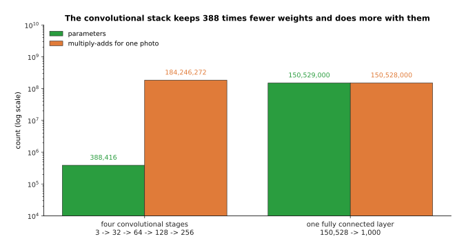

# What a network can learn

The page before this one, [the shape of the numbers](03_the-shape-of-the-numbers.md),
showed that a fully connected layer is one matrix multiply, that a batch of examples
goes through it in a single operation, and that the memory a model needs is its
parameter count multiplied by the bytes each parameter takes. All of that is about
cost. This page is about what you get for the cost.

It answers four questions. Why does stacking layers with a simple non-linear rule
between them let a network match any shape at all, when one layer on its own can only
draw a straight line? What do the words capacity and parameter count mean, and what
do too little and too much of them look like? Why is a fully connected layer a bad
choice for a photo, counted in weights? And what is the convolution that replaces it,
worked out number by number on a real small grid?

It is for a reader who has read [one neuron](01_one-neuron.md),
[layers and depth](02_layers-and-depth.md) and
[the shape of the numbers](03_the-shape-of-the-numbers.md), so it assumes you know
what a neuron, a weight, a bias, a rectified linear unit (ReLU), a layer, width,
depth, a tensor and a matrix multiply are.

One thing is deliberately missing. This page shows fits that are already good without
ever saying how a network finds the weights that make them good, because that is the
whole of the next chapter, which begins with
[the score of being wrong](../03_how-training-works/01_the-score-of-being-wrong.md).
The fits below were worked out by solving a small system of equations rather than by
training, which is honest and which the page says again where it matters.

Every number in the pictures was worked out by the script
[`inside_a_network_2.py`](../../diagrams/inside_a_network_2.py), which prints them
all. The curve being matched is made up, chosen because it bends in several places,
and the readings taken from it are simulated.

## Contents

1. [A straight line cannot bend, and one neuron can](#1-a-straight-line-cannot-bend-and-one-neuron-can)
2. [Enough bends will follow any shape](#2-enough-bends-will-follow-any-shape)
3. [Capacity: too little, about right, and too much](#3-capacity-too-little-about-right-and-too-much)
4. [Why a fully connected layer is the wrong shape for a photo](#4-why-a-fully-connected-layer-is-the-wrong-shape-for-a-photo)
5. [The convolution, worked out number by number](#5-the-convolution-worked-out-number-by-number)
6. [The convolutional neural network, and where it still earns its place](#6-the-convolutional-neural-network-and-where-it-still-earns-its-place)
7. [Where to read next](#7-where-to-read-next)
8. [Using it in Python](#8-using-it-in-python)

---

## 1. A straight line cannot bend, and one neuron can

The last page treated a layer as a matrix multiply, and a matrix multiply has a
property worth naming: whatever you put in, the answer changes by a fixed amount for
each unit of change in the input. Put two matrix multiplies one after the other and
the pair can be replaced by a single matrix multiply, so depth on its own buys
nothing. Everything a network can do beyond drawing a straight line comes from the
rule applied between the layers, and that rule is the **non-linearity**.


The best straight line through a curve that bends is 0.39 away from it on average and 1.13 away at its worst.

The blue curve there is made up, and it stands for any relationship between one
measured number and one wanted number that is not a straight line. The best straight
line through it is y = 2.33 - 0.61 x, which sits 0.39 away from the curve on average
and 1.13 away at its worst, at the left-hand end. No choice of two numbers does
better, because two numbers is all a straight line has.


One rectified-linear neuron gives a flat part and then a slope, and the weight after it decides how sharply the line turns.

Now put one ReLU neuron beside that line. Its output is 0 until the total inside it
passes 0 and rises straight afterwards, which is the shape drawn in the first panel,
where the turn happens at x = 1.5. The weight that the next layer puts on that
neuron scales the whole shape, so a weight of 2.5 makes the rising part two and a
half times as steep and a weight of -1.8 makes it fall instead. Adding two such
neurons to a straight line therefore gives a line in three pieces, with slopes 0.50,
then 3.00, then 1.20 in the third panel. One neuron buys exactly one bend.


Bends added one at a time, each one costing one neuron and shrinking the gap between the red line and the blue curve.

Add the bends one at a time to the curve from the first picture and the gap closes,
but not evenly. With no bends the gap is 0.391, with one bend placed in the middle it
is 0.365, with two it is 0.358, and with three it drops to 0.139. The first two
bends barely help because they are in the wrong places, and that is worth noticing
rather than hiding, because where the bends go is one of the things training has to
find out. The next section shows what happens when there are enough of them that
placement stops mattering so much.

---

## 2. Enough bends will follow any shape

Section 1 bought one bend per neuron, so the obvious next question is what a great
many bends buy, and the answer is the property that makes neural networks worth
using at all.


With 4 bends the red line is visibly straight between the turns, with 16 it is hard to see the difference, and with 64 the two lines cannot be told apart.

Four neurons leave the gap at 0.0860 and the line is visibly made of straight
pieces. Sixteen bring it to 0.0058, which is already hard to see. Sixty-four bring it
to 0.0004, and at that point the red line and the blue curve cannot be told apart on
the page. Nothing about the curve was used in choosing the bends; only their number
changed.


Each doubling of the layer divides the average gap by about 3.9, which is why a modest number of neurons is usually enough.

That picture puts the same thing on a scale. The gap runs 0.358, 0.0860, 0.0224,
0.0058, 0.0015 and 0.0004 as the layer grows from 2 neurons to 64, so each doubling
divides the gap by about 3.9. A relationship of that kind is the practical form of a
result mathematicians proved in the late 1980s, which says that a single layer of
enough neurons with a non-linear rule can come as close as you like to any smooth
shape. The result says nothing about how many neurons "enough" is, and nothing about
how to find their weights, which is why it is reassuring rather than useful.


The same three neurons, with their bends moved: putting them at 0.8, 2.2 and 3.4 instead of 1.0, 2.0 and 3.0 more than halves the gap.

Where the bends sit matters as much as how many there are. Three bends spread evenly
at 1.0, 2.0 and 3.0 leave a gap of 0.139, while the best three places, which are 0.8,
2.2 and 3.4, leave 0.060, so the same three neurons are 2.3 times closer for no extra
cost. In the fits on this page the places were either spread evenly or found by
trying every combination, and only the weights after the bends were worked out
properly, by solving a small system of equations. A real network does something quite
different, because the bend of each neuron moves as its own weight and bias change,
so training adjusts the number of bends it was given and where every one of them
sits at the same time.

---

## 3. Capacity: too little, about right, and too much

Section 2 said that more neurons means a smaller gap, which sounds like an argument
for always using more. This section is the argument against, and it starts with two
words the rest of the book uses constantly.

The **parameter count** of a network is simply how many weights and biases it holds,
and it follows from the widths and the number of layers by arithmetic, with nothing
to estimate. The **capacity** of a network is how complicated a relationship it can
express, and for the one-input networks on this page capacity has an exact meaning,
because a layer of W rectified-linear neurons gives a line of W bends and no more.


Parameter count follows from the widths and the number of layers, and for a network with one input it rises three times as fast as the number of bends it can make.

Read the table a row at a time. A network with 7 inputs, 2 outputs and one hidden
layer of 32 holds 322 parameters; three hidden layers of 32 hold 2,434, and eight
hold 7,714. Widen the hidden layers to 512 and one layer holds 5,122, three hold
530,434 and eight hold 1,843,714. Width costs more than depth, because joining two
layers of width W takes W x W weights, so doubling the width roughly quadruples the
cost of every join. In the plot beside it, a one-input network of 16 neurons holds 49
parameters and can make 16 bends, and one of 64 neurons holds 193 and can make 64.


Twenty simulated readings of the curve, matched by three networks: too few neurons cannot follow it, enough neurons follow it well, and too many follow the measurement errors instead.

Now give a network readings instead of the curve itself. The twenty black dots are
simulated, taken at even steps along the made-up curve with a random error added to
each, which is what a real measurement looks like. With 2 neurons the red line is
0.420 from the readings and 0.382 from the true curve, because it cannot bend enough
to follow either. With 5 neurons it is 0.157 from the readings and 0.110 from the
curve, which is the best of the three. With 18 neurons it passes exactly through all
twenty readings, so its gap at the readings is 0.000, and yet its gap to the true
curve has risen to 0.168, because between the readings it has followed the
measurement errors rather than the shape.


Past five neurons, every extra neuron brings the line closer to the readings it was given and no closer to the truth.

Put every width on one plot and the two measures part company. The gap at the
readings falls steadily, from 0.41 at one neuron to 0.000 at eighteen, because more
bends can always be made to pass nearer the dots. The gap to the true curve falls
only to 0.110 at five neurons and then climbs back, reaching 0.190 at sixteen. The
word for what happens on the right-hand side is overfitting, and it is the subject of
[overfitting and generalisation](../04_making-training-work/01_overfitting-and-generalisation.md),
which also explains why the honest way to measure a model is on readings it has never
seen. For this page the lesson is narrower: capacity is something to choose, not
something to maximise.

---

## 4. Why a fully connected layer is the wrong shape for a photo

Sections 1 to 3 used one input number, which kept the pictures simple. A camera gives
150,528 input numbers, and at that size the fully connected layer of
[layers and depth](02_layers-and-depth.md) stops being a sensible choice for two
separate reasons, one about counting and one about position.


One fully connected layer of 1,000 neurons on one colour photo needs 150,528,000 weights, which is 0.60 gigabytes at four bytes each.

Count the first reason. A colour photo of 224 rows by 224 columns is 3 x 224 x 224 =
150,528 numbers. A fully connected layer joins every input to every neuron, so 1,000
neurons need 150,528 x 1,000 = 150,528,000 weights, which is 0.60 gigabytes at four
bytes a weight, for one layer. A convolutional layer with 64 filters of 3 by 3, which
the next section explains, does the same job with 3 x 3 x 3 x 64 = 1,728 weights,
which is 87,111 times fewer.


Four times the pixels means four times the weights for the fully connected layer, and no change at all for the convolutional one.

The counting gets worse with the size of the picture, and this is the part that makes
it hopeless rather than merely expensive. At 32 by 32 the fully connected layer needs
3,072,000 weights, at 128 by 128 it needs 49,152,000, at 224 by 224 it needs
150,528,000 and at 512 by 512 it needs 786,432,000. The 64 filters need 1,728 weights
at every one of those sizes, because the same filter is used at every position.


Moved three rows down and three columns right, the block lights up a completely different set of places in the flat list, while the filter gives exactly the same numbers in a new place.

The second reason is position, and it is the deeper one. Flattening a picture into a
list throws away which numbers were next to each other, so to a fully connected layer
a pixel and the pixel beside it are no more related than any two numbers in the list.
In that drawing the same bright 3 by 3 block sits near the top left in one row and
three rows down and three columns right in the other. In the flat list the first
lights up places 9, 10, 11, 17, 18, 19, 25, 26 and 27, the second lights up places
36, 37, 38, 44, 45, 46, 52, 53 and 54, and the two share no place at all. A weight
that learned to recognise the block in the first position does nothing whatever in
the second, so the network has to learn the same thing again for every position it
might appear in. The filter in the right-hand column gives exactly the same six
numbers in both rows, simply moved.

---

## 5. The convolution, worked out number by number

Section 4 named a layer that fixes both problems without saying what it does, so this
section works it out in full. A **convolution** slides a small grid of weights over a
larger grid of numbers, and at every position it multiplies each number under the
small grid by the weight on top of it and adds the results, which gives one number of
the answer. The small grid of weights is called a **filter**, and it is a detector for
one small pattern.


A 3 by 3 filter slid over a 7 by 7 picture gives a 5 by 5 answer, with -18 where the dark table meets the bright block on the left and +18 where it meets it on the right.

The picture there is made up: a dark table of 2s with a bright block of 8s on it. The
filter has +1 down its left column, 0 down its middle and -1 down its right, so it
asks whether the left side of its window is brighter than the right. The answer grid
holds -18 along the left edge of the block, +18 along the right edge, 0 in the flat
middle and 0 over the plain table, which makes this filter a detector for the edge
between dark and bright.


Three positions of the same filter: nine multiplies and one total at each, giving -12, -18 and +18.

Follow the three positions one at a time. At row 0 and column 0 the window covers
mostly table, with two 8s at the right, so the nine products are +2, 0, -2, +2, 0, -8,
+2, 0 and -8, which add to -12. At row 1 and column 1 the window straddles the left
edge of the block, giving +2, 0, -8 three times over, which adds to -18. At row 1 and
column 4 the window straddles the right edge, giving +8, 0, -2 three times over, which
adds to +18. The sign tells you which way the brightness changes and the size tells
you how sharply.


Two filters, one picture: changing only the nine numbers in the filter changes which pattern it finds.

A convolutional layer has many filters, not one, and each one detects something
different. The second filter there has +1 along its top row and -1 along its bottom,
so it finds the edges that run left and right, and on the same picture it gives -18
along the top of the block and +18 along the bottom, in the places where the first
filter gave 0. Both filters have nine weights and both look at nine pixels at a time,
and the only difference is the nine numbers. In this page those numbers were chosen
by hand to make the arithmetic clear, while in a real network every one of them is
found during training, which is how the network decides for itself which patterns are
worth detecting.


What decides the size of the answer: the filter, whether a ring is added round the picture first, and how far the window steps each time.

Three choices decide how big the answer is. Sliding the window everywhere it fits
gives 7 - 3 + 1 = 5, so the answer is 5 by 5 and the picture has shrunk by one pixel
on each side. Adding a ring of table round the picture first, which is called padding,
gives 9 - 3 + 1 = 7, so nothing shrinks. Moving the window two places at a time
instead of one, which is called the stride, gives a 3 by 3 answer, a quarter of the
squares and four times less arithmetic. Those three choices appear in every
convolutional layer anyone writes.

---

## 6. The convolutional neural network, and where it still earns its place

Section 5 described one convolutional layer, and a network built mainly from them is
called a **convolutional neural network**, often shortened to CNN. Stacking them is
what turns a detector of edges into a detector of objects, and the reason is that
each layer looks at the answers of the one before it.


One number after five layers of 3 by 3 filters has seen 11 by 11 pixels of the picture, and stepping two every other layer reaches the whole picture in twelve layers instead of 112.

How far back into the picture one number can see is worth counting, because it
decides whether the network can relate two distant things. With 3 by 3 filters that
step one place at a time, the window on the picture grows by 2 each layer, so it is 3
by 3 after one layer, 11 by 11 after five, and covering a 224 pixel picture that way
would take 112 layers. Make every second layer step two instead, as section 5
described, and the window reaches 13 by 13 after four layers, 61 by 61 after eight
and 253 by 253 after twelve. That is why real convolutional networks shrink the grid
as they go.


Four stages of 3 by 3 filters that halve the grid each time, with the shape, the weight count and the arithmetic of each.

Read that table a row at a time. The first stage turns the photo's 3 colour grids into
32 grids of 112 by 112 using 896 weights, the second gives 64 grids of 56 by 56 using
18,496, the third gives 128 grids of 28 by 28 using 73,856, and the fourth gives 256
grids of 14 by 14 using 295,168. The four stages together hold 388,416 parameters,
which is 1.55 megabytes, and the grids get smaller while the number of grids grows,
which is the usual shape of a picture network.



The whole convolutional stack holds 388 times fewer weights than one fully connected layer, while doing slightly more arithmetic with them.

Set that against the fully connected layer of section 4 and the trade is clear. The
four stages hold 388,416 parameters and do 184,246,272 multiply-adds for one photo,
while one fully connected layer of 1,000 neurons holds 150,529,000 parameters and does
150,528,000 multiply-adds. So the convolutional stack has 388 times fewer weights and
does slightly more arithmetic, which is exactly the bargain you want, because weights
are what must be stored, carried and learned from examples, while arithmetic is what
the hardware of
[the previous page](03_the-shape-of-the-numbers.md#3-why-the-hardware-is-built-for-this-one-operation)
is good at.

So where do convolutional networks stand now? They are still the right choice when a
model must run many times a second on the computer the robot carries, because they
are small and their arithmetic suits modest hardware, and they are still common for
depth maps and for small pictures. They also survive inside models that are called
something else, because a vision transformer begins by cutting the picture into
patches, and that first step is a convolution with a large filter and a stride to
match. What they lost is the top end. A convolution can only relate things that fall
in one window, so relating two distant parts of a picture takes many layers, while
attention relates every part to every other part in one step and trains better on very
large collections of pictures. That is why large vision models, and every model that
joins pictures with language, are now built from transformers, and what attention
actually computes is worked out with real numbers in
[attention](../06_the-transformer/01_attention.md). The cost of that change is real:
a transformer needs more examples to reach the same accuracy on pictures, because it
starts with no built-in idea that nearby pixels belong together, and its arithmetic
grows with the square of the number of patches.

---

## 7. Where to read next

- [The score of being wrong](../03_how-training-works/01_the-score-of-being-wrong.md)
  is the next page and opens the next chapter, giving the number that says how wrong
  an answer is, which this page kept calling the gap.
- [Gradient descent](../03_how-training-works/02_gradient-descent.md) then explains
  how the weights and bends of section 1 are actually found, instead of being solved
  for or tried one by one.
- [Overfitting and generalisation](../04_making-training-work/01_overfitting-and-generalisation.md)
  takes section 3 further and says how to tell honestly whether a model has too much
  capacity.
- [Attention](../06_the-transformer/01_attention.md) is the operation that replaced
  the convolution at the top end of vision, worked out with real numbers.
- [Vision backbones](../09_models-that-see/01_vision-backbones.md) compares
  convolutional and transformer backbones for pictures and says where each still wins.
- [Image classification](../../07_learned-models/03_seeing-models/03_also-used/01_image-classification.md)
  is the catalogue page for the simplest job a convolutional network does on a robot,
  with the named models that do it.

---

## 8. Using it in Python

The layers on this page are a line each in PyTorch, and the parameter counts it
printed are counts you can check yourself. Every number in a comment below is what
the line really prints.

```python
import torch
from torch import nn
from torch.nn import functional as F

# sections 1 and 2: one hidden layer of ReLU neurons, one bend for each neuron
net = nn.Sequential(nn.Linear(1, 16), nn.ReLU(), nn.Linear(16, 1))
print(sum(p.numel() for p in net.parameters()))   # 49 parameters, 16 bends

# section 4: the two choices of first layer for one colour photo
photo = torch.zeros(1, 3, 224, 224)
dense = nn.Linear(3 * 224 * 224, 1000)
print(sum(p.numel() for p in dense.parameters()))  # 150529000
conv = nn.Conv2d(in_channels=3, out_channels=64, kernel_size=3, padding=1)
print(sum(p.numel() for p in conv.parameters()))   # 1792
print(conv(photo).shape)                           # torch.Size([1, 64, 224, 224])

# section 5: the worked example, with the filter set by hand instead of learned
grid = torch.full((1, 1, 7, 7), 2.0)
grid[0, 0, 1:5, 2:6] = 8.0
edge = torch.tensor([[1.0, 0.0, -1.0]] * 3).reshape(1, 1, 3, 3)
answer = F.conv2d(grid, edge)
print(answer.shape)                                # torch.Size([1, 1, 5, 5])
print(answer[0, 0, 1])                             # tensor([-18., -18., 0., 0., 18.])

# section 5 again: padding keeps the size, a stride of two quarters it
print(F.conv2d(grid, edge, padding=1).shape)       # torch.Size([1, 1, 7, 7])
print(F.conv2d(grid, edge, stride=2).shape)        # torch.Size([1, 1, 3, 3])
```

The library gives you the layers and the arithmetic, and it starts every weight at a
small random number so that the neurons differ from one another. `nn.Conv2d` holds
the filters, does the sliding at whatever speed the card allows, and handles the
padding and the stride of section 5 as ordinary arguments. One small honesty: what
the libraries call a convolution does not flip the filter, which the mathematical
operation of that name does, so it is strictly a cross-correlation. Nothing changes
because of this, since the filter's numbers are learned either way round.

What you still decide is everything section 3 was about. You choose the width and the
depth, which together fix the parameter count and therefore the capacity, and section
3 showed that more is not better. You choose the filter size, the stride and the
padding, which fix how fast the grid shrinks and how far one late number can see, as
section 6 counted. And you choose whether a convolution is the right layer at all,
which for a small fast model on a robot it usually is, and for a large model that must
relate distant parts of a picture it usually is not.
