# The score of being wrong

The page before this one, [what a network can
learn](../02_inside-a-network/04_what-a-network-can-learn.md), showed that a
network with enough layers and enough weights can be shaped to fit almost any
pattern. That page did not say how anybody finds the right values for those
weights. This page begins that answer, because before training can take a single
step it needs one thing: a way of saying how wrong the model is right now.

That measurement is called the **loss**. The loss is a single number. It is large
when the model is wrong, and it is small when the model is right. Training works
by making that number smaller, so every choice you make about the loss changes
what the model finally does.

This page explains four things, in this order. First it explains why training
needs one number rather than a list of numbers. Second it explains the two usual
losses for a model whose answer is itself a number, such as a distance in
millimetres. Third it explains how a model answers a question whose answer is a
choice between named things, such as "is this object a mug or a bowl", and how
that answer is scored. Fourth it draws the shape the loss makes when you plot it
against one weight, because the next page walks down that shape.

By the end you will know what a loss is, how to choose one for your own problem,
and what each choice costs you.

The page assumes you know what a weight, a layer and a parameter are. It assumes
no statistics at all, and it explains every statistical word where that word
first appears. Every number in the pictures was worked out by
`docs/diagrams/how_training_works_1.py`. The small tables were chosen by hand, so
you can redo the arithmetic yourself on a pocket calculator.

## Contents

1. [Why training needs one number](#1-why-training-needs-one-number)
2. [Squared error and absolute error](#2-squared-error-and-absolute-error)
3. [When the answer is a choice: logits and softmax](#3-when-the-answer-is-a-choice-logits-and-softmax)
4. [Cross-entropy: the price of a wrong probability](#4-cross-entropy-the-price-of-a-wrong-probability)
5. [The loss landscape of one weight](#5-the-loss-landscape-of-one-weight)
6. [Choosing a loss, and what it costs](#6-choosing-a-loss-and-what-it-costs)
7. [Where to read next](#7-where-to-read-next)
8. [Using it in Python](#8-using-it-in-python)

---

## 1. Why training needs one number

Training changes the weights until the model is right. So the first thing to
build is a way of telling whether one setting of the weights is better than
another setting. That is harder than it sounds, as soon as there is more than one
example to judge.

Here is the example this page uses. A robot arm picks eight parts off a tray.
Before each pick, a model predicts how far the gripper must travel downwards, in
millimetres, before it touches the part. After the pick you know the travel that
part really needed. The **error** on one part is the travel the model predicted
minus the travel the part really needed. A positive error means the model
predicted too much, and a negative error means it predicted too little.

The next picture shows those eight predictions. Each part on the tray has a dark
dot for the travel it really needed and a cross for the travel the model
predicted, and the number above each pair is the error.

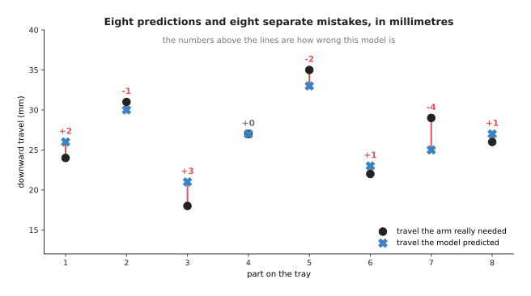

The model's eight errors, in millimetres, are +2, -1, +3, 0, -2, +1, -4 and +1.
This model is called model A for the rest of the page.

That list of eight errors is an honest account of the model. However, it is
useless for training. Training has to compare one setting of the weights with
another setting, and you cannot say which of two lists of eight numbers is
better. The next picture shows why.

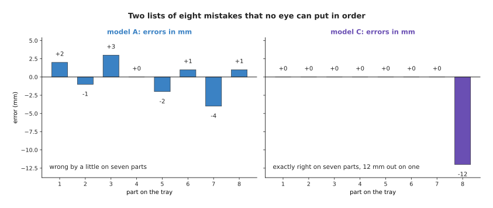

Model A is wrong by a little on seven parts. Model C is exactly right on seven
parts and 12 mm out on the one part it missed.

There is no answer to the question of which model is better, until somebody
decides what being wrong costs. Suppose a 12 mm miss means the gripper hits the
part hard and the arm stops with a fault. Then model C is much the worse of the
two. Suppose instead that a 12 mm miss only means one failed pick out of eight.
Then model C, which is perfect seven times out of eight, may be the model you
want. Nothing in the data settles this question, so you settle it yourself, by
choosing how the eight errors are combined into one number.

That single number is the **loss**. It is also called the **objective**, because
it is what training sets out to make small. The loss gives back one number for
the whole set of examples, so any two settings of the weights can be compared.

Giving back one number is necessary, but it is not enough. The loss also has to
change whenever the weights change, even by a tiny amount. The obvious score for
a picking robot fails that second requirement badly. That obvious score is the
count of how many parts the model predicted within half a millimetre. The next
picture shows what goes wrong, by drawing two different scores of the same data
against the same single weight.

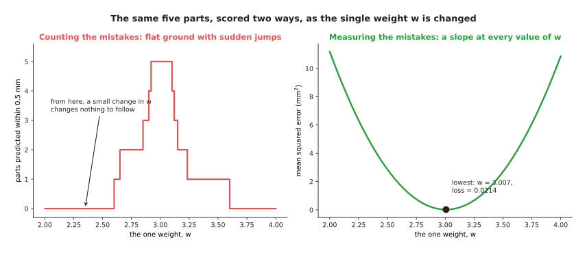

Counting the parts that came out close enough gives flat ground with sudden
jumps. Measuring how far out each part was gives a slope at every setting of the
weight.

Both charts score the same five parts, which are introduced in
[section 5](#5-the-loss-landscape-of-one-weight), as a single weight runs from
2.0 to 4.0. The script tried 1,600 small moves in that weight. Across 99.4 per
cent of those moves the count did not change at all, so the count says nothing
about which way the weight should move. The measured score changed at every one
of those 1,600 moves, and it has a clear lowest value of 0.0214 at a weight of
about 3.008. So the loss must answer two questions at once: "how wrong am I" and
"which way is better". The next section builds the two measured losses that
answer both.

---

## 2. Squared error and absolute error

The loss must measure how far out each prediction was. There are two obvious ways
to turn a list of errors into one number, and they disagree with each other more
than you would expect.

The next picture is a table. Read it one row at a time. A row gives the part, the
travel that part really needed, the travel the model predicted, and the
difference between the two. The last two columns remove the sign of that
difference, each in its own way.

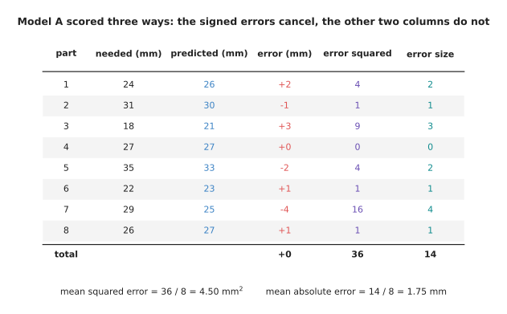

The signed errors add up to zero, the squared errors add up to 36 and the error
sizes add up to 14.

The signed total is the reason the last two columns remove the sign. That total
comes to exactly zero. The next picture shows how it gets there, by drawing the
eight errors as bars and the running total as a line across them.

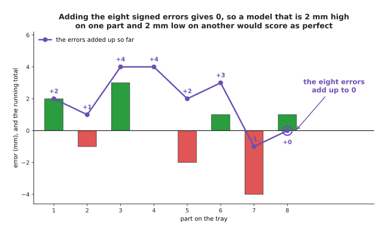

The running total goes up to +4 and down to -1, and it ends at 0.

So adding the signed errors cannot score a model. A model that is 2 mm too high
on one part and 2 mm too low on another part would score exactly the same as a
model that is perfect on both. The two usual losses remove the sign before
adding, and they remove it in two different ways.

The **squared error** of one prediction is the error multiplied by itself. A
negative error multiplied by itself is positive, so the sign disappears. The loss
for the whole set is the average of those squared errors, which here is 36
divided by 8, or 4.50.

The **absolute error** of one prediction is the size of the error with the sign
simply dropped, so an error of -4 mm becomes 4. The loss for the whole set is the
average of those sizes, which here is 14 divided by 8, or 1.75.

Those two rules look similar, but they treat a large mistake completely
differently. The next picture draws the penalty each one charges against the size
of the error.

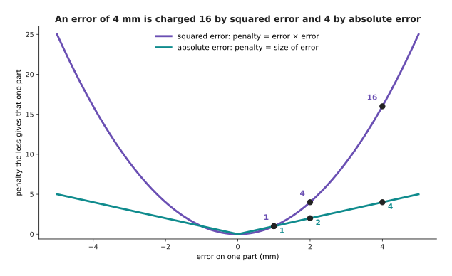

At an error of 4 mm the squared penalty is 16 and the absolute penalty is 4.

Read the two curves from the middle outwards. At an error of 1 mm both losses
charge 1. At 2 mm the squared loss charges 4 against the absolute loss's 2. At
4 mm the squared loss charges 16 against 4. At 12 mm the squared loss charges 144
against 12. So squared error charges a big mistake far more than twice what it
charges a mistake of half the size, while absolute error charges exactly twice.

That difference decides which part of the data each loss pays attention to. The
next picture shows model A's eight errors again, with the penalty each loss
charges for each part.

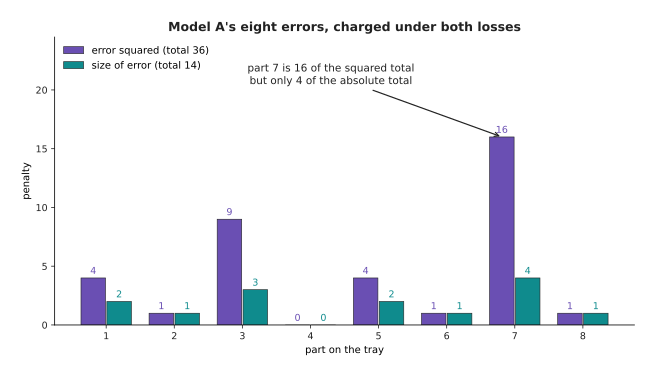

Part 7 is the one 4 mm miss. It supplies 16 of the squared total of 36, but only
4 of the absolute total of 14.

So under squared error nearly half of model A's loss comes from one part out of
eight. That is enough to change which model wins a comparison. The next picture
introduces a third model and shows all three.

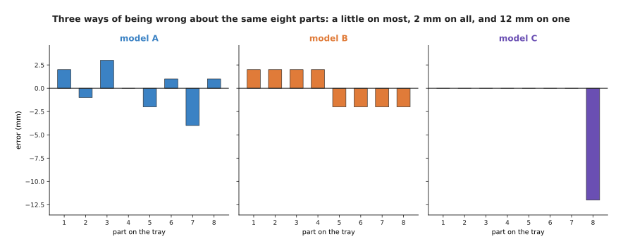

Model A is the model from section 1. Model B is wrong by exactly 2 mm on every
part. Model C is exactly right on seven parts and 12 mm out on the eighth part.

Now score those three models with each loss in turn. The next picture puts the
three models in order twice, once by the total of the error sizes and once by the
total of the squared errors. Read each chart as a ranking, with the shortest bar
meaning the best model.

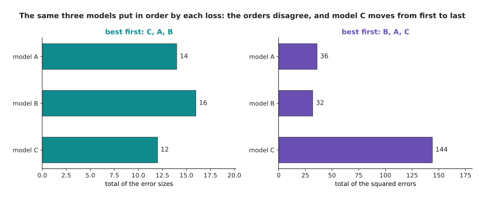

By the total of the error sizes the order is C, then A, then B. By the total of
the squared errors the order is B, then A, then C.

The numbers behind those two orders are these. The error-size totals are 14 for
model A, 16 for model B and 12 for model C, so model C is best by that measure.
The squared totals are 36, 32 and 144, so model B is best by that measure and
model C is worst, with four times model A's total. Model C moves from first place
to last place, and nothing about model C changed.

So choosing the loss is choosing what you mean by a good model, and the choice
follows from what a big mistake costs in the real work cell. Use squared error
when one large mistake is much worse than several small ones, because an arm that
is 12 mm out drives the gripper into the part and no number of perfect picks
makes up for that. Use absolute error when the data contains a few wild readings
that are not the model's fault, because squared error will move the model towards
those readings and absolute error will not.

The next picture shows that second case. A model gives one number, the force in
newtons that the gripper should use to hold one particular part. The chart tries
every force the model could give and draws what each loss charges for it. The
left panel uses seven good sensor readings, and the right panel is the same
picture after a sensor glitch adds an eighth reading of 19 newtons.

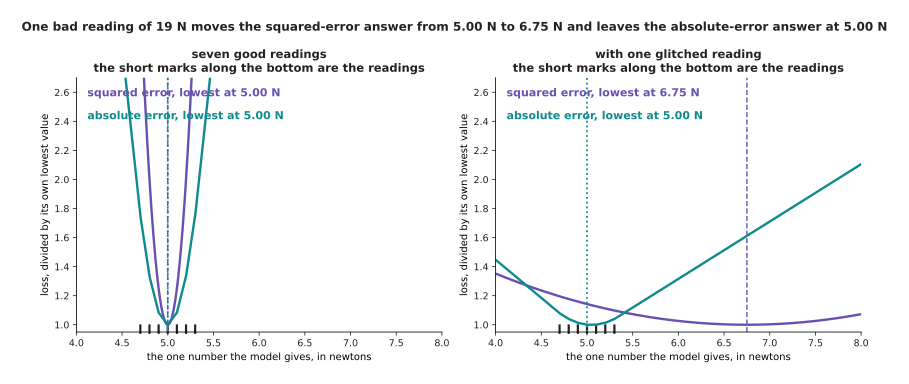

The one bad reading of 19 N moves the best squared-error answer from 5.00 N to
6.75 N. It leaves the best absolute-error answer at 5.00 N.

The seven good readings were chosen by hand as 4.8, 5.1, 4.9, 5.3, 5.0, 5.2 and
4.7 newtons, and then the glitch adds 19.0. With the seven good readings both
losses are lowest at 5.00 N. After the glitch is added, the best squared-error
answer moves to 6.75 N, while the best absolute-error answer stays between 5.00
and 5.10 N.

There is a simple reason for that difference, and it is worth knowing because it
holds for every dataset. The answer that makes the squared error smallest is
always the **average** of the readings, which is their total divided by how many
there are. The answer that makes the absolute error smallest is always the
**middle value**, which is the reading you land on when you sort the readings and
take the one in the centre. The next picture marks both on the readings
themselves.

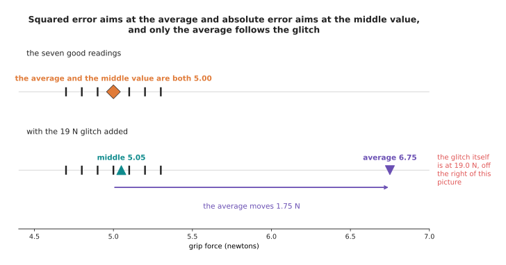

Adding the glitch moves the average by 1.75 N and moves the middle value by only
0.05 N.

The average moves because every reading is added into it, so one extreme reading
pulls the whole total. The middle value does not move much, because sorting the
readings only cares about the order of the readings and not about how far away
the extreme one sits. A depth camera that returns one nonsense reading in fifty
is completely ordinary hardware, which is why robot code often scores distances
with absolute error.

Both losses in this section score an answer that is a number. The next section
deals with an answer that is not a number.

---

## 3. When the answer is a choice: logits and softmax

Measuring the distance between a prediction and the right answer works whenever
both of them are numbers. However, asking which of four objects is in front of
the camera is asking for a choice between named things, and the distance between
"mug" and "bowl" is not a quantity. So a model that makes a choice works in a
different way. It gives one raw score for each possible answer, and those scores
are then turned into probabilities.

A **logit** is one of those raw scores. It is whatever comes out of the last
layer of the network for that one answer, so it can be any size and it can be
negative. On its own a logit means nothing, except that a larger logit means the
model prefers that answer more.

A **probability** is a number between 0 and 1 that says how likely something is.
A probability of 0 means the thing never happens and a probability of 1 means it
always happens. When a set of answers covers every possibility, their
probabilities must add up to 1.

Turning logits into probabilities is the job of **softmax**. Softmax takes three
steps, and the next picture works all three out for one picture of one object.
Read the table one row at a time, left to right, because each column is one step
applied to the row before it.

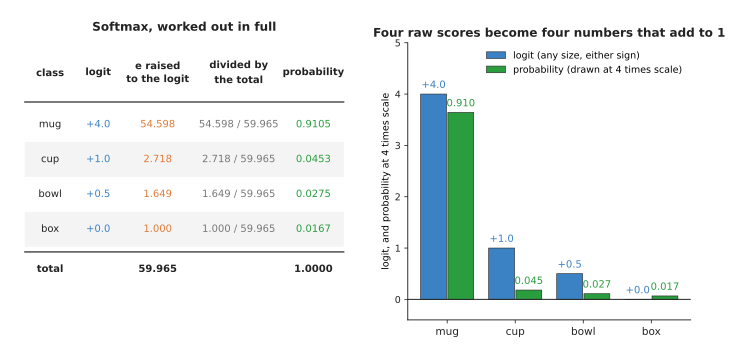

Softmax raises the number e to the power of each logit, adds the four results,
and divides each result by that total.

Here are the three steps in words. First, softmax raises the number e, which is
about 2.71828, to the power of each logit. This makes every score positive, and
it makes larger scores grow much faster than smaller ones, so the logits 4.0,
1.0, 0.5 and 0.0 become 54.598, 2.718, 1.649 and 1.000. Second, softmax adds
those four results, which gives 59.965. Third, softmax divides each result by
that total, so 54.598 divided by 59.965 is 0.9105. The four answers add up to
exactly 1.0000, because each one is a share of the same total.

The next picture draws the same numbers as bars, so that you can see the raw
scores and the shares beside each other. The probabilities are drawn at four
times their real size, because otherwise they would be too short to read next to
the logits.

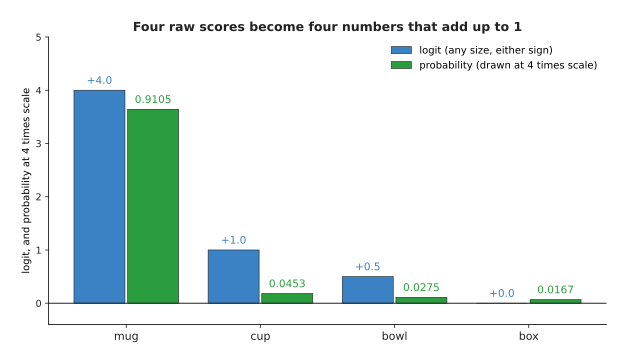

A gap of 3.0 between the mug logit and the cup logit becomes a probability of
0.9105 against 0.0453.

Two facts about softmax come up whenever you read real model code, and both are
worth checking by eye. The first is that only the gaps between the logits matter.
The next picture shows what happens if you add the same amount to every logit.

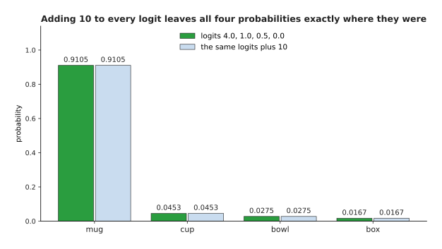

Adding 10 to every logit leaves all four probabilities exactly where they were.

That happens because the extra amount appears in every term of the division, both
above the line and below it, so it cancels. This is why a model's logits can
drift far from zero during training without changing anything the model says.

The second fact is that stretching the gaps between the logits sharpens the
probabilities. The next picture shows the same four logits divided by 4, left
alone, and multiplied by 2.

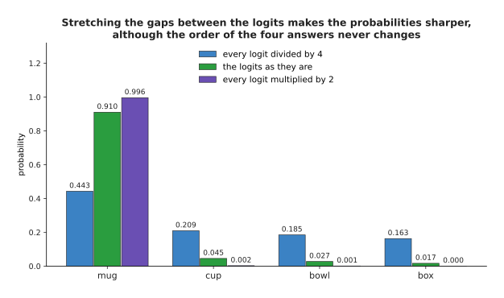

Dividing every logit by 4 gives the probabilities 0.4430, 0.2093, 0.1847 and
0.1630. Multiplying every logit by 2 gives 0.9963, 0.0025, 0.0009 and 0.0003.

Nothing about which object is really in front of the camera has changed between
those three sets of bars. Only how strongly the model states its answer has
changed. This is one reason models often sound more confident than they deserve
to be. The [uncertainty and confidence
page](../../07_learned-models/10_making-models-work-on-an-arm/03_also-used/01_uncertainty-and-confidence.md)
describes how that confidence is measured and corrected.

Three particular cases run through the rest of this page, and the next picture
introduces them. In all three the object really in front of the camera is a mug,
and the bar for mug is drawn dark.

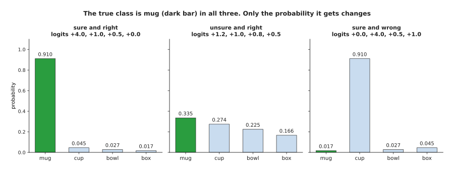

The right answer is mug in all three cases, and only the probability it is given
changes: 0.9105, then 0.3349, then 0.0167.

In the first case the model gives mug a probability of 0.9105 and is right. In
the second case it gives mug only 0.3349, but it is still right, because no other
answer scores higher. In the third case it gives mug 0.0167 and gives cup 0.9105,
so it is confidently wrong.

---

## 4. Cross-entropy: the price of a wrong probability

The model's answer is now a set of probabilities, one for each possible answer.
The loss looks at exactly one of them: the probability given to the answer that
was really there. Every other probability is ignored. The next picture shows this
for the second of the three cases.

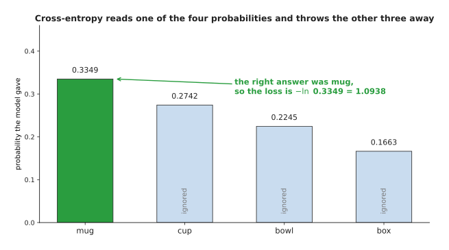

The right answer was mug, so the loss reads 0.3349 and ignores 0.2742, 0.2245 and
0.1663.

That loss is called **cross-entropy**, and its rule is as short as the rule for
softmax. You take the probability given to the right answer, take its natural
logarithm, and change the sign.

The **natural logarithm** of a number, written ln, is the power you have to raise
e to in order to get that number. For example, ln of 1 is 0, because e raised to
the power 0 is 1. The natural logarithm of any number smaller than 1 is negative,
and it becomes more negative the smaller the number gets. Changing the sign
therefore makes the loss 0 when the right answer was given a probability of 1,
and makes the loss grow as that probability falls.

The next picture draws that rule as a curve, with the three cases from section 3
marked on it.

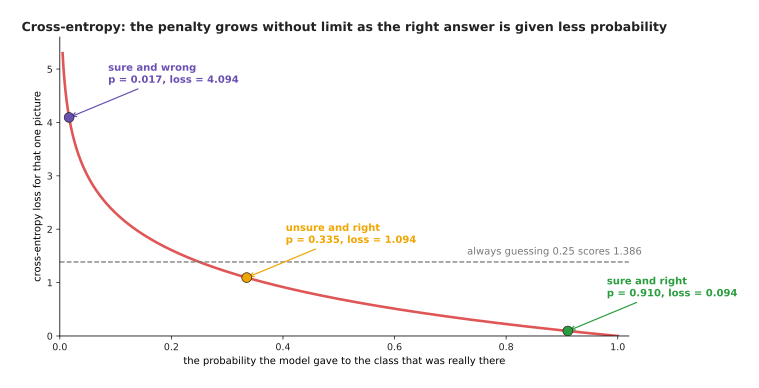

The penalty is 0 when the right answer is given all the probability, and it grows
without limit as that probability approaches 0.

Read the curve from right to left. At a probability of 1 the loss is 0. At 0.5 it
is 0.6931. At 0.1 it is 2.3026. At 0.01 it is 4.6052, and at 0.001 it is 6.9078.
There is no largest value, and that is the most important property of this loss,
because a model that gives the right answer almost no probability is charged
almost without limit. The dashed line is a useful reference point. A model that
gives every one of four answers a probability of 0.25 scores 1.3863 on every
picture, so any loss above 1.3863 is worse than pure guessing.

The next picture puts the three cases side by side, with the probability each one
gave to the right answer on the left and the loss each one was charged on the
right. The two panels show the same three cases measured two ways.

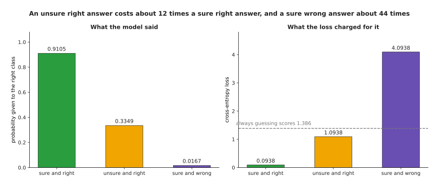

The sure right answer costs 0.0938, the unsure right answer costs 1.0938 and the
sure wrong answer costs 4.0938.

Those three numbers show the loss doing its job. The unsure right answer costs
about 12 times the sure right answer, although anybody counting correct answers
would count both as correct. So cross-entropy pushes the model not merely to be
right, but to be right confidently. The sure wrong answer costs about 44 times
the sure right answer, and about three times what pure guessing costs.

In real training the loss is averaged over a **batch**, which is a group of
examples handled together in one step. The next picture shows one batch of six
pictures of the same object. The left panel gives the probability each picture
received on mug, and the right panel gives the loss each one was charged.

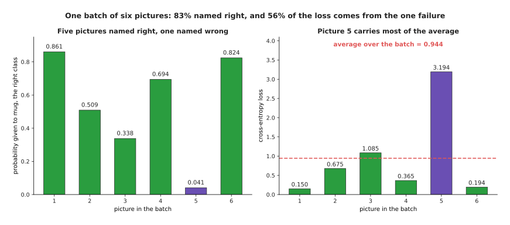

Five of the six pictures were named right, and the one failure supplies 56 per
cent of the average loss.

The six rows of logits were chosen by hand, and the right answer is mug every
time. The model names five of the six correctly, so its accuracy is 83.3 per
cent, which sounds respectable. However, its average loss is 0.9440, and picture
5 alone supplies 56.4 per cent of that average. Picture 5 gave mug a probability
of 0.041 and was charged 3.194, while the other five pictures average only
0.4940. That imbalance is deliberate, because the examples the model gets badly
wrong are the examples it has most to learn from.

---

## 5. The loss landscape of one weight

Everything so far has scored a fixed set of predictions. Training does not work
that way. Training changes the weights, and the predictions follow. So the loss
is best looked at as something that depends on the weights, and the smallest
honest example of that is a model with exactly one weight.

Here is that model. A camera looks down at a tray. The height of a part in the
camera picture tells the arm how far it must travel to reach that part, so the
model multiplies that height by a single weight, called w. The five parts were
chosen by hand. Their heights in the picture, measured in tens of pixels, are 1,
2, 3, 4 and 5. The travel each part really needed, in millimetres, was 3.1, 5.8,
9.2, 11.9 and 15.1.

The next picture draws those five parts as dots, with three straight lines
through them. Each line is one setting of w, and the thin vertical lines show the
errors that setting makes.

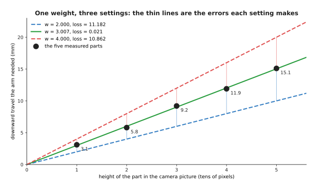

Setting w to 2.000 gives a loss of 11.182, setting it to 4.000 gives 10.862, and
setting it to 3.007 gives 0.021.

The thin vertical lines shrink almost to nothing for the middle line. The loss
here is the mean squared error from section 2, and it is 11.1820 at w = 2.0,
2.8520 at 2.5, 0.0220 at 3.0, 2.6920 at 3.5 and 10.8620 at 4.0. So the loss falls
and then rises again as w passes through 3.

The next picture draws that loss at 801 settings of w, which makes the whole
shape visible at once.

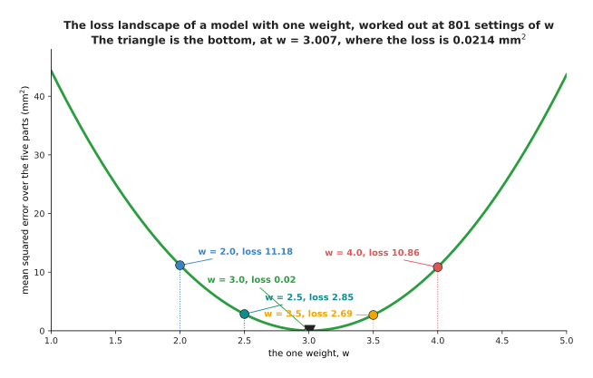

The loss makes one smooth bowl. Its lowest point is at w = 3.007, where the loss
is 0.0214 square millimetres.

This picture is called the **loss landscape**, and it is the most useful way to
think about training. The horizontal axis is the weight, the vertical axis is the
loss, and training is the job of finding the bottom of the bowl. For this one
model the bottom can be worked out directly: it sits at the total of height times
travel divided by the total of height times height, which is 165.4 divided by 55,
or 3.0073.

A real network has millions of weights, so nobody can draw its landscape.
However, the idea carries over unchanged, and the next page walks down this very
curve one step at a time.

The shape of the landscape depends on which loss you chose. The next picture
draws the same five parts against the same single weight twice, once scored with
squared error and once with absolute error. The two panels are the same data
measured two ways, so compare their shapes rather than their heights.

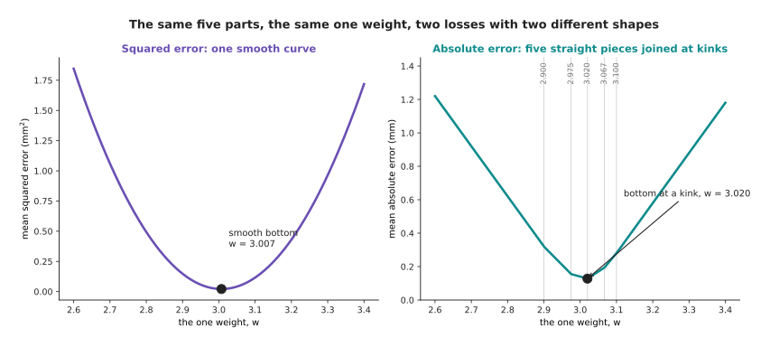

Squared error gives a smooth curve with its bottom at w = 3.007. Absolute error
gives straight pieces joined at sharp corners, with its bottom on the corner at
3.020.

The grey lines on the right-hand panel mark the five settings of w at which the
model predicts one of the five parts exactly. Those settings are 2.900, 2.975,
3.020, 3.067 and 3.100, and each one is a place where one part's penalty changes
direction. Between two of those settings the absolute loss is a straight line, so
its steepness is the same along a whole piece and then jumps suddenly at the
join. That matters for the next page, because the method on the next page works
by reading how steep the loss is. A loss whose steepness jumps is harder to work
with, and that is one reason squared error is the usual choice, even though
absolute error copes better with wild readings.

Cross-entropy has a landscape too, and it is worth drawing because its shape is
not symmetrical. The model for this one decides whether a grip held or dropped a
part. The seven grips were made up: the same part was gripped at 2, 3, 4, 5, 6, 7
and 8 newtons, and it stayed in the gripper at 4, 6, 7 and 8 newtons while
falling out at 2, 3 and 5. The grip at 4 N that held does not fit the pattern,
which is what real data looks like. The model turns the force into a logit by
multiplying the amount the force is above 5 N by one weight, w.

The next picture shows the seven grips as dots, and three curves for three
settings of that weight.

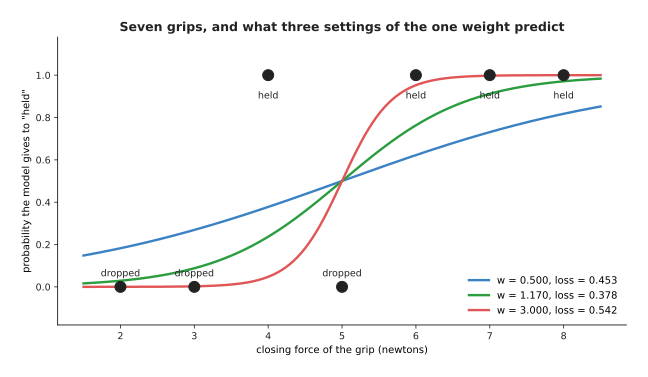

A small weight gives a gentle curve that commits to nothing. A large weight gives
a steep curve that commits strongly to every grip.

The next picture draws the cross-entropy of that model against the same weight.

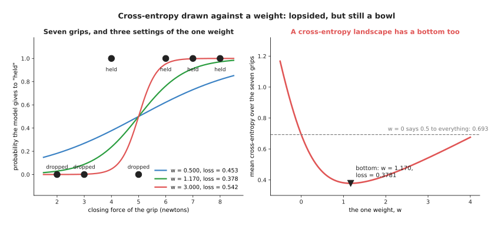

The loss falls from 0.6931 at w = 0 to a lowest value of 0.3781 at w = 1.170, and
then it climbs again.

Read that curve from left to right. At w = 0 the model gives every grip a
probability of 0.5, and its loss is 0.6931, which is ln 2. That is what any model
scores when it refuses to commit on a two-way choice. Raising w makes the model
commit, and the loss falls to 0.3781 at w = 1.170. Past that point the loss rises
again, because the model becomes so sure that the one grip at 4 N that held costs
more than the confident correct answers save. The landscape is not symmetrical,
but it still has exactly one bottom.

---

## 6. Choosing a loss, and what it costs

You have now seen three losses working. The question left is which one to reach
for, and the answer follows from what a mistake costs rather than from the
mathematics.

For an answer that is a number, the usual choice is squared error. It gives a
smooth landscape, and it charges one big mistake far more than several small
ones, which is what you want on a machine that can damage itself. What it costs
you is that it believes every label completely, so a few wrong labels pull the
model towards them.

The obvious alternative is absolute error, which has the opposite habits. It
ignores wild readings but gives a landscape with sharp corners. A third loss
tries to have both sets of habits at once.

The **Huber loss** is squared for small errors and straight for large ones. You
choose the error size at which it switches from one to the other, and here that
switch point is set to 1 mm. The next picture draws all three penalties against
the size of the error.

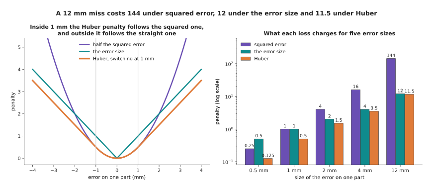

Inside 1 mm the Huber penalty follows the squared curve, and outside 1 mm it
follows the straight line.

The next picture gives the actual numbers at five error sizes. The vertical axis
is a log scale, which means each step up the axis multiplies the value by ten, so
that 0.125 and 144 can appear in the same picture.

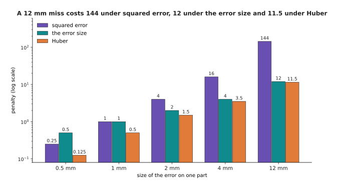

At 0.5 mm the three charge 0.25, 0.5 and 0.125. At 1 mm they charge 1, 1 and 0.5.
At 2 mm they charge 4, 2 and 1.5. At 4 mm they charge 16, 4 and 3.5. At 12 mm
they charge 144, 12 and 11.5.

So near zero the Huber loss keeps the smooth landscape of squared error, and far
from zero it keeps one wild reading from taking over the whole total. What it
costs you is one more number to choose, because the switch point has to match the
size of error you treat as normal.

You can watch the three losses disagree by replacing one of the five measured
travels from section 5 with a glitched value. The next picture does that, and
draws the line each loss fits through the damaged data.

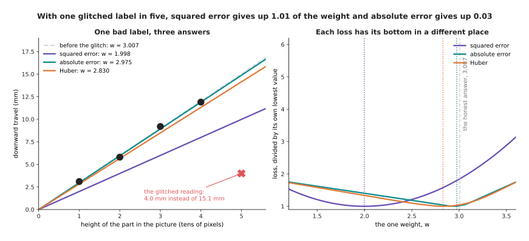

The squared-error line is pulled a long way below the four good parts. The
absolute-error line passes through them almost exactly.

The honest best weight, before any glitch, was 3.0073. The fifth travel is now
changed from 15.1 mm to 4.0 mm, which is what a depth camera does when it reads
through a hole in the part. The next picture draws the three landscapes over that
damaged data, so that you can see where each loss now puts its bottom.

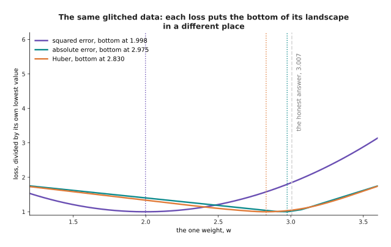

After the glitch the best weight is 1.9980 under squared error, 2.8300 under
Huber and 2.9750 under absolute error.

Compare each of those with the honest answer of 3.0073. One bad label out of five
has moved the squared-error answer by 1.01, the Huber answer by 0.18 and the
absolute-error answer by only 0.03. So squared error has lost a third of its
weight and absolute error has barely noticed. That is why a pipeline that takes
its labels from a sensor often uses Huber.

For an answer that is a choice, the usual choice is cross-entropy. The obvious
alternative deserves a direct answer, because it is tempting to score the
probabilities with squared error instead. The next picture shows the first reason
not to.

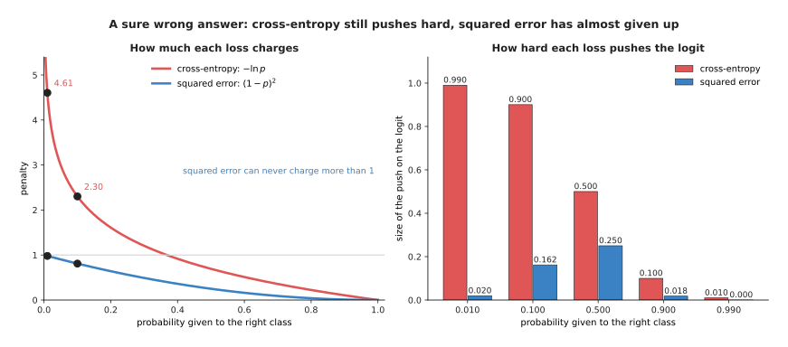

Cross-entropy charges 4.61 at a probability of 0.01, while squared error on the
probability can never charge more than 1.

So a model that is certain and wrong is barely penalised under squared error. The
second reason is about the push on the model rather than the charge, and the push
is what training actually uses. The push was measured by moving the logit a tiny
amount and seeing how much the loss moved. The next picture gives that
measurement at five probabilities.

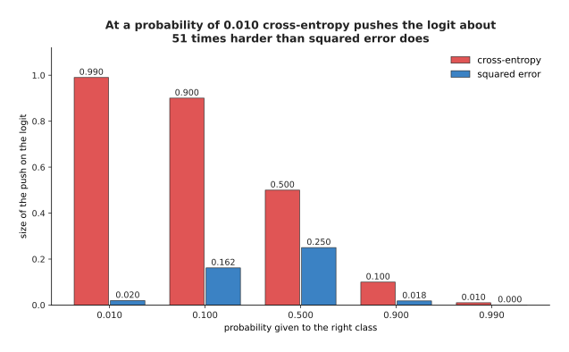

At a probability of 0.010 cross-entropy changes by 0.990 for each unit of logit,
while squared error changes by only 0.0195, which is about 51 times less. At a
probability of 0.100 the two values are 0.900 and 0.162.

So squared error pushes hardest in the middle and almost stops pushing on exactly
the examples the model most needs to learn from. What cross-entropy costs in
return is that it will chase a single mislabelled example without limit, and the
[overfitting
page](../04_making-training-work/01_overfitting-and-generalisation.md) deals with
that problem.

The loss, then, is what you have chosen to make small, and nothing later in
training questions that choice. The next page takes the landscape this page drew
and shows how a model walks down it.

---

## 7. Where to read next

- [Gradient descent](02_gradient-descent.md) is the next page, and it walks down
  the loss landscape from section 5 one step at a time.
- [Backpropagation](03_backpropagation.md) explains how the steepness of the loss
  is worked out for every weight in a real network.
- [The training loop](04_the-training-loop.md) puts the loss, the steepness and
  the steps together into the code a real run executes.
- [Overfitting and
  generalisation](../04_making-training-work/01_overfitting-and-generalisation.md)
  explains why a small loss on the examples you trained on is not the same thing
  as a model that works.
- [Linear and logistic
  regression](../../07_learned-models/02_classical-machine-learning/02_most-used/01_linear-and-logistic-regression.md)
  is the classical method built on exactly these losses, with the software that
  fits it.
- [Uncertainty and
  confidence](../../07_learned-models/10_making-models-work-on-an-arm/03_also-used/01_uncertainty-and-confidence.md)
  describes what to do when softmax probabilities are more confident than the
  model deserves.

---

## 8. Using it in Python

Every loss on this page is one line in PyTorch. The code below works out the same
numbers that the sections above quote, so you can run it and check them.

```python
import torch
from torch import nn

# section 2: the eight predictions and the eight right answers
needed = torch.tensor([24., 31., 18., 27., 35., 22., 29., 26.])
predicted = torch.tensor([26., 30., 21., 27., 33., 23., 25., 27.])
print(nn.MSELoss()(predicted, needed).item())              # 4.5    squared error
print(nn.L1Loss()(predicted, needed).item())               # 1.75   absolute error
print(nn.HuberLoss(delta=1.0)(predicted, needed).item())   # 1.3125 section 6

# section 3: four logits for one picture, turned into four probabilities
logits = torch.tensor([[4.0, 1.0, 0.5, 0.0]])
print(torch.softmax(logits, dim=1))   # tensor([[0.9105, 0.0453, 0.0275, 0.0167]])

# section 4: cross-entropy takes the LOGITS, not the probabilities,
# and the index of the right class, where 0 means mug
truth = torch.tensor([0])
print(nn.CrossEntropyLoss()(logits, truth).item())                      # 0.0938
print(nn.CrossEntropyLoss()(torch.tensor([[1.2, 1.0, 0.8, 0.5]]), truth).item())  # 1.0938
print(nn.CrossEntropyLoss()(torch.tensor([[0.0, 4.0, 0.5, 1.0]]), truth).item())  # 4.0938

# section 5: the loss landscape of the one-weight model, at three settings
height = torch.tensor([1., 2., 3., 4., 5.])
travel = torch.tensor([3.1, 5.8, 9.2, 11.9, 15.1])
for w in (2.0, 3.0073, 4.0):
    print(w, nn.MSELoss()(w * height, travel).item())   # 11.182, 0.0214, 10.862
```

The library gives you the arithmetic, and it gives it in a form that can be
walked down later, which is more useful still. Every one of these losses returns a
single number for a whole batch, which is the requirement from section 1. Each
one also records how it was worked out, so that the next page's method can ask
which way is downhill. That record keeping is the real service the library
provides, because writing the average of squared differences takes one line while
working out its steepness through a hundred-layer network takes a year.

One detail catches nearly everybody once. `nn.CrossEntropyLoss` expects the raw
logits and applies softmax itself. So if you pass it probabilities that you have
already put through softmax, it applies softmax twice, and it quietly returns a
wrong loss that is much flatter than the real one. The library is written that way
because doing the two steps together is faster, and because it is safer when the
logits are very large.

What you still have to decide is everything this page has been about. You choose
which loss matches the cost of being wrong in your own work cell. You choose the
Huber switch point, if you use Huber. You choose whether some examples count more
than others, which `nn.CrossEntropyLoss` supports through its `weight` argument.
None of those choices is checked by anything, and a run with the wrong loss will
train perfectly happily towards the wrong model.
