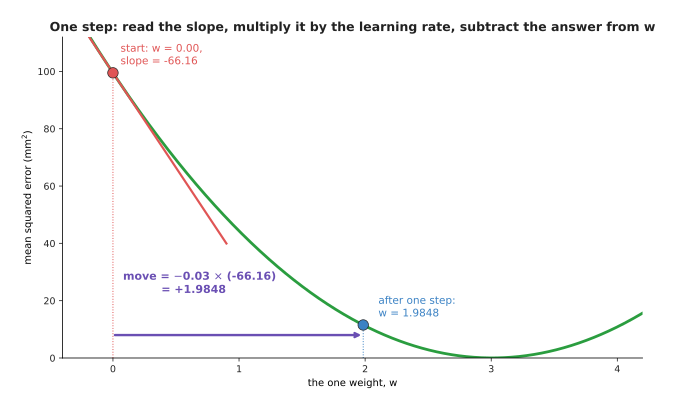
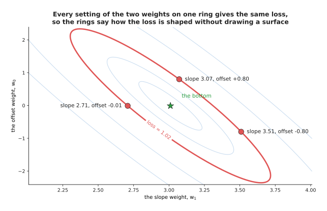
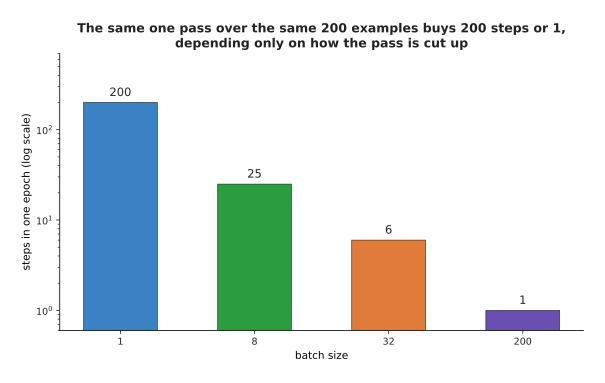
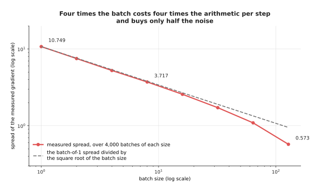
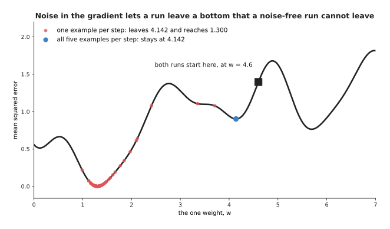
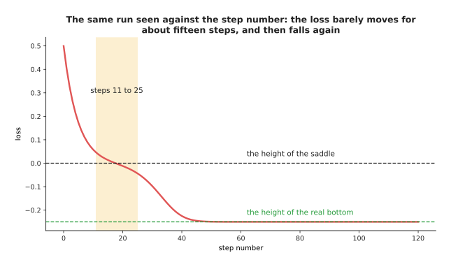
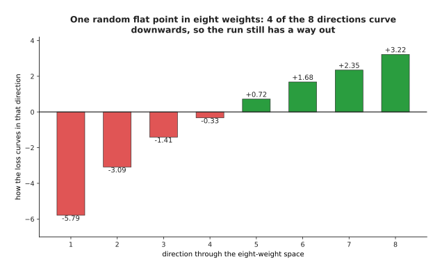
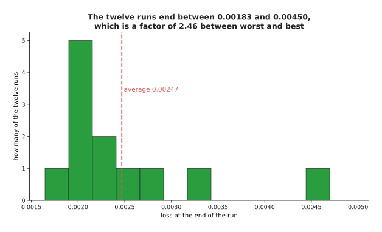

# Gradient descent

The page before this one, [the score of being
wrong](01_the-score-of-being-wrong.md), built the loss and drew it against a
single weight. That drawing was a smooth bowl whose lowest point sat at 3.0073,
and it left the model standing somewhere on the side of that bowl with no way
down. This page is the way down. The method is called **gradient descent**, and
every trained model in this book depends on it.

The method is short to state. You work out which way the loss falls, you move the
weights a small distance that way, and you repeat that thousands or millions of
times. Making the method work is harder, for three reasons. The size of the step
decides whether the run arrives, takes far too long, or fails completely. Real
models have millions of weights to move at once rather than one. No real run can
read the whole dataset before every single step. This page deals with all three
reasons, and it ends with the two shapes in the landscape that people worry about
most, which turn out to matter least.

By the end you will know how one step is worked out, how to choose the one number
that controls the step size, why the shape of your data changes how long training
takes, and why a network with millions of weights almost never gets stuck.

The page assumes you know what a loss and a loss landscape are. It uses the same
five measured parts as the page before, where the height of a part in a camera
picture is multiplied by one weight, w, to give the downward travel the arm
needs. Nothing here needs calculus, and the one piece of calculus vocabulary that
appears is explained where it appears. Every number came from
`docs/diagrams/how_training_works_1.py`.

## Contents

1. [What the slope of a loss curve means](#1-what-the-slope-of-a-loss-curve-means)
2. [One step downhill, and the learning rate](#2-one-step-downhill-and-the-learning-rate)
3. [Crawling, arriving and running away](#3-crawling-arriving-and-running-away)
4. [Two weights, a contour map and a real path](#4-two-weights-a-contour-map-and-a-real-path)
5. [Mini-batches, epochs and noisy steps](#5-mini-batches-epochs-and-noisy-steps)
6. [Local minima and saddle points](#6-local-minima-and-saddle-points)
7. [Where to read next](#7-where-to-read-next)
8. [Using it in Python](#8-using-it-in-python)

---

## 1. What the slope of a loss curve means

The bowl from the page before gives the loss at every setting of the weight. The
question is which way to move from wherever the model is standing. The answer
comes from a measurement anybody can make: change the weight by a tiny amount and
see how much the loss changes.

The next picture makes that measurement. The left panel shows the whole loss
curve with a small box drawn around the point at w = 1. The right panel shows
that same box enlarged, so that a change far too small to see on the left becomes
readable.


At w = 1.00 the loss is 44.3420. At w = 1.01 it is 43.9015. So the change of
-0.4405 divided by the move of 0.01 gives -44.05.

That last number is the one that matters. It says that near w = 1 the loss falls
by about 44 square millimetres for every 1 that the weight rises. Its sign says
which way is downhill, and its size says how steeply the ground falls. This
number is called the **slope** of the loss at that weight.

The slope is different at every setting of the weight. The next picture measures
it at four of them, and draws the straight line that each slope describes.


The slope is -55.16 at w = 0.50, -33.16 at 1.50, 0.00 at the bottom of the bowl
and +32.84 at 4.50.

Reading those four values in order gives the whole rule. At w = 0.50 the slope is
-55.16, so the loss falls as the weight rises, and therefore the weight should go
up. At w = 1.50 the slope is still negative but smaller, -33.16, so the weight
should still go up, but there is less to gain by moving. At w = 3.01 the slope is
0.00, which means the ground is flat, and that is the bottom of the bowl. At
w = 4.50 the slope is +32.84, so the loss now rises as the weight rises, and
therefore the weight should come down.

The short straight lines through each point are what the slope describes, because
very close to the point the curve and that line are almost the same. However, the
measurement depends on the size of the change you make, and too large a change
measures the wrong thing. The next picture shows what happens as the change
shrinks. Read the table one row at a time: the size of the change, the loss after
it, the change in the loss, that change divided by the move, and how far the
answer is from the right one.


As the move shrinks from 1 to 0.0001, the measured ratio goes from -33.16 to
-44.1589, closing in on the exact slope of -44.16.

A move of 1 gives -33.16, which is 11.00 away from the right answer. A move of
0.1 gives -43.06, which is 1.10 away. A move of 0.0001 gives -44.1589, which is
0.0011 away. So each ten-fold shrink of the move cuts the error ten-fold, and the
measured ratio settles on one exact value.

That exact value has a name. The **derivative** of the loss with respect to a
weight is the number the measured ratio closes in on as the move is made smaller
and smaller. It answers the question "if I move this weight a tiny bit, how much
does the loss change". The **gradient** is the whole collection of those
derivatives, one for each weight in the model. This model has one weight, so its
gradient is a single number.

Nobody measures a real gradient by making small changes like this, because a
model with a million weights would need a million separate measurements for every
step. [Backpropagation](03_backpropagation.md) explains the method that produces
all of them at once.

---

## 2. One step downhill, and the learning rate

The slope tells you which way to go and how steep the ground is. It does not tell
you how far to walk, and that is the one thing you have to choose yourself.

Gradient descent chooses by multiplying. The move is the slope multiplied by a
small number you pick, with the sign reversed so that the weight goes the
opposite way to the slope. That small number is the **learning rate**, and on this
page it is 0.03 unless another value is named.

The next picture works one single step out in full, starting from w = 0.



At w = 0 the slope is -66.16, so the move is -0.03 multiplied by -66.16, which is
+1.9848, and the new weight is 1.9848.

Notice that the move came out positive although the slope was negative. That is
what reversing the sign does, and it is what makes the step go downhill rather
than uphill. The loss fell from 99.5020 to 11.5214 in that one step.

Now repeat the same arithmetic. The next picture is a table of eight steps. Read
it one row at a time, because each row is one step, and the last column of a row
is the second column of the row below it.


From w = 0 with a loss of 99.5020, eight steps at a learning rate of 0.03 reach
w = 3.0067 with a loss of 0.0214.

Follow the slope column down the table. At step 0 the slope is -66.1600, so the
move is +1.9848. At step 1 the slope has already shrunk to -22.4944, so the move
is only +0.6748. By step 7 the move is +0.0010, leaving the weight at 3.0067
against a bottom at 3.0073. The same arithmetic, run eight times, has taken the
model from useless to right.

The next picture draws those steps on the curve itself. The left panel shows the
whole curve with the first steps marked and a small box around the rest. The
right panel shows that box enlarged.


The first three steps cover almost the whole distance, and steps 2 to 12 all fall
inside a box only 0.6 wide.

So the dots start far apart, crowd together as the run arrives, and never go past
the bottom. The next picture shows the same run as a loss against the step
number, which is the chart a real training run prints while it is working. The
two panels are the same run drawn on two different vertical scales.


The loss falls from 99.5020 to 11.5214 after one step and 1.3508 after two steps,
and the gap to the bottom is cut to about an eighth of itself at every step.

The left panel has the shape every run has: a steep fall, and then a long flat
stretch where nothing seems to be happening. The right panel shows that something
is still happening. Drawing the gap above the bottom in powers of ten turns the
curve into a straight line, and a straight line on that scale means the gap is
being divided by the same amount every step. That gap is 99.5 at the start, 1.33
after two steps, 0.00205 after five steps and 0.0000000424 after ten steps.

The run slows down on its own, and it is worth seeing why. The next picture draws
two measurements of the same run: the size of the slope at each step, and the
distance the weight actually moved at each step.


The slope shrinks from 66.160 at step 0 to 0.035 at step 7, so the move shrinks
from 1.985 to 0.001, although the learning rate never changes.

This is the quiet advantage of multiplying by the slope. The move at step 0 is
1,904 times the move at step 7, and nobody adjusted anything in between. The
slope flattens as the bottom comes nearer, so the step shrinks with it. A method
that always moved a fixed distance would arrive at the bottom and then jump
straight past it, over and over again.

---

## 3. Crawling, arriving and running away

The learning rate is now the only thing left to choose. The same curve and the
same starting point give three completely different runs, depending on the number
you pick.

The next picture shows all three. The three panels are the same loss curve with
the same starting point, and only the learning rate differs between them.


At a learning rate of 0.0005, forty steps reach only w = 1.075. At 0.03, twelve
steps reach 3.007. At 0.1, six steps reach -5.972.

The left panel shows a rate that is too small. The dots are packed almost on top
of each other, and after forty steps the weight has crawled from 0 to 1.075 with
a loss of 41.08, which is still most of the way up the side of the bowl. Nothing
is wrong with this run except that it needs hundreds more steps, and every step
costs real time on real hardware.

The right panel shows a rate that is too large. Each step goes past the bottom
and lands further up the opposite side than it started. So the next slope is
steeper, the next move is larger, and after six steps the weight is at -5.972
with a loss of 887. The run is getting worse, not better.

The next picture shows the same three runs as a loss against the step number, on
a scale marked in powers of ten so that all three fit in one chart.


Over forty steps the loss at 0.0005 falls only from 99.5 to 41.08. At 0.03 it
reaches 0.0214 and stays there. At 0.1 it climbs to 215 million.

This is the chart you watch while a run is going, and the three shapes are easy to
recognise. A line sloping gently downwards and still far from flat means the rate
is too small. A line that drops and then runs flat means the rate is about right.
A line that climbs means the rate is too large, and the run should be stopped at
once.

For this small model, the exact point at which the behaviour changes can be
worked out, which is a convenience you will not have with a real network. The next
picture runs twelve steps at every learning rate between 0.00006 and 0.126, and
draws how far the loss ended up above the lowest possible loss.


The run is stable at every rate below 0.0909 and runs away at every rate above
it.

The curve has three parts. On the left it slopes gently downwards, because a
larger rate gets closer to the bottom in twelve steps: at 0.0005 the loss is still
76.31, while at 0.005 it is 6.09. In the middle there is a deep notch at 0.0455,
which is 1 divided by 22. That is the rate at which the very first step from
w = 0 lands exactly on 3.0073. On the right there is a cliff at 0.0909, which is
1 divided by 11, and that is where every run starts growing instead of shrinking.
At a rate of 0.0909 the loss after twelve steps is 99.03, and at 0.1 it is 7,908.

The shape matters more than the exact numbers, because the slope down is gentle
while the cliff is sudden. A rate three times too small costs you time. A rate
slightly too large costs you the whole run. That is why people choose a rate by
trying a few values and taking one comfortably below the point where the loss
starts climbing. [The training loop](04_the-training-loop.md) describes the
methods that change the rate while the run is going.

---

## 4. Two weights, a contour map and a real path

One weight is enough to see the method, but it is not enough to see the method's
main difficulty. That difficulty appears as soon as there is more than one weight
to move at a time.

So give the model two weights. It multiplies the camera height by a slope weight,
and then adds an offset weight. The loss now depends on two numbers rather than
one, so the landscape is a surface rather than a curve.

A surface cannot be drawn on flat paper directly, so it is drawn as a **contour
map**. On a contour map, each ring joins together all the settings of the weights
that give exactly the same loss. The next picture shows one such ring on its own.



The three marked settings are slope 3.51 with offset -0.80, slope 2.71 with
offset -0.01, and slope 3.07 with offset +0.80. All three give a loss of 1.02.

So a ring near the star in the middle means a low loss, and a ring far from the
star means a high loss. Rings packed close together mean the loss changes quickly
as you walk across them, and rings far apart mean it changes slowly.

The next picture puts a real run on that map. The left panel shows the whole path
of 80 steps. The right panel shows the same path close up, after the run has
reached the long thin part of the map.


Eighty steps at a learning rate of 0.08 travel from slope 0 and offset 0 to slope
2.9855 and offset 0.0773, against a bottom at slope 3.0100 and offset -0.0100.

The rings here are long thin ellipses rather than circles. That shape says the
loss changes quickly in one direction and slowly in another direction. The left
panel shows the path reaching the long thin valley quickly and then moving along
it very slowly. The close-up shows why that part is slow: each step crosses the
valley and lands on the other side, so most of the movement is across the valley
rather than along it.

The gradient now holds two numbers, one for each weight, and together they point
in the steepest downhill direction. The next picture draws that direction at a
grid of settings.


Each arrow is the pair of slopes with the sign reversed, and every arrow crosses
the contour lines at a right angle.

The script prints the numbers behind three of those arrows. At a slope of 2.4 and
an offset of 2.0, the loss changes by -1.360 for each unit of slope and +0.360 for
each unit of offset, so downhill is +1.360 and -0.360. At a slope of 3.6 and an
offset of -2.0, downhill is -1.040 and +0.440. At a slope of 3.0 and an offset of
1.5, the loss changes by +8.840 and +2.960, and the arrow there is much longer
because that point sits on a steep part of the surface. A step moves both weights
at once, each one by its own slope multiplied by the same learning rate.

The crossing back and forth comes from the shape of the rings, and the shape of
the rings comes from the data. The next picture shows that directly. The two
panels are the same five parts and the same two weights, drawn once with the
camera heights left as they are and once with those heights rescaled.


With the camera heights as they are, the loss curves 70 times more steeply in one
direction than another, and the run needs 224 steps. Rescaling the heights makes
the two directions equal, and the run needs 42 steps.

That number 70.0 is the ratio between the steepest and the shallowest curvature
of this loss, which are 23.6619 and 0.3381. It is what forces the crossing back
and forth, because the learning rate has to be small enough not to run away in
the steep direction. The largest safe rate here is 0.0845, which is far too small
to make progress in the shallow direction.

Rescaling means subtracting the average height from every height and then
dividing by their spread. It changes nothing about the problem and everything
about its shape. After rescaling, both curvatures become 2.0, the largest safe
learning rate becomes 1.0, and the path runs straight to the bottom.

The next picture measures what that is worth. Both runs use nine tenths of their
own largest safe learning rate, which is the fairest comparison available.


After 50 steps the raw run is 0.008255 above the bottom, while the rescaled run
is 0.00000002 above it.

Both lines fall steadily and both runs would arrive in the end. However, one
arrives about five times faster for exactly the same arithmetic per step, which is
why scaling the inputs is the first thing anybody does to a dataset.
[Normalisation and
stability](../04_making-training-work/02_normalisation-and-stability.md) covers
the layers that do the same thing inside a network.

---

## 5. Mini-batches, epochs and noisy steps

Everything so far has worked out the loss, and so the gradient, over every example
at once. That is fine for five parts and impossible for a real dataset, because a
step that reads a million pictures before moving the weights once means a day of
arithmetic for one step. So the fix is to read only a handful of examples each
time.

A **mini-batch** is a small group of examples whose gradient is used for one step,
as though it were the gradient of the whole dataset. Gradient descent run this way
is called **stochastic gradient descent**, where stochastic means that chance is
involved, because which examples land in a batch is decided by shuffling. An
**epoch** is one complete pass through the whole dataset, so an epoch holds as
many steps as there are batches in it.

The next picture shows one epoch of 200 examples cut into batches of 8.


Each small block is one example, and each group of eight blocks is one batch, so
this epoch holds 25 steps.

The 200 examples used from here on are simulated: a seeded random generator drew
the camera heights, and the travels were made from a straight line with noise
added. The next picture shows what the batch size buys, before any training
happens at all. The vertical axis is a log scale, which means each step up the
axis multiplies the value by ten.



With 200 examples, one epoch gives 200 steps at a batch of 1, 25 steps at a batch
of 8, 6 steps at a batch of 32 and 1 step at a batch of 200.

So the same single pass over the same data buys 200 steps or one step, depending
only on how the pass is cut up. The next picture shows what that difference is
worth in practice. The two panels are the same contour map with two runs on it,
both reading the same examples the same number of times.


Six epochs give the full-batch run 6 steps, ending at a loss of 15.110. The same
six epochs give the batch-of-8 run 150 steps, ending at 1.360 against a best
possible loss of 1.350.

Both runs read the same 1,200 examples and did the same amount of arithmetic. The
mini-batch run arrived while the full-batch run was still on its way. Its path is
untidy, because each step uses a gradient measured from only 8 examples and
therefore points slightly the wrong way. However, those errors point in different
directions each time and largely cancel over many steps, so the path reaches the
bottom and then moves about near it.

The next picture compares four batch sizes fairly. It measures progress against
the number of examples read rather than the number of steps taken, because
reading an example is what costs time.


After one epoch of 200 examples the gap above the bottom is 0.4244 at a batch of
1, 0.0100 at a batch of 8, 8.7041 at a batch of 32 and 78.6749 at a batch of 200.

The small batches win easily early on. The batch of 200 is still 3.41 above the
bottom after ten passes. The batch of 1 got close fastest and then moved about
near the bottom, ending the tenth epoch 0.4841 above it, which is worse than it
managed at the end of the third epoch. A batch of 8 or 32 is both quick and
steady.

The reason is the amount of noise in the measured gradient, and the next picture
measures that noise directly. It takes many random batches at one fixed setting of
the weights and counts how often each measured gradient came up.


Over 1,500 drawn batches, a batch of 1 gave values from -29.8 to +13.8, a batch of
8 gave values from -17.2 to +5.7, and a batch of 64 gave values from -8.1 to -0.6.
All 200 examples together give -4.01.

Every batch size gives the right answer on average, which is why the method works
at all. However, a single batch of 1 can give almost anything. The next picture
measures the spread at eight batch sizes, where spread means the usual distance of
a single measurement from the average of them all.



The spread falls from 10.749 at a batch of 1 to 3.717 at a batch of 8 and 0.573
at a batch of 128.

The spread roughly halves when the batch is multiplied by four. It falls a little
faster at the right-hand end of the chart only because a batch of 128 is most of
the 200 examples available, so those batches overlap each other heavily.

That rule sets the trade. Making the batch four times larger costs four times the
arithmetic per step and buys only half the noise, so large batches waste work,
while very small ones are cheap but move about a lot. The usual answer is the
largest batch that fits comfortably in memory. A little noise is not merely
tolerated either: it helps, and the next section shows a case where it helps.

---

## 6. Local minima and saddle points

The runs so far all reached the bottom because the bowl had only one bottom. The
worry everybody has is what happens when the landscape has more than one.

A **local minimum** is a point that is lower than everything immediately around
it, but still higher than the lowest point on the whole landscape. Gradient
descent only ever looks at the ground under its feet, so it can settle in a local
minimum and stay there. The next picture shows that happening.


A run started at w = 1.0 lands at 1.300 with a loss of 0.0000. A run started at
4.6 lands at 4.142 with a loss of 0.9012.

This model is deliberately awkward. Its prediction is the sine of the weight
multiplied by the input, which makes the loss wavy rather than a simple bowl. It
has four bottoms in the range drawn, at w = 0.120, 1.300, 4.142 and 5.691, with
losses of 0.5127, 0.0000, 0.9012 and 0.7637. Only one of those four is the real
answer, and which one a run finds is decided entirely by where it started. Both
runs behaved perfectly, and one of them is simply wrong.

The noise from section 5 changes this picture. The next one repeats the run that
started at 4.6, once using all five examples per step and once using one randomly
chosen example per step.



The noise-free run stops at 4.142 and never moves again. The one-example-per-step
run leaves 4.142 and gathers around 1.300, the real bottom.

Twelve such noisy runs were tried from the same starting point, and eleven of the
twelve left the poor bottom and reached the real one. The noise does not know
where the real bottom is. It simply makes each step point slightly the wrong way,
and sometimes the wrong way is far enough uphill to carry the run out of a shallow
dip.

A second awkward shape looks worse than a local minimum and behaves better. A
**saddle point** is a place where the slope is zero in every direction, but the
loss goes up in some directions and down in others. The next picture shows one,
with a real run crossing it.


The made-up loss here is uphill along the first weight and downhill along the
second, so the path drops towards the middle, almost stops, and then slides off
to one side.

The next picture shows the same run against the step number, which is what you
would actually see while the run was working.



The loss stays within 0.05 of the height of the saddle from step 11 to step 25,
which is 15 steps, and then it falls again.

The measured values are 0.0578 at step 10, almost exactly 0.0000 near step 20, and
-0.2494 by step 50. That flat stretch is what makes people think their run has
finished when it has not.

What saves real training is that a network has millions of weights rather than
two. A flat point is a real bottom only when the loss curves upwards in every
single direction. If even one direction goes downwards, the flat point is a
saddle and the run can leave it. The next picture measures how often a random flat
point is a real bottom, as the number of weights grows.


Of 200,000 random flat points, 50.0 per cent are bottoms with one weight, 14.7
per cent with two, 2.50 per cent with three and 0.24 per cent with four, and not
one of the 200,000 was a bottom with seven weights.

The dashed line is the rough estimate you get by treating each direction as an
even chance, like a coin landing heads. The measured share falls even faster than
that estimate. The next picture shows one such flat point in detail, to make the
rule concrete.



At this flat point four of the eight directions curve upwards and four curve
downwards, so it is a saddle and the run still has a way out.

In a network with a million weights, a point that curves upwards in all million
directions essentially never happens by accident. So almost every flat place a run
meets still has a way down, and the noise from mini-batches helps the run find it.

That says saddles are survivable. It does not yet say that every run ends in the
same place, so the last two pictures ask what actually happens. The next one
trains the same small network twelve times, changing nothing but the random
weights it starts from.


The twelve starting losses ranged from 0.2158 to 3.8985, and the twelve curves
fall onto each other within a few hundred steps.

The next picture counts where those twelve runs finished.



The twelve runs end between 0.00183 and 0.00450, averaging 0.00247, so the worst
run is 2.46 times the best one.

The network here has 25 weights, one hidden layer and 25 simulated examples. The
twelve runs ended close enough together that nobody would worry about which one
they got. This is what large networks do, because there are enormous numbers of
weight settings that fit the data about equally well. So the worry about local
minima turns out to be a worry about small models, and the real problems of
training a large one are in [overfitting and
generalisation](../04_making-training-work/01_overfitting-and-generalisation.md)
instead.

---

## 7. Where to read next

- [Backpropagation](03_backpropagation.md) is the next page, and it explains how
  section 1's gradient is worked out for every weight of a real network at once.
- [The training loop](04_the-training-loop.md) replaces the plain step of section
  2 with the optimisers people actually use, and it covers changing the learning
  rate while the run is going.
- [Normalisation and
  stability](../04_making-training-work/02_normalisation-and-stability.md) takes
  section 4's point about the shape of the valley and applies it inside the
  network.
- [Overfitting and
  generalisation](../04_making-training-work/01_overfitting-and-generalisation.md)
  explains why reaching the bottom of the training loss is not the same thing as
  having a model that works.
- [How a model learns](../../07_learned-models/01_what-models-are/02_how-a-model-learns.md)
  is the catalogue book's short account of the same loop, written for somebody
  using a model rather than building one.
- [Fine-tuning](../../07_learned-models/10_making-models-work-on-an-arm/02_most-used/01_fine-tuning.md)
  runs gradient descent on a model somebody else trained, which is how most robot
  models are made.

---

## 8. Using it in Python

PyTorch does every part of this page for you. The code below runs the one-weight
descent from section 2, so that you can check its numbers against the table there.

```python
import torch

height = torch.tensor([1., 2., 3., 4., 5.])
travel = torch.tensor([3.1, 5.8, 9.2, 11.9, 15.1])

w = torch.zeros(1, requires_grad=True)     # section 2 starts at w = 0
optimiser = torch.optim.SGD([w], lr=0.03)  # section 2's learning rate

for step in range(8):
    loss = ((w * height - travel) ** 2).mean()   # the page-before loss
    optimiser.zero_grad()    # throw away last step's gradient
    loss.backward()          # section 1's slope, for every weight at once
    print(step, round(w.item(), 4), round(loss.item(), 4), round(w.grad.item(), 4))
    optimiser.step()         # w = w - 0.03 * slope

# 0 0.0 99.502 -66.16
# 1 1.9848 11.5214 -22.4944
# 2 2.6596 1.3508 -7.6481
# 3 2.8891 0.1751 -2.6004
# ... after 8 steps w is 3.0067, against a bottom at 3.0073
```

Three lines of that loop are the whole method. `loss.backward()` works out the
slope of the loss with respect to every weight and leaves it in `w.grad`, which is
section 1's measurement done properly rather than by making small changes by hand.
`optimiser.step()` subtracts the learning rate multiplied by that slope from every
weight, which is section 2's single line of arithmetic. `optimiser.zero_grad()`
clears the stored slopes first. That third call is needed because PyTorch adds
each new gradient to whatever is already stored, so leaving it out makes the run
behave as though the learning rate were growing.

Section 5's mini-batches are not in this code, because the dataset has only five
examples. They need no new ideas, though. You wrap the data in a `DataLoader` with
a `batch_size` and loop over it, and each time round the loop the same three calls
run on one batch. One pass through that loader is one epoch.

What the library does not decide is the learning rate, which section 3 showed is
the difference between a run that arrives and a run that fails. It does not decide
the batch size, which section 5 showed trades arithmetic against noise. It does
not decide whether your inputs are scaled, which section 4 showed can cost a
factor of five for nothing. `torch.optim.SGD` is the plain method on this page,
and the optimisers most people reach for instead are on [the training
loop](04_the-training-loop.md) page.
