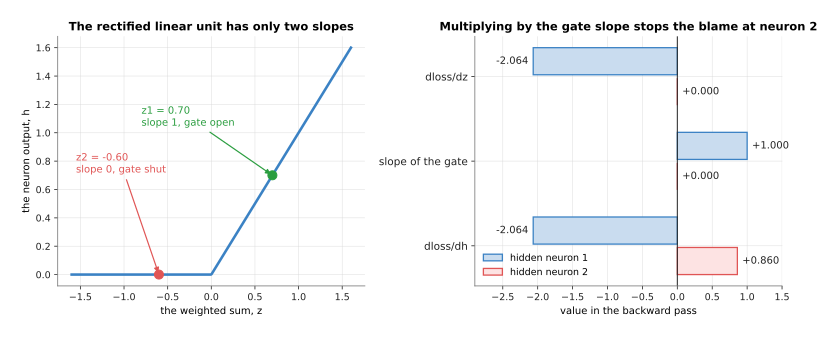
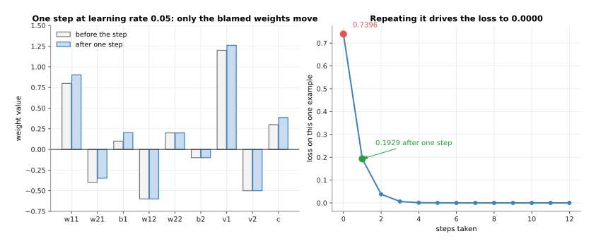
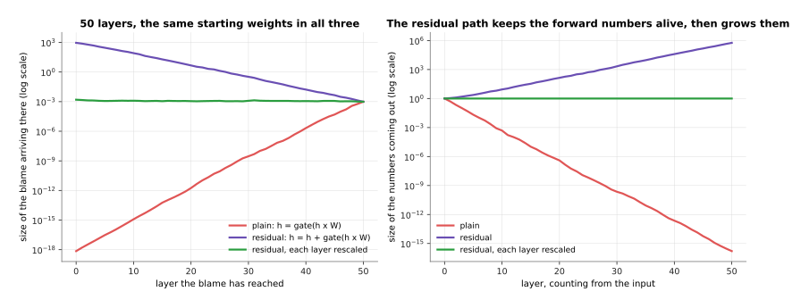
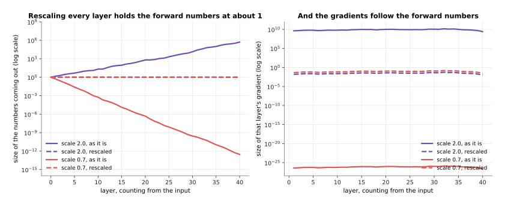
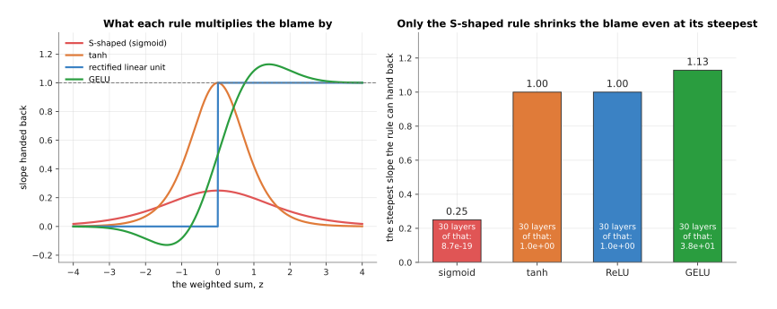
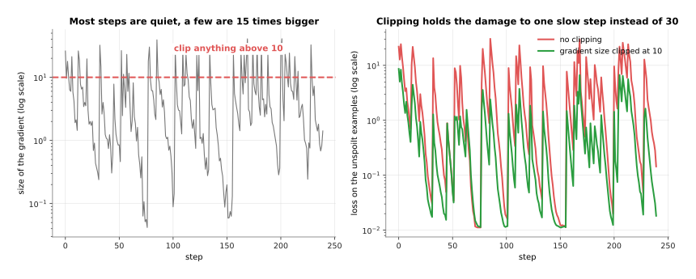

# Backpropagation: how every weight learns its share

The page before this one, [gradient descent](02_gradient-descent.md), showed how
a network is trained once you know the slope of the loss for every weight,
because the slope tells you which way to move that weight and the learning rate
tells you how far. It left one thing out, and it is the thing that makes the
whole method possible, which is where those slopes come from. A network has
millions of weights, and the loss is worked out at the far end of a long chain
of multiplying and adding, so there is no obvious way to say how much any one
weight near the start is to blame for the answer at the end.

This page answers that. The method is called **backpropagation**, which is
short for the backward propagation of errors, and it works out the slope for
every weight in one sweep from the output back to the input, for about as much
arithmetic as working the network out forwards once.

It is for a reader who has read the two pages before it, so it assumes you
already know what a loss is from [the score of being
wrong](01_the-score-of-being-wrong.md), what a gradient, a step and a learning
rate are from [gradient descent](02_gradient-descent.md), and what a neuron is
from [inside a network](../02_inside-a-network/01_one-neuron.md). The only
maths is multiplying and adding, and the page works one real network out by
hand, forwards and then backwards, with every number taken from the script that
drew the pictures.

## Contents

1. [A slope through two stages: the chain rule](#1-a-slope-through-two-stages-the-chain-rule)
2. [The forward pass through a tiny network](#2-the-forward-pass-through-a-tiny-network)
3. [The backward pass, and each weight's share of the blame](#3-the-backward-pass-and-each-weights-share-of-the-blame)
4. [Automatic differentiation, and what it costs in memory](#4-automatic-differentiation-and-what-it-costs-in-memory)
5. [When the chain of multiplications goes wrong](#5-when-the-chain-of-multiplications-goes-wrong)
6. [What fixed it in practice](#6-what-fixed-it-in-practice)
7. [Where to read next](#7-where-to-read-next)
8. [Using it in Python](#8-using-it-in-python)

---

## 1. A slope through two stages: the chain rule

Before any network appears, here is the one rule the whole method rests on, in
a machine you can picture. A winch has a handle, a drum and a hook. Turning the
handle turns the drum through a set of gears, and turning the drum winds up the
rope and lifts the hook.


One turn of the handle turns the drum 3 times, each drum turn lifts the hook 2.5 cm, and so one handle turn lifts the hook 7.5 cm.

The question this picture answers is how much the hook rises for one turn of
the handle, when nobody has measured the handle against the hook directly. You
do not need to measure it, because the first stage gives 3 drum turns for every
handle turn and the second gives 2.5 centimetres for every drum turn, so one
handle turn gives 3 times 2.5, which is 7.5 centimetres. Multiplying the two
stages together is the whole idea, and it is called the **chain rule**: when
one thing feeds a second thing, the slope from the first to the last is the
slope of each stage multiplied together.

The word **slope** means here what it meant on the page before, which is how
much one number changes when another changes by one. The rule works on small
changes as well, so a nudge of 0.2 handle turns gives 0.6 drum turns and lifts
the hook 1.50 centimetres.

Both stages so far were straight lines, and a straight line has the same slope
everywhere. Real networks are not straight, because the activation function
bends them, so the next winch has a second stage that bends: the rope winds
onto the drum in coils, each coil sits on the last, and the drum grows fatter
as it fills, so a late turn lifts the hook further than an early one.


Stage one still has the single slope 3, but stage two has a different slope at every point, 4.8 centimetres per drum turn when the drum has already turned 6 times and 2.4 when it has turned 3.

The rule survives the bend, with one change, which is that you have to take
each stage's slope at the place you are actually standing. At 2 handle turns
the drum stands at 6 turns, where stage two lifts 4.8 centimetres per drum
turn, so the whole winch lifts 3 times 4.8, which is 14.4 centimetres per
handle turn. At 1 handle turn the drum stands at 3 turns and the whole winch
lifts only 7.2. The same machine has two answers because the answer depends on
where the machine happens to be, which is why a network's gradients have to be
worked out afresh for every batch of examples. You can check all this by
nudging the handle and measuring the hook, which is what the next picture does.


A nudge of one whole handle turn measures 18.000 centimetres per turn, and as the nudge shrinks the measurement falls to 14.436 and then 14.404, closing in on the 14.4 that the two slopes multiplied gave straight away.

The big nudges measure too much because the drum gets fatter during the nudge
itself, and the smaller the nudge the less that matters. Measuring is the
obvious alternative to the chain rule and it does work, but it costs one whole
run of the machine for every number you want a slope for, so a network with a
million weights would need a million runs. The chain rule needs none, and that
is the entire reason it is used.

---

## 2. The forward pass through a tiny network

The winch had two stages, and a network is the same idea with more stages and
more lines between them, so this section builds the smallest network that still
has everything in it. It has two inputs, two hidden neurons with the rectified
linear unit (ReLU) rule that keeps a positive number and turns a negative one
into 0, and one output neuron. There is one training example, whose inputs are
1.0 and 0.5 and whose target answer is 2.0. Working the network out from the
inputs to the loss is called the **forward pass**, and here it is with every
weight written on its line.


The two inputs 1.0 and 0.5 pass through six weights and three biases to give the output 1.14, which is a long way from the target of 2.0, so the loss is 0.7396.

Here is the same thing as arithmetic, with nothing hidden. Read each block as
one neuron: the products first, then the bias, then the total, then the ReLU
rule applied to that total.


Hidden neuron 1 totals 0.70 and keeps it, hidden neuron 2 totals -0.60 and is turned to 0.00, and the output neuron totals 1.14.

Follow hidden neuron 1. The first input 1.0 is multiplied by its weight 0.80 to
give 0.80, the second input 0.5 is multiplied by its weight -0.40 to give
-0.20, the bias 0.10 is added, and the total is 0.70. Because 0.70 is above 0
the ReLU rule keeps it, so this neuron's output is 0.70.

Hidden neuron 2 goes the other way. Its products are -0.60 and 0.10, its bias
is -0.10, and its total is -0.60. That is below 0, so the ReLU rule turns it
into 0.00, and this neuron contributes nothing at all to the answer for this
example. Hold on to that, because it decides what happens in the backward pass.

The output neuron multiplies 0.70 by 1.20 to give 0.84, multiplies 0.00 by
-0.50 to give 0.00, adds its bias 0.30, and gives 1.14. The target was 2.0, so
the network is 0.86 too low, and the loss, which here is the squared error from
[the score of being wrong](01_the-score-of-being-wrong.md), is 0.86 multiplied
by itself, or 0.7396. One number out of all that starts the backward pass, and
the picture below shows where it comes from.


The loss curve has a slope of -1.72 at the point where the network currently is, which says that raising the output lowers the loss.

The squared error is a bowl whose bottom sits at the target, and its slope at
any output is twice the error, so here it is 2 multiplied by -0.86, which is
-1.72. A negative slope means that growing the output shrinks the loss, and
that is the message the network now has to pass back to every weight that
helped make it.

---

## 3. The backward pass, and each weight's share of the blame

The forward pass ended with one number, the slope of the loss against the
output, and the **backward pass** is the trip the other way, which hands that
number back along every line and multiplies it by the slope of each stage as it
goes. The number travelling back is usually called the blame, because each
weight ends up with the share of the loss it caused.


The -1.72 leaving the loss becomes -1.204 for the weight v1, -2.064 for the weight w11, and exactly 0.000 for the three weights that feed the hidden neuron whose gate was shut.

Take it one stage at a time, and notice that each step is one multiplication.
The output neuron adds up h1 times v1, h2 times v2, and its bias, so raising v1
by 1 would raise the output by h1, which is 0.70, and the blame for v1 is
therefore -1.72 times 0.70, or -1.204. The blame for v2 is -1.72 times h2,
which is 0.000 because h2 is 0.00, and the bias has no multiplier at all, so
its blame is the full -1.72.

The same sum also sends blame backwards to the hidden outputs themselves,
because raising h1 by 1 would raise the output by v1. The blame reaching h1 is
-1.72 times 1.2, which is -2.064, and the blame reaching h2 is -1.72 times
-0.5, which is 0.860. So h2 is told it should grow, even though it gave 0.

Here the ReLU rule steps in, and the picture below shows why it stops that
message dead.



The rule has only two slopes, 1 where the total is above 0 and 0 where it is below, so hidden neuron 1 passes its -2.064 straight through while hidden neuron 2 multiplies its 0.860 by 0 and passes on nothing.

A neuron whose total was below 0 is, for this example, a gate that is shut. Its
output would not change if its weights changed a little, because a slightly
less negative total is still negative and still gives 0, so none of its weights
are to blame for anything and all of them are given a gradient of exactly 0.
Which gates are open depends on the example, so the set of weights that learn
anything from one example depends on that example too.

After the gate, the last stage sends the blame into the weights that feed each
hidden neuron, and again each step is one multiplication: raising w11 by 1
would raise the total of hidden neuron 1 by x1, which is 1.0, so w11's blame is
-2.064 times 1.0. Raising w21 by 1 would raise that total by x2, which is 0.5,
so w21's blame is -2.064 times 0.5, which is -1.032.


Three of the nine weights have a gradient of exactly 0, and the biggest share of the blame, 2.064, is shared by the weight w11 and the bias b1.

The whole backward pass was nine multiplications, which is about what the
forward pass cost, and it produced a gradient for every weight in one sweep
with no measuring. Those nine slopes are exactly what [gradient
descent](02_gradient-descent.md) asked for, so the step itself is now the easy
part.



With a learning rate of 0.05 the weight w11 moves from 0.8000 to 0.9032, the loss drops from 0.7396 to 0.1929 in that single step, and twelve steps take it to 0.0000.

Each weight has the learning rate multiplied by its own gradient subtracted
from it, so w11 moves by 0.05 multiplied by -2.0640, and because that gradient
is negative the weight grows. The three weights with a gradient of 0 do not
move at all, which is correct, since nothing they could have done would have
changed this example's answer.

---

## 4. Automatic differentiation, and what it costs in memory

The previous section worked the backward pass out by hand, which is useful once
and unbearable afterwards, and nobody does it that way any more. Every modern
framework works the gradients out for you by **automatic differentiation**,
which means that the program records what arithmetic it did on the way forward
and then replays that record backwards, applying the known slope of each kind
of step. The record is usually called the tape, and it is worth seeing what is
on it, because that is where training memory goes.


The tape holds six steps for this tiny network, and each one keeps the values the backward pass will need, such as the inputs for a multiply and the sign of the total for a gate.

Nothing on the tape is a formula a person wrote for this network. Each kind of
step knows its own slope because somebody wrote that slope once, when the
framework was built, so a multiply hands back the other number it multiplied
by, a gate hands back 1 or 0, and an addition hands back 1. Your network is any
arrangement of those steps, and the gradients follow from the arrangement
without anybody working them out. The way to check that a framework is right is
to compare it with the slow method from section 1, which is what its own tests
do.


The two ways of getting the slope agree to within 8e-11, which is as close as numbers stored in a computer can get.

The cost of the tape is memory, because every value it keeps has to stay there
from the moment the forward pass makes it until the backward pass has used it.
Those kept values are called the **activations**, and for a network of any size
they dominate everything else.


For a network of 12 layers and width 1024 reading 512 positions at a time, the weights take 0.05 gigabytes, their gradients another 0.05, the optimiser's running averages 0.10, and the kept activations 1.61, which is 89 per cent of the total.

That network has 12,595,200 weights, which at four bytes each come to 50.4
megabytes, and that is nothing. The activations are large because there is one
set of them for every example in the batch and for every position inside each
example, so a batch of 32 examples of 512 positions makes 402,653,184 numbers
to keep, and that is why the first thing anybody does when training runs out of
memory is to shrink the batch.


The weights, their gradients and the optimiser state together stay at 0.20 gigabytes whatever the batch is, while the activations double every time the batch doubles and pass everything else put together at a batch of 8.

It is also why there is a trick called gradient checkpointing, which throws
some activations away during the forward pass and works them out again during
the backward pass, saving memory and costing time. Memory is usually the wall
you hit first, so the trade is often worth taking.

---

## 5. When the chain of multiplications goes wrong

Automatic differentiation makes the backward pass easy to run, but it does not
make it well behaved, and the trouble comes from the same chain rule the first
section praised. The blame is multiplied once per layer on the way back, and a
long chain of multiplications has only three possible fates.


Multiplying by 0.6 sixty times leaves 5e-14 of what you started with, multiplying by 1.4 sixty times gives 6e+08, and only a factor of exactly 1.0 leaves the size alone.

A blame that shrinks away to nothing is called a **vanishing gradient**, and
the early layers then get a gradient so small that their weights never move, so
the network behaves as though those layers were not being trained. A blame that
grows without limit is called an **exploding gradient**, and one step then
throws the weights so far that the loss becomes a number too large to store.
Neither is a rare accident, because both are what you get by default unless
something is done about them. For a long time the usual activation function was
a smooth S-shaped curve, and it caused the first of the two on its own.


The slope of that curve never passes 0.25 anywhere, and for ordinary inputs it averages 0.21, so thirty such layers multiply the blame by 9e-19 at the very best.

That is the mechanical reason deep networks did not work for years, and the
reason the ReLU rule took over, because its slope is exactly 1 wherever the
gate is open and so it does not shrink the blame at all. The activation
function is only half of it, though, because the blame is also multiplied by
the weights themselves on the way back. The picture below runs real stacks of
layers, forwards and backwards, to measure what that does, on simulated data
and starting weights drawn from a fixed seed.


The blame leaving the loss is 9.766e-04 in every run, and by the time it reaches layer 1 of a 60-layer stack it is 9.385e-22 when the starting weights are too small and 2.130e+06 when they are too large.

Read each panel from right to left, which is the direction the blame travels.
The green line, whose starting weights were given the scale that keeps the
sizes level, arrives at layer 1 at 1.966e-03, which is about the size it
started at, and that stack can be trained. The red line has lost nineteen
orders of magnitude and the purple line has gained nine, so one of those stacks
learns nothing in its early layers and the other destroys itself on the first
step.

---

## 6. What fixed it in practice

Those two failures were understood long before they were solved, and what
finally fixed them was not one idea but four, each attacking a different part
of the multiplication. The first and biggest is the residual connection, which
was explained in [layers and
depth](../02_inside-a-network/02_layers-and-depth.md), where instead of
replacing what came in a layer adds its result to it, so the numbers flow along
a path that goes round every layer as well as through it.



In the plain stack the blame falls from 9.766e-04 to 7.157e-19 by the time it reaches layer 1, and with residual connections it arrives at 9.067e+02 instead.

The reason is that the add has a slope of 1, so a copy of the blame goes
straight past each layer untouched and the shrinking applies only to the copy
that went through. The cost is in the right panel, where the forward numbers
grow instead, because each layer adds to what came before. That growth is what
the second fix is for: normalisation, covered properly in [normalisation and
stability](../04_making-training-work/02_normalisation-and-stability.md),
rescales each layer's output so that its numbers have a fixed size whatever
came in.



Without rescaling, a stack of 40 layers ends with numbers of size 5.125e+05 when the weights are too large and 2.968e-13 when they are too small, and with rescaling both end at exactly 1.000 and hand layer 1 the same blame of 3.667e-03.

What rescaling buys is that the starting scale of the weights stops mattering,
because whatever a layer produces is divided by its own size before it goes on.
Put the two together and the 50-layer residual stack hands its first layer a
blame of 1.568e-03 against the 9.766e-04 that left the loss, which is level
enough to train, and that pairing is in essentially every deep network built
today. The third fix is the activation function itself, where the choice is now
between rules that hand back a slope near 1 rather than near 0.



The S-shaped rule can hand back at most 0.25, so thirty layers of it multiply the blame by 8.7e-19, while the rectified linear unit and tanh can hand back 1.00 and GELU can hand back 1.13.

The rectified linear unit hands back either 1 or 0, so the units that are on
shrink nothing, and the smoother rules GELU and SiLU hand back something close
to 1 over most of their range while still bending. What ReLU costs is that a
unit which is off for every example gets a gradient of 0 for ever and never
comes back, which is why the smooth rules are usually preferred in large
models. The fourth fix does not prevent a large gradient but catches one:
**gradient clipping** measures the size of the whole gradient before the step
is taken, and if it is above a threshold it scales every gradient down by the
same factor, so the direction is kept and only the length is cut.



In this simulated run six of the 512 targets were spoilt on purpose, so most steps have a gradient of about 2.63 and a few reach 40.8, and clipping at 10 keeps the worst loss along the way to 8.6 instead of 30.5.

Without clipping, each bad batch throws the weights far enough that the next
several steps are spent coming back, and the run ends at a loss of 0.144 on the
clean examples, where with clipping it ends at 0.018. The obvious alternative
is to lower the learning rate until no batch can do damage, and that works, but
it slows down every one of the quiet steps as well, which is most of them, so
clipping is the better trade.

---

## 7. Where to read next

- [The training loop](04_the-training-loop.md) is the next page, and it puts
  the forward pass, the backward pass and the step into the loop that actually
  runs, with the optimiser and the schedule around them.
- [Layers and depth](../02_inside-a-network/02_layers-and-depth.md) is where
  the residual connection of section 6 was introduced.
- [Normalisation and stability](../04_making-training-work/02_normalisation-and-stability.md)
  takes section 6's rescaling seriously, and explains layer normalisation and
  what a loss spike is.
- [The shape of the numbers](../02_inside-a-network/03_the-shape-of-the-numbers.md)
  explains the tensors whose memory section 4 counted, and what fewer bytes per
  number buys you.
- [How a model learns](../../07_learned-models/01_what-models-are/02_how-a-model-learns.md)
  in the catalogue book gives the same story at the level of a whole robot
  model.

---

## 8. Using it in Python

Sections 2 and 3 worked the tiny network out by hand and section 4 said that
nobody does that any more. This is the same network when the framework does it,
and the numbers it prints are the ones this page has been quoting.

```python
import torch

x1, x2, target = 1.0, 0.5, 2.0
# section 2's weights, each one asking the framework to track its gradient
w11 = torch.tensor(0.8, requires_grad=True)
w21 = torch.tensor(-0.4, requires_grad=True)
b1 = torch.tensor(0.1, requires_grad=True)
v1 = torch.tensor(1.2, requires_grad=True)
c = torch.tensor(0.3, requires_grad=True)

z1 = x1 * w11 + x2 * w21 + b1          # section 2: the first hidden total
h1 = torch.relu(z1)                     # section 3: the gate
u = h1 * v1 + c                         # the output, with h2 left out because it is 0
loss = (u - target) ** 2                # section 2's squared error

loss.backward()                         # section 3: the whole backward pass
r = lambda t, n=4: round(float(t), n)   # rounded: stored numbers carry tiny errors
print(r(z1), r(h1), r(u), r(loss))      # 0.7 0.7 1.14 0.7396
print(r(w11.grad, 3), r(w21.grad, 3), r(b1.grad, 3))   # -2.064 -1.032 -2.064
print(r(v1.grad, 3), r(c.grad, 3))                     # -1.204 -1.72
```

The call to `backward` is the whole of section 3. The framework kept the tape
of section 4 while the lines above it ran, and reading that tape backwards
filled in a `.grad` for every tensor that asked for one, giving the same
-2.064, -1.032, -2.064, -1.204 and -1.72 that section 3 worked out by hand.

What the library does for you is everything mechanical, because it knows the
slope of every operation it offers, it keeps the values the backward pass will
need, it runs the sweep in the right order, and it adds the blame up correctly
when one value feeds several later ones. It also offers
`torch.autograd.gradcheck`, which does section 4's nudge-and-measure comparison
for you when you write an operation of your own.

What you still have to decide is everything the framework cannot know. You
decide when to clear the gradients, because `backward` adds to `.grad` rather
than replacing it, and the next page explains why that matters. You decide
whether to clip, with `torch.nn.utils.clip_grad_norm_`, and at what threshold.
You decide whether to trade memory for time with
`torch.utils.checkpoint.checkpoint`, which is section 4's gradient
checkpointing. And you decide the arrangement of layers from section 6, because
residual connections and normalisation are things you put in the network, not
things the backward pass can add for you.
