# Backpropagation: how every weight learns its share

The page before this one, [gradient descent](02_gradient-descent.md), showed how
a network is trained once you know the slope of the loss for every weight. The
slope tells you which direction to move that weight in, and the learning rate
tells you how far to move it. That page left one thing out, and that thing is
what makes the whole method possible. It is the question of where those slopes
come from. A network has millions of weights, and the loss is calculated at the
far end of a long chain of multiplying and adding. So there is no obvious way to
say how much one single weight near the start is to blame for the answer at the
end.

This page answers that question. The method that answers it is called
**backpropagation**. The name is short for "the backward propagation of errors",
and to propagate something backwards means to pass it back from one stage to the
stage before it. Backpropagation calculates the slope for every weight in one
sweep, from the output of the network back to its input, and that sweep costs
about as much arithmetic as calculating the network forwards once.

This page is for a reader who has read the two pages before it, so it assumes
you already know what a loss is from [the score of being
wrong](01_the-score-of-being-wrong.md), what a gradient, a step and a learning
rate are from [gradient descent](02_gradient-descent.md), and what a neuron is
from [inside a network](../02_inside-a-network/01_one-neuron.md). The only maths
is multiplying and adding. The page calculates one real network by hand,
forwards and then backwards, and every number in it comes from the script that
drew the pictures.

By the end you will know one rule, called the chain rule, and you will be able
to follow one number as it travels back through a small network and turns into a
gradient for every weight. You will also know what this costs in computer
memory, why it goes wrong in deep networks, and what four changes were made to
stop it going wrong.

## Contents

1. [A slope through two stages: the chain rule](#1-a-slope-through-two-stages-the-chain-rule)
2. [The forward pass through a tiny network](#2-the-forward-pass-through-a-tiny-network)
3. [The backward pass, and each weight's share of the blame](#3-the-backward-pass-and-each-weights-share-of-the-blame)
4. [Automatic differentiation, and what it costs in memory](#4-automatic-differentiation-and-what-it-costs-in-memory)
5. [When the chain of multiplications goes wrong](#5-when-the-chain-of-multiplications-goes-wrong)
6. [What fixed it in practice](#6-what-fixed-it-in-practice)
7. [Where to read next](#7-where-to-read-next)
8. [Using it in Python](#8-using-it-in-python)

---

## 1. A slope through two stages: the chain rule

Before any network appears, here is the one rule that the whole method rests on.
The rule is easier to see in a machine than in a network, so this section uses a
machine called a winch. A winch is a machine for lifting things. It has a
handle, a drum and a hook. You turn the handle, the handle turns the drum
through a set of gears, the drum winds up a rope, and the rope lifts the hook.

The question is how far the hook rises when you turn the handle once. Nobody has
measured the handle against the hook directly, so the answer has to be built
from the two stages.

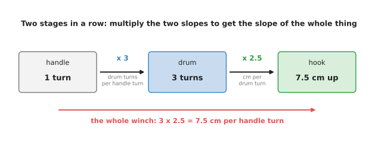

One turn of the handle turns the drum 3 times, each drum turn lifts the hook 2.5 centimetres, and so one handle turn lifts the hook 7.5 centimetres.

The first stage gives 3 drum turns for every handle turn. The second stage gives
2.5 centimetres for every drum turn. So one handle turn gives 3 multiplied by
2.5, which is 7.5 centimetres. Multiplying the two stages together is the whole
idea, and it has a name. It is called the **chain rule**: when one thing feeds a
second thing, the slope from the first thing to the last thing is the slope of
each stage multiplied together.

The word **slope** means here what it meant on the page before. It is the amount
that one number changes when another number changes by one. The rule also works
for changes smaller than one. For example, a change of 0.2 handle turns gives
0.6 drum turns, and that lifts the hook 1.50 centimetres.

Both stages so far were straight lines, and a straight line has the same slope
everywhere. Real networks are not straight lines, because the activation
function bends them. So the next winch has a second stage that bends. In this
winch the rope winds onto the drum in coils, and each coil sits on top of the
last one. The drum therefore grows fatter as it fills, and a late turn of the
drum lifts the hook further than an early turn does.

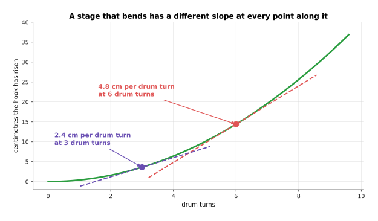

The second stage now has a different slope at every point: it lifts 4.8 centimetres per drum turn when the drum has already turned 6 times, and only 2.4 centimetres per drum turn when it has turned 3 times.

The first stage still has the single slope 3, because the gears do not change.
The chain rule survives the bend, with one change. You have to take each stage's
slope at the place where the machine actually is. At 2 handle turns the drum
stands at 6 turns. There the second stage lifts 4.8 centimetres per drum turn,
so the whole winch lifts 3 multiplied by 4.8, which is 14.4 centimetres per
handle turn. At 1 handle turn the drum stands at 3 turns instead, and the whole
winch lifts only 7.2 centimetres per handle turn. The same machine has two
answers, because the answer depends on where the machine happens to be. This is
why a network's gradients have to be calculated again for every batch of
examples.

You can check all of this without the chain rule, by turning the handle a little
and measuring the hook. A small change made on purpose, in order to measure what
it does, is called a nudge.

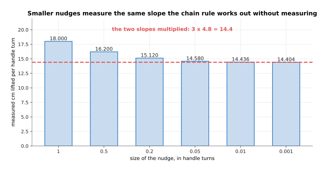

A nudge of one whole handle turn measures 18.000 centimetres per turn, and as the nudge gets smaller the measurement falls to 14.436 and then to 14.404, which closes in on the 14.4 that the two slopes gave by multiplication.

The big nudges measure too much, because the drum gets fatter during the nudge
itself. The smaller the nudge, the less that matters. So measuring works, and it
is the obvious alternative to the chain rule. However, measuring costs one whole
run of the machine for every number you want a slope for, and in fact two runs
if you measure above and below the current value.

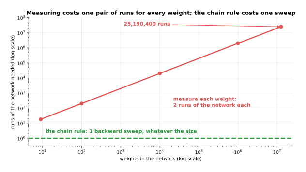

Measuring the nine weights of the next section's network costs 18 runs, and measuring the 12,595,200 weights of a realistic network costs 25,190,400 runs, while the chain rule costs one backward sweep whatever the size of the network.

That is the entire reason the chain rule is used. Measuring is simple and it is
correct, but its cost grows with every weight you add. The chain rule does not
measure anything, so its cost does not grow that way.

---

## 2. The forward pass through a tiny network

The winch had two stages. A network is the same idea with more stages, and with
more lines running between them. So this section builds the smallest network
that still contains everything.

The network has two inputs. It has two hidden neurons, which are the neurons in
the middle, between the input and the output. Each hidden neuron uses the
rectified linear unit rule, usually shortened to ReLU, which keeps a positive
number as it is and turns a negative number into 0. The network then has one
output neuron. There is one training example. Its two inputs are 1.0 and 0.5,
and its target answer is 2.0.

Calculating the network from the inputs through to the loss is called the
**forward pass**. Here is that forward pass, with the weight written on every
line and the value written in every circle.

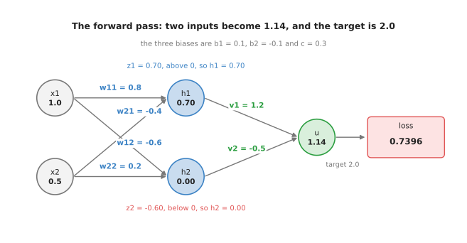

The two inputs 1.0 and 0.5 pass through six weights and three biases to give the output 1.14, which is a long way from the target of 2.0, so the loss is 0.7396.

Here is the same calculation written as arithmetic, with nothing hidden. Read
each block as one neuron. The products come first, then the bias, then the
total, and then the ReLU rule applied to that total.

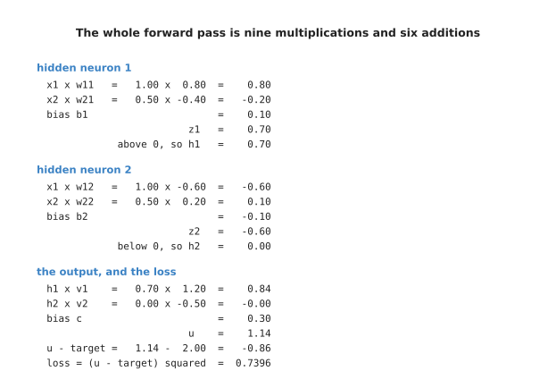

Hidden neuron 1 totals 0.70 and keeps it, hidden neuron 2 totals -0.60 and so is turned into 0.00, and the output neuron totals 1.14.

Follow hidden neuron 1 first. The first input 1.0 is multiplied by its weight
0.80, which gives 0.80. The second input 0.5 is multiplied by its weight -0.40,
which gives -0.20. The bias 0.10 is added, and the total is 0.70. That total is
above 0, so the ReLU rule keeps it, and this neuron's output is 0.70.

Hidden neuron 2 goes the other way. Its two products are -0.60 and 0.10, its
bias is -0.10, and its total is -0.60. That total is below 0, so the ReLU rule
turns it into 0.00. This neuron therefore contributes nothing at all to the
answer for this example. Remember that, because it decides what happens in the
backward pass.

The output neuron multiplies 0.70 by 1.20 to give 0.84. It multiplies 0.00 by
-0.50 to give 0.00. It adds its bias 0.30, and it gives 1.14. The target was
2.0, so the network is 0.86 too low. The loss here is the squared error from
[the score of being wrong](01_the-score-of-being-wrong.md), which means -0.86
multiplied by itself, or 0.7396.

The whole forward pass is 7 multiplications, 6 additions and 1 subtraction. One
single number out of all that arithmetic starts the backward pass, and the
picture below shows where that number comes from.

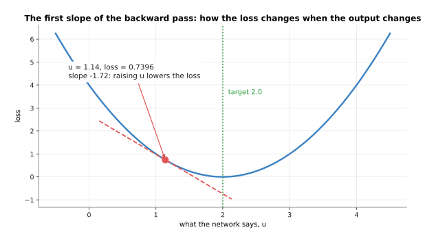

The loss curve has a slope of -1.72 at the point where the network currently stands, which says that raising the output lowers the loss.

The squared error draws a bowl, and the bottom of the bowl sits at the target.
The slope of that bowl at any output is twice the error. So here the slope is 2
multiplied by -0.86, which is -1.72. A negative slope means that growing the
output shrinks the loss. That is the message the network now has to pass back to
every weight that helped produce the output.

---

## 3. The backward pass, and each weight's share of the blame

The forward pass ended with one number, which is the slope of the loss against
the output. The **backward pass** is the trip in the other direction. It hands
that number back along every line, and it multiplies the number by the slope of
each stage as it goes. The number travelling backwards is usually called the
blame, because each weight ends up holding the share of the loss that it caused.

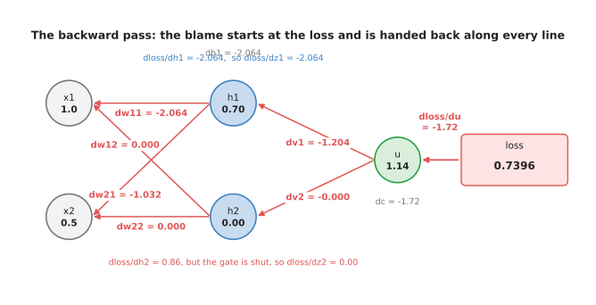

The -1.72 leaving the loss becomes -1.204 for the weight v1, -2.064 for the weight w11, and exactly 0.000 for the three weights that feed the hidden neuron whose gate is shut.

Take it one stage at a time, and notice that each step is a single
multiplication. The output neuron adds up h1 multiplied by v1, h2 multiplied by
v2, and its own bias. So raising v1 by 1 would raise the output by h1, which is
0.70, and the blame for v1 is therefore -1.72 multiplied by 0.70, which is
-1.204. The blame for v2 is -1.72 multiplied by h2, which is 0.000 because h2 is
0.00. The bias has no multiplier at all, so its blame is the full -1.72.

The same sum also sends blame backwards to the hidden outputs themselves,
because raising h1 by 1 would raise the output by v1. The blame reaching h1 is
-1.72 multiplied by 1.2, which is -2.064. The blame reaching h2 is -1.72
multiplied by -0.5, which is 0.860. So h2 is told that it should grow, even
though it gave 0.

Here the ReLU rule steps in and stops that message. The rule works as a gate,
which means something that is either open or shut. Two pictures explain it. The
first one shows the rule itself.

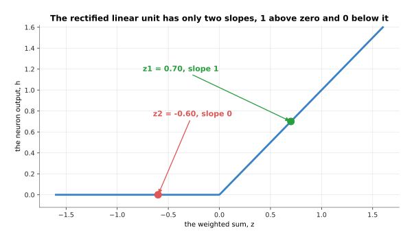

The rule has only two slopes: it has slope 1 where the total is above 0, as it is for hidden neuron 1, and slope 0 where the total is below 0, as it is for hidden neuron 2.

The second picture multiplies each neuron's blame by its own slope, which is
what the backward pass does at that point.

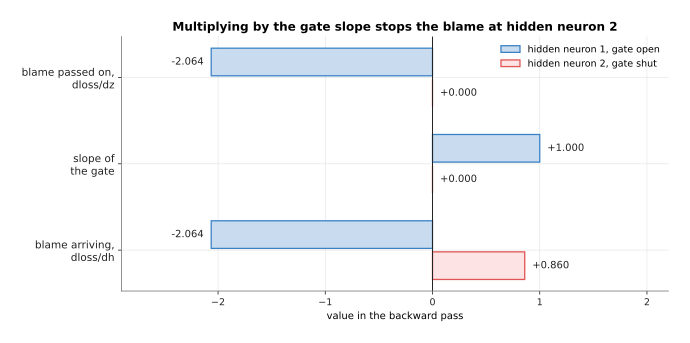

Hidden neuron 1 multiplies its -2.064 by 1 and passes it straight through, while hidden neuron 2 multiplies its 0.860 by 0 and passes on nothing.

A neuron whose total was below 0 is, for this example, a gate that is shut. Its
output would not change if its weights changed a little, because a slightly less
negative total is still negative and still gives 0. So none of its weights are
to blame for anything, and all of them are given a gradient of exactly 0. Which
gates are open depends on the example. This means that the set of weights that
learn anything from one example also depends on that example.

After the gate, the last stage sends the blame into the weights that feed each
hidden neuron. Again each step is a single multiplication. Raising w11 by 1
would raise the total of hidden neuron 1 by x1, which is 1.0, so the blame for
w11 is -2.064 multiplied by 1.0. Raising w21 by 1 would raise that same total by
x2, which is 0.5, so the blame for w21 is -2.064 multiplied by 0.5, which is
-1.032.

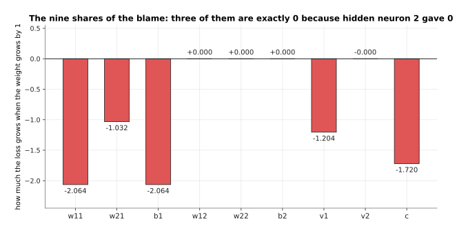

Three of the nine weights have a gradient of exactly 0, and the biggest share of the blame, 2.064, is shared by the weight w11 and the bias b1.

The whole backward pass was 11 multiplications, which is close to the 7
multiplications the forward pass cost. It produced a gradient for every weight
in one sweep, and it measured nothing. Those nine slopes are exactly what
[gradient descent](02_gradient-descent.md) asked for, so taking the step itself
is now the easy part.

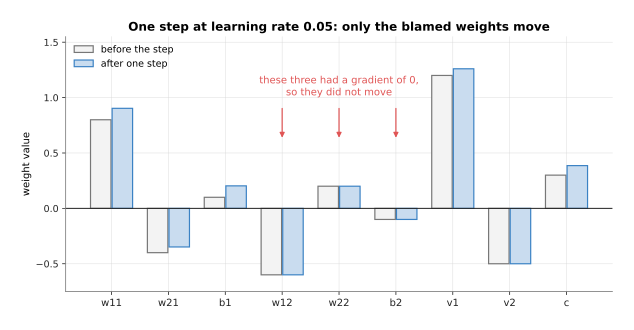

With a learning rate of 0.05 the weight w11 moves from 0.8000 to 0.9032, and the three weights with a gradient of 0 stay exactly where they were.

Each weight has the learning rate multiplied by its own gradient subtracted from
it. So w11 moves by 0.05 multiplied by -2.0640, and because that gradient is
negative the subtraction makes the weight grow. The three weights with a
gradient of 0 do not move at all, which is correct, since nothing they could
have done would have changed this example's answer.

One step is enough to see the loss fall, and repeating the step drives it to
nothing.

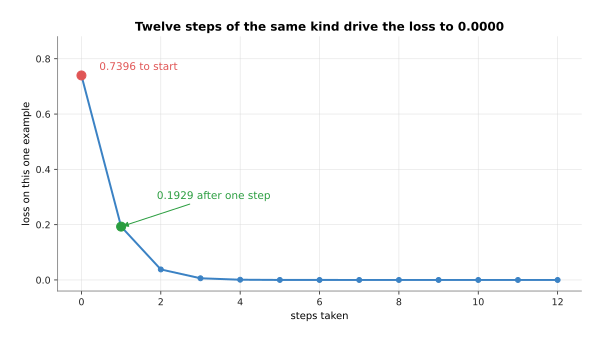

The loss drops from 0.7396 to 0.1929 in that single step, and twelve steps take it to 0.0000.

---

## 4. Automatic differentiation, and what it costs in memory

The previous section calculated the backward pass by hand. That is useful once
and unbearable afterwards, and nobody does it that way any more. Every modern
framework calculates the gradients for you by **automatic differentiation**. The
word differentiation means finding a slope, and automatic means that the program
does it without being told the formula. The program records what arithmetic it
did on the way forward, and then it replays that record backwards, applying the
known slope of each kind of step as it goes. The record is usually called the
tape, and it is worth seeing what is on it, because the tape is where training
memory goes.

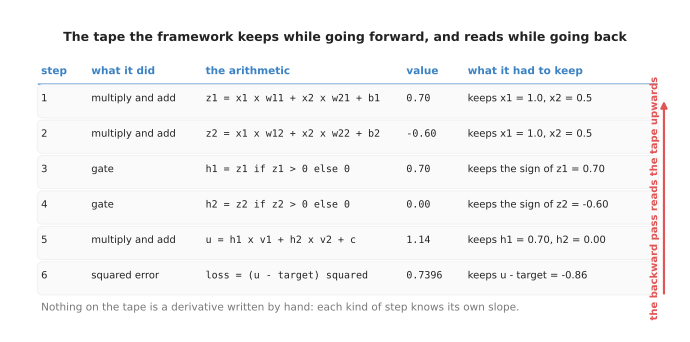

The tape holds six steps for this tiny network, and each step keeps the values that the backward pass will need, such as the inputs for a multiplication and the sign of the total for a gate.

Nothing on the tape is a formula that a person wrote for this network. Each kind
of step knows its own slope, because somebody wrote that slope down once, when
the framework was built. So a multiplication hands back the other number it
multiplied by, a gate hands back 1 or 0, and an addition hands back 1. Your
network is any arrangement of those steps, and the gradients follow from the
arrangement without anybody calculating them. The way to check that a framework
is correct is to compare it with the slow method from section 1, and that is
what the framework's own tests do.

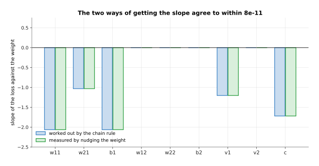

The two ways of getting the slope agree to within 8e-11, which is as close as numbers stored in a computer can get.

The cost of the tape is memory. Every value the tape keeps has to stay in memory
from the moment the forward pass produces it until the backward pass has used
it. Those kept values are called the **activations**, and in a network of any
size they take more memory than everything else put together.

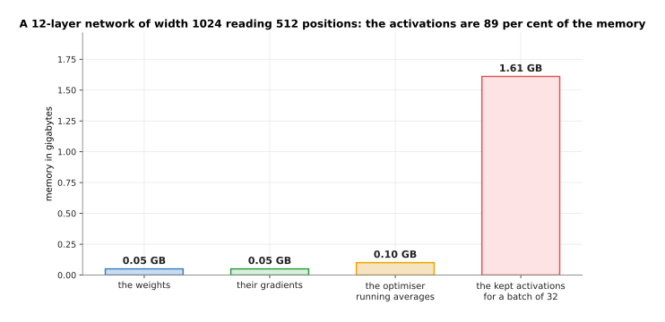

For a network of 12 layers and width 1024 reading 512 positions at a time, the weights take 0.05 gigabytes, their gradients another 0.05, the optimiser's running averages 0.10, and the kept activations 1.61, which is 89 per cent of the total.

That network has 12,595,200 weights. At four bytes each they come to 50.4
megabytes, and that is nothing. The activations are large because there is one
set of them for every example in the batch, and another set for every position
inside each example. A batch of 32 examples of 512 positions therefore makes
402,653,184 numbers to keep. This is why the first thing anybody does when
training runs out of memory is to make the batch smaller.

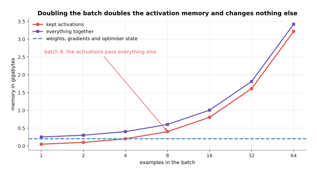

The weights, their gradients and the optimiser state together stay at 0.20 gigabytes whatever the batch is, while the activations double every time the batch doubles and pass everything else put together at a batch of 8.

There is a second way to spend less memory, and it is called gradient
checkpointing. A checkpoint here means a value that is kept on purpose while its
neighbours are thrown away. The forward pass keeps one activation every few
layers and throws the rest away. The backward pass then calculates the thrown-away
values again, starting from the nearest kept one, at the moment it needs them.

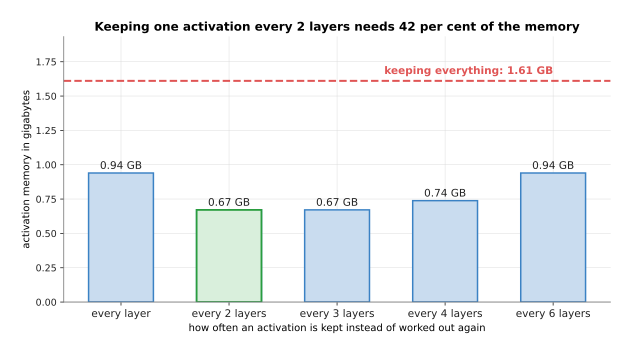

Keeping everything costs 1.61 gigabytes, and keeping one activation every 2 layers costs 0.67 gigabytes, which is 42 per cent of that.

What this costs is time, because every thrown-away value is calculated twice.
The extra work is one more forward pass, and a forward pass plus a backward pass
is about three forward passes of work, so the step takes roughly a third longer.
Memory is usually the limit you reach first, so that trade is often worth
taking.

---

## 5. When the chain of multiplications goes wrong

Automatic differentiation makes the backward pass easy to run. It does not make
the backward pass well behaved, and the trouble comes from the same chain rule
that the first section praised. The blame is multiplied once for every layer it
passes on the way back. A long chain of multiplications has only three possible
endings.

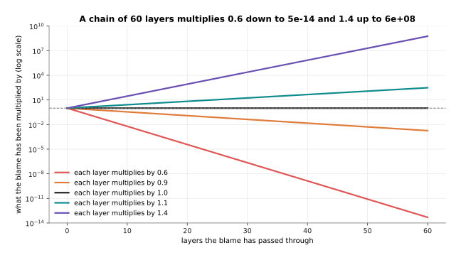

Multiplying by 0.6 sixty times leaves 5e-14 of what you started with, multiplying by 1.4 sixty times gives 6e+08 times what you started with, and only a factor of exactly 1.0 leaves the size alone.

A blame that shrinks away to almost nothing is called a **vanishing gradient**.
The early layers then receive a gradient so small that their weights never move,
so the network behaves as though those layers were not being trained at all. A
blame that grows without limit is called an **exploding gradient**. One step
then throws the weights so far that the loss becomes a number too large to
store. Neither failure is a rare accident, because both are what you get by
default unless something is done to prevent them.

For a long time the usual activation function was a smooth S-shaped curve,
called the sigmoid, and that curve caused the first failure on its own.

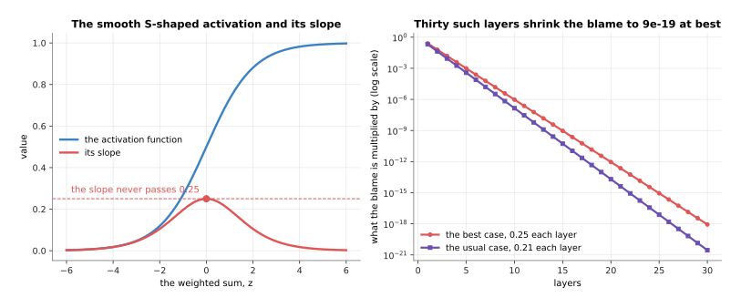

The slope of that curve never passes 0.25 anywhere, and for ordinary inputs it averages 0.21.

Those slopes are multiplied together once per layer, so a stack of such layers
shrinks the blame very quickly.

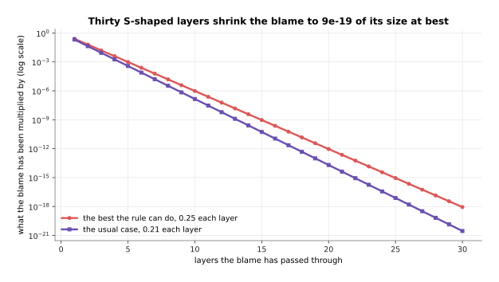

Thirty S-shaped layers multiply the blame by 9e-19 in the best case, and by 3e-21 in the usual one.

That is the mechanical reason deep networks did not work for years, and it is
also the reason the ReLU rule took over. The slope of ReLU is exactly 1 wherever
the gate is open, so it does not shrink the blame at all. The activation
function is only half of the story, though, because the blame is also multiplied
by the weights themselves on the way back. The picture below runs real stacks of
layers, forwards and backwards, to measure what the weights do. The data is
simulated, and the starting weights are drawn from a fixed seed, which means the
run can be repeated exactly.

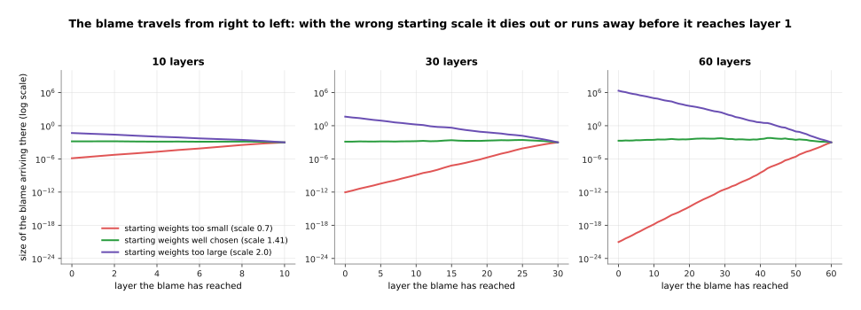

The blame leaving the loss is 9.766e-04 in every one of these runs, and by the time it reaches layer 1 of a 60-layer stack it is 9.385e-22 when the starting weights are too small and 2.130e+06 when they are too large.

Read each panel from right to left, because that is the direction the blame
travels. The green line is the run whose starting weights were given the scale
that keeps the sizes level. It arrives at layer 1 at 1.966e-03, which is about
the size it started at, and that stack can be trained. The red line has lost
nineteen orders of magnitude, and the purple line has gained nine. So one of
those stacks learns nothing in its early layers, and the other one destroys
itself on the first step.

---

## 6. What fixed it in practice

Those two failures were understood long before they were solved. What finally
solved them was not one idea but four, and each one attacks a different part of
the multiplication.

The first fix, and the biggest, is the residual connection, which was explained
in [layers and depth](../02_inside-a-network/02_layers-and-depth.md). Instead of
replacing what came in, a layer adds its result to what came in. The numbers
then flow along a path that goes around every layer as well as through it.

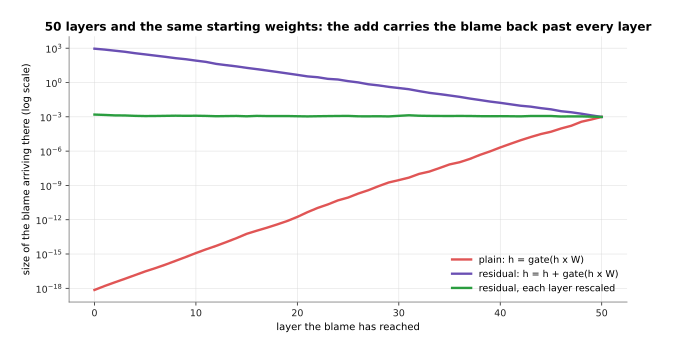

In the plain stack the blame falls from 9.766e-04 to 7.157e-19 by the time it reaches layer 1, and with residual connections it arrives at 9.067e+02 instead.

The reason is that an addition has a slope of 1. So one copy of the blame goes
straight past each layer untouched, and the shrinking applies only to the copy
that went through the layer. However, the residual connection has a cost, and
the cost shows up in the forward direction.

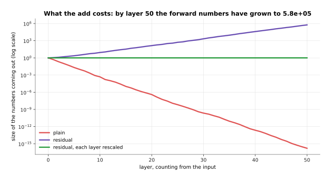

The plain stack's numbers shrink away to 1.634e-16 by layer 50, while the residual stack's numbers grow instead, to 5.784e+05.

The numbers grow because each layer adds to what came before it, and nothing
ever takes anything away. That growth is what the second fix is for. The second
fix is normalisation, which is covered properly in [normalisation and
stability](../04_making-training-work/02_normalisation-and-stability.md). To
normalise a layer's output means to divide it by its own size, so that what
leaves the layer always has a fixed size whatever came in.

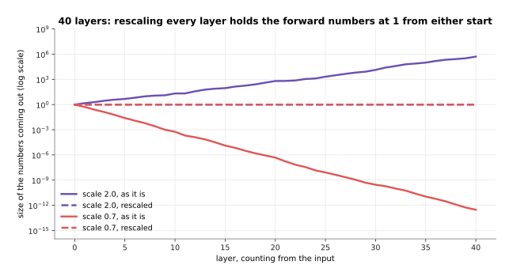

Without rescaling, a stack of 40 layers ends with numbers of size 5.125e+05 when the starting weights are too large and 2.968e-13 when they are too small, and with rescaling both stacks end at exactly 1.000, so their two lines lie on top of each other.

The same four stacks, measured on the way back, show what that buys.

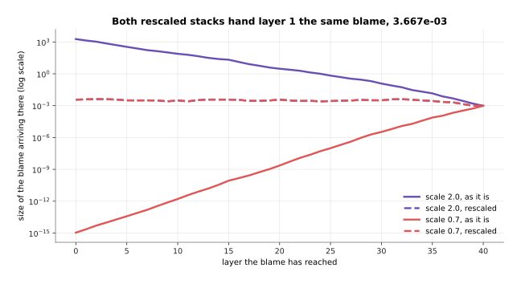

Both rescaled stacks hand layer 1 the same blame, 3.667e-03, although one of them started with weights nearly three times the scale of the other.

What rescaling buys is that the starting scale of the weights stops mattering,
because whatever a layer produces is divided by its own size before it goes on.
Put the two fixes together and the 50-layer residual stack hands its first layer
a blame of 1.568e-03, against the 9.766e-04 that left the loss. That is level
enough to train, and that pairing is in almost every deep network built today.

The third fix is the activation function itself. The choice today is between
rules that hand back a slope near 1, rather than rules that hand back a slope
near 0.

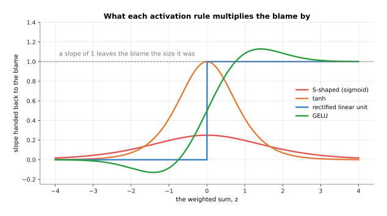

The rectified linear unit hands back exactly 1 above zero and exactly 0 below it, tanh reaches 1 at zero, GELU rises above 1 near 1.4, and the S-shaped sigmoid never passes 0.25 anywhere.

The number that matters is the steepest slope each rule can ever hand back,
because that sets the best a deep stack can do.

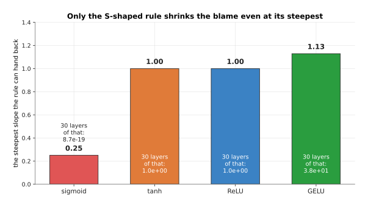

The S-shaped rule can hand back at most 0.25, so thirty layers of it multiply the blame by 8.7e-19, while the rectified linear unit and tanh can hand back 1.00 and GELU can hand back 1.13.

The rectified linear unit hands back either 1 or 0, so the units that are on
shrink nothing. GELU and SiLU are smoother rules, and they hand back something
close to 1 over most of their range while still bending. What ReLU costs is that
a unit which is off for every example gets a gradient of 0 for ever and never
comes back. That is why the smooth rules are usually preferred in large models.

The fourth fix does not prevent a large gradient. It catches one after it
happens, and it is called **gradient clipping**. To clip here means to cut
something down to a fixed size. The rule measures the size of the whole gradient
before the step is taken. If that size is above a threshold, every gradient is
multiplied by the same factor, which is the threshold divided by the size.

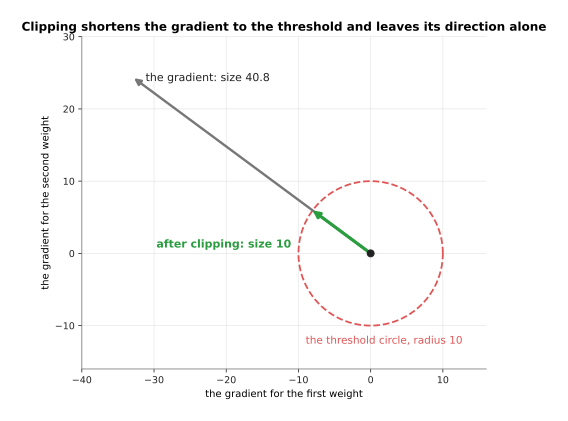

The largest gradient of the run below has parts -32.77 and 24.25 and a size of 40.8, and clipping multiplies both parts by 0.245, which leaves the parts -8.04 and 5.95, a size of 10 and the same direction as before.

Keeping the direction is the point. The gradient still says which way to move
every weight, and only the distance is cut. The run below shows when that
matters. Six of the 512 target values in it were spoilt on purpose, which means
they were replaced by nonsense, so a batch that contains one of them produces a
huge gradient.

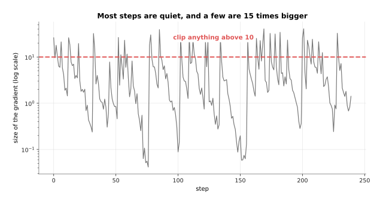

Most steps have a gradient of about 2.63, a few reach 40.8, and 42 of the 240 steps are above the threshold of 10.

The same run was then done twice, once with clipping and once without it, and
the loss was measured each time on the examples that were not spoilt.

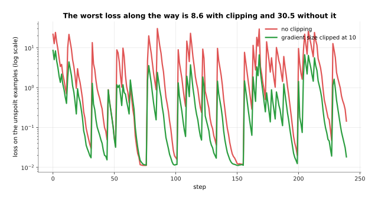

The worst loss along the way is 8.6 with clipping and 30.5 without it.

Without clipping, each bad batch throws the weights far enough that the next
several steps are spent coming back, and the run ends at a loss of 0.144 on the
clean examples. With clipping it ends at 0.018. The obvious alternative is to
lower the learning rate until no batch can do damage. That works, but it also
slows down every one of the quiet steps, and the quiet steps are most of them.
So clipping is the better trade.

---

## 7. Where to read next

- [The training loop](04_the-training-loop.md) is the next page, and it puts
  the forward pass, the backward pass and the step into the loop that actually
  runs, with the optimiser and the schedule around them.
- [Layers and depth](../02_inside-a-network/02_layers-and-depth.md) is where
  the residual connection of section 6 was introduced.
- [Normalisation and stability](../04_making-training-work/02_normalisation-and-stability.md)
  takes section 6's rescaling seriously, and explains layer normalisation and
  what a loss spike is.
- [The shape of the numbers](../02_inside-a-network/03_the-shape-of-the-numbers.md)
  explains the tensors whose memory section 4 counted, and what fewer bytes per
  number buys you.
- [How a model learns](../../07_learned-models/01_what-models-are/02_how-a-model-learns.md)
  in the catalogue book gives the same story at the level of a whole robot
  model.

---

## 8. Using it in Python

Sections 2 and 3 calculated the tiny network by hand, and section 4 said that
nobody does that any more. This is the same network when the framework does the
work, and the numbers it prints are the ones this page has been quoting.

```python
import torch

x1, x2, target = 1.0, 0.5, 2.0
# section 2's weights, each one asking the framework to track its gradient
w11 = torch.tensor(0.8, requires_grad=True)
w21 = torch.tensor(-0.4, requires_grad=True)
b1 = torch.tensor(0.1, requires_grad=True)
v1 = torch.tensor(1.2, requires_grad=True)
c = torch.tensor(0.3, requires_grad=True)

z1 = x1 * w11 + x2 * w21 + b1          # section 2: the first hidden total
h1 = torch.relu(z1)                     # section 3: the gate
u = h1 * v1 + c                         # the output, with h2 left out because it is 0
loss = (u - target) ** 2                # section 2's squared error

loss.backward()                         # section 3: the whole backward pass
r = lambda t, n=4: round(float(t), n)   # rounded: stored numbers carry tiny errors
print(r(z1), r(h1), r(u), r(loss))      # 0.7 0.7 1.14 0.7396
print(r(w11.grad, 3), r(w21.grad, 3), r(b1.grad, 3))   # -2.064 -1.032 -2.064
print(r(v1.grad, 3), r(c.grad, 3))                     # -1.204 -1.72
```

The call to `backward` is the whole of section 3. The framework kept the tape of
section 4 while the lines above it ran. Reading that tape backwards filled in a
`.grad` for every tensor that asked for one, and those values are the same
-2.064, -1.032, -2.064, -1.204 and -1.72 that section 3 calculated by hand.

The library does everything mechanical for you. It knows the slope of every
operation it offers, it keeps the values the backward pass will need, it runs
the sweep in the right order, and it adds the blame up correctly when one value
feeds several later ones. It also offers `torch.autograd.gradcheck`, which does
section 1's nudge-and-measure comparison for you when you write an operation of
your own.

You still have to decide everything the framework cannot know. You decide when
to clear the gradients, because `backward` adds to `.grad` rather than replacing
it, and the next page explains why that matters. You decide whether to clip the
gradients, with `torch.nn.utils.clip_grad_norm_`, and at what threshold. You
decide whether to trade memory for time with
`torch.utils.checkpoint.checkpoint`, which is section 4's gradient
checkpointing. You also decide the arrangement of layers from section 6, because
residual connections and normalisation are things you put into the network, and
not things the backward pass can add for you.
