# The training loop

The page before this one, [backpropagation](03_backpropagation.md), finished
with a tiny network, a loss of 0.7396, nine gradients and one step that brought
the loss down to 0.1929. That was one step on one example. A real training run
is that same step repeated hundreds of thousands of times over a whole dataset,
inside a loop. The loop also has to decide how big each step should be, when to
make the steps smaller, what the weights held before the first step, and what to
save so that a run which stops can be started again.

This page is about that loop. It writes the loop out in the order a computer
runs it and explains each line. It then replaces the simple step of the page
before with the rule that almost everyone actually uses, which keeps a running
average of the gradients instead of trusting the newest one. After that it
covers three decisions that are made around the loop rather than inside it.
Those three are how the learning rate changes as the run goes along, what the
weights are set to before the first step, and how you read the curve that the
run produces.

This page is for a reader who has read the three pages before it in this
chapter. It assumes the loss from [the score of being
wrong](01_the-score-of-being-wrong.md), and the gradient, the learning rate, the
mini-batch and the epoch from [gradient descent](02_gradient-descent.md), and
the forward and backward passes from [backpropagation](03_backpropagation.md).
The maths stays at multiplying, adding and keeping a running average. A running
average is an average of the recent values of something, weighted so that the
newest values count most.

Every number on this page comes from a real run of a small network written in
NumPy on simulated data, and the script that drew the pictures prints each one.
By the end you will be able to read a training loop line by line, choose an
optimiser and a schedule and say why, and look at a loss curve and name what is
wrong with the run.

## Contents

1. [The loop, in the order the code runs](#1-the-loop-in-the-order-the-code-runs)
2. [Momentum, which is a running average of the gradient](#2-momentum-which-is-a-running-average-of-the-gradient)
3. [Adam, and why AdamW keeps the shrinking separate](#3-adam-and-why-adamw-keeps-the-shrinking-separate)
4. [Learning-rate schedules and warmup](#4-learning-rate-schedules-and-warmup)
5. [Where the weights start](#5-where-the-weights-start)
6. [Reading the curve, the time a run takes, and the checkpoint](#6-reading-the-curve-the-time-a-run-takes-and-the-checkpoint)
7. [Where to read next](#7-where-to-read-next)
8. [Using it in Python](#8-using-it-in-python)

---

## 1. The loop, in the order the code runs

Everything that the three pages before this one explained happens inside seven
lines of code. Those seven lines run in the same order every time, so the first
thing to do is to write them down.

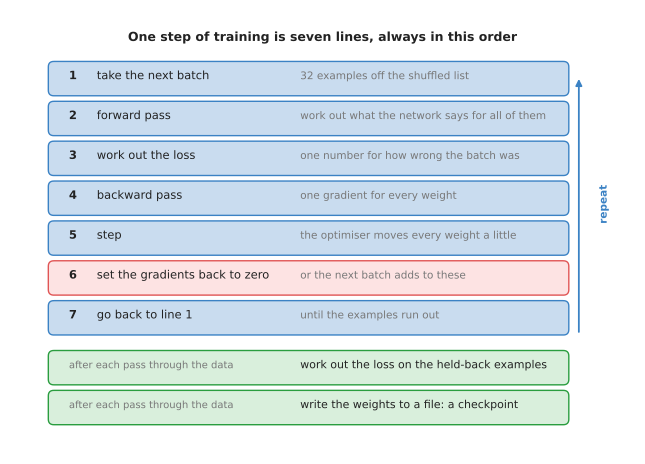

The seven lines are: take the next batch, forward pass, loss, backward pass, step, set the gradients back to zero, and go back to line 1; and two more things are done at the end of each pass through the data.

Line 1 takes the next batch. A batch is a small group of examples drawn from the
training set in a shuffled order, as explained in [gradient
descent](02_gradient-descent.md). Line 2 is the forward pass, which calculates
what the network says for every example in that batch at once. Line 3 averages
those examples' losses into one number. Line 4 is the backward pass, which gives
one gradient for every weight.

Line 5 is the step. The thing that takes the step is called the **optimiser**,
which is the rule that turns gradients into changes to the weights. On the page
before, the optimiser was the simplest one there is, which subtracts the
learning rate multiplied by the gradient. The next two sections replace it with
something better.

Line 6 sets every gradient back to zero. This line exists because frameworks add
each backward pass into the gradient that is already stored, rather than
replacing it. That behaviour is useful when you want to join several small
batches into one large one. However, it is a disaster when you forget it, and
the two pictures below show what forgetting it does.

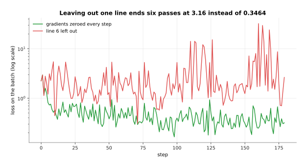

With the gradients zeroed every step, the loss after six passes through the data is 0.3464; with line 6 left out it is 3.16, nine times worse.

The cause is visible in the gradient itself, because the number the step uses
grows every time a new backward pass is added into it.

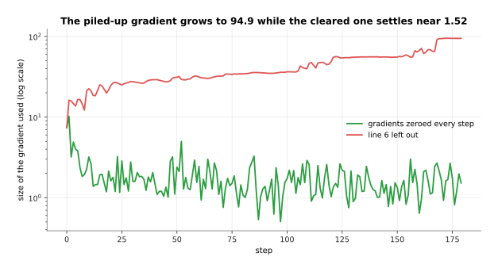

The gradient being used grows from 7.361 to 94.9 when it is never cleared, while the cleared one settles near 1.52.

Line 7 goes back to the start. The loop runs until the training set is used up,
and one pass through the whole training set is called an epoch. The counting is
worth doing once by hand, because the number of steps in a run is the only thing
that decides how long the run takes.

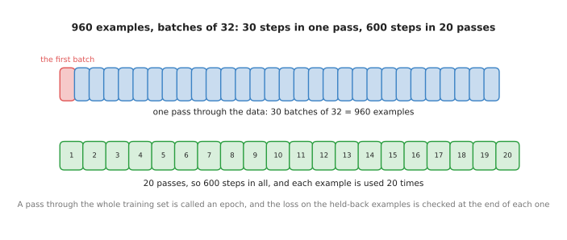

A training set of 960 examples in batches of 32 gives 30 steps in one pass through the data, so 20 passes are 600 steps, and the network is shown 19,200 examples in all, which is each of the 960 exactly 20 times.

At the end of each pass two more things happen, and both of them are drawn in
green in the first picture. The loss is calculated on a set of examples that the
loop never trains on, which is called the held-back set, and the weights are
written to a file. The next chapter explains the held-back set properly in
[overfitting and
generalisation](../04_making-training-work/01_overfitting-and-generalisation.md),
and section 6 of this page explains the file.

One warning about the loss you see go past on the screen. The loss on line 3 is
the loss of one batch of 32 examples, and not the loss of the training set. So
it jumps up and down from step to step even when the run is going perfectly.

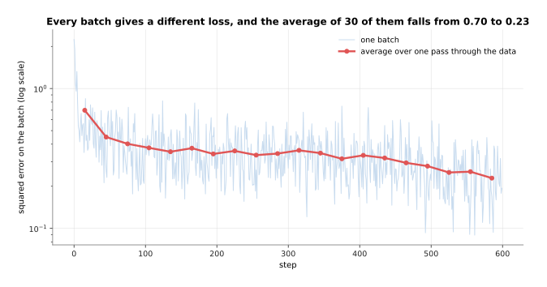

In the first pass the batch losses run from 2.242 at the highest down to 0.349 at the lowest, while the average over the 30 batches of a pass falls steadily from 0.699 to 0.229.

The jumping comes from the batch, because 32 examples drawn at random are
sometimes easier than average and sometimes harder. So the average over a whole
pass is the number worth watching. That is why training curves are almost always
drawn with one point per pass rather than one point per step.

---

## 2. Momentum, which is a running average of the gradient

Line 5 of that loop was the simplest possible optimiser, and this section
replaces it, because the simple rule wastes most of its steps on a problem that
every real network has. The problem is that the loss is far steeper in some
directions than in others.

The picture below uses a loss with only two weights, so that the whole thing can
be drawn on paper. The loss cares about one of those two weights a thousand
times more than about the other. A map drawn with lines joining the points of
equal loss is called a contour map, and on such a map a long narrow valley means
exactly that difference in steepness.

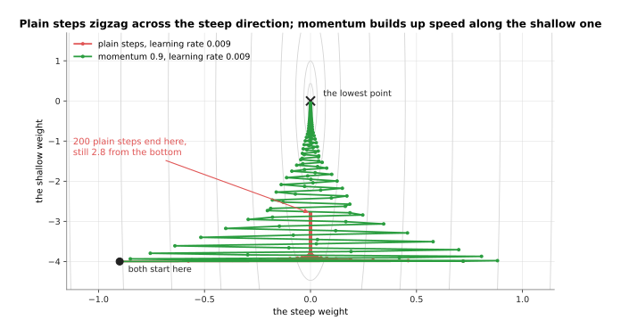

Both runs use the same learning rate of 0.009, and after 200 steps the plain rule has crawled from -4.0 to -2.7948 along the valley while momentum has reached -0.0560.

The plain rule is stuck because one learning rate has to serve both directions.
It must be small enough that the steep direction does not overshoot, which means
jump past the bottom and come out higher on the other side. Once the rate is
that small, it moves the shallow direction almost not at all. So the run spends
its time crossing the valley instead of going down it.

The rate of 0.009 is not an arbitrary choice. It is the largest round number
that this plain rule survives on this loss, and just above it the run is
destroyed.

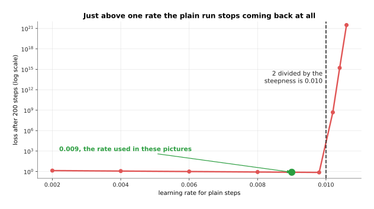

Every rate up to 0.0098 leaves the loss between 0.73 and 1.36, and a rate of 0.0102 leaves it at 4.9e+08, because the rate at which plain steps stop coming back is 2 divided by the steepness, which is 0.010 here.

**Momentum** fixes the slowness by keeping a running average of the gradients
instead of using only the newest one. The rule has two lines. First, the average
is set to 0.9 multiplied by the old average, plus the new gradient. Second, the
weights move by the learning rate multiplied by that average. The number 0.9 is
the only setting, and it says how much of the past is kept.

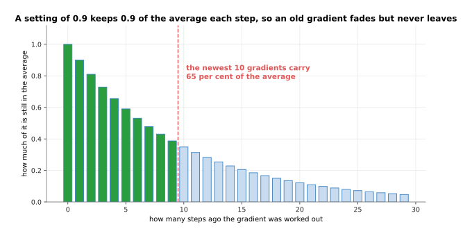

With 0.9 kept each step, the gradient from 30 steps ago still counts 0.047 against 1 for the newest one, the shares of all the past gradients add up to 10.0, and the newest 10 gradients carry 65 per cent of that.

Keeping the past is useful because of what it does in the two directions. In the
steep direction the gradient changes sign at every step, because the run keeps
crossing the valley.

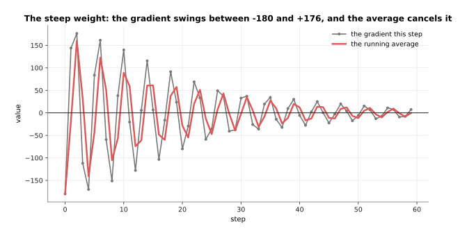

In the steep direction the gradient swings between -180 and +176, so the positive and negative values land on top of each other in the average and cancel, and the average never grows beyond the size of a single gradient.

In the shallow direction the gradient keeps the same sign at every step, because
the run is always on the same side of the bottom.

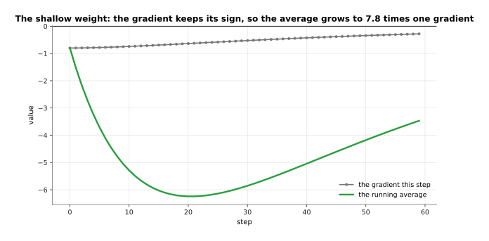

In the shallow direction the gradient stays near -0.80 every step, so the average grows to -6.24, which is 7.8 times one gradient.

That is the whole trick, in two pictures. Where the gradient keeps pointing the
same way, the average grows and the steps get longer, so the run speeds up.
Where the gradient flips sign every step, the values cancel in the average, so
the steps stay short and the zigzag is damped. The result is a much faster run
at the same learning rate.

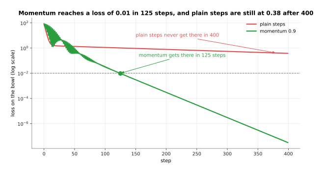

Momentum brings the loss below 0.01 in 125 steps, and the plain rule has still not reached 0.01 after 400 steps, where it sits at 0.380.

Momentum costs one extra number stored for every weight, so it needs as much
memory again as the weights themselves. The obvious alternative is to raise the
learning rate instead of keeping an average, but the picture of the cliff above
shows that the steep direction forbids this. So paying for one more number per
weight is the better deal.

---

## 3. Adam, and why AdamW keeps the shrinking separate

Momentum made the steps longer where the gradient was steady. However, it still
multiplies every weight's gradient by the same learning rate. In the last
section's valley, the starting point was far out along the shallow direction, so
one weight's gradient there was 225 times larger than the other's. The next idea
is to give every weight its own step size, calculated from that weight's own
gradients.

The rule that does this is called **Adam**, which is short for adaptive moment
estimation. It keeps two running averages for each weight instead of one. The
first is the same average of the gradient that momentum keeps. The second is an
average of the gradient multiplied by itself, which ignores the sign and
therefore measures how large that weight's gradients usually are. The step is
then the first average divided by the square root of the second.

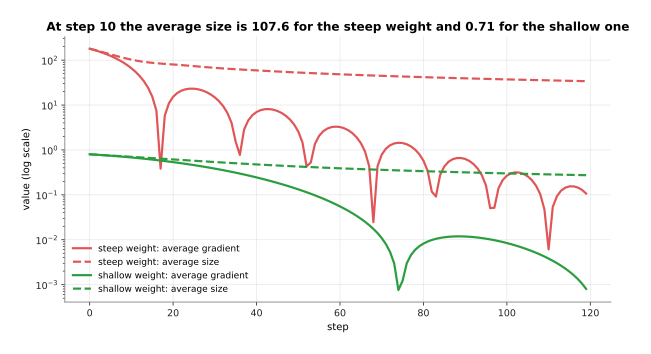

At step 10 the average size is 107.617 for the steep weight and 0.713 for the shallow one, which is what each weight's step is divided by.

Dividing by the usual size of a weight's own gradient is what buys the
per-weight step size, and the two moves then come out close to each other.

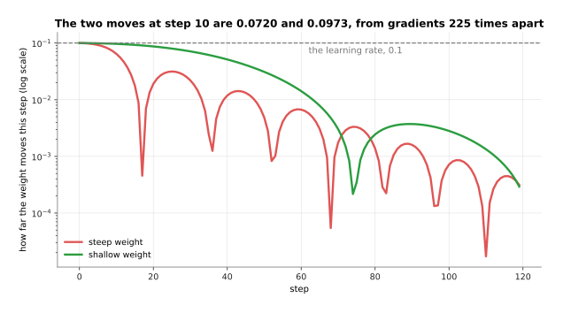

At step 10 the steep weight moves -0.0720 and the shallow one moves -0.0973, which is within a factor of 0.74 of each other, although the two gradients started 225 times apart.

A weight whose gradients are large gets a small step, and a weight whose
gradients are tiny gets a large one. The learning rate then stops meaning a
distance, and starts meaning roughly how far any weight may move in one step.
That is why one learning rate often works across very different networks, and it
is the main reason Adam is the default almost everywhere.

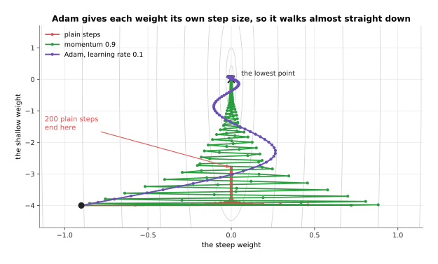

After 200 steps on the same problem the plain rule has reached a loss of 7.811e-01, momentum 3.138e-04, and Adam 2.050e-08.

What Adam costs is memory, because it stores two numbers per weight instead of
momentum's one. The optimiser's state is then twice the size of the model
itself.

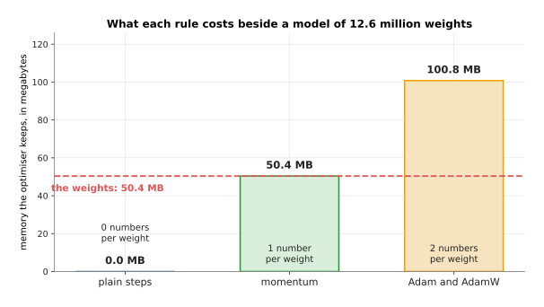

Beside a model of 12,595,200 weights, which is 50.4 megabytes, plain steps keep nothing, momentum keeps 50.4 megabytes and Adam keeps 100.8 megabytes.

Those 100.8 megabytes are the 0.10 gigabytes in the memory picture of
[backpropagation](03_backpropagation.md#4-automatic-differentiation-and-what-it-costs-in-memory).
Adam also has two settings for how long its two averages remember, usually 0.9
and 0.999, and a small number added to the square root so that nothing is
divided by zero.

There is one more piece, and it is the difference between Adam and the version
that almost everyone now uses. Training often includes **weight decay**, which
shrinks every weight slightly towards zero at every step, because weights that
stay small tend to give a network that works better on examples it has not seen.
The old way of applying weight decay was to add a term to the gradient. With
Adam that goes wrong, because the added term is then divided by the square root
of the second average, along with everything else.

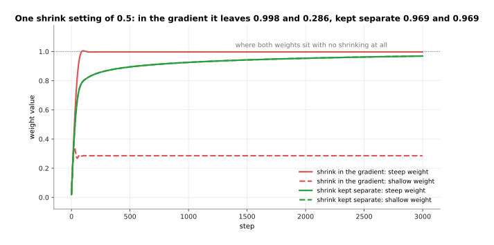

Both weights should settle at 1.0, and with a shrink setting of 0.5 added to the gradient the steep weight ends at 0.9975 while the shallow one is dragged down to 0.2857; with the shrink kept separate both end at 0.9695.

Read that picture as two weights that should both settle at 1.0. Adding the
shrink to the gradient means that a weight with large gradients barely feels the
shrink, because its division is large, while a weight with small gradients is
pulled almost to nothing. So one setting does two completely different things
inside the same network. **AdamW** is Adam with the shrinking taken out of the
gradient and applied directly to the weight after the step is taken.

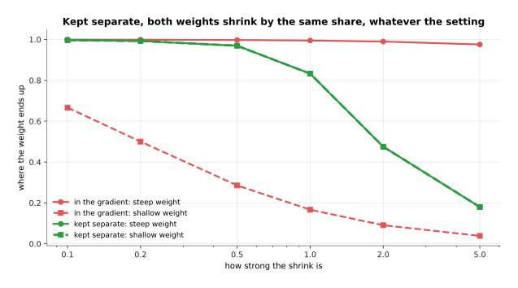

Kept separate, both weights end at the same value for every setting, from 0.997 at a shrink of 0.1 down to 0.180 at a shrink of 5.0, while added to the gradient the two weights end far apart at every setting.

Every weight keeps the same share of itself, whatever its gradients look like,
so the setting means one thing across the whole network. That is the whole
difference between Adam and AdamW, and it is why AdamW rather than Adam is what
modern models are trained with.

---

## 4. Learning-rate schedules and warmup

The last two sections changed how the gradient becomes a step. This section
changes the learning rate itself, which neither of them touched. Keeping the
rate at one value for a whole run is the obvious thing to do, and it is not the
best thing to do, because what you want early in a run and what you want late in
it are different. A plan for changing the learning rate as the run goes along is
called a **schedule**.

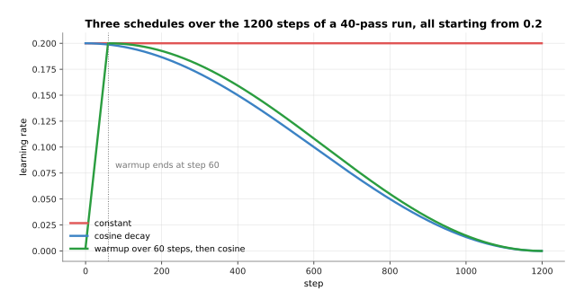

All three schedules are built from a top rate of 0.2: the constant one stays there, the cosine one is at 0.1000 halfway and 0.00000 at the end, and the third starts at 0.0033 and spends its first 60 steps climbing to the top rate before following the same curve down.

The falling shape is called cosine decay, after the curve it follows. Its reason
is that a large rate early covers ground quickly, while a small rate late lets
the weights settle instead of bouncing around the bottom. The rising part at the
start is called **warmup**, and it exists because the first few steps are the
most dangerous in the whole run.

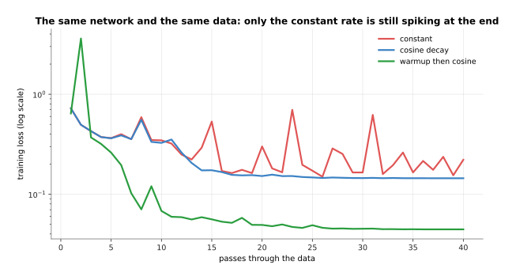

On the same network and the same data, the constant rate is still spiking at pass 40, while the cosine run and the warmup run have both settled.

The spikes are the point. A rate that is large enough to make progress early is
too large to sit still at the end, so the constant run never settles. Decay
removes the spikes, because the rate at the end is small. What the two runs are
worth is best read at the end of the run, on the held-back examples.

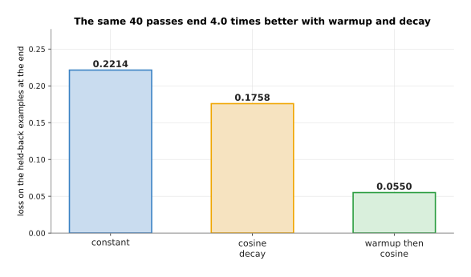

After the same 40 passes, a constant rate of 0.2 ends with a held-back loss of 0.2214, cosine decay ends at 0.1758, and warmup followed by cosine decay ends at 0.0550, which is 4.0 times better than the constant run.

Warmup earns its place most clearly when the rate is too large to start with at
all.

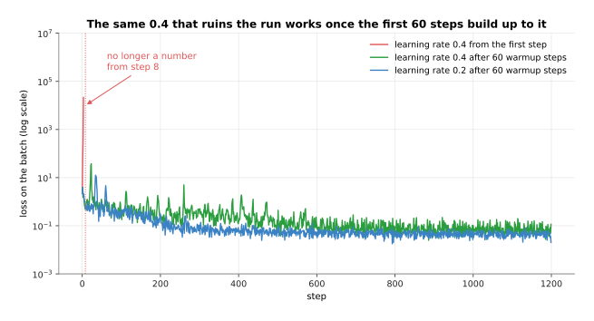

A flat learning rate of 0.4 makes the loss stop being a number at step 8, while the same 0.4 reached through 60 warmup steps trains normally and ends at a held-back loss of 0.0770.

The obvious alternative to warmup is to use a rate that is safe from the first
step, which here would be 0.2, and that run is the blue line, which also works.
What warmup buys is that you may use rates that would otherwise be impossible.
That matters most for large models, where a bigger rate is worth a lot and the
first steps are the ones most likely to destroy the run. What warmup costs is
one more setting to choose, which is how many steps the warmup lasts.

---

## 5. Where the weights start

Warmup protects the first steps. This section is about what those first steps
start from, because a network's weights have to hold some value before the first
forward pass can run. Choosing those values is called **initialisation**, and
the rule is that they are random but not arbitrary.

The random part is not an accident of laziness, and the two pictures below show
what happens without it.

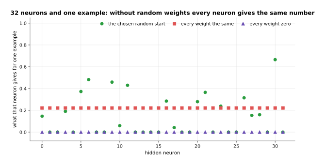

With every weight set to zero all 32 hidden neurons give 0.0, with every weight set to the same value they all give 0.2217, and only the random start spreads them out, from 0.000 to 0.665.

Giving every neuron the same output is already bad. What makes it permanent is
that the backward pass then hands every neuron the same gradient.

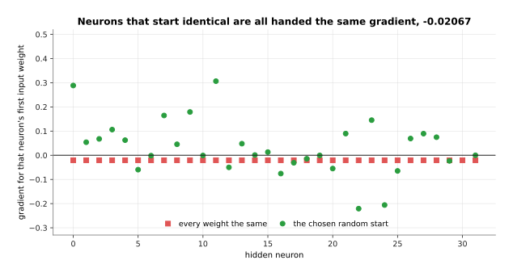

With every weight the same, all 32 neurons are handed a gradient of exactly -0.02067, while the random start hands out 32 different values.

Setting every weight to zero kills the network outright, because each hidden
neuron gives 0, the output never depends on any hidden weight, and every hidden
gradient is 0 for ever. Setting every weight to the same value that is not zero
is only slightly better. Neurons that start identical are handed identical
gradients, so they take identical steps and stay identical, and a layer of 32 of
them does exactly as much work as one neuron would. Random values break that
tie, and breaking the tie is their entire job.

The part that is not arbitrary is the size of those random values, because that
size decides the size of the numbers running through the network on the very
first batch. Read the picture below as three measurements of the first batch,
taken at three starting sizes, on a scale where each line of the grid is ten
times the one below it.

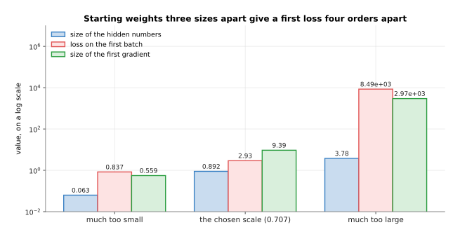

Starting weights that are much too small give hidden numbers of 0.063 and a first loss of 0.837, the chosen scale gives 0.892 and 2.93, and weights that are much too large give 3.78 and a first loss of 8491.

The chosen scale here is 0.707, and it is not a guess. It is calculated from the
number of inputs a neuron has, so that the numbers coming out of a layer are
about the same size as the numbers going into it. That is the same balance that
[backpropagation](03_backpropagation.md#5-when-the-chain-of-multiplications-goes-wrong)
showed holding the blame level on the way back. Every framework has this built
in, so you get it without asking for it.

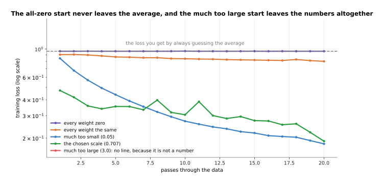

The all-zero start sits at 0.9607 for the whole run, which is exactly the loss you get by always guessing the average of the targets, the all-the-same start reaches only 0.8006, and the much too large start is not a number at all, so it has no line.

Two of those five lines deserve an honest word. The much too large start does not
merely train badly. Its first gradient is 2970, which throws the weights so far
that the loss stops being a number, and that is the exploding gradient of the
page before happening on step one. The much too small start, on the other hand,
trains perfectly well here. It ends at 0.1802 against the chosen scale's 0.1891,
and that is not a mistake. This network has one hidden layer, so there is
nothing for a small scale to shrink away through. Give the same small scale
fifty layers and it becomes the red line from the page before, which arrives
with nothing left.

---

## 6. Reading the curve, the time a run takes, and the checkpoint

Everything so far was a decision made before the run starts. This last section is
about the run itself, which produces one picture that you have to be able to
read. That picture is the loss drawn against the passes through the data, with
one line for the training examples and one line for the held-back ones.

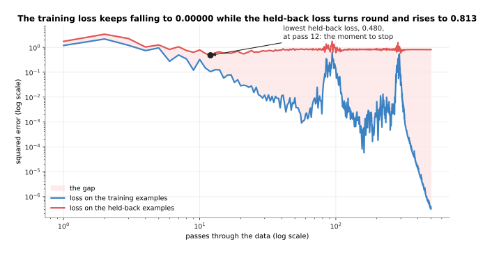

The training loss falls all the way from 1.191 to 0.00000, while the held-back loss reaches its lowest point of 0.480 at pass 12 and then climbs back to 0.813 by pass 500.

The gap opening between those two lines is the single most important shape in
training. The run that drew it was set up to make the shape obvious, with a
training set cut down to 24 examples and a network far too large for them. The
training loss keeps falling because the network is learning those 24 examples by
heart. The held-back loss rises because knowing 24 examples by heart is of no
use on anything else. Where the two lines part company is where a run stops
being worth continuing, which is the subject of the next chapter's [overfitting
and
generalisation](../04_making-training-work/01_overfitting-and-generalisation.md).

Three other shapes come up often enough to be worth recognising on sight. The
first one is the shape of a run with nothing wrong with it.

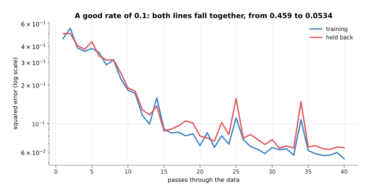

A good rate of 0.1 takes the training loss from 0.459 to 0.0534, and the two lines stay together all the way.

Two lines falling together and flattening mean that nothing is wrong, and that
the run may simply need more passes. The second shape is slower and smoother.

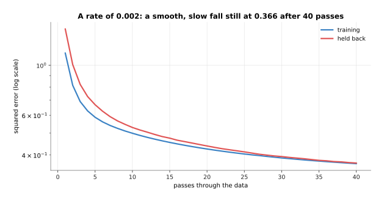

A rate of 0.002 is still at 0.366 after 40 passes, and the curve has not begun to flatten.

A smooth fall that has not flattened by the end of the run means the learning
rate is too small. The run would get there eventually, so this is a waste of
time rather than a failure. The third shape is the opposite.

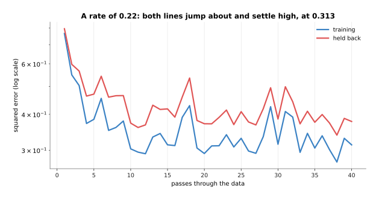

A rate of 0.22 makes both lines jump about from pass to pass, and the training loss settles high, at 0.313.

A line that jumps about and settles high means the rate is too large. That is
told apart from the shape in the first picture of this section by the held-back
line: here the held-back line jumps about, and there it climbed steadily away
from the training line.

How long any of this takes is the number of steps multiplied by the time of one
step, and the time of one step is set by how much arithmetic the step is.

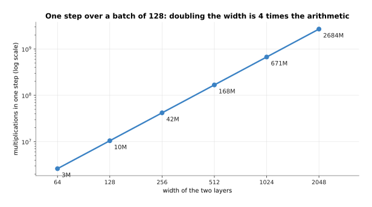

One step over a batch of 128 is 2,621,440 multiplications at width 64 and 2,684,354,560 at width 2048, because doubling the width makes one step four times as much arithmetic.

Those counts cover the forward pass and the backward pass together, which comes
to two and a half multiplications for every weight and every example in the
batch. Turning
arithmetic into seconds depends on the machine, so the honest way to answer the
question for your own run is to time one step and multiply.

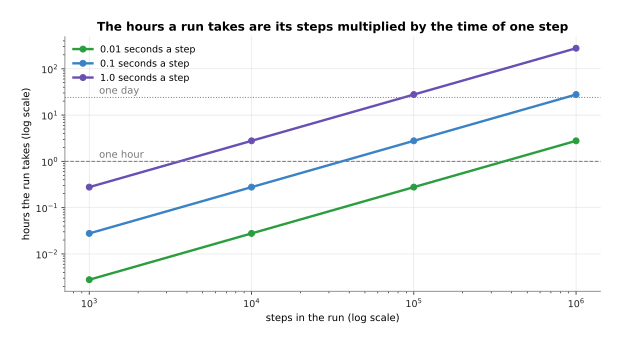

At a tenth of a second a step, 10,000 steps take 0.28 hours and 1,000,000 steps take 27.78 hours, and at a whole second a step those same two runs take 2.78 and 277.78 hours.

Small models finish in minutes. The fine-tuning runs that most people do take
hours. The largest models are trained for weeks on many machines at once. So a
run that you cannot afford to lose is a normal thing to have, and that is what
the last line of section 1 was for. A **checkpoint** is a file holding the
weights as they stood at some point in the run. It is written at the end of each
pass, so that a run which stops for any reason can be continued rather than
started again.

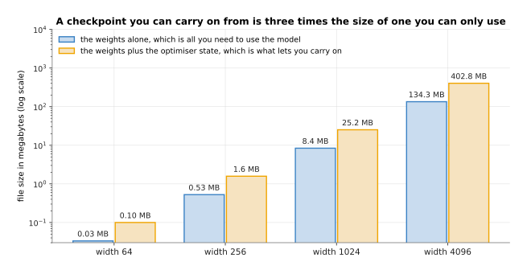

A two-layer network of width 1024 has 2,099,200 weights, which is 8.40 megabytes on their own and 25.19 megabytes once the optimiser's two running averages are saved beside them.

The difference between those two bars is the difference between the two jobs a
checkpoint does. If you only want to use the model, the weights are all you
need. If you want to carry the run on from where it stopped, you also need the
optimiser state from section 3, which is two more numbers for every weight and
so three times the file size.

---

## 7. Where to read next

- [Overfitting and generalisation](../04_making-training-work/01_overfitting-and-generalisation.md)
  is the next page, and it takes up the gap in section 6's curve: what
  memorising is, how the held-back set is built, and when to stop.
- [Normalisation and stability](../04_making-training-work/02_normalisation-and-stability.md)
  explains the loss spikes of section 4 and the layer-by-layer rescaling that
  makes large runs survive.
- [Backpropagation](03_backpropagation.md) is the page before this one, and it
  is where line 4 of the loop comes from.
- [Scale, data and compute](../07_pretraining-and-adapting/02_scale-data-and-compute.md)
  takes section 6's arithmetic up to the size of real training runs, and
  explains what a graphics processing unit does with it.
- [Fine-tuning](../../07_learned-models/10_making-models-work-on-an-arm/02_most-used/01_fine-tuning.md)
  in the catalogue book is this loop applied to a real robot model, with the
  settings people actually use.

---

## 8. Using it in Python

Section 1 wrote the loop out in seven lines, and in PyTorch those seven lines are
seven lines. This is the whole of this page in one block, with the optimiser of
section 3, the schedule of section 4 and the checkpoint of section 6 in their
proper places.

```python
import torch
from torch import nn

model = nn.Sequential(nn.Linear(4, 32), nn.ReLU(), nn.Linear(32, 1))
opt = torch.optim.AdamW(model.parameters(), lr=0.01, weight_decay=0.01)  # section 3
steps_per_epoch, epochs = 30, 20                                         # section 1
warm = torch.optim.lr_scheduler.LinearLR(opt, 0.01, 1.0, total_iters=60)
cos = torch.optim.lr_scheduler.CosineAnnealingLR(opt, T_max=540)
sched = torch.optim.lr_scheduler.SequentialLR(opt, [warm, cos], [60])    # section 4

# A stand-in for your own data, so that this block runs as it stands: 960
# examples of four readings and one answer, which is 30 batches of 32.
x = torch.randn(960, 4)
y = x @ torch.tensor([1.5, -0.8, 0.3, 2.0]) + 0.1 * torch.randn(960)
loader = torch.utils.data.DataLoader(
    torch.utils.data.TensorDataset(x, y), batch_size=32, shuffle=True)

for epoch in range(epochs):
    for x, y in loader:                 # line 1: loader hands out batches of 32
        out = model(x)                  # line 2: the forward pass
        loss = ((out[:, 0] - y) ** 2).mean()   # line 3: the loss for this batch
        loss.backward()                 # line 4: the backward pass
        opt.step()                      # line 5: the optimiser moves every weight
        opt.zero_grad()                 # line 6: or the next batch adds to these
        sched.step()                    # line 7 follows: on to the next batch
    torch.save({'model': model.state_dict(),
                'opt': opt.state_dict()}, f'checkpoint-{epoch}.pt')      # section 6
```

The library gives you the optimiser, the schedule and the saving. `AdamW` holds
the two running averages of section 3 for every weight and applies the weight
decay separately. `Adam` is the same class with the older behaviour that section
3 advised against. The two schedulers joined by `SequentialLR` are the warmup
and the cosine decay of section 4, which is why `total_iters=60` and `T_max=540`
add up to the 600 steps of section 1. The starting weights of section 5 are
already chosen sensibly inside `nn.Linear`.

You still have to decide the learning rate, which no library can pick for you,
and the batch size, which sets both the memory used and how noisy each step's
gradient is. You decide how long the warmup lasts and how many steps the whole
run has, and `T_max` has to match the second of those, or the rate will reach
zero at the wrong time. You also decide what goes into the checkpoint. The code
above saves both the model and the optimiser state, which is the larger of the
two bars in the last picture and the one that lets a stopped run carry on.

One last thing: the loop above has no evaluation in it beyond the loss it trains
on, and no real run is like that. The held-back loss of section 6 belongs at the
end of each epoch, inside `with torch.no_grad():` so that no tape is kept, and
the next chapter is about what you do with the number it gives you.
