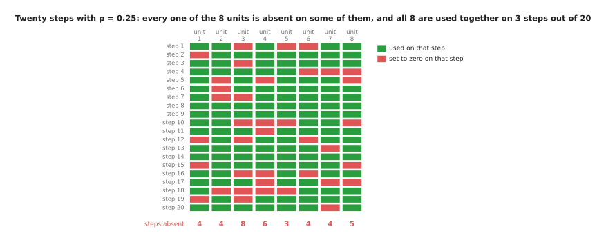
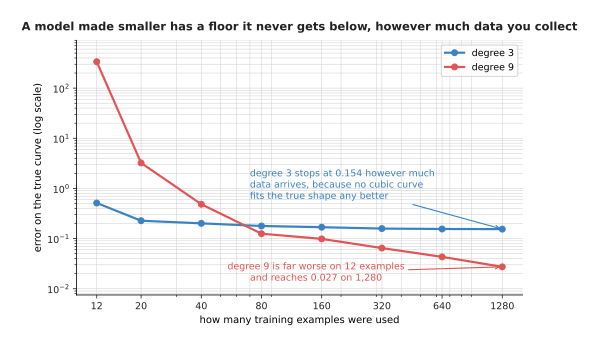

# Overfitting and generalisation

The page before this one, [the training loop](../03_how-training-works/04_the-training-loop.md),
put the whole of training into a single loop. It showed the loss falling step
after step until the curve became flat. Everybody watches that falling curve
while a training run is going. However, that curve is also the thing that
misleads people most often. The reason is that the loss on it is measured on the
very examples the model is being trained on. A model with enough weights can
push that loss down to almost nothing by learning those particular examples one
by one. Such a model has learned nothing at all that holds for an example it has
not seen.

So this page answers one question. How do you tell a model that has learned the
pattern from a model that has only memorised the answers? The short answer is
that you keep some examples back, never train on them, and watch the error on
those instead. The rest of the page is needed for two reasons. The first is that
keeping examples back is easy to do wrongly. The second is that every method
which pushes a model towards learning the pattern costs you something. By the
end of the page you will know how to divide your data into three parts, how to
recognise a division that is lying to you, and what the four cheap repairs for
memorising do and what each one costs.

The page assumes you know what a [loss](../03_how-training-works/01_the-score-of-being-wrong.md)
is, what a [gradient descent step](../03_how-training-works/02_gradient-descent.md)
does, and what the [weights and layers](../02_inside-a-network/02_layers-and-depth.md)
of a network are. It also assumes you have met the word
[generalisation](../01_what-learning-means/03_what-a-model-is.md), which
means doing well on examples that were not used in training. Generalisation is
the only thing anybody wants from a model.

Everything in the pictures was run by
`docs/diagrams/making_training_work.py`, which prints every number quoted here.
The data is made up by a generator with a fixed starting number, so the same run
gives the same numbers every time. The methods run on that data are the real
ones.

## Contents

1. [The loss went down, but did the model learn anything](#1-the-loss-went-down-but-did-the-model-learn-anything)
2. [Three sets of examples, and what each one is for](#2-three-sets-of-examples-and-what-each-one-is-for)
3. [Leakage: when the split tells you a lie](#3-leakage-when-the-split-tells-you-a-lie)
4. [Three ways to stop a model memorising](#4-three-ways-to-stop-a-model-memorising)
5. [Augmentation: more examples from the ones you have](#5-augmentation-more-examples-from-the-ones-you-have)
6. [Where the classical picture stops being true](#6-where-the-classical-picture-stops-being-true)
7. [Where to read next](#7-where-to-read-next)
8. [Using it in Python](#8-using-it-in-python)

---

## 1. The loss went down, but did the model learn anything

The training loop gave us a falling loss. So the first thing to do is to build a
small case where we already know the right answer. Then we can watch that
falling loss mislead us.

An arm slides a sensor along a curved part. At each position of the slide the
sensor gives one reading. The true relation between the position and the reading
is a smooth curve. The sensor also adds noise, which means a small random amount
added to each reading. That noise has a spread of 0.35. The spread of a set of
numbers is the usual distance between one number and their average, and
statisticians call it the standard deviation. Because the noise is there, no
model can be wrong by less than about 0.35 on new readings, however good it is.
We train on 12 noisy measurements, and we keep 50 further measurements back and
never train on them. Those 50 are called the held-out examples.

A **polynomial** is a sum of powers of the input, such as 2 + 3x - 0.5x². The
degree of a polynomial is the highest power in that sum. A polynomial of degree
1 is a straight line. A polynomial of degree 2 bends once. A polynomial of
degree 11 contains twelve numbers that the fitting is free to choose, which is
exactly as many numbers as we have training points. Raising the degree is the
simplest way to make a model more flexible, and flexible here means able to take
more different shapes. In a network you would make the model more flexible by
making its layers wider or by adding more of them. The polynomial stands in for
that, because it is small enough to draw.

The picture below shows the same 12 training points and the same 50 held-out
points three times, each time with a polynomial of a different degree fitted to
the 12.


The degree 1 fit is a straight line, and it misses the shape of the curve. The
degree 5 fit follows the curve closely. The degree 11 fit passes through all 12
training points exactly, and between those points it moves far away from the
true curve.

The errors below are root-mean-square errors. To work one out you take the
difference between the model's answer and the measured reading for each example,
square every difference, take the average of the squares, and then take the
square root. The result is in the same units as the reading, so an error of 1.24
means the model is wrong by about 1.24 on a typical example.

The degree 1 line scores 1.24 on the training examples and 1.15 on the held-out
examples, so it is bad on both. A model that is too simple to capture the
pattern is said to **underfit**. The degree 11 fit scores 0.0000 on the training
examples and 1641.82 on the held-out examples, which is far worse than guessing.
A model that does much better on its training examples than on new ones is said
to **overfit**.

The next picture takes every degree from 0 to 11 and plots both errors against
the degree. The vertical axis uses a logarithmic scale, because the held-out
error covers four factors of ten and would otherwise be unreadable.


The training error falls at every single degree. The held-out error reaches its
lowest value of 0.482 at degree 5 and then climbs, until at degree 11 it is more
than three thousand times larger than that.

The important part is that the training error keeps improving from degree 5
onwards while the held-out error gets worse. This means the training error
cannot be used to choose the degree at all. The same thing happens with a
network. The network used here has one input, two hidden layers of 96 units
each, and 9,601 weights and biases altogether. That is about 800 freely chosen
numbers for each of the 12 training points.

The next picture follows that network through 8,000 training steps. Both axes
use a logarithmic scale, so that the first few hundred steps and the last few
thousand are both visible.


The two losses separate after a few hundred steps. The training loss reaches
0.0102 by step 8,000. The held-out loss reaches its lowest value of 0.2204 at
step 481 and then rises to 3.5976.

For the first 481 steps the network is learning the shape of the curve, so both
losses fall together. After step 481 the training loss keeps falling, because
the network is bending itself to fit the noise in those 12 particular readings.
The held-out readings carry different noise, so every further bend makes the
held-out loss worse. By step 8,000 the held-out loss is 16.3 times worse than it
was at step 481, and nothing on the training curve shows this.

The picture below draws what the trained network actually computes, next to the
true curve it was supposed to find.


The network has taken a shape that visits all 12 training points and has nothing
to do with the true curve anywhere else.

The shape of that red curve is what memorising looks like. The network has not
found a wrong pattern. It has found no pattern at all, and has instead stored
twelve answers and joined them up with whatever shape its weights allowed. So
the first thing to get right is how the held-back examples are chosen and used.

---

## 2. Three sets of examples, and what each one is for

Section 1 kept 50 examples back to show the problem. That is already most of the
method. Real work needs three sets of examples rather than two, because
held-back examples get used for two jobs that spoil each other.

The first job is choosing. Section 1 had to pick a degree, and it did that by
trying several degrees and keeping the one with the lowest held-out error. The
second job is reporting, which means saying how well the finished model will do
on work it has never seen. If the same examples do both jobs, then the number
you report is the number you chose on, and that number is always better than the
truth.

The picture below shows one set of 120 measurements divided into three parts.
Each small square is one measurement, and its colour says which part it was put
in.


Of the 120 measurements, 84 go into the training set, 18 into the validation set
and 18 into the test set.

The **training set** is the only set whose examples ever change a weight. It is
the largest set, because the model learns from it. The **validation set** is
read many times, once for each choice you make. Those choices include how
flexible the model should be, how long to train it, and how strong to make each
method in section 4. Such a choice is called a setting, and a setting is a
number you pick yourself rather than one that training changes for you. The
examples in the validation set never change a weight directly, but they do
change the settings, so the finished model is shaped by them indirectly. The
**test set** is read once, after every choice is final, and the number it gives
is the one you report.

The next picture repeats the degree sweep of section 1 on this three-way split,
and shows all three errors at once.


The validation set picks degree 3, whose validation error is 0.388. The test set
is then read once for that same model, and it gives 0.342.

The validation set preferred degree 3 over degree 10 by only 0.0007, so a
different 18 examples would have chosen differently. Small validation sets make
noisy choices, and that is the honest price of keeping most of your data for
training.

Now for the reason the test set is ruined by being read twice. Suppose you have
several finished candidate models, perhaps several copies saved during one
training run, and suppose they are all equally good. Each one really succeeds on
70 attempts out of 100. You test each candidate with 20 real attempts on the arm
and you keep the winner. The picture below repeats that whole experiment 20,000
times for each number of candidates and averages the result.


Picking the best of 50 equally good candidates on a 20-trial test set makes the
winner look like a 90.9% model. Fresh trials with that same winner give 70.1%.

With one candidate the measured score averages 70.0%. With 12 candidates it
averages 85.7%, and with 50 it averages 90.9%, while the winner's true rate
never moves away from 70%. Nothing improved. The test set simply handed its own
good luck to whichever candidate happened to catch it, and that is why it is
read once. Reading it once is still not enough, though, because a split can be
wrong before anybody reads it.

---

## 3. Leakage: when the split tells you a lie

Section 2 assumed that putting an example in the test set keeps the model away
from it. On a robot that assumption is often false. **Leakage** means that
something about the held-back examples reached the model during training. The
held-back examples are then not really new, and the score they give is too good.
Leakage is the most common reason a model that scored 95% in testing then fails
on the arm, and its worst form comes from the way robot data is recorded.

A robot records continuously. A teleoperated arm, which means an arm a person is
driving by hand, produces video at perhaps 30 frames a second while it picks up
a mug. Frame 40 and frame 41 of one pick are therefore almost the same picture.
If you pool all the frames and divide them at random, frame 40 goes into
training and frame 41 goes into testing.

One complete attempt at a task, from the first frame to the last, is called an
episode. The picture below shows the same recording divided in two different
ways: once frame by frame at random, and once by whole episode.


Splitting frames at random leaves nearly identical pictures on both sides of the
split. Splitting whole episodes keeps those near-identical pictures together.

In the made-up frames used here each episode is 40 frames long. The distance
from one frame to the next inside an episode is 0.1372, and the distance from a
frame to the nearest frame of any other episode is 2.6048. The second distance
is about nineteen times the first. So a model that answers a new frame by
finding the most similar frame it trained on will find the neighbouring frame
from the same episode. It will copy that neighbour's answer and be right every
time, without having learned anything.

The next picture scores one such model three times. The data is the same each
time, and only the way it was divided changes.


The same model on the same data scores 100.0%, 79.2% and 45.0%, and the only
thing that changed is how the examples were divided. Guessing would score 33.3%.

Those three numbers come from one model and one set of 1,080 frames. With a
random frame split the model is perfect, which is a lie. Split by whole episode
it gets 79.2%, which honestly answers the question "how will it do on a new
attempt in a room it has already seen". With a whole scene held back it gets
45.0%, which answers the question "how will it do in a room it has never seen".
The last question is usually the one you care about.

The picture below shows the episode split in full. A scene here means one room,
or one table, with its own lighting and background.


Nine whole episodes are held out, one of each object from each scene, so every
held-out frame comes from an attempt the model never trained on.

The repair is to split along the seam that matters. The seam is whatever unit
you want the model to work across: by episode if you want it to work on a new
attempt, by scene if you want it to work in a new room, by object type if you
want it to work with a part it has not been shown. In practice this means
keeping a label on every example that says which episode, which scene and which
object it came from, and then splitting on that label rather than on the example.

Leakage has quieter forms as well, and all of them come from letting information
cross the split. One common example is working out the average and the spread of
your features over the whole dataset, because the test examples then help decide
numbers the model uses. The question to ask of any split is always the same:
what could the model read off the test examples that it has already seen during
training? Once the answer is nothing, the measurement can be trusted to say
whether the model is overfitting.

---

## 4. Three ways to stop a model memorising

Sections 2 and 3 give an honest measurement. The next question is what to do
when that measurement says the model is overfitting. The general name for
anything that pushes a model towards learning the pattern instead of memorising
the examples is **regularisation**. The three cheapest kinds all work by making
it harder for the model to fit the training examples exactly. That sounds like a
strange goal until you remember that fitting them exactly is what went wrong.

The first method costs nothing. **Early stopping** means watching the validation
loss during training, keeping a copy of the weights whenever that loss reaches a
new lowest value, and using the kept copy at the end rather than the weights you
finished with.


Early stopping keeps the weights from step 481, where the validation loss was
0.2204, instead of the weights from step 8,000, where it was 3.5976.

You do not stop the moment the validation loss moves upwards, because it moves
up and down as training goes on. Instead you wait for a fixed number of
validation scores without a new lowest value before you give up, and that number
is called the patience. The picture below reads the validation loss every 50
steps and follows that rule.


The lowest score is 0.2213 at step 500. The score after it is worse, at 0.2291,
and the loss then climbs to 0.2578 at step 750 before coming back down to 0.2441
at step 1,350, which is still above the lowest score. A patience of 20 scores
stops the run at step 1,500 and keeps the weights saved at step 500. Reading the
loss only every 50 steps is why the best score here is 0.2213 at step 500 rather
than the 0.2204 at step 481 that the previous picture found.

That picture shows why the rule waits. If you stopped at the first worse score
you would stop at step 550, and you would never find out whether the loss was
going to come back down. The cost of early stopping is the time spent pausing
training to score the validation set.

The second method changes the network during training. **Dropout** means
choosing some of the units in a layer at random, at every training step, and
setting their outputs to zero for that step only. The fraction of units chosen
is written p, and it usually runs from 0.1 to 0.5. The list of ones and zeros
that says which units survive is called the mask.


Three of the eight units are set to zero by this mask, and the five that survive
are each multiplied by 1.3333, which is one divided by 1 minus 0.25.

The activations coming into that picture are 1.75, 0.26, 0.00, 1.93, 1.40, 0.00,
0.62 and 1.84. The two zeros among them were already zero, because the rectified
linear unit in front of them had a negative input. This step's mask drops units
2, 5 and 8, which throws away the 0.26 on unit 2, the 1.40 on unit 5 and the
1.84 on unit 8. The sum of the layer therefore falls from 7.8033 to 4.3050,
which is far too small. Every surviving activation is then divided by 1 minus p,
and that brings the sum up to 5.7400.

One mask cannot put the sum back exactly, because one mask is one throw of the
dice. The next picture takes 40,000 random masks and averages what they do to
the same layer.


Over 40,000 random masks the masked sum averages 5.8573, which is 75% of the
true 7.8033. Multiplying by 1.3333 brings that average to 7.8097.

The scaling matters because the next layer has to see numbers of the usual size.
The scaling cannot get that right for every single mask, but it gets it right on
average. This is also why dropout costs nothing at prediction time, when the
masks are switched off and every unit is used.

What dropout buys is that no single unit can be relied on, because any unit may
be absent on any step. The picture below shows twenty steps in a row for the
same layer of eight units.



Over these twenty steps every one of the eight units is absent on at least three
of them, and all eight units are used together on only 3 steps out of 20.

Because a layer cannot count on any one unit being there, it has to spread its
answer across several units instead of building one fragile chain. What dropout
costs is slower training, and it helps today's very large models less than it
helped the mid-sized models it was invented for.

The third method pulls on the weights directly. **Weight decay** subtracts a
small multiple of each weight from itself at every step, on top of the ordinary
gradient step. Every weight is therefore dragged towards zero, and a weight stays
large only if the gradient keeps pushing it back out.


The picture counts the 9,408 weights of the network, which is all 9,601 of its
numbers apart from the 193 biases. Without decay those weights have a
root-mean-square size of 0.3865, and the largest of them reaches 7.01. With a
decay of 0.3 the root-mean-square size is 0.1902 and the largest weight reaches
2.14.

Smaller weights make the network's output change more gently as its input
changes, and a gentle output cannot swing between the training points the way
section 1's red curve did. However, weight decay can be overdone, because a
network whose weights are all forced close to zero cannot represent anything at
all.


The held-out loss falls from 3.5976 to 0.2167 as the decay rises to 0.3, and
then climbs back to 0.6205 at a decay of 10. So the decay strength is one more
setting to choose on the validation set.

Why use these three methods rather than the obvious alternative, which is to use
a smaller model? A smaller model does cut overfitting, and section 1's degree 5
fit is exactly that answer. However, a smaller model also has a lower ceiling.
The picture below fits a degree 3 polynomial and a degree 9 polynomial to
training sets of growing size, and scores both against the true curve.



The degree 3 model is much better than the degree 9 model on 12 examples, but it
stops improving at an error of about 0.154, because no curve of degree 3 fits
the true shape any better than that. The degree 9 model starts far worse and
ends at 0.027, which is about five times smaller than the degree 3 floor.

So choosing a smaller model means giving up that later improvement, and it means
retraining from the beginning if you change your mind once more data arrives.
The three methods above leave the model at its full size and limit only how much
of it gets used. Each one is controlled by a single number you can tune without
rebuilding anything. What they cost is that each adds one more setting to
choose, and every setting chosen on the validation set makes that set a little
less trustworthy, in the way section 2 described. All three methods weaken the
model, and the next section does the opposite.

---

## 5. Augmentation: more examples from the ones you have

The methods in section 4 all weaken the model. This one works the other way, by
strengthening the data. **Augmentation** means making new training examples out
of the ones you already have. You change each example in a way that leaves its
correct answer unchanged, and you train on the changed copies as well. A model
that sees ten thousand versions of your two hundred pictures cannot memorise
them one by one.

The picture below shows one made-up 16 by 16 picture of a mug and three changed
copies of it.


Shifting the mug moves its centre column from 7.22 to 9.22. Dimming it drops the
mean brightness from 0.1984 to 0.1191. Flipping it changes neither of those two
numbers, and it does not change the answer "mug" either.

Each of those three changes is safe, and for each one you can say why. Shifting
is safe because the camera could have been mounted two centimetres further to
the left. Dimming is safe because somebody could have turned a light down.
Flipping is safe for a mug, because a mug with its handle on the left is still a
mug. The flip really did change the picture, and the measurement that shows this
is the lean, which is the brightness on the right half minus the brightness on
the left half. The mug's lean went from -5.60 to +5.60. That third reason is the
one that fails, and on a robot it fails often.


The flip changes the spanner's lean from -1.60 to +1.60, in exactly the way it
changes the mug's lean. For the spanner, though, that change turns one real part
into a different real part.

A left-handed spanner and a right-handed spanner are different items with
different part numbers. A flipped picture of one, labelled as the other, is a
wrong example, and the model will learn from it that handedness does not matter.
The same mistake is possible in any job where left and right mean something,
such as a screw thread or printed text. It is worst for the arm's own
movements, because a flipped picture paired with unflipped joint angles is a
lie about which way the arm went.

The honest way to decide is to ask, for each change, what real thing in the
world would have produced that change, and whether the answer would still be the
same if it had. Changing colour is safe until colour is what tells two parts
apart. Adding noise is safe for almost everything, which is why nearly every
pipeline uses it.

The picture below does the crudest augmentation possible on the curve from
section 1. At every training step it adds a small random shift to the slide
position before the network sees it. That random shift is called jitter.


Adding a random shift of 0.2 metres to the slide position at every training step
cuts the held-out loss from 3.5976 to 0.1421. That is better than any weight
decay strength managed.

This result is worth thinking about, because the crudest augmentation possible
beat every setting of weight decay. The reason is that augmentation tells the
model something true about the world. It says that the reading at 1.40 metres
and the reading at 1.45 metres should be about the same. No amount of weight
shrinking can tell the model that. The cost is the same as everywhere else,
because a shift of 0.8 metres is a lie. Readings half a metre apart really are
different, and when you tell the model otherwise the held-out loss rises to
0.8341. All of this follows one picture of how model size and error are related,
and that picture is not the whole story.

---

## 6. Where the classical picture stops being true

The shape that section 1 drew, in which the held-out error falls and then rises
for good, was the settled teaching of the subject for about forty years. It is
still right for a small model on a small dataset, which is most robot work.


The classical picture says that the held-out error falls while the model is too
simple, reaches its best value at some middle flexibility, and then rises for
good once the model is flexible enough to fit the noise.

Now watch what happens past the point where that picture says to stop. The
models below are networks whose first layer is fixed at random and whose second
layer is fitted exactly, so they can be worked out directly without any training
loop. Their width, which means how many units the hidden layer has, runs from 1
to 1,200, and there are 60 training examples throughout.


The held-out error falls to 0.806 at a width of 32, peaks at 1.995 at a width of
58, and then falls again all the way to 0.338. That final value is less than
half the best error any narrow model reached.

The error falls, rises to a peak, and then falls again past its old best value.
This shape is called **double descent**. The peak sits where the model first
becomes able to pass through every training point.


The training error first reaches exactly zero at a width of 60, which is exactly
the number of training examples. The two worst held-out errors in the whole
sweep, 1.995 and 1.890, are at widths 58 and 60, so the worst place to be is
right at that width.

At a width of 60 there is exactly one way to pass through all 60 points, and
that one way is forced to be a wild shape, like section 1's red curve. Past a
width of 60 there are many ways to pass through the points, and fitting by least
squares picks the gentlest of them, so the fit improves the more choice it has.
This is the honest reason the biggest models of today keep improving as they are
made larger, where the classical picture says they should be useless. It is also
why practice with large models looks odd from the textbook. Training continues
long past the point where the training loss is tiny, dropout is often left out
altogether, and the size of the run is decided by the data and the arithmetic
available rather than by a validation curve turning upwards.

None of this lets you off sections 2 to 5. Double descent needs far more model
than data, together with a fitting method that quietly prefers gentle solutions.
A few hundred demonstrations against a model of a few hundred million weights
lands you near the peak rather than past it. So "the model is too big" is a
claim to check with a measurement rather than a rule to apply.

---

## 7. Where to read next

- [Normalisation and stability](02_normalisation-and-stability.md) is the next
  page, and it deals with the other half of making training work, which is
  keeping the numbers inside the network in a range the arithmetic can handle.
- [Running and evaluating a model](../14_using-a-model-for-real/01_running-and-evaluating-a-model.md)
  takes section 2's honest number to real trials.
- [Scale, data and compute](../07_pretraining-and-adapting/02_scale-data-and-compute.md)
  says how much data a model of a given size needs, which is the other side of
  section 6's peak.
- [Fine-tuning and adapters](../07_pretraining-and-adapting/03_fine-tuning-and-adapters.md)
  is where overfitting does the most damage, because a fine-tune often has only
  a few dozen demonstrations.
- [Evaluation and failure](../../07_learned-models/10_making-models-work-on-an-arm/02_most-used/03_evaluation-and-failure.md)
  is the catalogue page for testing a model on a real arm.
- [Where the data comes from](../../07_learned-models/01_what-models-are/05_where-the-data-comes-from.md)
  describes how robot datasets are collected, which decides where the seams are.

---

## 8. Using it in Python

Sections 2, 3 and 4 are each one or two lines of real code. The point of this
section is that the library gives you the mechanism while you keep every
decision.

```python
import numpy as np
import torch
from torch import nn

# Section 3: the split is by episode, never by frame. 24 episodes of 40 frames,
# and 6 whole episodes are held back, which is 240 frames.
episode = np.repeat(np.arange(24), 40)
held = np.random.default_rng(0).permutation(24)[:6]
is_held = np.isin(episode, held)
print(is_held.sum(), (~is_held).sum())          # 240 720

# Section 4: dropout is a layer, and weight decay is one argument.
model = nn.Sequential(
    nn.Linear(8, 96), nn.ReLU(), nn.Dropout(p=0.25),
    nn.Linear(96, 96), nn.ReLU(), nn.Dropout(p=0.25),
    nn.Linear(96, 1),
)
opt = torch.optim.AdamW(model.parameters(), lr=2e-3, weight_decay=0.3)

# Section 4: dropout zeroes some units and scales the rest by 1/(1-p),
# and it switches itself off for prediction.
drop = nn.Dropout(p=0.25)
drop.train(); print(drop(torch.ones(1, 8)))     # zeros and 1.3333s
drop.eval();  print(drop(torch.ones(1, 8)))     # all ones

# Section 4: early stopping, four lines around the loop you already have.
# These two stand in for the loop and the held-back set of the last page, so
# that this block runs as it stands.
def train_one_step(model, opt):
    loss = ((model(torch.randn(32, 8))[:, 0] - torch.randn(32)) ** 2).mean()
    loss.backward(); opt.step(); opt.zero_grad()

def validation_loss(model):
    model.eval()
    with torch.no_grad():
        out = model(torch.randn(240, 8))[:, 0]
    model.train()
    return float(((out - torch.randn(240)) ** 2).mean())

best, best_weights, waited = float('inf'), None, 0
for step in range(8000):
    train_one_step(model, opt)                  # your loop from the last page
    if step % 50 == 0:
        score = validation_loss(model)
        if score < best:
            best, waited = score, 0
            best_weights = {k: v.clone() for k, v in model.state_dict().items()}
        else:
            waited += 1
            if waited == 20:                    # the patience
                break
model.load_state_dict(best_weights)
```

The library does three things for you. It applies the dropout mask and the
1.3333 scaling, and it turns both off when you call `model.eval()`. Forgetting
that call is the most common mistake here, and it is the reason a model can look
worse in testing than in training. The library also applies weight decay inside
the optimiser rather than by adding a term to the loss, which is what the W in
AdamW means. Finally, `state_dict` and `load_state_dict` make keeping and
restoring the best weights two lines of code.

What you still have to decide is everything that matters. The library has no
idea that your frames came from episodes, so the split is yours to get right,
and `sklearn.model_selection.GroupShuffleSplit` will do it for you only once you
tell it what the groups are. The library has no opinion on p, on the decay
strength, on the patience, or on which layers get dropout, and section 4 showed
those numbers moving the held-out loss by factors of ten. No library will stop
you reading the test set twice, so the discipline in section 2 is yours alone.
