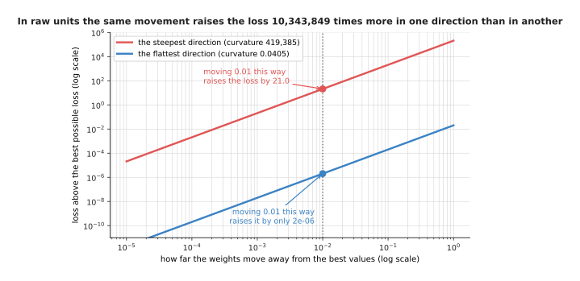
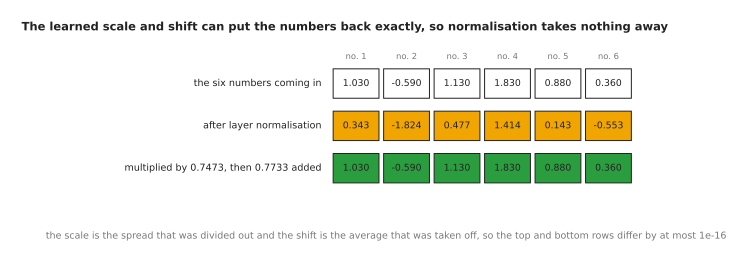
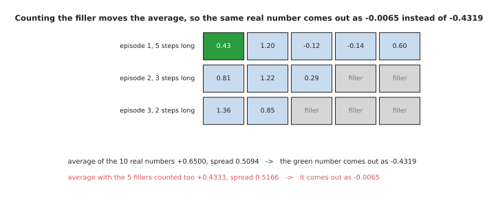
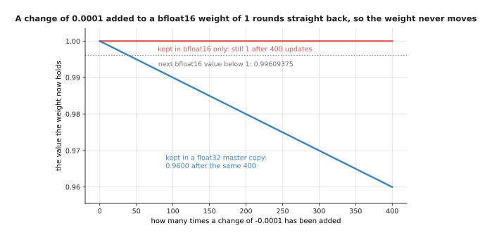
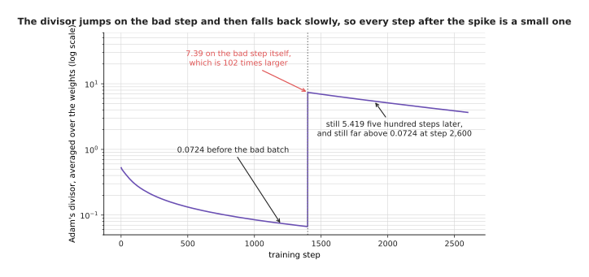

# Normalisation and stability

The page before this one, [overfitting and
generalisation](01_overfitting-and-generalisation.md), was about whether the
model learned the right thing. It took for granted that the training run
finished at all. This page is about the other half of making training work,
which is keeping the numbers inside the network in a range where the arithmetic
behaves. A run can fail in two ways that have nothing to do with the choice of
model. The loss may never come down, even though the model is fine. Or the loss
may come down for a day, then jump upwards and stay there. Both failures come
from the sizes of the numbers involved.

So this page answers four questions. Why does one feature measured in
millimetres, beside another measured in metres, make training almost impossible?
What do the normalisation layers inside a modern network actually calculate? Why
is the normalisation placed where it is, around the running total that a stack
of blocks keeps? And what goes wrong when the numbers are held in half the usual
number of bits, which every large training run does today for speed? By the end
you will be able to read a normalisation layer, say why a transformer puts it
before each block rather than after, and know which few numbers must stay in the
larger format.

The page assumes you know what a
[gradient](../03_how-training-works/03_backpropagation.md) is, what a
[learning rate](../03_how-training-works/02_gradient-descent.md) does, and what
a [residual connection](../02_inside-a-network/02_layers-and-depth.md) is. It
also uses the words float32, float16 and bfloat16, which
[the shape of the numbers](../02_inside-a-network/03_the-shape-of-the-numbers.md)
introduced as the formats a single number can be stored in.

Everything in the pictures was worked out by
`docs/diagrams/making_training_work.py`, which prints every number quoted here.
The data is made up by a generator with a fixed starting number, so the same run
gives the same numbers every time.

## Contents

1. [Why the numbers need keeping in range](#1-why-the-numbers-need-keeping-in-range)
2. [Layer normalisation and root-mean-square normalisation](#2-layer-normalisation-and-root-mean-square-normalisation)
3. [Why batch normalisation is used less today](#3-why-batch-normalisation-is-used-less-today)
4. [The residual stream, and where the normalisation sits](#4-the-residual-stream-and-where-the-normalisation-sits)
5. [Mixed precision: which numbers stay large](#5-mixed-precision-which-numbers-stay-large)
6. [Loss spikes, and what people do about one](#6-loss-spikes-and-what-people-do-about-one)
7. [Where to read next](#7-where-to-read-next)
8. [Using it in Python](#8-using-it-in-python)

---

## 1. Why the numbers need keeping in range

The simplest version of the problem does not need a network at all. We want to
predict how long a reaching move takes, from two numbers about that move. The
first number is how far the arm reaches, written down in millimetres. The second
is how high it lifts, written down in metres. Both are sensible measurements,
and nobody thought about units when they were recorded.


The reach runs from 222 to 637.7 and has a spread of 123.5. The height runs from
0.08009 to 0.6128 and has a spread of 0.15554. One feature is therefore about
1,304 times bigger than the other.

Each feature gets one weight, and the loss is the usual squared error. The
gradient on a weight is proportional to the size of the feature that weight
multiplies. So at the start of training the weight on reach gets a gradient of
-2551.34 while the weight on height gets -1.9519, which is 1,307 times smaller.
One single learning rate has to serve both weights.


Standardising the two features brings the loss within 0.001 of the best possible
value in 2 steps. Leaving them in millimetres and metres takes 20,283,999 steps
to reach the same point.

That is a factor of about ten million, and it is not caused by a badly chosen
learning rate. Each run uses half of the largest rate that is stable for its own
problem, which is the usual safe choice. Gradient descent on a squared-error
loss can be worked out with a formula instead of a loop, so the script uses the
formula and then checks it against a real loop. Both give a loss of 0.174332
above the best possible value after 2,000 steps.


In raw units the weight on height has reached only 0.018 of its best value after
100,000 steps, and only 0.161 of it after a million steps. After standardising,
both weights arrive within five steps.

So the slowness is one weight moving at the wrong speed, rather than everything
moving slowly. **Normalisation** is the general name for any step that rescales
numbers into a known range. The simplest kind is called standardising. You
subtract a feature's average from every value of it, and then divide by that
feature's spread. Every feature then arrives with an average near 0 and a spread
near 1.


Raw units force a learning rate of at most 0.00000477, while standardised units
allow 0.946. The second rate is 198,392 times larger than the first.

The reason is the shape of the loss. The curvature of the loss in a given
direction says how fast the loss rises as the weights move that way. In raw
units the curvature differs by a factor of 10,343,849 between the steepest
direction and the flattest one.



Moving the weights by 0.01 in the steepest direction raises the loss by 21.0.
Moving them by the same 0.01 in the flattest direction raises it by 0.00000203.

The learning rate must be small enough to be safe in the steepest direction, or
the run grows without limit and fails. That same rate is then far too small for
the flattest direction, so the weight that lies along it crawls. After
standardising, the ratio between the two curvatures is 1.12, so one learning
rate suits every direction.

Two warnings go with this. The average and the spread must be worked out on the
training set alone and then applied to the other sets, because using all the
data lets the test examples
[leak in](01_overfitting-and-generalisation.md#3-leakage-when-the-split-tells-you-a-lie).
The outputs need the same treatment as the inputs, because a robot's joint
angles in radians and its gripper opening in millimetres are just as mismatched
as reach and height. Scaling the inputs once is only the start, though, because
the numbers deeper inside the network drift as the weights change.

---

## 2. Layer normalisation and root-mean-square normalisation

Section 1 scaled the inputs once, before training. That fixes the first layer
only. The layers after it take the outputs of the layer below, and those outputs
drift as the weights change. So modern networks repeat a normalisation step
inside the network at every block. The rule that almost every language model and
vision transformer uses works on one example at a time.

**Layer normalisation** takes the vector of numbers belonging to one example at
one place in the network. It subtracts their average, divides by their spread,
then multiplies by a learned scale and adds a learned shift. Learned here means
that the scale and the shift are weights, so training changes them like any
other weight. The picture below does all of that to one real vector of six
numbers, one row per step.


The six numbers average 0.7733. Their squared deviations average 0.5584. The
spread is the square root of that average plus a tiny guard, which gives 0.7473.
Dividing by the spread leaves six numbers whose average is 0.0000 and whose
spread is 1.0000.

Follow one number through. The third number is 1.13. Subtracting the average
0.7733 gives 0.3567. Dividing by the spread 0.7473 gives 0.4773. The learned
scale for that position is 1.00 and the learned shift is -0.20, so the result is
0.2773. The guard added before the square root is written 1e-05 and is called
epsilon. It stops the division by zero that six identical numbers would
otherwise cause.

The learned scale and shift matter for a reason worth seeing directly. Without
them, every vector in the network would be forced to have average 0 and spread
1. With them, the network can put the original numbers back whenever that helps.



If the learned scale is set to 0.7473, which is the spread that was divided out,
and the learned shift is set to 0.7733, which is the average that was taken off,
the six original numbers come back. The largest difference between the first row
and the last is 1e-16, which is rounding error and nothing else.

So normalisation changes how easy the numbers are to train with, rather than
what the network is able to represent.

**Root-mean-square normalisation**, usually written RMS normalisation, does less
work. It leaves the average alone. It divides by the root-mean-square of the
numbers instead of by their spread, and it has a learned scale but no learned
shift. The root-mean-square of a set of numbers is the square root of the
average of their squares.


The squares of the six numbers average 1.1565, and the square root of that is
1.0754. Dividing by 1.0754 leaves numbers whose root-mean-square is 1.0000 but
whose average is 0.7191 rather than zero.

Follow the third number again. It stays at 1.13, because there is no average to
take off. Dividing by 1.0754 gives 1.0508, and the learned scale of 1.00 leaves
that alone. So RMS normalisation makes one pass over the vector where layer
normalisation makes two, and that is why it is faster.


The two rules give different answers on this vector. They differ by up to
1.1482, because RMS normalisation leaves the average of 0.7191 in place where
layer normalisation removes it.

Why choose RMS normalisation rather than layer normalisation, then, when it
clearly does something different? Because measurements on real networks found
that removing the average made almost no difference to the final quality, while
the saving in time and memory is real at every block of a large model. What RMS
normalisation costs is that a vector whose average has drifted far from zero
stays that way, and the network has to live with it.

Both rules above work along one example. There is another rule that works the
other way round, and the picture below marks both directions on one batch of
numbers. A batch is the group of examples a training step uses together.


Layer normalisation averages across one example, which is the first row here,
and gets 0.2267 with a spread of 0.8142. Batch normalisation averages down one
feature across the other examples, which is the first column, and gets -1.1625
with a spread of 0.9381.

That last picture holds the whole difference between the normalisation modern
networks use and the one they replaced, and the next section is about why that
difference matters.

---

## 3. Why batch normalisation is used less today

Section 2 showed two ways of averaging a grid of numbers. The one that goes down
a column rather than along a row is **batch normalisation**. It was the standard
for years, and it is still common in convolutional networks for pictures. It
takes one feature, averages it over all the examples in the batch, subtracts
that average, and divides by the spread of the same column. It is cheap, and it
was the method that first made very deep convolutional networks trainable.

Its problem follows straight from the picture. The answer it gives for one
example depends on which other examples happened to share its batch.


The same activation of -0.89 comes out as +0.2905 when it sits beside three
quiet examples. It comes out as -1.3338 when it sits beside three bright ones.
The gap between the two answers is 1.6243.

That is not a bug. It is the definition of the method, and it has three
consequences.

The first consequence is that the smaller the batch, the noisier the answer.
This matters because large models are trained with few examples per device, since
each example is enormous.


With two examples in a batch, the answer for one fixed example moves by 0.7463
from batch to batch. It takes 256 examples in a batch to bring that movement
down to 0.0749.

The second consequence is that batch normalisation does not fit inputs of
different lengths. A batch of sentences, or a batch of robot episodes, holds
items of different lengths. The short ones are padded out with filler numbers so
that the batch forms a rectangle. Averaging down a column therefore mixes real
numbers with filler.



The 10 real numbers average +0.6500, and the marked number +0.43 then comes out
as -0.4319. Counting the 5 filler cells as well drops the average to +0.4333,
and the same real number then comes out as -0.0065 instead.

So the answer for a real number changes with how much padding its batch happens
to carry, and the amount of padding depends on which other episodes were drawn
into that batch.

The third consequence is the awkward one. At prediction time there is often only
one example, so there is no column to average. Batch normalisation deals with
this by keeping a running average and a running spread during training and using
those stored numbers instead. This means the layer calculates one thing while
training and a different thing while predicting.


The stored average of 0.2422 and the stored spread of 1.1776 were learned on
quiet pictures. When the room gets brighter, the two routes disagree by 1.0393
for the very same number.

So why use layer normalisation or RMS normalisation rather than batch
normalisation, given that batch normalisation came first and trains slightly
faster on pictures? Because both newer rules work on one example by itself,
which removes all three problems at once. The batch size stops mattering, the
padding stops mattering, and training and prediction compute the same thing.
What that costs is the small regularising effect that the noise of batch
normalisation provided for free, and a little speed on the convolutional
networks where batch normalisation still holds its place. For transformers the
choice is not close, and the next section is about where to put the
normalisation once it is chosen.

---

## 4. The residual stream, and where the normalisation sits

Section 3 settled which normalisation to use. This section is about where to put
it. A modern network is a stack of blocks, and each block does not replace what
came before it. Each block adds to it, which is what the
[residual connection](../02_inside-a-network/02_layers-and-depth.md) on an
earlier page described. The running total that the blocks keep adding to is
called the **residual stream**.


The stream starts at a size of 1.071. Each block reads the stream, works out a
small change, and adds that change back, so nothing an earlier block wrote is
ever overwritten.

Those sizes are root-mean-square sizes of whole vectors, so they do not add up
the way the labels suggest. A change of size 0.711 added to a stream of size
1.071 leaves a stream of size 1.241, because the change points in a different
direction from the stream. This arrangement is what lets a stack of dozens of
blocks train at all, because the gradient coming backwards has a clear path
along the stream. The question is where the normalisation goes.


Normalising before the block leaves the stream itself untouched and adds the
block's output to it. Normalising after the addition rewrites the stream. On
this four-number stream the two answers differ by up to 1.387.

The first arrangement is called **pre-norm**. The block reads a normalised copy
of the stream, while the stream itself passes through unchanged. The second is
called **post-norm**. The normalisation sits on the stream, so the stream is
rewritten at every block. Every transformer in wide use today is pre-norm, and
the reason appears when you measure the two.


In pre-norm the stream grows as blocks keep adding to it. In post-norm the
normalisation pins it to exactly 1 at every block. Through 64 blocks, the first
block of a pre-norm stack is handed 7.20 times the gradient that the last block
gets, against 2.87 times for post-norm.

Pinning the stream to 1 sounds tidier, but it means that every block's output is
rescaled along with everything the earlier blocks wrote. The gradient must then
pass through a normalisation at every single block on its way back. In pre-norm
the path back is an exact addition, so whatever gradient arrives at the top of
the stack also arrives at the bottom, plus a contribution from each block along
the way. The right-hand panel above shows the early blocks of a pre-norm stack
getting the stronger signal at every depth.


A stack of 24 blocks trains under both arrangements at learning rates of 0.001
and 0.003. At 0.01 and above, the post-norm stack collapses to a loss of 0.8368
after 220 steps, which is the score you would get by predicting the average of
the targets every time.

That is the honest shape of the difference. At a small learning rate post-norm
is fine, and here it is in fact slightly better. At a large learning rate it
stops learning altogether, while pre-norm keeps training. The usual repair for
post-norm is warmup, which means starting the learning rate near zero and
raising it over the first few hundred steps. In this run, 50 steps of warmup
bring the post-norm stack back to a loss of 0.000000042 at a learning rate of
0.01. So the cost of pre-norm is that the growing stream has to be normalised
once more at the very end, before the output layer. The benefit is that the run
survives a learning rate large enough to be worth using. All of this assumes
that the numbers are stored accurately enough to mean what they say, which is
the next question.

---

## 5. Mixed precision: which numbers stay large

Sections 1 to 4 kept the numbers in a sensible range. This section is about how
many bits each number is stored in, because every large run today stores most of
them in half the usual number of bits. The reason is money and time, since half
as many bits is half the memory and roughly twice the speed on matrix multiply
hardware. **Mixed precision** means doing most of the arithmetic in a 16-bit
format while keeping a few specific things in 32 bits.


float32 has 8 exponent bits and 23 mantissa bits, and it reaches 3.403e+38.
bfloat16 keeps the same 8 exponent bits but has only 7 mantissa bits, and it
still reaches 3.39e+38. float16 has 5 exponent bits and 10 mantissa bits, and it
stops at 65,504.

The exponent bits set how far a format reaches, and the mantissa bits set how
fine its steps are. That split is the whole reason bfloat16 became the usual
choice. bfloat16 keeps exactly the reach of float32, so any number that fits in
a float32 also fits in a bfloat16. It pays for that with coarse steps, because
the smallest change it can represent near 1 is 0.0078125 against float32's
0.000000119. float16 made the opposite choice. Its steps are finer, but its
reach stops at 65,504 at the top, and at the bottom it cannot hold anything
smaller than about 0.00000006.


Mixed precision halves the weights used for the arithmetic and halves the
gradients. It also adds a float32 master copy of the weights, so every weight
still costs 16 bytes in total.

So mixed precision is not about saving memory on the weights. That is widely
assumed and it is wrong. The pieces that stay in float32 are the master copy of
the weights, the optimiser's two running averages, and the places where many
numbers are added up. Those places are the loss, the averages and spreads inside
the normalisation layers, and the sum inside a softmax. The real saving is in
the activations, because one layer's output for 2,048 rows of 4,096 numbers
takes 32 MB in float32 and 16 MB in bfloat16.

The master copy deserves its own picture, because it is the piece people leave
out first. A training step often changes a weight by less than one bfloat16
step, and adding a change that small to a bfloat16 weight does nothing at all.



The next bfloat16 value below 1 is 0.99609375, so the two values are 0.00390625
apart. A change of -0.0001 added to a bfloat16 weight of 1 therefore rounds
straight back to 1, and after 400 such changes the weight is still exactly 1.
The same 400 changes applied to a float32 master copy take the weight to 0.9600.

Keeping the master copy is what makes the small changes add up. The gradients
have their own problem, which is the opposite one.


Of these 400,000 gradient values, 18.21% round to exactly zero in float16. None
of them round to zero after being multiplied by 1,024, and none of them round to
zero in bfloat16.

That picture explains the one piece of machinery float16 training needs and
bfloat16 training does not. Gradients are small numbers, with a median of about
0.0000002 here, and float16 cannot hold anything below about 0.00000006. So
nearly a fifth of the gradients become exactly zero, and the weights they belong
to get no update at all. The repair is a **loss scale**. You multiply the loss
by a large number, say 1,024, before working out the gradients, which lifts
every gradient into the range float16 can hold. You then divide the gradients by
1,024 again before the optimiser uses them. It works, and it is what everybody
did for years. However, a scale set too large makes the gradients overflow,
which means they grow past the largest value the format can hold.


float16 cannot hold 100,000 at all and gives infinity instead. bfloat16 holds it
as 99,840, and holds 1e+38 as 9.969e+37.

Overflow is what makes float16 dangerous rather than merely awkward. Once a
value passes 65,504 the format stores infinity instead. Infinity minus infinity
is not a number, so one overflowed gradient turns a weight into "not a number".
That weight then spoils everything computed from it, and the loss reads as "not
a number" for the rest of the run. The standard answer is a loss scale that
halves itself whenever an infinity appears and doubles slowly when none has
appeared for a while, skipping the step each time one does. With bfloat16 none
of this is needed, because its reach is float32's reach. That is why bfloat16 is
the usual choice wherever the hardware supports it, and it leaves one failure
that no number format can prevent.

---

## 6. Loss spikes, and what people do about one

Section 5 described a failure that is obvious when it happens, because the loss
becomes "not a number" and stays there. This section is about the quieter
failure that mixed precision can neither cause nor cure. A **loss spike** is a
sudden jump in the training loss, from a value the run had been improving on for
hours up to a much worse one, usually within a handful of steps.


The loss was 1.6021 just before step 1,400. It reaches 1.9550 at step 1,437. It
is still 1.6276 at step 2,600, which is a level the run had already passed long
before the spike.

The spike was caused on purpose, by one batch whose gradient was far larger than
usual. The mechanism is worth following, because the obvious explanation is not
the right one.


The gradient size is 0.1462 on an ordinary step and 994.1 on the bad one, which
is 6,801 times larger. The gradient shows the trouble on the step it happens,
while the loss does not reach its peak until 37 steps later.

The step the optimiser actually took was not 6,801 times larger, though. Adam
divides each step by a running average of the recent squared gradients, and that
divisor rises on the same step as the gradient does. The weight change on the
bad step came to 0.13427 against a usual 0.00785, which is 17 times larger. That
is enough to undo hours of progress, but it is far less than the gradient alone
would suggest.



The divisor was 0.0724 before the bad batch and 7.393 on the bad step itself,
which is 102 times larger. It is still 5.419 five hundred steps later, and still
far above 0.0724 at step 2,600.

That slow fall is the real damage. The divisor stays large for hundreds of steps
after the spike, so every step taken during the recovery is much smaller than
the steps the run was taking before. The optimiser has to walk back a long way
using steps that have been shrunk, which is why the loss is still worse at step
2,600 than it was just before the bad batch arrived.

The gradient size is therefore the single most useful thing to log during a
training run, because it names the step that went wrong while the loss only
shows the damage afterwards. In real runs the bad step usually turns out to be a
batch holding something odd, such as a page of repeated characters or a
demonstration in which the arm was knocked.


Clipping the gradient at 2.0 removes the spike completely and ends at 1.6017.
Going back to the last saved copy and skipping the bad batch also removes it and
ends at 1.6018. Doing nothing ends at 1.6276.

Two things are done in practice, and the first is cheap enough to leave switched
on always. Gradient clipping measures the size of the whole gradient before the
step. If that size is above a threshold, it scales every part of the gradient
down so that the size equals the threshold exactly. A threshold of 2.0 here is
about fourteen times the ordinary gradient size, so it never touches a normal
step, and it shrinks the bad one by a factor of nearly five hundred. Its cost is
that a threshold set too low quietly slows every step of the run, which is why
the threshold is chosen from a log of real gradient sizes rather than guessed.

The second thing is what people do when a spike gets through anyway. They go
back to the last saved copy of the weights, skip the batches around the one that
caused the spike, and carry on. That is one reason
[checkpoints](../03_how-training-works/04_the-training-loop.md) are written
often. If spikes keep coming back at the same place after a rewind, then the
cause is not one batch. The usual next moves are to lower the learning rate, to
lengthen the warmup, or to look again at section 4.

---

## 7. Where to read next

- [Tokens and embeddings](../05_turning-the-world-into-numbers/01_tokens-and-embeddings.md)
  is the next page, and it turns words and pictures into the vectors this page
  has been normalising.
- [A transformer block](../06_the-transformer/02_a-transformer-block.md) puts
  section 4's pre-norm arrangement together with attention and a feed-forward
  part.
- [The shape of the numbers](../02_inside-a-network/03_the-shape-of-the-numbers.md)
  covers section 5's number formats in more detail, and what a matrix multiply
  costs.
- [Making a model smaller and faster](../07_pretraining-and-adapting/04_making-a-model-smaller-and-faster.md)
  takes precision down to 8 and 4 bits, where the model runs rather than trains.
- [Running a model on a robot](../../07_learned-models/10_making-models-work-on-an-arm/02_most-used/02_running-a-model-on-a-robot.md)
  is the catalogue page for getting a trained model onto an arm's own computer.

---

## 8. Using it in Python

Every piece of machinery on this page is one or two lines in PyTorch. The code
below works through sections 1, 2, 4, 5 and 6 in that order.

```python
import torch
from torch import nn

# Section 1: scale the inputs, using the training set's own average and spread.
train_x = torch.tensor([[520.0, 0.31], [240.0, 0.58], [610.0, 0.12]])
mean, sd = train_x.mean(0), train_x.std(0, correction=0)
scaled = (train_x - mean) / sd          # apply this same mean and sd to test data

# Section 2: the two normalisation rules, on the page's own six numbers.
h = torch.tensor([[1.03, -0.59, 1.13, 1.83, 0.88, 0.36]])
print(nn.LayerNorm(6, elementwise_affine=False)(h))
# tensor([[ 0.3435, -1.8244,  0.4773,  1.4140,  0.1427, -0.5531]])
print(nn.RMSNorm(6, elementwise_affine=False)(h))
# tensor([[ 0.9578, -0.5486,  1.0508,  1.7017,  0.8183,  0.3348]])

# Section 4: a pre-norm block. The stream is added to, never overwritten.
class Block(nn.Module):
    def __init__(self, width):
        super().__init__()
        self.norm = nn.RMSNorm(width)
        self.ff = nn.Sequential(nn.Linear(width, 4 * width), nn.GELU(),
                                nn.Linear(4 * width, width))

    def forward(self, stream):
        return stream + self.ff(self.norm(stream))

# Sections 5 and 6: bfloat16 arithmetic, then clipping before every step.
# The first four lines stand in for your own model and data, so that this block
# runs as it stands; autocast takes whichever device you actually have.
model, loss_fn = nn.Sequential(nn.Linear(4, 16), nn.GELU(), nn.Linear(16, 1)), nn.MSELoss()
opt = torch.optim.AdamW(model.parameters(), lr=1e-3)
loader = torch.utils.data.DataLoader(
    torch.utils.data.TensorDataset(torch.randn(64, 4), torch.randn(64, 1)), batch_size=32)
device = 'cuda' if torch.cuda.is_available() else 'cpu'

for batch, target in loader:
    with torch.autocast(device, dtype=torch.bfloat16):
        loss = loss_fn(model(batch), target)
    loss.backward()
    size = nn.utils.clip_grad_norm_(model.parameters(), max_norm=2.0)
    print(float(size))                  # log this: section 6's spike detector
    opt.step()
    opt.zero_grad(set_to_none=True)
```

The two printed vectors are exactly the numbers in section 2's pictures, which
shows that `nn.LayerNorm` and `nn.RMSNorm` really are the arithmetic worked out
there. `torch.autocast` is doing a great deal in those four lines. It keeps a
list of which operations are safe in bfloat16 and which are not, so the matrix
multiplies run in bfloat16 while the normalisation statistics, the softmax sums
and the loss stay in float32, and you change no layer yourself. With float16 you
would also need `torch.amp.GradScaler` for section 5's loss scale, and it
handles the halving, the doubling and the skipped steps on its own.

What you still have to decide is where the normalisation goes, which the `Block`
above answers by putting it before the feed-forward part, and which of the two
rules to use. You decide the clipping threshold, and section 6 showed that it
should come from a log of real gradient sizes rather than from a guess. You
decide how often checkpoints are written, since that sets how much a rewind
costs. And you decide the scaling of your own inputs and outputs, because the
library has no idea that one of your columns is in millimetres.
