# Tokens and embeddings

The page before this one, [Normalisation and
stability](../04_making-training-work/02_normalisation-and-stability.md), ended
by saying that the numbers given to a network have to be scaled, so that
training stays steady. That page assumed that the input was already a list of
numbers. Every page before it assumed the same thing. This chapter asks where
those numbers come from, because nothing a robot meets arrives as a list of
numbers on its own. A sentence is made of letters. A photo is made of light.
The arm's own readings are angles and forces, measured in units that have
nothing to do with each other.

This page does that job for text. Text is the clearest case, and everything
else copies its pattern. The page answers four questions. How is a sentence cut
into pieces? How does a piece become a list of numbers? What does it mean for
two of those lists to be near each other? How does a model find out what order
the pieces came in? By the end you will be able to read the input stage of any
language model and say what each part is for. The page assumes that you know
what a weight is, what a layer is, and what training does. It assumes nothing
at all about language.

The text behind the numbers here is invented. The script
[`turning_the_world_into_numbers.py`](../../diagrams/turning_the_world_into_numbers.py)
writes 3,200 short robot instructions from a set of sentence patterns. It then
builds a small tokeniser and a small table of word vectors from those
instructions. The methods are the real ones, and they are applied in full to
that text, so every count and every similarity below is a genuine output of the
script. What is small here is the scale. A real tokeniser is built from a vast
amount of text and holds tens of thousands of pieces, so it cuts words into
fewer pieces than this one does.

## Contents

1. [A token is a piece of text the model treats as one unit](#1-a-token-is-a-piece-of-text-the-model-treats-as-one-unit)
2. [Why pieces, and not whole words or single letters](#2-why-pieces-and-not-whole-words-or-single-letters)
3. [The embedding table is a lookup](#3-the-embedding-table-is-a-lookup)
4. [Near each other means used in the same way](#4-near-each-other-means-used-in-the-same-way)
5. [Telling the model what order the tokens came in](#5-telling-the-model-what-order-the-tokens-came-in)
6. [What the picture of the geometry leaves out](#6-what-the-picture-of-the-geometry-leaves-out)
7. [Where to read next](#7-where-to-read-next)
8. [Using it in Python](#8-using-it-in-python)

---

## 1. A token is a piece of text the model treats as one unit

A network takes numbers as its input, and it takes a fixed quantity of them. A
sentence is made of letters, so the first job is to cut the sentence into
pieces that can be counted and numbered.

A **token** is one such piece of text. The model treats a token as a single
unit, and it never looks inside it. The program that does the cutting is called
a **tokeniser**. The list of every piece that the tokeniser is allowed to
produce is called its **vocabulary**. Each piece has a place in that list, and
the number of that place is the piece's number. That number is the only thing
the model ever receives.

The picture below shows one instruction before and after the cutting. The row
of boxes is the list of tokens, and the small number under each box is that
token's place in the vocabulary.

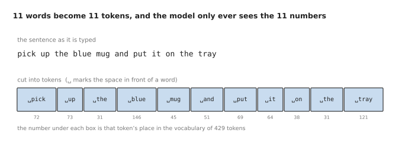

The instruction is cut into eleven tokens, and the vocabulary that these tokens
come from holds 429 pieces in all.

The open box character ␣ stands for the space in front of a word. The tokeniser
keeps that space inside the token. This means the tokeniser can rebuild the
original sentence exactly, spaces included.

Every one of those eleven words is common in the text the tokeniser was built
from. Because of that, each word became a single token. The model therefore
receives the numbers 72, 73, 31, 146, 45, 51, 69, 64, 38, 31 and 121. The
number 31 appears twice, because the word "the" appears twice. Words that are
not common behave differently, and the next picture shows how.

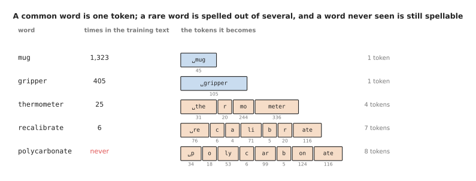

A word the tokeniser saw often gets a token of its own. A rare word is spelled
out of smaller pieces. A word the tokeniser never saw can still be spelled.

The word "mug" appeared 1,323 times in the training text, so it earned a token
of its own. The word "gripper" appeared 405 times, so it earned one too. The
word "thermometer" appeared only 25 times, so it is spelled with four pieces
instead. The word "polycarbonate" never appeared at all, and it is still
spelled, using eight pieces that do exist.

This method is called **subword tokenisation**. The word "subword" means that a
piece may be part of a word rather than a whole word. Because any word can be
spelled from smaller pieces, the model can read a word that nobody showed it
during training. However, the method also means that the number of tokens in a
sentence is not the number of words in it. That matters, because everything a
model costs is counted in tokens.

The next picture counts five robot instructions in three ways. Read each group
of three bars as one instruction. The green bar is the number of whole words,
the blue bar is the number of subword tokens, and the grey bar is the number of
single letters.

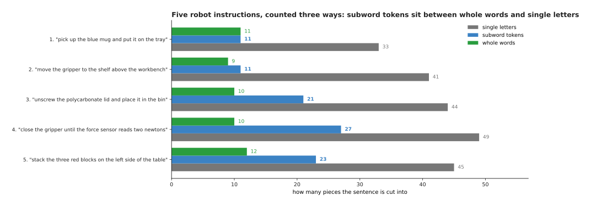

For every one of the five instructions, the subword count sits between the word
count and the letter count.

The first instruction has eleven words and eleven tokens, because every word in
it is common. The fourth instruction has ten words and twenty-seven tokens,
because it contains six words that the training text never used: "until",
"force", "sensor", "reads", "two" and "newtons". Across all five instructions
there are 52 words, 93 tokens and 212 letters, which is 1.79 tokens for every
word. The next section explains why the pieces are chosen in this way, rather
than in either of the two obvious alternative ways.

---

## 2. Why pieces, and not whole words or single letters

Subword pieces look like a strange compromise, so this section measures what
the two simpler choices would cost. The first choice is to give every whole
word its own token. The second choice is to give every single letter its own
token.

The next picture splits one instruction in all three ways. Each row is one way
of splitting, and the count at the end of a row is how many tokens that way
produces.

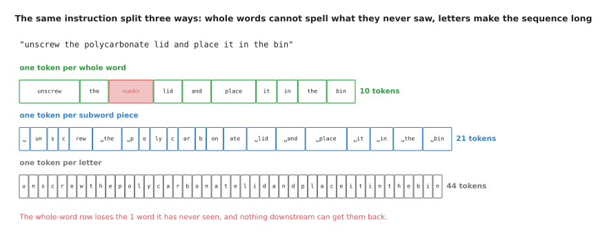

The same instruction is split three ways, and the whole-word row loses the one
word that the tokeniser has never seen.

A whole-word vocabulary gives the shortest sequence, which is ten tokens here,
and that is its only advantage. The cost is shown by the red box. The word
"polycarbonate" is not in the vocabulary, so the tokeniser has nothing to give
the model except a single "unknown" token. Every other unseen word becomes that
same "unknown" token. The model therefore cannot tell a polycarbonate lid from
a titanium one, and it cannot spell either word back out, because the
information was thrown away before the model ever ran. Robot work is full of
part names and measurements, so unseen words appear constantly.

Single letters have the opposite problem. A letter vocabulary never fails,
because every word is made of letters that the vocabulary already holds. The
sequence, though, is more than four times as long: 44 tokens instead of 10.
Length is expensive for a transformer. The attention step
described in [Attention](../06_the-transformer/01_attention.md) compares every
token with every other token, so doubling the length makes that step about four
times as much work.

Subword pieces combine the advantage of each choice. Common words stay whole,
and anything unusual is spelled from smaller pieces. How short the sequence
becomes then depends on how many pieces the vocabulary holds, and the next
picture measures that.

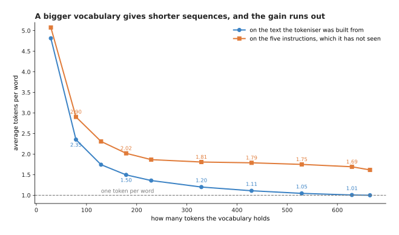

A bigger vocabulary gives shorter sequences, and most of the gain has already
been collected by about 200 tokens.

With an alphabet alone, which is 29 tokens in all, it takes 4.81 tokens to
write the average word. That falls to 1.74 at a vocabulary of 129 tokens, to
1.20 at 329 tokens, and to exactly 1.00 at 665 tokens, where no further merging
is possible. The fall from 4.81 to 1.00 is a fall of 3.81, and 3.46 of that has
already happened by 229 tokens, which is about nine tenths of the whole gain.

So the gains become small quickly. Meanwhile the embedding table described in
the next section grows in direct proportion to the vocabulary. Real models
balance those two costs against each other. A common vocabulary size today
is between about 30,000 and 150,000 pieces, and a few models use more than
250,000.

The way the pieces are chosen is called **byte pair encoding**, and the method
is simpler than the name. The tokeniser starts with every word written out as
single characters. It then counts every pair of neighbouring pieces across the
whole training text. It joins the most common pair everywhere that pair
appears, which adds one new piece to the vocabulary. It then repeats the count
and the join, so each round adds exactly one piece.

The table below lists the first ten pairs that this tokeniser joined. Read each
row as one round: the rank says which round it was, the pair is what was
joined, the new token is the result, and the last column is how often that pair
appeared when it was chosen.

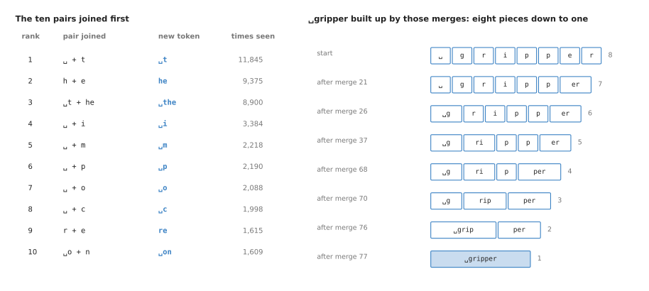

The pairs are joined in order of how often they appear, so the most common pair
is joined first.

The first pair joined is a space and the letter "t", which appeared 11,845
times. The second joins "h" and "e" into "he", which appeared 9,375 times. The
third joins the results of the first two into the whole word "the", which
appeared 8,900 times.

Those merges are then applied, in the same order, to any word the tokeniser is
asked to cut. The next picture follows one word through that process. Each row
is the state of the word after one more merge has been applied, and the number
on the right is how many pieces are left.

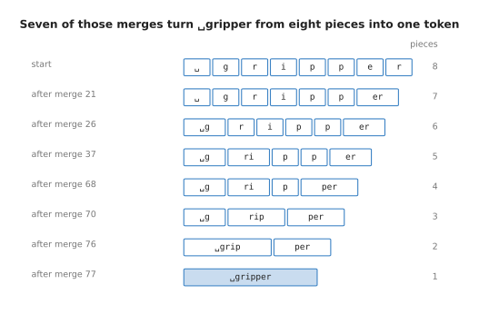

The word "gripper" starts as eight separate characters, and seven merges turn
it into a single token.

The merges that do this work are the ones numbered 21, 26, 37, 68, 70, 76 and
77. Nothing in this process chooses meaningful units, because the only rule is
how often a pair appears next to each other. That is why "thermometer" is split
into "the", "r", "mo" and "meter", rather than into anything a person would
call parts of a word. Once the pieces exist, each piece needs numbers of its
own, and those numbers live in the embedding table.

---

## 3. The embedding table is a lookup

A token number such as 45 is a name, not a measurement. Giving it to a network
directly would be wrong, because 45 is not three times as much of anything as
15 is. What the model needs instead is a list of numbers for each token, and
those numbers must be ones the model can do arithmetic on. They are learned
during training, exactly like any other weight.

A **vector** is an ordered list of numbers. An **embedding** is the vector that
stands for one token. All of those vectors together, one row for each token,
make the **embedding table**.

The picture below shows ten rows of that table. Each row holds the token, its
number, and the six learned numbers for it.

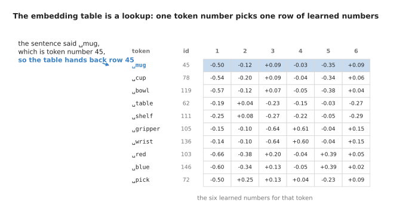

The full table has one row for each of the 429 tokens, and token number 45
picks out the shaded row.

The lookup is as simple as it sounds. The tokeniser says the word is token
number 45. The model goes to row 45. It takes the six numbers that are there.
The same token always gets the same row.

Those numbers start as small random values. Gradient descent then changes them,
along with every other weight in the model. By the end of training they are
whatever values made the model's predictions good. Libraries call this a layer
rather than a lookup, and the next picture shows why.

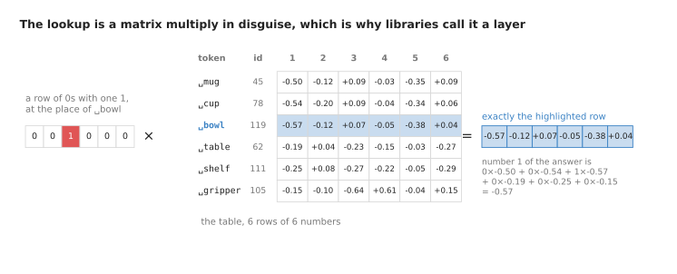

Picking row three is the same arithmetic as multiplying the table by a row of
zeros that has a single one in the third place.

Write the token as a row of zeros with a single 1 at its own place, and
multiply that row by the table. In every column, every term is zero except the
one that is multiplied by 1. The answer is therefore exactly the chosen row.
Column one is calculated as 0 times -0.50, plus 0 times -0.54, plus 1 times
-0.57, plus three more terms that are all zero, which gives -0.57.

Nobody does this multiplication in practice, because reading row 45 out of
memory is far cheaper. Writing the lookup this way is still useful, because it
explains why the table is trained exactly like any other matrix of weights. The
table is small on this page because the vocabulary is small. In a real model it
is not small, as the next picture shows.

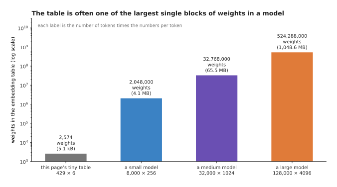

Each bar is one embedding table, and its label gives the weights it holds and
the memory those weights need when each weight is stored in two bytes.

The table on this page holds 429 times 6 weights, which is 2,574. A small model
with a vocabulary of 8,000 and 256 numbers a token holds 2,048,000 weights,
which is 4.1 megabytes. A medium model with a vocabulary of 32,000 and 1,024
numbers a token holds 32,768,000 weights, which is 65.5 megabytes. A large
model with a vocabulary of 128,000 and 4,096 numbers a token holds 524,288,000
weights, which is a little over a gigabyte. That last figure is often the
single largest block of weights in a model.

The width of a row matters for a second reason. It is also the width that runs
through every layer after the lookup, so it is chosen once and the rest of the
model follows it. What makes those numbers useful is not their size but where
they sit relative to each other, and the next section measures that.

---

## 4. Near each other means used in the same way

Training never tells the table what any word means. The rows are still
arranged in a way that is easy to describe. This section explains what that
arrangement is, and how it is measured.

Two rows count as similar when they point in the same direction. The measure of
that is called **cosine similarity**. To calculate it, multiply the two vectors
number by number, add up the products, and divide the total by the length of
each vector. A vector's length is the square root of the sum of its squares.
The answer runs from +1, which means the two point in exactly the same
direction, through 0, which means they are unrelated, down to -1, which means
they point in exactly opposite directions.

The next picture does that calculation twice. Read each column downwards: the
two rows are multiplied number by number, the six products are added, and the
total is divided by the two lengths.

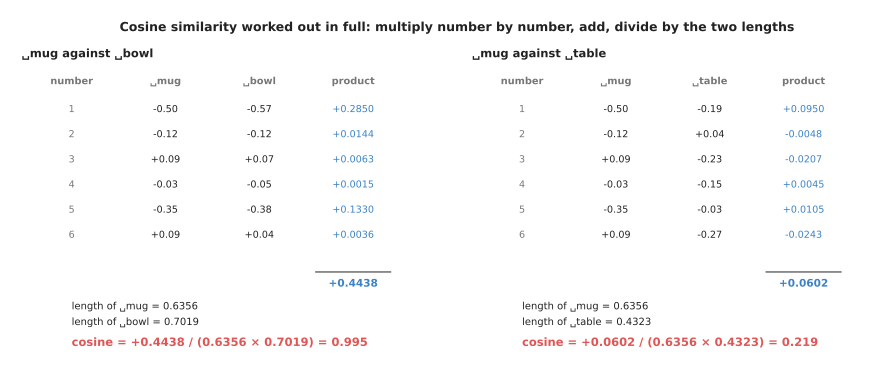

Cosine similarity is calculated in full twice, and it gives 0.995 for mug
against bowl and 0.219 for mug against table.

For mug and bowl the six products add up to 0.4438. The two lengths are 0.6356
and 0.7019, and dividing gives 0.995. For mug and table the products add up to
only 0.0602, and the same division gives 0.219. The arithmetic is identical
both times. The difference lies entirely in the rows, and those rows came from
counting which words appear near which other words in the invented
instructions.

Doing that calculation for every pair of tokens gives a picture of the whole
arrangement. In the picture below, each square is one pair, and a darker square
means a higher score. The squares along the diagonal compare a token with
itself, so they are all 1.00.

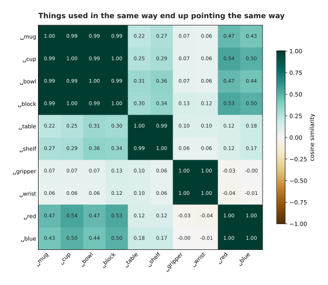

Every pair of ten tokens is scored, and four dark blocks appear where things
are used in the same way.

Mug, cup, bowl and block score 0.99 or 1.00 against each other. Table and shelf
score 0.99. Gripper and wrist score 1.00. Red and blue score 1.00. Mug against
gripper scores only 0.07. Nobody labelled any of these words. The blocks appear
only because words used in the same position in the same kinds of sentence
have the same neighbours.

The obvious alternative to cosine similarity is straight-line distance between
the ends of the two vectors, so it is worth saying why cosine is used instead.

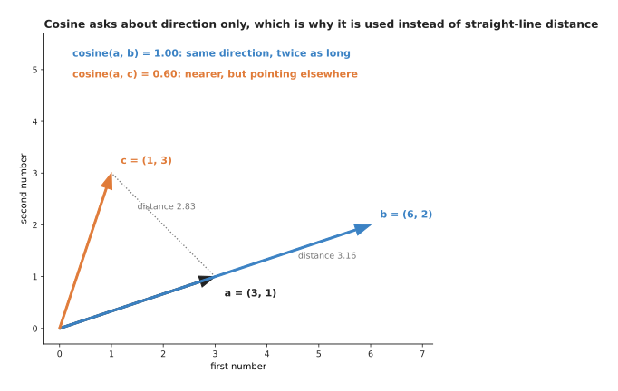

Arrow b points in exactly the same direction as a and scores 1.00, while arrow
c is nearer in a straight line and scores only 0.60.

Arrow b is twice as long as a and points in exactly the same direction, so
cosine gives 1.00 even though the distance between the two tips is 3.16. Arrow
c ends only 2.83 away, and it scores 0.60, because it points somewhere else.

In an embedding table, the length of a row tends to follow how often that token
appears, rather than what the token is used for. Throwing the length away and
keeping only the direction is therefore what makes the measure say something
about the token itself.

Asking which rows are nearest to a given row is the usual way to inspect a
trained table. The next picture asks that question four times. Each small chart
is one query token, and the bars are the five tokens nearest to it.

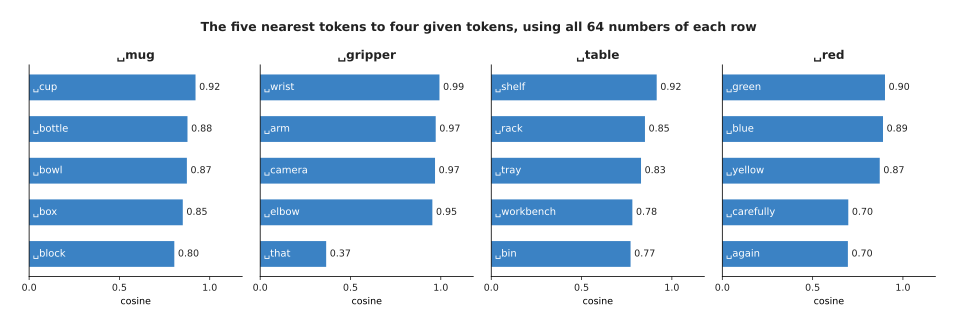

The five nearest tokens to each of four given tokens, found using all 64
numbers of a row rather than only the six that fit in a picture.

The tokens nearest to "mug" are cup at 0.92, bottle at 0.88, bowl at 0.87 and
box at 0.85, and all of those are things an arm picks up. The tokens nearest to
"gripper" are wrist at 0.99, arm at 0.97, camera at 0.97 and elbow at 0.95, and
all of those are parts of the robot. After elbow the list falls to 0.37,
because the text holds only four such words. The tokens nearest to "red" are
green, blue and yellow, and then "carefully" at 0.70. That last one is a
reminder that the grouping follows sentence position rather than meaning.

Everything in this section treats the tokens as an unordered collection. That
is exactly the problem the next section fixes.

---

## 5. Telling the model what order the tokens came in

Having a row for each token is not yet enough. The attention step that follows
takes the tokens as a set. It compares every token with every other token, and
it does not care which token came first. That claim is easy to show rather than
simply assert.

The next picture takes two sentences made of the same six tokens in a different
order, and adds up the six rows of each.

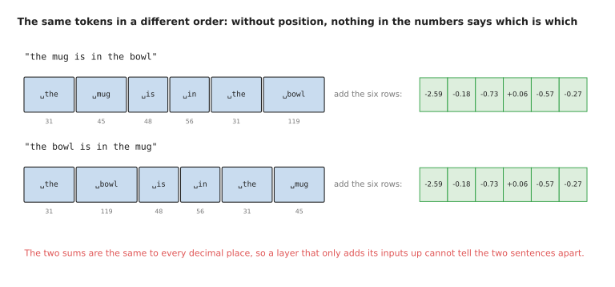

"The mug is in the bowl" and "the bowl is in the mug" are the same six tokens,
so adding their rows gives exactly the same six numbers.

Both sentences become the tokens for "the", "mug", "is", "in", "the" and
"bowl". Adding the six rows gives -2.59, -0.18, -0.73, +0.06, -0.57 and -0.27
in both cases, to every decimal place, because addition does not care about
order. A robot told to put the mug in the bowl would therefore do the same
thing as a robot told to put the bowl in the mug. The order has to be put into
the numbers deliberately, and anything that does this is called a **positional
encoding**.

The most direct method is to keep a second table. This table has one row for
each place in the sentence, rather than one row for each token. It is learned
during training, exactly like the first table. The row for the place is then
added to the row for the token.

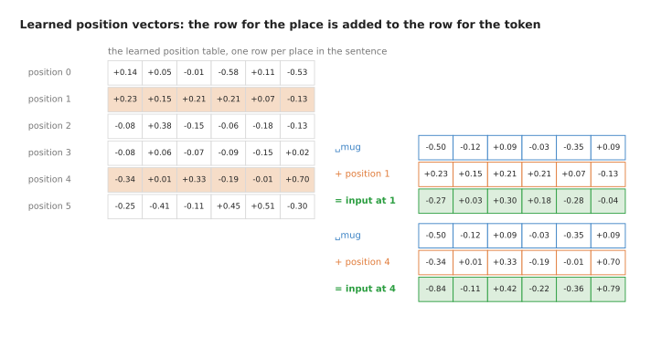

The same token at two different places in the sentence becomes two different
lists of numbers, once the position row has been added.

The token for "mug" is -0.50, -0.12, +0.09, -0.03, -0.35, +0.09 wherever it
appears. At position 1 it becomes -0.27, +0.03, +0.30, +0.18, -0.28, -0.04. At
position 4 it becomes -0.84, -0.11, +0.42, -0.22, -0.36, +0.79. The cosine
similarity between those two results is only 0.554, so the model can now tell
the two apart.

This method costs two things. First, the table has a fixed number of rows, so a
sentence longer than the table has places for cannot be handled at all. Second,
the row for a late place is trained by very little text, because only long
sentences reach that place. The next picture measures the second cost on this
page's 3,200 instructions.

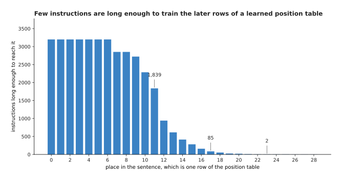

Every instruction trains the rows for the early places, and almost none of them
trains the rows for the late places.

The 3,200 instructions are between 7 and 29 tokens long, and 11.74 tokens long
on average. Places 0 to 6 are reached by all 3,200 of them. Place 11 is reached
by 1,839 of them, which is 57.5 per cent. Place 17 is reached by 85 of them,
which is 2.7 per cent. Place 23 is reached by 2 of them. A row that has been
trained twice is not a trained row, so this method becomes unreliable exactly
where sentences become long.

The method that almost every current model uses instead is called **rotary
position embedding**, often shortened to **RoPE**. It turns the numbers instead
of adding to them. The row is taken two numbers at a time. Each pair is treated
as a point on a flat sheet. That point is then turned about the origin by an
angle, and the angle grows in proportion to the place in the sentence. Each
pair is given its own turning rate, so some pairs turn quickly and others
barely move.

The next picture draws three pairs of the same token. Each circle is one pair,
and the six arrows inside a circle are the six places 0 to 5.

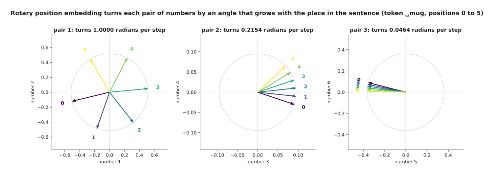

The same token is drawn at positions 0 to 5. Its first pair of numbers turns
1.0000 radians at each step, its second pair turns 0.2154 radians, and its
third pair turns 0.0464 radians.

The first pair of the row for "mug" starts at (-0.500, -0.120) at position 0.
By position 3 it has become (+0.512, +0.048), which is the same point turned
three radians round the circle. The turning rates here were made large on
purpose, so that the movement is visible over six positions. A real model uses
far smaller rates, so its slowest pairs have barely turned even after thousands
of positions.

Turning has one property that adding does not have. Turning a pair of numbers
never changes how far that pair is from the origin, so the length of the whole
row stays the same. The next picture measures that length at ten places, under
both methods.

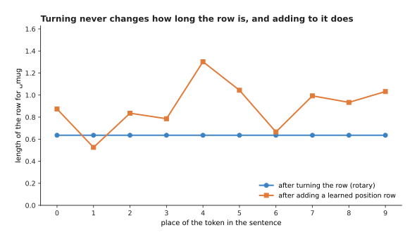

Turning leaves the length of the row exactly as it was, and adding a position
row changes it at every place.

The row for "mug" is 0.6356 long. After turning it is 0.6356 long at every one
of the ten places, to every decimal place the script prints. After a learned
position row is added, the length moves between 0.5255 and 1.3024. A length
that changes with the place means the size of the numbers entering the next
layer changes with the place too, and keeping that size steady is one of the
things that makes training behave, as [Normalisation and
stability](../04_making-training-work/02_normalisation-and-stability.md)
explains.

The main reason to prefer turning over adding, however, is that it changes what
attention measures. The next picture multiplies one turned row with
another and adds the products, which is the arithmetic inside attention. Each
row of the table is one pair of places with the same gap of three between them.

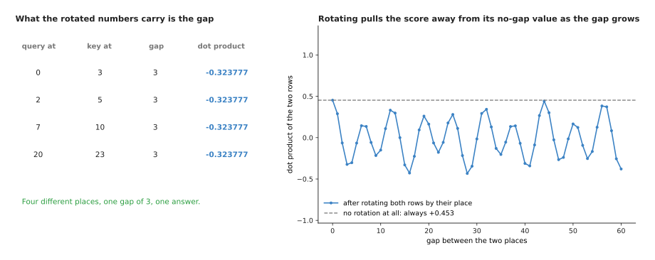

Four different pairs of places with the same gap give exactly the same answer,
because turning both rows leaves only the difference between their two angles.

When one turned row is multiplied with another and the products are added, the
two angles only ever appear as their difference. The answer therefore depends
on how far apart the two tokens are, and not on where either of them sits. One
row at place 0 multiplied with another row at place 3 gives -0.323777. Places 2
and 5 give the same. So do places 7 and 10, and places 20 and 23. Attention
calls those two rows the query and the key, and
[Attention](../06_the-transformer/01_attention.md) explains what each one is
for. Without any turning the
answer is +0.453112 whatever the gap, because nothing in the numbers mentions
the places at all.

That property is what lets rotary position embedding work on sentences longer
than anything seen in training. There is no table of positions that a long
sentence can exceed, and a gap of three means the same thing at position 20,000 as it does
at position 3. The cost is that the method only applies inside attention, on
the query and key rows. It is therefore part of that step, rather than
something you can do once at the input and then forget.

---

## 6. What the picture of the geometry leaves out

Everything so far has described the table as a space with directions in it.
That description is useful, and it is also drawn in a misleading way almost
everywhere. This section says plainly what is true about it and what is not.

The first thing to be careful about is the flat scatter plot of words that
appears in every talk on this subject. A scatter plot has two directions, and a
row of this table has 64 numbers, so the plot has to choose two directions to
look along and throw the rest away. The next picture makes that choice twice,
with the same twelve rows.

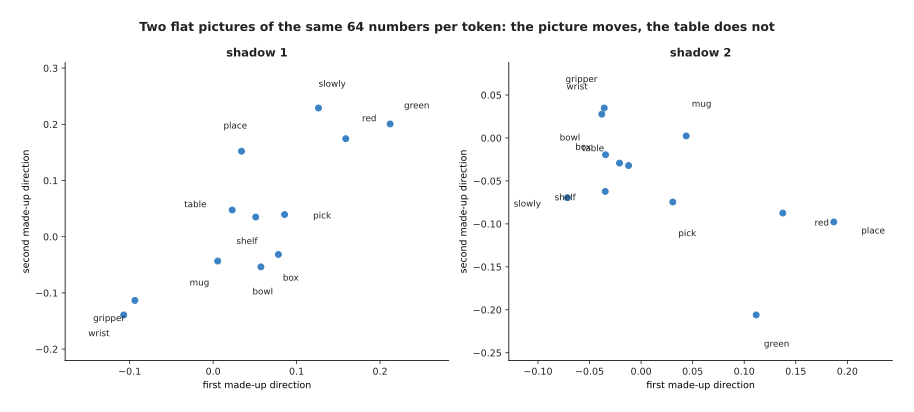

The same twelve rows of 64 numbers are flattened onto two different pairs of
directions, so the picture changes completely while the table has not changed
at all.

In the first plot the distance from mug to bowl is 0.053, and the distance from
mug to gripper is 0.121, so mug looks much nearer to bowl. In the second plot
those distances become 0.081 and 0.086, which are nearly equal. Neither plot is
wrong, and neither is the truth. The arrangement is the 64 numbers, and the
plot is only a choice of two directions to look along. In a real model each row
holds a few thousand numbers, so the loss is greater still.

How much is lost in that flattening can be measured rather than guessed. The
next picture plots every pair of tokens twice. The horizontal position of a dot
is the real cosine similarity, using all 64 numbers. The vertical position is
the cosine similarity after most of the numbers have been thrown away. A dot on
the dashed line means the two agree.

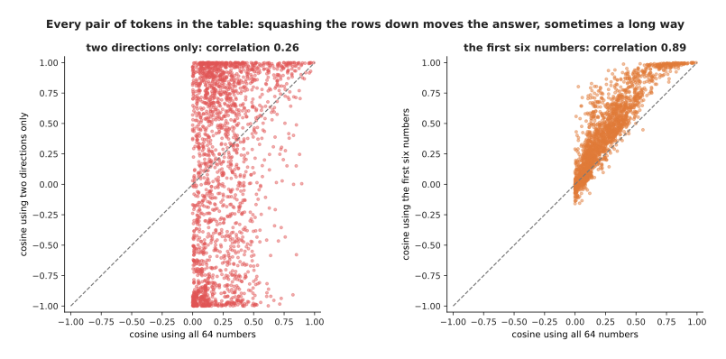

All 2,016 pairs of tokens in the table are drawn, which compares the real
cosine with the cosine you get after throwing most of the numbers away.

Flattening to two directions and then measuring cosine tracks the real answer
with a correlation of only 0.26, and the worst pair is wrong by 1.73. The scale
runs from -1 to +1, so an error of 1.73 means the picture reverses the
relationship completely. Keeping the first six numbers does better, with a
correlation of 0.89, and even there the worst pair is wrong by 0.78. That is
why section 4's scores for mug, cup and bowl were all 0.99 using six numbers,
and spread out to 0.92 and 0.87 using all 64.

The second thing to be careful about is the idea that a row holds the meaning
of a word.

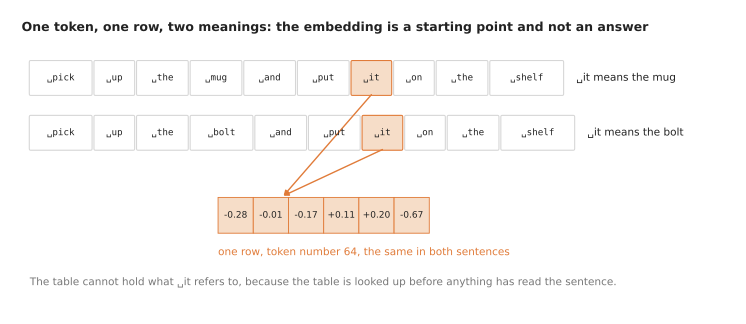

The token "it" has exactly one row in the table, and that row is the same
whether "it" means the mug or the bolt.

The lookup happens before anything has read the sentence, so the table cannot
possibly hold what "it" refers to. The same is true of every word that has more
than one sense. What the row holds is a starting point that is good on average
across all the uses of that token. The work of making it specific to this
sentence is done afterwards, by the attention layers, which mix each token's
numbers with the numbers of the tokens around it. By the middle of a trained
model, the numbers where "it" sits are nothing like the row that was looked up.
That is the intended behaviour and not a fault.

The third thing to be careful about is the idea that each direction in the
table stands for one property. There are far more properties worth
representing than there are numbers in a row, so several properties have to
share each direction. That sharing is possible because directions do not have
to be exactly separate to be useful, and the next picture measures how much
sharing 64 numbers allow.

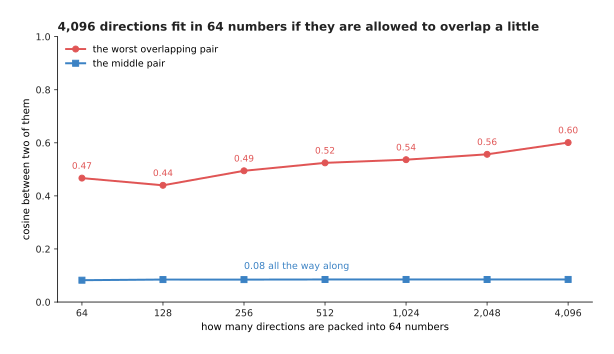

Thousands of directions fit into 64 numbers, as long as they are allowed to
overlap a little.

Only 64 directions can be exactly separate in 64 numbers, which means a cosine
of 0 between every pair. If a small overlap is allowed, far more fit. With
4,096 random directions packed into 64 numbers, the middle pair still has a
cosine of 0.08, and even the worst pair has a cosine of 0.60. As the count
rises from 64 directions to 4,096, the middle pair does not move at all, and
the worst pair stays between 0.44 and 0.60.

Because properties share directions this way, a single direction read off a
trained model usually turns out to mean several things at once. The next
picture takes one direction of this page's table and lists the tokens that
reach furthest along it in each sense.

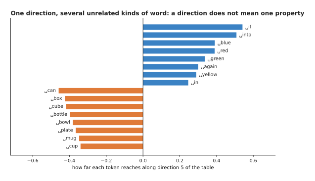

One direction of the table mixes grammar words with colour words at one end,
and holds containers at the other end.

At the positive end of this direction sit "if" at +0.54, "into" at +0.51,
"blue" at +0.39, "red" at +0.39, "green" at +0.34 and "again" at +0.30. Those
are not one kind of word. At the negative end sit "can" at -0.46, "box" at
-0.42, "cube" at -0.42 and "bottle" at -0.40, which are containers. So this one
direction is carrying at least two unrelated distinctions, and reading it as
"the colour direction" would be wrong.

The honest summary is this. The table is a learned convenience. It puts tokens
that are used alike in similar places, which is genuinely useful. The flat
pictures people draw of it are shadows of something that nobody can see
directly.

---

## 7. Where to read next

- [Pictures, sound and robot states](02_pictures-sound-and-robot-states.md) is
  the next page, and it does this same job for photos, depth pictures, point
  clouds, sound and the arm's own readings.
- [Attention](../06_the-transformer/01_attention.md) is where these tokens are
  actually used, and where section 5's rotary position embedding is applied.
- [A transformer block](../06_the-transformer/02_a-transformer-block.md) shows
  how a stack of such blocks turns the looked-up rows into something that
  depends on the sentence.
- [Training and running a
  transformer](../06_the-transformer/03_training-and-running-a-transformer.md)
  explains next-token prediction, the job that gives the table its numbers.
- [Language models](../../07_learned-models/07_language-models/01_overview.md)
  is the catalogue of real language models used on robot arms.
- [Vision-language
  models](../../07_learned-models/07_language-models/02_most-used/02_vision-language-models.md)
  covers models that read a picture and a sentence together, which need both
  this page and the next one.

---

## 8. Using it in Python

Section 1 cut a sentence into eleven tokens. Section 3 looked those tokens up
in a table of 429 rows of 6 numbers. Section 4 measured two rows against each
other. Section 5 turned a pair of numbers by an angle. The code below does all
four, on the exact numbers this page printed, so you can check every value
against the pictures above.

```python
import torch
from torch import nn

# Section 3: the embedding table, as a layer. 429 tokens, 6 numbers each.
table = nn.Embedding(num_embeddings=429, embedding_dim=6)
print(table.weight.shape)                           # torch.Size([429, 6])
print(sum(p.numel() for p in table.parameters()))   # 2574

# Section 1: the tokeniser has already turned the sentence into these numbers.
ids = torch.tensor([[72, 73, 31, 146, 45, 51, 69, 64, 38, 31, 121]])
print(table(ids).shape)                             # torch.Size([1, 11, 6])

# Section 4: cosine similarity, on the rows printed in section 3.
mug   = torch.tensor([-0.50, -0.12,  0.09, -0.03, -0.35,  0.09])
bowl  = torch.tensor([-0.57, -0.12,  0.07, -0.05, -0.38,  0.04])
table_row = torch.tensor([-0.19,  0.04, -0.23, -0.15, -0.03, -0.27])
print(torch.cosine_similarity(mug, bowl,      dim=0))   # tensor(0.9947)
print(torch.cosine_similarity(mug, table_row, dim=0))   # tensor(0.2191)

# Section 5: rotary position embedding, on the first pair of numbers.
def turn(pair, place, rate):
    angle = place * rate
    c, s = torch.cos(angle), torch.sin(angle)
    return torch.stack([pair[0] * c - pair[1] * s, pair[0] * s + pair[1] * c])

pair = mug[:2]
print(turn(pair, torch.tensor(0.0), torch.tensor(1.0)))  # tensor([-0.5000, -0.1200])
print(turn(pair, torch.tensor(3.0), torch.tensor(1.0)))  # tensor([0.5119, 0.0482])
```

The library gives you the table, its random starting values, its gradients, and
a lookup that handles a whole batch of sentences at once. It does not give you
the tokeniser, because a tokeniser belongs to one particular model. The
vocabulary, the merge list and the numbering were all fixed when that model was
trained. Pairing a trained model with a different tokeniser therefore gives
nonsense, because row 45 would then stand for a different piece of text.

In practice you load the tokeniser that came with the model. In Hugging Face's
`transformers` package that is `AutoTokenizer.from_pretrained(name)`. You then
call it on your text to get the numbers that go into `ids` above.

That one choice settles most of the other decisions. A pretrained model fixes
the vocabulary size, the width of a row and the kind of positional encoding,
and changing any of them means training from the beginning again. The decision
that stays yours is what text you put into the tokeniser. Text that is unlike
anything the tokeniser was built from is cut into far more tokens than you
expect, and those extra tokens cost time and context on every call. It is
therefore worth measuring the token count of the text your robot will really
produce, rather than assuming it matches the count of words.
