# Pictures, sound and robot states

The page before this one, [Tokens and
embeddings](01_tokens-and-embeddings.md), showed how a sentence is cut into
tokens and how each token is turned into a row of learned numbers. That was the
easy case, because text is already made of separate pieces that a tokeniser can
count. This page does the same job for everything else a robot arm has: the
colour camera, the depth camera, the point cloud, the microphone, the arm's own
joint readings, and the numbers the model gives back when it decides what to
do.

It answers three questions for each of those. What exactly are the numbers?
What has to be done to them before a network can take them? And what goes wrong
if that is skipped? The last matters most in the final section, which is about
the numbers a policy outputs, because that is where robot learning fails
quietly: the training run finishes, the loss falls, and the arm still does not
move properly. You need the page before this one for the words token, embedding
and vector, and [Normalisation and
stability](../04_making-training-work/02_normalisation-and-stability.md) for
why inputs are scaled at all.

The pictures, the depth frame, the sound and the arm readings here are
simulated, because a book cannot carry a real camera, and the seeds are written
in
[`turning_the_world_into_numbers.py`](../../diagrams/turning_the_world_into_numbers.py).
The arithmetic done to them is real, because the projection from depth to
positions, the frequency analysis of the sound, the forward kinematics of the
arm, the losses and the small training runs are all worked out in full and
printed by that script.

## Contents

1. [A colour photo is three grids of numbers](#1-a-colour-photo-is-three-grids-of-numbers)
2. [Cutting a photo into patches](#2-cutting-a-photo-into-patches)
3. [Depth pictures and point clouds](#3-depth-pictures-and-point-clouds)
4. [Sound becomes a picture of pitch over time](#4-sound-becomes-a-picture-of-pitch-over-time)
5. [What the arm knows about its own body](#5-what-the-arm-knows-about-its-own-body)
6. [The action space, and why every channel must be scaled](#6-the-action-space-and-why-every-channel-must-be-scaled)
7. [Where to read next](#7-where-to-read-next)
8. [Using it in Python](#8-using-it-in-python)

---

## 1. A colour photo is three grids of numbers

Text needed a tokeniser because letters are not numbers, but a photo needs no
such step, since a camera already produces numbers. A colour photo is three
grids of the same height and width, one holding how much red each pixel got,
one how much green and one how much blue, and each of those grids is called a
**channel**. In an ordinary photo every value in every channel is a whole
number from 0, meaning none of that colour, to 255, meaning as much as the
sensor can record.

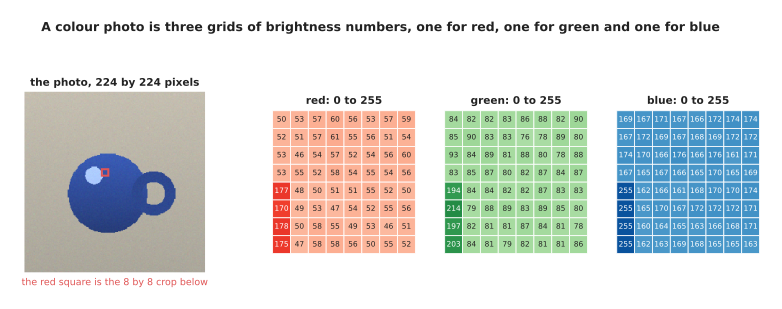

An eight by eight corner of a simulated photo is written out as the three grids of whole numbers that the camera actually produces.

Over that small square the red channel averages 61.1, the green 91.1 and the
blue 173.5, which is what a blue surface looks like as numbers. The whole photo
is 224 rows by 224 columns by 3 channels, so it is 150,528 numbers, and a
network must take exactly that many every time, which is why photos are resized
to a fixed height and width first. Those numbers are not fed in as they are:
they are divided by 255 so that they run from 0 to 1, and then the average of
the training pictures is subtracted from each channel and the result divided by
that channel's spread.

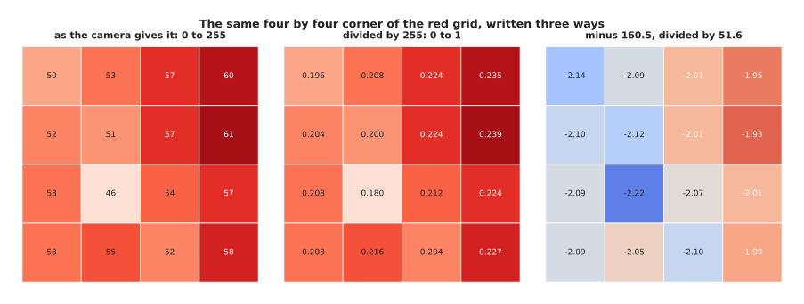

One corner of the red channel is shown at each stage of the scaling, and it ends as numbers that sit a little either side of zero.

The first row of that corner is 50, 53, 57 and 60 as the camera gives it, 0.196,
0.208, 0.224 and 0.235 after dividing by 255, and -2.14, -2.09, -2.01 and -1.95
after taking off the whole-photo average of 160.5 and dividing by the spread of
51.6. All three rows hold exactly the same information, so it is fair to ask
why the last one is worth the trouble, and the answer is about how fast
training is allowed to go.

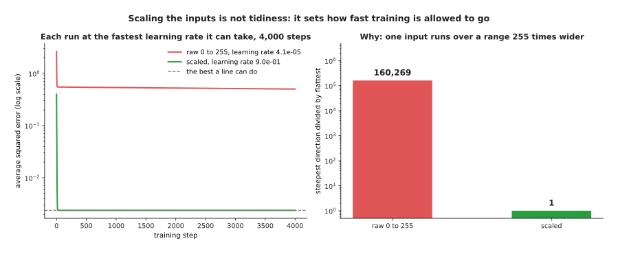

The same straight line is fitted twice to the same data, and the run on raw 0-to-255 values never reaches the answer that the scaled run reaches in a few steps.

Both runs fit two numbers to the same 400 examples, where one input runs from 0
to 255 and the other from 0 to 1. The raw run cannot use a learning rate above
4.1 in a hundred thousand without blowing up, because the wide input makes the
loss extremely steep in one direction, so after 4,000 steps its loss is still
0.5015 against a best possible 0.00238, while the scaled run can use a learning
rate of 0.9 and reaches 0.00238 within 300 steps. The bar chart gives the
reason: on raw values the loss is 160,269 times steeper in its steepest
direction than in its shallowest, and on scaled values that ratio is 1. Scaling
decides whether the learning rate that keeps one input stable leaves the others
able to learn at all. Next comes the question of how a grid of these values is
handed to a transformer, which only accepts a list of tokens.

---

## 2. Cutting a photo into patches

A transformer takes a list of tokens, as the page before this one described,
and a photo is a grid rather than a list, so something has to make the list. The
method every current vision model uses is to cut the picture into equal squares
and call each square one token. One of those squares is called a **patch**, and
16 pixels by 16 pixels is the usual size.

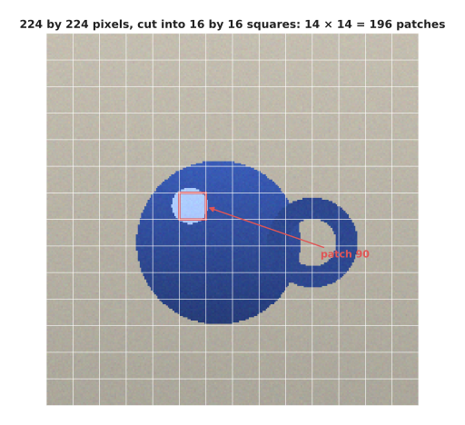

A 224 by 224 photo is cut into 16 by 16 squares, which gives 14 squares across and 14 down, so 196 patches in all.

Each patch holds 16 times 16 pixels in 3 channels, which is 768 numbers, and
those numbers become one token in exactly the sense the previous page used, as
one entry in the list that attention will compare against every other entry.
Turning a square of pixels into a row of numbers takes two steps.

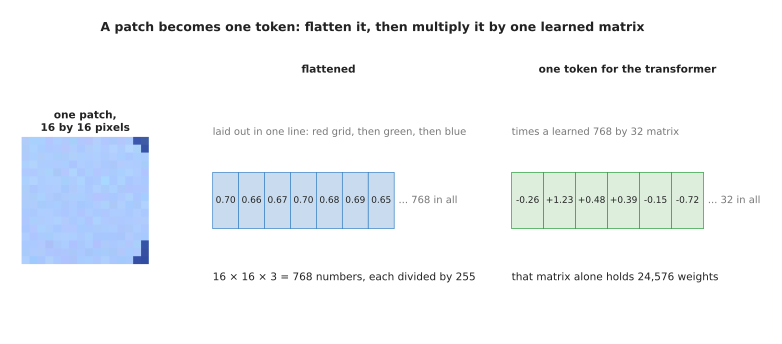

A patch is flattened into 768 numbers and then multiplied by one learned matrix, which turns it into a token the same width as every other token in the model.

The patch is first laid out in one line, with the red grid, then the green,
then the blue, and each value divided by 255, so the first eight numbers of
this patch are 0.698, 0.663, 0.667, 0.702, 0.678, 0.694, 0.651 and 0.702. That
line is then multiplied by one learned matrix, 768 numbers wide and as tall as
the model's token width, which here is 32, so the patch becomes -0.26, +1.23,
+0.48, +0.39, -0.15, -0.72 and 26 more. That matrix holds 24,576 weights and is
used on every patch of every picture, so the model learns one way of reading a
square of pixels rather than a different way for each position. From there on a
picture and a sentence are the same kind of thing to the model, which is why
the same transformer can read both. The size of the patch is the one real
decision, and it is more expensive than it looks.

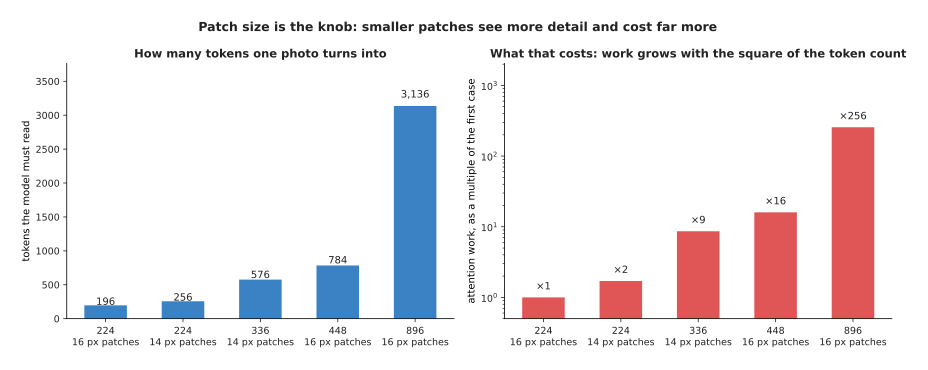

Five ways of cutting a photo are compared by the tokens each produces and by what each costs in attention work, measured against the first case.

A 224 by 224 picture in 16-pixel patches gives 196 tokens, and the same picture
in 14-pixel patches gives 256. A 448 by 448 picture in 16-pixel patches gives
784 tokens, and an 896 by 896 picture gives 3,136. Because attention compares
every token with every other one, the work follows the square of the token
count, so that last case costs 256 times as much attention work as the first.
Smaller patches and larger pictures let the model see a screw head or printed
text that it would otherwise miss, and they are why a model that can read a
label is far slower than one that can only name an object. The colour camera is
only one of the robot's sensors, though, and the depth camera produces numbers
of a different kind.

---

## 3. Depth pictures and point clouds

A colour camera says what each direction looks like, and a depth camera says
how far away it is, which is a different measurement that needs its own
treatment. A depth picture is a single grid, with one number per pixel, and
that number is a distance, usually in metres or in millimetres.

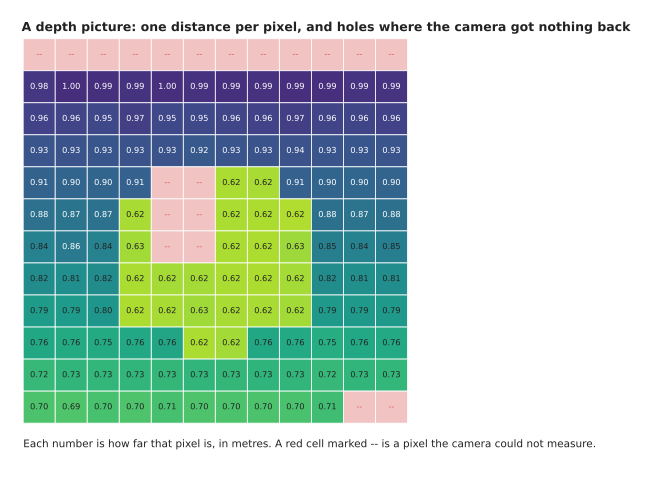

In this simulated depth frame the table runs from 1.00 m at the top to 0.70 m at the bottom, the mug sits at 0.62 m, and twenty pixels have no reading at all.

The distances here run from 0.616 m to 0.998 m, and the mug is a flat block of
0.62 m because its top is level. The red cells are the part that catches people
out, because 20 of the 144 pixels, which is 13.9 per cent, have no reading at
all. Depth cameras fail on shiny surfaces, on dark ones, on transparent ones,
at the edges of objects and beyond their own range, and they report that
failure with a special value, usually 0. Treating that value as a distance is
one of the commonest mistakes in robot perception, and its effect is easy to
measure.

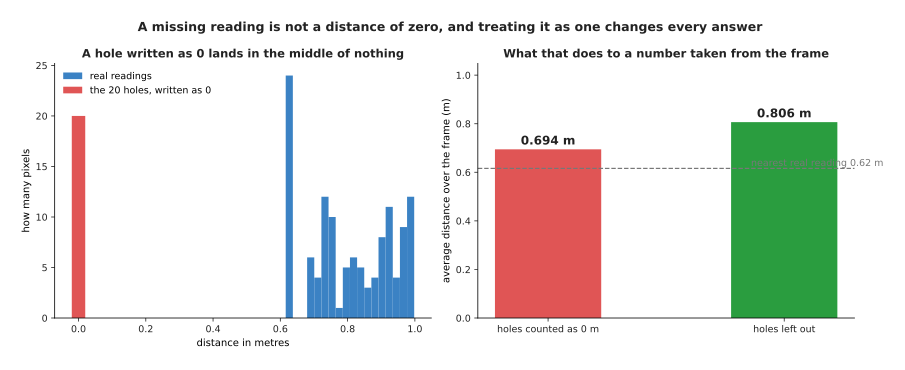

The holes sit at 0 m, far below any real reading, so counting them as distances drags the average of the frame down by 13.9 per cent.

The average distance over the frame is 0.806 m if the holes are left out and
0.694 m if they are counted as zero, so the second number is wrong by 11
centimetres on a frame where everything is less than a metre away. Worse, a 0
is nearer than the nearest real reading of 0.616 m, so a safety check that
stops the arm when something comes close reads every hole as an object touching
the camera. The fix is to carry a second grid holding 1 where the reading is
real and 0 where it is missing, and to give the network both, so that it can
learn what a missing reading means instead of being lied to. A depth picture is
also often turned into a different shape, by working out where in space each
pixel actually is, and the result is a **point cloud**, a list of positions
where each position is three numbers for left-and-right, up-and-down and
distance away.

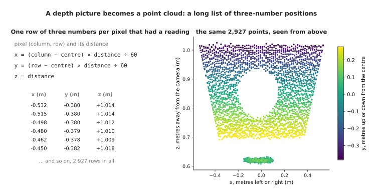

A 3,072-pixel depth frame becomes 2,927 three-number positions, because the 145 pixels that had no reading are simply left out.

The arithmetic is a single idea: a pixel far from the centre of the picture is
looking off at an angle, so the further away the thing it sees is, the further
to the side it must be, and multiplying how far the pixel is from the centre by
the distance and dividing by the camera's focal length in pixels gives the
sideways position in metres. The first row of this cloud is -0.532, -0.380 and
+1.014, and the list is 2,927 rows of 3 numbers. The important property of that
list is one it does not have, and a network that reads it has to be built
around the gap.

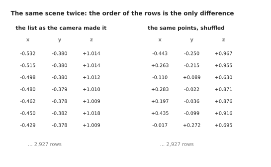

Shuffling the list changes nothing about the scene, so anything a network reads from it must give the same answer before and after.

The order of the rows carries no information, because it came from the order
the camera happened to scan its pixels in, and a different camera or a
different cropping would give a different order for the same scene. Averaging
every row gives +0.0032, -0.0135 and +0.8246 before the shuffle and exactly the
same three numbers after it, and taking the largest value in each column gives
+0.534, +0.277 and +1.025 both times. A fully connected layer reading the first
four rows laid end to end gives -3.010 before and -0.814 after, which is a
different answer to the same question. This is why networks for point clouds
are built out of steps that treat the list as a set, working on each point on
its own and then combining them with an average or a largest-value step, rather
than out of the layers used for grids.

---

## 4. Sound becomes a picture of pitch over time

The depth camera gave a grid and the point cloud gave a set, and a microphone
gives a third shape again, which is a single very long list. Sound is a
pressure in the air that rises and falls, and a microphone measures that
pressure many thousands of times a second, so half a second of sound at 16,000
readings a second is 8,000 numbers in a row.

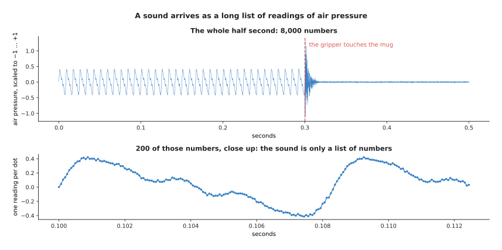

Half a second of simulated sound holds 8,000 readings, with the motor running until 0.30 seconds and a sharp knock when the gripper touches.

The readings run from -1.132 to +1.336 after being scaled, and the average size
of a reading is 0.2129 while the motor runs and 0.0209 after the knock. The
close-up shows what makes sound awkward, because nothing in those individual
numbers says anything useful: what a listener hears is the rate at which they
go up and down, and that rate is spread across hundreds of readings. So the
list is almost always turned into a grid first, by chopping it into short
overlapping windows and working out, for each window, how much of each rate of
rising and falling it contains. That rate is the pitch, measured in cycles a
second, and the resulting grid is called a **spectrogram**.

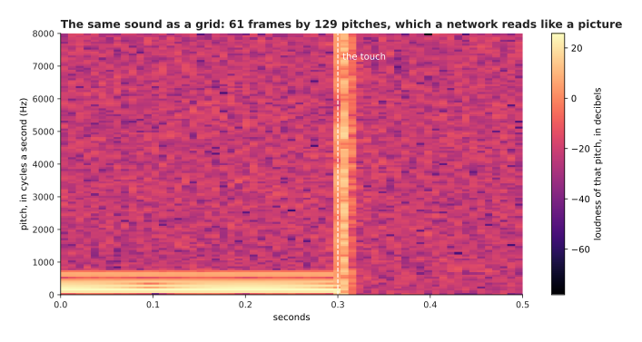

The same sound becomes a grid of 61 frames by 129 pitches, where the motor shows as steady lines and the knock as one bright column across every pitch.

Each window here is 256 readings, which is 16.0 milliseconds, and the windows
start 8.0 milliseconds apart, which gives 61 of them, each producing 129
numbers, one for each pitch from 0 up to 8,000 cycles a second in steps of 62.5.
The whole half second becomes 7,869 numbers arranged as a grid, which can then
be cut into patches and read by exactly the machinery of section 2, and that is
why a sound model and a vision model often share the same design. One more step
is needed before the grid is usable, and it is the same kind of step as scaling
a photo.

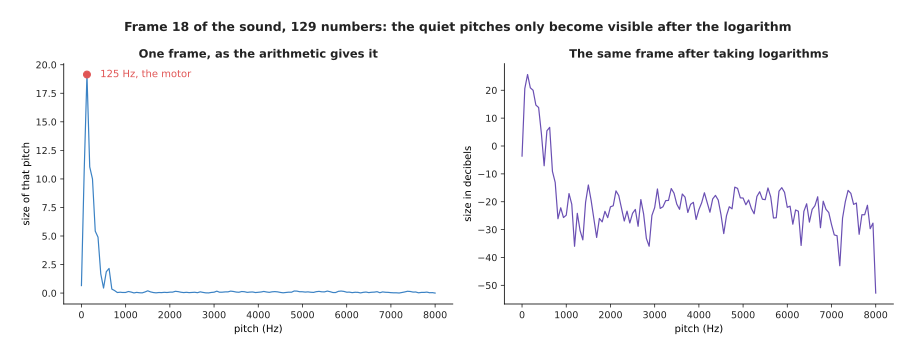

One frame of the sound is drawn twice, and the raw sizes hide everything except the loudest pitch until logarithms are taken.

In frame 18, which starts at 0.144 seconds, the loudest pitch is 125 cycles a
second at a size of 19.14, while the quietest is 0.00229, so the largest is
8,346 times the smallest. On a chart of the raw numbers everything except the
motor is flat against zero. After taking logarithms, which turns that range
into -52.8 to 25.6 decibels, the quieter pitches become visible, and more
importantly they become numbers a network can learn from rather than rounding
errors next to the loud ones. Ears work the same way, which is why decibels
exist at all. Having covered what the robot can see and hear, the next section
turns to what it knows about itself.

---

## 5. What the arm knows about its own body

Cameras and microphones tell the robot about the world, and the arm also has
sensors inside it that tell it about itself, which is a smaller and much more
reliable set of numbers. Knowing the position and movement of your own body is
called **proprioception**, and on an arm it means the angle of every joint, how
fast every joint is turning, how far the gripper is open and what force the
wrist is feeling.

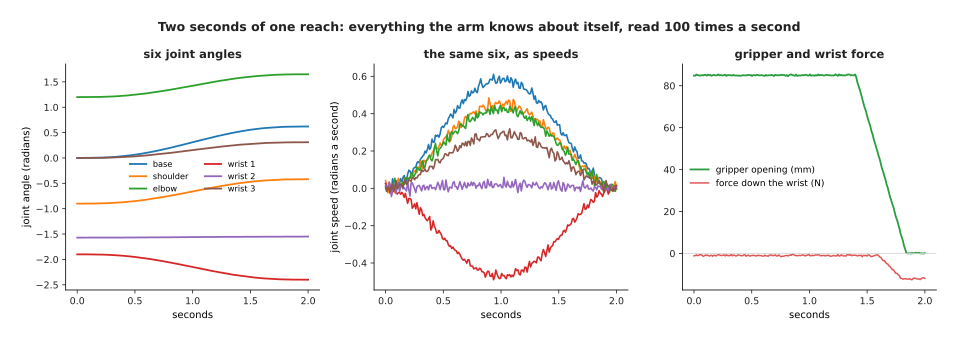

Two seconds of a simulated reach are recorded 100 times a second, with the gripper closing near the end and the wrist force rising as it grips.

Every one of those curves is 200 numbers, one each hundredth of a second. The
base joint turns from 0.000 to 0.620 radians and reaches 0.706 radians a second
at its fastest, the elbow turns from 1.201 to 1.650 radians, and the second
wrist joint barely moves at all, from -1.571 to -1.550, while the gripper runs
from 85 millimetres open down to closed and the downward force at the wrist
falls from about -1 newton to about -12 as the grip takes hold. A model is not
given the curves, though, but one moment at a time, as a single list of numbers
in a fixed order.

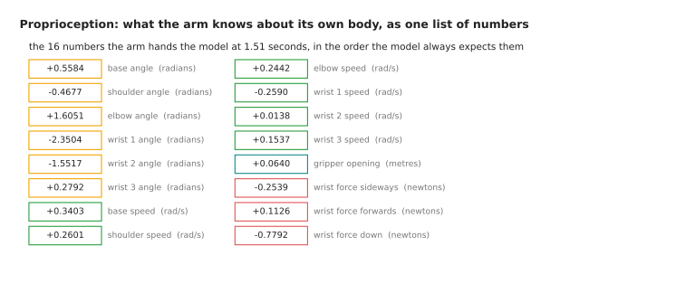

Everything the arm knows about itself at one instant arrives as sixteen numbers: six angles, six speeds, the gripper opening and three forces.

The order never changes, because the model learns which position means which
joint and has no other way of telling them apart, so swapping two channels
between training and running breaks the model silently. These sixteen numbers
are usually joined on to the tokens from the camera, either as one more token
of their own or by being added to every other token, and they cost almost
nothing next to a picture's 196. They do, however, need the same treatment that
section 1 gave the photo, for a sharper reason.

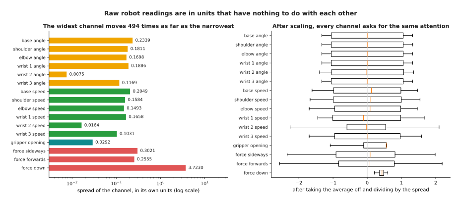

The sixteen channels in their own units differ by a factor of 494 in how far they move, and after scaling they all ask for the same amount of attention.

The downward force moves with a spread of 3.7230 newtons while the second wrist
joint moves with a spread of 0.0075 radians, so one channel is 494 times wider
than another. No amount of thinking makes a newton comparable with a radian, so
the only sensible thing is to take each channel's average off and divide by its
own spread, measured over the training set and then stored and reused unchanged
at run time. After that every channel sits at about the same size, and the
network decides for itself which ones matter instead of having the decision
made by the choice of units. The same argument applies with much greater force
to the numbers coming out of the model, which is the last section.

---

## 6. The action space, and why every channel must be scaled

Every section so far has been about numbers going into a model, and this one is
about the numbers coming out. The set of numbers a policy is allowed to output,
together with what each one means, is called the **action space**, and choosing
it quietly decides whether a robot learning project works. The trap is that the
numbers say nothing about what they mean, so the same output moves the arm in
four completely different ways depending on what the code receiving it does.

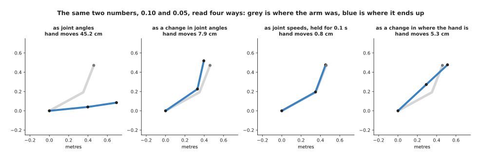

The same two numbers, 0.10 and 0.05, read four ways, move the hand anywhere from 0.8 centimetres to 45.2 centimetres.

Read as **joint angles**, the two numbers are where the joints should now be,
so the arm swings to 0.10 and 0.05 radians and the hand moves 45.2 centimetres.
Read as a **change in joint angles**, they are added to where the arm already
is and the hand moves 7.9 centimetres. Read as **joint speeds** held for a
tenth of a second, the hand moves 0.8 centimetres. Read as a **change in where
the hand is**, in metres, the hand moves 5.3 centimetres in a straight line
while the controller works out the joint angles that achieve it. All four are
in use on real robots and none of them is written down in the numbers, so the
agreement between the model and the arm has to be made deliberately. The choice
also changes how hard the learning problem is.

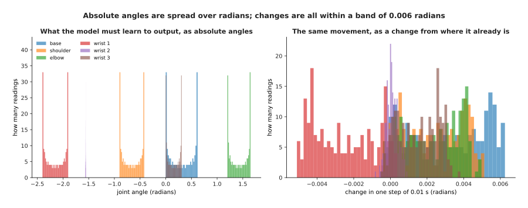

The same movement is written as absolute angles, which spread across three radians, and as changes, which all sit within 0.006 radians of zero.

As absolute angles, each joint sits in its own band, from -2.150 for the first
wrist joint to +1.425 for the elbow, so a model must produce six quite
different numbers and get each right in its own range. As changes, all six sit
near zero with spreads between 0.00031 and 0.00206 radians, and the largest
change in any hundredth of a second is 0.0063 radians. Changes are easier to
learn and transfer better between arms that start in different places, and what
they cost is that small errors add up, because nothing in the output ever says
where the arm should actually be. Whichever meaning is chosen, the channels end
up in different units, and leaving them that way does something severe to the
loss.

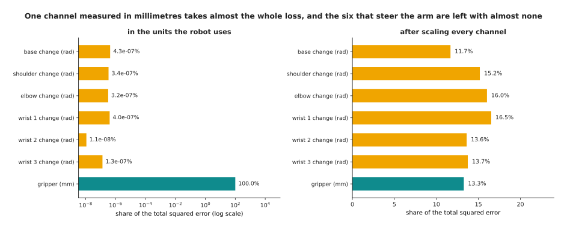

Seven action channels are each predicted equally badly relative to their own size, and the chart gives the share of the loss each one takes before and after scaling.

The six joint changes are in radians with spreads near 0.002, and the gripper
opening is in millimetres with a spread of 29.280, so one channel is 95,428
times wider than the narrowest of the others. If every channel is predicted
equally badly, to within 5 per cent of its own spread, then squaring the errors
makes the gripper channel 99.999998 per cent of the total squared error, and
the six channels that actually steer the arm share 0.0000016 per cent between
them. After each channel is divided by its own spread, the same seven errors
take between 11.68 and 16.53 per cent each, which is what a loss that cares
about all seven looks like.

A loss that ignores six channels trains a model that ignores them too, and the
size of that effect is worth seeing rather than assuming.

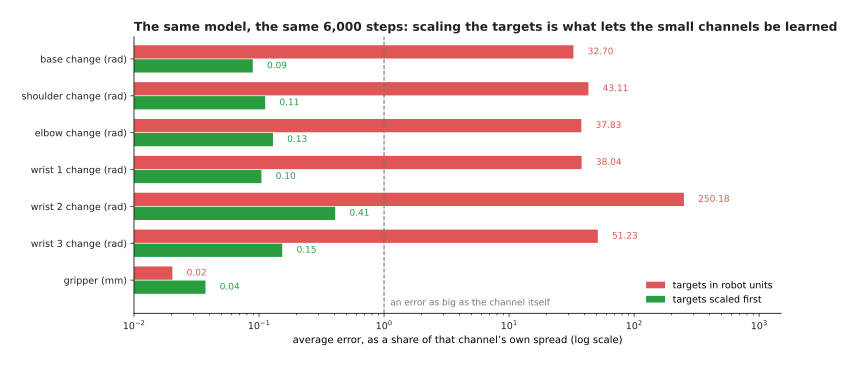

The same small network is trained twice for the same 6,000 steps, each run at its own best learning rate, and the run on raw targets gets the gripper right and the six joint channels hopelessly wrong.

Trained on targets in the robot's own units, the six joint channels end with
average errors between 32.70 and 250.18 times their own spread, which means the
model is not merely inaccurate but is outputting numbers of the wrong size
entirely, while the gripper channel ends at 0.02 of its spread and is learned
almost perfectly. Trained on scaled targets, the joint channels end between
0.09 and 0.41 and the gripper at 0.04. Nothing else differs between the two
runs. This failure is quiet, because the loss curve falls nicely in both cases
and the reported number looks fine, so the only way to catch it is to report
the error of each channel separately, in units of that channel's own spread,
and to look at all of them. When you scale actions, keep the averages and
spreads that you used, store them with the model, and apply exactly the same
ones when the model runs, because a model trained on scaled actions outputs
scaled actions and something has to turn them back into radians and millimetres
before they reach the arm.

---

## 7. Where to read next

- [Attention](../06_the-transformer/01_attention.md) is the next page, and it
  shows what the tokens built on this page and the last one are actually used
  for.
- [Vision backbones](../09_models-that-see/01_vision-backbones.md) follows the
  patches of section 2 through a whole vision transformer.
- [Depth and 3D](../09_models-that-see/04_depth-and-3d.md) takes the depth
  pictures and point clouds of section 3 much further.
- [Actions and
  observations](../../07_learned-models/06_movement-models/02_most-used/04_actions-and-observations.md)
  is the catalogue page on the action spaces real robot policies use.
- [Point cloud
  models](../../07_learned-models/04_3d-models/02_most-used/01_point-cloud-models.md)
  lists the real models that read the order-free lists of section 3.
- [Depth from
  pictures](../../07_learned-models/03_seeing-models/03_also-used/02_depth-from-pictures.md)
  covers the models that produce a depth picture from a colour one.

---

## 8. Using it in Python

Section 1 scaled a photo, section 2 cut it into 196 patches of 768 numbers, and
section 6 scaled an action vector channel by channel. The code below does all
three, and the comments say which section each part belongs to.

```python
import numpy as np
import torch

# Section 1: a colour photo is three grids, then scaled channel by channel.
rng = np.random.default_rng(0)
photo = rng.integers(0, 256, size=(3, 224, 224)).astype(float)
print(photo.shape, photo.size)                  # (3, 224, 224) 150528
scaled = photo / 255.0
scaled = ((scaled - scaled.mean(axis=(1, 2), keepdims=True))
          / scaled.std(axis=(1, 2), keepdims=True))
print(scaled.mean().round(6), scaled.std().round(6))        # -0.0 1.0

# Section 2: the same photo cut into 16 by 16 patches, each flattened.
grid = torch.from_numpy(photo).float()
patches = grid.unfold(1, 16, 16).unfold(2, 16, 16)          # 3 x 14 x 14 x 16 x 16
patches = patches.permute(1, 2, 0, 3, 4).reshape(-1, 3 * 16 * 16)
print(patches.shape)                                        # torch.Size([196, 768])
print(torch.nn.Linear(768, 32)(patches / 255.0).shape)      # torch.Size([196, 32])

# Section 6: six joint changes in radians and a gripper opening in millimetres.
actions = np.column_stack([rng.normal(0, 0.002, (200, 6)), rng.uniform(0, 85, 200)])
mean, std = actions.mean(0), actions.std(0)
error = rng.normal(0, 0.05 * std, actions.shape)   # every channel equally wrong
raw = (error ** 2).mean(0)
print((100 * raw / raw.sum()).round(4))   # [0. 0. 0. 0. 0. 0. 100.]
fair = ((error / std) ** 2).mean(0)
print((100 * fair / fair.sum()).round(1)) # [18.7 13.7 11.9 16.1 13. 12.8 13.9]
```

The library does the mechanical parts for you. `torchvision.transforms` has the
resize, the divide by 255 and the subtract-and-divide of section 1 as ready
pieces, `unfold` cuts the patches of section 2 in one line, and
`torch.nn.Linear` is the one learned matrix that turns each patch into a token.
None of these decides anything, because every one of them needs the numbers you
give it.

What you decide is the content of this page. You decide the picture size and
the patch size, which together set the token count and therefore most of the
cost, what a missing depth reading becomes and whether the network is told
which readings are missing, and which of section 6's four meanings your action
numbers carry. Above all you decide the averages and spreads used for scaling,
and you must work them out on the training set alone, store them beside the
model and apply the identical values when the model runs, because scaling one
way during training and another way afterwards is a fault that no amount of
further training will fix.
