# Pictures, sound and robot states

The page before this one, [Tokens and
embeddings](01_tokens-and-embeddings.md), showed how a sentence is cut into
tokens, and how each token is turned into a row of learned numbers. That was
the easy case, because text is already made of separate pieces that a tokeniser
can count. This page does the same job for everything else a robot arm has: the
colour camera, the depth camera, the point cloud, the microphone, the arm's own
joint readings, and the numbers the model gives back when it decides what to
do.

The page answers three questions for each of those. What exactly are the
numbers? What has to be done to them before a network can take them? What goes
wrong if that work is skipped? The third question matters most in the final
section, which is about the numbers a policy produces, because that is where
robot learning fails quietly. The training run finishes, the loss falls, and
the arm still does not move properly. By the end of this page you will be able
to look at any sensor on a robot and say what shape its numbers have, what
scaling they need, and what the usual mistake is. You need the page before this
one for the words token, embedding and vector. You need [Normalisation and
stability](../04_making-training-work/02_normalisation-and-stability.md) for
why inputs are scaled at all.

The pictures, the depth frame, the sound and the arm readings here are
simulated, because a book cannot carry a real camera. The seeds that produced
them are written in
[`turning_the_world_into_numbers.py`](../../diagrams/turning_the_world_into_numbers.py).
The arithmetic done to them is real. The projection from depth to positions,
the frequency analysis of the sound, the forward kinematics of the arm, the
losses and the small training runs are all calculated in full by that script,
which prints every number quoted below.

## Contents

1. [A colour photo is three grids of numbers](#1-a-colour-photo-is-three-grids-of-numbers)
2. [Cutting a photo into patches](#2-cutting-a-photo-into-patches)
3. [Depth pictures and point clouds](#3-depth-pictures-and-point-clouds)
4. [Sound becomes a picture of pitch over time](#4-sound-becomes-a-picture-of-pitch-over-time)
5. [What the arm knows about its own body](#5-what-the-arm-knows-about-its-own-body)
6. [The action space, and why every channel must be scaled](#6-the-action-space-and-why-every-channel-must-be-scaled)
7. [Where to read next](#7-where-to-read-next)
8. [Using it in Python](#8-using-it-in-python)

---

## 1. A colour photo is three grids of numbers

Text needed a tokeniser, because letters are not numbers. A photo needs no such
step, because a camera already produces numbers.

A colour photo is three grids of the same height and width. One grid holds how
much red each pixel received, one holds how much green, and one holds how much
blue. Each of those grids is called a **channel**. In an ordinary photo, every
value in every channel is a whole number from 0, which means none of that
colour, to 255, which means as much of it as the sensor can record.

The picture below shows a small square of a photo and the three grids of
numbers behind that square. Read each grid as a map of the same eight by eight
pixels, where darker shading means a larger number.


An eight by eight corner of a simulated photo, written out as the three grids
of whole numbers that the camera actually produces.

Over that small square, the red channel averages 61.1, the green channel
averages 91.1 and the blue channel averages 173.5. Those three numbers are what
a blue surface looks like when it is written as numbers.

The whole photo is 224 rows by 224 columns by 3 channels, which is 150,528
numbers. A network must receive exactly that many numbers every time, which is
why photos are resized to a fixed height and width before anything else
happens.

Those numbers are not given to the network as they are. First they are divided
by 255, so that they run from 0 to 1. Then the average brightness of the
training pictures is subtracted from each channel, and the result is divided by
that channel's spread. The spread here is the standard deviation, which is the
typical distance of a value from the average.

The picture below shows one corner of the red channel at each of those three
stages. The three grids hold the same information, written three ways.


One corner of the red channel at each stage of the scaling, ending at values
near -2, because this corner is much darker than the average of the photo.

The first row of that corner is 50, 53, 57 and 60 as the camera gives it. After
dividing by 255 it is 0.196, 0.208, 0.224 and 0.235. The average of the red
channel over the whole photo is 160.5, and its spread is 51.6. Subtracting that
average and dividing by that spread gives -2.14, -2.09, -2.01 and -1.95. The
order of the two steps does not matter, because dividing everything by 255
first and then standardising gives exactly the same answer.

Here the average and the spread are measured on this one photo. In a real
project they are measured once over the whole training set, and then stored and
reused unchanged.

All three grids hold exactly the same information, so it is fair to ask why the
last one is worth the trouble. The answer is about how fast training is allowed
to go, and it can be measured. The next picture fits the same straight line to
the same data twice. One run receives an input that runs from 0 to 255, and the
other receives the same input scaled. Each run uses the largest learning rate
it can take without the loss growing without limit.


The run on raw 0-to-255 values never reaches the answer that the scaled run
reaches in a few steps.

Both runs fit two numbers to the same 400 examples. One input runs from 0 to
255 and the other from 0 to 1. The raw run cannot use a learning rate above
0.000041 without the loss growing without limit. After 4,000 steps its loss is
still 0.5015, against a best possible loss of 0.00238. The scaled run can use a
learning rate of 0.9, and it reaches 0.00238 within 300 steps.

The reason for that difference can also be measured. A loss surface can be
steep in one direction and shallow in another. The learning rate has to be
small enough for the steepest direction, so a large difference between the two
forces every direction to move slowly.

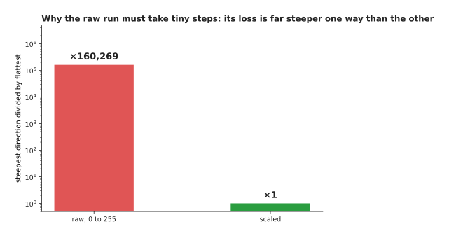

On raw values the loss is 160,269 times steeper in its steepest direction than
in its shallowest, and on scaled values that ratio is 1.

So scaling decides whether the learning rate that keeps one input stable still
leaves the other inputs able to learn. The next question is how a grid of these
values is given to a transformer, which only accepts a list of tokens.

---

## 2. Cutting a photo into patches

A transformer takes a list of tokens, as the page before this one described. A
photo is a grid and not a list, so something has to make the list. The method
every current vision model uses is to cut the picture into equal squares and
treat each square as one token. One of those squares is called a **patch**, and
16 pixels by 16 pixels is the usual size.


A 224 by 224 photo cut into 16 by 16 squares gives 14 squares across and 14
squares down, which is 196 patches in all.

Each patch holds 16 times 16 pixels in 3 channels, which is 768 numbers. Those
numbers become one token, in exactly the sense the previous page used: one
entry in the list that attention will compare against every other entry.
Turning a square of pixels into a row of numbers takes two steps, and the next
picture shows both.


A patch is flattened into 768 numbers and then multiplied by one learned
matrix, which turns it into a token of the same width as every other token in
the model.

The patch is first laid out in a single line. The red grid comes first, then
the green grid, then the blue grid, and each value is divided by 255. The first
eight numbers of this patch are therefore 0.698, 0.663, 0.667, 0.702, 0.678,
0.694, 0.651 and 0.702.

That line is then multiplied by one learned matrix. The matrix is 768 numbers
wide, and it is as tall as the model's token width, which is 32 in this
example. The patch therefore becomes 32 numbers, of which the first six are
-0.26, +1.23, +0.48, +0.39, -0.15 and -0.72. The matrix holds 24,576 weights,
and it is used on every patch of every picture, so the model learns one way of
reading a square of pixels rather than a different way for each position.

From this point onwards, a picture and a sentence are the same kind of thing to
the model, which is why the same transformer can read both. The size of the
patch is the one real decision here, and the next two pictures measure what it
costs. The first counts the tokens.

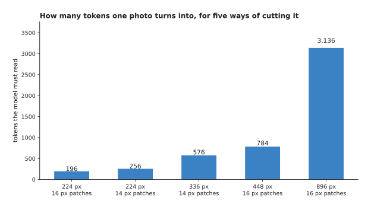

Five ways of cutting a photo, compared by how many tokens each one produces.

A 224 by 224 picture in 16-pixel patches gives 196 tokens. The same picture in
14-pixel patches gives 256. A 336 by 336 picture in 14-pixel patches gives 576.
A 448 by 448 picture in 16-pixel patches gives 784, and an 896 by 896 picture
gives 3,136.

The token count is not the cost, though. Attention compares every token with
every other token, so the work follows the square of the token count. The next
picture measures the same five cases that way, with the first case as the unit.

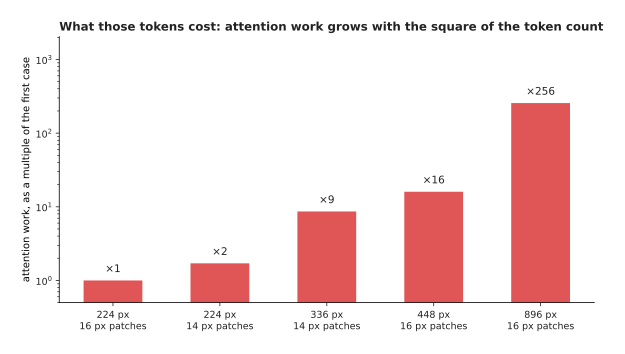

The last case costs 256 times as much attention work as the first, although it
holds only 16 times as many tokens.

Smaller patches and larger pictures let the model see a screw head or printed
text that it would otherwise miss. That is why a model that can read a label is
far slower than one that can only name an object. The colour camera is only one
of the robot's sensors, and the depth camera produces numbers of a different
kind.

---

## 3. Depth pictures and point clouds

A colour camera says what each direction looks like. A depth camera says how
far away it is, which is a different measurement and needs its own treatment. A
depth picture is a single grid with one number per pixel, and that number is a
distance, usually measured in metres or in millimetres.

In the picture below, each cell is one pixel and the number in it is the
distance to whatever that pixel sees. Darker cells are further away. The red
cells marked with two dashes are pixels that the camera could not measure.


In this simulated depth frame the table runs from about 0.99 m at the top to
about 0.70 m at the bottom, the mug sits at 0.62 m, and twenty pixels have no
reading at all.

The distances here run from 0.616 m to 0.998 m. The mug is a flat block of
0.62 m, because its top is level.

The red cells are the part that surprises people. 20 of the 144 pixels, which
is 13.9 per cent, have no reading at all. Depth cameras fail on shiny surfaces,
on dark surfaces, on transparent surfaces, at the edges of objects, and beyond
their own range. They report that failure with a special value, which is
usually 0.

Treating that special value as a distance is one of the commonest mistakes in
robot perception, and its effect is easy to measure. The next picture counts
how many pixels hold each distance.


The holes sit at 0 m, far below any real reading, and the nearest real reading
is 0.616 m.

Because the holes sit so far below everything else, any number calculated from
the frame moves when they are counted. The next picture calculates the average
distance over the frame twice.

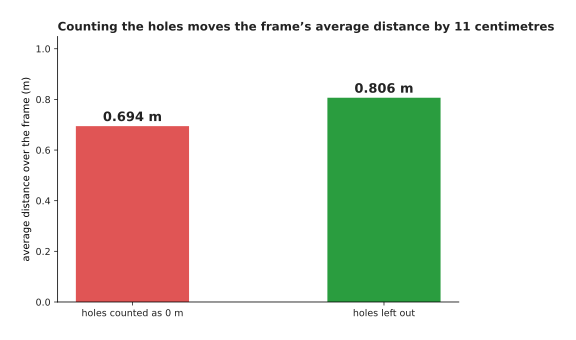

Counting the holes as distances moves the frame's average distance by 11
centimetres, on a frame where everything is less than a metre away.

There is a worse consequence than a wrong average. A value of 0 is nearer than
the nearest real reading of 0.616 m. A safety check that stops the arm when
something comes close will therefore read every hole as an object touching the
camera.

The fix is to carry a second grid beside the first. That second grid holds 1
where the reading is real and 0 where it is missing, and the network is given
both grids. The network can then learn what a missing reading means, instead of
being told a distance that was never measured.

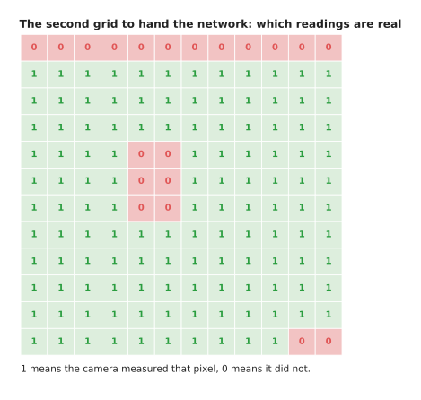

The second grid holds 124 ones and 20 zeros, for the same 144 pixels as the
depth frame.

A depth picture is also often turned into a different shape, by calculating
where in space each pixel actually is. The result is a **point cloud**, which
is a list of positions, where each position is three numbers: one for
left-and-right, one for up-and-down, and one for distance away.

The next picture gives the arithmetic that does this, and the first few rows it
produces.


Every pixel that had a reading becomes three numbers, by the same three lines
of arithmetic.

The arithmetic carries a single idea. A pixel far from the centre of the
picture is looking off at an angle. The further away the thing it sees is, the
further to the side that thing must be. Multiplying how far the pixel is from
the centre by the distance, and then dividing by the camera's focal length in
pixels, therefore gives the sideways position in metres. The focal length here
is 60 pixels.

The first row of this cloud is -0.532, -0.380 and +1.014. A depth frame of
3,072 pixels becomes 2,927 positions, because the 145 pixels that had no
reading are simply left out. The list is therefore 2,927 rows of 3 numbers.

Drawing those positions shows that they are a scene and not a grid.

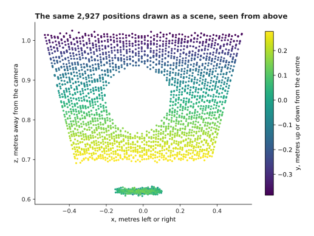

The same 2,927 positions drawn as a scene, looking down from above the camera.
The table fills the upper part, and the mug is the small flat group at 0.62 m.

The important property of that list is one it does not have. The order of the
rows carries no information, because it came from the order in which the camera
happened to scan its pixels. A different camera, or a different crop of the
same picture, would give a different order for the same scene.


The same scene written twice, where the order of the rows is the only
difference between the two lists.

A network that reads this list must therefore give the same answer before and
after a shuffle. The next picture tries three ways of reading the list and
reports whether each one survives.

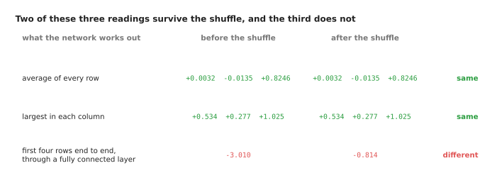

Two of the three readings give the same answer after the shuffle, and the third
does not.

Averaging every row gives +0.0032, -0.0135 and +0.8246 before the shuffle, and
exactly the same three numbers after it. Taking the largest value in each
column gives +0.534, +0.277 and +1.025 both times. A fully connected layer that
reads the first four rows laid end to end gives -3.010 before and -0.814 after,
which is a different answer to the same question.

This is why networks for point clouds are built from steps that treat the list
as a set. Such a step works on each point on its own, and then combines the
points with an average or with a largest-value step. The layers used for grids
are not safe here.

---

## 4. Sound becomes a picture of pitch over time

The depth camera gave a grid, and the point cloud gave a set. A microphone
gives a third shape again, which is a single very long list.

Sound is a pressure in the air that rises and falls. A microphone measures that
pressure many thousands of times a second. Half a second of sound at 16,000
readings a second is therefore 8,000 numbers in a row.

The picture below draws those readings twice. The upper panel is the whole half
second, and the lower panel is a close-up of 200 of the readings, with one dot
for each reading.


Half a second of simulated sound holds 8,000 readings, with the motor running
until 0.30 seconds and a sharp knock when the gripper touches the mug.

The readings run from -1.132 to +1.336 after being scaled. The average size of
a reading is 0.2129 while the motor runs, and 0.0209 after the knock.

The close-up shows what makes sound awkward. Nothing in those individual
numbers says anything useful. What a listener hears is the rate at which the
numbers rise and fall, and that rate is spread across hundreds of readings.

So the list is almost always turned into a grid first. The method chops the
list into short overlapping windows, and then calculates, for each window, how
much of each rate of rising and falling it contains. That rate is the pitch,
measured in cycles a second. The resulting grid is called a **spectrogram**.

In the picture below, time runs across and pitch runs up. A bright cell means
that this pitch was loud in that window.


The same sound becomes a grid of 61 frames by 129 pitches, where the motor
appears as steady horizontal lines and the knock as one bright column across
every pitch.

Each window here is 256 readings, which is 16.0 milliseconds. The windows start
8.0 milliseconds apart, which gives 61 of them. Each window produces 129
numbers, one for each pitch from 0 up to 8,000 cycles a second in steps of
62.5. The whole half second therefore becomes 7,869 numbers arranged as a grid.
That grid can then be cut into patches and read by exactly the machinery of
section 2, which is why a sound model and a vision model often share the same
design.

One more step is needed before the grid is usable, and it is the same kind of
step as scaling a photo. The picture below draws one window of the sound twice.
Both panels show the same 129 numbers, but the second panel has had logarithms
taken first.


The raw sizes hide everything except the loudest pitch, and the logarithms make
the quieter pitches visible.

In frame 18, which starts at 0.144 seconds, the loudest pitch is 125 cycles a
second at a size of 19.14. The quietest pitch has a size of 0.00229, so the
largest is 8,346 times the smallest. On a chart of the raw numbers, everything
except the motor is too small to see.

Taking logarithms turns that range into -52.8 to 25.6 decibels. The quieter
pitches then become visible. More importantly, they become numbers a network
can learn from, rather than rounding errors next to the loud ones. Human ears
work in the same way, which is why decibels exist at all.

The sections so far covered what the robot can see and hear. The next section
turns to what it knows about itself.

---

## 5. What the arm knows about its own body

Cameras and microphones tell the robot about the world. The arm also has
sensors inside it that tell it about itself, and those give a smaller and much
more reliable set of numbers.

Knowing the position and movement of your own body is called
**proprioception**. On an arm it means the angle of every joint, how fast every
joint is turning, how far the gripper is open, and what force the wrist is
feeling.

The picture below shows the joint readings of one movement. The left panel
draws the six joint angles over time, and the right panel draws the same
movement again, measured as speeds instead of angles.


Two seconds of a simulated reach, recorded 100 times a second and measured in
two ways.

Every one of those curves is 200 numbers, one for each hundredth of a second.
The base joint turns from 0.000 to 0.620 radians, and it reaches 0.611 radians
a second at its fastest. The elbow turns from 1.200 to 1.650 radians. The
second wrist joint barely moves at all, from -1.570 to -1.550.

The gripper and the wrist force are measured over the same two seconds. The
next picture draws them on a shared time axis, so that the moment of the grip
can be seen in both.

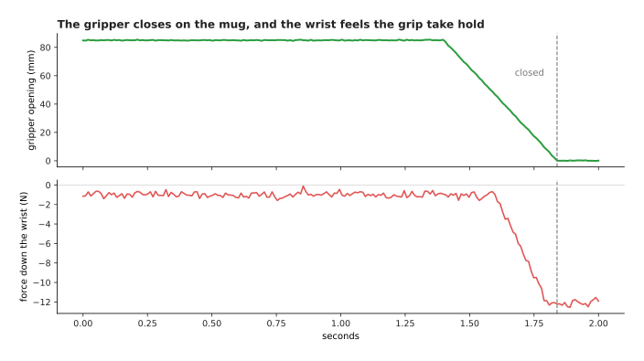

The gripper closes between 1.40 and 1.84 seconds, and the downward force at the
wrist rises while it closes, as the grip takes hold.

The gripper runs from 84.8 millimetres open down to closed. The downward force
at the wrist falls from -1.15 newtons to -11.92 newtons as the arm takes the
weight of the mug.

A model is not given these curves. It is given one moment at a time, as a
single list of numbers in a fixed order.


Everything the arm knows about itself at one instant arrives as sixteen
numbers: six angles, six speeds, the gripper opening and three forces.

The order of those sixteen numbers never changes. The model learns which
position in the list means which joint, and it has no other way of telling them
apart. Swapping two channels between training and running therefore breaks the
model, and it breaks it silently.

These sixteen numbers are usually joined to the tokens from the camera. They
are either added as one more token of their own, or added into every other
token. Either way they cost almost nothing, as the next picture shows.

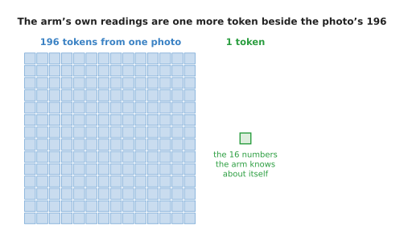

One photo becomes 196 tokens from 150,528 numbers, and everything the arm knows
about itself is 16 numbers and one more token.

The arm's readings do need the same treatment that section 1 gave the photo,
and the reason here is sharper. The sixteen channels are measured in units that
cannot be compared with each other, and the next picture shows how far apart
they are.


Measured in their own units, the sixteen channels differ by a factor of 494 in
how far they move.

The downward force moves with a spread of 3.7230 newtons. The second wrist
joint moves with a spread of 0.0075 radians. One channel is therefore 494 times
wider than another.

No amount of thinking makes a newton comparable with a radian. The only
sensible action is to subtract each channel's own average and divide by each
channel's own spread. Both of those are measured over the training set, and
then stored and reused unchanged when the model runs.

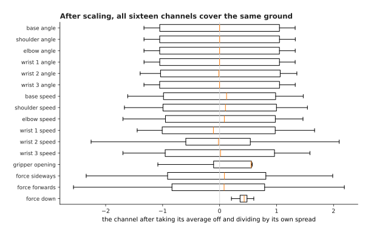

After scaling, every channel has a spread of exactly 1, so all sixteen cover
the same ground.

After that, every channel sits at about the same size. The network then decides
for itself which channels matter, instead of having that decision made by the
choice of units. The same argument applies with much greater force to the
numbers coming out of the model, which is the subject of the last section.

---

## 6. The action space, and why every channel must be scaled

Every section so far has been about numbers going into a model. This one is
about the numbers coming out.

The set of numbers a policy is allowed to produce, together with what each one
means, is called the **action space**. Choosing it quietly decides whether a
robot learning project works. The difficulty is that the numbers say nothing
about what they mean. The same two numbers move the arm in four completely
different ways, depending on what the code that receives them does.

In the picture below, each panel shows the same two-link arm reading the same
two numbers under a different agreement. The grey arm is where the arm was, and
the blue arm is where it arrives.


The same two numbers, 0.10 and 0.05, read in four ways, move the hand anywhere
from 0.8 centimetres to 45.2 centimetres.

Read as **joint angles**, the two numbers say where the joints should now be.
The arm swings to 0.10 and 0.05 radians, and the hand moves 45.2 centimetres.

Read as a **change in joint angles**, the two numbers are added to where the
arm already is, and the hand moves 7.9 centimetres.

Read as **joint speeds** held for a tenth of a second, the hand moves 0.8
centimetres.

Read as a **change in where the hand is**, measured in metres, the hand moves
5.3 centimetres in a straight line, while the controller calculates the joint
angles that achieve that.

All four agreements are in use on real robots, and none of them is written down
in the numbers. The agreement between the model and the arm therefore has to be
made deliberately.

The choice also changes how hard the learning problem is. The next picture
counts the same two-second movement twice. The left panel counts the absolute
joint angles, and the right panel counts the change from one hundredth of a
second to the next.


Written as absolute angles the six joints sit in six separate bands, and
written as changes they all sit within 0.0063 radians of zero.

As absolute angles, each joint sits in its own band. The six averages run from
-2.150 radians for the first wrist joint to +1.425 radians for the elbow, which
is a span of three and a half radians. A model must therefore produce six quite
different numbers, and get each one right within its own range.

As changes, all six sit near zero, with spreads between 0.00031 and 0.00206
radians. The largest change in any hundredth of a second is 0.0063 radians.
Changes are easier to learn, and they transfer better between arms that start
in different places. What they cost is that small errors add up, because
nothing in the output ever says where the arm should actually be.

Whichever meaning is chosen, the channels are still in different units, and
leaving them that way does something severe to the loss. The next picture
assumes that every channel is predicted equally badly, to within 5 per cent of
its own spread, and then measures how much of the total squared error each
channel takes. The left panel is before scaling, on a logarithmic scale, and
the right panel is after scaling.


Before scaling, one channel takes almost the whole loss. After scaling, the
same seven errors share it.

The six joint changes are measured in radians, with spreads near 0.002. The
gripper opening is measured in millimetres, with a spread of 29.280. One
channel is therefore 95,428 times wider than the narrowest of the others.

Squaring the errors makes that difference worse. The gripper channel takes
99.999998 per cent of the total squared error, and the six channels that
actually steer the arm share 0.0000016 per cent between them. After each
channel is divided by its own spread, the same seven errors take between 11.68
and 16.53 per cent each, which is what a loss that cares about all seven looks
like.

A loss that ignores six channels trains a model that ignores them too, and the
size of that effect is worth seeing rather than assuming. The next picture
trains the same small network twice for the same 6,000 steps, each run at its
own best learning rate. The only difference between the runs is whether the
targets were scaled first.


The run on raw targets learns the gripper channel almost perfectly and gets the
six joint channels hopelessly wrong.

Trained on targets in the robot's own units, the six joint channels end with
average errors between 32.70 and 250.18 times their own spread. That means the
model is not merely inaccurate: it is producing numbers of entirely the wrong
size. The gripper channel of the same run ends at 0.02 of its spread, and is
learned almost perfectly. Trained on scaled targets, the joint channels end
between 0.09 and 0.41, and the gripper ends at 0.04. Nothing else differs
between the two runs.

This failure is quiet, because the loss curve falls nicely in both cases and
the reported loss looks fine. The only way to find it is to report the error
of each channel separately, in units of that channel's own spread, and to look
at all of them.

Scaling the actions creates one more obligation. A model trained on scaled
actions produces scaled actions, so something has to turn them back into
radians and millimetres before they reach the arm. That conversion must use the
same averages and spreads that training used, which is why those numbers are
stored beside the model. The next picture measures what happens when they are
not.

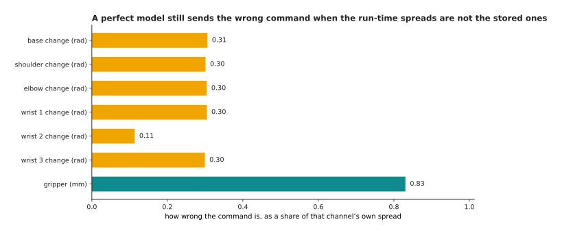

A model whose scaled outputs are exactly right still sends the wrong command,
when the conversion back uses statistics measured on the live data instead of
the stored ones.

In that measurement the model is perfect: its scaled outputs match the targets
exactly. The only mistake is that the conversion back uses averages and spreads
measured on the last 80 steps of the movement, rather than the stored ones. The
stored spread of the gripper channel is 29.280 millimetres and the live spread
is 33.818, and five of the six joint commands come out wrong by about 0.30 of
their own spread. The gripper command comes out wrong by 24.3 millimetres,
which is 0.83 of its spread, on a gripper that opens 85 millimetres in total.
Scaling one way during training and another way afterwards is a fault that no
amount of further training will fix.

---

## 7. Where to read next

- [Attention](../06_the-transformer/01_attention.md) is the next page, and it
  shows what the tokens built on this page and the last one are actually used
  for.
- [Vision backbones](../09_models-that-see/01_vision-backbones.md) follows the
  patches of section 2 through a whole vision transformer.
- [Depth and 3D](../09_models-that-see/04_depth-and-3d.md) takes the depth
  pictures and point clouds of section 3 much further.
- [Actions and
  observations](../../07_learned-models/06_movement-models/02_most-used/04_actions-and-observations.md)
  is the catalogue page on the action spaces real robot policies use.
- [Point cloud
  models](../../07_learned-models/04_3d-models/02_most-used/01_point-cloud-models.md)
  lists the real models that read the order-free lists of section 3.
- [Depth from
  pictures](../../07_learned-models/03_seeing-models/03_also-used/02_depth-from-pictures.md)
  covers the models that produce a depth picture from a colour one.

---

## 8. Using it in Python

Section 1 scaled a photo. Section 2 cut it into 196 patches of 768 numbers.
Section 6 scaled an action vector channel by channel. The code below does all
three, and the comments say which section each part belongs to.

```python
import numpy as np
import torch

# Section 1: a colour photo is three grids, then scaled channel by channel.
rng = np.random.default_rng(0)
photo = rng.integers(0, 256, size=(3, 224, 224)).astype(float)
print(photo.shape, photo.size)                  # (3, 224, 224) 150528
scaled = photo / 255.0
scaled = ((scaled - scaled.mean(axis=(1, 2), keepdims=True))
          / scaled.std(axis=(1, 2), keepdims=True))
print(scaled.mean().round(6), scaled.std().round(6))        # -0.0 1.0

# Section 2: the same photo cut into 16 by 16 patches, each flattened.
grid = torch.from_numpy(photo).float()
patches = grid.unfold(1, 16, 16).unfold(2, 16, 16)          # 3 x 14 x 14 x 16 x 16
patches = patches.permute(1, 2, 0, 3, 4).reshape(-1, 3 * 16 * 16)
print(patches.shape)                                        # torch.Size([196, 768])
print(torch.nn.Linear(768, 32)(patches / 255.0).shape)      # torch.Size([196, 32])

# Section 6: six joint changes in radians and a gripper opening in millimetres.
actions = np.column_stack([rng.normal(0, 0.002, (200, 6)), rng.uniform(0, 85, 200)])
mean, std = actions.mean(0), actions.std(0)
error = rng.normal(0, 0.05 * std, actions.shape)   # every channel equally wrong
raw = (error ** 2).mean(0)
print((100 * raw / raw.sum()).round(4))   # [0. 0. 0. 0. 0. 0. 100.]
fair = ((error / std) ** 2).mean(0)
print((100 * fair / fair.sum()).round(1)) # [18.7 13.7 11.9 16.1 13. 12.8 13.9]
```

The library does the mechanical parts for you. `torchvision.transforms` has the
resize, the division by 255 and the subtract-and-divide of section 1 as ready
pieces. `unfold` cuts the patches of section 2 in one line. `torch.nn.Linear`
is the one learned matrix that turns each patch into a token. None of these
decides anything, because every one of them needs the numbers you give it.

What you decide is the content of this page. You decide the picture size and
the patch size, which together set the token count and therefore most of the
cost. You decide what a missing depth reading becomes, and whether the network
is told which readings are missing. You decide which of section 6's four
meanings your action numbers carry.

Above all you decide the averages and spreads used for scaling. Measure them on
the training set alone. Store them beside the model. Apply the identical values
when the model runs, because scaling one way during training and another way
afterwards is a fault that no amount of further training will fix.
