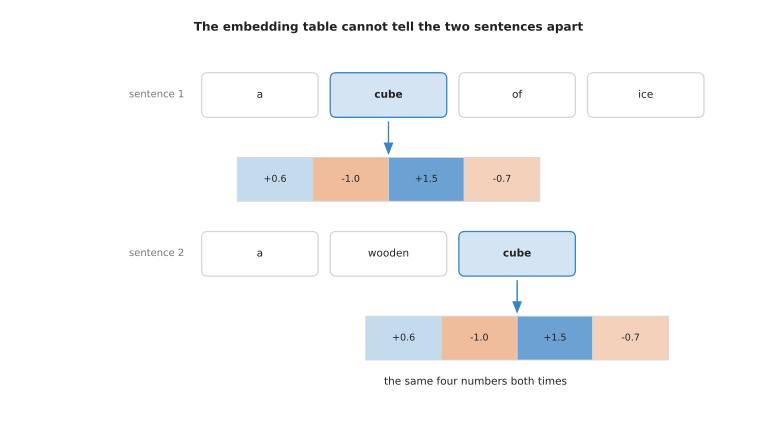
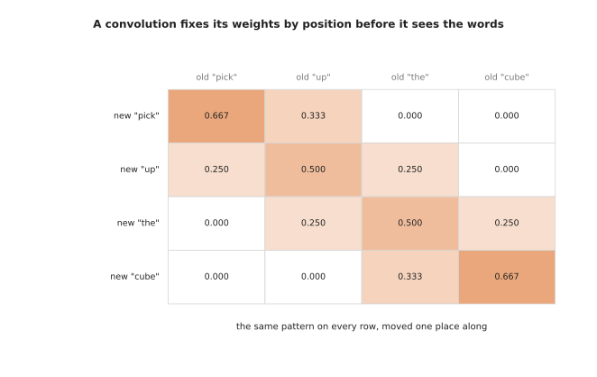
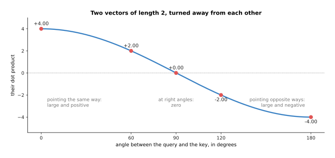
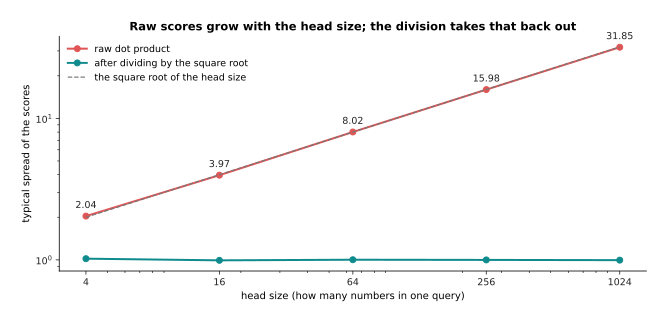
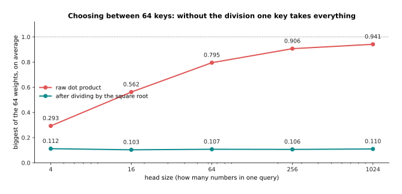
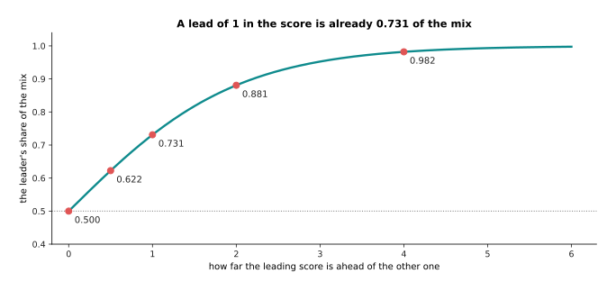

# Attention

This page explains **attention**, which is the step that lets every word in a
sentence take account of the other words. Attention is the central part of the
transformer, and nearly every model later in this book is built out of
transformers, so this page goes slowly and works every number out in full.

The problem attention solves is this. Before attention runs, the model holds one
list of numbers for each piece of text, and that list was chosen by looking at
that piece of text alone. A list chosen that way cannot say anything about the
neighbouring words. By the end of this page you will know how a model replaces
each of those lists with a mixture of all of them, how it decides the
proportions of that mixture, what the three matrices called query, key and value
are for, why several small copies of the step run side by side, and why the
whole thing becomes expensive when the input gets long.

Two words are used throughout, so they are worth fixing now. A **token** is one
piece of text, usually a short word or a part of a word, and the page before
this one, [tokens and
embeddings](../05_turning-the-world-into-numbers/01_tokens-and-embeddings.md),
explains how a sentence is cut into tokens. A **vector** is a list of numbers in
a fixed order. That page also explains the **embedding table**, which is a large
lookup table holding one vector for every token the model knows. The page after
it, [pictures, sound and robot
states](../05_turning-the-world-into-numbers/02_pictures-sound-and-robot-states.md),
does the same job for camera pictures and robot readings. So you arrive at this
page holding a short row of vectors, one vector for each token, and this page
says what to do with them.

The example used throughout is four tokens, where each token is a vector of four
numbers. Every number in every picture was worked out by the script that drew
the picture.

You should already know three things from earlier pages. You should know what a
matrix multiply is, which [the shape of the
numbers](../02_inside-a-network/03_the-shape-of-the-numbers.md) explains. You
should know what softmax does, which [the score of being
wrong](../03_how-training-works/01_the-score-of-being-wrong.md) explains. You
should also know that the numbers inside a model are found by training rather
than written by a person, which [gradient
descent](../03_how-training-works/02_gradient-descent.md) explains. In the small
example on this page the matrices were not trained. A random number generator
with a fixed starting value produced them, so the pattern they give says nothing
about English. Read the pictures for the arithmetic and not for the meaning.

This page stops where text generation starts. How a transformer is trained to
predict the next token, how a mask stops a token from seeing the future, how the
key-value cache makes generation faster, and how one word is finally chosen all
belong to [training and running a
transformer](03_training-and-running-a-transformer.md).

## Contents

1. [What one token needs from the others](#1-what-one-token-needs-from-the-others)
2. [Query, key and value: three learned projections](#2-query-key-and-value-three-learned-projections)
3. [The score between one query and every key](#3-the-score-between-one-query-and-every-key)
4. [Softmax, the mix, and the whole thing as matrices](#4-softmax-the-mix-and-the-whole-thing-as-matrices)
5. [Several small heads instead of one big one](#5-several-small-heads-instead-of-one-big-one)
6. [Self-attention, cross-attention, and the mask](#6-self-attention-cross-attention-and-the-mask)
7. [What attention costs as the window grows](#7-what-attention-costs-as-the-window-grows)
8. [Where to read next](#8-where-to-read-next)
9. [Using it in Python](#9-using-it-in-python)

---

## 1. What one token needs from the others

The tokens you arrive with are separate from each other, and that separation is
the problem. The embedding table looks a token up by its spelling, so it gives
the token "cube" the same vector every time that token appears. The sentence may
be about a wooden cube on a table, or about a cube of ice, and the vector is the
same in both cases.

The next picture shows the token "cube" inside two different sentences. The row
of four numbers under each sentence is what the embedding table returns.



Because the table cannot tell the two sentences apart, a vector that depends
only on the token itself cannot carry what the neighbouring tokens say. Almost
everything a model does depends on the neighbours, so this has to be fixed.

The running example is the order "pick up the cube", which is four tokens. Each
token is a vector of four numbers.


The four rows are the four tokens, and each row holds the four numbers that
stand for that token on its own. Real models use longer vectors and far more
tokens. However, the arithmetic does not change with the size, so four tokens of
four numbers is enough to show all of it.

Attention fixes the problem in one move. Each token builds a new vector for
itself by taking a weighted average of vectors made from all the tokens,
including its own. A weighted average means that each contributor is multiplied
by a number called its weight, and then the results are added up. The weights
are worked out from the tokens themselves rather than fixed in advance, so a
token that needs to know what is being picked up can take a large share from the
token that says it.

The next picture shows the four weights that the token "cube" ends up using. The
thickness of each arrow is drawn in proportion to its weight.


The token "cube" builds its new vector from 0.683 of the first token, 0.103 of
the second, 0.168 of the third and 0.046 of itself. Those four numbers add up to
1.000.

Those four numbers are the whole of the idea. They say in what proportions one
token mixes the others. They come out of the arithmetic of the next three
sections rather than from a person. Because they always add up to one, the
result is an average, so it can never grow without limit.

The next picture puts the four tokens before attention beside the same four
tokens after attention. The column on the right measures how far each token
moved, by taking the difference number by number and averaging the sizes of
those differences.


Attention replaces each token's own vector with a mixture, and the size of the
change runs from 0.41 for the third token to 0.84 for the first. The first two
rows come out close to each other, because both tokens took most of their
mixture from the same place. The last two rows stay different from each other.

There is an obvious alternative to all of this, and naming it is what shows what
attention is worth. The alternative is to mix the neighbours in a pattern fixed
in advance, which is what a convolution does, and [what a network can
learn](../02_inside-a-network/04_what-a-network-can-learn.md) explains that kind
of layer. The next picture shows what the weights of such a layer look like for
the same four tokens, if the layer mixes each token with the one before it and
the one after it.



Every row holds the same three numbers, moved one place along, and the numbers
were chosen before the layer saw any words. So a convolution decides how much to
take from a neighbour by where that neighbour sits, while attention decides by
what the neighbour contains. This means the same attention layer can draw from a
word three places away in one sentence and ninety places away in the next. That
is what attention buys you, and section 7 is what it costs you.

---

## 2. Query, key and value: three learned projections

The weights on those arrows have to come from somewhere, and they come from
three small matrices. A matrix is a rectangle of numbers, and multiplying a
vector by a matrix turns it into another vector. The model learns the numbers in
these three matrices during training. Every token is passed through all three
matrices, which gives every token three new vectors, and the three have three
different jobs.

The first job is asking. The **query** of a token is a vector standing for what
that token is looking for in the others. The second job is offering. The **key**
of a token stands for what that token has to offer to anybody who is looking.
The third job is giving. The **value** of a token is the vector that is actually
passed on and mixed into somebody else's total, once the asking and the offering
have settled how much of it to pass.

The next picture follows one pair of tokens through all three jobs. The token
"cube" is asking and the token "pick" is answering, and the numbers are the real
ones from the running example.


The query of "cube" and the key of "pick" are combined into one number, that
number is turned into the weight 0.683, and then 0.683 of the value vector of
"pick" goes into the new vector for "cube". Sections 3 and 4 explain each of
those steps. The point of the picture is that two different vectors of "pick"
do two different jobs: its key decides how much travels, and its value is what
travels.

Here are the three matrices themselves.


Each matrix holds sixteen numbers in this small example. They are found by
training, like every other weight in a model. The same three matrices serve
every token, so a model does not hold one matrix per word.

A matrix turns one vector into another by multiplying and adding. The token
"cube" is the row +0.6, -1.0, +1.5, -0.7. Each number of its query comes from
running that row down one column of the query matrix: multiply the first number
of the row by the first number of the column, the second by the second, and so
on, then add the four results together.


The four sums give the query of "cube", which is -0.17, +2.36, -1.30, +0.32.
Take the first sum as an example. It is 0.6 times -0.3, which gives -0.18, then
-1.0 times +0.1, which gives -0.10, then 1.5 times +0.4, which gives +0.60, then
-0.7 times +0.7, which gives -0.49. Those four add up to -0.17. The key and the
value of "cube" come from exactly the same work with the other two matrices.

Doing that for all four tokens gives three grids of numbers.


From here on the original token vectors are not needed again, because everything
that follows uses only these three grids.

It is worth asking why the model uses three separate matrices rather than
comparing the token vectors directly. Comparing directly is simpler and saves
two thirds of these numbers. However, comparing token vectors directly would
mean that a token matched the tokens most similar to itself, and that is rarely
the relation you want. Two separate matrices let the model learn one rule for
what a token asks about and a different rule for what it answers to. The third
matrix, the value matrix, then lets a token pass on something different again
from the thing it was matched on. The cost of this freedom is the extra numbers,
which section 5 counts.

---

## 3. The score between one query and every key

Every token now has a query and every token has a key, so one number can be
worked out for every pair of tokens. That number says how well the query of the
first token fits the key of the second. The number is called the **score**, and
it is a dot product. A dot product of two vectors means multiplying them number
by number and adding up the results, which is the same operation used in section
2 to make the query.


The query of "cube" against the key of "pick" gives the four products -0.0697,
+0.6844, -0.6630 and -0.2336, which add up to a raw score of -0.2819.

A dot product measures how well two vectors fit, because its value follows the
angle between them. The next picture takes two vectors whose lengths are both 2
and turns one of them away from the other, step by step.



When the two vectors point the same way the dot product is large and positive.
When they are at right angles it is zero, which means they have little to do with
each other. When they point in opposite ways it is large and negative. So a dot
product measures fit, and it is also the cheapest useful way to measure fit,
because it is one multiply and one add for each number in the vectors.

Doing that for every pair of the four tokens gives sixteen numbers.


Each row of the grid belongs to one query and runs along all four keys. The
-0.28 in the bottom left corner is the score just worked out. The biggest score
in the grid is +5.92 and the smallest is -5.68.

The scores are not used as they are. Every score is first divided by the square
root of the **head size**, which is the count of numbers in one query. Here the
head size is 4, so every score is divided by the square root of 4, which is 2.


Dividing by two drops the biggest score from +5.92 to +2.96, and it halves every
gap between one score and another.

That division looks arbitrary until you see it with numbers. A dot product adds
up as many products as there are numbers in the vectors, so the sums grow
roughly in step with the square root of the head size. The next picture shows
that growth. It uses random queries and keys at five different head sizes, and
measures the spread of the scores, which means how far apart the scores
typically are.



In this simulation the spread of the raw scores grows from 2.04 at a head size
of 4 to 31.85 at a head size of 1024, which follows the square root almost
exactly. The spread after dividing is 1.02 at a head size of 4 and 1.00 at every
larger size tested, so the division takes the growth back out.

The next picture shows why that growth matters. It gives each query 64 keys to
choose between, and measures the largest of the 64 weights that come out, which
is the share taken by the single winning key.



With undivided scores the largest weight climbs from 0.293 at a head size of 4
to 0.941 at a head size of 1024, which means the mixture becomes almost a copy
of one single token. After the division the largest weight stays near 0.11 at
every head size. So the division leaves the model free to be sharp or broad as
the data requires, instead of being forced to be sharp by the size of its own
vectors. It also keeps the gradient that a near-copy would destroy, which is the
trouble described in
[backpropagation](../03_how-training-works/03_backpropagation.md).

---

## 4. Softmax, the mix, and the whole thing as matrices

The divided scores can still be positive or negative, and what is wanted is a
set of proportions. So each row of scores is turned into a row of weights that
are never negative and that add up to one. The step that does this is softmax.
Softmax raises the number e, which is about 2.718, to the power of each score,
which makes every result positive. It then divides each result by the total of
all of them, which makes them add up to one.

The next table has one column per key. Read it downwards: the first row is the
score, the second row is e raised to the power of that score, and the third row
is that result divided by the total of the second row. The bar chart beside the
table draws the third row.


The scaled scores -0.141, -2.028, -1.543 and -2.838 become 0.869, 0.132, 0.214
and 0.059 when raised. Those four add up to 1.272, and dividing each of them by
1.272 gives the weights 0.683, 0.103, 0.168 and 0.046.

Raising e to a power grows quickly, so a score that is one larger than another
gives a raised value about 2.7 times larger. This means a small lead in the score
becomes a large lead in the weight. The next picture measures that effect in the
simplest case, where there are only two keys and one of them is ahead.



With two keys and no lead at all each key takes 0.500 of the mix. A lead of 1 in
the score is already worth 0.731 of the mix, and a lead of 4 is worth 0.982. So
softmax lets a token pick one thing out instead of spreading itself thinly over
everything.

Running softmax along every row of the score grid gives the weight grid.


Each of the four rows adds up to 1.000 on its own. The first row puts 0.574 on
the last token and the second row puts 0.681 there, while the third and fourth
rows lean on the first token with 0.503 and 0.683. No row was forced either way,
because the whole pattern came out of the arithmetic.

The last step is to use a row of weights to mix the value vectors.


The first number of the new vector for "cube" is 0.683 times +0.67, plus 0.103
times -0.01, plus 0.168 times +0.47, plus 0.046 times +0.95, which comes to
+0.5792. The other three numbers come from the other three columns of the value
grid, so the new vector is +0.58, -1.08, +0.54, +0.12.

Every token gets its own row of weights and so its own new vector, and that is
the whole of attention. Written as matrices the same work is short, and writing
it as matrices is how it is actually done.


The whole of attention is three matrix multiplies to make the queries, the keys
and the values, then one multiply of the queries by the keys turned on their
side, then a softmax along each row, then one more multiply by the values.

Doing it this way matters for speed rather than for correctness, because the
hardware that runs these models is built to multiply matrices, as [the shape of
the numbers](../02_inside-a-network/03_the-shape-of-the-numbers.md) explains.
The next picture gives the real sizes for a small language model, where the
input is 512 tokens long and each token is a vector of 768 numbers.


Each of the token, query, key, value and output grids holds 393,216 numbers. One
head's score grid holds 262,144 numbers. With twelve heads, which section 5
explains, the score grids of a single layer hold 3,145,728 numbers between them.

---

## 5. Several small heads instead of one big one

One run of that arithmetic gives each token one row of weights, so each token
mixes the others in exactly one way. That is a real limit, because a token often
needs two unrelated things at the same time. For example it may need to know
which object a word refers to and also which verb governs it. One row of weights
that adds up to one cannot do both of those jobs, because giving weight to one
takes weight away from the other.

The answer is to run the arithmetic several times side by side, each time on a
smaller piece of the same vectors. Each of those parallel runs is called a
**head**.


Two heads are made by cutting the same query matrix down the middle, so each
token has a query of two numbers in each head instead of one query of four
numbers. The key matrix and the value matrix are cut in the same places. So head
one works with the first two numbers of every query, key and value, and head two
works with the last two. Each head then does the whole of sections 3 and 4 on
its own piece, and each head divides by the square root of its own head size,
which is now the square root of 2.


The two heads produce different patterns from the same four tokens. The first
head is much sharper than the second, with an average largest weight of 0.691
against 0.360.

Here the difference between the heads comes from random numbers and means
nothing. In a trained model, however, heads really do take on different jobs.
Researchers who have looked inside trained transformers have found heads that
follow simple relations, such as a head that attends to the token immediately
before, or a head that attends to the earlier place where the same token
appeared. A model with twelve heads in each of twelve layers has 144 such
patterns available to it.


The heads are joined by writing their outputs side by side, which gives a grid
of the original width again. That grid is then multiplied by a fourth learned
matrix, which is called the output projection.

Without that fourth matrix the first half of every token's result could only
come from head one and the second half could only come from head two. The
multiply is therefore what lets every number in the result draw on both heads.


A width of 768 can be cut into any number of heads, and the four matrices hold
2,359,296 numbers whichever cut is chosen. So using more heads costs nothing in
parameters.

The usual choice is a head size of 64, which gives 12 heads at a width of 768.
The reason is a balance. More heads of a smaller size give more patterns, but
they leave each pattern less room to express itself, because a head of size 8
compares vectors of only eight numbers. The real cost of many heads is not in
parameters but in score grids, because every head needs a score grid of its own,
and that is the subject of section 7.

---

## 6. Self-attention, cross-attention, and the mask

Everything so far has made the queries, the keys and the values from one single
set of tokens, and that arrangement has a name. **Self-attention** is attention
in which the queries, the keys and the values all come from the same set of
tokens, so each token looks at the set it belongs to. That is what the
four-token example has been doing all along. **Cross-attention** keeps the two
sides apart: the queries come from one set of tokens, and the keys and the
values come from a different set. So one group reads another group, and the
second group does not read back.


Self-attention on four tokens gives a four by four grid of weights.
Cross-attention from two robot tokens to the same four words gives a two by four
grid instead, and in that grid the first robot token puts 0.92 of its mixture on
the first word. The shapes are what tell the two arrangements apart, because a
cross-attention grid is square only by accident.

Both arrangements appear in a robot model. Self-attention runs inside the vision
part over the patches of the camera picture, and inside the language part over
the words of the order. Cross-attention joins the parts, and it is used wherever
a small fixed set of outputs has to read a large set of inputs. That is the shape
of a decoder that produces eight commands for the arm while reading hundreds of
picture tokens. [Behaviour cloning and action
chunks](../12_models-that-act/01_behaviour-cloning-and-action-chunks.md)
describes that decoder, and [vision-language
models](../10_language-and-multimodal-models/03_vision-language-models.md)
describes the other common use.

Both arrangements also need a way to forbid certain pairs of tokens. An
**attention mask** is a grid of the same shape as the score grid, and it says
which pairs are allowed. It works by arithmetic rather than by special code,
because a forbidden score is replaced by minus infinity before the softmax runs.
The word infinity here means a value larger than any real number, and minus
infinity is its negative; computers have a special value for it.


Forbidding every pair that involves the last token gives that token a weight of
exactly 0.000 in the other three rows, and those three rows still add up to 1.
The next picture works one of those rows out by hand.


Raising e to the power of minus infinity gives exactly 0.000. So the three
remaining raised values 0.632, 3.266 and 5.157 are divided by their own total of
9.055, which gives the weights 0.070, 0.361 and 0.570.

The mask does several different jobs. The one above is a padding mask. It is
needed because a batch of sentences of different lengths is stored in one
rectangular grid, and the short sentences are filled out at the end with empty
places that must not be looked at. A second job is the causal mask, which forbids
every token from seeing the tokens after it and so makes next-token prediction
possible; [training and running a
transformer](03_training-and-running-a-transformer.md) is the page that uses it.
A third job is to lay out which parts of a mixed input may see which other parts.

The next picture shows that third job. The rows are the four kinds of token that
ask, the columns are the four kinds that may be looked at, and each cell says
whether that combination is allowed.


In this arrangement the action tokens may look at everything, the joint readings
may look at the picture and the words, and the picture and the words may not look
at the actions at all. That model has 256 picture tokens, 12 word tokens, 1
joint-reading token and 8 action tokens, which is 277 tokens in all. Its score
grid therefore holds 76,729 pairs, and the mask allows 74,309 of them, which is
96.8 per cent. A mask costs nothing to apply, and it decides what the model can
learn, because a forbidden pair carries nothing at all.

---

## 7. What attention costs as the window grows

The mask leads straight to the question of cost, because what a mask selects
from is a grid with one cell for every ordered pair of tokens. That grid is
where attention becomes expensive, since every query meets every key.


Four tokens give 16 scores, eight tokens give 64 scores and sixteen tokens give
256 scores. So twice the tokens means four times the scores.

The rest of the work does not behave that way. Making the queries, the keys and
the values, and then applying the output matrix, is four matrix multiplies whose
cost grows in step with the number of tokens rather than with its square. So
there is a length at which the two parts cost the same, and above that length the
grid takes over. The next picture measures both parts in multiply-and-add steps,
which is one multiplication followed by one addition, and it uses log axes on
both sides so that a wide range fits on one picture.


At a width of 768 the four projections cost 4 times n times 768 times 768
multiply-and-add steps, where n is the number of tokens. The scores and the
mixing cost 2 times n times n times 768. The two are equal at 1,536 tokens,
which is twice the width.

The grid is 7.7 per cent of the work in one layer at 128 tokens, 25.0 per cent at
512 tokens, 57.1 per cent at 2,048 tokens, 84.2 per cent at 8,192 tokens and 95.5
per cent at 32,768 tokens. In absolute terms it goes from 0.03 billion steps to
1,649 billion steps between the first and the last of those, and that is for one
layer out of dozens. Memory behaves the same way, and memory often runs out
first.


Holding all twelve score grids of a single layer, with each number stored in two
bytes, takes 6 MiB at 512 tokens, 96 MiB at 2,048 tokens, 1.5 GiB at 8,192
tokens and 24 GiB at 32,768 tokens. One MiB is 1,048,576 bytes and one GiB is
1,024 MiB.

Nobody stores those grids whole. A modern implementation works through the grid
in small blocks that fit in the fast memory beside the arithmetic units, keeps a
running total for the softmax, and never writes the full grid out. That makes the
memory grow in step with the number of tokens rather than with its square. All
the multiply-and-add steps are still done, however, so the time still grows with
the square, and that is why long inputs stay expensive even on the newest
hardware. What else is being done about this, including attention that only
looks at a nearby window and models that replace attention altogether, is the
subject of [why the transformer won](04_why-the-transformer-won.md).

---

## 8. Where to read next

- [A transformer block](02_a-transformer-block.md) puts this attention inside
  the piece that is actually stacked, with the normalisation, the residual add
  and the feed-forward part around it, and counts the parameters of a whole
  model.
- [Training and running a
  transformer](03_training-and-running-a-transformer.md) uses the mask of
  section 6 to build next-token prediction, and explains the key-value cache and
  the choices made when text is generated.
- [Why the transformer won](04_why-the-transformer-won.md) weighs attention
  against the alternatives and describes the work being done on the cost of
  section 7.
- [Vision backbones](../09_models-that-see/01_vision-backbones.md) applies
  self-attention to the patches of a picture, which is how a camera image is
  read by this same machinery.
- [Vision-language-action
  models](../12_models-that-act/03_vision-language-action-models.md) shows the
  mixed token stream of section 6 driving a real arm.
- [Language models](../../07_learned-models/07_language-models/01_overview.md)
  in the catalogue lists the named models built from this machinery, with their
  sizes and their costs.

---

## 9. Using it in Python

The code below builds the same four tokens, works out attention exactly as
sections 1 to 5 describe, and prints the numbers that appear in the pictures
above. It uses NumPy alone, so that every step stays visible.

```python
import numpy as np

rng = np.random.default_rng(28)                       # section 1: four tokens
X = np.round(rng.normal(0, 0.9, (4, 4)), 1)           # 4 tokens, 4 numbers each
W_q = np.round(rng.normal(0, 0.6, (4, 4)), 1)         # section 2: three learned
W_k = np.round(rng.normal(0, 0.6, (4, 4)), 1)         # matrices, shared by
W_v = np.round(rng.normal(0, 0.6, (4, 4)), 1)         # every token

Q, K, V = X @ W_q, X @ W_k, X @ W_v                   # one matrix multiply each
scores = Q @ K.T / np.sqrt(Q.shape[1])                # section 3: divided by the
                                                      # square root of 4
mask = np.zeros_like(scores)                          # section 6: 0 allows a pair,
# mask[:, 3] = -np.inf                                # -inf forbids it
e = np.exp(scores + mask - (scores + mask).max(axis=1, keepdims=True))
weights = e / e.sum(axis=1, keepdims=True)            # section 4: softmax by row
out = weights @ V                                     # the weighted mix of values

print('weights\n', np.round(weights, 3))
print('row totals', np.round(weights.sum(axis=1), 3))
print('output\n', np.round(out, 2))

def heads(Q, K, V, n_heads):                          # section 5: the same thing,
    d = Q.shape[1] // n_heads                         # done in n_heads pieces
    pieces = []
    for h in range(n_heads):
        s = slice(h * d, (h + 1) * d)
        a = Q[:, s] @ K[:, s].T / np.sqrt(d)
        a = np.exp(a - a.max(axis=1, keepdims=True))
        pieces.append((a / a.sum(axis=1, keepdims=True)) @ V[:, s])
    return np.concatenate(pieces, axis=1)             # written side by side again

print('two heads\n', np.round(heads(Q, K, V, 2), 2))
```

Running it prints the weight grid of section 4. The rows are 0.061 0.064 0.301
0.574, then 0.022 0.115 0.182 0.681, then 0.503 0.185 0.210 0.102, then 0.683
0.103 0.168 0.046. The row totals are all 1.000, and the output rows are the
ones given in that section.

A real model does not spell this out. In PyTorch the lines from the scores to the
output are one call to `torch.nn.functional.scaled_dot_product_attention`. That
call takes the queries, the keys, the values and an optional mask, it divides by
the square root of the head size for you, and it chooses an implementation that
works through the score grid in small blocks instead of building the whole grid.
One level above it, `torch.nn.MultiheadAttention` also owns the four weight
matrices and does the cutting into heads and the joining back together, so one
attention layer of a real model is a single line of code.

What the library does not decide is everything this page has been about. You
choose the width of the stream and how many heads to cut it into, which sets the
head size and therefore the sharpness of the scores. You decide whether the keys
and the values come from the same tokens as the queries, which is the difference
between self-attention and cross-attention. You also build the mask. A mask that
is wrong in a quiet way, such as one that lets a padding place be looked at,
trains without producing any error message, and it gives a model that behaves
strangely only on short inputs.
