# Attention

The page before this one, [pictures, sound and robot
states](../05_turning-the-world-into-numbers/02_pictures-sound-and-robot-states.md),
finished turning everything a robot can sense into lists of numbers, and the
page before that, [tokens and
embeddings](../05_turning-the-world-into-numbers/01_tokens-and-embeddings.md),
produced the particular lists this page works with, because it explained how
text is cut into tokens and how each token is looked up in a table to give a
vector. So you arrive holding a short row of vectors, one for each token, and
this page answers the question of what to do with them, because a vector that
stands for one token on its own is not yet worth much.

The page explains **attention**, the step that lets every token take account of
the others. It is the heart of the transformer, which nearly every model later
in this book is built from, so the page goes slowly. Four tokens, each a vector
of four numbers, are carried the whole way through, and every number in every
picture was worked out by the script that drew it.

You should already know what a matrix multiply is, which is explained in [the
shape of the numbers](../02_inside-a-network/03_the-shape-of-the-numbers.md),
what softmax does, which is explained in [the score of being
wrong](../03_how-training-works/01_the-score-of-being-wrong.md), and that the
numbers inside a model are found by training rather than written by hand, which
is explained in [gradient
descent](../03_how-training-works/02_gradient-descent.md). The weight matrices
in the small example were drawn by a seeded random number generator rather than
trained, so the pattern they produce says nothing about English, and you should
read the pictures for the arithmetic rather than for the meaning.

This page stops where generation starts, because how a transformer is trained to
predict the next token, how a mask stops a token seeing the future, how the
key-value cache speeds generation up and how a word is finally chosen all belong
to [training and running a
transformer](03_training-and-running-a-transformer.md).

## Contents

1. [What one token needs from the others](#1-what-one-token-needs-from-the-others)
2. [Query, key and value: three learned projections](#2-query-key-and-value-three-learned-projections)
3. [The score between one query and every key](#3-the-score-between-one-query-and-every-key)
4. [Softmax, the mix, and the whole thing as matrices](#4-softmax-the-mix-and-the-whole-thing-as-matrices)
5. [Several small heads instead of one big one](#5-several-small-heads-instead-of-one-big-one)
6. [Self-attention, cross-attention, and the mask](#6-self-attention-cross-attention-and-the-mask)
7. [What attention costs as the window grows](#7-what-attention-costs-as-the-window-grows)
8. [Where to read next](#8-where-to-read-next)
9. [Using it in Python](#9-using-it-in-python)

---

## 1. What one token needs from the others

The tokens you arrive with are separate from each other, and that is the
problem. The embedding table gives "cube" the same vector every time it appears,
whether the sentence is about a wooden cube on a table or a cube of ice, so a
vector that depends only on the token itself cannot carry what the neighbouring
tokens say, and almost everything a model does depends on the neighbours.

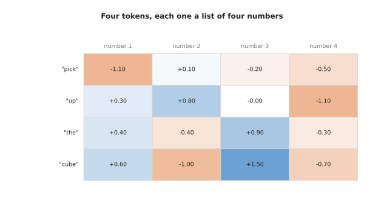

The four tokens of the order "pick up the cube" are the four rows, and each row
is the four numbers that stand for that token on its own.

Real models use wider vectors and far more tokens, but the arithmetic does not
change with the size, so four and four is enough to see all of it.

Attention fixes the problem in one move, because each token builds a new vector
for itself by taking a weighted average of vectors made from all the tokens,
including its own, and the weights in that average are worked out from the
tokens themselves rather than fixed in advance. So a token that needs to know
what is being picked up can draw heavily on the token that says it.

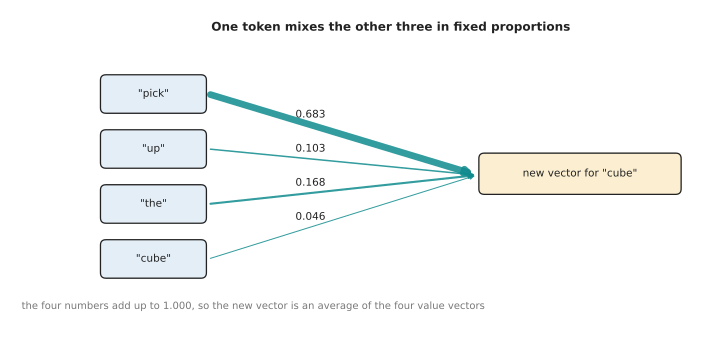

The token "cube" builds its new vector from 0.683 of the first token, 0.103 of
the second, 0.168 of the third and 0.046 of itself, and those four numbers add
up to 1.000.

Those four numbers are the whole of the idea. They say in what proportions one
token mixes the others, they come out of the arithmetic of the next three
sections rather than from a person, and because they always add up to one the
mixture is an average and never grows without limit.

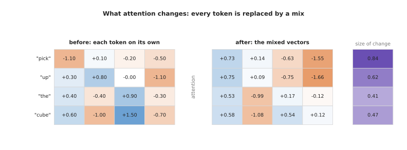

Attention replaces each token's own vector with a mixture, and the size of the
change runs from 0.41 for the third token to 0.84 for the first.

The obvious alternative is to mix the neighbours in a fixed pattern, which is
what a convolution does, and [what a network can
learn](../02_inside-a-network/04_what-a-network-can-learn.md) explains that
layer. A convolution decides how much to take from a neighbour by where that
neighbour sits, while attention decides by what the neighbour contains, so the
same model can draw from a word three places away in one sentence and ninety
places away in the next. That is what attention buys, and section 7 is what it
costs.

---

## 2. Query, key and value: three learned projections

The weights on those arrows have to come from somewhere, and they come from
three small matrices that the model learns during training, because each token
is passed through all three, which gives every token three new vectors with
three different jobs.

The first job is asking, and the **query** of a token is a vector standing for
what that token is looking for in the others. The second is offering, and the
**key** of a token stands for what that token has to offer to anybody looking.
The third is giving, and the **value** of a token is the vector that is actually
passed on and mixed into somebody else's total, once the asking and the offering
have settled how much of it to pass.

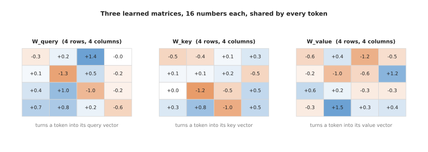

The three matrices hold sixteen numbers each in this small example, they are
found by training like every other weight, and the same three serve every token.

A matrix turns one vector into another by multiplying and adding. The token
"cube" is the row +0.6, -1.0, +1.5, -0.7, and each number of its query comes
from running that row down one column of the query matrix.

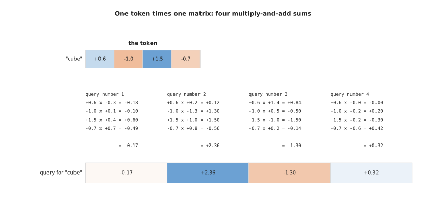

The four sums give the query of "cube", which is -0.17, +2.36, -1.30, +0.32.

The first sum is 0.6 times -0.3 giving -0.18, then -1.0 times +0.1 giving -0.10,
then 1.5 times +0.4 giving +0.60, then -0.7 times +0.7 giving -0.49, and those
add up to -0.17. The key and the value come from the same work with the other
two matrices.

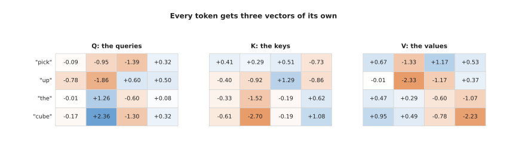

Doing that for all four tokens gives three grids, and from here on the original
token vectors are not needed again.

It is worth asking why the model uses three matrices rather than comparing the
token vectors directly, since that is simpler and saves two thirds of these
numbers. Comparing token vectors directly would mean a token matched the tokens
most like itself, which is rarely the relation wanted, while two separate
matrices let the model learn one rule for what a token asks about and another
for what it answers to. The separate value matrix then lets it pass on something
different again from what it matched on, and the cost is the extra numbers that
section 5 counts.

---

## 3. The score between one query and every key

Now that every token has a query and every token has a key, one number can be
worked out for every pair, and it says how well the query of the first fits the
key of the second. That number is the **score**, and it is a dot product, which
means multiplying the two vectors number by number and adding the results.

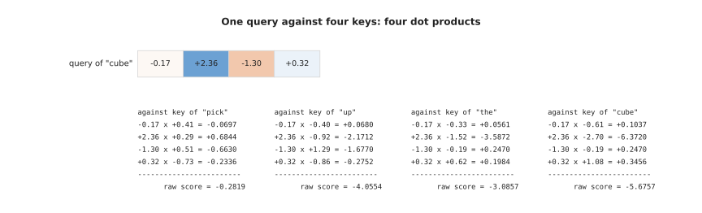

The query of "cube" against the key of "pick" gives -0.0697, +0.6844, -0.6630
and -0.2336, which add up to a raw score of -0.2819.

A dot product is large and positive when two vectors point the same way, near
zero when they have little to do with each other, and large and negative when
they point in opposite ways, so it measures fit, and it is also the cheapest
useful measure.

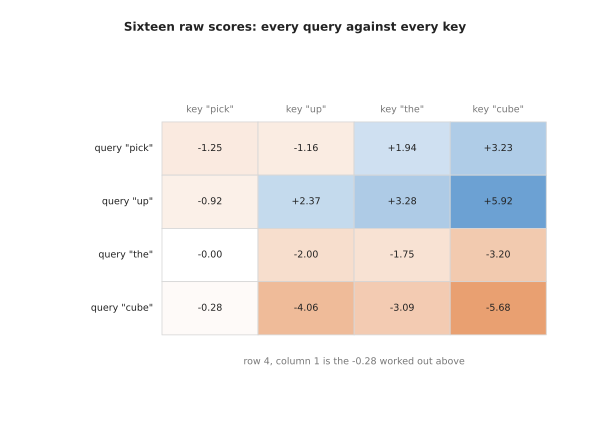

Four queries against four keys give sixteen raw scores, and the -0.28 in the
bottom left corner is the one just worked out.

Each row belongs to one query and runs along all four keys, the biggest score in
the grid is +5.92 and the smallest is -5.68. The scores are not used as they
are, because every one is first divided by the square root of the **head size**,
which is the count of numbers in one query, here the square root of 4, which is
2.

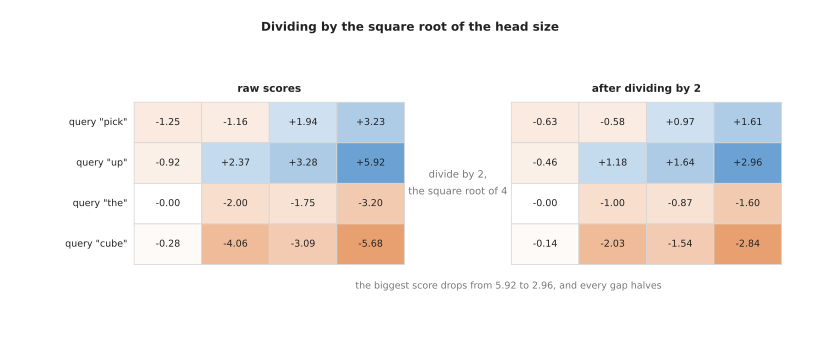

Dividing by two drops the biggest score from +5.92 to +2.96 and halves every gap
between scores.

That division looks arbitrary until you see it with numbers. A dot product adds
up as many products as there are numbers in the vectors, so the sums grow
roughly in step with the square root of the head size.

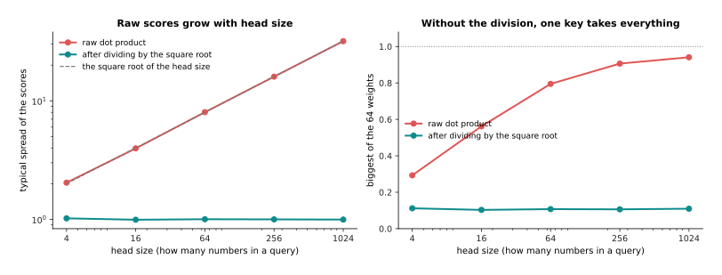

In this simulation the spread of the raw scores grows from 2.04 at a head size
of 4 to 31.85 at a head size of 1024, following the square root almost exactly,
while the spread after dividing stays at 1.00 whatever the head size.

The right-hand plot shows why that matters, because with 64 keys to choose
between, the largest weight from undivided scores climbs from 0.293 at a head
size of 4 to 0.941 at a head size of 1024, which means the mixture becomes a
copy of one token. After the division the largest weight stays near 0.11 at
every head size, so the model is free to be sharp or broad as the data requires
rather than being forced to be sharp by the size of its own vectors, and it
keeps the gradient that a near-copy would destroy, which is the trouble
described in
[backpropagation](../03_how-training-works/03_backpropagation.md).

---

## 4. Softmax, the mix, and the whole thing as matrices

The divided scores are still numbers that can be positive or negative, and what
is wanted is a set of proportions, so each row of scores is turned into a row of
weights that are never negative and that add up to one. That is softmax, which
raises the number e to the power of each score, making every result positive,
and then divides each result by the total of all of them.

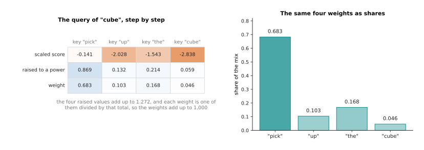

The scaled scores -0.141, -2.028, -1.543 and -2.838 become 0.869, 0.132, 0.214
and 0.059 when raised, those add up to 1.272, and dividing each by 1.272 gives
the weights 0.683, 0.103, 0.168 and 0.046.

Because the exponential grows quickly, a score one larger than another gives a
raised value about 2.7 times larger, so a small lead in the score becomes a
large lead in the weight, which lets a token pick something out instead of
smearing itself over everything.

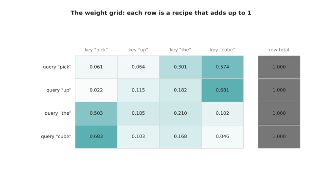

Running softmax along every row gives the weight grid, and each of its four rows
adds up to 1.000 on its own.

The first row puts 0.574 on the last token and the second puts 0.681 there,
while the third and fourth lean on the first token with 0.503 and 0.683, and no
row was forced either way, because the whole pattern came out of the
arithmetic.

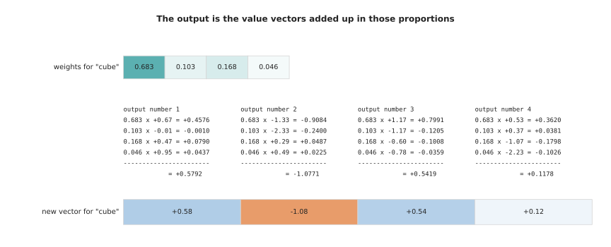

The first number of the new vector for "cube" is 0.683 times +0.67, plus 0.103
times -0.01, plus 0.168 times +0.47, plus 0.046 times +0.95, which comes to
+0.5792.

The other three numbers come from the other three columns of the value grid,
giving the new vector +0.58, -1.08, +0.54, +0.12. Every token gets its own row
of weights and so its own new vector, and that is the whole of attention for one
head. Written as matrices the same work is short, and that is how it is done.

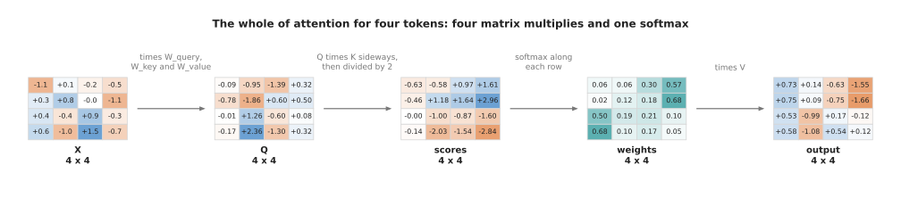

The whole of attention is three matrix multiplies to make the queries, keys and
values, one multiply of the queries by the keys turned on their side, a softmax
along each row, and one more multiply by the values.

Doing it this way matters for speed rather than for correctness, because the
hardware that runs these models is built to multiply matrices, as [the shape of
the numbers](../02_inside-a-network/03_the-shape-of-the-numbers.md) explains.

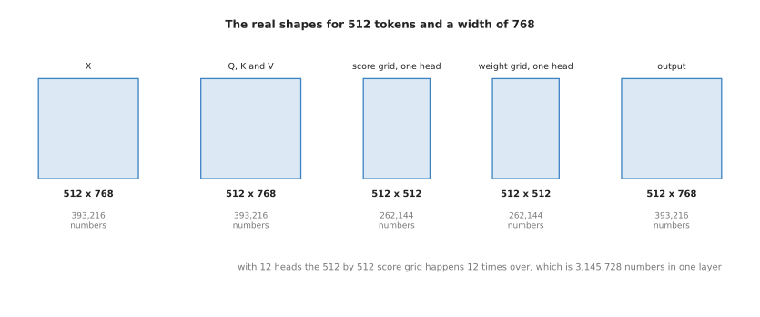

For 512 tokens and a width of 768, each of the token, query, key, value and
output grids holds 393,216 numbers, one head's score grid holds 262,144, and
with twelve heads the score grids of a single layer hold 3,145,728 numbers
between them.

---

## 5. Several small heads instead of one big one

One run of that arithmetic gives each token one row of weights, so each token
mixes the others in exactly one way, and that is a real limit, because a token
often needs two unrelated things at once, such as which object a word refers to
and which verb governs it, and one row of weights adding to one cannot do both
without getting neither clearly. The answer is to run the arithmetic several
times side by side on smaller pieces of the same vectors, and each run is called
a **head**.

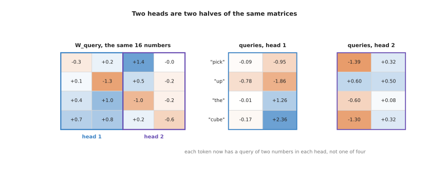

Two heads are made by cutting the same query matrix down the middle, so each
token has a query of two numbers in each head instead of one query of four.

The keys and values are cut in the same places, so head one works with the first
two numbers of every query, key and value and head two with the last two, and
each head then does the whole of sections 3 and 4 on its own piece, dividing by
the square root of its own head size, which is now the square root of 2.

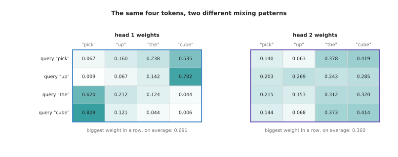

The two heads produce different patterns from the same four tokens, and the
first is much sharper than the second, with an average largest weight of 0.691
against 0.360.

Here the difference between the heads comes from random numbers and means
nothing, but in a trained model heads really do take on different jobs, and
researchers looking inside trained transformers have found heads that follow
simple relations, such as attending to the token immediately before or to the
earlier place where the same token appeared. A model with twelve heads in each
of twelve layers has 144 such patterns available.

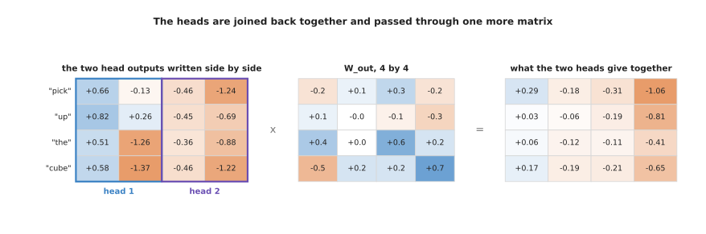

The heads are joined by writing their outputs side by side, which gives a grid
of the original width again, and that grid is multiplied by a fourth learned
matrix.

That fourth matrix is the output projection, and without it the first half of
every token's result could only come from head one and the second half from head
two, so the multiply is what lets every number draw on both heads.

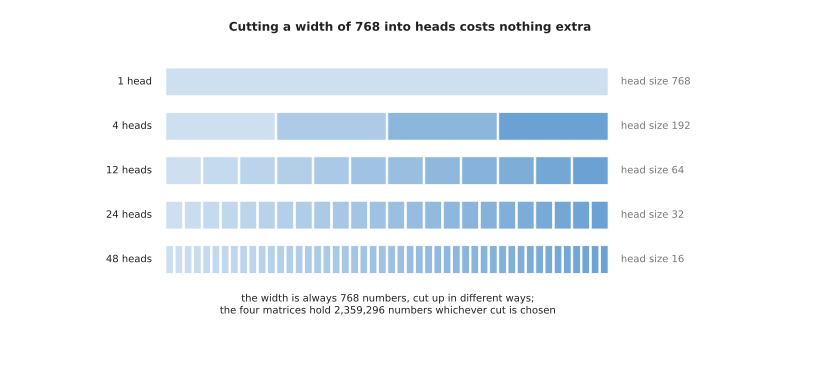

A width of 768 can be cut into any number of heads, and the four matrices hold
2,359,296 numbers whichever cut is chosen, so more heads cost nothing in
parameters.

The usual choice is a head size of 64, which gives 12 heads at a width of 768,
because more heads of a smaller size give more patterns but leave each one less
room to express itself, since a head of size 8 compares vectors of only eight
numbers. The cost of many heads is not in parameters but in score grids, because
every head needs its own, which is the subject of section 7.

---

## 6. Self-attention, cross-attention, and the mask

Everything so far has made the queries, the keys and the values from one single
set of tokens, and that arrangement has a name. **Self-attention** is attention
in which the queries, keys and values all come from the same set of tokens, so
each token looks at the set it belongs to, which is what the four-token example
has been doing. **Cross-attention** keeps the two sides apart, because the
queries come from one set of tokens and the keys and values come from a
different set, so one group reads another without the second group reading back.

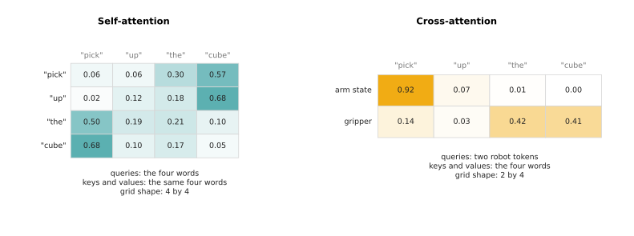

Self-attention on four tokens gives a four by four grid of weights, while
cross-attention from two robot tokens to the same four words gives a two by four
grid, in which the first robot token puts 0.92 of its mixture on the first word.

The shapes tell them apart, because a cross-attention grid is only square by
accident. In a robot model, self-attention runs inside the vision part over the
patches of the camera picture and inside the language part over the words of the
order, while cross-attention joins the parts and is used where a small fixed set
of outputs reads a large set of inputs, which is the shape of a decoder that
produces eight commands for the arm while reading hundreds of picture tokens.
[Behaviour cloning and action
chunks](../12_models-that-act/01_behaviour-cloning-and-action-chunks.md)
describes that decoder, and [vision-language
models](../10_language-and-multimodal-models/03_vision-language-models.md)
describes the other common use.

Both arrangements need a way to forbid certain pairs. An **attention mask** is a
grid the same shape as the score grid saying which pairs are allowed, and it
works by arithmetic rather than by special code, because a forbidden score is
replaced by minus infinity before the softmax.

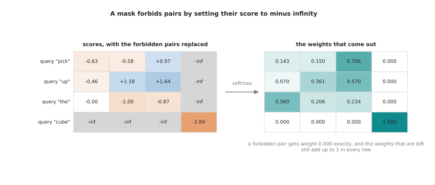

Forbidding every pair that involves the last token gives it weight 0.000 exactly
in the other three rows, while those rows still add up to 1.

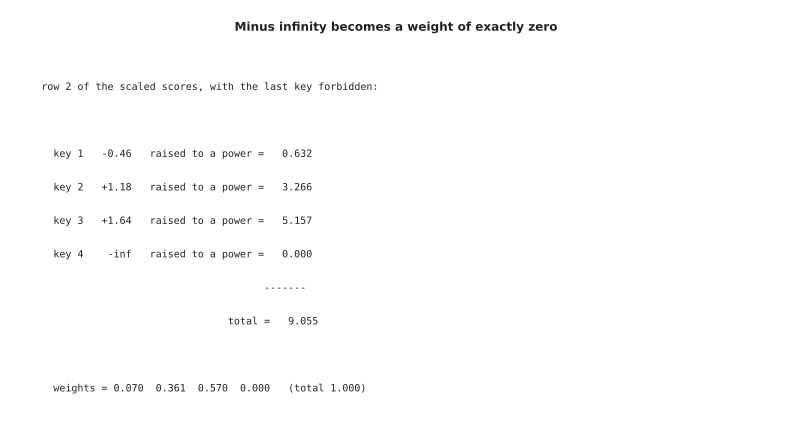

Raising e to the power of minus infinity gives exactly 0.000, so the three
remaining values 0.632, 3.266 and 5.157 are divided by their own total of 9.055,
giving the weights 0.070, 0.361 and 0.570.

The mask does several different jobs. The one above is a padding mask, needed
because a batch of sentences of different lengths is stored in one rectangular
grid and the empty places at the end of the short sentences must not be looked
at. A second job is the causal mask, which forbids every token from seeing the
tokens after it and so makes next-token prediction possible, and [training and
running a transformer](03_training-and-running-a-transformer.md) is the page
that uses it. A third job is to lay out which parts of a mixed input may see
which other parts.

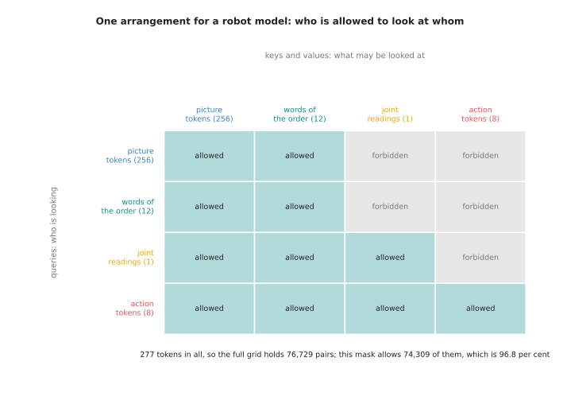

In one arrangement for a robot model the action tokens may look at everything,
the joint readings may look at the picture and the words, and the picture and
the words may not look at the actions at all.

That model has 256 picture tokens, 12 word tokens, 1 joint-reading token and 8
action tokens, which is 277 in all, so its score grid holds 76,729 pairs and the
mask allows 74,309 of them, or 96.8 per cent. A mask costs nothing to apply and
decides what the model can learn, since a forbidden pair carries nothing.

---

## 7. What attention costs as the window grows

The mask leads straight to the cost, because what it selects from is a grid with
one cell for every ordered pair of tokens, and that grid is where attention gets
expensive, since every query meets every key.

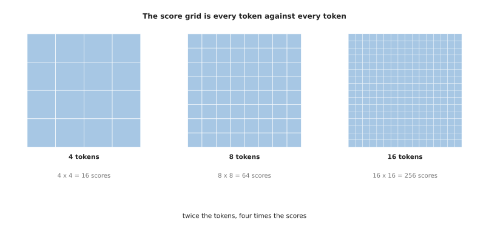

Four tokens give 16 scores, eight tokens give 64 and sixteen tokens give 256, so
twice the tokens means four times the scores.

The rest of the work does not behave that way, because making the queries, keys
and values and applying the output matrix is four matrix multiplies whose cost
grows in step with the number of tokens rather than with its square, so there is
a length at which the two parts cost the same and after which the grid takes
over.

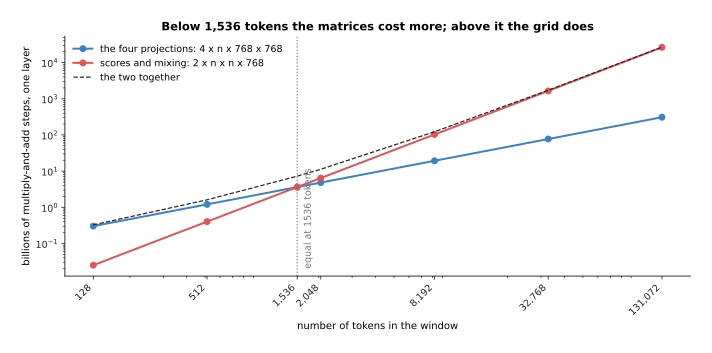

At a width of 768 the four projections cost 4 times n times 768 times 768
multiply-and-add steps while the scores and the mixing cost 2 times n times n
times 768, and the two are equal at 1,536 tokens, which is twice the width.

The grid is 7.7 per cent of the work in one layer at 128 tokens, 25.0 per cent
at 512, 57.1 per cent at 2,048, 84.2 per cent at 8,192 and 95.5 per cent at
32,768, and in absolute terms it goes from 0.03 billion steps to 1,649 billion
steps between the first and the last of those, for one layer out of dozens.
Memory behaves the same way and often fails first.

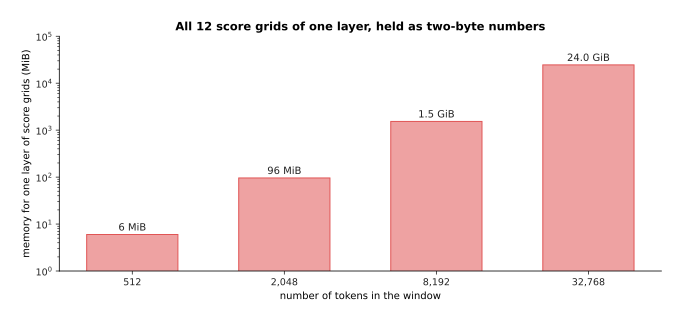

Holding all twelve score grids of a single layer as two-byte numbers takes 6 MiB
at 512 tokens, 96 MiB at 2,048 tokens, 1.5 GiB at 8,192 tokens and 24 GiB at
32,768 tokens.

Nobody stores those grids whole, because a modern implementation works through
the grid in tiles that fit in the fast memory beside the arithmetic units, keeps
a running total for the softmax and never writes the full grid out, which makes
the memory grow in step with the number of tokens rather than with its square.
The multiply-and-add steps are still all done, so the time still grows with the
square, and that is why long inputs stay expensive on the newest hardware. What
else is being done about it, including attention that only looks at a nearby
window and models that replace attention altogether, is the subject of [why the
transformer won](04_why-the-transformer-won.md).

---

## 8. Where to read next

- [A transformer block](02_a-transformer-block.md) puts this attention inside
  the piece that is actually stacked, with the normalisation, the residual add
  and the feed-forward part around it, and counts the parameters of a whole
  model.
- [Training and running a
  transformer](03_training-and-running-a-transformer.md) uses the mask of
  section 6 to build next-token prediction, and explains the key-value cache and
  the choices made when text is generated.
- [Why the transformer won](04_why-the-transformer-won.md) weighs attention
  against the alternatives and describes the work being done on the cost of
  section 7.
- [Vision backbones](../09_models-that-see/01_vision-backbones.md) applies
  self-attention to the patches of a picture, which is how a camera image is
  read by this same machinery.
- [Vision-language-action
  models](../12_models-that-act/03_vision-language-action-models.md) shows the
  mixed token stream of section 6 driving a real arm.
- [Language models](../../07_learned-models/07_language-models/01_overview.md)
  in the catalogue lists the named models built from this machinery, with their
  sizes and their costs.

---

## 9. Using it in Python

The code below builds the same four tokens, works out attention exactly as
sections 1 to 5 describe, and prints the numbers that appear in the pictures
above, using NumPy alone so that every step stays visible.

```python
import numpy as np

rng = np.random.default_rng(28)                       # section 1: four tokens
X = np.round(rng.normal(0, 0.9, (4, 4)), 1)           # 4 tokens, 4 numbers each
W_q = np.round(rng.normal(0, 0.6, (4, 4)), 1)         # section 2: three learned
W_k = np.round(rng.normal(0, 0.6, (4, 4)), 1)         # matrices, shared by
W_v = np.round(rng.normal(0, 0.6, (4, 4)), 1)         # every token

Q, K, V = X @ W_q, X @ W_k, X @ W_v                   # one matrix multiply each
scores = Q @ K.T / np.sqrt(Q.shape[1])                # section 3: divided by the
                                                      # square root of 4
mask = np.zeros_like(scores)                          # section 6: 0 allows a pair,
# mask[:, 3] = -np.inf                                # -inf forbids it
e = np.exp(scores + mask - (scores + mask).max(axis=1, keepdims=True))
weights = e / e.sum(axis=1, keepdims=True)            # section 4: softmax by row
out = weights @ V                                     # the weighted mix of values

print('weights\n', np.round(weights, 3))
print('row totals', np.round(weights.sum(axis=1), 3))
print('output\n', np.round(out, 2))

def heads(Q, K, V, n_heads):                          # section 5: the same thing,
    d = Q.shape[1] // n_heads                         # done in n_heads pieces
    pieces = []
    for h in range(n_heads):
        s = slice(h * d, (h + 1) * d)
        a = Q[:, s] @ K[:, s].T / np.sqrt(d)
        a = np.exp(a - a.max(axis=1, keepdims=True))
        pieces.append((a / a.sum(axis=1, keepdims=True)) @ V[:, s])
    return np.concatenate(pieces, axis=1)             # written side by side again

print('two heads\n', np.round(heads(Q, K, V, 2), 2))
```

Running it prints the weight grid of section 4, with the rows 0.061 0.064 0.301
0.574, then 0.022 0.115 0.182 0.681, then 0.503 0.185 0.210 0.102, then 0.683
0.103 0.168 0.046, row totals of 1.000, and the output rows of that section.

A real model does not spell this out. In PyTorch the lines from the scores to
the output are one call to
`torch.nn.functional.scaled_dot_product_attention`, which takes the queries, the
keys, the values and an optional mask, divides by the square root of the head
size for you, and chooses an implementation that works through the score grid in
tiles instead of building it. One level up, `torch.nn.MultiheadAttention` also
owns the four weight matrices and does the cutting into heads and the joining
back together, so a layer of a real model is a single line.

What the library does not decide is everything this page has been about. You
choose the width of the stream and how many heads to cut it into, which sets the
head size and so the sharpness of the scores, and you decide whether the keys
and values come from the same tokens as the queries, which is the difference
between self-attention and cross-attention. You also build the mask, and a mask
that is wrong in a quiet way, such as one that lets a padding place be looked
at, trains without any error message and gives a model that behaves strangely
only on short inputs.
