# A transformer block

This page explains the **transformer block**, which is the piece that a
transformer model is built from by stacking many copies of it. The page before
this one, [attention](01_attention.md), worked out in full how every token
builds a new vector for itself by mixing the other tokens, and it left you with
four tokens whose vectors had been mixed once.

One mixing step is not a transformer, and that is the problem this page solves. A
model that only mixed tokens would have nothing to say about any token on its
own, and nothing could be stacked on top of it, because the mixing step gives no
guarantee about the shape or the size of what comes out. A block is attention
plus four other parts arranged so that what comes out has exactly the shape and
the scale of what went in. By the end of this page you will know what those six
steps are and why each one is there, where the parameters of a model actually
sit, how to count the parameters of a whole model by hand, and what a mixture of
experts changes.

Two words recur, so they are worth fixing now. A **parameter** is one number
inside the model that training is allowed to change. The **stream** is the grid
of numbers that runs from the bottom of the model to the top, holding one vector
for each token, and every block reads it and writes an addition back into it.

The page follows the same four tokens of four numbers through one block, with
the numbers printed at every stage. It then counts what a whole stack of blocks
holds. It then explains the one common change to the recipe, which is to give a
block many feed-forward parts and use only two of them for each token.

You should read [attention](01_attention.md) first, because the attention step is
used here without being explained again. You should also know what a residual
connection is, from [layers and
depth](../02_inside-a-network/02_layers-and-depth.md), what normalisation is,
from [normalisation and
stability](../04_making-training-work/02_normalisation-and-stability.md), and
what an activation function does, from [one
neuron](../02_inside-a-network/01_one-neuron.md). As on the last page, the
weights in the small example were produced by a random number generator with a
fixed starting value rather than by training. So the arithmetic in the pictures
is real, but the pattern it produces means nothing.

What this page does not cover is how the stack is trained and how it generates
text, which is [training and running a
transformer](03_training-and-running-a-transformer.md), and why this arrangement
beat the alternatives, which is [why the transformer
won](04_why-the-transformer-won.md).

## Contents

1. [The six steps of one block](#1-the-six-steps-of-one-block)
2. [Normalisation, and why it comes first](#2-normalisation-and-why-it-comes-first)
3. [The residual add and the stream that runs through](#3-the-residual-add-and-the-stream-that-runs-through)
4. [The feed-forward part: widen, then narrow](#4-the-feed-forward-part-widen-then-narrow)
5. [A stack of blocks, and where the parameters sit](#5-a-stack-of-blocks-and-where-the-parameters-sit)
6. [Mixture of experts: many feed-forward parts, two at a time](#6-mixture-of-experts-many-feed-forward-parts-two-at-a-time)
7. [Where to read next](#7-where-to-read-next)
8. [Using it in Python](#8-using-it-in-python)

---

## 1. The six steps of one block

A block takes a grid of tokens and gives back a grid of exactly the same shape,
and that is what makes stacking possible. In between it does six things in a
fixed order.

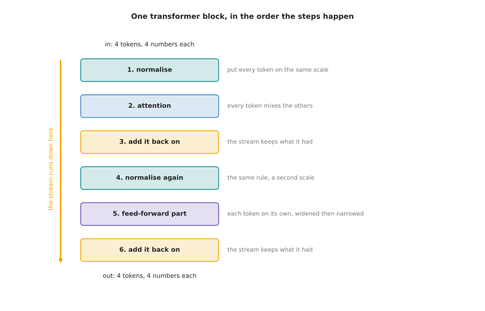

The six steps of one block are drawn above, with four tokens of four numbers
going in at the bottom and four tokens of four numbers coming out at the top. The
first step puts every token on a common scale. The second step is the attention
of the last page. The third step adds the result of that attention back on to the
tokens the block was given, rather than replacing them. The fourth step
normalises again. The fifth step passes each token through a small network of its
own. The sixth step adds that result on as well. Sections 2, 3 and 4 take those
parts one at a time.

The next picture follows the actual numbers. Under each grid it prints the
typical size of the numbers in that grid, which means the square root of the mean
of their squares. That is one number saying how large the sixteen numbers are,
ignoring whether they are positive or negative.

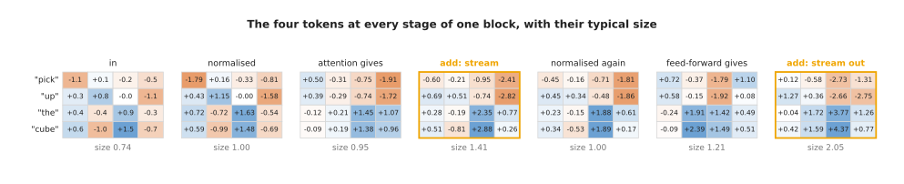

Following that row from left to right is the quickest way to see what each part
does. The tokens arrive with a typical size of 0.74. The first normalisation puts
them at exactly 1.00. Attention gives back something of size 0.95, and adding
that on gives a stream of size 1.41. The second normalisation puts the tokens at
1.00 again. The feed-forward part gives back something of size 1.21, and the
final add gives 2.05.

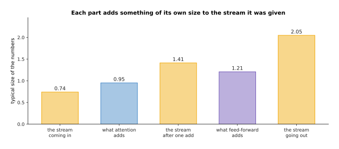

Each part contributes something about as large as what it was given, so the
stream grows as it passes through, from 0.74 to 2.05 in a single block.

Two of the six steps carry nearly all the learned numbers and do the real work,
and those two are the attention and the feed-forward part. The other four steps
hold almost no parameters, and they are there to keep the arithmetic well
behaved. That is the shape to keep in mind while the next three sections explain
why each of the four is needed.

---

## 2. Normalisation, and why it comes first

The first of those four supporting steps is normalisation, which puts every token
on a common scale before anything is multiplied by a learned matrix. The kind
used in nearly all current transformers is root-mean-square normalisation. It
squares the numbers of one token, takes their mean, takes the square root of that
mean, and then divides every number of the token by the result.

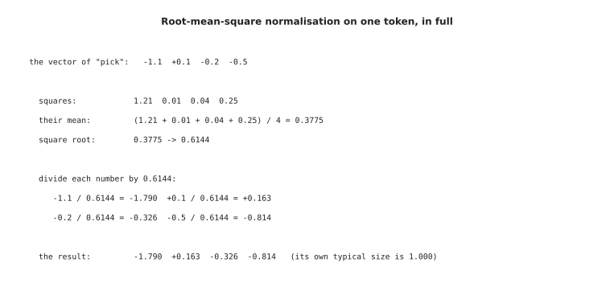

The token "pick" has the squares 1.21, 0.01, 0.04 and 0.25, whose mean is 0.3775.
The square root of that mean is 0.6144. Dividing the four numbers of the token by
0.6144 gives -1.790, +0.163, -0.326 and -0.814, and the typical size of those
four numbers is exactly 1.000.

The next picture shows what this does to all four tokens at once. The grey bar is
the typical size of that token before normalisation and the green bar is the same
measurement after it.

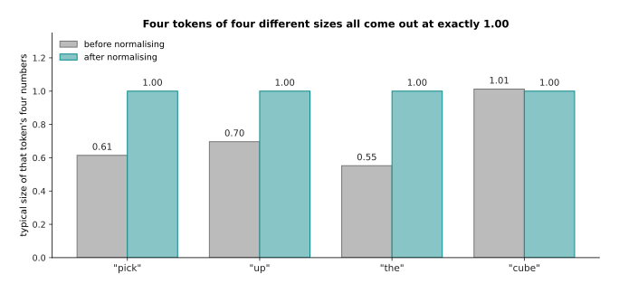

The four tokens arrive at four different sizes, from 0.55 to 1.01, and all four
leave at exactly 1.00. That is the whole purpose of the step: whatever happens
below, the matrices above always receive numbers of a known size.

A learned number for each position multiplies the result afterwards, so the model
can undo the scaling where it wants to, and those learned numbers are the only
parameters that normalisation has. Why normalisation is needed at all, and what
happens to a training run without it, is the subject of [normalisation and
stability](../04_making-training-work/02_normalisation-and-stability.md).

The question this page has to answer is where the normalisation goes, because
there are two places to put it and the choice matters. In the first arrangement
the stream is copied, the copy is normalised and sent through attention, and the
result is added back on to the untouched stream.

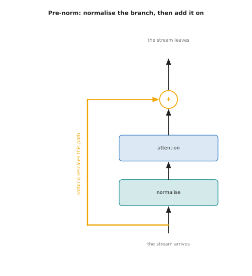

That arrangement is called **pre-norm**, because the normalisation comes before
the main step. In the second arrangement the attention runs first, its result is
added on, and the sum is then normalised, so the stream itself passes through
every normalisation on the way up.

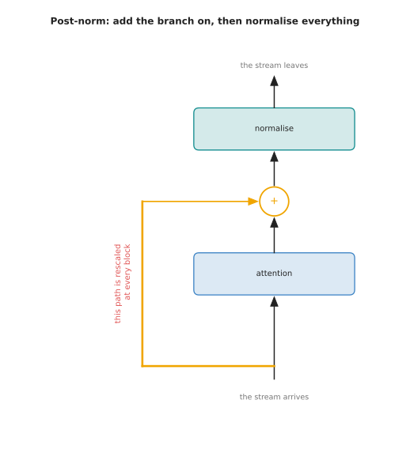

That second arrangement is called post-norm, and it is the one the first
transformers used. Almost everything written since uses pre-norm instead. The
difference between them is what happens to a change made at the bottom of a deep
stack by the time it reaches the top, which is also what happens to a gradient on
the way back down.

The next two pictures come from the same experiment. A chain of 48 blocks was
built with random matrices, and the same input was pushed through it twice, once
in each arrangement. The first picture measures the typical size of the stream
after each block.

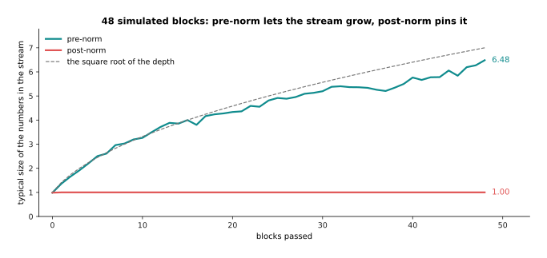

The pre-norm stream grows from 0.99 to 6.48, which is close to the square root of
the depth. The post-norm stream is pinned at 1.00 at every depth, because the
last thing each block does is divide the stream by its own size.

The second picture takes the same two chains and changes the input by a tiny
amount, then measures how far apart the two outputs are after each block. That
measurement says how strongly the top of the stack feels a change at the bottom.

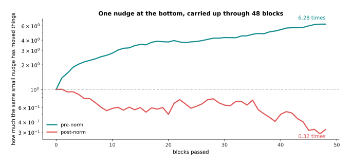

A small change at the bottom arrives 6.28 times larger at the top with pre-norm,
and 0.32 times as large with post-norm.

Those two numbers are about nineteen times apart after 48 blocks, and they are
the whole argument. With post-norm the signal passes through a normalisation at
every level, and each of those rescales it, so by the time a gradient from the
top reaches the first block it has been shrunk many times over. A deep post-norm
model therefore only trains if the learning rate is raised very slowly at the
start. With pre-norm there is a path from the bottom to the top that nothing
rescales, so the first block feels the loss almost as directly as the last block
does, and training is far less fragile.

Pre-norm is not free. Because nothing rescales the stream, the stream grows as it
goes up, which is why a final normalisation is needed after the last block. The
later blocks are also adding to a larger and larger total, so each of them
changes the result proportionally less. That is a real cost, and it is still
worth paying, because a model that trains without careful nursing is worth more
than a model that uses its last blocks slightly better.

---

## 3. The residual add and the stream that runs through

The growth just described comes from the second of the four supporting parts,
which is the add. After attention has produced something, that something is added
on to what the block was given, and the same happens again after the feed-forward
part.

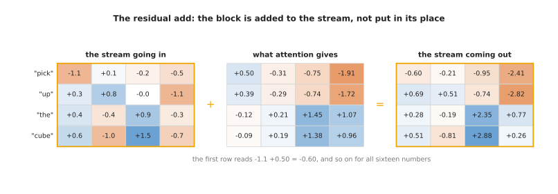

The add is ordinary arithmetic done sixteen times. The first number reads -1.1
plus 0.50, which gives -0.60, and the other fifteen work the same way.

The grid that runs from the bottom of the model to the top, with every block's
result added on to it, is usually called the residual stream, and it is the
single most useful idea for picturing what a deep transformer does. No block
replaces the stream. So what the embedding table put there at the start is still
present at the top, unless some block has deliberately subtracted it. Each block
reads the stream, works something out, and writes an addition back.

The next picture comes from a simulated stack of twelve pre-norm blocks. The bars
are what each block added, and the line is the size of the stream after that
block.

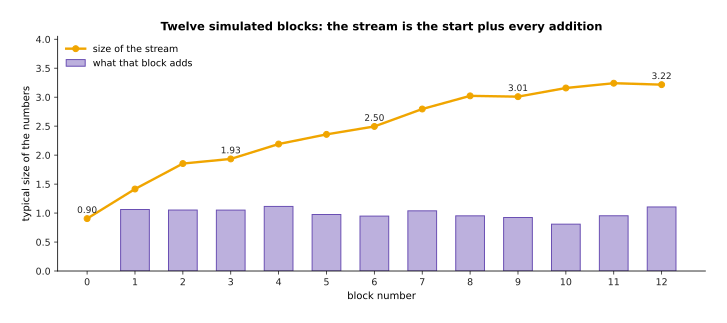

Each block adds something of size about 1.0, while the stream grows only from
0.90 to 3.22. Twelve additions of size one do not give a stream of size twelve,
and the next picture shows why.

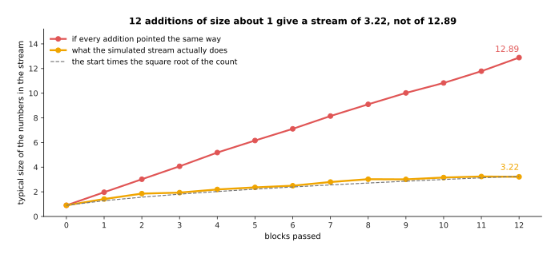

If every addition pointed in the same direction the sizes would simply add up,
and the stream would reach 12.89. The additions point in different directions
instead, so they partly cancel each other, and the stream reaches 3.22. That
follows the dashed line, which is the starting size multiplied by the square root
of the number of additions.

The next picture divides each block's addition by the size of the stream it
produced, which says how much of the final stream that one block is responsible
for.

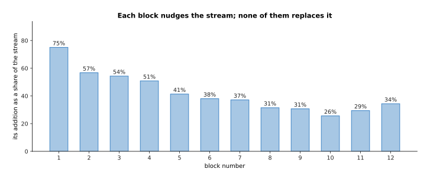

The first block's addition is 75 per cent of the size of the stream it produces,
the fourth block's addition is 51 per cent, and by the twelfth block it is 34 per
cent.

That falling share is the arrangement working as intended rather than a fault.
Early blocks make large changes to a small stream, and later blocks make small
corrections to a large one. Because every block only ever adds, a model can be
made deeper without the new blocks having to undo what the old ones did. The add
is also what lets the gradient reach the bottom of the model, because a sum
passes the gradient to both of its parts unchanged. That is exactly the property
that makes very deep stacks trainable, and [layers and
depth](../02_inside-a-network/02_layers-and-depth.md) describes it.

---

## 4. The feed-forward part: widen, then narrow

The stream now holds the result of mixing, and the block has one more job to do
before it finishes. Attention only ever forms weighted averages of value vectors,
so by itself it cannot work out anything new about a single token. The part that
does that is the **feed-forward network**, which is a small network of two layers
applied to each token separately, with no mixing between tokens at all.

The next picture follows one token through it. The token enters as four numbers,
the first matrix turns those four into sixteen, an activation function is applied
to each of the sixteen, and the second matrix turns the sixteen back into four.

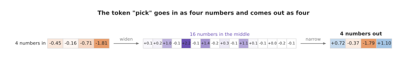

The shape is the point. The output has the width the next block needs, whatever
happened in the middle.

Each of the sixteen middle numbers acts as one detector that responds to a
particular combination of the token's numbers. The activation function used here
is a smooth rule that leaves large positive numbers nearly unchanged and pushes
negative numbers towards zero. The next picture shows the sixteen middle numbers
for the token "pick", before the rule in grey and after it in purple.

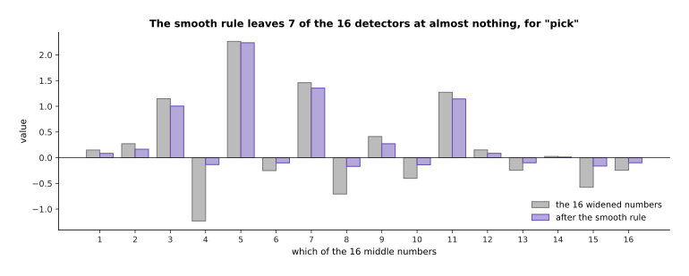

Seven of the sixteen detectors end up close to zero, which is how a detector
stays quiet when its combination is not present.

The activation function is also what stops the whole part from collapsing. If
nothing stood between the two matrices, they could be multiplied together into a
single matrix once, before training even finished.

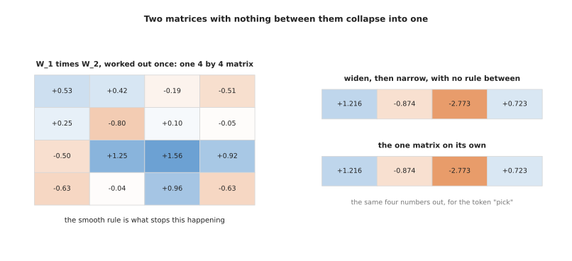

The product of the two matrices is one 4 by 4 matrix, and sending the token
straight through that one matrix gives +1.216, -0.874, -2.773 and +0.723, which
is exactly what widening and then narrowing without the rule gives. So without
the activation function the feed-forward part would be a single linear step and
all the extra width would be wasted.

In a real model the widening is larger than this example suggests.

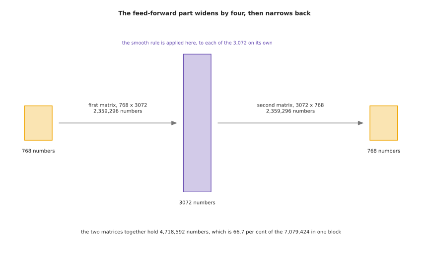

At a width of 768 the common choice is to widen by a factor of four, to 3,072. So
the first matrix holds 2,359,296 numbers and the second matrix holds the same
again.

The factor of four is a convention rather than a law, and it comes from
experiments. Narrower middles lose more accuracy than the parameters they save
are worth, and wider ones cost more than they return. What the convention costs
is easy to see once the parameters of a block are counted side by side. The next
chart uses a log scale on the upright axis, because one of the three bars is
thousands of times smaller than the others and would otherwise be invisible.

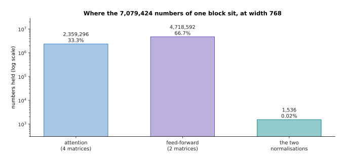

One block at width 768 holds 7,079,424 numbers. The four attention matrices hold
2,359,296 of them, which is 33.3 per cent. The two feed-forward matrices hold
4,718,592, which is 66.7 per cent. The two normalisations hold 1,536, which is
0.02 per cent.

So two thirds of a transformer's parameters sit in the part that never looks at
another token. Most people do not expect that when they first meet it, and it is
the reason section 6 attacks that part rather than attention when more capacity
is wanted.

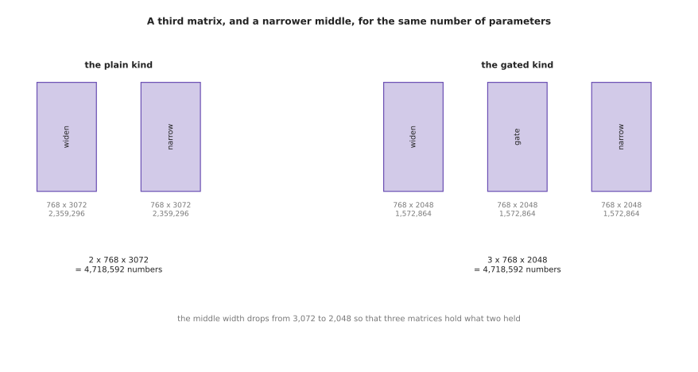

Most recent models use a gated feed-forward part, which has three matrices
instead of two. One of the three produces a number that multiplies the output of
another, which is where the word gated comes from. The middle width is dropped
from 3,072 to 2,048 so that three matrices hold 4,718,592 numbers, which is
exactly what two matrices held before.

The gated kind is chosen because it tends to reach a slightly lower loss for the
same parameters and the same arithmetic, and it costs one extra matrix multiply
of bookkeeping. Either kind leaves the block with the same shape going in as
coming out, which is what section 5 relies on.

---

## 5. A stack of blocks, and where the parameters sit

Because a block gives back the shape it was given, blocks can be put one on top
of another with nothing between them. That stack, with an embedding table
underneath it and one last normalisation on top, is the whole model.

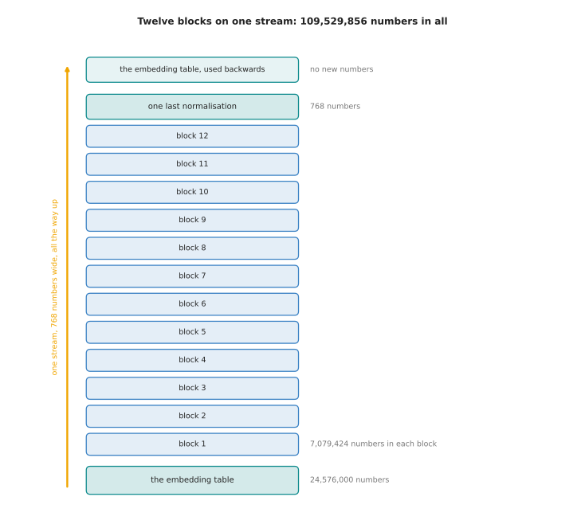

The model drawn above has 12 blocks at width 768, with 12 heads of head size 64,
a feed-forward width of 3,072 and a vocabulary of 32,000 tokens. It holds
109,529,856 numbers in all.

The arithmetic behind that total is worth doing line by line, because it is all
multiplication. Each block holds 4 times 768 times 768 for attention, which is
2,359,296. It holds 2 times 768 times 3,072 for the feed-forward part, which is
4,718,592. It holds 2 times 768 for the normalisations, which is 1,536. Those add
up to 7,079,424 for one block, and to 84,953,088 for twelve blocks. The embedding
table holds 32,000 times 768, which is 24,576,000. The final normalisation holds
768. The three totals add up to 109,529,856. The same embedding table is used
again at the top to turn a vector back into a score for each token in the
vocabulary, which is why it is counted once rather than twice.

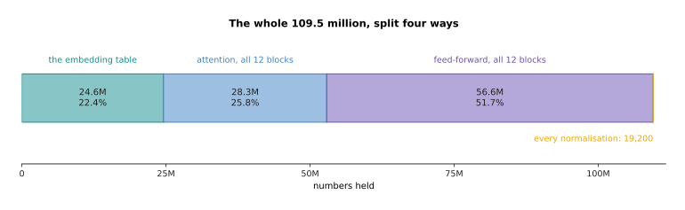

Of those 109.5 million numbers, the embedding table holds 24.6 million, which is
22.4 per cent. Attention holds 28.3 million, which is 25.8 per cent. The
feed-forward parts hold 56.6 million, which is 51.7 per cent. Every normalisation
in the model together holds 19,200.

Stored with two bytes for each number, that model takes 208.9 MiB, where one MiB
is 1,048,576 bytes. It fits on any modern graphics card and on some robot
computers. There are two ways to make such a model bigger, and they pull very
differently.

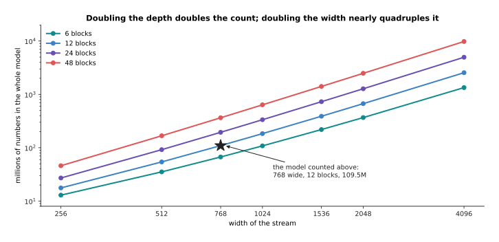

Doubling the depth from 12 blocks to 24 at width 768 takes the model from 110
million parameters to 194 million. Doubling the width from 768 to 1,536 at 12
blocks takes it from 110 million to 389 million instead.

Depth and width behave differently because a block's parameters grow with the
square of the width. So widening is the expensive way to grow and deepening is
the cheap way. Depth has a limit of its own, because each block must wait for the
one below it to finish, so depth adds directly to the time one answer takes. That
matters on a robot which has to produce a command every few tens of milliseconds.
The embedding table is the other thing to watch. At 22.4 per cent of this small
model it dominates, while at a width of 4,096 with 48 blocks the same
32,000-token table is small enough to ignore.

---

## 6. Mixture of experts: many feed-forward parts, two at a time

Section 4 showed that two thirds of a block sits in the feed-forward part, and
section 5 showed that widening everything is expensive. Together those two facts
suggest a trick: keep several feed-forward parts in each block, and use only a
couple of them for any one token. That arrangement is a **mixture of experts**.
Each of the several feed-forward parts is called an expert, and a small extra
matrix called the **router** decides which experts each token goes to.

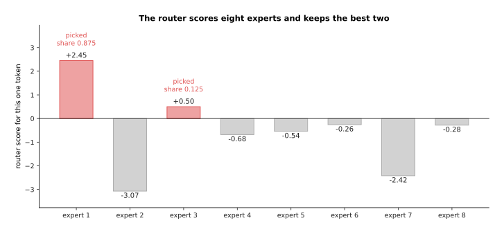

The router gives this token the scores +2.45, -3.07, +0.50, -0.68, -0.54, -0.26,
-2.42 and -0.28. It keeps the two largest of them, and a softmax over just those
two gives expert 1 a share of 0.875 and expert 3 a share of 0.125.

The two chosen experts are then run on that token, their outputs are combined in
those proportions, and the result is added to the stream exactly as a single
feed-forward part would be. The router itself is tiny. It holds 768 times 8,
which is 6,144 numbers at this width, so it is the experts and not the router
that change the arithmetic.

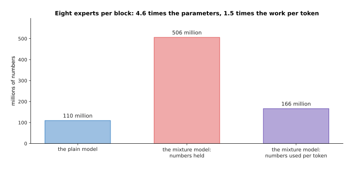

With 8 experts in every block and 2 of them used per token, the model holds 506
million numbers where the plain model held 110 million, but it uses only 166
million of them for any one token.

That is the whole bargain, and the numbers make it exact. Each expert is a full
feed-forward part of 4,718,592 numbers, so one block holds 40,115,712 numbers and
uses 11,804,160 of them for a token. That makes the model 4.6 times larger in
parameters while doing 1.5 times the work for each token. More parameters mean
more room to store what the training data contained, and different experts end up
handling different kinds of token, so the model can hold far more without each
token paying for all of it.

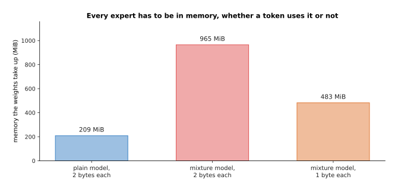

Every expert must sit in memory whether a token uses it or not. So the weights
take 209 MiB for the plain model, 965 MiB for the mixture model, and 483 MiB for
the mixture model stored with one byte for each number.

Memory is the first cost and it cannot be avoided, because a token can ask for
any expert, so all of them have to be loaded. On a robot computer with a few
gigabytes of memory that is often the thing that rules a mixture model out. The
second cost is that the router has to be taught to spread the work, because
nothing in the arithmetic makes it fair. The next chart counts how many of 4,096
tokens each expert received in a simulation where the router was left to itself.
The dashed line marks the fair share, which is 4,096 tokens times 2 experts each,
divided by 8 experts.

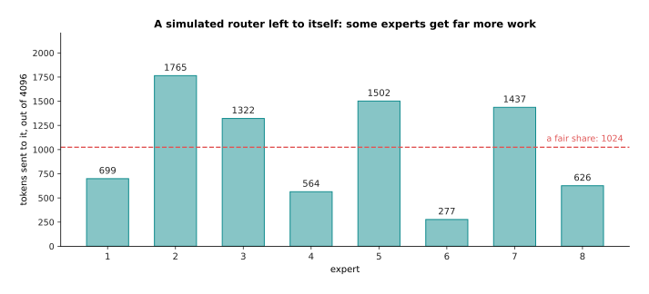

The busiest expert receives 1,765 tokens, which is 1.72 times a fair share, while
the quietest receives 277, which is 0.27 times a fair share.

An imbalance like that wastes the model, because a quiet expert learns little and
a busy one becomes a bottleneck. So real systems add an extra term to the loss
that rewards an even spread, and they also cap how many tokens one expert will
take in a batch. Serving the model is harder too, because the experts of one
layer are usually spread across several machines, so the tokens of a batch have
to be sent to wherever their experts live and gathered back afterwards.

A mixture of experts therefore buys capacity for the same work per token, and it
is paid for in memory, in training that needs more care, and in a serving system
that is considerably more complicated. For a large model served in a data centre
that trade is often worth making. For a model that has to run on the robot itself
it usually is not.

---

## 7. Where to read next

- [Training and running a
  transformer](03_training-and-running-a-transformer.md) takes the stack built
  here and shows what it is trained to predict, how the mask makes that
  possible, and what makes generation slow.
- [Why the transformer won](04_why-the-transformer-won.md) compares this block
  with the alternatives it replaced and with the ones now being tried against
  it.
- [Attention](01_attention.md) is the step inside the block, and is worth
  rereading once the surrounding parts make sense.
- [Scale, data and compute](../07_pretraining-and-adapting/02_scale-data-and-compute.md)
  turns the parameter counts of section 5 into training costs, memory and
  hardware.
- [Making a model smaller and
  faster](../07_pretraining-and-adapting/04_making-a-model-smaller-and-faster.md)
  explains how the 209 MiB of section 5 becomes small enough for a robot's own
  computer.
- [Language models](../../07_learned-models/07_language-models/01_overview.md)
  in the catalogue lists the named models built from these blocks, including the
  mixture-of-experts ones, with their sizes.

---

## 8. Using it in Python

The code below runs the same four tokens through one whole pre-norm block, and
then counts the parameters of the model of section 5. It uses NumPy, so that
every step is visible.

```python
import math
import numpy as np

def rms_norm(X):                                      # section 2: divide each row
    return X / np.sqrt((X ** 2).mean(axis=1, keepdims=True))

def gelu(x):                                          # the smooth rule of section 4
    return 0.5 * x * (1 + np.vectorize(math.erf)(x / math.sqrt(2)))

def attention(X, Wq, Wk, Wv, Wo):                     # the whole of the page before
    Q, K, V = X @ Wq, X @ Wk, X @ Wv
    s = Q @ K.T / math.sqrt(Q.shape[1])
    a = np.exp(s - s.max(axis=1, keepdims=True))
    return ((a / a.sum(axis=1, keepdims=True)) @ V) @ Wo

def block(X, p):                                      # section 1: the six steps
    X = X + attention(rms_norm(X), p['Wq'], p['Wk'], p['Wv'], p['Wo'])
    return X + gelu(rms_norm(X) @ p['W1']) @ p['W2']   # section 3: add, never replace

rng = np.random.default_rng(28)
X = np.round(rng.normal(0, 0.9, (4, 4)), 1)
p = {k: np.round(rng.normal(0, 0.6, (4, 4)), 1) for k in ('Wq', 'Wk', 'Wv', 'Wo')}
p['W1'] = np.round(rng.normal(0, 0.5, (4, 16)), 1)    # section 4: widen by four
p['W2'] = np.round(rng.normal(0, 0.5, (16, 4)), 1)    # and narrow back
print('stream out\n', np.round(block(X, p), 2))

def count(d=768, depth=12, d_ff=3072, vocab=32000):   # section 5: the whole model
    per_block = 4 * d * d + 2 * d * d_ff + 2 * d      # attention, feed-forward, norms
    return per_block, depth * per_block + vocab * d + d

per_block, total = count()
print(f'one block {per_block:,}, whole model {total:,}')
```

Running it prints the stream rows +0.12 -0.58 -2.73 -1.31, then +1.27 +0.36 -2.66
-2.75, then +0.04 +1.72 +3.77 +1.26, then +0.42 +1.59 +4.37 +0.77, which are the
last grid of section 1. It then prints the line "one block 7,079,424, whole model
109,529,856".

A real model uses a library for all of this. In PyTorch,
`torch.nn.TransformerEncoderLayer` is one block, its `norm_first=True` setting is
the pre-norm order of section 2, and `dim_feedforward` is the widened middle of
section 4. In the Hugging Face `transformers` library a configuration object
holds the same handful of numbers, which are `hidden_size`, `num_hidden_layers`,
`num_attention_heads` and `intermediate_size`, and the library builds the whole
stack from them. So counting the parameters of a model you are about to train is
a matter of putting those four numbers into the arithmetic of section 5.

What the library will not do is choose those numbers. You decide the width and
the depth, which section 5 showed pull very differently on the parameter count
and on the time one answer takes. You decide the vocabulary size, which sets how
much of a small model is embedding table. You decide whether the feed-forward
part is plain or gated and how far it widens, which is where two thirds of the
parameters live. You decide whether to use a mixture of experts, which is a
choice about memory and about serving as much as about accuracy. Every one of
those decisions is made before training starts and is expensive to undo
afterwards, which is why it is worth being able to do the arithmetic of this page
by hand.
