# Training and running a transformer

The page before this one, [a transformer block](02_a-transformer-block.md),
built one block out of normalisation, attention, a residual add and a
feed-forward part, and then stacked those blocks into a model. A stack of blocks
is only a shape, though, because none of its numbers mean anything until
somebody has trained them, and even a trained stack does nothing until somebody
runs it. So this page answers two questions: what a transformer is asked to get
right while it is trained, and what happens step by step when a trained one
writes an answer.

The two jobs look very different. Training reads a whole piece of text in one
pass and scores every position at once, which suits hardware that does many
things at the same time, while running the model makes one token at a time and
each token waits for the one before it. Almost everything that is awkward about
these models, from the cost of a long conversation to the reason a reply arrives
slowly, comes out of that difference.

It is for a reader who has read [attention](01_attention.md) and [a transformer
block](02_a-transformer-block.md), so it does not explain attention, queries,
keys, values, heads or the block again. It also assumes you know what a
[token](../05_turning-the-world-into-numbers/01_tokens-and-embeddings.md) is and
what a [loss](../03_how-training-works/01_the-score-of-being-wrong.md) is.

Every number in the pictures below was worked out by
`docs/diagrams/the_transformer_2.py`, which prints each one. The example
sentence, its twelve-word vocabulary and the model's raw outputs for it are
simulated, drawn with a fixed random seed and then nudged so that the model
looks part-way trained, but everything done with those numbers is the real
arithmetic. The memory and time figures come from one stated example model of 24
layers and one stated example accelerator, so no real product or published model
is being described.

## Contents

1. [Next-token prediction: the job that trains the whole stack](#1-next-token-prediction-the-job-that-trains-the-whole-stack)
2. [The causal mask: what stops a position reading its own answer](#2-the-causal-mask-what-stops-a-position-reading-its-own-answer)
3. [Teacher forcing, and what one training step holds](#3-teacher-forcing-and-what-one-training-step-holds)
4. [Running the model one token at a time, and the key-value cache](#4-running-the-model-one-token-at-a-time-and-the-key-value-cache)
5. [Choosing the next token: temperature, top-p and why greedy is not always best](#5-choosing-the-next-token-temperature-top-p-and-why-greedy-is-not-always-best)
6. [The context window, and what makes generation slow](#6-the-context-window-and-what-makes-generation-slow)
7. [Where to read next](#7-where-to-read-next)
8. [Using it in Python](#8-using-it-in-python)

---

## 1. Next-token prediction: the job that trains the whole stack

A stack of transformer blocks turns a row of tokens into a row of vectors, one
for each position, and the job that trains it decides what those vectors have to
mean. The job used for almost every transformer that reads text is called
**next-token prediction**, which turns the vector at each position into a chance
for every word in the vocabulary and scores the model on the chance it gave to
the token that really came next.

The important part is that this happens at every position at the same time, so a
sentence of six tokens is not one question with one answer. Position one is
asked what follows the start marker, position two what follows the first word,
and so on to the end, which gives six separate questions from six tokens.

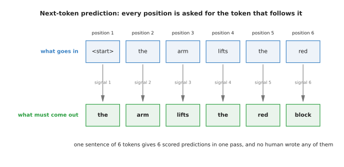

The sentence "the arm lifts the red block" gives six scored predictions in one pass, because the row that goes in is the sentence shifted along by one place.

The row that goes in and the row that must come out are the same sentence, one
shifted against the other, which is why this job costs nothing to prepare, since
any piece of ordinary text is already its own set of right answers and nobody
has to write a label.

Each of those six questions is scored the same way. The model gives a chance to
every word in the vocabulary, you pick out the chance it gave to the word that
was really there, and the loss is minus the natural logarithm of that chance.

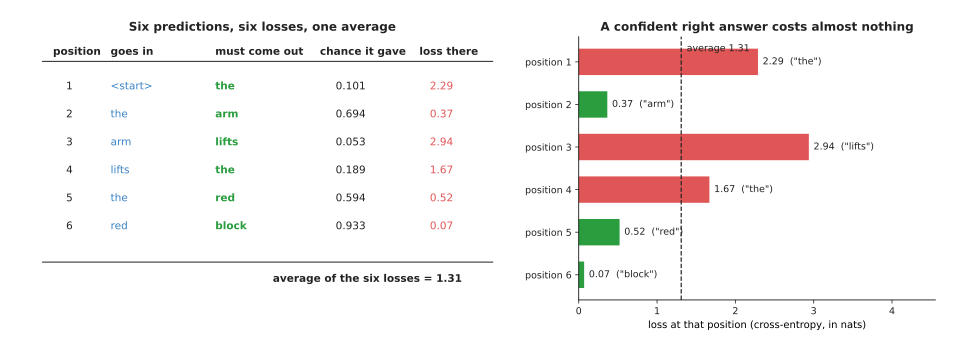

The simulated model gives the right word a chance of 0.101 at the first position and 0.933 at the last, and the six losses average out to 1.31.

Reading down that table shows what a part-trained model looks like. It is almost
certain about "block" after "red", with a chance of 0.933 and a loss of 0.07,
and it is lost at the third position, where the right word "lifts" gets 0.053
and so costs 2.94. The average of the six numbers, 1.31, is the loss for this
sentence, and training nudges every weight so that this average comes down.

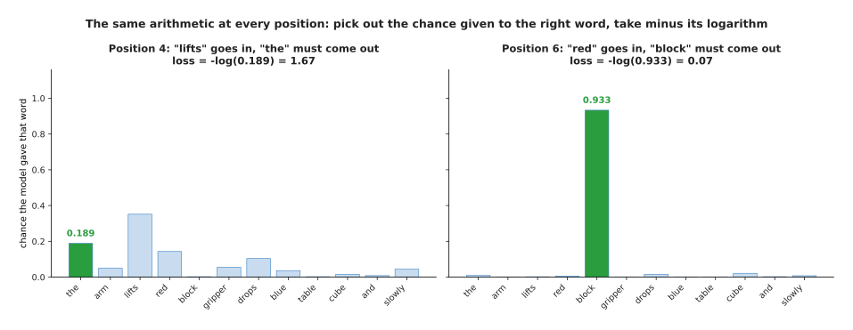

At position 4 the model's favourite word is "lifts" at 0.352 while the right word "the" gets only 0.189, and at position 6 it puts 0.933 on the right word.

Comparing the two shows that the loss cares only about the chance given to the
one right word, because the model may spread the rest of its belief where it
likes without being punished, which is why position 4 still costs 1.67 even
though the model was not far off.

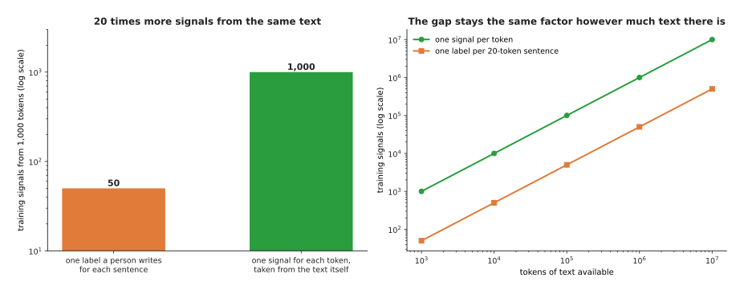

If a person wrote one label for each twenty-token sentence, 1,000 tokens of text would give 50 training signals, while next-token prediction gives 1,000 from the same text.

This is why the job scales. Asking a person to label each sentence gives 50
signals from 1,000 tokens, while asking every position to predict the following
token gives 1,000, and that ratio does not change however much text you pour in.
The next section explains the one piece of machinery that keeps this honest,
because a position that could look forwards would simply read the answer it was
being asked for.

---

## 2. The causal mask: what stops a position reading its own answer

Scoring every position at once only works if no position can see the token it is
being asked to predict, and that is a real danger, because attention lets every
position look at every other position in the same row. The fix is the **causal
mask**, a rule applied inside attention that blocks every pair where the
position doing the looking comes earlier than the position being looked at, and
it is called causal because it lets information travel only the way time does.

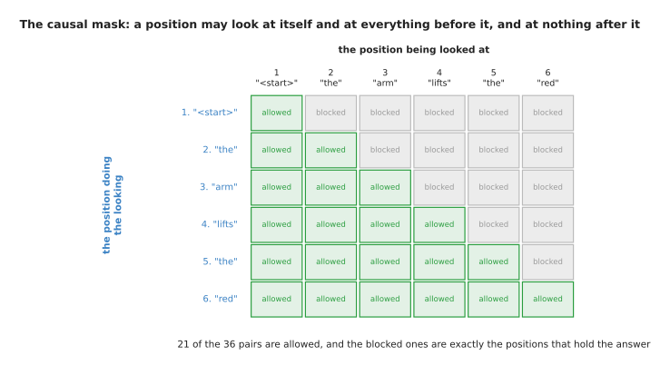

Of the 36 possible pairs of positions, 21 are allowed, and the 15 that are blocked are exactly the ones that would let a position see a token it has not reached yet.

The grid is read by taking a row, which is the position doing the looking, and
running along it to the column, which is the position being looked at. Every
cell on the diagonal is allowed, because a position may always look at itself,
and every cell to the right of it is blocked, which leaves 21 allowed pairs out
of 36. The shape matters more than the exact number, since a sequence of any
length keeps a little over half of its pairs.

The mask is applied between the scores and the softening step that
[attention](01_attention.md) does, and that order matters.

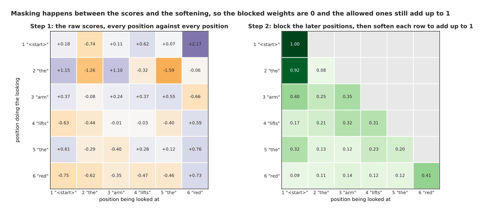

Blocking happens before the softening, so each row of the right-hand grid still adds up to 1 using only the positions that were allowed.

The practical trick is that the blocked scores are set to minus infinity rather
than to zero, because the softening step raises every score to a power of e, and
e raised to minus infinity is exactly zero, while a zero score would come out as
an ordinary positive weight and the mask would do nothing. Row three of the
right-hand grid shows the result, with weights of 0.398, 0.253 and 0.349 on the
three allowed positions and zero on the other three.

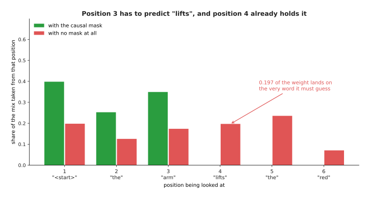

Without the mask, position 3 would take 0.197 of its mix from position 4, which is the word "lifts" that it is being asked to predict.

This is the whole argument for the mask, and it is worth reading twice. Position 3
has to predict "lifts", and position 4 holds "lifts" as its own input, so an
unmasked model would put 0.197 of its weighted mix on the answer and more than
half of its weight, 0.503, on that position and the ones after it. The loss
would fall almost to nothing during training and the model would be useless
afterwards, because at the time you actually use it the later tokens do not
exist yet. The mask is what makes training match the way the model will be run,
and the next section follows that idea one step further.

---

## 3. Teacher forcing, and what one training step holds

The mask decides what a position may look at, and there is a second decision of
the same kind, about what a position is actually fed. During training the model
is always given the true token at every position, even where its own guess at
the position before was wrong, and this practice is called **teacher forcing**.

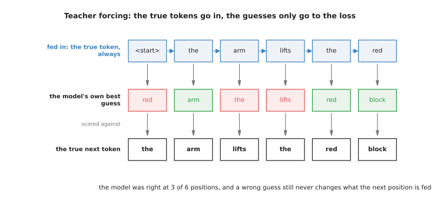

The simulated model guesses right at 3 of the 6 positions, and the three wrong guesses change nothing about what the next position is given.

Teacher forcing is what lets all six positions be worked out in one pass,
because the input at every position is known in advance and does not depend on
anything the model produced, and without it the model would have to be run six
times over with its own output fed back in. The cost is that training and
running then differ, since at training time one wrong guess costs one loss and
nothing more, while at running time a wrong token stays in the row and
everything after it is built on top of it.

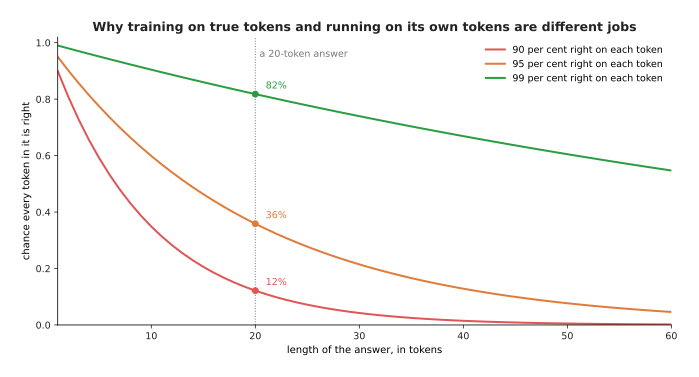

A model that is right 90 per cent of the time on each token gets a whole 20-token answer right only 12 per cent of the time, while 99 per cent per token gives 82 per cent.

Being right on each token is not the same as being right on an answer, and the
gap widens with length, so that at 60 tokens the model that is right 90 per cent
of the time per token produces a perfect answer 0.18 per cent of the time. That
is why per-token loss flatters a model, and why a model is finally judged on
whole answers.

One training step does more than one pass forward, because it also works out how
every weight should change, and that is where the memory goes. The example model
used throughout this page has 24 layers, 16 heads of 64 numbers each, a width of
1,024, a feed-forward width of 4,096 and a vocabulary of 32,768, which comes to
335,594,496 parameters, and each one is held in two bytes.

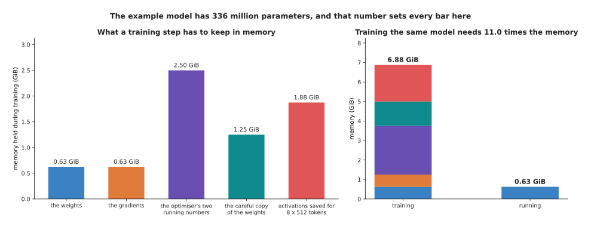

Training the example model holds 6.88 GiB, which is 11 times the 0.63 GiB that running it would need.

Reading the bars from left to right gives the cost of training. The weights take
0.63 GiB, their gradients take the same again, the optimiser keeps two running
numbers for every parameter at four bytes each and so takes 2.50 GiB, a careful
full-precision copy of the weights takes 1.25 GiB, and the values worked out on
the way forward have to be kept for the way back, which for a batch of 8
sequences of 512 tokens and ten saved values per layer comes to 1.88 GiB. The
sum is 6.88 GiB. Running the model needs only the weights, and the next section
shows why running it is nevertheless the harder job to do quickly.

---

## 4. Running the model one token at a time, and the key-value cache

Training reads a whole sequence in one pass, as the section above described, but
a trained model is used to write text that does not exist yet, and so it has to
work in a loop. It reads the prompt, produces one token, adds that token to the
end of the row, and reads the row again to produce the next one.

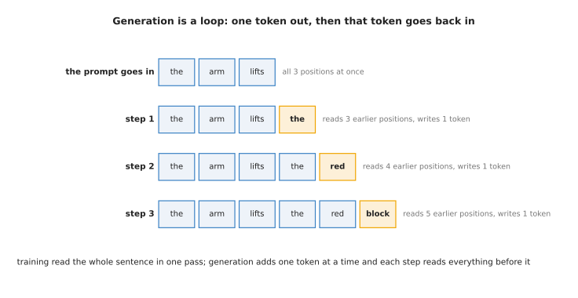

Each step adds one token and must take account of every token before it, so step 3 reads 5 earlier positions to write a single word.

Done in the obvious way this is very wasteful, because the model would push all
five earlier positions through all 24 layers again to add one token, although
nothing about those five has changed. The way out is the **key-value cache**,
often shortened to KV cache, a store that keeps the key and the value every
layer worked out for every position, so a new token works out only its own and
reads the rest.

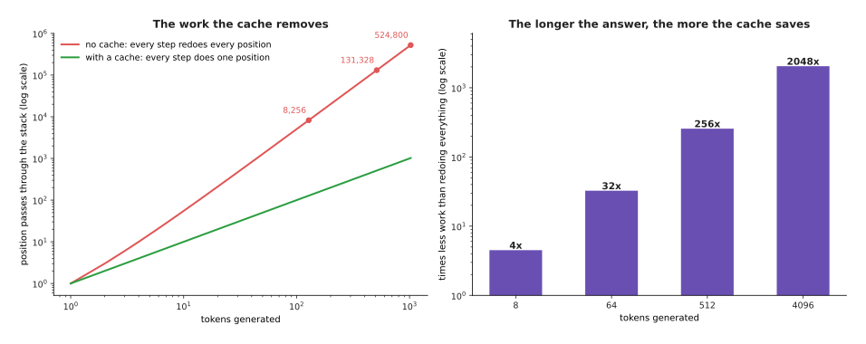

Generating 512 tokens without a cache takes 131,328 passes of a position through the stack, and with a cache it takes 512, which is 256 times less work.

The saving grows with the length of the answer, because the wasted work is the
sum of all the lengths the model passes through, which grows with the square of
the number of tokens while the cached version grows in a straight line, so at
4,096 tokens the cache does 2,048 times less work. Nobody runs these models
without one, which is why the cache's own cost is worth knowing exactly.

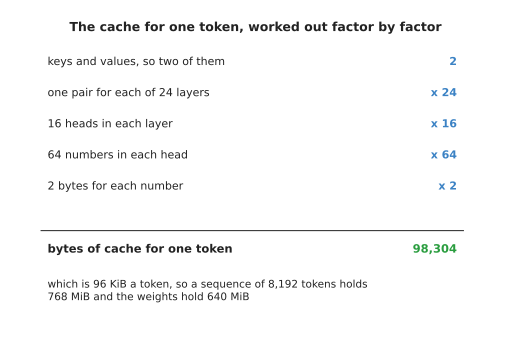

One token of the example model costs 98,304 bytes of cache, which is 96 KiB, so a conversation of 8,192 tokens holds 768 MiB while the whole model's weights hold 640 MiB.

The arithmetic is worth doing slowly, because the result surprises people. The
model keeps a key and a value, which is two things, for each of 24 layers, for
each of 16 heads, each holding 64 numbers, at two bytes a number, and two times
24 times 16 times 64 times 2 is 98,304 bytes for one token. At 8,192 tokens that
is 768 MiB, already larger than the 640 MiB of weights, and at 32,768 tokens it
is 3,072 MiB.

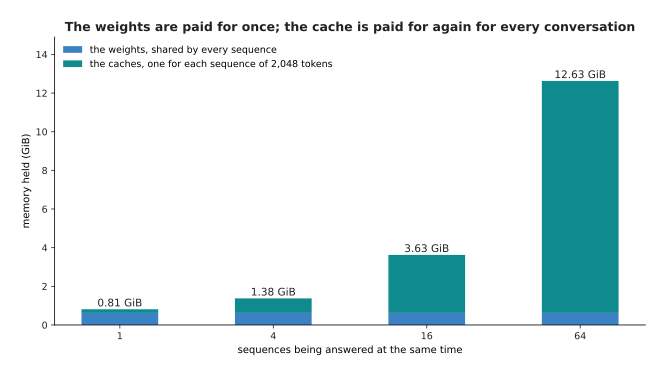

The weights are paid for once however many conversations are running, but every conversation of 2,048 tokens adds another 192 MiB of cache, so 64 of them need 12.63 GiB in all.

This is the shape of the cost when a model serves several people at once,
because the weights are shared and the cache is not, so by 64 conversations the
caches take 12.00 GiB of the 12.63 GiB total. Having worked out what one step
costs, the next question is what it produces, which is not a token but a set of
chances.

---

## 5. Choosing the next token: temperature, top-p and why greedy is not always best

A generation step ends with the same thing a training position ends with, one
plain number for every word in the vocabulary. Those raw numbers are called
logits and the step that turns them into chances is the softmax, both explained
on [the score of being
wrong](../03_how-training-works/01_the-score-of-being-wrong.md). Picking an
actual token out of those chances is called **sampling**, and it is a separate
decision the model does not make for you.

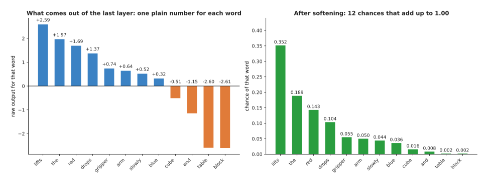

The raw outputs at this position run from plus 2.59 for "lifts" down to minus 2.61 for "block", and softening turns them into twelve chances that add up to 1.

The first knob is **temperature**, a single number that every raw output is
divided by before the softening. Dividing by less than 1 spreads the raw outputs
apart and makes the model more sure of its favourite, and dividing by more than
1 pulls them together and makes it less sure.

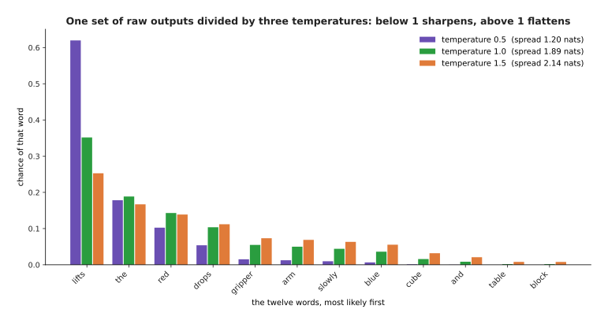

At a temperature of 0.5 the favourite word takes 0.620 of the chance, at 1.0 it takes 0.352, and at 1.5 it takes 0.253, while the spread grows from 1.20 to 2.14 nats.

What you are choosing with temperature is how often the model will say something
other than its favourite. A low temperature gives steady, repetitive text, which
suits a job with one right answer such as reading a number off a label, while a
high temperature gives varied text but also lifts the bottom of the list, since
the least likely of these twelve words rises from almost nothing at 0.5 to
0.0079 at 1.5. One chance in 127 of a plainly wrong word, at every token, is how
a long answer goes off the rails.

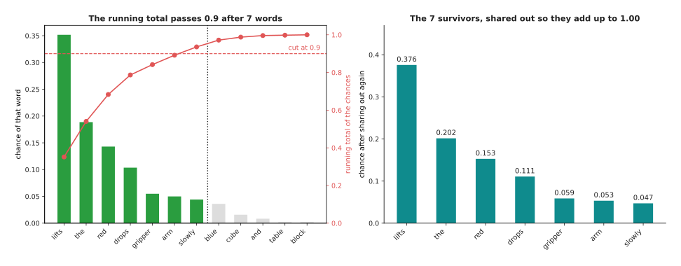

Cutting at a running total of 0.9 keeps 7 of the 12 words, throws the other 5 away, and shares their chance out among the ones that are left.

That is the job of **top-p**, also called nucleus sampling, which sorts the words
by chance, adds them up from the top, and keeps only the words needed to reach a
stated total such as 0.9. Here the running total reaches 0.936 after seven
words, so those seven are kept and shared out again to add up to 1, which lifts
the favourite from 0.352 to 0.376. The cut moves with the model's certainty,
because where the model is sure the first word alone may pass 0.9, and where it
is unsure many words survive.

The last choice is whether to sample at all, because always taking the single
most likely word, which is called greedy decoding, is the obvious thing to do
but is not the same as finding the most likely answer.

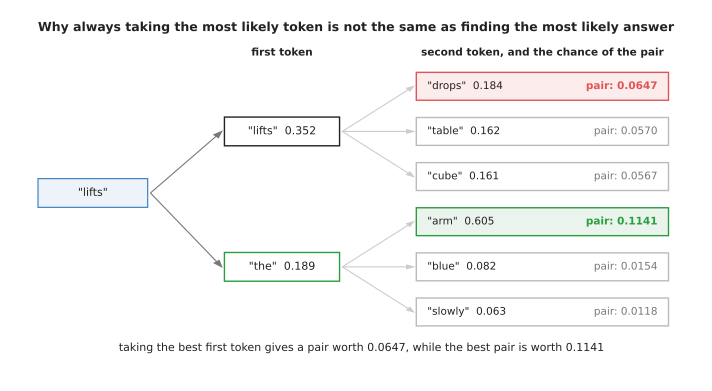

Taking the best first token, "lifts" at 0.352, leads to a best pair worth 0.0647, while the second-best first token, "the" at 0.189, leads to a pair worth 0.1141.

The tree shows the problem in two steps and it only gets worse over twenty.
Greedy decoding takes the word with the highest chance now, without knowing that
the word in second place opens onto a much better continuation, and since the
chance of a whole answer is the chances of its tokens multiplied together, the
greedy path can end up less likely than a path it rejected. It also repeats
itself, because the most likely word after a phrase is often the word that
starts that phrase again. Sampling with a temperature and a top-p cut avoids
both problems most of the time, at the price of a different answer each run.

---

## 6. The context window, and what makes generation slow

Sampling decides which token comes out, and the last thing to understand is what
limits how many tokens the model can hold in front of it and how fast they
arrive. The number of tokens a model will accept at once is its **context
window**, and three separate things set it. The first is the length the model
was trained at, because the scheme that tells it where each token sits, described
on [tokens and
embeddings](../05_turning-the-world-into-numbers/01_tokens-and-embeddings.md),
has only been exercised up to that length. The second is the arithmetic, because
attention scores every allowed pair of positions. The third is memory, because
the cache has to be held for every token in the window.

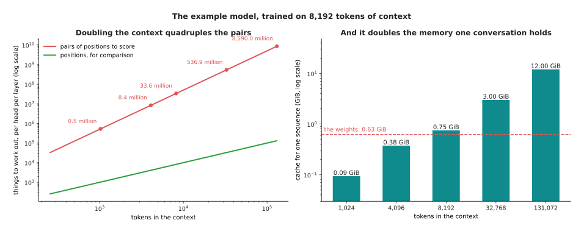

A context of 8,192 tokens has 33.6 million allowed pairs in every head of every layer and holds 0.75 GiB of cache, and a context of 131,072 tokens has 8,590 million pairs and holds 12 GiB.

Doubling the context doubles the memory and quadruples the pair work, and the
second of those is what bites, because the pairs grow with the square of the
length while everything else grows in a straight line. The next page takes that
cost apart properly.

What happens past the end of the window is simpler and more disappointing,
because the model has no slot for a token beyond it, so either the program
refuses the request or, far more often, it quietly drops the oldest tokens to
make room.

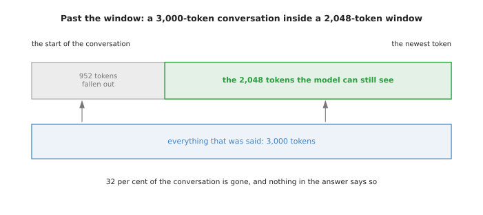

A conversation of 3,000 tokens inside a window of 2,048 loses its oldest 952 tokens, which is 32 per cent of what was said, and nothing in the reply says so.

This matters for a robot, because the instruction that set the task is usually
the oldest thing in the conversation and so falls out first, and the model never
complains, since from its point of view the conversation simply begins where the
window begins.

The last question is speed, and the answer is not the one most people expect,
because writing one token takes very little arithmetic but requires the machine
to read every weight in the model out of memory along with the whole cache.

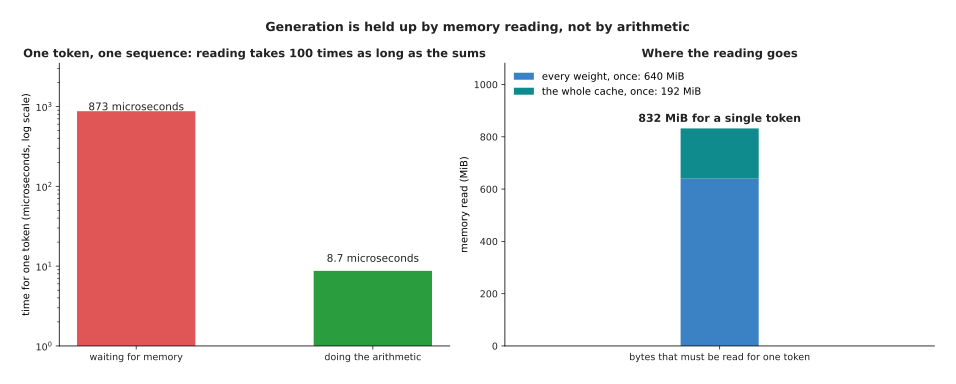

Writing one token of the example model at a context of 2,048 reads 832 MiB and does about 872 million operations, so on the example accelerator the reading takes 873 microseconds and the arithmetic takes 8.7.

Reading takes 100 times as long as the sums, so the machine spends almost all of
a generation step waiting for memory while its arithmetic units sit idle. This
is what people mean when they say generation is bound by memory bandwidth rather
than by arithmetic, and it explains why a bigger model is slower in direct
proportion to its size, and why holding the numbers in fewer bytes, which
[making a model smaller and
faster](../07_pretraining-and-adapting/04_making-a-model-smaller-and-faster.md)
describes, speeds generation up so much.

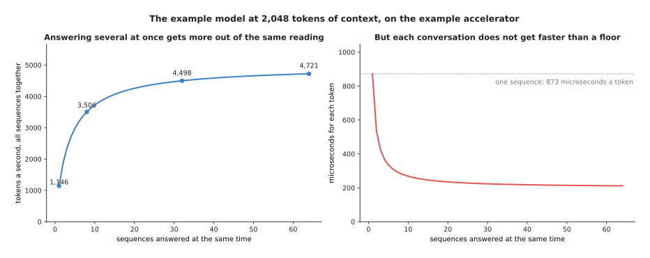

Answering 8 conversations at once gets 3,506 tokens a second out of the same machine instead of 1,146, because the weights are read once for all of them.

The way out is to answer several conversations at the same time, since the
weights are read once per step whether one sequence waits on them or sixty-four.
Throughput rises from 1,146 tokens a second at one sequence to 4,721 at 64, but
the wait for any one conversation's next token never drops below about 212
microseconds, because each sequence still has its own cache to read.

---

## 7. Where to read next

- [Why the transformer won](04_why-the-transformer-won.md) is the next page, and
  it asks what this design does that a convolution and a recurrent network could
  not, and what is being done about the costs counted here.
- [Self-supervised
  pretraining](../07_pretraining-and-adapting/01_self-supervised-pretraining.md)
  shows the other training jobs of the same family, which make labels out of
  unlabelled pictures and sound.
- [Scale, data and
  compute](../07_pretraining-and-adapting/02_scale-data-and-compute.md) turns
  the memory and time arithmetic here into the cost of a real training run.
- [Large language
  models](../10_language-and-multimodal-models/01_large-language-models.md)
  describes what the finished thing can and cannot do.
- [Language models](../../07_learned-models/07_language-models/01_overview.md)
  in the catalogue book lists the named models of this kind that a robot uses,
  and what each costs to run.

---

## 8. Using it in Python

The sections above worked out a loss, a mask and a sampling rule by hand, and in
PyTorch each of those is one or two lines. The last block below uses the six
largest raw outputs from section 5 rather than all twelve, so its chances differ
a little from the figures above.

```python
import torch
from torch.nn import functional as F

# Section 1: one sentence of six tokens, cut into inputs and targets.
tokens = torch.tensor([[5, 1, 8, 5, 3, 9]])
inputs, targets = tokens[:, :-1], tokens[:, 1:]
print(inputs.shape, targets.shape)      # torch.Size([1, 5]) torch.Size([1, 5])

# Section 1: the loss a model that has learnt nothing pays on those five.
vocab = 12
nothing_learnt = torch.zeros(5, vocab)                       # every word equally likely
print(round(float(F.cross_entropy(nothing_learnt, targets[0])), 4))   # 2.4849 = log(12)

# Section 2: the causal mask, and what it leaves of an even set of scores.
n = 6
allowed = torch.tril(torch.ones(n, n, dtype=torch.bool))
print(int(allowed.sum()))                                    # 21 of the 36 pairs
weights = torch.softmax(torch.zeros(n, n).masked_fill(~allowed, -torch.inf), dim=-1)
print([round(v, 3) for v in weights[2].tolist()])  # [0.333, 0.333, 0.333, 0.0, 0.0, 0.0]

# Section 5: temperature on one set of raw outputs, then the top-p cut.
raw = torch.tensor([2.59, 1.97, 1.69, 1.37, 0.74, 0.64])
for t in (0.5, 1.0, 1.5):
    print(t, [round(v, 3) for v in torch.softmax(raw / t, dim=-1).tolist()])
chances = torch.softmax(raw, dim=-1)                         # already in order
print(int((chances.cumsum(0) < 0.9).sum()) + 1)              # 5 words kept at p = 0.9
```

The library gives you the parts rather than the policy. `F.cross_entropy`
combines the softening and the logarithm in one numerically careful step, so you
pass it the raw outputs and never work out the chances yourself, and
`torch.nn.functional.scaled_dot_product_attention` applies the mask for you if
you pass `is_causal=True`, which also lets it skip the blocked half of the work
rather than working it out and throwing it away. Hugging Face's `transformers`
package hands you the whole loop, cache included, behind one `model.generate`
call.

What you still have to decide is everything this page spent its sections on. You
choose how long the training sequences are, which sets both the cost of a step
and the longest thing the model will ever have seen, and you choose the
temperature and the top-p cut, which change the character of the output more
than most changes to the model do. You also choose the context window you will
serve, which fixes how much cache memory each conversation takes, and how many
conversations to answer at once, which trades one person's waiting time against
the number of people served.

The one thing you cannot decide away is the shape of the work, because training
stays a wide pass over many positions at once while generation stays a narrow
loop that reads the whole model from memory for every single token, and every
design on the next page is an attempt to make that second shape cheaper.
