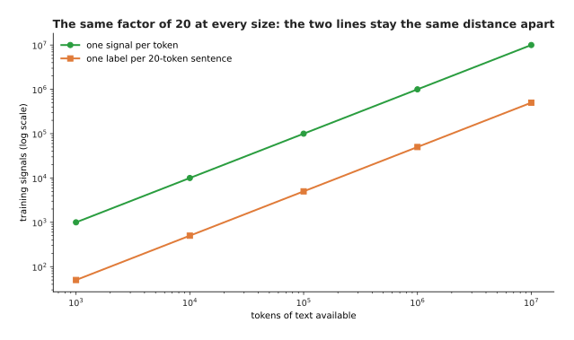
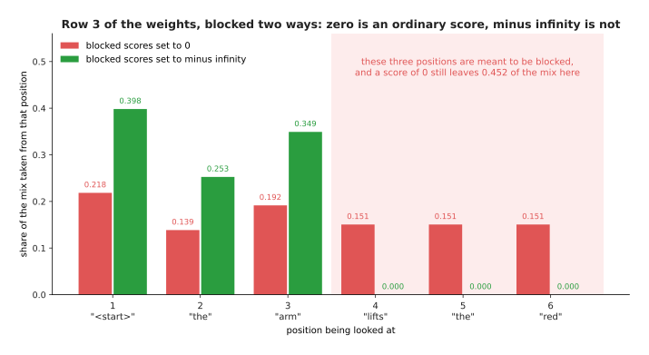
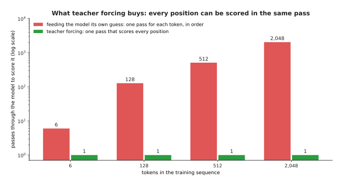
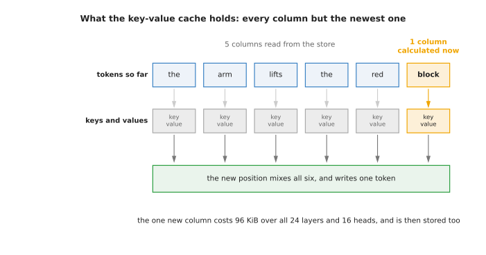
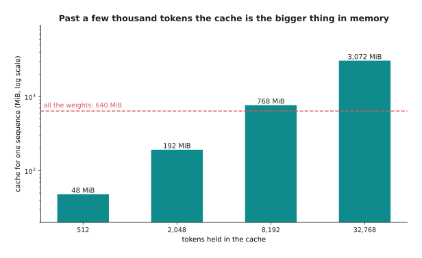
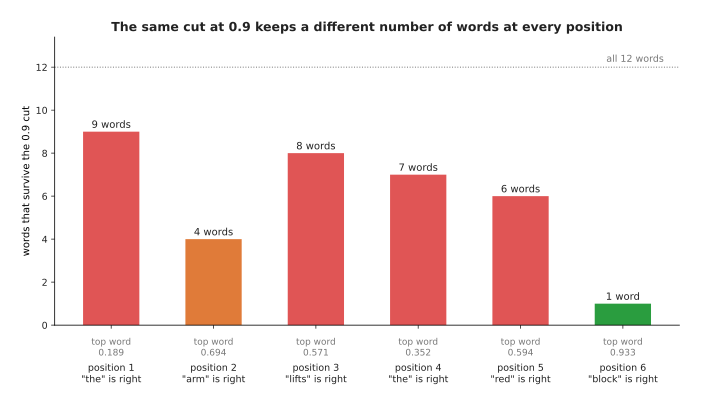
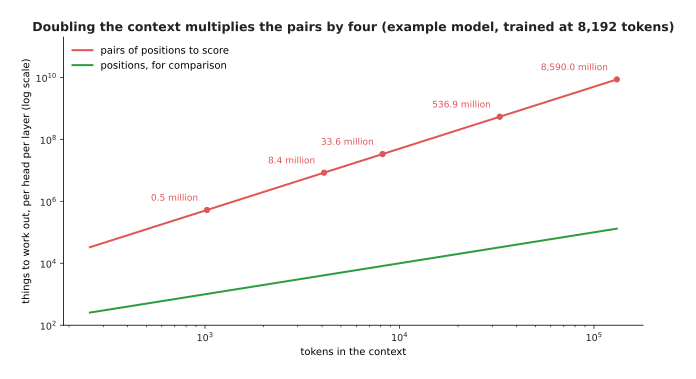
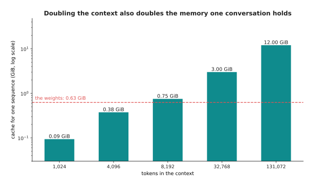
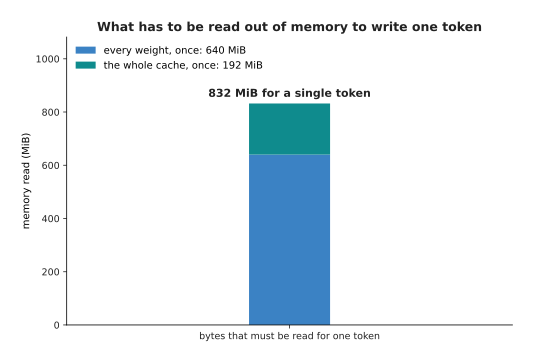
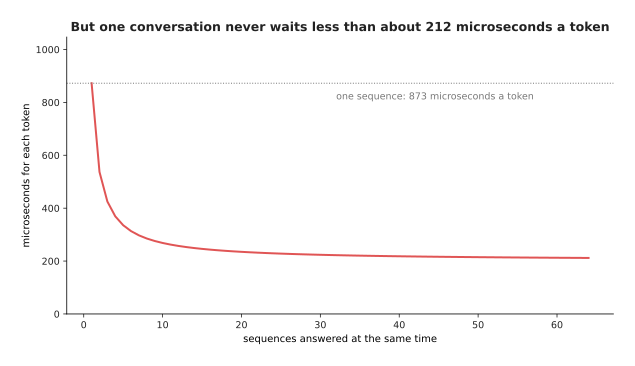

# Training and running a transformer

The page before this one, [a transformer block](02_a-transformer-block.md),
built one block out of a normalisation step, attention, a residual add and a
feed-forward part. It then stacked those blocks on top of each other to make a
model. A stack of blocks is only a shape. The numbers inside it mean nothing
until somebody has trained them, and even a trained stack does nothing until
somebody runs it. So this page answers two questions. The first question is what
a transformer is asked to get right while it is being trained. The second
question is what happens, step by step, when a trained transformer writes an
answer.

The two jobs have different shapes. Training reads a whole piece of text in one
pass, and it scores every position in that text at the same moment. That suits
hardware which does many small calculations at the same time. Running the model
is different, because the model writes one token at a time and each token has to
wait for the token before it. Almost everything that is awkward about these
models comes out of that difference. The cost of a long conversation comes from
it, and so does the reason a reply arrives slowly.

This page is written for a reader who has already read
[attention](01_attention.md) and [a transformer
block](02_a-transformer-block.md), so it does not explain attention, queries,
keys, values, heads or the block again. It also assumes that you know what a
[token](../05_turning-the-world-into-numbers/01_tokens-and-embeddings.md) is and
what a [loss](../03_how-training-works/01_the-score-of-being-wrong.md) is. By the
end of the page you will know how a transformer is scored while it trains, what
stops it from reading the answer it is being asked for, what one training step
holds in memory, what a key-value cache is and what it costs, how the next token
is chosen, and why writing an answer is slow.

Every number in the pictures below was calculated by
`docs/diagrams/the_transformer_2.py`, and that program prints each number as it
draws. The example sentence, its twelve-word vocabulary and the model's raw
outputs for that sentence are simulated. They are drawn from a random number
generator with a fixed starting value, and the right answer at each position is
then given a boost, so that the model looks part-way trained. Everything done
with those numbers after that is real arithmetic. The memory figures and the
time figures come from one stated example model of 24 layers and one stated
example accelerator, which is a chip built to do many multiplications at once. No
real product and no published model is described anywhere on this page.

## Contents

1. [Next-token prediction: the job that trains the whole stack](#1-next-token-prediction-the-job-that-trains-the-whole-stack)
2. [The causal mask: what stops a position reading its own answer](#2-the-causal-mask-what-stops-a-position-reading-its-own-answer)
3. [Teacher forcing, and what one training step holds](#3-teacher-forcing-and-what-one-training-step-holds)
4. [Running the model one token at a time, and the key-value cache](#4-running-the-model-one-token-at-a-time-and-the-key-value-cache)
5. [Choosing the next token: temperature, top-p and why greedy is not always best](#5-choosing-the-next-token-temperature-top-p-and-why-greedy-is-not-always-best)
6. [The context window, and what makes generation slow](#6-the-context-window-and-what-makes-generation-slow)
7. [Where to read next](#7-where-to-read-next)
8. [Using it in Python](#8-using-it-in-python)

---

## 1. Next-token prediction: the job that trains the whole stack

A stack of transformer blocks turns a row of tokens into a row of vectors, with
one vector for each position. The training job decides what those vectors have to
mean. Almost every transformer that reads text is trained on the same job, and
that job is called **next-token prediction**. The job works like this. The model
turns the vector at each position into a chance for every token in its
vocabulary, where the vocabulary is the fixed list of tokens the model knows.
Then the model is scored on the chance it gave to the token that really came
next.

The important part of this job is that it happens at every position at the same
time. A sentence of six tokens is therefore not one question with one answer.
Position one is asked which token follows the start marker, position two is asked
which token follows the first word, and so on until the end of the sentence. This
means that six tokens give six separate questions.

The picture below shows those six questions for one short sentence. The top row
is what the model is given, and the bottom row is what it must produce.


The sentence "the arm lifts the red block" gives six scored predictions in one pass, because the row that goes in is the same sentence moved along by one place.

The row that goes in and the row that must come out are the same sentence, with
one row moved by one place against the other. This is why the job costs nothing
to prepare. Any piece of ordinary text already contains its own right answers, so
nobody has to write a label by hand.

Each of those six questions is scored in the same way. The model gives a chance
to every token in the vocabulary. You then pick out the chance it gave to the
token that was really there. The loss at that position is minus the natural
logarithm of that chance. The loss is measured in a unit called the nat, which is
simply the unit you get when you use the natural logarithm rather than a
logarithm to base 2.

The next picture puts those six scores side by side. The table on the left gives
one row for each position, and the bar chart on the right draws the same six
losses so that you can compare them.


The simulated model gives the right word a chance of 0.101 at the first position and 0.933 at the last position, and the six losses have an average of 1.31.

Reading down that table shows what a part-trained model looks like. The model is
almost certain about "block" after "red", because it gives that word a chance of
0.933 and pays a loss of only 0.07. However, the model is lost at the third
position, where the right word "lifts" gets a chance of 0.053 and so costs 2.94.
The average of the six numbers is 1.31, and that average is the loss for this
sentence. Training then changes every weight by a small amount so that this
average becomes smaller.

The picture below opens up two of those positions. Each panel shows the chance
the model gave to each of the twelve words, and the right word is marked.


At position 4 the model's favourite word is "lifts" with a chance of 0.352, while the right word "the" gets only 0.189, and at position 6 the model puts 0.933 on the right word.

Comparing the two panels shows something about the loss. The loss looks only at
the chance given to the one right word. The model may spread the rest of its
belief over any other words without being punished for it. For example, position
4 still costs 1.67, even though the model was close to the right answer.

The last two pictures of this section explain why this job is used on very large
amounts of text. The first picture compares two ways of getting training signals
out of the same 1,000 tokens, where a training signal means one question with a
known right answer.


If a person wrote one label for each twenty-token sentence, then 1,000 tokens of text would give 50 training signals, while next-token prediction gives 1,000 signals from the same text.

The second picture asks whether that advantage shrinks as the amount of text
grows. It draws the same two counts for text sizes from one thousand tokens up to
ten million tokens.



The two lines stay the same distance apart at every size, because 10,000,000 tokens give 500,000 sentence labels and 10,000,000 next-token signals, which is the same factor of twenty.

This is why the job scales to large amounts of text. Asking a person to label
each sentence gives 50 signals from 1,000 tokens. Asking every position to
predict the following token gives 1,000 signals from the same 1,000 tokens. That
ratio of twenty to one stays the same however much text you use. The next section
explains the one piece of machinery that keeps this job honest, because a
position that could look forwards would simply read the answer it is being asked
for.

---

## 2. The causal mask: what stops a position reading its own answer

Scoring every position at the same time only works if no position can see the
token it is being asked to predict. That is a real danger, because attention lets
every position look at every other position in the same row. The repair is called
the **causal mask**. A mask is a rule applied inside attention that blocks
certain pairs of positions. This particular mask blocks every pair where the
position doing the looking comes earlier than the position being looked at. It is
called causal because it lets information travel only in the direction that time
travels.

The picture below draws every pair for a sentence of six positions. Read it by
taking a row, which is the position doing the looking, and running along that row
to a column, which is the position being looked at.


Of the 36 possible pairs of positions, 21 are allowed, and the 15 blocked pairs are exactly the ones that would let a position see a token it has not reached yet.

Every cell on the diagonal line is allowed, because a position may always look at
itself. Every cell to the right of the diagonal is blocked. This leaves 21
allowed pairs out of 36. The shape matters more than the exact number, because a
sequence of any length keeps a little over half of its pairs.

The mask is applied after attention has calculated its scores and before the
softening step that [attention](01_attention.md) describes, where the softening
step turns a row of scores into weights that add up to 1. That order matters. The
next picture shows the same six positions before and after the mask is applied.


The blocking happens before the softening, so each row of the right-hand grid still adds up to 1 using only the positions that were allowed.

The blocked scores are set to minus infinity rather than to zero. This matters,
because the softening step raises every score to a power of e, and e raised to
minus infinity is exactly zero. A score of zero is not special in any way,
because e raised to the power zero is 1, so a blocked position would keep an
ordinary positive weight and the mask would do nothing at all. The picture below
shows row three of the grid under both treatments.



Setting the blocked scores to zero still leaves 0.452 of position 3's mix coming from the three positions it is not allowed to see, while setting them to minus infinity leaves 0.398, 0.253 and 0.349 on the three allowed positions and exactly zero on the others.

The next picture shows why any leak of that kind destroys the training job. It
draws the weights position 3 would use with the mask and the weights it would use
without the mask.


Without the mask, position 3 would take 0.197 of its mix from position 4, and position 4 holds the word "lifts", which is the word position 3 is being asked to predict.

This is the whole argument for the mask, and it is worth reading twice. Position
3 has to predict "lifts", and position 4 holds "lifts" as its own input. An
unmasked model would therefore put 0.197 of its weighted mix on the answer
itself, and it would put more than half of its weight, 0.503, on that position
and the positions after it. The loss would fall almost to nothing during
training, and the model would then be useless, because at the time you actually
use the model the later tokens do not exist yet. The mask is what makes training
match the way the model will be run. The next section follows that same idea one
step further.

---

## 3. Teacher forcing, and what one training step holds

The mask decides what a position may look at. There is a second decision of the
same kind, and it is about what a position is actually given as its input. During
training the model is always given the true token at every position. It is given
the true token even where its own guess at the position before was wrong. This
practice is called **teacher forcing**, because the true tokens come from the
text rather than from the model, in the way that a teacher would supply them.

The picture below shows all three rows for the example sentence: what goes in,
what the model guessed, and what it is scored against.


The simulated model guesses correctly at 3 of the 6 positions, and the three wrong guesses change nothing about what the next position is given.

Teacher forcing is what lets all six positions be calculated in one pass. The
input at every position is known in advance, so it does not depend on anything
the model produced. Without teacher forcing, the model would have to be run once
for every token, with its own output put back in each time. The picture below
counts those passes for four sequence lengths.



Teacher forcing scores a sequence of 2,048 tokens in a single pass, while feeding the model its own guesses would need 2,048 passes, and each of those passes would have to wait for the one before it.

Teacher forcing has a cost, and the cost is that training and running then
differ. At training time one wrong guess costs one loss and nothing more. At
running time a wrong token stays in the row, and everything the model writes
afterwards is built on top of that wrong token. The next picture shows what that
does to a whole answer.


A model that is right 90 per cent of the time on each token gets a whole 20-token answer right only 12 per cent of the time, while 99 per cent per token gives 82 per cent.

Being right on each token is not the same as being right on an answer, and the
gap between the two grows with the length of the answer. At 60 tokens, the model
that is right 90 per cent of the time per token produces a perfect answer only
0.18 per cent of the time. This is why a per-token loss makes a model look better
than it is, and it is why a model is finally judged on whole answers rather than
on single tokens.

One training step does more than one pass forwards, because it also calculates
how every weight should change. Those calculations are where the memory is spent.
The example model used throughout this page has 24 layers, 16 heads of 64 numbers
each, a width of 1,024, a feed-forward width of 4,096 and a vocabulary of 32,768.
Those sizes come to 335,594,496 parameters, where a parameter is one trainable
number, and each parameter is held in two bytes.

The picture below splits the memory of one training step into its five parts, and
then puts the total beside the memory you would need in order to run the same
model.


Training the example model holds 6.88 GiB, which is 11 times the 0.63 GiB that running it would need.

Reading the bars from left to right gives the cost of training. The weights take
0.63 GiB. Their gradients, which are the numbers that say how each weight should
change, take the same amount again. The optimiser, which is the program that
applies those changes, keeps two running numbers for every parameter at four
bytes each, and so it takes 2.50 GiB. A careful full-precision copy of the
weights takes 1.25 GiB, and it is kept because repeatedly adding small changes to
a two-byte number loses them. Finally, the values calculated on the way forwards
have to be kept for the way backwards, and these saved values are called
activations. For a batch of 8 sequences of 512 tokens, with ten saved values per
layer, the activations come to 1.88 GiB. The sum of the five parts is 6.88 GiB.
Running the model needs only the weights. The next section shows why running the
model is nevertheless the harder job to do quickly.

---

## 4. Running the model one token at a time, and the key-value cache

Training reads a whole sequence in one pass, as the section above described. A
trained model, however, is used to write text that does not exist yet, so it has
to work in a loop. It reads the prompt, which is the text the user supplied. It
produces one token. It adds that token to the end of the row. Then it reads the
whole row again to produce the next token.

The picture below follows three such steps, starting from a prompt of three
tokens. The new token at each step is marked.


Each step adds one token and has to take account of every token before it, so step 3 reads 5 earlier positions in order to write a single word.

Done in the obvious way, this is very wasteful. The model would push all five
earlier positions through all 24 layers again in order to add one token, even
though nothing about those five positions has changed. The repair is called the
**key-value cache**, and it is often shortened to KV cache. A cache is a store of
results that were calculated once and are kept so that they do not have to be
calculated again. This cache keeps the key and the value that every layer
calculated for every position. A new token then calculates only its own key and
value, and it reads the rest from the store.

The picture below shows what the store holds at one step, and what the new
position still has to calculate for itself.



At a step with six tokens in the row, five columns of keys and values come straight out of the store, and only the newest column is calculated, which costs 96 KiB across all 24 layers and 16 heads.

The next picture counts the work the cache removes. The left panel counts how
many times a position has to be pushed through the whole stack, and the right
panel gives the saving as a factor.


Generating 512 tokens without a cache takes 131,328 passes of a position through the stack, and with a cache it takes 512, which is 256 times less work.

The saving grows with the length of the answer. The wasted work is the sum of all
the lengths the model passes through, and that sum grows with the square of the
number of tokens, while the cached version grows in a straight line. So at 4,096
tokens the cache does 2,048 times less work. Nobody runs these models without a
cache, and that is why the cost of the cache itself is worth knowing exactly.

The picture below calculates that cost one factor at a time, for a single token.


One token of the example model costs 98,304 bytes of cache, which is 96 KiB.

The arithmetic is worth doing slowly, because the result surprises people. The
model keeps a key and a value, which is two things. It keeps them for each of 24
layers, and for each of 16 heads, and each head holds 64 numbers, and each number
takes two bytes. Two times 24 times 16 times 64 times 2 is 98,304 bytes for a
single token. The next picture multiplies that figure by four conversation
lengths and compares the result with the size of the weights.



At 8,192 tokens the cache holds 768 MiB, which is already larger than the 640 MiB of weights, and at 32,768 tokens it holds 3,072 MiB.

The picture below shows what happens when one machine answers several
conversations at the same time.


The weights are paid for once however many conversations are running, but every conversation of 2,048 tokens adds another 192 MiB of cache, so 64 conversations need 12.63 GiB in total.

This is the shape of the cost when a model serves several people at once. The
weights are shared and the cache is not. So at 64 conversations the caches take
12.00 GiB of the 12.63 GiB total. Having calculated what one step costs, the next
question is what one step produces, and what it produces is not a token but a set
of chances.

---

## 5. Choosing the next token: temperature, top-p and why greedy is not always best

A generation step ends with the same thing a training position ends with, which
is one plain number for every token in the vocabulary. Those raw numbers are
called logits, and the step that turns them into chances is called the softmax.
Both are explained on [the score of being
wrong](../03_how-training-works/01_the-score-of-being-wrong.md). Picking an
actual token out of those chances is called **sampling**, and it is a separate
decision that the model does not make for you.

The picture below shows one position twice: once as the raw numbers that come out
of the last layer, and once as the chances those numbers turn into.


The raw outputs at this position run from plus 2.59 for "lifts" down to minus 2.61 for "block", and the softmax turns them into twelve chances that add up to 1.

The first control you have over sampling is **temperature**. The temperature is a
single number, and every raw output is divided by it before the softmax. Dividing
by a number smaller than 1 spreads the raw outputs further apart, which makes the
model more certain about its favourite word. Dividing by a number larger than 1
pulls the raw outputs together, which makes the model less certain.

The picture below draws the same twelve words three times, once for each of three
temperatures. The spread of each set of chances is given in nats, and a larger
spread means the chance is shared more evenly.


At a temperature of 0.5 the favourite word takes 0.620 of the chance, at 1.0 it takes 0.352, and at 1.5 it takes 0.253, while the spread grows from 1.20 to 2.14 nats.

What you choose with the temperature is how often the model will say something
other than its favourite word. A low temperature gives steady and repetitive
text, which suits a job with one right answer, such as reading a number off a
label. A high temperature gives varied text, but it also raises the chances of
the words at the bottom of the list. For example, the least likely of these
twelve words rises from almost nothing at a temperature of 0.5 to 0.0079 at a
temperature of 1.5. That is one chance in 127 of a plainly wrong word at every
single token, and over a long answer those chances add up until the answer stops
making sense.

The second control cuts the bottom of the list away instead of reshaping it. The
picture below sorts the twelve words by chance, adds the chances up from the top,
and keeps only the words needed to reach a total of 0.9.


Cutting at a running total of 0.9 keeps 7 of the 12 words, removes the other 5, and divides their chance among the words that are left.

That is the job of **top-p**, which is also called nucleus sampling. It sorts the
words by chance, adds them up from the top, and keeps only the words needed to
reach a stated total such as 0.9. Here the running total reaches 0.936 after
seven words, so those seven words are kept and their chances are divided again so
that they add up to 1, which raises the favourite from 0.352 to 0.376.

The number of words that survive is not fixed, because it moves with the model's
certainty. The picture below applies the same cut at 0.9 to all six positions of
the example sentence.



The same cut at 0.9 keeps 9 words at position 1, where the top word has a chance of only 0.189, and keeps a single word at position 6, where the top word has a chance of 0.933.

This is the useful property of top-p. Where the model is certain, the first word
alone passes the total of 0.9 and nothing else survives, so the cut cannot
introduce a mistake. Where the model is uncertain, many words survive, so the
model is still free to choose among them.

The last choice is whether to sample at all. Always taking the single most likely
word is called greedy decoding. It is the obvious thing to do, but it is not the
same as finding the most likely answer. The picture below shows why, using two
steps of generation.


Taking the best first token, "lifts" with a chance of 0.352, leads to a best pair worth 0.0647, while the second-best first token, "the" with a chance of 0.189, leads to a pair worth 0.1141.

The tree shows the problem over two steps, and the problem gets worse over
twenty. Greedy decoding takes the word with the highest chance now, without
knowing that the word in second place leads to a much better continuation. The
chance of a whole answer is the chances of its tokens multiplied together, so the
greedy path can end up less likely than a path it rejected. Greedy decoding also
repeats itself, because the most likely word after a phrase is often the word
that starts that same phrase again. Sampling with a temperature and a top-p cut
avoids both problems most of the time, and the price is that you get a different
answer on each run.

---

## 6. The context window, and what makes generation slow

Sampling decides which token comes out. The last thing to understand is how many
tokens the model can hold in front of it, and how fast those tokens arrive. The
number of tokens a model will accept at once is called its **context window**.
Three separate things set that number. The first is the length the model was
trained at, because the scheme that tells the model where each token sits, which
is described on [tokens and
embeddings](../05_turning-the-world-into-numbers/01_tokens-and-embeddings.md),
has only been used up to that length. The second is the arithmetic, because
attention has to score every allowed pair of positions. The third is memory,
because the cache has to be held for every token in the window.

The picture below measures the second of those three things. It counts the
allowed pairs of positions against the length of the context, with the number of
positions drawn underneath for comparison.



A context of 8,192 tokens has 33.6 million allowed pairs in every head of every layer, and a context of 131,072 tokens has 8,590 million pairs.

The picture below measures the third thing, which is the memory. It gives the
size of the cache for one conversation at the same five lengths.



A context of 8,192 tokens holds 0.75 GiB of cache for one conversation, and a context of 131,072 tokens holds 12 GiB.

Doubling the context doubles the memory and multiplies the pair work by four. The
pair work is the more serious of the two, because the number of pairs grows with the
square of the length while everything else grows in a straight line. The next
page examines that cost in detail.

What happens past the end of the window is simpler and more disappointing. The
model has no slot for a token beyond the window. So either the program refuses
the request, or, far more often, it quietly removes the oldest tokens to make
room. The picture below draws one such conversation against the window that holds
it.


A conversation of 3,000 tokens inside a window of 2,048 loses its oldest 952 tokens, which is 32 per cent of what was said, and nothing in the reply says so.

This matters for a robot, because the instruction that set the task is usually
the oldest thing in the conversation, so it is removed first. The model never
complains about this, because from its point of view the conversation simply
begins where the window begins.

The last question is speed, and the answer is not the one most people expect.
Writing one token takes very little arithmetic. However, it requires the machine
to read every weight in the model out of memory, together with the whole cache.
The picture below compares those two times for a single token.


Writing one token of the example model at a context of 2,048 does about 872 million operations, so on the example accelerator the arithmetic takes 8.7 microseconds while the reading takes 873 microseconds.

The picture below shows where that reading goes. It splits the bytes read for one
token into the weights and the cache.



Writing a single token at a context of 2,048 reads 832 MiB, which is every one of the 640 MiB of weights plus the whole 192 MiB cache.

Reading takes 100 times as long as the arithmetic, so the machine spends almost
all of a generation step waiting for memory while its arithmetic units do
nothing. This is what people mean when they say that generation is limited by
memory bandwidth rather than by arithmetic, where memory bandwidth means how many
bytes a second the machine can read. It explains why a bigger model is slower in
direct proportion to its size. It also explains why holding the numbers in fewer
bytes, which [making a model smaller and
faster](../07_pretraining-and-adapting/04_making-a-model-smaller-and-faster.md)
describes, speeds generation up by so much.

There is one way to get more out of the same reading, which is to answer several
conversations at the same time. The weights are read once per step, whether one
sequence is waiting for them or sixty-four sequences are. The picture below
counts the tokens that come out of the machine in total.


Answering 8 conversations at once gets 3,506 tokens a second out of the same machine instead of 1,146, and 64 conversations get 4,721 tokens a second.

That total is what the service gets. The person waiting for one reply gets
something different, and the picture below measures it.



The wait for one conversation's next token falls from 873 microseconds at one sequence, but it never drops below about 212 microseconds, because each sequence still has its own cache that has to be read.

---

## 7. Where to read next

- [Why the transformer won](04_why-the-transformer-won.md) is the next page, and
  it asks what this design does that a convolution and a recurrent network could
  not, and what is being done about the costs counted here.
- [Self-supervised
  pretraining](../07_pretraining-and-adapting/01_self-supervised-pretraining.md)
  shows the other training jobs of the same family, which make labels out of
  unlabelled pictures and sound.
- [Scale, data and
  compute](../07_pretraining-and-adapting/02_scale-data-and-compute.md) turns
  the memory and time arithmetic here into the cost of a real training run.
- [Large language
  models](../10_language-and-multimodal-models/01_large-language-models.md)
  describes what the finished thing can and cannot do.
- [Language models](../../07_learned-models/07_language-models/01_overview.md)
  in the catalogue book lists the named models of this kind that a robot uses,
  and what each costs to run.

---

## 8. Using it in Python

The sections above calculated a loss, a mask and a sampling rule by hand. In
PyTorch each of those is one or two lines. The last block below uses the six
largest raw outputs from section 5 rather than all twelve, so its chances differ
a little from the figures above.

```python
import torch
from torch.nn import functional as F

# Section 1: one sentence of six tokens, cut into inputs and targets.
tokens = torch.tensor([[5, 1, 8, 5, 3, 9]])
inputs, targets = tokens[:, :-1], tokens[:, 1:]
print(inputs.shape, targets.shape)      # torch.Size([1, 5]) torch.Size([1, 5])

# Section 1: the loss a model that has learnt nothing pays on those five.
vocab = 12
nothing_learnt = torch.zeros(5, vocab)                       # every word equally likely
print(round(float(F.cross_entropy(nothing_learnt, targets[0])), 4))   # 2.4849 = log(12)

# Section 2: the causal mask, and what it leaves of an even set of scores.
n = 6
allowed = torch.tril(torch.ones(n, n, dtype=torch.bool))
print(int(allowed.sum()))                                    # 21 of the 36 pairs
weights = torch.softmax(torch.zeros(n, n).masked_fill(~allowed, -torch.inf), dim=-1)
print([round(v, 3) for v in weights[2].tolist()])  # [0.333, 0.333, 0.333, 0.0, 0.0, 0.0]

# Section 5: temperature on one set of raw outputs, then the top-p cut.
raw = torch.tensor([2.59, 1.97, 1.69, 1.37, 0.74, 0.64])
for t in (0.5, 1.0, 1.5):
    print(t, [round(v, 3) for v in torch.softmax(raw / t, dim=-1).tolist()])
chances = torch.softmax(raw, dim=-1)                         # already in order
print(int((chances.cumsum(0) < 0.9).sum()) + 1)              # 5 words kept at p = 0.9
```

The library gives you the parts rather than the policy. `F.cross_entropy`
combines the softening and the logarithm into one numerically careful step, so
you pass it the raw outputs and never calculate the chances yourself.
`torch.nn.functional.scaled_dot_product_attention` applies the mask for you if
you pass `is_causal=True`, and that also lets it skip the blocked half of the
work rather than calculating it and then throwing it away. Hugging Face's
`transformers` package gives you the whole loop, cache included, behind one
`model.generate` call.

What you still have to decide is everything this page spent its sections on. You
choose how long the training sequences are, which sets both the cost of a step
and the longest text the model will ever have seen. You choose the temperature
and the top-p cut, which change the character of the output more than most
changes to the model do. You choose the context window you will serve, which
fixes how much cache memory each conversation takes. You also choose how many
conversations to answer at once, which trades one person's waiting time against
the number of people served.

The one thing you cannot decide away is the shape of the work. Training stays a
wide pass over many positions at once, and generation stays a narrow loop that
reads the whole model from memory for every single token. Every design on the
next page is an attempt to make that second shape cheaper.
