# Why the transformer won

The page before this one, [training and running a
transformer](03_training-and-running-a-transformer.md), showed what a
transformer is trained to do and what happens when it writes an answer, and it
counted the costs of both. This page asks the question that should always follow
a design: why this one rather than the obvious alternative? Almost every model a
robot uses today has transformer blocks somewhere inside it, and that is a
strange thing to accept without knowing what the designs it replaced could not
do.

So this page names the alternatives and shows, with arithmetic rather than
opinion, what each of them cannot do. The two that matter are the convolution,
which reads a small window of neighbouring positions, and the recurrent network,
which walks along a sequence carrying a summary as it goes. Each is still a
sensible idea, and the convolution is still used every day in vision, but
neither can do the one thing attention does, which is to let any position affect
any other position in a single layer.

The page is then honest about the price. Attention is expensive in a way that
grows with the square of the length, its cache grows without limit, and a
generation step spends almost all its time reading memory. Those costs are real,
people are attacking all of them, and the second half of the page goes through
the attacks in the order they change the arithmetic, ending with the designs
that give up attention in most of their layers and what that costs them.

It is written for a reader who has read the three pages before it in this
chapter, so it does not explain attention, the block, the causal mask or the
key-value cache again. It also assumes you have met the
[convolution](../02_inside-a-network/04_what-a-network-can-learn.md), which was
introduced as the first special layer. Every number in the pictures comes from
`docs/diagrams/the_transformer_2.py`, which prints them, and the memory and time
figures use the same stated example model of 24 layers, 16 heads of 64 numbers,
width 1,024 and two bytes a number that the previous page used, together with
one stated example accelerator. No real product or published model is described
by any figure here.

## Contents

1. [What a convolution could not do](#1-what-a-convolution-could-not-do)
2. [What a recurrent network could not do](#2-what-a-recurrent-network-could-not-do)
3. [What the transformer costs](#3-what-the-transformer-costs)
4. [Cutting the cost of attention](#4-cutting-the-cost-of-attention)
5. [Carrying a running summary instead](#5-carrying-a-running-summary-instead)
6. [What is still open](#6-what-is-still-open)
7. [Where to read next](#7-where-to-read-next)
8. [Using it in Python](#8-using-it-in-python)

---

## 1. What a convolution could not do

Before transformers, the usual way to handle a sequence of any kind was a
convolution, which slides a small filter along the sequence so that each
position mixes itself with a few neighbours. A convolution is cheap, it uses the
same handful of weights everywhere, and it is very good at local patterns, which
is why it still reads pictures well. Its limit is simple to state: in one layer
a position can only reach the neighbours its filter covers, so to join two
distant positions you have to stack layers until their windows overlap.

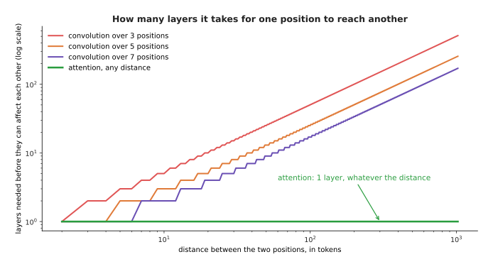

To let two positions 512 tokens apart affect each other, a filter three wide needs 256 layers, a filter seven wide needs 86, and attention needs one.

Those numbers are the whole argument. A filter three wide extends its reach by
one position each side per layer, so the distance it can cross grows in a
straight line with depth, while the sequences people want to read grow far
faster than anyone wants to stack layers.

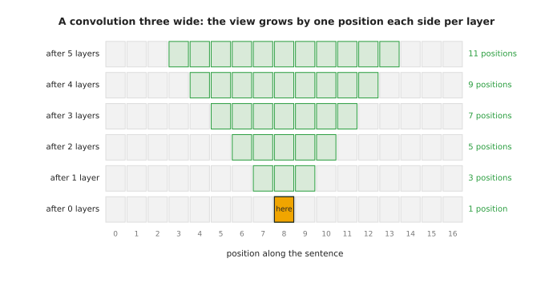

Starting from one position, a stack of filters three wide sees 1, then 3, then 5, then 7, then 9, then 11 positions, so it takes 8 layers before the middle position has seen all 17.

The picture shows the growth as a cone, and the cone is the problem, because
information from the far end of a sentence has to be passed up through every
layer in between, being mixed with everything else at each step, before it can
reach the position that needs it. A word that changes the meaning of a sentence
forty tokens later is not something a shallow convolution can use at all.

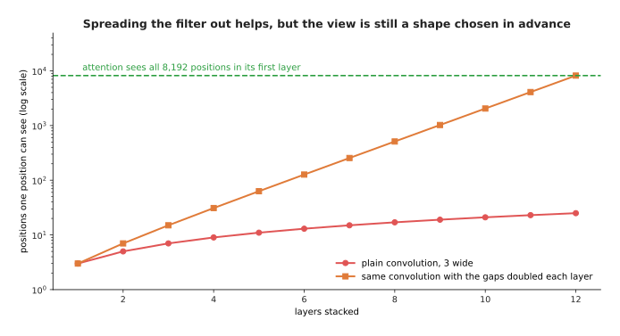

Doubling the gaps in the filter each layer turns a reach of 25 positions after 12 layers into 8,191, so covering a context of 8,192 takes 13 such layers instead of 4,096 plain ones.

There is a well-known repair, which is to spread the filter out by leaving gaps
between the positions it reads and doubling those gaps at each layer, and the
plot shows that it works, since the reach then doubles per layer instead of
growing by two. What it does not fix is that the pattern of what each position
reads is chosen by whoever designed the network and is the same for every input.
Attention chooses its pattern from the content, so the word that needs the far
end of the sentence can look at the far end of the sentence, and the next word
can look somewhere else. That is the thing a convolution cannot do at any depth,
and the next section shows that the other obvious alternative fails for a
completely different reason.

---

## 2. What a recurrent network could not do

The other way to read a sequence is to walk along it from the start, carrying a
summary of everything seen so far and updating that summary at each position.
Networks built this way are called recurrent, and they held this job for years,
so it is worth one section to say exactly why they lost it. They are no longer
the thing to learn, and the rest of this book does not use them, but the two
reasons they lost both matter for what comes later on this page.

The first reason is about hardware rather than accuracy. A recurrent layer
cannot start position two until position one has finished, because position two
needs the summary that position one produced.

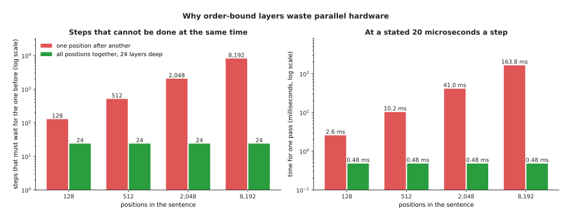

Reading 2,048 positions one after another takes 2,048 steps that cannot overlap, which at a stated 20 microseconds a step is 41.0 milliseconds, while a transformer does 24 layer steps whatever the length, which is 0.48 milliseconds.

The comparison is not quite fair in the arithmetic, because the transformer's 24
steps are each far larger pieces of work than the recurrent network's 2,048
steps. That is exactly the point, though, because a graphics processing unit does
thousands of multiplications at the same moment, so one enormous step fills it
and two thousand tiny ones leave most of it with nothing to do.

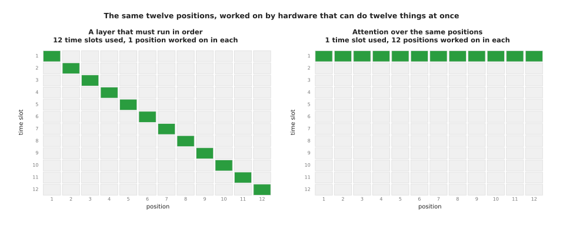

The recurrent layer uses 12 time slots with 1 position worked on in each, while attention uses 1 time slot with all 12 positions in it.

That picture is the shape of the whole difference. Training a transformer can
use a batch of positions, and a batch of sequences on top of that, to fill the
hardware, whereas a recurrent network can only widen the batch of sequences and
must still take the positions in order. When the quantity of text being trained
on grew into the trillions of tokens, a design that leaves most of the machine
idle stopped being affordable.

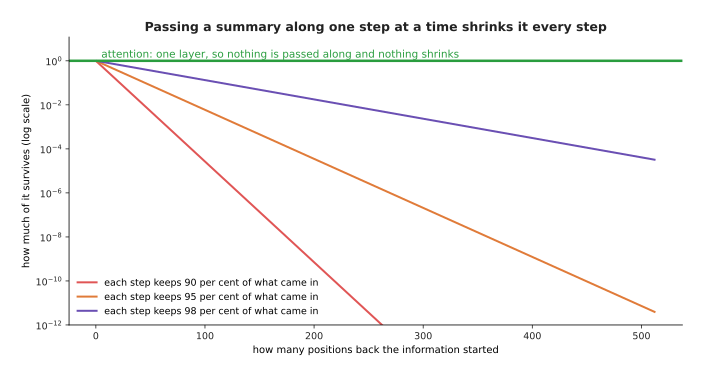

If each step keeps 98 per cent of what came in, a signal from 100 positions back is down to 0.133 of its strength and one from 511 positions back is down to 0.0000328.

The second reason is about what survives the walk. Anything a recurrent network
learns from position one has to be carried through every position in between,
and each step multiplies it by something, so unless that something is extremely
close to 1 the signal shrinks away. Attention does not pass anything along,
because the position that needs an old token reads it directly in one layer, and
nothing shrinks. Various repairs were built for recurrent networks, with gates
that try to hold a value steady, and they helped, but they did not remove the
walk. Keep that curve in mind, because section 5 returns to it when the walk
comes back in a new form.

---

## 3. What the transformer costs

Attention bought the ability to link any two positions in one layer and to use
the whole machine at once, and the bill for both arrives in the same place,
which is that attention works out a score for every allowed pair of positions.
The previous page counted the pairs, and this section works out when they start
to dominate everything else the model does.

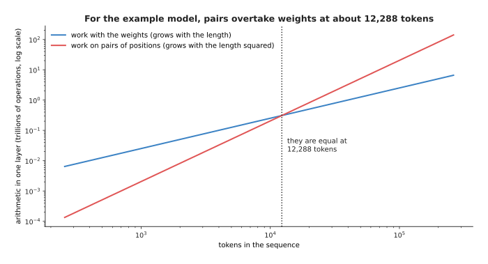

For a model of width 1,024, the work spent on pairs of positions passes the work spent on the weights at 12,288 tokens, which is twelve times the width.

The crossing point is worth remembering as a rule rather than a number, because
it is twelve times the width of the model for the shape used here. Below it, a
transformer is mostly a pile of matrix multiplies with its weights, and the
attention is a detail. Above it, the model is mostly attention, and the weights
are the detail.

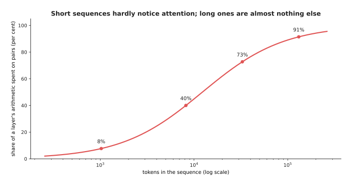

At 1,024 tokens only 8 per cent of a layer's arithmetic is spent on pairs of positions, at 8,192 tokens it is 40 per cent, and at 131,072 tokens it is 91 per cent.

This is why the quadratic cost was ignored for years and then suddenly was not.
Nobody minds a cost that is 8 per cent of the work, and everybody minds one that
is 91 per cent, so the length people wanted to use is what turned a known
weakness into the main problem. The memory behaves the same way.

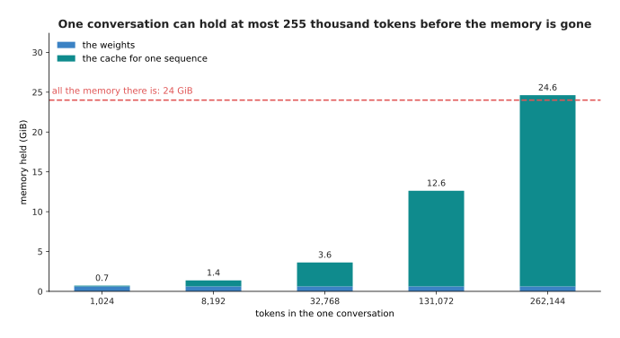

With a stated 24 GiB of memory and weights taking 0.63 GiB, one conversation can hold at most 255,316 tokens before the cache has eaten everything that is left.

The cache sets a hard ceiling that has nothing to do with whether the model
could understand a longer text, and it also makes the model slower as the
conversation goes on, because each new token has to read the whole cache.

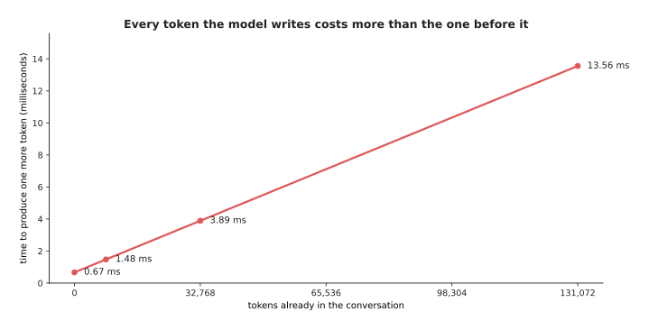

On the example accelerator a token costs 0.67 milliseconds at the start of a conversation, 1.48 milliseconds after 8,192 tokens and 13.56 milliseconds after 131,072, which is 74 tokens a second instead of 1,490.

A reply that starts quickly and then crawls is this curve, and a robot that holds
one long conversation all day will feel it. Three costs, then: the pairs grow
with the square of the length, the cache grows without limit, and each token
reads everything. The rest of the page is about what is being done to each.

---

## 4. Cutting the cost of attention

The first family of repairs keeps attention exactly as it is and simply forbids
most of the pairs. The simplest version is **sliding-window attention**, in
which a position may look only at itself and a fixed number of positions behind
it, so the allowed pairs form a band rather than a triangle.

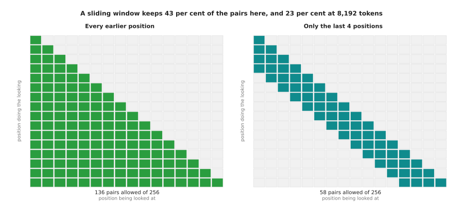

Over 16 positions a causal mask allows 136 pairs and a window of 4 allows 58, and over 8,192 positions a window of 1,024 allows 7.86 million pairs instead of 33.56 million, which is 23 per cent of them.

The saving grows with the length, because the band has a fixed width while the
triangle keeps widening, and the cache shrinks in the same proportion, since
nothing outside the window ever needs to be kept. The obvious objection is that
the model can no longer reach back beyond the window, and the answer is that one
layer cannot but a stack can.

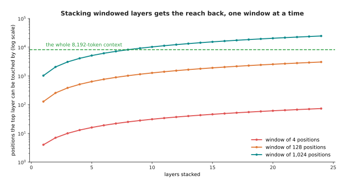

A window of 1,024 stacked 24 layers deep can be touched by a position 24,553 tokens back, because each layer moves the reach one window further.

The reach comes back, but it comes back in the weakened form that section 2
described, since information from far away now has to be passed up through
layers rather than read directly, and it is mixed with other things at every
step. That is the real cost of a window, and it is why released models that use
windows usually keep some layers that still attend to everything.

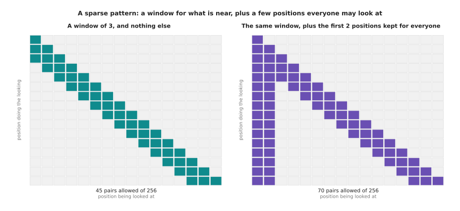

Keeping a window of 3 allows 45 of the 136 pairs, and adding the first 2 positions as ones everybody may look at brings it to 70.

That second grid is the idea behind **sparse attention**, which is any fixed
pattern of allowed pairs chosen in advance to be much smaller than the full
triangle. Mixing a local window with a few positions that everyone may read is
the most common choice, because it keeps nearby detail and keeps a route by
which anything can reach everything in one hop. The cost is the one named in
section 1, which is that the pattern is chosen by the designer rather than by
the content.

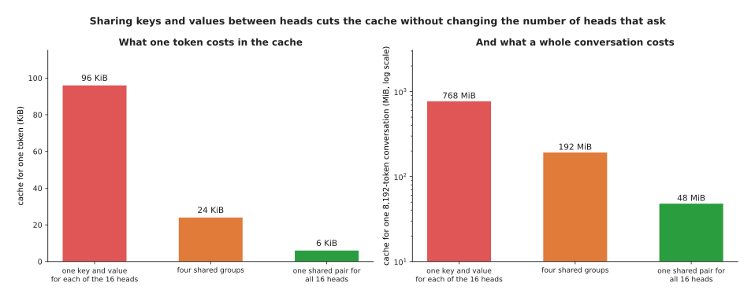

Sharing one key and value across four heads cuts the cache from 96 KiB a token to 24 KiB, and sharing one across all sixteen cuts it to 6 KiB, so an 8,192-token conversation holds 192 MiB or 48 MiB instead of 768 MiB.

A different and very cheap repair leaves the pairs alone and attacks the cache
directly. Each head normally has its own key and its own value, but there is no
rule that says so, and **grouped-query attention** gives each group of heads one
shared key and value while every head keeps its own query, so the heads still
ask different questions of the same stored material. **Multi-query attention**
is the extreme case with one shared pair for all the heads. The saving is exact
and large, the loss in quality is small, and that trade is good enough that
sharing is now the normal choice rather than the exception. Worth naming
alongside these is the family of careful implementations, of which FlashAttention
is the best known, which work the scores out in small blocks and never write the
whole grid to memory. They do not change the number of pairs at all, so they do
not move the curve in the first picture of section 3, but they remove the memory
that holding the grid used to need.

---

## 5. Carrying a running summary instead

Every repair in section 4 kept attention and removed some of its pairs. The other
line of work goes back to the idea section 2 rejected, the walk along the
sequence carrying a summary, and asks whether it can be rebuilt so that it keeps
the cheapness without the two faults. Designs of this kind are called
**state-space models**, and the best known of them is **Mamba**.

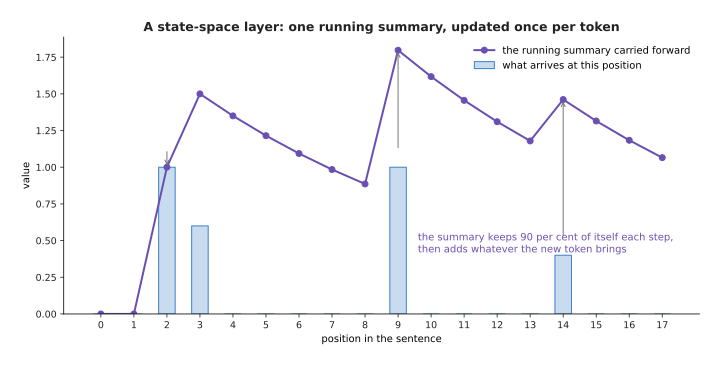

With a summary that keeps 90 per cent of itself each step, a value delivered at step 2 still counts 0.478 at step 9 and 0.206 at step 17.

A state-space layer is a running summary in exactly that sense. It holds a fixed
set of numbers, and at every position it shrinks what it is holding by some
amount, adds what the new token brings, and passes the result on. The arithmetic
drawn here is the simplest possible version, with one number and one fixed
shrinking rate, while a real layer carries many such summaries at once, usually a
few tens of numbers for each of the model's channels, and lets the input decide
how fast each one forgets. That last part, letting the content set the forgetting
rate, is what separates these designs from the recurrent networks of section 2,
and it is also what lets them be worked out with a parallel scan rather than a
strict walk, which is how they are trained on a whole batch of positions at once.

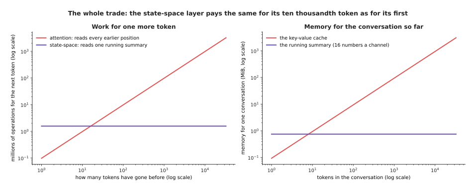

At 8,192 tokens an attention layer does 805 million operations for the next token and holds 768 MiB, while a state-space layer does 1.57 million and holds 0.75 MiB however long the conversation gets.

That flat line is the whole attraction. The cost of one more token does not
depend on how many tokens came before it, the memory never grows, and so the
ceiling in section 3 disappears. The question is what has been given up, and the
answer is exact and easy to show.

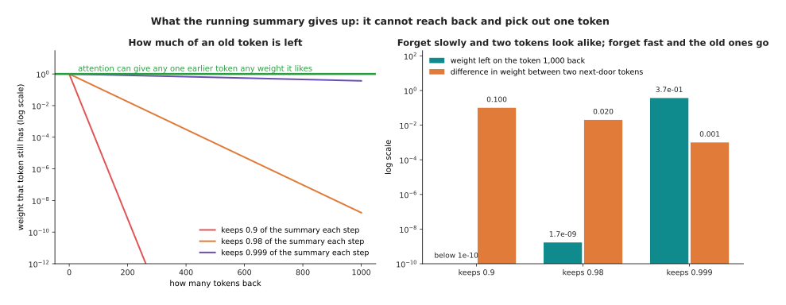

A summary that keeps 0.98 each step leaves a token from 1,000 back with 1.7 thousand-millionths of its weight, while one that keeps 0.999 holds 0.368 of it but then weighs two next-door tokens almost the same, with a difference of only 0.001.

The two panels together are the trade, and it cannot be escaped by choosing a
better rate, because if the layer forgets quickly the far past is gone, and if
it forgets slowly the far past survives but everything in it is blurred
together, since the weights on two tokens that sit next to each other then
differ by only 0.001 and nothing in the summary can tell them apart. Attention has neither problem, since it can put
whatever weight it likes on any single earlier token and leave the rest at zero,
which is exactly what is needed to find the one sentence in a long document that
answers a question.

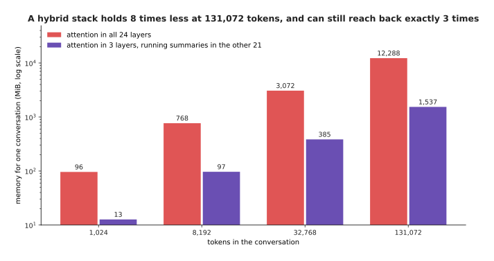

Keeping attention in 3 of the 24 layers and running summaries in the rest holds 385 MiB at 32,768 tokens instead of 3,072 MiB, which is 8 times less.

So the answer that is winning at the moment is to use both, in a **hybrid
architecture** that keeps a small number of attention layers and makes the rest
state-space layers. The few attention layers keep the ability to reach back and
pick out one token, the many cheap layers do the rest of the work, and the
memory follows the small number of attention layers rather than the large number
of layers. Published hybrids differ in how many attention layers they keep and
where they put them, and that ratio is the main thing their designers argue
about, because it is the dial between cost and exact recall.

---

## 6. What is still open

The repairs in the last two sections move the costs about rather than removing
them, and this section says plainly what is left. The first open thing is that a
long context is still slow to use even when it fits in memory, and the two halves
of the job are slow for different reasons.

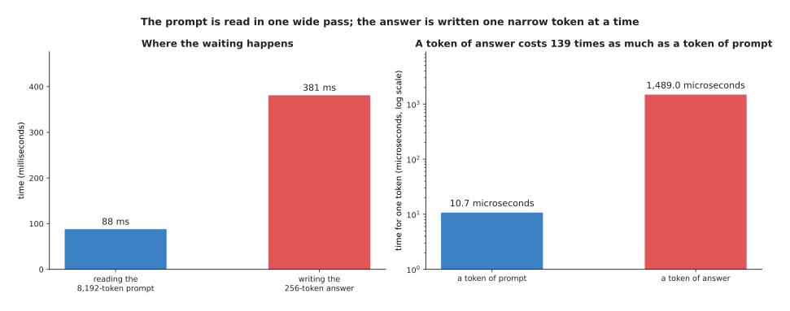

Reading an 8,192-token prompt takes 88 milliseconds because its arithmetic is one wide pass, while writing 256 tokens of answer takes 381 milliseconds, so a token of answer costs 139 times as much as a token of prompt.

Reading the prompt is limited by arithmetic, so it gets faster on a machine with
more arithmetic, while writing the answer is limited by memory reading, so it
does not. Nobody has removed that gap, and every trick that helps, such as
answering several conversations at once, helps the service rather than the person
waiting.

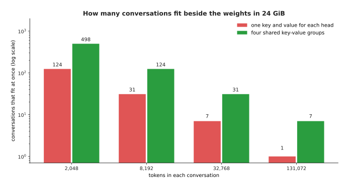

In a stated 24 GiB, 124 conversations of 2,048 tokens fit at once but only 7 of 32,768 tokens do, and sharing keys and values across four groups raises those to 498 and 31.

The second open thing is that long contexts and many users pull against each
other, because the memory that holds one conversation of 32,768 tokens is the
memory that would have held sixteen conversations of 2,048. Sharing keys and
values moves the line by a factor of four and does not change its shape.

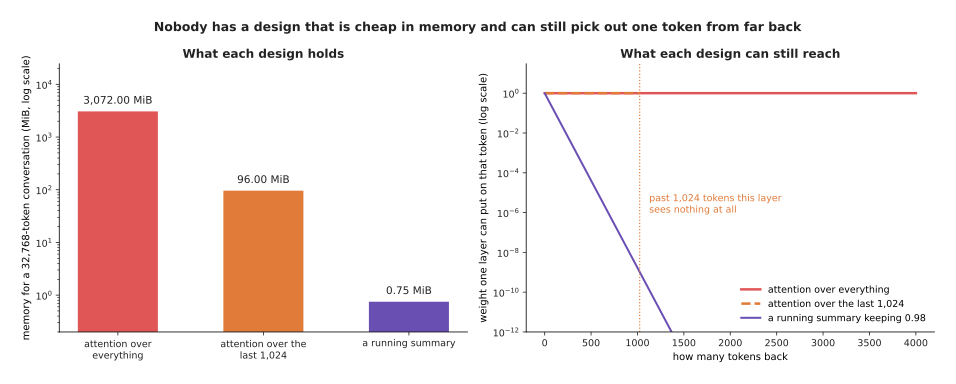

Attention over everything holds 3,072 MiB and can weight any one token freely, a window of 1,024 holds 96 MiB and sees nothing at all beyond its window, and a running summary holds 0.75 MiB but leaves a token 4,000 back with about 8 divided by a 1 with 36 noughts after it.

The third open thing is the one those bars show, which is that nobody has a
design that is cheap in memory and can still reach back and pick out a single
token exactly. Every cheap design in this chapter gives up exact reach, and the
hybrids work because they pay for a few layers that keep it. Alongside that sit
two more unsolved problems. Models used far beyond the length they were trained
at usually get worse in ways that a short test does not reveal, so the stated
context window of a model and the length at which it still works well are not
the same number. And generation remains tied to memory bandwidth, so a model
twice the size is close to twice as slow to write with, however much arithmetic
the machine can do.

What has not changed is the reason this architecture won. It links any two
positions in one layer, it fills parallel hardware, and it trains on a job that
needs no labels, and no cheaper design has yet matched all three at once.

---

## 7. Where to read next

- [Self-supervised
  pretraining](../07_pretraining-and-adapting/01_self-supervised-pretraining.md)
  is the next page, and it takes next-token prediction and the other training
  jobs that need no labels, which are what made this architecture worth scaling.
- [Making a model smaller and
  faster](../07_pretraining-and-adapting/04_making-a-model-smaller-and-faster.md)
  attacks the memory-reading cost from the other end, by holding each number in
  fewer bytes.
- [Vision backbones](../09_models-that-see/01_vision-backbones.md) shows the
  same block reading patches of a picture, where the sequence is short and the
  quadratic cost hardly matters.
- [Behaviour cloning and action
  chunks](../12_models-that-act/01_behaviour-cloning-and-action-chunks.md) shows
  a transformer whose tokens are camera pictures and arm movements, and whose
  sequences are short enough to run at control speed.
- [Running and evaluating a
  model](../13_using-a-model-for-real/01_running-and-evaluating-a-model.md)
  turns the latency arithmetic here into a budget for a real robot.
- [Language models](../../07_learned-models/07_language-models/01_overview.md)
  in the catalogue book lists the named models built this way and what each one
  costs to run on a robot.

---

## 8. Using it in Python

The arithmetic on this page is small enough to write out, and doing so is the
quickest way to see that the designs differ in bookkeeping rather than in
mystery. The code below builds the two masks from section 4, works out the cache
sizes from the same section, and runs the running summary from section 5 for a
thousand steps.

```python
import torch

# Section 4: the full causal mask, and the same mask narrowed to a window.
n, window = 16, 4
rows, cols = torch.arange(n)[:, None], torch.arange(n)[None, :]
causal = cols <= rows
windowed = causal & (rows - cols < window)
print(int(causal.sum()), int(windowed.sum()))        # 136 58

# Section 4: what one token costs in the cache, with fewer key-value heads.
layers, heads, head_dim, nbytes = 24, 16, 64, 2
for kv_heads in (16, 4, 1):
    print(kv_heads, 2 * layers * kv_heads * head_dim * nbytes // 1024, 'KiB a token')
# 16 96 KiB a token / 4 24 KiB a token / 1 6 KiB a token

# Section 5: one running summary, and how much of the first token survives.
keep = 0.98
summary = 0.0
for step in range(1000):
    summary = keep * summary + (1.0 if step == 0 else 0.0)
print(f'{summary:.2e}')                              # 1.72e-09

# Section 4 again: the library will build and use a causal mask for you.
q = k = v = torch.randn(1, heads, n, head_dim)
out = torch.nn.functional.scaled_dot_product_attention(q, k, v, is_causal=True)
print(out.shape)                                     # torch.Size([1, 16, 16, 64])
```

The library gives you the fast path and the bookkeeping. Passing `is_causal=True`
means PyTorch never builds the mask as a grid of numbers and never works out the
pairs it would throw away, which is where most of the saving in a real
implementation comes from. Hugging Face's `transformers` package goes further and
holds the key-value cache for you, grouped keys and values included, so the
difference between sixteen key-value heads and four is a line in a configuration
file rather than a change to any code you write.

What you still have to decide is which of the trades on this page you are making.
You choose the window, if you use one, which fixes how far a single layer reaches
and how much cache each token costs. You choose how many heads share a key and a
value, which is close to free and should usually be taken. If you reach for a
state-space or hybrid design you choose how many attention layers to keep, and
that choice decides whether your model can still find one sentence in a long
document or only remember roughly what the document was about.

The useful habit is to work the arithmetic out before choosing, exactly as this
page has, because the length you intend to run at decides everything. Below
about twelve times the model's width, attention is a small part of the bill and
the plain design is the right one. Far above it, the pairs are the bill, and that
is where every design in sections 4 and 5 earns its complication.
