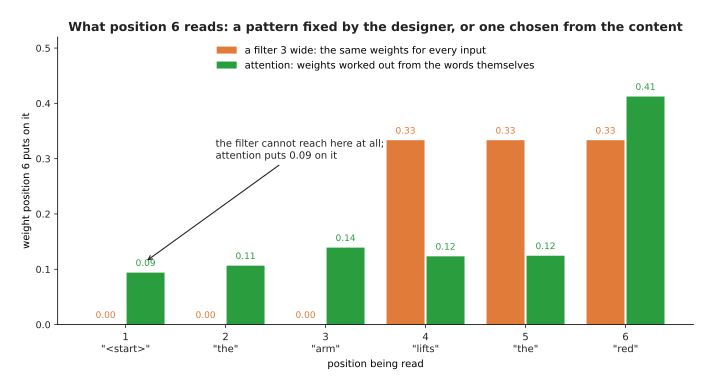
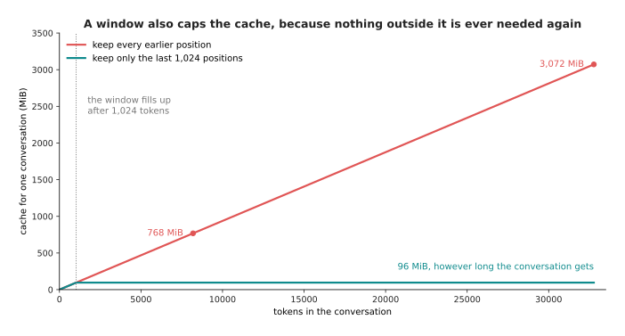
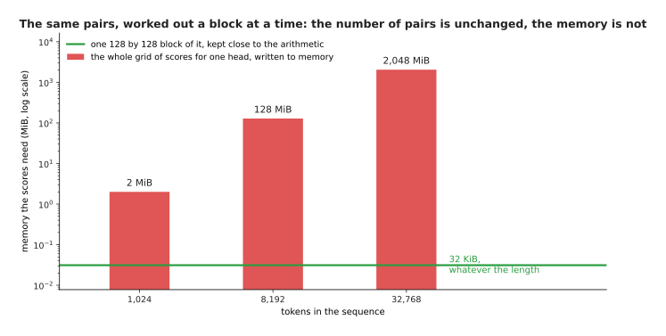
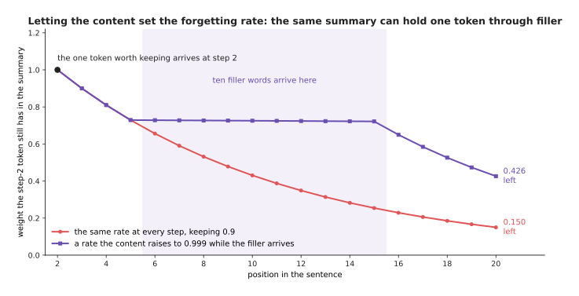
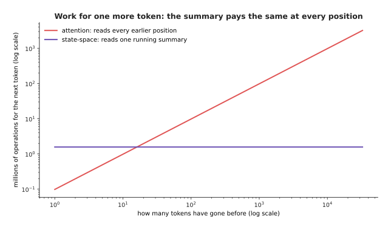
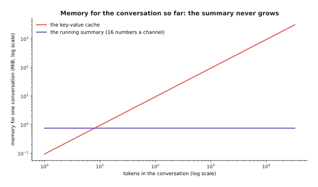
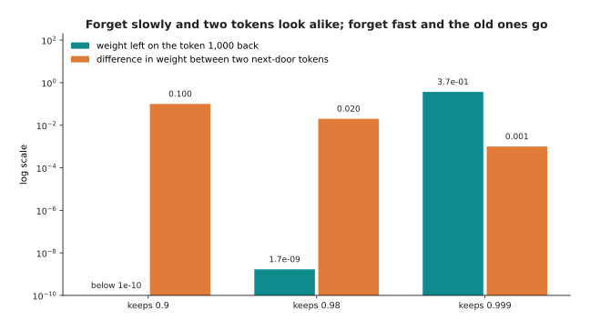
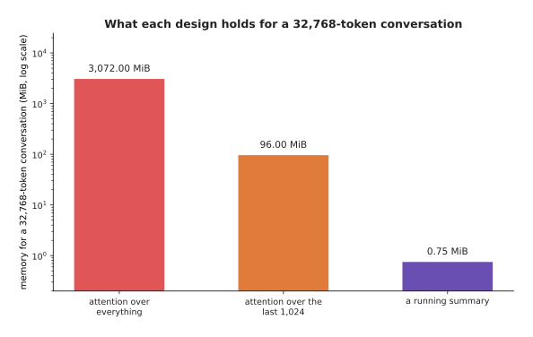
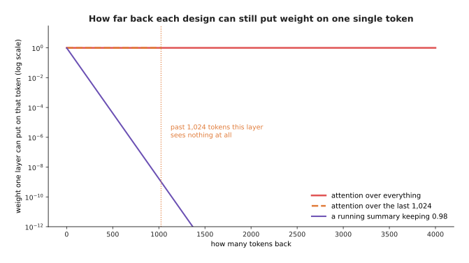

# Why the transformer won

The page before this one, [training and running a
transformer](03_training-and-running-a-transformer.md), showed what a transformer
is trained to do and what happens when it writes an answer, and it counted the
costs of both. This page asks the question that should always follow a design:
why this design rather than the obvious alternative? Almost every model a robot
uses today has transformer blocks somewhere inside it. That is a strange thing to
accept without knowing what the designs it replaced could not do.

So this page names the alternatives, and it shows with arithmetic, rather than
with opinion, what each of them cannot do. Two alternatives matter. The first is
the convolution, which reads a small window of neighbouring positions. The second
is the recurrent network, which walks along a sequence from the start and carries
a summary of what it has seen. Each of the two is still a sensible idea, and the
convolution is still used every day in vision. However, neither of them can do
the one thing attention does, which is to let any position affect any other
position inside a single layer.

The page is then honest about the price of attention. Attention is expensive in a
way that grows with the square of the length of the text. Its cache grows without
any limit. A generation step spends almost all of its time reading memory. Those
costs are real, and people are attacking all three of them. The second half of
the page goes through the attacks in the order in which they change the
arithmetic. It ends with the designs that give up attention in most of their
layers, and with what that choice costs them.

The page is written for a reader who has read the three pages before it in this
chapter, so it does not explain attention, the block, the causal mask or the
key-value cache again. It also assumes that you have met the
[convolution](../02_inside-a-network/04_what-a-network-can-learn.md), which was
introduced as the first special layer. By the end of the page you will know what
a convolution and a recurrent network each fail at, what the three costs of
attention are in numbers, and what each known repair buys and gives up.

Every number in the pictures comes from `docs/diagrams/the_transformer_2.py`,
which prints them as it draws. The memory figures and the time figures use the
same stated example model that the previous page used, with 24 layers, 16 heads
of 64 numbers, a width of 1,024 and two bytes for every number, together with one
stated example accelerator. No real product and no published model is described
by any figure here.

## Contents

1. [What a convolution could not do](#1-what-a-convolution-could-not-do)
2. [What a recurrent network could not do](#2-what-a-recurrent-network-could-not-do)
3. [What the transformer costs](#3-what-the-transformer-costs)
4. [Cutting the cost of attention](#4-cutting-the-cost-of-attention)
5. [Carrying a running summary instead](#5-carrying-a-running-summary-instead)
6. [What is still open](#6-what-is-still-open)
7. [Where to read next](#7-where-to-read-next)
8. [Using it in Python](#8-using-it-in-python)

---

## 1. What a convolution could not do

Before transformers, the usual way to handle a sequence of any kind was a
convolution. A convolution slides a small filter along the sequence, so that each
position mixes itself with a few neighbours, where the filter is the small set of
weights that does the mixing. A convolution is cheap, it uses the same handful of
weights everywhere, and it is very good at local patterns, which is why it still
reads pictures well. Its limit is simple to state. In one layer a position can
only reach the neighbours its filter covers, so to join two distant positions you
have to stack layers until their windows overlap.

The picture below counts the layers that stacking needs, for three filter widths
and for attention.


To let two positions 512 tokens apart affect each other, a filter three positions wide needs 256 layers, a filter seven positions wide needs 86 layers, and attention needs one layer.

Those numbers are the whole argument. A filter three positions wide extends its
reach by one position on each side per layer, so the distance it can cross grows
in a straight line with depth. Meanwhile the sequences people want to read grow
far faster than anyone wants to stack layers.

The picture below draws that growth for one starting position. Each row is one
more layer, and the shaded cells are the positions that can reach the starting
position.


Starting from one position, a stack of filters three positions wide sees 1, then 3, then 5, then 7, then 9, then 11 positions, so it takes 8 layers before the middle position has seen all 17.

The shaded region is a cone, and the cone is the problem. Information from the far
end of a sentence has to be passed up through every layer in between, and at each
layer it is mixed with everything else, before it can reach the position that
needs it. A word that changes the meaning of a sentence forty tokens later is
therefore something a shallow convolution cannot use at all.

There is a well-known repair for the reach, which is to spread the filter out by
leaving gaps between the positions it reads, and to double those gaps at each
layer. A filter with gaps in it is called a dilated filter. The picture below
measures what that repair buys.


Doubling the gaps in the filter at each layer turns a reach of 25 positions after 12 layers into a reach of 8,191 positions, so covering a context of 8,192 positions takes 13 such layers instead of 4,096 plain ones.

The repair works for the reach, because the reach then doubles at every layer
instead of growing by two. What the repair does not fix is that the pattern of
what each position reads is chosen by whoever designed the network, and that
pattern is the same for every input. Attention chooses its pattern from the
content instead. The picture below compares the two patterns at one position of
the example sentence.



A filter three positions wide always reads positions 4, 5 and 6 with a weight of 0.333 each, whatever the words are, while attention at the same position puts 0.094 on position 1, 0.412 on position 6 and something in between on the rest, and those weights come from the words themselves.

That difference is the thing a convolution cannot do at any depth. The word that
needs the far end of the sentence can look at the far end of the sentence, and
the next word can look somewhere else entirely. The next section shows that the
other obvious alternative fails for a completely different reason.

---

## 2. What a recurrent network could not do

The other way to read a sequence is to walk along it from the start, carrying a
summary of everything seen so far and updating that summary at each position.
Networks built this way are called recurrent, and they held this job for years,
so it is worth one section to say exactly why they lost it. They are no longer
the thing to learn, and the rest of this book does not use them. However, both of
the reasons they lost matter for what comes later on this page.

The first reason is about hardware rather than about accuracy. A recurrent layer
cannot start position two until position one has finished, because position two
needs the summary that position one produced. The picture below counts the steps
that have to wait for each other, and then turns those steps into time.


Reading 2,048 positions one after another takes 2,048 steps that cannot overlap, which at a stated 20 microseconds a step is 41.0 milliseconds, while a transformer does 24 layer steps whatever the length, which is 0.48 milliseconds.

The comparison is not fair in the arithmetic, because each of the transformer's
24 steps is a far larger piece of work than one of the recurrent network's 2,048
steps. That unfairness is exactly the point. A graphics processing unit does
thousands of multiplications at the same moment, so one enormous step fills it,
while two thousand tiny steps leave most of it with nothing to do.

The picture below draws that idea directly. Each grid has one row for each time
slot and one column for each position, and a cell is filled in when that position
is being worked on in that slot.


The recurrent layer uses 12 time slots with 1 position worked on in each slot, while attention uses 1 time slot with all 12 positions in it.

That picture is the shape of the whole difference. Training a transformer can use
a batch of positions, and a batch of sequences on top of that, to fill the
hardware. A recurrent network can only widen the batch of sequences, because it
must still take the positions in order. When the quantity of text being trained
on grew into the trillions of tokens, a design that leaves most of the machine
idle stopped being affordable.

The second reason is about what survives the walk. Anything a recurrent network
learns from position one has to be carried through every position in between, and
each step multiplies it by some number. So unless that number is extremely close
to 1, the signal shrinks away. The picture below measures how much is left after
a given number of steps.


If each step keeps 98 per cent of what came in, then a signal from 100 positions back is down to 0.133 of its strength, and a signal from 511 positions back is down to 0.0000328 of it.

Attention does not pass anything along, because the position that needs an old
token reads that token directly in one layer, and so nothing shrinks. Various
repairs were built for recurrent networks, with gates that try to hold a value
steady, and the repairs helped. However, they did not remove the walk. Remember
that curve, because section 5 returns to it when the walk comes back in a new
form.

---

## 3. What the transformer costs

Attention bought the ability to link any two positions in one layer, and the
ability to use the whole machine at once. Both of those abilities are paid for in the
same place, which is that attention calculates a score for every allowed pair of
positions. The previous page counted the pairs. This section calculates when the
pairs start to cost more than everything else the model does.

The picture below draws two kinds of work in one layer against the length of the
sequence. The first kind is the work done with the weights, and the second kind
is the work done on pairs of positions.


For a model of width 1,024, the work spent on pairs of positions passes the work spent on the weights at 12,288 tokens, which is twelve times the width.

The crossing point is worth remembering as a rule rather than as a number,
because it is twelve times the width of the model for the shape used here. Below
the crossing point, a transformer is mostly a pile of matrix multiplications with
its weights, and the attention is a detail. Above the crossing point, the model
is mostly attention, and the weights are the detail.

The picture below gives the same fact as a share of one layer's work.


At 1,024 tokens only 8 per cent of a layer's arithmetic is spent on pairs of positions, at 8,192 tokens it is 40 per cent, and at 131,072 tokens it is 91 per cent.

This is why the quadratic cost was ignored for years and then suddenly was not,
where quadratic means that the cost grows with the square of the length. Nobody
minds a cost that is 8 per cent of the work, and everybody minds a cost that is
91 per cent. So it was the length people wanted to use that turned a known
weakness into the main problem. The memory behaves in the same way, and the
picture below shows where it ends.


With a stated 24 GiB of memory, and with the weights taking 0.63 GiB, one conversation can hold at most 255,316 tokens before the cache has used everything that is left.

The cache sets a hard ceiling, and that ceiling has nothing to do with whether the
model could understand a longer text. The cache also makes the model slower as
the conversation goes on, because each new token has to read the whole cache. The
picture below measures that slowing.


On the example accelerator a token costs 0.67 milliseconds at the start of a conversation, 1.48 milliseconds after 8,192 tokens and 13.56 milliseconds after 131,072 tokens, which is 74 tokens a second instead of 1,490.

That rising curve is what a reader sees when a reply starts quickly and then
becomes slow, and a robot that holds one long conversation all day will notice
it. There are three costs, then.
The pairs grow with the square of the length, the cache grows without limit, and
each token reads everything. The rest of the page is about what is being done to
each of the three.

---

## 4. Cutting the cost of attention

The first family of repairs keeps attention exactly as it is and simply forbids
most of the pairs. The simplest version is **sliding-window attention**. In
sliding-window attention a position may look only at itself and at a fixed number
of positions behind it, so the allowed pairs form a band rather than a triangle.
The picture below draws both patterns over sixteen positions.


Over 16 positions a causal mask allows 136 pairs and a window of 4 allows 58, and over 8,192 positions a window of 1,024 allows 7.86 million pairs instead of 33.56 million, which is 23 per cent of them.

The saving grows with the length, because the band has a fixed width while the
triangle keeps widening. The cache shrinks for the same reason, since nothing
outside the window ever has to be kept. The picture below draws what that does to
the memory of one conversation.



A window of 1,024 positions holds 96 MiB of cache however long the conversation gets, while keeping every earlier position holds 768 MiB at 8,192 tokens and 3,072 MiB at 32,768 tokens.

The obvious objection to a window is that the model can no longer reach back
beyond the window. The answer is that one layer cannot, but a stack of layers
can, because each layer moves the reach one window further back. The picture
below measures that reach.


A window of 1,024 positions stacked 24 layers deep can be touched by a position 24,553 tokens back, because each layer moves the reach one window further.

The reach comes back, but it comes back in the weakened form that section 2
described. Information from far away now has to be passed up through layers
rather than read directly, and it is mixed with other things at every step. That
is the real cost of a window, and it is why released models that use windows
usually keep some layers that still attend to everything.

A window is not the only fixed pattern you can choose. The picture below adds a
small number of positions that every row may read, on top of the window.


Keeping a window of 3 allows 45 of the 136 pairs, and adding the first 2 positions as positions everybody may look at brings the count to 70.

That second grid is the idea behind **sparse attention**, which is any fixed
pattern of allowed pairs that is chosen in advance to be much smaller than the
full triangle. Mixing a local window with a few positions that everyone may read
is the most common choice. It keeps nearby detail, and it keeps a route by which
anything can reach everything in a single step. The cost is the one named in
section 1, which is that the pattern is chosen by the designer rather than by the
content.

A different and very cheap repair leaves the pairs alone and attacks the cache
directly. Each head normally has its own key and its own value, but no rule says
that it must. **Grouped-query attention** gives each group of heads one shared
key and one shared value, while every head keeps its own query, so the heads
still ask different questions of the same stored material. **Multi-query
attention** is the extreme case, with one shared pair for all of the heads. The
picture below measures both.


Sharing one key and value across four heads cuts the cache from 96 KiB a token to 24 KiB a token, and sharing one across all sixteen heads cuts it to 6 KiB, so an 8,192-token conversation holds 192 MiB or 48 MiB instead of 768 MiB.

The saving is exact and large, and the loss in quality is small. That trade is
good enough that sharing is now the normal choice rather than the exception.

One more family is worth naming beside these, and it is the family of careful
implementations, of which FlashAttention is the best known. These work the scores
out in small blocks, and they never write the whole grid of scores to memory. The
picture below shows what that grid would cost if it were written.



The whole grid of scores for one head takes 128 MiB at 8,192 tokens and 2,048 MiB at 32,768 tokens, while one 128 by 128 block of that grid takes 32 KiB whatever the length is.

These implementations do not change the number of pairs at all, so they do not
move either curve in the first picture of section 3. What they remove is the
memory that holding the whole grid used to need.

---

## 5. Carrying a running summary instead

Every repair in section 4 kept attention and removed some of its pairs. The other
line of work goes back to the idea that section 2 rejected, which is the walk
along the sequence carrying a summary. It asks whether that walk can be rebuilt
so that it keeps the cheapness without the two faults. Designs of this kind are
called **state-space models**, because the summary they carry is called a state,
and the best known of them is **Mamba**.

The picture below runs the simplest possible version of such a summary over a
short sequence.


With a summary that keeps 90 per cent of itself at each step, a value delivered at step 2 still counts 0.478 at step 9 and 0.206 at step 17.

A state-space layer is a running summary in exactly that sense. It holds a fixed
set of numbers. At every position it shrinks what it is holding by some amount,
adds what the new token brings, and passes the result on. The arithmetic drawn
above is the simplest possible version, with one number and one fixed shrinking
rate. A real layer carries many such summaries at once, usually a few tens of
numbers for each of the model's channels, and it lets the input decide how fast
each summary forgets.

That last part is what separates these designs from the recurrent networks of
section 2. Because the content sets the forgetting rate, the layer can hold one
token steady while unimportant words go past, and then forget quickly again. The
picture below follows one token under a fixed rate and under a rate the content
raises while filler words arrive.



A fixed rate of 0.9 leaves the step-2 token with 0.150 of its weight by step 20, while a rate that the content raises to 0.999 while the ten filler words arrive leaves it with 0.426, which is 2.8 times more.

Letting the content set the rate is also what lets these layers be calculated with
a parallel scan rather than with a strict walk, where a parallel scan is a method
that computes a running total for every position at once instead of one position
at a time. That is how such a model is trained on a whole batch of positions
together.

Two numbers make these designs attractive, and the first of them is the work for
one more token. The picture below draws that work against the number of tokens
that came before.



At 8,192 tokens an attention layer does 805 million operations for the next token, while a state-space layer does 1.57 million operations at that position and at every other position.

The second number is the memory the conversation holds, and the picture below
draws that against the length of the conversation.



At 8,192 tokens an attention layer holds 768 MiB for the conversation, while a state-space layer holds 0.75 MiB however long the conversation gets.

Those flat lines are what makes these designs attractive. The cost of one more token does not
depend on how many tokens came before it, the memory never grows, and so the
ceiling in section 3 disappears. The question is what has been given up, and the
answer is exact and easy to show in two steps. The first step is how much of an
old token is left in the summary, which the picture below gives for three
forgetting rates.


A summary that keeps 0.98 at each step leaves a token from 1,000 positions back with 1.7 thousand-millionths of its weight, while one that keeps 0.999 still holds 0.368 of that weight.

Keeping more of the summary at each step therefore saves the far past. The second
step is the price of keeping more, and the picture below puts that price beside
the saving.



A rate of 0.999 leaves 0.368 of the weight on the token 1,000 positions back, but it leaves a difference of only 0.001 between two tokens that sit next to each other, while a rate of 0.9 keeps those two tokens 0.100 apart and leaves almost nothing of the old token.

The two pictures together are the trade, and the trade cannot be escaped by
choosing a better rate. If the layer forgets quickly, then the far past is gone.
If it forgets slowly, then the far past survives but everything in it is averaged
together, because the weights on two tokens that sit next to each other then
differ by only 0.001 and nothing in the summary can tell them apart. Attention
has neither problem, because it can put whatever weight it likes on any single
earlier token and leave the rest at zero. That ability is exactly what is needed
to find the one sentence in a long document that answers a question.

So the answer that is winning at the moment is to use both kinds of layer, in a
**hybrid architecture** that keeps a small number of attention layers and makes
the rest state-space layers. The picture below measures what that mixture holds.


Keeping attention in 3 of the 24 layers and running summaries in the rest holds 385 MiB at 32,768 tokens instead of 3,072 MiB, which is 8 times less.

The few attention layers keep the ability to reach back and pick out one token.
The many cheap layers do the rest of the work. The memory then follows the small
number of attention layers rather than the large number of layers. Published
hybrids differ in how many attention layers they keep and in where they put them,
and that ratio is the main thing their designers argue about, because it is the
one control that trades cost against exact recall.

---

## 6. What is still open

The repairs in the last two sections move the costs about rather than removing
them, and this section says plainly what is left. The first open problem is that
a long context is still slow to use even when it fits in memory, and the two
halves of the job are slow for different reasons. The picture below measures both
halves.


Reading an 8,192-token prompt takes 88 milliseconds because its arithmetic is done in one wide pass, while writing 256 tokens of answer takes 381 milliseconds, so a token of answer costs 139 times as much as a token of prompt.

Reading the prompt is limited by arithmetic, so it gets faster on a machine with
more arithmetic. Writing the answer is limited by memory reading, so it does not
get faster on such a machine. Nobody has removed that gap. Every method that
helps, such as answering several conversations at the same time, helps the
service rather than the person who is waiting.

The second open problem is that long contexts and many users compete for the same
memory. The memory that holds one conversation of 32,768 tokens is the memory that
would have held sixteen conversations of 2,048 tokens. The picture below counts
the conversations that fit.


In a stated 24 GiB, 124 conversations of 2,048 tokens fit at once but only 7 conversations of 32,768 tokens do, and sharing keys and values across four groups raises those numbers to 498 and 31.

Sharing keys and values multiplies every one of those counts by four, and it does
not change how quickly they fall as the context grows.

The third open problem takes two pictures, because it is a gap between two things
that no design has yet closed. The first picture is what each of three designs
holds in memory for one long conversation.



For a conversation of 32,768 tokens, attention over everything holds 3,072 MiB, a window of 1,024 holds 96 MiB, and a running summary holds 0.75 MiB.

The second picture is how much weight each of those three designs can put on a
single token a given distance back, which is the ability the memory was buying.



Attention over everything can give any one token any weight it likes at any distance, a window of 1,024 can give nothing at all beyond 1,024 tokens, and a running summary that keeps 0.98 leaves a token 4,000 positions back with about 8 divided by 10 raised to the power 36.

Nobody has a design that is cheap in memory and can still reach back and pick out
a single token exactly. Every cheap design in this chapter gives up exact reach,
and the hybrids work because they pay for a few layers that keep it.

Two more unsolved problems sit beside that one. Models used far beyond the length
they were trained at usually get worse in ways that a short test does not reveal,
so the stated context window of a model and the length at which it still works
well are not the same number. And generation remains tied to memory bandwidth, so
a model twice the size is close to twice as slow to write with, however much
arithmetic the machine can do.

What has not changed is the reason this architecture won. It links any two
positions in one layer, it fills parallel hardware, and it trains on a job that
needs no labels. No cheaper design has yet matched all three of those at once.

---

## 7. Where to read next

- [Self-supervised
  pretraining](../07_pretraining-and-adapting/01_self-supervised-pretraining.md)
  is the next page, and it takes next-token prediction and the other training
  jobs that need no labels, which are what made this architecture worth scaling.
- [Making a model smaller and
  faster](../07_pretraining-and-adapting/04_making-a-model-smaller-and-faster.md)
  attacks the memory-reading cost from the other end, by holding each number in
  fewer bytes.
- [Vision backbones](../09_models-that-see/01_vision-backbones.md) shows the
  same block reading patches of a picture, where the sequence is short and the
  quadratic cost hardly matters.
- [Behaviour cloning and action
  chunks](../12_models-that-act/01_behaviour-cloning-and-action-chunks.md) shows
  a transformer whose tokens are camera pictures and arm movements, and whose
  sequences are short enough to run at control speed.
- [Running and evaluating a
  model](../14_using-a-model-for-real/01_running-and-evaluating-a-model.md)
  turns the latency arithmetic here into a budget for a real robot.
- [Language models](../../07_learned-models/07_language-models/01_overview.md)
  in the catalogue book lists the named models built this way and what each one
  costs to run on a robot.

---

## 8. Using it in Python

The arithmetic on this page is small enough to write out, and writing it out is
the quickest way to see that these designs differ in bookkeeping rather than in
anything mysterious. The code below builds the two masks from section 4,
calculates the cache sizes from the same section, and runs the running summary
from section 5 for a thousand steps.

```python
import torch

# Section 4: the full causal mask, and the same mask narrowed to a window.
n, window = 16, 4
rows, cols = torch.arange(n)[:, None], torch.arange(n)[None, :]
causal = cols <= rows
windowed = causal & (rows - cols < window)
print(int(causal.sum()), int(windowed.sum()))        # 136 58

# Section 4: what one token costs in the cache, with fewer key-value heads.
layers, heads, head_dim, nbytes = 24, 16, 64, 2
for kv_heads in (16, 4, 1):
    print(kv_heads, 2 * layers * kv_heads * head_dim * nbytes // 1024, 'KiB a token')
# 16 96 KiB a token / 4 24 KiB a token / 1 6 KiB a token

# Section 5: one running summary, and how much of the first token survives.
keep = 0.98
summary = 0.0
for step in range(1000):
    summary = keep * summary + (1.0 if step == 0 else 0.0)
print(f'{summary:.2e}')                              # 1.72e-09

# Section 4 again: the library will build and use a causal mask for you.
q = k = v = torch.randn(1, heads, n, head_dim)
out = torch.nn.functional.scaled_dot_product_attention(q, k, v, is_causal=True)
print(out.shape)                                     # torch.Size([1, 16, 16, 64])
```

The library gives you the fast path and the bookkeeping. Passing `is_causal=True`
means that PyTorch never builds the mask as a grid of numbers, and never
calculates the pairs it would throw away, which is where most of the saving in a
real implementation comes from. Hugging Face's `transformers` package goes
further and holds the key-value cache for you, with grouped keys and values
included, so the difference between sixteen key-value heads and four is a line in
a configuration file rather than a change to any code you write.

What you still have to decide is which of the trades on this page you are making.
You choose the window, if you use one, which fixes how far a single layer reaches
and how much cache each token costs. You choose how many heads share a key and a
value, which costs almost nothing and should usually be taken. If you reach for a
state-space design or a hybrid design, then you choose how many attention layers
to keep, and that choice decides whether your model can still find one sentence
in a long document or can only remember roughly what the document was about.

The useful habit is to do the arithmetic before choosing, exactly as this page
has done, because the length you intend to run at decides everything. Below about
twelve times the model's width, attention is a small part of the cost and the
plain design is the right one. Far above that length, the pairs are most of the
cost, and that is where every design in sections 4 and 5 earns its extra complication.
